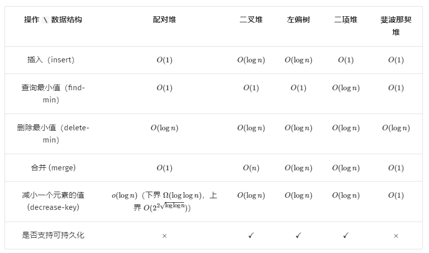
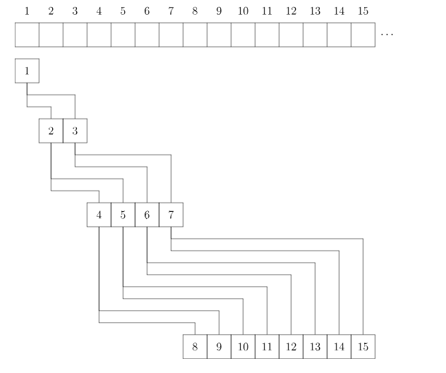

## 堆的概述

堆是一棵树，其每个节点都有一个键值，且每个节点的键值都大于等于/小于等于其父亲的键值。每个节点的键值都大于等于其父亲键值的堆叫做小根堆，否则叫做大根堆。（小根）堆主要支持的操作有：插入一个数、查询最小值、删除最小值、合并两个堆、减小一个元素的值。一些功能强大的堆（可并堆）还能（高效地）支持 merge 等操作。一些功能更强大的堆还支持可持久化，也就是对任意历史版本进行查询或者操作，产生新的版本


## 堆的分类

习惯上，不加限定提到「堆」时往往都指二叉堆。

 

## 二叉堆

### 结构

从二叉堆的结构说起，它是一棵二叉树，并且是完全二叉树，每个结点中存有一个元素（或者说，有个权值）。

**堆性质：父亲的权值不小于儿子的权值（大根堆）**

### 操作

#### 插入操作

 

插入操作是指向二叉堆中插入一个元素，要保证插入后也是一棵完全二叉树。

最简单的方法就是，最下一层最右边的叶子之后插入。如果最下一层已满，就新增一层。

插入之后可能会不满足堆性质，然后进行**向上调整**：如果这个结点的权值大于它父亲的权值，就交换，重复此过程直到不满足或者到根。可以证明，插入之后向上调整后，没有其他结点会不满足堆性质。

**向上调整的时间复杂度是logn的。**

#### 删除操作

删除操作指删除堆中最大的元素，即删除根结点。但是如果直接删除，则变成了两个堆，难以处理。所以不妨考虑插入操作的逆过程，设法将根结点移到最后一个结点，然后直接删掉。然而实际上不好做，我们通常采用的方法是，把根结点和最后一个结点直接交换。于是直接删掉（在最后一个结点处的）根结点，但是新的根结点可能不满足堆性质……

**向下调整**：在该结点的儿子中，找一个最大的，与该结点交换，重复此过程直到底层。

可以证明，删除并向下调整后，没有其他结点不满足堆性质。

时间复杂度logn

#### 增加权重

很显然，直接修改后，向上调整一次即可，时间复杂度为logn

## 常见模板

### 数组

 

### 原地堆

```java
// 原地堆化（最大堆）
// 堆化可以保证 h[0] 是堆顶元素，且 h[i] >= max(h[2*i+1], h[2*i+2])
private void heapify(int[] h) {
    // 下标 >= h.length / 2 的元素是二叉树的叶子，无需下沉
    // 倒着遍历，从而保证 i 的左右子树一定是堆，那么 sink(h, i) 就可以把左右子树合并成一个堆
    for (int i = h.length / 2 - 1; i >= 0; i--) {
        sink(h, i);
    }
}

// 把 h[i] 不断下沉，直到 i 的左右儿子都 <= h[i]
private void sink(int[] h, int i) {
    int n = h.length;
    while (2 * i + 1 < n) {
        int j = 2 * i + 1; // i 的左儿子
        if (j + 1 < n && h[j + 1] > h[j]) { // i 的右儿子比 i 的左儿子大
            j++;
        }
        if (h[j] <= h[i]) { // 说明 i 的左右儿子都 <= h[i]，停止下沉
            break;
        }
        swap(h, i, j); // 下沉
        i = j;
    }
}

// 交换 h[i] 和 h[j]
private void swap(int[] h, int i, int j) {
    int tmp = h[i];
    h[i] = h[j];
    h[j] = tmp;
}
```

