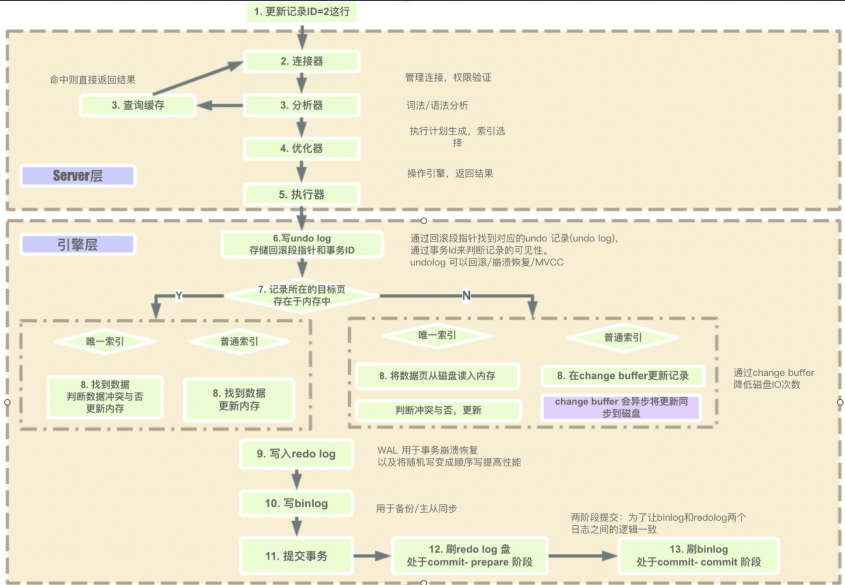
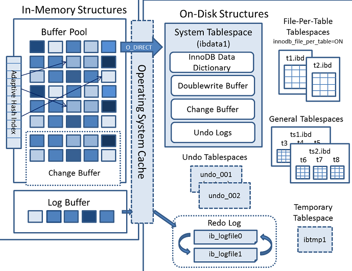
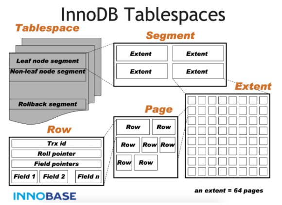
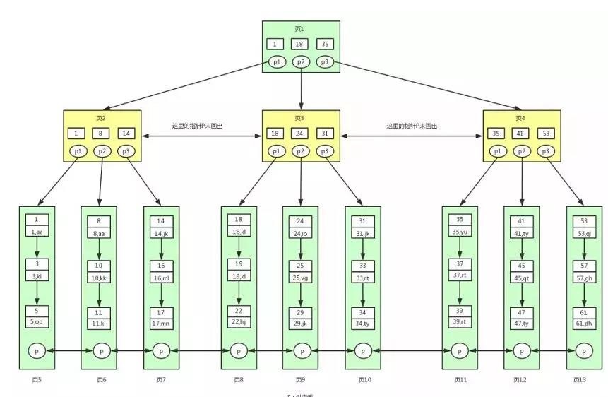
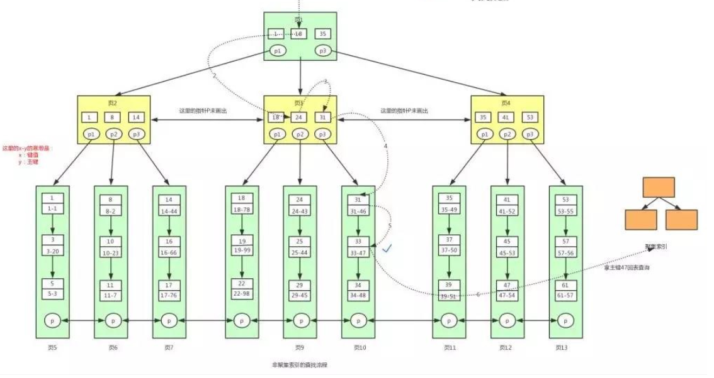
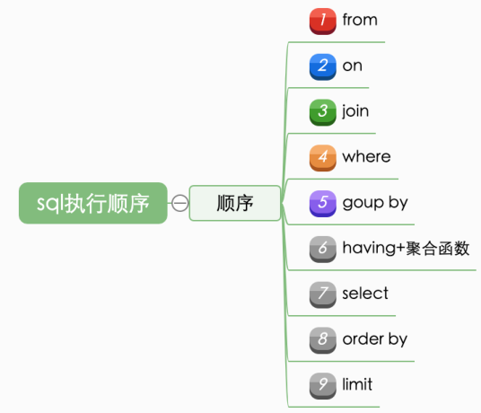
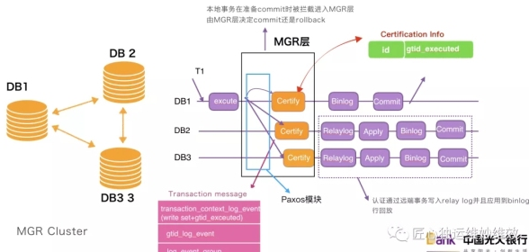

## 1. 系统的性能    
&emsp;&emsp;现在的应用的性能问题，80%都是访问数据库导致的，只要我们解决大部分数据库的问题，应用的性能将会有一个非常大的提高。
## 2. 数据库原理
### 2.1. 数据库的范式
### 2.2. 常见的数据库
* 关系型数据库
* 内存数据库
* 图数据库
* 时序数据库
* Newsql/分布式数据库
* Nosql数据库
* 其它关系数据库

### 2.3. Mysql功能
### 2.4. Mysql的原理
#### 2.4.1. MySQL整体过程
  
* Redolog 是innod引擎记录事务操作后的日志。  
* Undolog 是回滚日志
* Binlog 二进制日志用户主从复制
#### 2.4.2. Mysql的存储结构  
&emsp;&emsp;参考文章：https://mp.weixin.qq.com/s/wr2gJGQSA8QH_lmPh1XOkw    
&emsp;&emsp;mysql不会直接修改磁盘数据，先会修改内存结构，然后记录redolog日志，如果内存里没有数据就去磁盘load，如图所示这个内存的地方就是bufferpoll。      
&emsp;&emsp;Mysql中的磁盘中的数据是以页为单位，存在bufferpoll中的数据就是页的集合。这个内存相当于一个缓存，它采用用缓存常用的淘汰算法（LRU）    
&emsp;&emsp;当操作的数据不在buffer之中，会将对页的修改放在changebuffer中，记录redolog后，会再将原本的数据加载到内存中，做一个merage操作，merge后会放到buffer之中。聚簇索引需要校验主键，因此需要去访问主键索引，就不会使用changebuffer    
&emsp;&emsp;Doublewrite Buffer为了防止写到磁盘时发生错误，相当于双写备份，可参考https://blog.csdn.net/jolly10/article/details/79791574，单纯使用redo日志无法保证数据的正确性，因为undo写入时一个页时是16kb，而一个扇区写入512b，无法原子写入，如果有扇区写不正确，那么页数据将不会完整，double write记录了页中的逻辑关系。  
  
mysql在磁盘中的结构分为两大类：
* 表空间：系统的表空间、临时表空间、常规表空间、undo表空间、file-per表空间。
  * 系统表空间：innodb数据字典、doublewrite buffer, changebuffer  
  * 常规表空间：是一种共享的表空间，多个表可以共享一个常规表空间。
  * file-per表空间：5.7版本默认开启，每个表可以有自己单独的ibd数据文件，而不是像之前默认统一放到系统表空间文件之中了。
  * 临时表空间：默认在ibtmp1 之中。        
    

* Redo日志：存储redo刷到磁盘的数据    
  
#### 2.4.3. Mysql的表空间
    
  表空间又可以具体来分为：segment、extent、page
  * 表空间tablespace会包含段segment，可以配置创建表空间的时候初始化指定数量的段。
  * segment会包含Extent，这个也是空间分配的最小单元，innodb把逻辑上有关联Extent归属为一个段。
  * Extent是由数据页Page构成，每个segment都会从表空间FREE_PAGE中分配64个page至extent上面。一个Extent在物理上是连续分配的一段空间
  * 一个extent，默认由64个连续的页（Page）组成，每个页默认大小为16K。
  * 当page不够用的时候，就会以extent为单元进行扩展。并会按照以下原则进行扩展：如果当前小于1个extent，则扩展到1个extent；当表空间小于32MB时，每次扩展一个extent；表空间大于32MB，每次扩展4个extent。
  页分为索引页、Undo页、系统页、innode页、文件元数据页    

（参考文章：https://www.jianshu.com/p/d4cc0ea9d097）  
 如果在写入双写缓冲出错，可以直接丢弃该缓冲页，而如果是写入数据页时出错，则可以根据双写缓冲区数据恢复表空间文件  
 
### 2.4.3. Mysql索引
参考：https://blog.csdn.net/kwinH/article/details/114583497?utm_medium=distribute.pc_relevant.none-task-blog-2~default~baidujs_title~default-0.control&spm=1001.2101.3001.4242    
单表不超过2000万的原因，mysql的存储最小单元是页16k  
Innodb和MyISAM默认的索引是Btree索引
* hash索引  
  &emsp;&emsp;对某一列进行hash操作得到hash值，hash可以一次定位效率很高，但是mysql的默认存储引擎并没有采用它。  
  &emsp;&emsp;但是它无法满足范围查询、无法排序、不能使用组合索引的前一个字段进行索引查询、如果存在hash冲突需要比较实际的值，如果存在大量的hash冲突，那么检索效率就和单链表的效率一样了。这个跟hashmap类似，java8的如果存在hash冲突过多后，会将hashmap的链表升级成平衡树，这样效率更高。  
  &emsp;&emsp;为了解决以上的缺点就可以使用二叉树了，但是为了保持很好的查询效率需要尽可能保持二叉树的平衡，并且控制树高，因此mysql的树使用b+树，一个叶子可以存储多个节点，并且b+树的非叶子节点会冗余一份到叶子节点上。

* btree索引  
  参考文章（http://www.liuzk.com/410.html）  
  &emsp;&emsp;如果存储使用普通的平衡二叉树，因为存储在磁盘中，需要一次又一次的取出比较，io性能会非常高，因此设计者想到了一个节点存储多个数据的办法。因此b树就出来了，但是b树的节点会存储数据，上层节点的数据越多，那么这个树越矮，查询的次数就越少，而磁盘页的容量是有限的，因此b树性能有限。所以我们可以尽可能减少树的高度，非叶子节点不存数据，只存键，那么就会越矮了。    
    
  &emsp;&emsp;一个页默认大小16kb，根节点一般常驻内存中，所以三层的结构算下来如果一个节点可以村1000个健，那么三层的话就可以1000*1000*1000个数据了
  * 聚集索引：以主键的健作为非叶子节点索引组成的索引结构叫做聚集索引
  * 非聚集索引：以主键其它的属性作为健组成的b+数据结构的索引叫做非聚集索引
  * 回表：如果我们查找的数据还需要从主键的聚集索引中查找，这种就叫做回表
  * 顺序：因为主键是有顺序的可以采用二分法查找
  * 非聚集索引查找步骤：
    * 数据即索引，索引即数据  
    

* 联合索引
  * 单列索引底层节点:(a1)(a2)(a3)
  * 双列联合索引底层节点:(a1,b1)(a2,b2)(a3,b3)
  * 三列联合索引底层节点:(a1,b1,c1)(a2,b2,c2)(a3,b3,c3)

* 索引的左匹配原则  
  由上可知，先按照第一列排序,第一列相同时再按照第二列排序,故而才有了最左匹配原则,既(a,b,c)这种联合索引,a/a,b/a,c/a,b,c分别命中a/a,b/a/a,b,c索引

### 2.5. 事务的四大特性
* 原子性  
  不会存在中间状态，要么全都成功要么全部失败。
* 一致性  
  符合预期
* 隔离性  
  事务之间
* 持久性  

### 2.5.1. 总结
个人理解:   
&emsp;&emsp;其它的属性都是为了保证一致性。而数据库的原子性并不能一定保证一致性的，为了实现原子性，处在同一事务的操作，都会记录操作的记录的undo日志，以保证失败了可以回溯，或者将写入后的记录存入redo日志里，当突然发生了系统崩溃，可以进行恢复。什么时候恢复？什么时候进行回溯呢？这个和es类似，先写redo日志代表成功了，如果后面断电了则从里面恢复，并持久化。    
&emsp;&emsp;即使事务保证了原子性，其实并不能保证一致性。原子性保证一个事务的操作是原子的，要么成功要么不成功。但是如果有多个事务并行执行就可能出现问题，如果没有隔离，就可能出现相互覆盖的问题。比如余额有100，第一个事务增加100块钱，第二个事务扣100，如果不隔离第一个事务读取100更新为200，第二个事务也是读取100扣100，最终就可能出现相互覆盖的问题。为了解决这个问题，数据库引入锁的概念，即事务的隔离性，来保证并发的一致性。这个产生隔离的锁一共有两种，乐观和悲观。      
&emsp;&emsp;悲观锁，就是在操作的时候加锁，根据粒度分有表锁、行锁；根据锁的性质来分，又有共享锁、排他锁等。可能会产生死锁问题，可以使用超时时间等方式解决。      
&emsp;&emsp;乐观锁，就是在真正修改的时候再冲突检测。通过数据变更的版本来控制。一种是利用undo日志的多数据版本，一种是利用内存维护的时间戳

  
注意理解一致性的含义：
* A.  多副本的一致性
* B. 一致性hash.
* C. CAP理论的一致性
* D. ACID里的一致性  
* 这几个的一致性含义都不是一样的

### 2.6. Redo和undo的机制

### 2.7. 事务的隔离性
* 读未提交  
  这种可能产生脏读问题
* 读已提交  
  解决了脏读的问题，但是可能会产生可重复读的问题
* 可重复读  
  解决了脏读、可重复读，但是可能出现幻读
* 串行化  
  直接隔离，性能较差。
### 2.8. 数据库的锁
* 乐观锁
* 悲观锁
* 表级锁
* 行级锁
* 间隙锁
* 死锁

### 2.9. Mysql事务机制
### 2.10.

## 3. Mysql优化
### 3.1. Mysql语句执行顺序
  

以上是标准的语句执行顺序，mysql会对语句进行优化，也可能不按照上述的顺序执行。

### 3.2. Sql的优化
* 如何发现sql需要优化  
  通过慢查询日志

* 设计表结构如何优化
  * 选择了合适的存储引擎
  * 选择合适的数据类型
  * Where
  * 不要使用隐式转换
  * 主键最好单调递增？  
    * 会产生页分裂的问题
  * 主键长度不能过大？会导致辅助索引存储的主键占用过大。
  * 主键是如何设计？Uuid，自增，雪花、时间戳！
  * 

* 大批量写入如何优化？  
  减少sql语句的解析，可以尽可能使用批量语句从而减少交互、可以暂时关闭索引和约束。
* 数据更新  
  避免范围更新，可能会产生间隙锁？什么是间隙锁？

* 查询优化
  * 如果查询大量数据，就没必要使用关系数据库了，可以采用es，solar等全文检索技术
  * 前缀匹配原则、like注意事项、走不走索引
  * 避免使用临时表
  * 报表类的数据可以日末统计成汇总报表，尽量单表计算
  * 连接查询如何优化？
  * 索引失效的情况有哪些？
  * not in、or
  * 如何进行分页查询？
  * 常见的分页插件count计算因为连接的问题，性能不高

  
&emsp;&emsp;可以自定义count；另外的优化方向,当如果查询的页很深，可以采取倒序查询，可以使用带id的非精确分页，甚至可以借助缓存记录的总数。后续还可以记录上一页的id，下一页查询的时候带着下一页的id去查询，设计主键的时候设计成自增会有好处。  

  
  
&emsp;&emsp;SELECT * from user  limit 100001,20;start越往后，性能越差。

## 4. 数据库经验总结
### 4.1. Mysql的参数调优
* 连接数
* Buffer，查询缓存、允许查询的数据大小等等。
* 超时时间

### 4.2. 数据库表的设计
* 字段长度
* 执行引擎
* 字段选择
* 精度
* 时间戳
* 导出备份
* 冗余字段
* 碎片
* 如何修改表结构

## 5. 数据库集群
&emsp;&emsp;单机数据库存在单点故障问题，查询和写入量大，会存在性能问题，比如查询请求量大会影响写入等等。  
&emsp;&emsp;在以上的基础上，数据本身的量变得很大会加重上述问题，比如查询性可能会进一步降低，维护将会变得非常困难（恢复dump将花费非常多的时间）  
&emsp;&emsp;如何解决上述问题呢？解决查询对数据库的影响，可以使用从库，进行读写分离，这里就用到了主从复制技术，使用从库也可以进行主从切换故障恢复，解决了单点故障的问题，但是主从复制的机制也带来了一致性的问题，为了解决数据量过大的问题，可以进行分库分表，拆分分为垂直拆分和水平拆分，拆分也涉及到了一致性的问题，如何去解决这些问题都是一个很深刻的命题。  
&emsp;&emsp;下面我们把以上提到的几个技术进行探讨
### 5.1. 主从复制  
mysql的主从复制是从2000年引进的  
第一版是最原始粗暴的后面陆续进行了改进  

* 传统异步主从复制  
  数据的完整性依赖主库的不丢失，如果存在丢失或者宕机都可能导致从库的数据不一致。可以配置mha架构，只要机器不宕机，可以第三方插件抓取日志来补全从库。但是磁盘损坏一致性的问题没有办法了，需要半同步复制

* 半同步主从复制  
  至少等待一个从库有收到日志，主库才返回结果。即主库写入binlog日志后，等待从库的relay log的ack，如果有的话主库才返回成功。

* 组复制  
  基于paxos协议实现组复制。需要理解paxos协议的内容  

### 5.2. 读写分离
&emsp;&emsp;为了降低数据库的压力，可以在代码进行读写分离，可以使用相应的框架在代码里实现写入走主库，读取走从库。市面上有动态切换数据源的组件，但是侵入性都太强，而且还可能一个事务，读走从写走主，数据不一致的问题。Shardingjdbc解决，在一个事务里都走主库；也可以使用类似于ShardingSphere的中间件来解决，它对外暴露mysql协议，其它语言都可以应用。
### 5.3. 高可用
不高可用就是系统不可用的时间很长，高可用与之相反。如何减少不可用时间呢，我们可以让数据库的能够自动的恢复或者主从切换。在以前是手动切换的，自动切换可以利用MHA技术，使得30s内可以主从切换，并且会binlog日志复制，如果机器宕机了那就没有办法了。
基于paxos的mgr主从复制能够机器宕机了也能有很高的容错性。  

了解MySQL Cluster和Orchestrator原理

