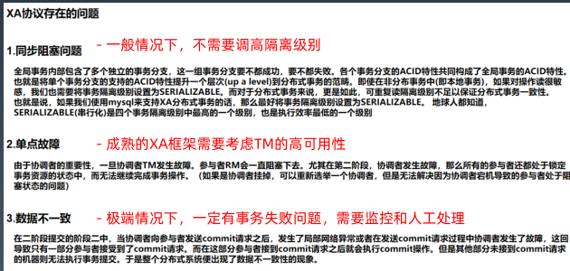

## 1. 为什么需要分布式事务  
当系统和数据库被拆分成分布式系统或者数据库的时候，比如应用A业务关联应用B的业务，业务请求时，应用A的请求成功，应用B的业务失败，从整体来看数据不一致

## 2. 什么是分布式事务
分布式条件下，多个节点操作的整体事务一致性
## 3. 如何实现分布式事务
### 3.1. 强一致
通过某种手段，比如2pc、3pc的方式使得事务像单机数据库一样保持一致，但是性能有较大得损耗。
### 3.1.1. xa
XA是一个数据库本身支持的分布式事务协议，它是基于2pc来保证数据的一致性；
事务管理器可以对资源管理器进行的操作有：
* xa_open,xa_close：建立和关闭与资源管理器的连接。
* xa_start,xa_end：开始和结束一个本地事务。
* xa_prepare,xa_commit,xa_rollback：预提交、提交和回滚一个本地事务。
* xa_recover：回滚一个已进行预提交的事务。
* ax_开头的函数使资源管理器可以动态地在事务管理器中进行注册，并可以对XID(TRANSACTION IDS)进行操作。
* ax_reg,ax_unreg；允许一个资源管理器在一个TMS(TRANSACTION MANAGER SERVER)  

xa存在的问题：  

### 3.2. Base
最终一致，通过消息、定时任务、日志/表的方式补偿数据达到最终一致性，允许数据有一段时间处于不一致的状态。
#### 3.2.1. Tcc
* 需要改动业务
* 需要解决3个问题：
  * 空回滚
  * 防悬挂控制
  * 幂等设计
#### 3.2.2. Saga
长事务模式
#### 3.2.3. At
一套自动补充机制
#### 3.2.4. 隔离级别
一般是读未提交，即有一段时间可以看到脏数据。
#### 3.2.5. Seata
#### 3.2.6. hmily

## 4. Shangdingsphere
#### 4.1. xa
#### 4.2. seata的柔性事务
