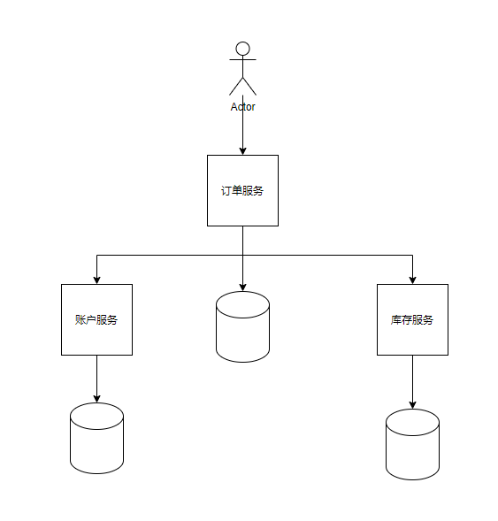

## 1. 概要
### 1.1. 何为分布式系统？
我理解就是通过网络来互相协作的不同组件组成的系统，叫做分布式系统。相比于单体系统而言，应用更容易扩展，服务职责更加分明，适合现在复杂业务场景和更大规模的访问量。分布式系统带来了一些问题，比如本文要描述的分布式事务问题、不同组件如何交互问题等。还有服务注册/配置、监控、日志等很多问题都会更加复杂。  

  
这里只简单介绍了分布式系统，这是一个非常大的话题，有兴趣可以自行了解。
### 1.2. 何为分布式事务？
简单来说，就是分布式 + 事务 = 分布式事务，面对一个分布式系统，我的操作能够达到像单体应用事务一样的效果，那么这个事务就叫做分布式事务了。严格来说，事务应该具有ACID这四个特性，后面我们会对ACID进行说明。
### 1.3. 分布式算法/理论有哪些？
* CAP，在分布式系统中，一致性、可用性、分区容错性最多只能同时实现两点。
* Paxos，可以解决分布式一致性的问题
* Raft，Paxos算法的衍生，zk（ZAB），rocketmq
* 一致性hash  

一致性哈希的目的就是为了在节点数目发生改变时尽可能少的迁移数据，将所有的存储节点排列在收尾相接的Hash环上，每个key在计算Hash 后会顺时针找到临接的存储节点存放。而当有节点加入或退 时，仅影响该节点在Hash环上顺时针相邻的后续节点
### 1.4. 分布式事务解决方案？
* 2PC/3PC
* 事务消息、本地消息表
* Seata框架

## 2. ACID
* 原子性（Atomicity），可以理解为一个事务内的所有操作要么都执行，要么都不执行。
* 一致性（Consistency），可以理解为数据是满足完整性约束的，也就是不会存在中间状态的数据。如转账的例子。
* 隔离性（Isolation），指的是多个事务并发执行的时候不会互相干扰，即一个事务内部的数据对于其他事务来说是隔离的。
* 持久性（Durability），指的是一个事务完成了之后数据就被永远保存下来，之后的其他操作或故障都不会对事务的结果产生影响。    

  

## 3. CAP理论  

加州大学的计算机科学家 Eric Brewer 提出，分布式系统有三个指标
* 一致性（Consistency）  
  写操作之后的读操作，必须返回该值。举例来说，某条记录是 v0，用户向 G1 发起一个写操作，将其改为 v1，用户的读操作就会得到 v1。这就叫一致性。

* 可用性（Availability）  
  用户可以选择向 G1 或 G2 发起读操作。不管是哪台服务器，只要收到请求，就必须告诉用户，到底是 v0 还是 v1，否则就不满足可用性。

* 分区容错性（Partition tolerance）  
  一般来说，分区容错无法避免，这个指标一般是总是成立的，因为两个节点总是可能无法联通的。

  

&emsp;&emsp;一致性和可用性不能同时存在，因为分区容错的原因，如果保持一致性，则需要要求g2必须保持同步到g1的数据，但是分区容错的原因，一直同步不过来，那么系统只能属于不可用状态。如果保持g2的可用状态，那么就可能造成g1，g2的数据不一致，所以不可能同时保证。  

&emsp;&emsp;网络通信不管怎么样都会有失败的可能，只能尽量提高可用性
（参考文章：http://www.ruanyifeng.com/blog/2018/07/cap.html）

## 4. 2PC 
* 准备阶段
* 提交阶段  

  

### 4.1. 如果第二阶段失败了怎么呢？
* 提交  
  不断重试，因为有可能一些参与者的事务已经提交成功了，这个时候只有一条路，就是头铁往前冲，不断的重试，直到提交成功，到最后真的不行只能人工介入处理。
* 回滚  
  也是不断重试，因为还没有提交，则会一直阻塞。
### 4.2. 如果第一阶段超时了？
直接当作回滚处理
### 4.3. 第一阶段成功了，还未提交，突然协调者挂了怎么办？
会一直阻塞，资源都被锁定住
### 4.4.第一阶段成功了，提交发起后，突然协调者挂了怎么办？  
&emsp;&emsp;协调者如果故障那么是不是可以做成一个高可用的集群呢，我们重新选举一个协调者，但是新的协调者并不知道哪个参与者是不是提交了，有可能未提交的参与者同时挂了，那么你去询问无法知道结果，我们可以通过记录统一的协调日志，通过日志来回溯去执行提交，但是参与者挂了，不知道他是否已经提交了，要不要往它那里发送呢。  
&emsp;&emsp;所以2PC是无法绝对保证一致性的。这里就是cap的分区容错因为一直存在，要么保持可用，要么保持一致。一般选择就是尽量保持一致，先返回，然后一直重试或者人工处理。
## 5. 3PC  
  
该方式如2PC图示，新增了准备阶段，其它的阶段一样，这会面临2PC相同的问题。  
它具有如下的特点：
* 这里新增了一个阶段，会进一步减小性能
* 参与者等待提交时，有超时机制，如果超时则自动提交，因为3pc认为这时大概率时提交的，但是也有可能是回滚。
* 3PC 是个纯的理论上的东西，做了一些努力工作但是效果不大，而且更复杂性能更差。
* **3PC 的引入是为了解决提交阶段 2PC 协调者和某参与者都挂了之后新选举的协调者不知道当前应该提交还是回滚的问题。**（目前没理解）
## 6. 本地消息表
* 将业务的执行和将消息放入本地消息表中的操作放在同一个事务中
* 事务执行成功的记录的状态为成功否则为失败
* 将后台任务定时去读取本地消息表处理
* 多次处理失败的进行人工处理
* 本地消息表其实实现的是最终一致性，容忍了数据暂时不一致的情况

## 7. TCC
Tcc详情请参考seata的分布式介绍  

## 8. 消息事务（Rocketmq）
* 发送方先向broker发送半消息（消费方暂时不能收到）
* 发送方执行本地事务，执行成功则向broker commit消息否则，rollback
* 发送方提供反查消息执行情况的接口，broker超时可查发送方是否执行成功，自行commit或者rollback
* Commit的消息会发送至消费方，消费方执行事务。    

  
&emsp;&emsp;由此可见消息事务也是最终一致性，如果消费方事务没有执行成功，则消费不了消息，要么重试，要么人工处理，重试一定次数后消息就会被放入到死信队列之中了，这也是最大努力通知型了。

## 9. 总结
&emsp;&emsp;2pc和3pc是都有可能产生阻塞和不一致风险的，本地事务表和rocketmq事务消息都是最大努力的柔性事务，可用在时效不那么敏感的业务上。tcc是属于业务侵入型，从业务的角度来避免分布式事务的问题，比如转账时制造一个冻结的中间状态。具体如何使用需要结合业务场景，服务架构具体分析，目前是没有完美的解决方案。

