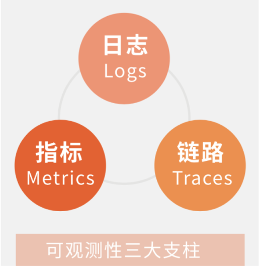

## 1. 开头

​	监控系统是一个很大的概念，在以前主要是针对系统运行的硬件和软件进行监控和告警，那个时候数据量不大，我们使用一些开源监控系统还能勉强支撑系统的稳定运行。到后来虚拟机云、容器云的时代，业务百花齐放，各种技术满天飞，基础架构变成了微服务、分布式，部署了各种中间件，这种越来越复杂的数据中心环境对监控系统提出了越来越高的要求，比如：

* 容易部署

  能和现在的生态兼容较好，能和容器云无缝衔接

* 数据指标贴合实际情况

  能够准确的反应运行质量，比如cpu分钟指标、平均耗时、服务满意度，并且可以灵活配置

* 高性能

  存储能够水平扩展，高效进行数据处理，对系统运行较小。比如应用监控数据发送支持客户端预先处理、采样处理、网络传输消息化、存储使用伸缩性较好的数据库等等手段。

* 告警

  能够支持配置合理的规则，对可能发生的异常进行告警，告警通知还需要能够自动检测合并告警，避免告警轰炸。这对告警产品设计提出了很高的要求。

本篇文章我结合这几年在公司推进监控体系建设经验，来谈一谈关于系统监控技术相关的心得和感受。后面再分析一些常见的开源apm监控产品原理。其中包括cat、skywalking、zipkin、prometheus。

## 2. 可观测性

## 3. 监控的分类

我们从不同的维度来进行分类，从监控对象的角度来看，可以分为:

* 网络监控
* 存储监控
* 服务器监控
* 应用监控

从程序运行的角度来看我们又可以分为：

* 应用监控

  为应用的运行状态相关，其中包括jvm、接口请求、调用各种中间件、产生的日志，我这里统一叫做应用层监控

* 中间件监控

  程序所需要依赖的中间件，其实也是应用的一种，但是这个应用和业务应用不一样，比如mysql、redis、mq、es等中间件服务。

* 基础资源监控

  机器自身的资源情况监控，比如cpu、内存，还有机器与机器之间的网络传输、存储等。

每种监控都涉及不同的监控指标，一般需要使用不同的数据采集方式。如果需要做到全栈监控，需要将这些监控数据进行汇总处理。在搭建公司级别全栈监控体系时不要求大求全，这么多监控指标，一不小心就会掉进海量的监控数据之中无所适从，而且全量存储也不现实，实际对当前问题有价值的数据也就那么几种，需要根据公司系统和业务经验不断的调整和优化设计。

### 3.1. 应用监控（APM）

​	Application Performance Monitoring，即应用性能监控APM。目前 APM 开源、商业化产品比较成熟，大部分公司生产环境都部署了 APM 系统。其中这个系统包括包括应用程序的运行状态监控、性能监控、日志监控及调用链跟踪等。例如如下为我们自研的apm系统请求链路图：

 

请求Undertow一共花费了2070ms，其中经过了springmvc，然后springresttempate调用接口花费了2005ms大部分的时间，那么这次对外提供服务响应慢的根源就找到了。

​	在以前做日志系统的为了完善监控，增加了指标，例如elastic的elk增加了apm插件。Splunk也不想把自己停留在仅仅是处理日志的产品上，因此收购了DataDog的主要竞争对手SignalFX，后面OpenTelemetry这个组织的出现也标志着业界意识到需要将系统的可观测性变成一种统一的标准和规范，提出了可观测性的三支柱的概念，即Metric（指标），Log(日志），Trace（链路追踪），其目标是推动更多的应用或者服务能够遵循这一规范，提供相应的可观测性能力。开源的Prometheus又提出一种叫Exporter的概念，号召所有的中间件、应用能够主动地将指标（Metric）暴露出来给监控软件调用，与此同时也需要有软件支持读取提供的可观测性数据，并对其进行进一步地性能分析和监控

​	在这里首先我们需要了解系统的可观测性。即可观测性的目的是提供基于系统内部状态（白盒），而非系统外部输出（黑盒）进行控制的理论依据，简单而言，可观测性就是为复杂IT系统寻求白盒监控能力，可观测技术的本质，是通过系统的外部数据，分析系统的内部状态，从而做出控制指令

 

* skywalking

  * 优点

    无侵入、全链路监控、社区活跃、遵循opentrace协议、性能损耗低

  * 缺点

    ui比较流水线、多数报表用处不大

* cat

  * 优点

    报表丰富实用，系统健壮性好，支持动态配置采样、跨机房路由、告警策略和规则配置灵活

  * 缺点

    需要自己埋点，全链路支持较弱、服务端UI技术陈旧

* zipkin

  * 优点

    全链路监控、扩展性好

  * 缺点

    没有聚合报表、没有告警

* Pinpoint

  * 优点

    无侵入、全链路监控、监控粒度很细、UI美观

  * 缺点

    性能稍差、社区活跃度低、不兼容opentrace协议、只支持java和php

* 听云（商业）

以上的这些组件，或多或少时围绕着系统的可观测性进行设计的，cat的指标很丰富，skywalking的链路很深入同时也支持log日志

## 4. 架构设计

## 5. 总结