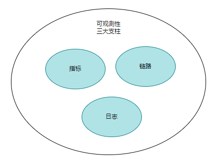
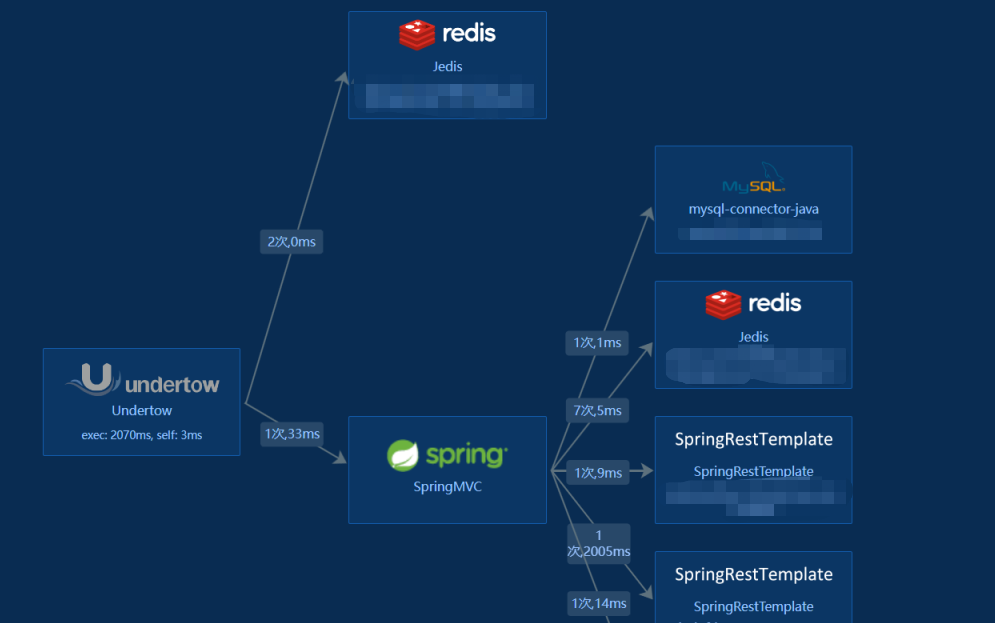
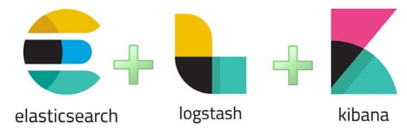
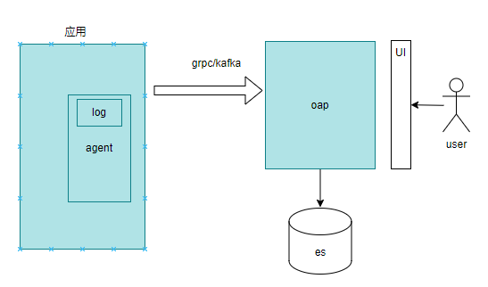
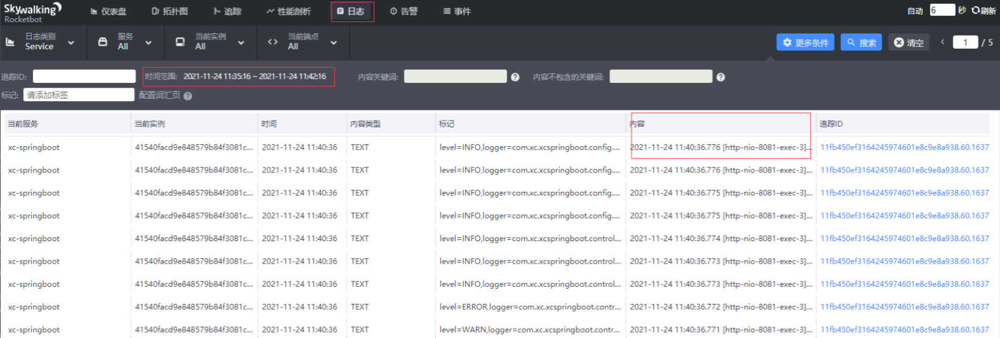
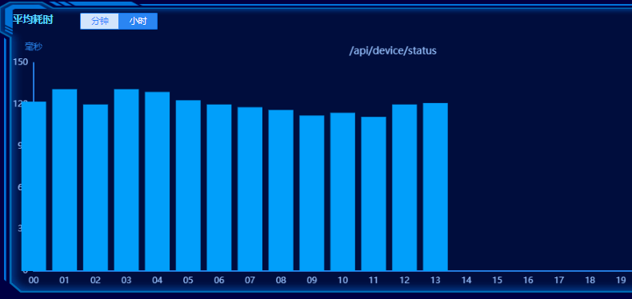
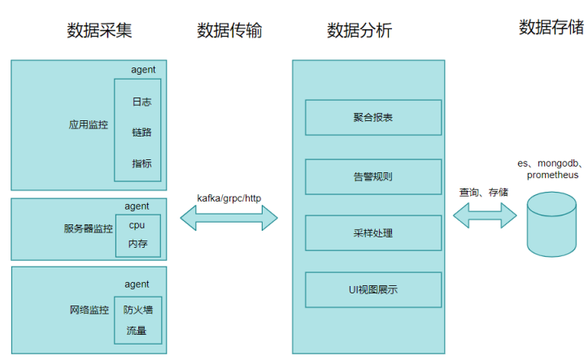

## 1. 开头

​	监控系统是一个很大的概念，在以前主要是针对系统运行的硬件和软件进行监控和告警，那个时候数据量不大，我们使用一些开源监控系统还能勉强支撑系统的稳定运行。到后来虚拟机云、容器云的时代，业务百花齐放，各种技术满天飞，基础架构变成了微服务、分布式，部署了各种中间件，这种越来越复杂的数据中心环境对监控系统提出了越来越高的要求，比如：

* 容易部署

  能和现在的生态兼容较好，能和容器云无缝衔接

* 数据指标贴合实际情况

  能够准确的反应运行质量，比如cpu分钟指标、平均耗时、服务满意度，并且可以灵活配置

* 高性能

  存储能够水平扩展，高效进行数据处理，对系统运行较小。比如应用监控数据发送支持客户端预先处理、采样处理、网络传输消息化、存储使用伸缩性较好的数据库等等手段。

* 告警

  能够支持配置合理的规则，对可能发生的异常进行告警，告警通知还需要能够自动检测合并告警，避免告警轰炸。这对告警产品设计提出了很高的要求。

本篇文章我结合这几年在公司推进监控体系建设经验，来谈一谈关于系统监控技术相关的心得和感受。后面再分析一些常见的开源apm监控产品原理。其中包括cat、skywalking、zipkin、prometheus。

## 2. 可观测性

​	在各种系统齐飞的时代，我们需要监控系统的运行状态。这时出现了很多软件服务的公司，如在以前做日志系统的为了完善监控，增加了指标，例如elastic的elk增加了apm插件。Splunk也不想把自己停留在仅仅是处理日志的产品上，收购了SignalFX。

​	后面OpenTelemetry这个组织的出现也标志着业界意识到需要将系统的可观测性变成一种统一的标准和规范，提出了可观测性的三支柱的概念，即Metric（指标），Log(日志），Trace（链路追踪），其目标是推动更多的应用或者服务能够遵循这一规范，提供相应的可观测性能力。开源的Prometheus又提出一种叫Exporter的概念，号召所有的中间件、应用能够主动地将指标（Metric）暴露出来给监控软件调用，与此同时也需要有软件支持读取提供的可观测性数据，并对其进行进一步地性能分析和监控

​	总的来说可观测性的目的是提供基于系统内部状态（白盒），而非系统外部输出（黑盒）进行控制的理论依据，简单而言，可观测性就是为复杂IT系统寻求白盒监控能力，可观测技术的本质，是通过系统的外部数据，分析系统的内部状态，从而做出控制指令

 

## 3. 监控的分类

我们从不同的维度来进行分类，从监控对象的角度来看，可以分为:

* 网络监控
* 存储监控
* 服务器监控
* 应用监控

从程序运行的角度来看我们又可以分为：

* 应用监控

  为应用的运行状态相关，其中包括jvm、接口请求、调用各种中间件、产生的日志，我这里统一叫做应用层监控

* 中间件监控

  程序所需要依赖的中间件，其实也是应用的一种，但是这个应用和业务应用不一样，比如mysql、redis、mq、es等中间件服务。

* 基础资源监控

  机器自身的资源情况监控，比如cpu、内存，还有机器与机器之间的网络传输、存储等。

每种监控都涉及不同的监控指标，一般需要使用不同的数据采集方式。如果需要做到全栈监控，需要将这些监控数据进行汇总处理。在搭建公司级别全栈监控体系时不要求大求全，这么多监控指标，一不小心就会掉进海量的监控数据之中无所适从，而且全量存储也不现实，实际对当前问题有价值的数据也就那么几种，需要根据公司系统和业务经验不断的调整和优化设计

### 3.1. 应用监控（APM）

​	Application Performance Monitoring，即应用性能监控APM。目前 APM 开源、商业化产品比较成熟，大部分公司生产环境都部署了 APM 系统。

* skywalking

  * 优点

    无侵入、全链路监控、社区活跃、遵循opentrace协议、性能损耗低

  * 缺点

    ui比较流水线、多数报表不直观

* cat

  * 优点

    报表丰富实用，系统健壮性好，支持动态配置采样、跨机房路由、告警策略和规则配置灵活

  * 缺点

    需要自己埋点，全链路支持较弱、服务端UI技术陈旧

* zipkin

  * 优点

    全链路监控、扩展性好

  * 缺点

    没有聚合报表、没有告警

* Pinpoint

  * 优点

    无侵入、全链路监控、监控粒度很细、UI美观

  * 缺点

    性能稍差、社区活跃度低、不兼容opentrace协议、只支持java和php

* 听云（商业）

从可观测性的角度来看，具备可观察性能力产品有两个要素，一是能够将需要监控的对象变得可观测（收集其指标、日志和代码链路），二是能够存储、处理、分析这些海量的实时数据。满足这些条件的只有skywalking。cat的指标很丰富无法收集日志和链路，Pinpoint没有日志支持，zipkin只有链路。

APM除了可以截获方法调用，还可以截获TCP、HTTP网络请求，从而获得执行耗时最长的方法和SQL语句、延迟最大的API等信息

其中这个系统包括包括应用程序的运行状态监控、性能监控、日志监控及调用链跟踪等。

#### 3.1.1. 链路

如下为我们自研的apm系统请求链路图：

 

请求Undertow一共花费了2070ms，其中经过了springmvc，然后springresttempate调用接口花费了2005ms大部分的时间，那么这次对外提供服务响应慢的根源就找到了。

#### 3.1.2. 日志

日志区别于指标监控，日志监控采集日志数据将这些数据汇总到日志存储和搜索引擎之中，然后通过可视化界面检索。这就是简单的日志系统。

这里为现在比较流行的架构设计。

 

日志通过logstash整理，然后使用elasticsearch存储，通过kibana来可视化查看

skywalking监控自带日志收集和存储(扩展存储es)的功能，并且和链路数据打通

架构概览：

 

可视化界面：

 

#### 3.1.3. 指标

指标是在⼀段时间内测量的数值。指标可以利用数学建模和预测的方式，获取当前甚至未来一段时间内的系统信息。

例如应用程序在五分钟内使用了多少内存。由于对存储，处理，压缩和检索进行了优化，指标能够更长地保存数据，也更容易进行查询

如下为我们自研系统的指标数据（接口平均耗时）展示：

 

同时监控变化趋势和配置告警时就去用 Metrics，我们可以通过 Metrics 得知某服务 SLA 降低，错误率上升，平均响应时间变大、fullgc次数变大。

指标的数据更加偏向于宏观。通过聚合函数来计算出一类特征的数据。

**具体要排查根因还需要结合日志和链路**。

### 3.2. 中间件监控

中间件在分布式系统中发挥着重要的作用。通俗来讲中间件就是非业务的技术类组件。

对于开发人员而言，我们常见的中间件分类如下：

* 消息中间件

  例如kafka、rocketmq

* 缓存中间件

  redis、memcached

* 存储中间件

  mysql、es、mongdb

* 分布式协调

  zk、nacos

* 分布式事务

  seata

* 任务调度

  xxl-job、elastic-job

* 配置中心

  nacos、apollo

* 流控中心

  sentinel

​	其实这里的中间件定义并不严格，主要是为了区分于业务系统，这些中间件组件或者系统的指标各不相同，由于产品的特性，关注点也不一样，因此没有统一的标准和规范。

​	例如，kafka我们需要关注topic的个数，消费速率、积压情况等。elaticsearch我们需要关注es的内存、分片数、io、段数量、refresh延迟等。redis我们需要关注redis的内存使用量、命中率、连接数等。这些指标各不相同。这些中间件为了提升自身的可观测性，都暴露了相关的性能指标接口，我们可以通过拉取相关的数据。

​	不过最好的方式就是解决方案通常是针对不同的中间件分别开发Agent，**该 Agent 将采集中间件的性能指标并将其统一转化JSON、文本或者其他监控系统能识别的数据格式，然后汇总到监控中心**。

### 3.3. 基础资源监控

#### 3.3.1. 服务器监控

​	这里的服务器，在现在已经演变成了包括物理服务器主机监控、虚拟机监控和容器监控。即使传统的物理主机，公司采购的品牌也各不相同，操作系统版本也可能不一样。

​	服务器的监控指标可以分为两个层面：

* 硬件层

  * cpu使用情况
  * 内存的使用情况
  * 网卡使用情况
  * 磁盘io的使用情况

* 物理层

  cpu温度、风扇转速、电压等

​	如何采集这些不同类型的服务器的数据是一个问题。通常情况：

如何获取这些指标呢？

比如虚拟机可以通过暴露的接口获取，容器可以使用google的cAdvisor，硬件层面可以使用IPMI标准开放的硬件管理接口。还有一些常见的开源软件如Zabbix、Prometheus

#### 3.3.2. 网络监控

网络监控通常基于SNMP。

SNMP位于两种网络模型的顶层即应用层，属于应用层协议，在传输层依靠UDP协议进行传输。SNMP(Simple Network Management Protocol)即简单网络管理协议，主要用在局域网中对设备进行管理，应用最为广泛的是对路由器交换机等网络设备的管理，当然不仅限于网络设备

## 4. 架构设计

​	一个好的监控平台，可以将海量 Metrics/Trace/Log 数据进行整合与统一，并在此基础上实现全链路观测诊断平台，帮助业务解决监控排障、链路梳理、性能分析等问题。

​	所有的监控系统的核心都是采集和处理数据。但是采集的方式可能不一样，有的是推有的是拉，或者两种都有。数据处理其中包括数据的聚合、存储、分析、告警等作用。

 

## 5. 展望

智能监控

各业务线会经常搞些活动来促进用户增长或留存，在准备这些活动时，容量估算是一个必备阶段

故障来源与影响面分析

## 6. 总结