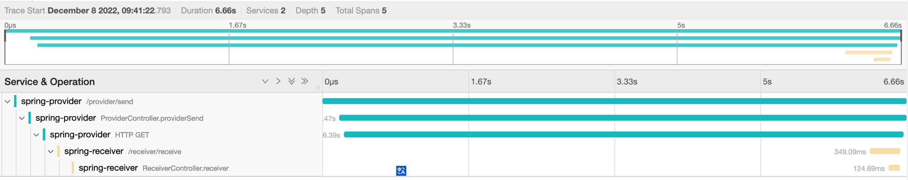
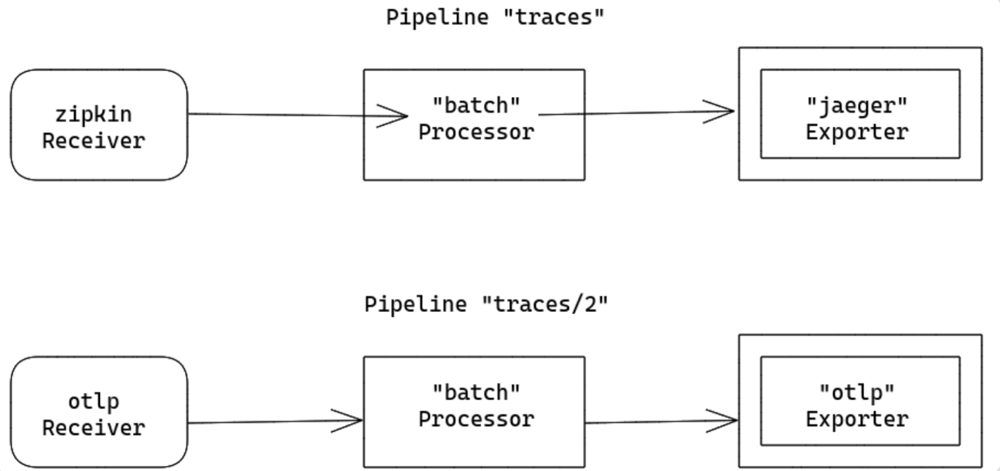

## 可观测协议发展史

### OpenTracing

​	OpenTracing制定了一套平台无关、厂商无关的Trace协议，使得开发人员能够方便的添加或更换分布式追踪系统的实现。在2016年11月的时候CNCF技术委员会投票接受OpenTracing作为Hosted项目，这是CNCF的第三个项目，第一个是Kubernetes，第二个是Prometheus，可见CNCF对OpenTracing背后可观察性的重视。比如大名鼎鼎的Zipkin、Jaeger都遵循OpenTracing协议。

### OpenCensus

​	OpenCensus的发起者可是谷歌，也就是最早提出Tracing概念的公司，而OpenCensus也就是Google Dapper的社区版。OpenCensus和OpenTracing最大的不同在于除了Tracing外，它还把Metrics也包括进来，这样也可以在OpenCensus上做基础的指标监控；还一点不同是OpenCensus并不是单纯的规范制定，他还把包括数据采集的Agent、Collector一股脑都搞了。OpenCensus也有众多的追随者，最近最大的新闻就是微软也宣布加入，OpenCensus可谓是如虎添翼。

### 对比

两套Tracing框架，都有很多追随者

OpenTracing和OpenCensus从功能和特性上来看，各有优缺点，半斤八两。OpenTracing支持的语言更多、相对对其他系统的耦合性要更低；OpenCensus支持Metrics、从API到基础框架都实现了个便

而OpenTracing有很多厂商追随（比如ElasticSearch、Uber、DataDog、还有国产的SkyWalking），OpenCensus背后Google和微软两个大佬就够撑起半边天了

### OpenTelemetry

​	以上的两种协议不分高低，于是OpenTelemetry横空出世。OpenTelemetry的发起者都是OpenTracing和OpenCensus的人，所以项目的第一宗旨就是：兼容OpenTracing和OpenCensus。对于使用OpenTracing或OpenCensus的应用不需要重新改动就可以接入OpenTelemetry

​	Opentelemetry 旨在构建包含 Trace，metrics 和 Logging 的分布式追踪方案，它提供了统一的标准，提供了 Java Agent 解决方案，提供了 Collector 的实现等等，后续的系列文章中我会将这些一一进行介绍

 

OpenTelemetry 源自 OpenCensus 和 OpenTracing 的合并，它的目标是集成 Trace，Metrics，Logging 能力来提供可观测性。过去的分布式追踪往往是各做各的，没有固定的标准，各个分布式追踪方案各显神通，使用不同的协议，不同的标准。但是 OpenTelemetry 不同，它提供了一系列的标准，并且他的可插拔式的架构为将来的协议和数据结构扩展提供了便利的方式。

## 数据模型

### 链路

分布式调用链，俗称调用链，用来记录请求的路径整体路径。下图是一个典型的的请求以及其 RPC 调用的链路

 

#### Span

Span 在调用链中是一个基础的单元，一个调用链是由很多的 Span 组成的。在一个 Span 中会包含如下信息：

* 名称

* 父 Span 的 ID，root 节点的父 Span 为空

* 开始与结束时间戳

* Span Context

* Attributes

* Span 事件

* Span Links
* Span 状态
* Span Kind

#### Span Context

Span Context 可以理解为上下文，是 Span 中包含的不可变的对象。在 Span Context 中包含了：

- traceId：调用链 ID
- spanId：Span 的 ID
- traceFlag：二进制形式的调用链标志位，一般用于表示调用链是否采样（isSampled）
- traceState：承载调用链信息的 K-V 结构列表

#### Attributes

Attributes 是一个用来携带信息的 K-V 结构。

在 java sdk 中可以通过：

```
Span.current().setAttribute("My Attributes", "attr");
```

OpenTelemetry 中默认内置的那些`Instrumentation`都会有定义一些指定标准化的的 Attributes，详情可以参照

#### Span 事件

Span 事件（Events）是一种事件机制，可以将事件触发与具体的 Span 进行绑定，然后在调用链页面展示出来。如下事例：

```
Span.current().addEvent("My Event");
```

 

#### Span Links

Span Links 是一种能够将调用链关联起来的技术，通过配置关联的 Span，可以在页面中展现关联的调用链信息。**不过请注意 Span Links 必须要在 Span 创建时才能添加**，不像 Events 和 Attributes 一样能在 Span 创建之后添加。例子如下：

```
Tracer tracer = GlobalOpenTelemetry.getTracer("1111");

Span span = tracer.spanBuilder("start")
        .addLink(SpanContext.create("ee868088dfd10adbaa459c9aa353b112", "53b11b6c55010604",
                TraceFlags.getDefault(), TraceState.getDefault())).startSpan();
span.end();
```

 

#### Span 状态

Span 状态（Status）是定义好的 Span 的状态，有如下几种：

- Unset
- Ok
- Error

#### Span Kind

Span Kind 是指 Span 类型，有如下几种：

- Server
- Client
- Producer
- Consumer
- Internal

顾名思义 Server/Client 指的是服务端/客户端，Producer/Consumer 指的是生产者/消费者，显然这个一般适用于消息队列，Internal 是内部组件产生的 Span

#### Trace 构建的原理

​	Trace 是由众多的 Span 组成的，而 Span 则是由众多的 Instrumentation 库组成的，这些库由开源作者构建，用于支持不同的组件，如 http 请求，kafka，redis 等等。依托于这些 Instrumentation，调用链可以生成对应的 Span。

​	生成 Span 自然不是难题，问题在于是如何将这些 Span 串联起来的。在 Trace 中有一个唯一的标识 TraceID，而且在 Span 中也有一个 SpanId 和 ParentSpanId，借助这些信息，在 Span 将所有数据推送到服务端后，服务端就能根据这些信息进行重组，然后在界面上进行展示。

​	但是又存在一个问题，TraceId 以及 ParentSpanId 是如何在 Span 间进行传递的呢？

​	这里就涉及到了 Trace 的底层原理了。在这里以 Java Sdk 来举例。在 Sdk 中会定义一个 Context 类用于建立一个内存中的线程隔离的存储机制来存储上游传递的数据。一般来说上游往下游传递数据每个插件都是不同的形式。例如如果是 http 请求，那就借助 Header，如果是 Kafka，也是借助于 Kafka 自带的 prop 来进行数据传递。之后在下游获取到数据后利用 Context 将其存放入内存中，这个过程被称为`extract`，在数据要再往下传递时，需要将内存中数据取出，在解析成 Header 或是其他的形式，这个被称为`inject`。调用链信息正是以此来传递的。

​	Trace 就是依靠`traceparent`来进行传递的，`traceparent`不仅包含了 traceId，还包含了一些`isSample`等等的基础信息。

### Metrics

Metrics 是一种度量标准，用于展现应用的 CPU，内存等等指标级的度量信息。

OpenTelemetry 定义了三种 metrics 仪器：

* **counter**

  累加值，这类指标不会减少，只会不断的累加上去

* **measure**

  一段时间的数据聚合值，表示的是一段时间内的数据累加值

* **observer**

  抓取当前时间的一系列特定值

OpenTelemetry 提供了许多基础的指标计算方式，例如：LongCounter，LongUpDownCounter，DoubleHistogram，DoubleGauge 等等。

```
Meter meter = GlobalOpenTelemetry.meterBuilder("my-meter-instrumentation")
                .setInstrumentationVersion("1.0.0")
                .build();

LongCounter counter = meter
        .counterBuilder("my_metrics")
        .setDescription("My Metrics")
        .setUnit("1")
        .build();

counter.add(100);
```

上述代码是一个简单的创建指标的的例子，这里创建了一个固定值为 100 的名为`my_metrics`的指标，由于是 counter，所以最终指标名为`my_metrics_total`

 

### Logs

​	日志也是 OpenTelemetry 的一大功能之一，不过截止到本文发布前，Logs 功能还未 GA，因此存在变数，后续我们在聊到 Agent 相关内容时会再简单聊聊这部分内容，在这里就先一笔带过。

### baggage

Baggage 用于在 Span 间传递数据。

设想一个场景，你希望在链路的当前的 Span 中将某些数据传递下去，使用 attributes 显示然是不行的，因此需要一些手段将其传递下去，Baggage 就是为此而设计的。

其实 Baggage 的原理基本和调用链的 traceId 的传递基本相似，不同之处是它定义了一个名为 baggage 的 key，而这个 key 中包含的值是以 K-V 形式组织的，因此你可以传递自己想要的值下去。

在早期 Baggage 底层维护了一个 Map 来存储这些数据，后来在某个版本后改成了用数组的形式，每两个数组位置分别存储一对 K-V，并且做了一些特殊的处理来实现删除等操作，有兴趣的可以去看看源码

## Collector

### 数据传输

#### 数据上报

​	客户端会根据一定的规则生成调用链，metrics，logs 等信息，然后就会将其推送到服务器远端。一般来说`OpenTelemetry`的服务端客户端传递数据的请求协议标准是`Http`和`Grpc`协议，在各语言的 sdk 以及服务端实现中都应该包含这两个数据协议的的实现。

​	按照常理来说调用链等数据的数据量极大，因此在客户端就会有一些类似于`Batch`的操作选项，此选项会将多个 Span 信息整合到一起一并发送，以减小网络端的损耗。

​	客户端的这种数据上报我们会统称为`export`，同时，实现这些上报的组件我们统一称作`exporters`。`exporters`会包含不同种的数据协议和格式，默认的格式为`OTLP`。

#### OTLP协议

`OTLP`是指`OpenTelemetry Protocol`，即`OpenTelemetry`数据协议。`OTLP`规范规定了客户端和服务采集端之间的遥测数据的编码,传输和投送。

`OTLP`在实现上分为`OTLP/gRPC`和`OTLP/HTTP`。

* OTLP/HTTP

  `OTLP/HTTP`在数据传输的时候支持两种模式：二进制和 json

  二进制使用`proto3`编码标准，且必须在请求头中标注`Content-Type: application/x-protobuf`

  JSON 格式使用`proto3`标准定义的`JSON Mapping`来处理`Protobuf`和`JSON`之间的映射关系。

* OTLP/gRPC

  普通请求：在客户端和服务端建立连接后，客户端可以持续不断的发送请求到服务端，服务端会一一回应。

  并发请求：客户端可以在服务端未回应前发送下一个请求，以此提高并发量

### Collector是什么

​	`OpenTelemetry`提供了开源的`Collector`来进行客户端数据的上报采集，处理和输出。`otel collector`是一个支持了多种协议，多种数据源的“万能”采集器。可以说是你能想到的很多数据源他都能够直接支持。

​	otel collector使用 golang 实现，到文章目前编写的时候已经发布了 1.0.0 的 rc 版本。Collector区分为了两个项目opentelemetry-collector，opentelemetry-collector-contrib。opentelemetry-collector是核心项目，实现了collector的基本机制以及一些基础的组件，而opentelemetry-collector-contrib则会有大量的组件，而这些组件由于不同原因不便被直接集成到核心的collector中，因此单独构建了一个项目来集成这些组件。我们后续的collector功能介绍和验证都会基于opentelemetry-collector-contrib来进行。

​	OpenTelemetry Collector 旨在提供一个与设备无关的采集器，用于接受，处理和输出观测数据。此外，使用OpenTelemetry Collector也避免了我们运行、维护多个agents/collector，以便支持开源观测数据格式（如Jaeger，Prometheus等）到多个开源或商业后端程序。

OpenTelemetry Collector 有以下几个目标：

* 易用性：合理的默认配置，支持主流的协议，运行和采集开箱即用

- 高性能：在不同的负载和配置下，具有高度的稳定性和性能
- 可观测：可观测服务的典范
- 可扩展性：在不改变核心代码的情况下进行定制
- 统一性：单一代码库，既可作为代理又可作为采集器部署，支持trace、metrics和logs

`otel collector`的组成是很清晰的，分为：

- Receiver
- Processor
- Exporter
- Extension
- Service

### Collector架构设计

OpenTelemetry Collector支持几个主流的开源协议，用于接收和发送观测数据，同时也提供了可插拔的架构设计用于支持更多的协议。

Collector采用Pipeline方式来接收、处理和导出数据，每个Collector可配置一个或多个Pipeline，每个pipeline包含如下组件：

- 一组接收数据的Receiver集合
- 一系列的用于从Receiver获取数据并处理的Processor（可选的）
- 一组用于从processor获取数据并输出的Exporter

每个receiver可能会被多个pipeline共用，多个pipeline也可能会包含同一个Exporter

#### pipeline

一个pipeline定义了一条数据流动的路径：从Collector数据接收开始，然后进一步的处理或修改，到最后通过exporter导出。

pipeline能够处理3种类型数据：trace、metric和logs。数据类型是需要pipeline配置的一个属性。在pipeline中receiver、processor和exporter必须支持某个特定的数据类型，否则在配置加载阶段会抛出*ErrDataTypeIsNotSupported*错误。一个pipeline可以用下图表示：

 

一个pipeline中可能会有多个receiver，多个receiver接受的数据都会推送到第一个processor中，然后数据会被processor处理，之后会被推送到下一个processor中，直到最后一个processor处理完推送数据到exporter中。每个exporter都会获取到所有的数据副本，最后processor使用一个*fanoutconsumer*组件将数据输出到多个exproter中。

pipeline在Collector启动时基于配置文件pipeline定义创建。

一个典型的pipeline配置如下：

```
service:
  pipelines: # section that can contain multiple subsections, one per pipeline
    traces:  # type of the pipeline
      receivers: [otlp, jaeger, zipkin]
      processors: [memory_limiter, batch]
      exporters: [otlp, jaeger, zipkin]
```

这个例子定义了一个"trace"类型数据的pipeline，包含3个receiver、2个processor和3个exporter

配置参考：

#### Receiver

receiver监听某个网络端口并且接收观测数据。通常会配置一个receiver将接收到的数据传送到一个pipeline中，当然也可能是同一个receiver将将接收到的数据传送到多个pipeline中。示例配置如下：

```
receivers:
  otlp:
    protocols:
      grpc:
        endpoint: localhost:4317

service:
  pipelines:
    traces:  # a pipeline of “traces” type
      receivers: [otlp]
      processors: [memory_limiter, batch]
      exporters: [jaeger]
    traces/2:  # another pipeline of “traces” type
      receivers: [otlp]
      processors: [batch]
      exporters: [opencensus]
```

在上面的配置中，*otlp*这个receiver将会把接收到的数据同时发送到*traces*和*traces/2*两个pipeline中。

当Collector加载完配置之后，会生成如下的处理流（为了简化，省略了后面的processor和exporter）

 

当Collector中存在多个pipeline复用一个receiver时，Collector只会创建一个receiver实例，这个实例会把数据发送到多个pipeline的第一个processor中。从receiver到输出到消费者再到processor的数据传播是通过一个同步函数调用完成的。**这也意味着，如果一个processor阻塞调用，那么附属于这个receiver上的其他processor也将被阻塞，无法接收到数据，而receiver本身也会停止处理和转发新收到的数据**。

配置参考：

```
receivers:
  # Data sources: logs
  fluentforward:
    endpoint: 0.0.0.0:8006

  # Data sources: metrics
  hostmetrics:
    scrapers:
      cpu:
      disk:
      filesystem:
      load:
      memory:
      network:
      process:
      processes:
      swap:

  # Data sources: traces
  jaeger:
    protocols:
      grpc:
      thrift_binary:
      thrift_compact:
      thrift_http:

  # Data sources: traces
  kafka:
    protocol_version: 2.0.0

  # Data sources: traces, metrics
  opencensus:

  # Data sources: traces, metrics, logs
  otlp:
    protocols:
      grpc:
      http:

  # Data sources: metrics
  prometheus:
    config:
      scrape_configs:
        - job_name: "otel-collector"
          scrape_interval: 5s
          static_configs:
            - targets: ["localhost:8888"]

  # Data sources: traces
  zipkin:

```


#### exporter

exporter通常将收到数据发送到某个网络上地址。允许一个pipeline中配置多个同类型的exporter，例如如下示例配置了2个*otlp*类型的exporter以发送数据到不同OTLP端点：

```
exporters:
  otlp/1:
    endpoint: example.com:4317
  otlp/2:
    endpoint: localhost:14317
```

通常情况下一个exporter从一个pipeline中获取数据，但是也可能是多个pipeline发送数据到同一个exporter：

```
exporters:
  jaeger:
    protocols:
      grpc:
        endpoint: localhost:14250

service:
  pipelines:
    traces:  # a pipeline of “traces” type
      receivers: [zipkin]
      processors: [memory_limiter]
      exporters: [jaeger]
    traces/2:  # another pipeline of “traces” type
      receivers: [otlp]
      processors: [batch]
      exporters: [jaeger]
```

在上面的实例中，*jaeger*这个exporter将接受来自pipeline *traces*和pipeline *traces/2* 的数据。当Collector加载完配置后，会生成如下的处理流：

 

配置参考：

```
exporters:
  # Data sources: traces, metrics, logs
  file:
    path: ./filename.json

  # Data sources: traces
  jaeger:
    endpoint: "jaeger-all-in-one:14250"
    tls:
      cert_file: cert.pem
      key_file: cert-key.pem

  # Data sources: traces
  kafka:
    protocol_version: 2.0.0

  # Data sources: traces, metrics, logs
  logging:
    loglevel: debug

  # Data sources: traces, metrics
  opencensus:
    endpoint: "otelcol2:55678"

  # Data sources: traces, metrics, logs
  otlp:
    endpoint: otelcol2:4317
    tls:
      cert_file: cert.pem
      key_file: cert-key.pem

  # Data sources: traces, metrics
  otlphttp:
    endpoint: https://example.com:4318/v1/traces

  # Data sources: metrics
  prometheus:
    endpoint: "prometheus:8889"
    namespace: "default"

  # Data sources: metrics
  prometheusremotewrite:
    endpoint: "http://some.url:9411/api/prom/push"
    # For official Prometheus (e.g. running via Docker)
    # endpoint: 'http://prometheus:9090/api/v1/write'
    # tls:
    #   insecure: true

  # Data sources: traces
  zipkin:
    endpoint: "http://localhost:9411/api/v2/spans"

```


#### Processors

一个pipeline可以包含多个串联的processor。第一个processor接受来自一个或多个recevier的数据，最后一个processor将处理完的数据发送到一个或多个exporter中。第一个和最后一个之间的所有processor严格地只从前面的一个processor接收数据，并严格地只向后面的processor发送数据。

processor能够在转发数据之前对其进行转换（例如增加或删除spans中的属性），也可以丢弃数据（例如***probabilisticsampler*** processor所做的处理），processor也可以生成新数据。例如*spanmetrics* processor基于span数据生成metrics。

同一个processor可以被多个pipeline引用，在这种场景下，每个processor使用相同的配置，但每个pipeline都会初始化一个自己的processor实例。这些processor实例都有自己的状态，在不同的pipeline之间不共享。如下示例，*batch* processor被pipeline *traces*和pipeline *traces/2 引用，*但每个pipeline都维护了一个自己的实例：

```
processors:
  batch:
    send_batch_size: 10000
    timeout: 10s

service:
  pipelines:
    traces:  # a pipeline of “traces” type
      receivers: [zipkin]
      processors: [batch]
      exporters: [jaeger]
    traces/2:  # another pipeline of “traces” type
      receivers: [otlp]
      processors: [batch]
      exporters: [otlp]
```

当Collector加载完配置后，生成的处理流如下：

 

注意，同一个名称的processor不能被一个pipeline引用多次。

配置参考：

```
processors:
  # Data sources: traces
  attributes:
    actions:
      - key: environment
        value: production
        action: insert
      - key: db.statement
        action: delete
      - key: email
        action: hash

  # Data sources: traces, metrics, logs
  batch:

  # Data sources: metrics
  filter:
    metrics:
      include:
        match_type: regexp
        metric_names:
          - prefix/.*
          - prefix_.*

  # Data sources: traces, metrics, logs
  memory_limiter:
    check_interval: 5s
    limit_mib: 4000
    spike_limit_mib: 500

  # Data sources: traces
  resource:
    attributes:
      - key: cloud.zone
        value: "zone-1"
        action: upsert
      - key: k8s.cluster.name
        from_attribute: k8s-cluster
        action: insert
      - key: redundant-attribute
        action: delete

  # Data sources: traces
  probabilistic_sampler:
    hash_seed: 22
    sampling_percentage: 15

  # Data sources: traces
  span:
    name:
      to_attributes:
        rules:
          - ^\/api\/v1\/document\/(?P<documentId>.*)\/update$
      from_attributes: ["db.svc", "operation"]
      separator: "::"

```

#### Extension

`Extension`是`collector`的扩展，要注意`Extension`不处理 otel 的数据，他负责处理的是一些类似健康检查服务发现，压缩算法等等的非 otel 数据的扩展能力。

一些`Extension`样例：

```
extensions:
  health_check:
  pprof:
  zpages:
  memory_ballast:
    size_mib: 512
```

#### Service

上述的这些配置都是配置的具体数据源或者是插件本身的应用配置，但是实际上的生效与否，使用顺序都是在`Service`中配置。主要包含如下几项：

- extensions
- pipelines
- telemetry

`Extensions`是以数组的形式配置的，不区分先后顺序

```
service:
  extensions: [health_check, pprof, zpages]
```

`pipelines`配置区分`trace`，`metrics`和`logs`，每一项都可以配置单独的`receivers`，`processors`和`exportors`，均是以数组的形式配置，其中`processors`的数组配置需要按照想要的执行顺序来配置，而其他的则无关顺序。

```
service:
  pipelines:
    metrics:
      receivers: [opencensus, prometheus]
      exporters: [opencensus, prometheus]
    traces:
      receivers: [opencensus, jaeger]
      processors: [batch]
      exporters: [opencensus, zipkin]
```

`telemetry`配置的是`collector`本身的配置，主要是`log`和`metrics`，下列配置就是配置了`collector`自身的日志级别和`metrics`的输出地址：

```
service:
  telemetry:
    logs:
      level: debug
      initial_fields:
        service: my-instance
    metrics:
      level: detailed
      address: 0.0.0.0:8888
```

#### 整体配置

```
receivers:
  otlp:
    protocols:
      grpc:
      http:

exporters:
  jaeger:
    endpoint: localhost:14250
    tls:
      insecure: true
  logging:
    loglevel: debug

processors:
  batch:

extensions:
  health_check:
  pprof:
  zpages:

service:
  extensions: [pprof, zpages, health_check]
  pipelines:
    traces:
      receivers: [otlp]
      exporters: [jaeger, logging]
      processors: [batch]
```

### Collector使用方式

Collector既可以作为代理agent运行，也可以作为gateway运行，不同身份运行，其处理逻辑也不同。

#### 代理运行

在一个典型的VM或容器环境下，用户的应用以进程或pod形式运行，这些应用引用了OpenTelemetry的观测库。在以往的做法中，这些OpenTelemetry库会记录、采集、采样和聚合trace/metric/log数据，并且通过exporter导出到持久化存储组件中，或是在本地的页面上展示。这种模式有一些缺点，例如：

* 对于每一种OpenTelemetry Library，exporter/zpages功能需要用原生语言（java、go等）实现一遍

* 在一些编程语言中（如Ruby、PHP），统计聚合的功能实现难度较大

* 为了能够导出OpenTelemetry spans/stats/metrics数据，用户需要手动添加exporter库并重新部署应用。当用户应用刚好存在故障需要观测时，这种操作很难被接受。

* 用户需要承担配置和初始化exporter的任务，这很容易出错，并且用户可能不愿意OpenTelemetry侵入他们的代码

为了解决上述问题，你可以运行OpenTelemetry Collector作为一个代理agent。代理agent作为一个后台进程运行，并且与库无关。当部署完成，代理agent能够接收traces/metrics/logs 数据，并将数据转发到后端程序。我们也可以让代理agent有能力将配置（例如采样率）下发给应用数据采集Library。同时对于没有聚合到数据，我们也可以让代理agent做一些数据聚合的处理。

 

对于其他数据采集Library的开发者/维护者来说，代理agent也可以接收来自其他 追踪/监控 librarie的traces/metrics/logs数据，例如Zipkin, Prometheus等。通过添加特定的receiver即可实现。

#### Gateway运行

OpenTelemetry Collector作为Gateway实例运行时，可以接收来自一个/多个Agent或数据采集Libraries导出的span和metrics数据，或者是接收由其他agent发出的符合支持协议的数据。Collector需要配置将数据发送到指定的exporter。如下描述了作为Gateway时的部署架构：

 

OpenTelemetry收集器也可以使用其他配置部署，例如以其receiver支持的格式之一接收来自其他agent或客户端的数据

### 小结

如果你想要自定义个性化的`Collector`包含你想要的`Receiver`，`Exportor`等，一种终极的方案就是下载源代码，然后配置 golang 的环境，根据自己的需求修改代码并且编译。这种方式能够完美自定义，但是会比较麻烦，特别是对于非 golang 的开发者，还需要搭建一套 golang 的环境实在是非常麻烦。

OpenTelemetry提供了一种ocb（OpenTelemetry Collector Builder）的方式来方便大家自定义Collector。感兴趣的朋友可以参照此文档使用。

## java agent

关于java的二开，参考

https://xie.infoq.cn/article/a3814f9326781409a05edc23d

## 日志体系

​	在`OpenTelemetry`中，不属于`Trace`或`Metrics`的部分都可以视为日志。例如，`event`可以被认为是一种特殊的日志。

​	`OpenTelemetry Log`并没有单独拉出来组建一套日志的体系，而是全面拥抱现有的解决方案，在当前的众多日志类库的基础上进行对于可观测性的改进和整合。

### 传统日志缺陷

现有的日志解决方案没有办法很好的和可观测性解决方案进行集成。日志对于追踪和监控的支持非常有限，通常是通过 link 的形式。而这种形式往往有部分数据不够完整。并且日志没有一个标准化的传播和记录上下文的解决方案，在分布式的系统中往往会导致从系统的不同组件收集到无法关联起来的日志。

 

像上图这样不同的库有不同的采集协议采集方式，后端的服务很难将这种没有统一规范的杂乱数据进行统一，因此`OpenTelemetry`日志的统一规范就很有必要了

### 日志解决方案

​	本质上来说`OpenTelemetry Log`其实也就是应用的日志，和当前大家使用的日志体系并没有本质的区别。在`Trace`中广泛使用到的上下文传播的能力可以在日志中进行应用，这样可以丰富日志的关联能力，并且可以将日志与同是`OpenTelemetry`体系的 metrics 和 trace 关联到一起，遇到故障的排查会更加的便利。

​	假设这么一个场景：生产环境突发告警，然后排查到调用链路异常漫长需要排查原因，这个时候单纯的日志排查就显得很慢了，往往需要具体的报错信息或者是固定的时间点来进行定位。但是`OpenTelemetry Log`则可以通过异常链路的排查直接从链路定位到关联的日志之中，使得排查的难度大大降低

 

对于`Trace`和`Merics`，`OpenTelemetry`提供了新的 API，而日志则比较特殊，当前的各个编程语言已经有了非常成熟的日志苦，例如 Java 的 Logback 和 Log4j 等等。

为了解决这些问题，`OpenTelemetry`做了如下的努力：

* 定义了一个日志数据模型。数据模型的目的是对`LogRecord`的定义，日志系统的记录、传输、存储和解释等等有一个标准的规范。
* 将现有的日志格式与`OpenTelemetry`定义的日志数据模型进行对应，并且`collector`将支持此种数据格式的转换。
* 提供`LogRecord`的 API 给库的开发者提供丰富的能力。
* 提供 SDK 来对`LogRecord`进行配置处理和导出。

上述的种种使得`OpenTelemetry`能够读取现有系统的应用程序日志，并且可以将其转化为`OpenTelemetry`定义的数据格式，以此来实现统一。

### OpenTelemetry Log使用

#### 关联

`OpenTelemetry`为日志提供了如下的集中关联方式：

* 时间维度

  这个是最基础的关联方式，`Trace`，`Metrics`和`Log`都能够记录发生的时刻或者是时间范围，因此可以从时间的维度直接进行关联。

* 请求上下文

  `OpenTelemetry`可以在`LogRecord`中包含`TraceId`和`SpanId`，同样的`Trace`也是一样，并且这些信息是可以通过上下文进行传递的，凭借此信息，日志就能够互相进行串联，并且也可以和`Trace`一起进行整合。

* 资源上下文

  即在`LogRecord`中包含`Resource`的信息，以此来与其他数据关联

#### Event

`event`也是一种特殊的日志

#### 采集

`OpenTelemetry Collector`支持对于`OpenTelemetry`日志的采集和处理。

- 目前的`collector`支持`otlp`协议的 push 式日志传输，但是此方式的问题在于当日志的量极其的大的时候会影响客户端服务的性能，并且对于`collector`本身的性能也是一个极大的挑战。
- 除此之外`collector`也支持从日志文件 pull 的方式来自行获取数据。目前支持日志文件的读取，日志格式的解析等等，在`collector`中进行类似如下配置即可开启：

```
receivers:
  filelog:
    include: [ /var/log/myservice/*.json ]
    operators:
      - type: json_parser
        timestamp:
          parse_from: attributes.time
          layout: '%Y-%m-%d %H:%M:%S'

```

* 目前`collector`对于`fluent forward`方式有额外的支持，配置监听的端点即可直接以此方式采集数据

如果是使用的 pull 模式，`TraceId`，`SpanId`等信息需要你自行在日志文件中进行输出，并且在采集后进行解析，不然日志就没办法和`Trace`等进行关联。

### 日志小结

在当前`OpenTelemetry`的日志体系可以说是已经初步完成并且接近于 GA 了，但是从个人的观感上来说距离生产可用还是有一定的距离的。

首先目前广泛使用的日志采集器`Filebeat`和`Logstash`本质上来说和`OpenTelemetry Collector`是二者取其一的关系，如果要完整启用`OpenTelemetry`日志体系，需要使用`OpenTelemetry Collector`来替换掉`Filebeat`和`Logstash`。这对于绝大多数的公司来说是一个极其艰难的过程，抛弃掉一个完善的体系来使用一个刚刚 1.0 的应用不是一件很容易的事情。

其次`OpenTelemetry Collector`的性能未必能有一定的保证。相对于久经考验的`Filebeat`和`Logstash`，`OpenTelemetry Collector`还很年轻，尽管他在`Trace`的采集上已经有过证明，但是日志的处理上还不太能给人信心。

其三由于`OpenTelemetry`体系会将`Trace`，`Metrics`，`Log`进行关联，因此其数据的存储也是需要考量的问题。一般来说使用`Elasticsearch`是能够兼容所有的完美策略，但是面对其巨大的数据量以及不同数据格式的处理时，需要仔细思考这样的存储体系是不是一定是最佳的方案。

总的来说从功能侧`OpenTelemetry`日志体系已经是一个较为完善的状态了，但是他在生产环境的运用到底如何还暂时需要打个问号。我们期待他的不断迭代，以及先行者在生产环境的使用结果