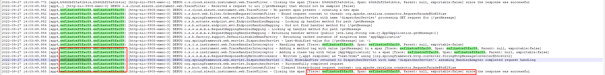
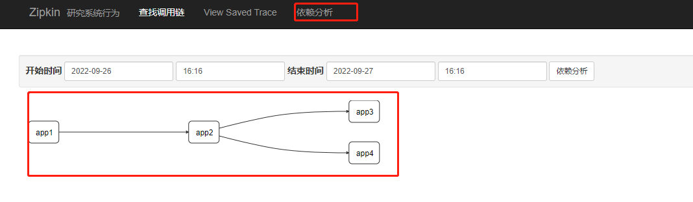
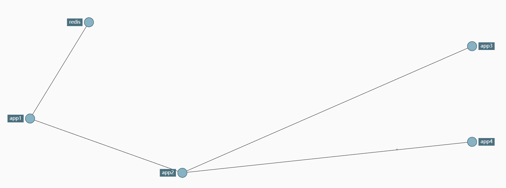
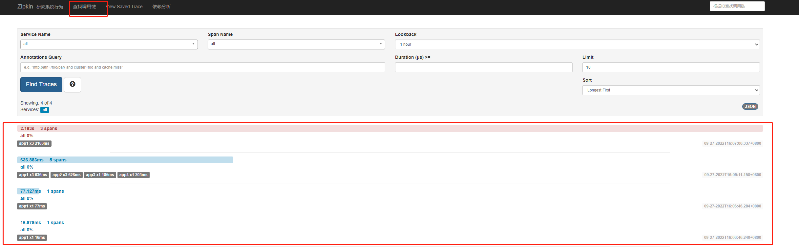
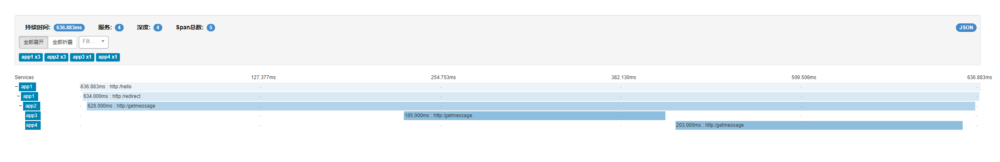
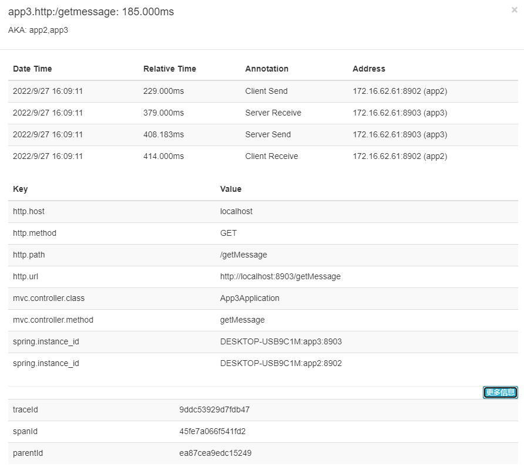
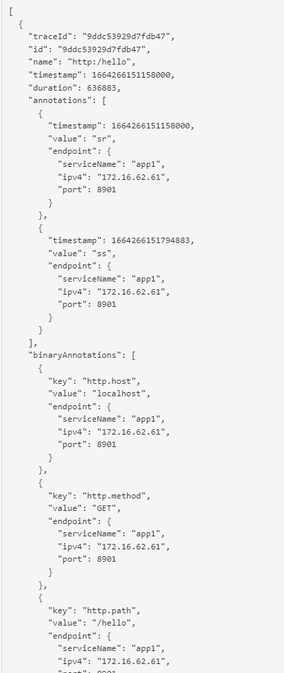

## 1. 什么是Sleuth

Spring Cloud Sleuth 为 Spring Cloud 实现了分布式跟踪解决方案。兼容 Zipkin，HTrace 和其他基于日志的追踪系统。

Spring Cloud Sleuth 提供了以下功能：

- `链路追踪`：通过 Sleuth 可以很清楚的看出一个请求都经过了那些服务，可以很方便的理清服务间的调用关系等。
- `性能分析`：通过 Sleuth 可以很方便的看出每个采样请求的耗时，分析哪些服务调用比较耗时，当服务调用的耗时随着请求量的增大而增大时， 可以对服务的扩容提供一定的提醒。
- `数据分析，优化链路`：对于频繁调用一个服务，或并行调用等，可以针对业务做一些优化措施。
- `可视化错误`：对于程序未捕获的异常，可以配合 Zipkin 查看。

## 2. opentrace

Sleuth是基于标准的链路追踪的协议标准设计的。

## 3. Sleuthdemo

demo地址：https://github.com/ZaynJiang/sleuthDemo.git

见app5工程

### 3.1. 添加依赖

```
<!-- spring cloud sleuth 依赖 -->
<dependency>
    <groupId>org.springframework.cloud</groupId>
    <artifactId>spring-cloud-starter-sleuth</artifactId>
</dependency>
```

### 3.2. 记录日志

需要链路追踪的项目中添加 `logback.xml` 日志文件

```
<?xml version="1.0" encoding="UTF-8"?>
<!-- 日志级别从低到高分为TRACE < DEBUG < INFO < WARN < ERROR < FATAL，如果设置为WARN，则低于WARN的信息都不会输出 -->
<!-- scan: 当此属性设置为true时，配置文件如果发生改变，将会被重新加载，默认值为true -->
<!-- scanPeriod: 设置监测配置文件是否有修改的时间间隔，如果没有给出时间单位，默认单位是毫秒。当scan为true时，此属性生效。默认的时间间隔为1分钟。 -->
<!-- debug: 当此属性设置为true时，将打印出logback内部日志信息，实时查看logback运行状态。默认值为false。 -->
<configuration scan="true" scanPeriod="10 seconds">
    <!-- 日志上下文名称 -->
    <contextName>my_logback</contextName>
    <!-- name的值是变量的名称，value的值是变量定义的值。通过定义的值会被插入到logger上下文中。定义变量后，可以使“${}”来使用变量。 -->
    <property name="log.path" value="./app5/logs"/>
    <!-- 加载 Spring 配置文件信息 -->
    <springProperty scope="context" name="applicationName" source="spring.application.name" defaultValue="localhost"/>
    <!-- 日志输出格式 -->
    <property name="LOG_PATTERN" value="%d{yyyy-MM-dd HH:mm:ss.SSS} [${applicationName},%X{X-B3-TraceId:-},%X{X-B3-SpanId:-}] [%thread] %-5level %logger{50} - %msg%n"/>

    <!--输出到控制台-->
    <appender name="CONSOLE" class="ch.qos.logback.core.ConsoleAppender">
        <!--此日志appender是为开发使用，只配置最底级别，控制台输出的日志级别是大于或等于此级别的日志信息-->
        <filter class="ch.qos.logback.classic.filter.ThresholdFilter">
            <level>DEBUG</level>
        </filter>
        <encoder>
            <pattern>${LOG_PATTERN}</pattern>
            <!-- 设置字符集 -->
            <charset>UTF-8</charset>
        </encoder>
    </appender>

    <!-- 输出到文件 -->
    <!-- 时间滚动输出 level为 DEBUG 日志 -->
    <appender name="DEBUG_FILE" class="ch.qos.logback.core.rolling.RollingFileAppender">
        <!-- 正在记录的日志文件的路径及文件名 -->
        <file>${log.path}/log_debug.log</file>
        <!--日志文件输出格式-->
        <encoder>
            <pattern>${LOG_PATTERN}</pattern>
            <charset>UTF-8</charset> <!-- 设置字符集 -->
        </encoder>
        <!-- 日志记录器的滚动策略，按日期，按大小记录 -->
        <rollingPolicy class="ch.qos.logback.core.rolling.TimeBasedRollingPolicy">
            <!-- 日志归档 -->
            <fileNamePattern>${log.path}/debug/log-debug-%d{yyyy-MM-dd}.%i.log</fileNamePattern>
            <timeBasedFileNamingAndTriggeringPolicy class="ch.qos.logback.core.rolling.SizeAndTimeBasedFNATP">
                <maxFileSize>100MB</maxFileSize>
            </timeBasedFileNamingAndTriggeringPolicy>
            <!--日志文件保留天数-->
            <maxHistory>15</maxHistory>
        </rollingPolicy>
        <!-- 此日志文件只记录debug级别的 -->
        <filter class="ch.qos.logback.classic.filter.LevelFilter">
            <level>DEBUG</level>
            <onMatch>ACCEPT</onMatch>
            <onMismatch>DENY</onMismatch>
        </filter>
    </appender>

    <!-- 时间滚动输出 level为 INFO 日志 -->
    <appender name="INFO_FILE" class="ch.qos.logback.core.rolling.RollingFileAppender">
        <!-- 正在记录的日志文件的路径及文件名 -->
        <file>${log.path}/log_info.log</file>
        <!--日志文件输出格式-->
        <encoder>
            <pattern>${LOG_PATTERN}</pattern>
            <charset>UTF-8</charset>
        </encoder>
        <!-- 日志记录器的滚动策略，按日期，按大小记录 -->
        <rollingPolicy class="ch.qos.logback.core.rolling.TimeBasedRollingPolicy">
            <!-- 每天日志归档路径以及格式 -->
            <fileNamePattern>${log.path}/info/log-info-%d{yyyy-MM-dd}.%i.log</fileNamePattern>
            <timeBasedFileNamingAndTriggeringPolicy class="ch.qos.logback.core.rolling.SizeAndTimeBasedFNATP">
                <maxFileSize>100MB</maxFileSize>
            </timeBasedFileNamingAndTriggeringPolicy>
            <!--日志文件保留天数-->
            <maxHistory>15</maxHistory>
        </rollingPolicy>
        <!-- 此日志文件只记录info级别的 -->
        <filter class="ch.qos.logback.classic.filter.LevelFilter">
            <level>INFO</level>
            <onMatch>ACCEPT</onMatch>
            <onMismatch>DENY</onMismatch>
        </filter>
    </appender>

    <!-- 时间滚动输出 level为 WARN 日志 -->
    <appender name="WARN_FILE" class="ch.qos.logback.core.rolling.RollingFileAppender">
        <!-- 正在记录的日志文件的路径及文件名 -->
        <file>${log.path}/log_warn.log</file>
        <!--日志文件输出格式-->
        <encoder>
            <pattern>${LOG_PATTERN}</pattern>
            <charset>UTF-8</charset> <!-- 此处设置字符集 -->
        </encoder>
        <!-- 日志记录器的滚动策略，按日期，按大小记录 -->
        <rollingPolicy class="ch.qos.logback.core.rolling.TimeBasedRollingPolicy">
            <fileNamePattern>${log.path}/warn/log-warn-%d{yyyy-MM-dd}.%i.log</fileNamePattern>
            <!-- 每个日志文件最大100MB -->
            <timeBasedFileNamingAndTriggeringPolicy class="ch.qos.logback.core.rolling.SizeAndTimeBasedFNATP">
                <maxFileSize>100MB</maxFileSize>
            </timeBasedFileNamingAndTriggeringPolicy>
            <!--日志文件保留天数-->
            <maxHistory>15</maxHistory>
        </rollingPolicy>
        <!-- 此日志文件只记录warn级别的 -->
        <filter class="ch.qos.logback.classic.filter.LevelFilter">
            <level>WARN</level>
            <onMatch>ACCEPT</onMatch>
            <onMismatch>DENY</onMismatch>
        </filter>
    </appender>

    <!-- 时间滚动输出 level为 ERROR 日志 -->
    <appender name="ERROR_FILE" class="ch.qos.logback.core.rolling.RollingFileAppender">
        <!-- 正在记录的日志文件的路径及文件名 -->
        <file>${log.path}/log_error.log</file>
        <!--日志文件输出格式-->
        <encoder>
            <pattern>${LOG_PATTERN}</pattern>
            <charset>UTF-8</charset> <!-- 此处设置字符集 -->
        </encoder>
        <!-- 日志记录器的滚动策略，按日期，按大小记录 -->
        <rollingPolicy class="ch.qos.logback.core.rolling.TimeBasedRollingPolicy">
            <fileNamePattern>${log.path}/error/log-error-%d{yyyy-MM-dd}.%i.log</fileNamePattern>
            <timeBasedFileNamingAndTriggeringPolicy class="ch.qos.logback.core.rolling.SizeAndTimeBasedFNATP">
                <maxFileSize>100MB</maxFileSize>
            </timeBasedFileNamingAndTriggeringPolicy>
            <!--日志文件保留天数-->
            <maxHistory>15</maxHistory>
            <!-- 日志量最大 10 GB -->
            <totalSizeCap>10GB</totalSizeCap>
        </rollingPolicy>
        <!-- 此日志文件只记录ERROR级别的 -->
        <filter class="ch.qos.logback.classic.filter.LevelFilter">
            <level>ERROR</level>
            <onMatch>ACCEPT</onMatch>
            <onMismatch>DENY</onMismatch>
        </filter>
    </appender>

    <!-- 对于类路径以 com.example.logback 开头的Logger,输出级别设置为warn,并且只输出到控制台 -->
    <!-- 这个logger没有指定appender，它会继承root节点中定义的那些appender -->
    <!-- <logger name="com.example.logback" level="warn"/> -->

    <!--通过 LoggerFactory.getLogger("myLog") 可以获取到这个logger-->
    <!--由于这个logger自动继承了root的appender，root中已经有stdout的appender了，自己这边又引入了stdout的appender-->
    <!--如果没有设置 additivity="false" ,就会导致一条日志在控制台输出两次的情况-->
    <!--additivity表示要不要使用rootLogger配置的appender进行输出-->
    <logger name="myLog" level="INFO" additivity="false">
        <appender-ref ref="CONSOLE"/>
    </logger>

    <!-- 日志输出级别及方式 -->
    <root level="DEBUG">
        <appender-ref ref="CONSOLE"/>
        <appender-ref ref="DEBUG_FILE"/>
        <appender-ref ref="INFO_FILE"/>
        <appender-ref ref="WARN_FILE"/>
        <appender-ref ref="ERROR_FILE"/>
    </root>

</configuration>
```

其中日志核心配置：

`%d{yyyy-MM-dd HH:mm:ss.SSS} [${applicationName},%X{X-B3-TraceId:-},%X{X-B3-SpanId:-}] [%thread] %-5level %logger{50} - %msg%n`

### 3.3. 访问和验证

http://localhost:8905/getMessage



可以看出一次请求中将会自动添加traceId和spanId

### 3.4. 缺陷

查看日志文件并不是一个很好的方法，当微服务越来越多日志文件也会越来越多，查询工作会变得越来越麻烦，Spring 官方推荐使用 Zipkin 进行链路跟踪。Zipkin 可以将日志聚合，并进行可视化展示和全文检索。

## 4. zipkin简单整合

​	zipkin是 Twitter 公司开发贡献的一款开源的分布式实时数据追踪系统（Distributed Tracking System），基于 Google Dapper 的论文设计而来，其主要功能是聚集各个异构系统的实时监控数据。

​	它可以收集各个服务器上请求链路的跟踪数据，并通过 Rest API 接口来辅助我们查询跟踪数据，实现对分布式系统的实时监控，及时发现系统中出现的延迟升高问题并找出系统性能瓶颈的根源。除了面向开发的 API 接口之外，它还提供了方便的 UI 组件，每个服务向 Zipkin 报告计时数据，Zipkin 会根据调用关系生成依赖关系图，帮助我们直观的搜索跟踪信息和分析请求链路明细。Zipkin 提供了可插拔数据存储方式：In-Memory、MySql、Cassandra 以及 Elasticsearch。

​	四个组件构成了 Zipkin：

- Collector

  收集器组件，处理从外部系统发送过来的跟踪信息，将这些信息转换为 Zipkin 内部处理的 Span 格式，以支持后续的存储、分析、展示等功能。

- Storage

  存储组件，处理收集器接收到的跟踪信息，默认将信息存储在内存中，可以修改存储策略使用其他存储组件，支持 MySQL，Elasticsearch 等。

- Web UI

  UI 组件，基于 API 组件实现的上层应用，提供 Web 页面，用来展示 Zipkin 中的调用链和系统依赖关系等。

- RESTful API

  API 组件，为 Web 界面提供查询存储中数据的接口。

Zipkin 分为两端，一个是 Zipkin 服务端，一个是 Zipkin 客户端，客户端也就是微服务的应用，客户端会配置服务端的 URL 地址，一旦发生服务间的调用的时候，会被配置在微服务里面的 Sleuth 的监听器监听，并生成相应的 Trace 和 Span 信息发送给服务端。

发送的方式有两种，一种是消息发送，还有一种是HTTP 报文的方式发送

### 4.1. zipkin服务端

这里进行服务端的简单搭建。

https://github.com/ZaynJiang/sleuthDemo.git

见zipkinServer目录。

springboot2.0之后，官方不再推荐使用自建的zipkin server，而是直接使用编译好的zipkin.jar来给我们使用。

zipkin.jar中的yml配置可以参考： https://github.com/openzipkin/zipkin/blob/master/zipkin-server/src/main/resources/zipkin-server-shared.yml

建立工程

```
        <dependency>
            <groupId>io.zipkin.java</groupId>
            <artifactId>zipkin-autoconfigure-ui</artifactId>
        </dependency>

        <dependency>
            <groupId>io.zipkin.java</groupId>
            <artifactId>zipkin-server</artifactId>
        </dependency>

        <dependency>
            <groupId>org.springframework.boot</groupId>
            <artifactId>spring-boot-starter-web</artifactId>
        </dependency>
```

新增启动类：

```
@SpringBootApplication
@EnableZipkinServer
public class ZipkinServerApplication {

    public static void main(String[] args) {
        SpringApplication.run(ZipkinServerApplication.class, args);
    }

}
```

### 4.2. zipkin客户端接入

https://github.com/ZaynJiang/sleuthDemo.git

见app1,app2,app3,app4,从app1会调用app2至app4.

#### 4.2.1. 工程建立

引入依赖

```
<dependency>
    <groupId>org.springframework.cloud</groupId>
    <artifactId>spring-cloud-starter-zipkin</artifactId>
</dependency>
<dependency>
    <groupId>org.springframework.boot</groupId>
    <artifactId>spring-boot-starter-web</artifactId>
</dependency>
```

配置文件

```
spring:
    zipkin:
       baseUrl: http://localhost:9411 //zipkin地址
    application:
       name: app1

    sleuth:
       sampler:
          percentage: 1
```

#### 4.2.2. 请求测试

http://localhost:8901/hello

#### 4.2.3. zipkin分析

我们可以在zipkin的页面中查看链路

我们在app1中可以查看到链路id和

 

在app2控制台可以查看到请求过来，链路id和上游一致，再加上自身的spanid

 

app3同上

 

app4同上


在zipkin管理页面查看

* 拓扑图

 

 

* 调用链路列表查看

   

* 链路详情查看

   

* 点开上述查看节点请求详情

   

* json数据展示

   


## 5. zipkin