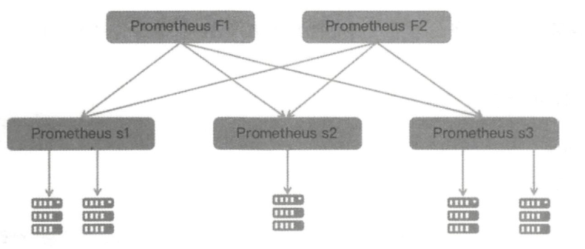
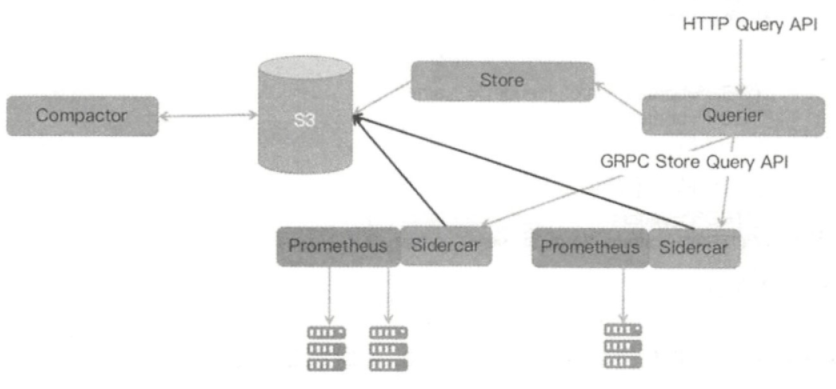

## 1. 开头
时间序列化数据库，我的理解就是将数据打上标签，以时间维度存储。

## 2. 指标

prometheus有多种指标数据

### 2.1. 指标分类

* 计数器

  量随着时间变化只增不减

* 仪表盘

  量随着时间变化可增可减，比如cpu和内存的变化

* 直方图

  标识某个区间的样本个数

* 摘要

  凸显数据的分布情况，比如一段时间的平均响应时间

### 2.2. 指标格式

## 3. 数据采集

prometheus是采用pull的方式采集监控数据，大部分其它的监控软件采集监控数据采用push的方式。

但是prometheus为了兼容push的方式提供了pushgateway组件来接收客户端发来的数据

### 3.1. 推和拉对比

* 存储

  push通常是采集完成后就立即上报，本地不需要保存，服务端需要有状态存储

  pull的agent需要有存储能力，服务端不需要，只需要简单的拉取。

* 时延

  push实时性好，数据好了直接上报

  pull需要服务端定时拉取

* 分布式连接

  push直接配置服务地址进行推送

  pull需要分布式协调组件或者配置发现所有的agent

### 3.2.  动态发现

前面说了pull模式，服务端获取监控数据需要知道agent的地址。

我们可以在服务端配置agent的地址，如果有新的地址则需要修改新的配置了。在云的环境下，应用容器可以随时销毁或者启动。这种情况如何更加方便获取应用地址呢？

#### 3.2.1. 支持组件

prometheus提供了动态发现的模式。可以支持如下几类系统来发现。

* 容器

  k8s、marathon

* 云平台

  ec2、azure、openstack

* 服务发现组件

  dns、zk、consul等

prometheus会从这些组件获取对应的监控对象然后pull数据

#### 3.2.2. k8s机制示例

* 配置k8s和使用api

  prometheus配置k8s api的地址和认证凭据。然后prometheus就可以使用k8s的api来获取信息了

* prometheus发现组件

  服务发现组件会一直监听k8s的集群变化。k8s容器发生变更时，prometheus就会感知到，并进行相应pull目标变更

## 4. 数据处理

### 4.1. 标签过滤

### 4.2. 标签重命名

### 4.3. 目标路由

配置hash路由，可以实现负载均衡采集目标对象

## 5. 数据存储

prometheus的数据存储分为本地存储和远程存储两种方式。

### 5.1. 本地存储

#### 5.1.1. 数据结构

prometheus的本地存储数据结构基本基于这几个假说：

* 相邻时间戳差值稳定
* 相邻数据点变化幅度小
* 热数据查询频率远超非热数据，最近数据热度很高

于是有了这种压缩算法

### 5.2. 远程存储

## 6. 数据查询

我们可以通过http或者promQl来进行查询数据

### 6.1. PromQl

prometheus实现了一套自己数据库查询语言，PromQl目前不支持写入

其原理时解析引擎将查询语句转化为Query请求，然后通过时序数据库找到具体的数据块，然后通过内置的函数处理，汇总返回给调用方

开源的Grafnan开源显示面板可以通过PromQl可以制作丰富的监控试图。prometheus自身又有个简陋的web查询控制台。可以查看指标、alert告警、状态等信息。

## 7. 告警

### 7.1. 告警规则

告警规则的本质就是PromQl。通过定时执行规则PromQl,如果查询结果符合告警规则，则会产生一个告警记录，不过需要经过一个评估时间，比如多少个周期内产生了这个告警记录，那么就可以发出告警

### 7.2. 告警管理器

prometheus不会对告警进行处理，需要借助一个组件AlertManager，这个组件是一个单独的程序，prometheus会配置这个AlertManager地址。然后Prometheus产生的告警就可以发送到告警管理器中进行分析了

#### 7.2.1. 作用 

这个AlertManger的作用主要有：

* 告警分组

  合并告警一起来发送，比如时同一个人的。

* 告警抑制

  告警已经发送了，其它由此告警产生的告警不在发送。

* 告警静默

  一个时间段不要发出重复的告警

#### 7.2.2. 机制

## 8. 部署架构

### 8.1. 联邦架构

 

* 最上层时联邦节点

  定时从下一层节点抓取数据，可以部署多个增加它的高可用

* 中间的采集节点

  负责不同区域的数据采集，比如多机房可以每个机房部署一个采集点

优势：

这种架构单个采集节点负载压力分散了，降低本地存储压力

缺点：

* 采集节点的高可用需要重复部署采集节点，数据会重复采集
* 运维复杂，缺少统一的全局视图
* 历史数据必须要依赖第三方

### 8.2. thanos

#### 8.2.1. 整体架构

 

#### 8.2.2. 机制

## 9. 总结

* Prometheus只针对性能和可用性监控，并不进行日志监控
* Prometheus的本地存储只存储短时间数据，历史数据歼十一使用远端存储
* Prometheus监控数据没有对单位进行定义，需要使用者自己区分。对多租户的监控需要自己组合