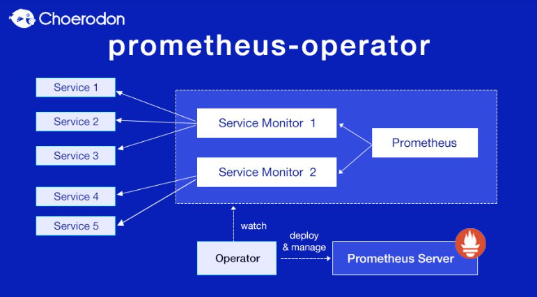

## 1. k8s监控体系

### 1.1. k8s介绍

​	Kubernetes是Google基于 Borg开源的容器编排调度引擎。Kubernetes 的目标不止是成为一个编排系统，更是提供一种规范，该规范可以让我们描述集群的架构并定义服务的最终状态，让系统自动达到和维持这种状态。

​	因此Kubernetes相当于一个云操作系统了。

### 1.2. k8s监控指标

对于k8s的监控指标，主要分为三类。

* 节点

  节点的CPU、 Load、Disk、Memory等指标。

* 内部系统组件的状态

  比如kube-scheduler 、 kube-controller-manager 、Kube-DNS/CoreDNS等组件的详细运行状态。

* 编排级的metrics

  比如 Deployment、Pod、Daemonset、StatefulSet等资源的状态、资源请求、调度和API延迟等数据指标。

### 1.3. heapster

早期（Kubernetes 1.10.x之前）k8s提供了heapster，并InfluxDB和Grafana 的组合来对系统进行监控。**Heapster 用于对集群进行监控和数据聚合，以 Pod 的形式运行在集群中**，在正确部署后可以在 Kubernetes提供的dashboard插件页面查看采集的数据

同时也可以使用kubectl top命令查看集群中 Node和 Pod 的资( CPU、Memory 、 Storage )使用情况

### 1.4.  cAdivsor

​	kubelet包含一个cAdivsor组件。它是 Google开源的容器资源监控和性能分析工具，它为容器而生，不需要单独安装cAdvisor。cAdvisor作为kubelet内置的一部分程序，可以直接使用。kubelet服务在启动时会自动启动cAdvisor服务，**cAdvisor会实时采集所在节点及在节点上运行的容器的性能指标数据**。

​	**而Heapster（pod）会通过kubelet 提供的API获取各个Node节点相关的监控指标数据**，并将其汇总后发送给后台支持的数据库，比如OpenTSDB、Kafka、Elasticsearch ,InfluxDB等。在一般情况下，我们直接将InfluxDB作为数据存储后端，并通过Grafana展示InfluxDB采集的数据。通过Grafana展示 InfluxDB存储数据的界面。

### 1.5.  kube-state-metric

heapster除了获取cAdivsor的数据，还会添加其它数据，比如kube-state-metric。

kube-state-metric通过监听api server生成的资源对象的状态指标。

这个数据包括：

* Deployment调度了多少个Pod副本

* 现在可用的有几个
* 有多少个Pod是 running.
* stopped 或terminated状态?Pod重启了多少次?

kube-state-metric相当于一个工具，使用heapster会进行采集这些指标数据

### 1.6. metric server

metric server是一个针对Kubernetes监控的数据聚合工具，是 Heapster的替代品。

Kubernetes的HPA和 kubectl top命令都依赖heapster或者metrics-server，要使用这两个功能，至少要安装其中一个。

#### 1.6.1. 侧重点

* kube-state-metrics

  主要关注集群资源相关的一些元数据，比如Deployment,Pod、副本状态和资源限额等静态指标。

* metrics-server

  主要关注资源度量API的实现，比如CPU、文件描述符、内存、请求延时等实时指标。

### 1.7. Prometheus 

Prometheus 对Kubernetes也有很好的支持。

Prometheus 默认的 Pull 策略的支持，而且是在代码层面的原生支持，可以**通过Prometheus提供的Kubernetes服务发现机制来实现集群的自动化监控**。

例如，若我们在集群中部署了新的应用，Prometheus就可以自动发现 Pod、Service、Ingress等资源的监控信息，而不需要我们做任何手工配置。当我们删除一个资源时，Prometheus也会自动移除对这个应用相关资源的监控。

## 2. prometheus搭建

这里我们使用k8s搭建

### 2.1. k8s概念

操作pod的工作都是由控制器controller完成的，k8s控制器组件有多种。

- Deployment

  无状态容器控制器，通过控制ReplicaSet来控制pod；应用场景web应用；

- StatefulSet

  有状态容器控制器，保证pod的有序和唯一，pod的网络标识和存储在pod重建前后一致；应用场景主从架构；

- DeamonSet

  守护容器控制器，确保所有节点上有且仅有一个pod；应用场景监控；

- Job

  普通任务容器控制器，只会执行一次；应用场景离线数据处理；

- CronJob

  定时任务容器控制器，定时执行；应用场景通知、备份

### 2.2. 手动安装

我们需要在K8s集群设置一个全局的名称空间

```
kubectl create ns kube-ops
```

#### 2.2.1. 配置configmap

为了配置一个prometheus-cms.yaml，使用数据卷的形式进行configmap热更新。

如果configmap对应的配置文件发生变化后，pod就会热更新

配置如下：

```
TODO
```

#### 2.2.2. 配置deploy

配置deploy控制器，来保证集群，其中重要的配置项为：

* 通过--config.file参数

  指定了配置文件，然后将上面创建的ConfigMap文件以Volume形式挂载到Pod 中。

* 通过--storage.tsdb.path参数

  指定了内置 TSDB文件存储的路径，这里只是为了简单说明，使用了最简单的emptyDir来挂载，如果是在生产环境中使用的，则切记这里应该使用PV/PVC等数据持久化方案。

* 通过--web.enable-lifecycle参数

  开启热更新支持，在使用该参数后，配置文件若发生任何变化，则都可以通过HTTP POST请求localhost:9090/-/reload接口操作使之立即生效。

```
TODO
```

#### 2.2.3. 配置ServiceAccount

为了让集群内的 Pod安全访问Kubernetes接口，Kubernetes提供了ServiceAccount对象。

其主要原理是：**将访问k8s api的token和ca证书挂载到容器内部，那么容器的应用程序就可以访问k8s api了**,prometheus的服务发现机制就是依赖该机制。

因此需要创建ServiceAccount配置

如下

```
TODO
```

#### 2.2.4. 配置RBAC

还需要创建访问权限配置prometheus-rbac.yaml

```
todo
```

该配置中，需要将上一步创建的ServiceAccount绑定到这个rbac的ClusterRole（集群角色)之中。该集群角色声明了Prometheus Pod访问集群所需的权限规则。

#### 2.2.5. 配置Service

在Pod创建完毕后，需要将服务暴露给外部用户进行访问，可以通过一个Ingress对象或者NodePort类型的Service来完成该功能。这里使用NodePort来暴露服务，新建一个名为prometheus-svc.yarm

```
TODO
```

设置端口，目标端口等信息

#### 2.2.6. 创建和启动

以上已经把手动配置的项都完成了。这里我们使用kubectl命令安装

* 创建资源

  ```
  kubectl create -f prometheus-cm.yaml
  kubectl create -f prometheus-rbac.yaml
  kubectl create -f prometheus-deploy.yaml
  kubectl create -f prometheus-svc.yaml
  ```

* 检查

  ```
  get all -n kube-ops
  ```

* 验证dashboard

  访问如下地址就可以查看到了prometheus的dashboard了

  ```
  http://节点:端口
  ```

### 2.2. opearator

​	Operator是由CoreOS公司开发的用来扩展Kubernetes API的特定应用程序控制器，用来创建、配置和管理复杂的有状态应用，例如数据库、缓存和监控系统。

​	而prometheus本身有多种组件，比如AlertManager，这些组件服务本身的高可用，虽然完全可以用自定义的方式来实现，但是不够灵活，不具有通用性，手动安装时需要不断更新Prometheus的配置来实现。

​	我们完全可以采用一种更高级方式来实现Kubernetes集群监控，即采用Prometheus Operator项目的安装。Prometheus Operator就是基于Operator框架开发的管理 Prometheus集群的控制器。

 

#### 2.2.1. 资源对象(crd)

Operator是核心部分，是作为一个控制器而存在。Operator会创建Prometheus .ServiceMonitor、AlertManager 及 PrometheusRule这4个CRD资源对象，然后一直监控并维持这4个CRD资源对象的状态。

* Prometheus资源对象

  作为Prometheus Server存在的。

* ServiceMonitor资源对象

  专门提供 metrics数据接口的exporter的抽象

* Alertmanager资源对象

  对应AlertManager组件的抽象。

* PrometheusRule资源对象

  被Prometheus实例使用的告警规则文件的抽象。

#### 2.2.2. ServiceMonitor

ServiceMonitor是通过kubelet的10250端口采集节点数据的。为了保证安全性，将metrics数据迁移到10255这个只读端口，只需将文件中的https-metrics更改成http-metrics 即可

```
TODO
```

#### 2.2.3. 自定义etcd监控项

自定义监控项的通用步骤为：

* 建立一个 ServiceMonitor对象，用于为Prometheus添加监控项

* 将ServiceMonitor对象关联metrics数据接口的一个Service对象
* Service对象可以正确获取metrics数据。

针对etcd集群我们对其进行监控步骤为：

* 配置etcd证书

  ```
  TODO
  ```

* 创建servicemonitor

  ```
  TODO
  ```

* 创建Service

  ```
  TODO
  ```

  这里创建的Service没有采用前面通过标签匹配Pod的做法。因为创建的 etcd 集群大多独立于集群之外，所以在这种情况下需要自定义一个Endpoints。注意metadata区域的内容要和Service 保持一致，并且将Service 的clusterIP设置为None。

#### 2.2.4. 自定义告警

* 配置规则
* 配置告警

#### 2.2.5. 高级配置