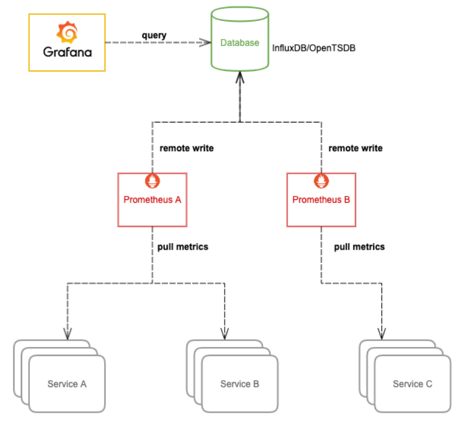
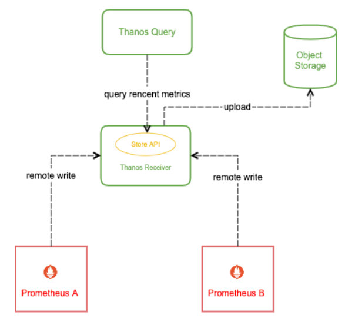

## 概述

Prometheus 几乎已成为监控领域的事实标准，它自带高效的时序数据库存储，可以让单台 Prometheus 能够高效的处理大量的数据，还有友好并且强大的 PromQL 语法，可以用来灵活的查询各种监控数据以及配置告警规则，同时它的 pull 模型指标采集方式被广泛采纳，非常多的应用都实现了 Prometheus 的 metrics 接口以暴露自身各项数据指标让 Prometheus 去采集，很多没有适配的应用也会有第三方 exporter 帮它去适配 Prometheus，所以监控系统我们通常首选用 Prometheus，基于 Prometheus 来打造云原生环境下的大型分布式监控系统。

## Prometheus 的痛点

Prometheus 本身只支持单机部署，没有自带支持集群部署，也就不支持高可用以及水平扩容，在大规模场景下，最让人关心的问题是它的存储空间也受限于单机磁盘容量，磁盘容量决定了单个 Prometheus 所能存储的数据量，数据量大小又取决于被采集服务的指标数量、服务数量、采集速率以及数据过期时间。在数据量大的情况下，我们可能就需要做很多取舍，比如丢弃不重要的指标、降低采集速率、设置较短的数据过期时间(默认只保留15天的数据，看不到比较久远的监控数据)。

**PS：prometheus的单机痛点简单来说就是存在性能瓶颈，不得不降低采集频率，丢弃部分指标，缩小数据过去时间。想要实现水平扩容只能按服务进行拆分，或者服务分片。为了解决数据分散问题，可以指定远程集中存储，但抛弃了强大的promQL。虽然解决了prometheus的痛点，但是极大的提高了运维使用难度。针对这些问题上述问题，最好的方式办法是采用Thanos 的架构解决。** 

### 服务维度拆分 Prometheus

Prometheus 主张根据功能或服务维度进行拆分，即如果要采集的服务比较多，一个 Prometheus 实例就配置成仅采集和存储某一个或某一部分服务的指标，这样根据要采集的服务将 Prometheus 拆分成多个实例分别去采集，也能一定程度上达到水平扩容的目的。

 

通常这样的扩容方式已经能满足大部分场景的需求了，毕竟单机 Prometheus 就能采集和处理很多数据了，很少有 Prometheus 撑不住单个服务的场景。不过在超大规模集群下，有些单个服务的体量也很大，就需要进一步拆分了

### 超大规模分片

想象一下，如果集群节点数量达到上千甚至几千的规模，对于一些节点级服务暴露的指标，比如 kubelet 内置的 cadvisor 暴露的容器相关的指标，又或者部署的 DeamonSet `node-exporter` 暴露的节点相关的指标，在集群规模大的情况下，它们这种单个服务背后的指标数据体量就非常大；还有一些用户量超大的业务，单个服务的 pod 副本数就可能过千，这种服务背后的指标数据也非常大，当然这是最罕见的场景

针对上面这些大规模场景，一个 Prometheus 实例可能连这单个服务的采集任务都扛不住。Prometheus 需要向这个服务所有后端实例发请求采集数据，由于后端实例数量规模太大，采集并发量就会很高，一方面对节点的带宽、CPU、磁盘 IO 都有一定的压力，另一方面 Prometheus 使用的磁盘空间有限，采集的数据量过大很容易就将磁盘塞满了，通常要做一些取舍才能将数据量控制在一定范围，但这种取舍也会降低数据完整和精确程度，不推荐这样做。

那么如何优化呢？我们可以给这种大规模类型的服务做一下分片(Sharding)，将其拆分成多个 group，让一个 Prometheus 实例仅采集这个服务背后的某一个 group 的数据，这样就可以将这个大体量服务的监控数据拆分到多个 Prometheus 实例上

 

如何将一个服务拆成多个 group 呢？下面介绍两种方案，以对 kubelet cadvisor 数据做分片为例。

* 我们可以不用 Kubernetes 的服务发现，自行实现一下 sharding 算法，比如针对节点级的服务，可以将某个节点 shard 到某个 group 里，然后再将其注册到 Prometheus 所支持的服务发现注册中心，推荐 consul，最后在 Prometheus 配置文件加上 consul_sd_config（https://prometheus.io/docs/prometheus/latest/configuration/configuration/#consul_sd_config）的配置，指定每个 Prometheus 实例要采集的 group。

  ```
    - job_name: 'cadvisor-1'
      consul_sd_configs:
        - server: 10.0.0.3:8500
          services:
            - cadvisor-1 # This is the 2nd slave
  ```

* 用 Kubernetes 的 node 服务发现，再利用 Prometheus relabel 配置的 hashmod 来对 node 做分片，每个 Prometheus 实例仅抓其中一个分片中的数据

  ```
    - job_name: 'cadvisor-1'
      metrics_path: /metrics/cadvisor
      scheme: https
  
      # 请求 kubelet metrics 接口也需要认证和授权，通常会用 webhook 方式让 apiserver 代理进行 RBAC 校验，所以还是用 ServiceAccount 的 token
      bearer_token_file: /var/run/secrets/kubernetes.io/serviceaccount/token
  
      kubernetes_sd_configs:
      - role: node
  
      # 通常不校验 kubelet 的 server 证书，避免报 x509: certificate signed by unknown authority
      tls_config:
        insecure_skip_verify: true
  
      relabel_configs:
      - source_labels: [__address__]
        modulus:       4    # 将节点分片成 4 个 group
        target_label:  __tmp_hash
        action:        hashmod
      - source_labels: [__tmp_hash]
        regex:         ^1$  # 只抓第 2 个 group 中节点的数据(序号 0 为第 1 个 group)
        action:        keep
  ```

### 拆分引入的新问题

前面我们通过不通层面对 Prometheus 进行了拆分部署，一方面使得 Prometheus 能够实现水平扩容，另一方面也加剧了监控数据落盘的分散程度，使用 Grafana 查询监控数据时我们也需要添加许多数据源，而且不同数据源之间的数据还不能聚合查询，监控页面也看不到全局的视图，造成查询混乱的局面。

 

要解决这个问题，我们可以从下面的两方面入手，任选其中一种方案。

### 集中数据存储

我们可以让 Prometheus 不负责存储，仅采集数据并通过 remote write 方式写入远程存储的 adapter，远程存储使用 OpenTSDB 或 InfluxDB 这些支持集群部署的时序数据库，Prometheus 配置:

```
  remote_write:
  - url: http://10.0.0.2:8888/write
```

然后 Grafana 添加我们使用的时序数据库作为数据源来查询监控数据来展示，架构图:

 

这种方式相当于更换了存储引擎，由其它支持存储水平扩容的时序数据库来存储庞大的数据量，这样我们就可以将数据集中到一起。OpenTSDB 支持 HBase, BigTable 作为存储后端，InfluxDB 企业版支持集群部署和水平扩容(开源版不支持)。不过这样的话，我们就无法使用友好且强大的 PromQL 来查询监控数据了，必须使用我们存储数据的时序数据库所支持的语法来查询

### Prometheus 联邦

除了上面更换存储引擎的方式，还可以将 Prometheus 进行联邦部署。

 

简单来说，就是将多个 Prometheus 实例采集的数据再用另一个 Prometheus 采集汇总到一起，这样也意味着需要消耗更多的资源。通常我们只把需要聚合的数据或者需要在一个地方展示的数据用这种方式采集汇总到一起，比如 Kubernetes 节点数过多，cadvisor 的数据分散在多个 Prometheus 实例上，我们就可以用这种方式将 cadvisor 暴露的容器指标汇总起来，以便于在一个地方就能查询到集群中任意一个容器的监控数据或者某个服务背后所有容器的监控数据的聚合汇总以及配置告警；又或者多个服务有关联，比如通常应用只暴露了它应用相关的指标，但它的资源使用情况(比如 cpu 和 内存) 由 cadvisor 来感知和暴露，这两部分指标由不同的 Prometheus 实例所采集，这时我们也可以用这种方式将数据汇总，在一个地方展示和配置告警。

更多说明和配置示例请参考官方文档：https://prometheus.io/docs/prometheus/latest/federation/

### Prometheus 高可用

虽然上面我们通过一些列操作将 Prometheus 进行了分布式改造，但并没有解决 Prometheus 本身的高可用问题，即如果其中一个实例挂了，数据的查询和完整性都将受到影响。

我们可以将所有 Prometheus 实例都使用两个相同副本，分别挂载数据盘，它们都采集相同的服务，所以它们的数据是一致的，查询它们之中任意一个都可以，所以可以在它们前面再挂一层负载均衡，所有查询都经过这个负载均衡分流到其中一台 Prometheus，如果其中一台挂掉就从负载列表里踢掉不再转发。

这里的负载均衡可以根据实际环境选择合适的方案，可以用 Nginx 或 HAProxy，在 Kubernetes 环境，通常使用 Kubernentes 的 Service，由 kube-proxy 生成的 iptables/ipvs 规则转发，如果使用 Istio，还可以用 VirtualService，由 envoy sidecar 去转发

 

这样就实现了 Prometheus 的高可用，简单起见，上面的图仅展示单个 Prometheus 的高可用，当你可以将其拓展，代入应用到上面其它的优化手段中，实现整体的高可用。

**当然这里也存在缺陷：如果其中一个 Prometheus 实例挂了一段时间然后又恢复了，它的数据就不完整，当负载均衡转发到它上面去查数据时，返回的结果就可能会有部分缺失**

### 小结

通过对 Prometheus 的优化手段，我们在一定程度上解决了单机 Prometheus 在大规模场景下的痛点，但操作和运维复杂度比较高，并且不能够很好的支持数据的长期存储(long term storage)。对于一些时间比较久远的监控数据，我们通常查看的频率很低，但也希望能够低成本的保留足够长的时间，数据如果全部落盘到磁盘成本是很高的，并且容量有限，即便利用水平扩容可以增加存储容量，但同时也增大了资源成本，不可能无限扩容，所以需要设置一个数据过期策略，也就会丢失时间比较久远的监控数据。

对于这种不常用的冷数据，最理想的方式就是存到廉价的对象存储中，等需要查询的时候能够自动加载出来。Thanos 可以帮我们解决这些问题，它完全兼容 Prometheus API，提供统一查询聚合分布式部署的 Prometheus 数据的能力，同时也支持数据长期存储到各种对象存储(无限存储能力)以及降低采样率来加速大时间范围的数据查询

## thanos

之前在 大规模场景下 Prometheus 的优化手段 中，我们想尽 "千方百计" 才好不容易把 Prometheus 优化到适配大规模场景，部署和后期维护麻烦且复杂不说，还有很多不完美的地方，并且还无法满足一些更高级的诉求，比如查看时间久远的监控数据，对于一些时间久远不常用的 "冷数据"，最理想的方式就是存到廉价的对象存储中，等需要查询的时候能够自动加载出来。

Thanos 可以帮我们简化分布式 Prometheus 的部署与管理，并提供了一些的高级特性：**全局视图**，**长期存储**，**高可用**。下面我们来详细讲解一下。

### Thanos 架构

 

这张图中包含了 Thanos 的几个核心组件，但并不包括所有组件，为了便于理解，我们先不细讲，简单介绍下图中这几个组件的作用：

- Thanos Query: 实现了 Prometheus API，将来自下游组件提供的数据进行聚合最终返回给查询数据的 client (如 grafana)，类似数据库中间件。
- Thanos Sidecar: 连接 Prometheus，将其数据提供给 Thanos Query 查询，并且/或者将其上传到对象存储，以供长期存储。
- Thanos Store Gateway: 将对象存储的数据暴露给 Thanos Query 去查询。
- Thanos Ruler: 对监控数据进行评估和告警，还可以计算出新的监控数据，将这些新数据提供给 Thanos Query 查询并且/或者上传到对象存储，以供长期存储。
- Thanos Compact: 将对象存储中的数据进行压缩和降低采样率，加速大时间区间监控数据查询的速度。

### thanos核心组件

#### Query

首先，监控数据的查询肯定不能直接查 Prometheus 了，因为会存在许多个 Prometheus 实例，每个 Prometheus 实例只能感知它自己所采集的数据。我们可以比较容易联想到数据库中间件，每个数据库都只存了一部分数据，中间件能感知到所有数据库，数据查询都经过数据库中间件来查，这个中间件收到查询请求再去查下游各个数据库中的数据，最后将这些数据聚合汇总返回给查询的客户端，这样就实现了将分布式存储的数据集中查询。

实际上，Thanos 也是使用了类似的设计思想，Thanos Query 就是这个 "中间件" 的关键入口。它实现了 Prometheus 的 HTTP API，能够 "看懂" PromQL。这样，查询 Prometheus 监控数据的 client 就不直接查询 Prometheus 本身了，而是去查询 Thanos Query，Thanos Query 再去下游多个存储了数据的地方查数据，最后将这些数据聚合去重后返回给 client，也就实现了分布式 Prometheus 的数据查询。

那么 Thanos Query 又如何去查下游分散的数据呢？Thanos 为此抽象了一套叫 Store API 的内部 gRPC 接口，其它一些组件通过这个接口来暴露数据给 Thanos Query，它自身也就可以做到完全无状态部署，实现高可用与动态扩展。 

 


因为Query是无状态的，使用Deployment部署，也不需要 headless service，直接创建普通的 service。

使用软反亲和，尽量不让 Query 调度到同一节点。

部署多个副本，实现 Query 的高可用。

--query.partial-response启用 Partial Response[5]，这样可以在部分后端 Store API 返回错误或超时的情况下也能看到正确的监控数据(如果后端 Store API 做了高可用，挂掉一个副本，Query 访问挂掉的副本超时，但由于还有没挂掉的副本，还是能正确返回结果；如果挂掉的某个后端本身就不存在我们需要的数据，挂掉也不影响结果的正确性；总之如果各个组件都做了高可用，想获得错误的结果都难，所以我们有信心启用 Partial Response 这个功能)

--query.auto-downsampling 查询时自动降采样，提升查询效率。

--query.replica-label 指定我们刚刚给 Prometheus 配置的 prometheus_replica 这个 external label，Query 向 Sidecar 拉取 Prometheus 数据时会识别这个 label 并自动去重，这样即使挂掉一个副本，只要至少有一个副本正常也不会影响查询结果，也就是可以实现 Prometheus 的高可用。同理，再指定一个 rule_replica 用于给 Ruler 做高可用。

--store 指定实现了 Store API 的地址(Sidecar, Ruler, Store Gateway, Receiver)，通常不建议写静态地址，而是使用服务发现机制自动发现 Store API 地址，如果是部署在同一个集群，可以用 DNS SRV 记录来做服务发现，比如 dnssrv+_grpc._tcp.prometheus-headless.thanos.svc.cluster.local，也就是我们刚刚为包含 Sidecar 的 Prometheus 创建的 headless service (使用 headless service 才能正确实现服务发现)，并且指定了名为 grpc 的 tcp 端口，同理，其它组件也可以按照这样加到 --store 参数里；如果是其它有些组件部署在集群外，无法通过集群 dns 解析 DNS SRV 记录，可以使用配置文件来做服务发现，也就是指定 --store.sd-files 参数，**将其它 Store API 地址写在配置文件里 (挂载 ConfigMap)，需要增加地址时直接更新 ConfigMap (不需要重启 Query)**

#### Sidecar

这些分散的数据可能来自哪些地方呢？首先，Prometheus 会将采集的数据存到本机磁盘上，如果我们直接用这些分散在各个磁盘上的数据，可以给每个 Prometheus 附带部署一个 Sidecar，这个 Sidecar 实现 Thanos Store API，当 Thanos Query 对其发起查询时，Sidecar 就读取跟它绑定部署的 Prometheus 实例上的监控数据返回给 Thanos Query。

 

**由于 Thanos Query 可以对数据进行聚合与去重**，所以可以很轻松实现高可用：相同的 Prometheus 部署多个副本(都附带 Sidecar)，然后 Thanos Query 去所有 Sidecar 查数据，即便有一个 Prometheus 实例挂掉过一段时间，数据聚合与去重后仍然能得到完整数据。

这种高可用做法还弥补了前面负载均衡去实现 Prometheus 高可用方法的缺陷：如果其中一个 Prometheus 实例挂了一段时间然后又恢复了，它的数据就不完整，当负载均衡转发到它上面去查数据时，返回的结果就可能会有部分缺失

不过因为磁盘空间有限，所以 Prometheus 存储监控数据的能力也是有限的，通常会给 Prometheus 设置一个数据过期时间 (默认15天) 或者最大数据量大小，不断清理旧数据以保证磁盘不被撑爆。因此，我们无法看到时间比较久远的监控数据，有时候这也给我们的问题排查和数据统计造成一些困难。

对于需要长期存储的数据，并且使用频率不那么高，最理想的方式是存进对象存储，各大云厂商都有对象存储服务，特点是不限制容量，价格非常便宜。

Thanos 有几个组件都支持将数据上传到各种对象存储以供长期保存 (Prometheus TSDB 数据格式)，比如我们刚刚说的 Sidecar:

 

创建prometheus配置文件和roles告警规则文件

Prometheus 使用--storage.tsdb.retention.time指定数据保留时长，默认15天，可以根据数据增长速度和数据盘大小做适当调整(数据增长取决于采集的指标和目标端点的数量和采集频率)。

通常会给Prometheus附带一个quay.io/coreos/prometheus-config-reloader来监听配置变更并动态加载，但thanos sidecar也为我们提供了这个功能，所以可以直接用thanos sidecar来实现此功能，也支持配置文件根据模板动态生成: --reloader.config-file指定Prometheus配置文件模板。

--reloader.config-envsubst-file指定生成配置文件的存放路径，假设是/etc/prometheus/config_out/prometheus.yaml ，那么/etc/prometheus/config_out这个路径使用emptyDir让Prometheus与Sidecar实现配置文件共享挂载，Prometheus再通过--config.file指定生成出来的配置文件，当配置有更新时，挂载的配置文件也会同步更新，Sidecar也会通知Prometheus重新加载配置。

另外，Sidecar与Prometheus也挂载同一份rules配置文件，配置更新后Sidecar仅通知Prometheus加载配置，不支持模板，因为rules配置不需要模板来动态生成。

Prometheus实例采集的所有指标数据里都会额外加上external_labels里指定的label，通常用cluster区分当前Prometheus所在集群的名称，我们再加了个prometheus_replica，用于区分相同Prometheus副本（这些副本所采集的数据除了prometheus_replica的值不一样，其它几乎一致，这个值会被Thanos Sidecar替换成Pod副本的名称，用于Thanos实现Prometheus高可用）


#### Store Gateway

那么这些被上传到了对象存储里的监控数据该如何查询呢？理论上 Thanos Query 也可以直接去对象存储查，但会让 Thanos Query 的逻辑变的很重。我们刚才也看到了，Thanos 抽象出了 Store API，只要实现了该接口的组件都可以作为 Thanos Query 查询的数据源，Thanos Store Gateway 这个组件也实现了 Store API，向 Thanos Query 暴露对象存储的数据。Thanos Store Gateway 内部还做了一些加速数据获取的优化逻辑，一是缓存了 TSDB 索引，二是优化了对象存储的请求 (用尽可能少的请求量拿到所有需要的数据)。

 

这样就实现了监控数据的长期储存，由于对象存储容量无限，所以理论上我们可以存任意时长的数据，监控历史数据也就变得可追溯查询，便于问题排查与统计分析。

Store Gateway 实际也可以做到一定程度的无状态，它会需要一点磁盘空间来对对象存储做索引以加速查询，但数据不那么重要，是可以删除的，删除后会自动去拉对象存储查数据重新建立索引。这里我们避免每次重启都重新建立索引，所以用 StatefulSet 部署 Store Gateway，挂载一块小容量的磁盘(索引占用不到多大空间)。

同样创建 headless service，用于 Query 对 Store Gateway 进行服务发现。

部署两个副本，实现 Store Gateway 的高可用

#### Ruler

有一个问题，Prometheus 不仅仅只支持将采集的数据进行存储和查询的功能，还可以配置一些 rules:

- 根据配置不断计算出新指标数据并存储，后续查询时直接使用计算好的新指标，这样可以减轻查询时的计算压力，加快查询速度。
- 不断计算和评估是否达到告警阀值，当达到阀值时就通知 AlertManager 来触发告警。

由于我们将 Prometheus 进行分布式部署，每个 Prometheus 实例本地并没有完整数据，有些有关联的数据可能存在多个 Prometheus 实例中，单机 Prometheus 看不到数据的全局视图，这种情况我们就不能依赖 Prometheus 来做这些工作，Thanos Ruler 应运而生，它通过查询 Thanos Query 获取全局数据，然后根据 rules 配置计算新指标并存储，同时也通过 Store API 将数据暴露给 Thanos Query，同样还可以将数据上传到对象存储以供长期保存 (这里上传到对象存储中的数据一样也是通过 Thanos Store Gateway 暴露给 Thanos Query)。

 

看起来 Thanos Query 跟 Thanos Ruler 之间会相互查询，不过这个不冲突，Thanos Ruler 为 Thanos Query 提供计算出的新指标数据，而 Thanos Query 为 Thanos Ruler 提供计算新指标所需要的全局原始指标数据。

至此，Thanos 的核心能力基本实现了，完全兼容 Prometheus 的情况下提供数据查询的全局视图，高可用以及数据的长期保存。

PS:------------------------

推荐尽量使用 Prometheus 自带的 rule 功能 (生成新指标+告警)，这个功能需要一些 Prometheus 最新数据，直接使用 Prometheus 本机 rule 功能和数据，性能开销相比 Thanos Ruler 这种分布式方案小得多，并且几乎不会出错。

如果某些有关联的数据分散在多个不同 Prometheus 上，比如对某个大规模服务采集做了分片，每个 Prometheus 仅采集一部分 endpoint 的数据，对于 record 类型的 rule (生成的新指标)，还是可以使用 Prometheus 自带的 rule 功能，在查询时再聚合一下就可以(如果可以接受的话)；对于 alert 类型的 rule，就需要用 Thanos Ruler 来做了，因为有关联的数据分散在多个 Prometheus 上，用单机数据去做 alert 计算是不准确的，就可能会造成误告警或不告警。

创建pv资源(thanos-ruler-pv.yaml)，用于ruler存储
Ruler 是有状态服务，使用 Statefulset 部署，挂载磁盘以便存储根据 rule 配置计算出的新数据。

同样创建 headless service，用于 Query 对 Ruler 进行服务发现。

**部署两个副本，且使用 --label=rule_replica= 给所有数据添加 rule_replica 的 label (与 Query 配置的 replica_label 相呼应)，用于实现 Ruler 高可用。同时指定 --alert.label-drop 为 rule_replica，在触发告警发送通知给 AlertManager 时，去掉这个 label，以便让 AlertManager 自动去重 (避免重复告警)。**

使用 --query 指定 Query 地址，这里还是用 DNS SRV 来做服务发现，但效果跟配 dns+thanos-query.thanos.svc.cluster.local:9090 是一样的，最终都是通过 Query 的 ClusterIP (VIP) 访问，因为它是无状态的，可以直接由 K8S 来给我们做负载均衡。

Ruler 也需要对象存储的配置，用于上传计算出的数据到对象存储，所以要挂载对象存储的配置文件。

--rule-file 指定挂载的 rule 配置，Ruler 根据配置来生成数据和触发告警

#### Compact

由于我们有数据长期存储的能力，也就可以实现查询较大时间范围的监控数据，当时间范围很大时，查询的数据量也会很大，这会导致查询速度非常慢。通常在查看较大时间范围的监控数据时，我们并不需要那么详细的数据，只需要看到大致就行。Thanos Compact 这个组件应运而生，它读取对象存储的数据，对其进行压缩以及降采样再上传到对象存储，这样在查询大时间范围数据时就可以只读取压缩和降采样后的数据，极大地减少了查询的数据量，从而加速查询。

 

Compact 只能部署单个副本，因为如果多个副本都去对对象存储的数据做压缩和降采样的话，会造成冲突。

**使用 StatefulSet 部署，方便自动创建和挂载磁盘(这里因为pvc的名称固定， 重启后还是会使用这个pvc)**。磁盘用于存放临时数据，因为 Compact 需要一些磁盘空间来存放数据处理过程中产生的中间数据。

--wait 让 Compact 一直运行，轮询新数据来做压缩和降采样。

Compact 也需要对象存储的配置，用于读取对象存储数据以及上传压缩和降采样后的数据到对象存储。

创建一个普通 service，主要用于被 Prometheus 使用 kubernetes 的 endpoints 服务发现来采集指标(其它组件的 service 也一样有这个用途)。

--retention.resolution-raw 指定原始数据存放时长，--retention.resolution-5m 指定降采样到数据点 5 分钟间隔的数据存放时长，--retention.resolution-1h 指定降采样到数据点 1 小时间隔的数据存放时长，它们的数据精细程度递减，占用的存储空间也是递减，通常建议它们的存放时间递增配置 (一般只有比较新的数据才会放大看，久远的数据通常只会使用大时间范围查询来看个大致，所以建议将精细程度低的数据存放更长时间)

### Sidecar 模式与 Receiver 模式

这个组件可以完全消除 Sidecar，所以 Thanos 实际有两种架构图，只是因为没有完全发布，官方的架构图只给的 Sidecar 模式。

Receiver 是做什么的呢？为什么需要 Receiver？它跟 Sidecar 有什么区别？

它们都可以将数据上传到对象存储以供长期保存，区别在于最新数据的存储。

由于数据上传不可能实时，Sidecar 模式将最新的监控数据存到 Prometheus 本机，Query 通过调所有 Sidecar 的 Store API 来获取最新数据，这就成一个问题：如果 Sidecar 数量非常多或者 Sidecar 跟 Query 离的比较远，每次查询 Query 都调所有 Sidecar 会消耗很多资源，并且速度很慢，而我们查看监控大多数情况都是看的最新数据。

为了解决这个问题，Thanos Receiver 组件被提出，它适配了 Prometheus 的 remote write API，也就是所有 Prometheus 实例可以实时将数据 push 到 Thanos Receiver，最新数据也得以集中起来，然后 Thanos Query 也不用去所有 Sidecar 查最新数据了，直接查 Thanos Receiver 即可。另外，Thanos Receiver 也将数据上传到对象存储以供长期保存，当然，对象存储中的数据同样由 Thanos Store Gateway 暴露给 Thanos Query。

 

如果规模很大，Receiver 压力会不会很大，成为性能瓶颈？当然设计这个组件时肯定会考虑这个问题，Receiver 实现了一致性哈希，支持集群部署，所以即使规模很大也不会成为性能瓶颈

PS:---------------------

Receiver 是让 Prometheus 通过 remote wirte API 将数据 push 到 Receiver 集中存储 。

如果你的 Query 跟 Sidecar 离的比较远，比如 Sidecar 分布在多个数据中心，Query 向所有 Sidecar 查数据，速度会很慢，这种情况可以考虑用 Receiver，将数据集中吐到 Receiver，然后 Receiver 与 Query 部署在一起，Query 直接向 Receiver 查最新数据，提升查询性能。

Sidecar和Receiver功能相似，都是获取prometheus的数据给thanos。区别在于sidecar采用边车模式读取prometheus数据，而receiver相当于存储服务，prometheus数据。当使用了Receiver 来统一接收 Prometheus 的数据时，Prometheus 不需要部署Sidecar

创建pv资源，用于receiver存储(thanos-receiver-pv.yaml)
部署 3 个副本， 配置 hashring，--label=receive_replica 为数据添加receive_replica这个label(Query的--query.replica-label 也要加上这个) 来实现 Receiver 的高可用。

Query 要指定 Receiver 后端地址: --store=dnssrv+_grpc._tcp.thanos-receive.thanos.svc.cluster.local

request, limit 根据自身规模情况自行做适当调整。

--tsdb.retention 根据自身需求调整最新数据的保留时间。

## thanos组件选型

### Sidecar or Receiver

####  Sidecar 方案

 

#### receiver组件

Receiver 方案是让 Prometheus 通过 remote wirte API 将数据 push 到 Receiver 集中存储 (同样会清理过期数据):

 

#### 推荐方案

Sidecar 方案相对成熟一些，最新的数据存储和计算 (比如聚合函数) 比较 "分布式"，更加高效也更容易扩展

建议是：

1. 如果你的 Query 跟 Sidecar 离的比较远，比如 Sidecar 分布在多个数据中心，Query 向所有 Sidecar 查数据，速度会很慢，这种情况可以考虑用 Receiver，将数据集中吐到 Receiver，然后 Receiver 与 Query 部署在一起，Query 直接向 Receiver 查最新数据，提升查询性能。
2. 如果你的使用场景只允许 Prometheus 将数据 push 到远程，可以考虑使用 Receiver。比如 IoT 设备没有持久化存储，只能将数据 push 到远程。

此外的场景应该都尽量使用 Sidecar 方案。

### Ruler组件

Ruler 是一个可选组件，原则上推荐尽量使用 Prometheus 自带的 rule 功能 (生成新指标+告警)，这个功能需要一些 Prometheus 最新数据，直接使用 Prometheus 本机 rule 功能和数据，性能开销相比 Thanos Ruler 这种分布式方案小得多，并且几乎不会出错，Thanos Ruler 由于是分布式，所以更容易出错一些。

如果某些有关联的数据分散在多个不同 Prometheus 上，比如对某个大规模服务采集做了分片，每个 Prometheus 仅采集一部分 endpoint 的数据，对于 `record` 类型的 rule (生成的新指标)，还是可以使用 Prometheus 自带的 rule 功能，在查询时再聚合一下就可以(如果可以接受的话)；对于 `alert` 类型的 rule，就需要用 Thanos Ruler 来做了，因为有关联的数据分散在多个 Prometheus 上，用单机数据去做 alert 计算是不准确的，就可能会造成误告警或不告警。

### Store 

Store 也是一个可选组件，也是 Thanos 的一大亮点的关键：数据长期保存。

评估是否需要 Store 组件实际就是评估一下自己是否有数据长期存储的需求，比如查看一两个月前的监控数据。如果有，那么 Thanos 可以将数据上传到[对象存储](https://cloud.tencent.com/product/cos?from_column=20065&from=20065)保存。Thanos 支持以下对象存储: 

- Google Cloud Storage
- AWS/S3
- Azure Storage Account
- OpenStack Swift
- Tencent COS
- AliYun OSS

在国内，最方便还是使用腾讯云 COS 或者阿里云 OSS 这样的公有云对象存储服务。如果你的服务没有跑在公有云上，也可以通过跟云服务厂商拉专线的方式来走内网使用对象存储，这样速度通常也是可以满足需求的；如果实在用不了公有云的对象存储服务，也可以自己安装 [minio](https://cloud.tencent.com/developer/tools/blog-entry?target=https%3A%2F%2Fgithub.com%2Fminio%2Fminio&source=article&objectId=1616944) 来搭建兼容 AWS 的 S3 对象存储服务。

搞定了对象存储，还需要给 Thanos 多个组件配置对象存储相关的信息，以便能够上传与读取监控数据。除 Query 以外的所有 Thanos 组件 (Sidecar、Receiver、Ruler、Store Gateway、Compact) 都需要配置对象存储信息，使用 `--objstore.config` 直接配置内容或 `--objstore.config-file` 引用对象存储配置文件，不同对象存储配置方式不一样，参考官方文档: https://thanos.io/storage.md

### Compact

通常使用了对象存储来长期保存数据不止要安装 Store Gateway，还需要安装 Compact 来对对象存储里的数据进行压缩与降采样，这样可以提升查询大时间范围监控数据的性能。注意：Compact 并不会减少对象存储的使用空间，而是会增加，增加更长采样间隔的监控数据，这样当查询大时间范围的数据时，就自动拉取更长时间间隔采样的数据以减少查询数据的总量，从而加快查询速度 (大时间范围的数据不需要那么精细)，当放大查看时 (选择其中一小段时间)，又自动选择拉取更短采样间隔的数据，从而也能显示出小时间范围的监控细节；


## 部署实践

这里聚焦 Thanos 的云原生部署方式，充分利用 Kubernetes 的资源调度与动态扩容能力。从官方 这里 可以看到，当前 thanos 在 Kubernetes 上部署有以下三种：

- prometheus-operator: 集群中安装了 prometheus-operator 后，就可以通过创建 CRD 对象来部署 Thanos 了。
- 社区贡献的一些 helm charts: 很多个版本，目标都是能够使用 helm 来一键部署 thanos。
- kube-thanos: Thanos 官方的开源项目，包含部署 thanos 到 kubernetes 的 jsonnet 模板与 yaml 示例

本文将使用基于 kube-thanos 提供的 yaml 示例 (`examples/all/manifests`) 来部署，原因是 prometheus-operator 与社区的 helm chart 方式部署多了一层封装，屏蔽了许多细节，并且它们的实现都还不太成熟；直接使用 kubernetes 的 yaml 资源文件部署更直观，也更容易做自定义，而且我相信使用 thanos 的用户通常都是高玩了，也有必要对 thanos 理解透彻，日后才好根据实际场景做架构和配置的调整，直接使用 yaml 部署能够让我们看清细节；


### 准备对象存储配置

如果我们要使用对象存储来长期保存数据，那么就要准备下对象存储的配置信息 (`thanos-objectstorage-secret.yaml`)

### Prometheus 加上 Sidecar