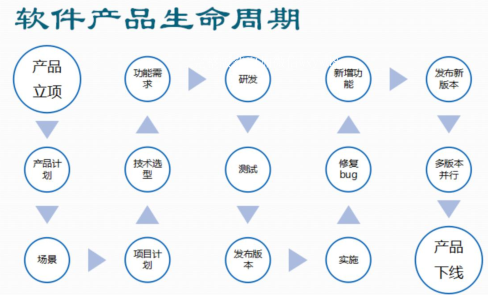
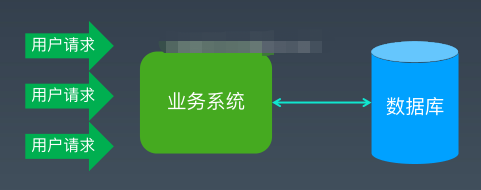
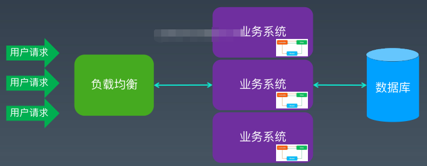
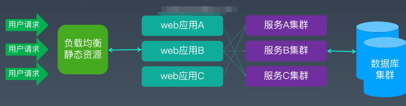
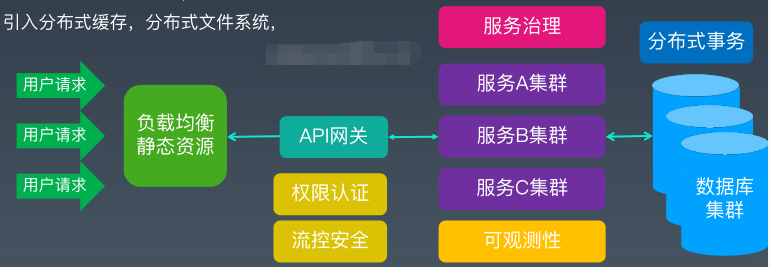
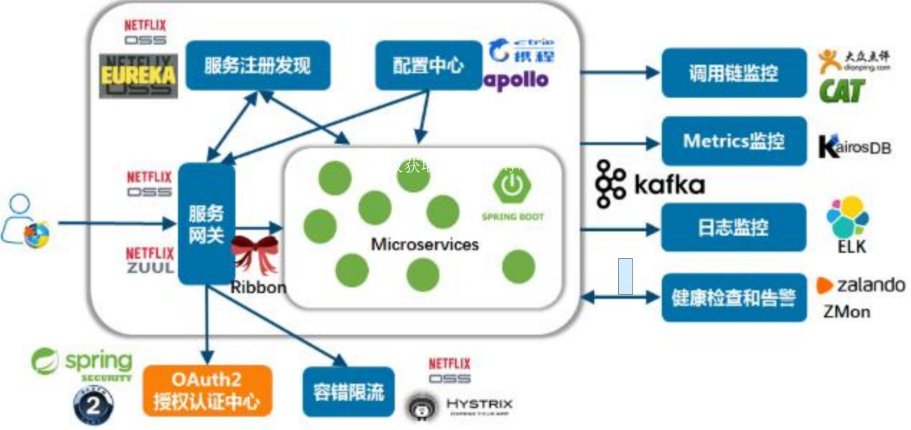

## 1. 背景
### 1.1. 架构起源
&emsp;&emsp;架构的词来自于建筑领域，指的是盖房子前需要做的详细设计，后续施工直接按照设计图纸无脑执行就可以了。但是建筑工程目前非常的成熟，已经形成了一套有效的规范。软件工程却做不到，主要原因有：  
* 软件领域人的因素占比很大，不同层次的人设计和实施都可能不一样
* 技术因素，技术发展迭代非常快，架构思路和实现方式并非一成不变，不像建筑领域，技术发展没那么快，钢筋水泥的技术不会变化的那么多。
* 产品因素，软件产品变更很方便，说改就该，而建筑设计好了，盖好了，推翻重做或修改的成本很高，软件的边际成本为0。
* 标准因素，软件的标准各不相同，不像建筑，标准就是安全可靠，或者是其它的一些比较明确清晰的标准。
### 1.2. 为什么要做架构设计
//todo 

## 2. 什么是架构

### 2.1.架构定义
&emsp;&emsp;国际标准化组织给架构下了个定义：系统的架构是一系列基本概念或者系统在其环境中表现出来的属性，体现在它的元素、关系及设计和发展的原则中。这句话的中的一些架构的概念含义如下：
* 架构过程：在系统整个生命周期中构思、定义、表达、记录、交流，验证合适实现，维护和改进架构的过程，也就是设计过程
* 架构描述：表达一个架构的工作产出物（通常指的是各种架构图和设计文档）
* 架构视图：通过系统的某些关注点的视角，表达一个系统的工作产出物（例如部署视图、开发视图等）
* 系统：包含了一个或多个进程，硬件，软件，工具与可以满足需求的人的集合。
* 环境：决定了开发、操作、策略和其他影响系统的设置和条件。
* 架构文档：用来描述和交流系统架构的媒介  

&emsp;&emsp;总结下来，可以将架构用一句话概括：软件架构是一个用于指导系统实现的草图，这个草图越详细对于系统实现的指导意义越重大，贯穿于软件的整个生命周期。
架构在软件领域长时间发展，还有很多名词，比如模式、组件、服务、模块、类库、框架、平台。下面我们介绍下它们到底是什么以及它们之间的区别。  

### 2.2.架构相关概念

#### 2.2.1. 架构模式
&emsp;&emsp;什么是模式呢？模式是对于普遍问题的普遍解决方案，模式是一些经验的总结。  
&emsp;&emsp;模式是表示上下文环境、动机、解决方案三个方面关系的一个规则，每个模式描述了一个在特定上下文环境里不断重复发生的问题的一类解决方案。我们把一类问题的共性抽象出来，这样就可以用同样的处理办法去解决这些问题，从而形成模式。根据模式处理问题的领域的粒度不同，我们将模式分成了三个层次：  

* 架构模式  
  最高层次的模式，在软件过程里描述系统的基础结构、子系统划分，确定职责和边界，以及相互作用关系。
* 设计模式  
  用来处理解决程序设计里具体场景下的问题的解决办法
* 实现模式  
  最低层次的具体问题处理办法，例如编码规范、命名规则等。

#### 2.2.2. 类库

&emsp;&emsp;类库（Library）是一组可复用的功能或工具的集合，应用系统通过调用它们从而达到复用功能的目的。  
&emsp;&emsp;例如，mavnen的各种jar包，log4j、httpclient等待工具类。类库根据其所在的语言或平台环境的不同，可以是编译后的二进制执行码或中间码形式（DLL或jar），也可以是源代码（PHP、NodeJS里的类库）。类库的调用关系一般在开发期引入到目标应用的项目中，运行期执行实际调用。  

#### 2.2.3. 框架
&emsp;&emsp;框架是基于一组类库或工具。在特定领域里根据一定的规则组合成的、开放性的应用骨架，比如SSM/SSH框架，甚至JDK都算是一种框架。它的特点如下：  
* 支撑性+扩展性：  
  &emsp;&emsp;框架不解决具体的业务功能问题，我们可以在框架的基础上添加各种具体的业务功能、定制特性，从而形成具体的业务应用系统。
* 聚合性+约束性：  
  &emsp;&emsp;框架是多种技术点的按照一定规则的聚合体。我们采用了某种框架也就意味着做出了技术选型的取舍。在很多种可能的技术组合里确定了一种具体的实现方式，后续的其他工作都会从这些技术出发，也需要遵循这些规则，所以框架本身影响到研发过程里的方方面面。  
  &emsp;&emsp;在一个具体的框架之上添加一些基本或可复用的功能，这时候就得到一个介于框架和应用之间的结构，我们一般叫脚手架，可以用来快速的实现类似项目。

#### 2.2.4. 模块
&emsp;&emsp;模块是业务或系统的按照特定维度的一种切分，同时也可以看做是各种功能按照某种分类聚合的一种形式。例如我们的一个电商系统，可以从业务上划分为用户模块，商品模块，订单模块，支付模块，物流模块，售后模块等。  
&emsp;&emsp;另一方面，我们也可以说用户模块聚合了用户注册、用户验证等业务功能。这样，我们在设计和开发过程中，就可以按照模块的维度去组织，比如每个模块新建一个源码的子项目（subproject）、打包成一个单独的jar包，也可以放到一个项目里用不同的package名称来区分等。模块一般是系统在较大粒度上的解耦切分，仅次于系统或子系统的级别。

#### 2.2.5. 组件
&emsp;&emsp;组件是一组可以复用的业务功能的集合，包含一些对象及其行为。组件可以直接被用做业务系统的组成部分，粒度一般小于模块，也是一种功能的聚合形式。  
&emsp;&emsp;比如日志组件、权限组件等。根据组件的形式、行为和用途的不同，我们又可以延伸一些概念：  
* 构件  
  &emsp;&emsp;具有层次组合关系的多个组件组合形成的复杂组件形式。比如RCP里一个Window里左边嵌套一个TreeView组件、右边添加一个GridView组件，这样就形成了一个Composite构件。
* 部件  
  &emsp;&emsp;部件主要是有UI界面的构件，比如Windows 7或Mac系统自带的桌面天气小部件等。
* 插件  
  &emsp;&emsp;系统运行期间可以即插即用、随时停用卸载的组件，一般有确定的生命周期，比如google Atom编辑器的各种插件、OSGi中的bundle、Eclipse插件（本质上也是OSGi的bundle）等。

#### 2.2.6. 服务
&emsp;&emsp;结构化信息组织对服务的定义为，一种允许访问一个或多个功能的机制，其中访问需要使用规定的接口，并且与服务描述中指定的约束和策略一致。  
&emsp;&emsp;概括来说，服务是一组对外提供业务处理能力的功能，服务需要使用明确的接口方式（比如WebService或Rest等），服务描述里应该包括约束和策略（比如参数、返回值，使用什么通讯协议和数据格式等）

#### 2.2.7. 平台
&emsp;&emsp;一般来说，平台是一个领域或方向上的生态系统，是很多解决方案的集大成者，提供了很多的服务、接口、规范、标准、功能、工具等。例如J2EE平台，包含了企业级应用开发里的各种基于Java语言和JVM虚拟机运行时的技术能力。

### 2.3. 小结
* 库是工具箱
* 框架是通用的解决方案
* 架构是高度抽象的需求，系统的不变量
* 平台是所有可能做的事的集合  

&emsp;&emsp;事实上，服务、平台、架构这几个概念这几年已经被泛化了，什么地方都可以滥用这几个词，随便一个系统都可以说自己是大数据平台，XX业务平台，XXX服务化架构。  

## 3. 架构设计的生命周期  
### 3.1. 软件的生命周期总览
  
软件生命周期可以概况为3个大的周期：  
* 设计期（包括立项、计划、技术选型与方案等）
* 实现期（包括开发、测试、发布、实施等）
* 运行期（或维护期，包括修复bug、新增功能、多版本维护等）。
### 3.2. 架构在软件生命周期的各个阶段作用
#### 3.2.1. 设计期  
&emsp;&emsp;软件作为一个成品还不存在，所以我们可以称之为概念形态。此时架构师、产品经理或需求分析师等人员利用自己的经验能力，对系统的业务需求进行分析、拆解、抽象，形成业务文档和技术文档，以及技术验证代码等。这个阶段，架构设计工作是重中之重，其中包括：  
* 系统分拆，如何把系统拆解为不同的子系统、模块、业务单元；
* 技术选型，使用什么样的基础技术框架或脚手架；
* 技术验证，确定核心技术难点如何解决，检验能否满足期望指标；
* 接口规范，系统的内部不同部分以何种形式确定接口契约和数据通信；
* 集成方式，系统与外部其他业务系统如何进行集成；
* 技术规范，如何规范开发、测试、部署和运维的技术标准性；
* 部署方案，系统如何进行物理部署，需要多少机器、什么配置，对网络有什么要求；
* 运维方案，系统如何进行技术性运维，如何日常监控、预警报警；  

总结一下：业务为要，架构先行（包括业务架构和技术架构）。
#### 3.2.2. 实现期  
&emsp;&emsp;这个阶段主要是编码与测试，准备部署上线，是软件从代码到最终的生产系统的过程，我们可以称之为代码形态。此阶段需要考虑的技术类工作包括：  
* 确保各项技术规范和技术指标的执行落地，保障高质量的代码；
* 指导研发人员和解决各类技术问题，提升研发团队效率；
* 制定测试的技术性方案和基准，自动化、性能、安全等；
* 配合准备部署环境，运维实施方案落地等
  
&emsp;&emsp;实现期的主要任务是大量软件工程师根据设计期的设计编码。大量的人员，大家背景不同，知识储备不同，编程水平和习惯不同，努力程度不同，如何能够让所有工程师都既能够按数量保障项目进度，又能够按质量保障软件品质呢？  
&emsp;&emsp;秘诀就在于：技术标准的精确统一，系统部件的良好拆分，此外最好有适合于此类项目的脚手架，随时能解决各位技术难点问题的救火队。系统部件的良好拆分，保障了任务是可以拆散成一个个的小单元，分发给不同的开发者。技术标准的精确统一，可以实现不同个体的产出物最大程度的一致性。总结为，标准统一，快速开发。
#### 3.2.3. 运行期  
&emsp;&emsp;这个阶段系统上线、验收通过，已经初步稳定，然后进入维护阶段，成为了设计期架构设计草图的一个可用实例，我们可以称之为实例形态。此时需要考虑：  
* 发布上线相关基础性工作，包括是否使用持续集成（CI)、自动化发布等技术；
* 运维基础性工作，自动化运维，监控等相关技术；  
  
&emsp;&emsp;进入维护期以后，软件系统日常通过内外部用户反馈的问题和改进意见，不时需要修改代码发布补丁版本或者调整数据以满足用户需要。  
&emsp;&emsp;经过较长一段时间，业务模式和内外部环境发生了比较大的变化以后，系统简单的补丁维护可能就不能满足用户需求，需要大范围的添加新功能和修改旧功能的逻辑流程，此时就可以成立专门的团队，重复上面的步骤，基于现有系统重新做一些改造性的设计重构（设计期），再编码实现（实现期），最终再发布一个较大的版本（运行期）。总结为，基础设施，监控运维。  
&emsp;&emsp;在软件的整个生命周期里，架构师或架构组是一个项目或者产品线的技术负责人，再大一点的组织，比如公司或研发中心级别层面也许还有架构部，架构师、架构组、架构部在不同层面对自己工作涉及到的所有技术问题负责。其实上面罗列的这些工作汇总一下，再加上技术规划与执行落地、技术人才的选拔与培养等，可以作为项目组架构师或者研发团队架构组的工作职责。  

## 4. 系统架构的发展

### 4.1. 架构发展史
* 单体架构  
  最简单的架构风格，所有代码都在一个项目中，研发团队的任何人都可以修改和新增代码
* 垂直架构  
  例如MVC结构，分层对复杂系统进行结构化思考和抽象聚合的通用方法
* 面向服务架构（SOA架构）  
  服务是最基本的业务功能服务单元，由平台中立性结构契约来定义。面向服务架构（soa）是一种建设企业it生态系统的架构指导思想。
* 微服务架构  
  微服务架构风格，以实现一组微服务的方式来开发一个独立的应用系统的方法。每一个微服务都是一个进程，一般采用http这种轻量的通讯方式进行通讯。

### 4.2. 电商平台的例子
* 单体架构  
  以提升硬件性能来提升系统的处理能力  
  

* 垂直架构  
  大规模java应用开发，软件层面以分层为设计原则，大规模部署方式：设计负载均衡，反向代理，spring/orm等框架  
  
* 分布式服务化，rpc与前后端分离为代表  
  * 引入数据库中间件和复制，解决数据库高可用和容量
  * 引入缓存，解决热点读问题
  * 引入全文检索，解决海量的复杂条件查询问题  

    

* 微服务架构  
  * 大规模分布式服务化+容器化+治理化
  * 对业务和数据库拆分，简化系统复杂度和独立演进
  * 关注与服务治理和监控，系统稳定和可用性
  * 引入分布式缓存，分布式文件系统  

  
    

## 5. 总结