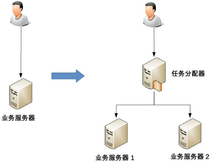
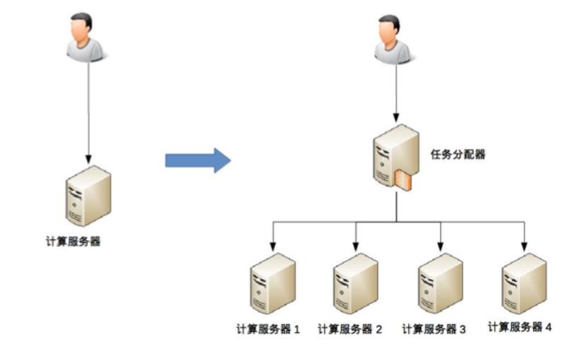
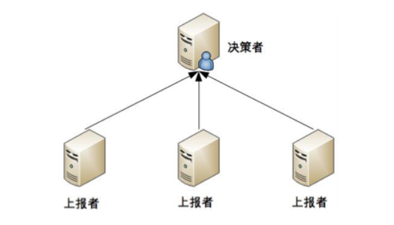
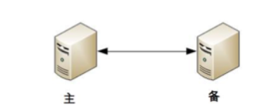
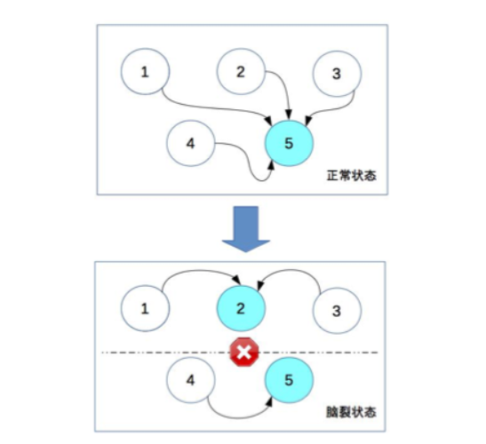
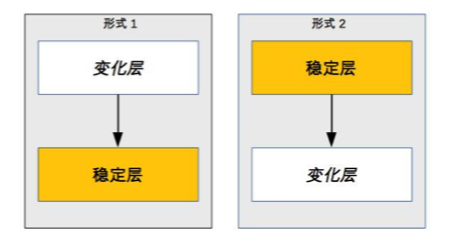
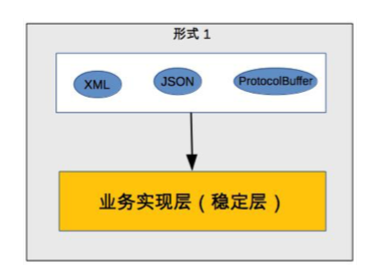
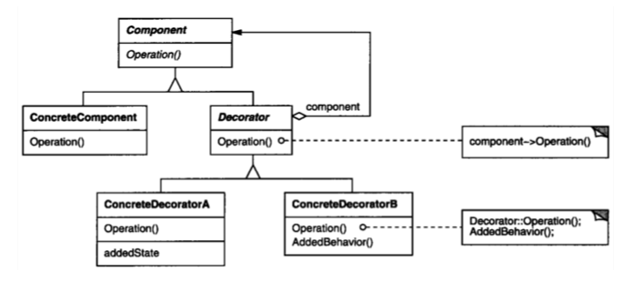
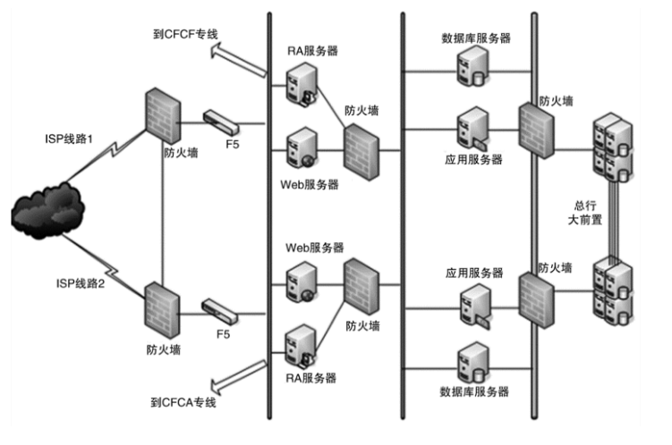
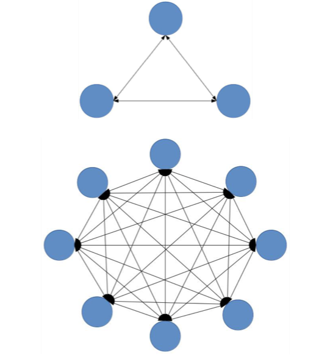

## 1. 概述  
&emsp;&emsp;之前的文章说过架构设计的主要目的是为了解决软件系统复杂度带来的问题。有前人已经总结了，复杂度的来源一共有6个：  
* 高性能
* 高可用
* 可扩展性
* 低成本
* 安全
* 规模

## 2. 高性能  
&emsp;&emsp;高性能是如何给系统带来复杂性的呢？主要体现在两个方面？
* 单台计算机为了提升性能带来的复杂度
* 多台计算机做成的服务集群带来的复杂性  

这些问题怎么讲呢？

### 2.1. 单台计算机的复杂度  
&emsp;&emsp;计算机内部复杂度最关键的地方就是操作系统，操作系统和性能最相关的就是进程和线程。  
&emsp;&emsp;单台计算机的复杂度是如何增加的呢？ 这其实是一个操作系统的发展史：  
* 最早的计算机其实是没有操作系统的,只有输入、计算和输出功能,性能非常低
* 批处理操作系统应运而生，先把要执行的指令预先写下来（写到纸带、磁带、磁盘等），形成一个指令清单，批处理操作系统负责读取“任务”中的指令清单并进行处理，一次只能执行一个任务，性能有进步但cpu还是有空余闲置的。
* 发明了“进程” ，采取了分时的方式，即把 CPU 的时间分成很多片段，每个片段只能执行某个进程中的指令
* 进程通讯被设计出来，包括管道、消息队列、信号量、共享存储等。
* 多进程之间内存不能共享，且进程还是串行的，人们又发明了线程，线程是进程内部的子任务，但这些子任务都共享同一份进程数据，同时互斥锁机制被引入了。
* 以上还是一个cpu在跑
* 多核cpu被引入，实现真正意义上的多任务并行  

&emsp;&emsp;从上面可以看出，仅仅要完成一个高性能的单机软件系统，就需要了解需要考虑如多进程、多线程、进程间通信、多线程并发等技术点。  
&emsp;&emsp;并不是最新的就是最好的，也不是非此即彼的选择。在做架构设计的时候，需要花费很大的精力来结合业务进行分析、判断、选择、组合，这个过程同样很复杂。比如Nginx 可以用多进程也可以用多线程，JBoss 采用的是多线程；Redis 采用的是单进程，Memcache 采用的是多线程。

### 2.2. 集群的复杂度    
&emsp;&emsp;业务的发展速度远远超过了硬件的发展速度，单机的性能无论如何是无法支撑的，必须采用机器集群的方式来达到高性能。   
&emsp;&emsp;然而事情往往没有这么建单，通过加机器提升性能伴随着系统的复杂度也大大的提升了。

#### 2.2.1. 任务分配
&emsp;&emsp;当服务器增加后，需要新增一个任务分配器来将请求分配至相应的服务集群上去。  
  
&emsp;&emsp;这里的任务分配器在实际生产中有：F5、交换机、LVS、Nginx、HAProxy；还可能是网关。  
任务分配器的特点为：
* 业务服务器和任务分配器需要交互，需要管理，比如连接检测、连接中断的特点
* 任务如何分配，采用何种分配算法、轮询、权重、负载均衡等。业务服务器还需要上报自己的任务状态。

&emsp;&emsp;当我们的任务分配器的压力上来后，任务分配器本身又会成为性能瓶颈，当业务请求达到每秒 10 万次的时候，单台任务分配器也不够用了，任务分配器本身也需要扩展为多台机器。此时任务分配器的复杂度大大提升，其特点有：
* 需要将不同的用户分配到不同的任务分配器上,常见的任务分配策略，如：DNS 轮询、智能 DNS、CDN（Content Delivery Network，内容分发网络）、GSLB 设备（Global Server Load Balance，全局负载均衡）
* 需要特别关注任务分配器的状态管理，故障处理，这些在网状的网络模型中非常的困难。
  

#### 2.2.2. 任务分解  
&emsp;&emsp;任务分配的方式，我们能够突破单台机器处理性能的瓶颈，但是单纯只通过任务分配的方式来扩展性能，收益会越来越低，1台机器扩充10台，性能不可能达到十倍以上，造成这种现象的主要原因是业务越来越复杂，单台机器处理的性能会越来越低。为了能够继续提升性能，如果业务更复杂，性能会更差，调用链更复杂。为了能够继续提升性能，我们需要采取第二种方式：任务分解。  
&emsp;&emsp;其核心思想为：把原来大一统但复杂的业务系统，拆分成小而简单但需要多个系统配合的业务系统，代码内部调用改为通过服务器之间的接口调用。  
&emsp;&emsp;为什么这么拆分能够提升性能呢？  
* 简单的系统更加容易做到高性能  
  通过简单的系统定位性能瓶颈更加容易
* 可以针对单个任务进行扩展  
  不需要改动整个系统，针对有瓶颈的子系统进行性能优化或者提升，可以是代码优化，也可以简单粗暴地加机器，不用修改其它的业务模块。

   
**注意： 并不是划分得越细越好，如果系统拆分得太细，为了完成某个业务，系统间的调用次数会呈指数级别上升，系统间的调用通道目前都是通过网络传输的方式，性能远比系统内的函数调用要低得多。虽然系统拆分可能在某种程度上能提升业务处理性能，但提升性能也是有限的，最终决定业务处理性能的还是业务逻辑本身，业务逻辑本身没有发生大的变化下，理论上的性能是有一个上限的，系统拆分能够让性能逼近这个极限，但无法突破这个极限**  

### 2.3. 小结  
高性能带来的复杂度主要体现的两方面：
* 单台计算机内部为了高性能带来的复杂度
* 二是是多台计算机集群为了高性能带来的复杂度

## 3. 高可用  
现在到处在讲高可用，那么什么是高可用呢？  
&emsp;&emsp;系统无中断地执行其功能的能力，代表系统的可用性程度，是进行系统设计时的准则之一    
&emsp;&emsp;什么会导致系统中断呢？有很多情况都会导致的，比如硬件会出故障、老化、软件越来越复杂导致的bug、外部环境的不可抗力因素比如断电、地震、战争等很多因素都会导致。    
&emsp;&emsp;高可用方案五花八门，但是万变不离其宗，就是冗余机制：  
  * 一台机器不够就两台，两台不够就四台
  * 一个机房可能断电，那就部署两个机房
  * 一条通道可能故障，那就用两条，两条不够那就用三条（移动、电信、联通一起上）  

&emsp;&emsp;从形式上来看，和之前讲的高性能是一样的，是通过增加更多机器来达到目的。但是有着本质的区别：  
* 高性能增加机器目的在于“扩展”处理性能；
* 高可用增加机器目的在于“冗余”处理单元  

通过系统的类型可以讲高可用分为以下几种： 

### 3.1. 计算高可用   
该类型的高可用的特点为：  
&emsp;&emsp;无论在哪台机器上进行计算，同样的算法和输入数据，产出的结果都是一样的。  
&emsp;&emsp;实现这样的高可用的复杂度体现在什么地方呢？和之前的性能类似，复杂度主要体现在：  
* 需要增加一个任务分配器，选择合适的任务分配器也是一件复杂的事情，需要综合考虑性能、成本、可维护性、可用性等各方面因素
* 任务分配器和真正的业务服务器之间有连接和交互，需要选择合适的连接方式，并且对连接进行管理。例如，连接建立、连接检测、连接中断后如何处理等
* 任务分配器需要增加分配算法。例如，常见的双机算法有主备、主主，主备方案又可以细分为冷备、温备、热备。分配算法可以更加复杂，可以是 1 主 3 备、2 主 2 备、3 主 1 备、4 主 0 备

### 3.2. 存储高可用 
存储与计算相比，有一个本质上的区别：将数据从一台机器搬到到另一台机器，需要经过线路进行传输。线路传输的速度是毫秒级别，同一机房内部能够做到几毫秒；分布在不同地方的机房，传输耗时需要几十甚至上百毫秒。这种对于高可用系统来说，可能会使得最终的业务结果很难让人接受。  
&emsp;&emsp;**存储高可用的难点不在于如何备份数据，而在于如何减少或者规避数据不一致对业务造成的影响**  
&emsp;&emsp;著名的 CAP 定理，从理论上论证了存储高可用的复杂度,一致性、可用性、分区容错性不可能同时满足，最多只能满足两个。

### 3.3. 高可用协议  
&emsp;&emsp;上面介绍了两种高可用系统，都是需要能够判断当前的状态是正常还是异常，如何来判断当前系统是否能够正常提供服务呢，主要有这么几种？  
**注意：但是通过冗余来实现的高可用系统，状态决策本质上就不可能做到完全正确**可以参考cap理论。  
#### 3.3.1. 独裁式    
独裁式决策指的是只存在一个独立的决策主体，冗余的个体上报信息给独裁者，通过独裁者来决定这个系统是否存在问题。  
存在的问题：系统的可用性较差，当决策者本身故障时，整个系统就无法实现准确的状态决策。如果决策者本身又做一套状态决策，那就陷入一个递归的死循环了。  

#### 3.3.2. 协商式  
协商式决策指的是两个独立的个体通过交流信息，然后根据规则进行决策，最常用的协商式决策就是主备决策. 其核心机制为：  
* 2 台服务器启动时都是备机。
* 2 台服务器建立连接。
* 2 台服务器交换状态信息
* 某 1 台服务器做出决策，成为主机
* 另一台服务器继续保持备机身份  
  
存在的问题：  
&emsp;&emsp;比如网络原因，备机并不知道主机是否正常，所以备机怎么做呢，万一只是线路问题导致的呢，万一真的有问题呢？不管备机怎么做都有可能导致结果不符合预期。    
如果为了规避连接中断对状态决策带来的影响，可以增加更多的连接。例如，双连接、三连接。这样虽然能够降低连接中断对状态带来的影响（注意：只能降低，不能彻底解决），但同时又引入了这几条连接之间信息取舍的问题，即如果不同连接传递的信息不同，应该以哪个连接为准？实际上这也是一个无解的答案，无论以哪个连接为准，在特定场景下都可能存在问题。  
**所以这个无解的问题。**  

#### 3.3.3. 民主式    
&emsp;&emsp;民主式决策指的是多个独立的个体通过投票的方式来进行状态决策,例如众多的分布式系统。zookeeper就是民主决策的。  
&emsp;&emsp;民主式决策和协商式决策比较类似，其基础都是独立的个体之间交换信息，每个个体做出自己的决策，然后按照“多数取胜”的规则来确定最终的状态。民主决策的实现一般是paxos协议的变种。非常的复杂。    

存在的问题：
* 脑裂问题，原来统一的集群因为连接中断，造成了两个独立分隔的子集群，每个子集群单独进行选举，于是选出了 2 个主机，相当于人体有两个大脑了 ，两个子集群的连接已经中断，无法进行信息交换。按照民主决策的规则和算法，两个子集群分别选出了节点 2 和节点 5 作为主节点，此时整个系统就出现了两个主节点。这个状态违背了系统设计的初衷，两个主节点会各自做出自己的决策，整个系统的状态就混乱了
* 投票节点数必须超过系统总节点数一半，虽然解决了脑裂问题，但同时降低了系统整体的可用性  

### 3.4. 小结    
&emsp;&emsp;**什么是高可用**  
&emsp;&emsp;我们可以可以先定义什么是不可用。需要经历若干环节，网站的页面才能呈现在最终的用户面前；而其中的任何一个环节出现了故障，都可能会导致网站的页面不可访问，也就是出现了网站不可用的情况。昨夜iOS版本QQ出现大面积闪退就是一个系统不可用的典型案例。其原因通常有:
* 硬件故障。网站多运行在普通的商用服务器，而这些服务器本身就不具备高可用性，再加之网站系统背后有数量众多服务器，那么一定时间内服务器宕机是大概率事件，直接导致部署在该服务器上的服务受影响。
* 软件BUG或网站更新升级发布。BUG不能消灭，只能减少；
* 上线后的系统在运行过程中，难免会出现故障，而这些故障同样直接导致某些网站服务不可用；此外，网站更新升级发布也会引起相对较频繁的服务器宕机。
* 不可抗拒力。如地震、水灾、战争等。  

&emsp;&emsp;高可用的量化指标可以利用百分比来对网站可用性进行度量，网站不可用时间=完成故障修复的时间点 - 故障发现的时间点，一些知名大型网站的可用性可达到99.99%（俗称4个9），我们可以算一下一年下来留给处理故障的时间有多少，年度总时间=365*24*60=525600分钟，网站不可用时间=525600*(1-99.99%)=52.56分钟，可见，高可用性就是技术实力的象征，高可用性就是竞争力。
  
&emsp;&emsp;**如何做到高可用呢？**  
&emsp;&emsp;核心思想：网站高可用的主要技术手段是服务与数据的冗余备份与失效转移。同一服务组件部署在多台服务器上；数据存储在多台服务器上互相备份。通过上述技术手段，当任何一台服务器宕机或出现各种不可预期的问题时，就将相应的服务切换到其他可用的服务器上，不影响系统的整体可用性，也不会导致数据丢失。  
&emsp;&emsp;从架构角度看可用性：当前网站系统多采用经典的分层模型，从上到下为：应用层、服务层与数据层。应用层主要实现业务逻辑处理；服务层提供可复用的服务；数据层负责数据读写；在部署架构上常采用应用和数据分离部署，应用会部署到不同服务器上，这些服务器被称为应用层的服务器；这些可复用的服务也会各自部署在不同服务器上，称为服务层的服务器；而各类数据库系统、文件柜等数据则部署在数据层的服务器。  
&emsp;&emsp;硬件故障方面引起不可用的技术解决措施：
* 应用服务器。  
  可通过负载均衡设备将多个应用服务器构建为集群对外提供服务（前提是这些服务需要设计为无状态，即应用服务器不保存业务的上下文信息，而仅根据每次请求提交的数据进行业务逻辑的操作响应），当均衡设备通过心跳检测手段检测到应用服务器不可用时，则将其从集群中移除，并将请求切换到其他可用的应用服务上。
* 服务层服务器。  
  这些服务器被应用层通过分布式服务框架（如Dubbo）访问，分布式服务框架可在应用层客户端程序中实现软件负载均衡，并通过服务注册中心提供服务的服务器进行心跳检测，当发现有服务器不可用时，立即通知客户端程序修改服务列表，同时移除响应的服务器。
* 数据服务器。  
  需要在数据写入时进行数据同步复制，将数据写入多台服务器上，实现数据冗余备份；当数据服务器宕机时，应用程序将访问切换到有备份数据的服务器上。

&emsp;&emsp;以上是整个生态系统层面而言，对于具体的系统，比如数据库，消息中间件的高可用，我们可以使用不同的高可用决策来实现高可用，比如有独裁者、协商、民主等，但是无论采取什么样的方案，状态决策都不可能做到任何场景下都没有问题，但完全不做高可用方案又会产生更大的问题，如何选取适合系统的高可用方案，也是一个复杂的分析、判断和选择的过程。  

&emsp;&emsp;软件方面引起不可用的技术解决措施：通过软件开发过程进行质量保证。通过预发布验证、严格测试、灰度发布等手段，尽量减少上线服务的故障。  

## 4. 可扩展性  
&emsp;&emsp;可扩展性指系统为了应对将来需求变化而提供的一种扩展能力，当有新的需求出现时，系统不需要或者仅需要少量修改就可以支持，无须整个系统重构或者重建。   
为了解决可扩展性带来的问题，先是有了面向对象的语言，然后有了设计模式，比如本来一个类可以搞定的事情，非要多个类组合在一起完成，这就是为了达到可扩展性。一个可扩展性的程序时一个程序员能力体现之一。
如何使得系统达到可扩展性,需要满足两个条件：  
* 正确预测变化
* 完美封装变化 

### 4.1. 预测变化  
唯一不变的是变化，所以没有完美的预测，但是一个系统需要去预测，这个非常考验一个架构师的经验。预测变化要考虑哪些因素呢？这里从开发一个简单管理系统来预测：  
*  MySQL 存储数据时，是否要考虑后续需要用 Oracle 来存储
*  HTTP 做接口协议时，是否要考虑要不要支持 ProtocolBuffer？
*  是否考虑前沿的深度学习    

如上的如果都要做考虑，那么这个系统会异常的庞大，最终可能导致系统无法落地。所以预测变化的复杂度来自于：  
* 不能每个设计点都考虑可扩展性
* 不能完全不考虑可扩展性
* 所有的预测都存在出错的可能性  

&emsp;&emsp;所以预测变化是一件很复杂的事情，更多是靠自己的经验、直觉，没有明确的标准，不同的人理解和判断有偏差，而最终又只能选择一个判断。  

### 4.2. 应对变化  
预测变化是一回事，采取什么方案来应对变化，又是另外一个复杂的事情。即使预测很准确，如果方案不合适，则系统扩展一样很麻烦。如何使得系统能够更好的应对变化呢？  
一般是将变化封装在变化层，将不会变化的封装在稳定层。  
  
例如接口的不同格式的变化，可以将接口格式抽象一层。  
  

这些措施都会带来一系列的复杂度的问题，主要有两个：  
*  系统需要拆分出变化层和稳定层，这个边界如何控制，哪些属于变化层，哪些属于稳定层一般现实情况会很模糊，每个人的理解不同。
*  需要设计变化层和稳定层之间的接口， 这个也非常的复杂，变化层如何向稳定层提供数据，一般可以提炼出一个“抽象层”和一个“实现层”，抽象层是稳定的，实现层可以根据具体业务需要定制开发，当加入新的功能时，只需要增加新的实现，无须修改抽象层，可以使用相对应的设计模式。  

例如我们可以使用装饰者模式完成变化层和抽象层的分离：
 装饰模式是在不必改变原类和使用继承的情况下，动态地扩展一个对象的功能。它是通过创建一个包装对象，也就是装饰来包裹真实的对象  
  
* Component 和 Decorator 类。 
* Decorator 类继承 Component 类。 
* Decorator 类聚合了 Component 类。  

装饰者模式相比传统的继承来实现功能，确实灵活很多。但装饰者模式相对普通的类实现模式，明显要复杂多了。本来一个函数或者一个类就能搞定的事情，现在要拆分成多个类，而且多个类之间必须按照装饰者模式来设计和调用。
   

**注意：设计模式的核心就是，封装变化，隔离可变性**

### 4.3. 小结    
什么是可扩展性？  
按照可扩展性的定义，一个具备良好可扩展性的架构设计应当符合开闭原则：对扩展开放，对修改关闭。衡量一个软件系统具备良好可扩展性主要表现但不限于：
* 软件自身内部方面。在软件系统实现新增的业务功能时，对现有系统功能影响较少，即不需要对现有功能作任何改动或者很少改动。
* 软件外部方面。软件系统本身与其他存在协同关系的外部系统之间存在松耦合关系，软件系统的变化对其他软件系统无影响，其他软件系统和功能不需要进行改动。反之，则是一个可扩展性不好的软件系统。

如何设计可扩展性好的架构？  
设计具备良好可扩展性的系统，有两个思考角度：
* 从业务维度。对业务深入理解，对可预计的业务变化进行预测。  
  在业务维度。对业务深入理解，对业务的发展方向进行预判，也就是不能完全不考虑可扩展性；但是，变化无处不在，在业务看得远一点的同时，需要注意:警惕过度设计；不能每个设计点都考虑可扩展性；所有的预测都存在不正确的可能性。
* 从技术维度。利用扩展性好的技术，实现对变化的封装。    
  在技术维度。预测变化是一回事，采取什么方案来应对变化，又是另外一个复杂的事情。即使预测很准确，如果方案不合适，则系统扩展一样很麻烦。第一种应对变化的常见方案是将“变化”封装在一个“变化层”，将不变的部分封装在一个独立的“稳定层”。第二种常见的应对变化的方案是提炼出一个“抽象层”和一个“实现层”

  
在实际的工作生产中，我们可以从以下的角度进行考虑实现可扩展性：  
* 使用分布式服务(框架)构建可复用的业务平台。  
  利用分布式服务框架(如Dubbo)可以将业务逻辑实现和可复用组件服务分离开，通过接口降低子系统或模块间的耦合性。新增功能时，可以通过调用可复用的组件实现自身的业务逻辑，而对现有系统没有任何影响。可复用组件升级变更的时候，可以提供多版本服务对应用实现透明升级，对现有应用不会造成影响
* 使用分布式消息队列降低业务模块间的耦合性  
  基于生产者-消费者编程模式，利用分布式消息队列(如RabbitMQ)将用户请求、业务请求作为消息发布者将事件构造成消息发布到消息队列，消息的订阅者作为消费者从消息队列中获取消息进行处理。通过这种方式将消息生产和消息处理分离开来，可以透明地增加新的消息生产者任务或者新的消息消费者任务。  

  ## 5. 低成本、安全、规模  
  ### 5.1. 低成本
  &emsp;&emsp;一般情况下成本并不是我们重点关注的目标，但如果架构方案涉及几百上千甚至上万台服务器，成本对应整个系统的影响力就非常高了。  
  &emsp;&emsp;“高性能”“高可用”的架构通常需要扩增机器的数量达到目的，低成本正好与此相反，低成本本质上是与高性能和高可用冲突。当我们根据高性能、高可用的要求设计出方案时，评估一下方案是否能满足成本目标，如果不行，就需要重新设计架构。  
  如何能够使得架构既能够高性能、高可用又可以低成本呢？往往只有“创新”才能达到低成本目标。举个例子：  
  * NoSQL（Memcache、Redis 等）的出现是为了解决关系型数据库无法应对高并发访问带来的访问压力
  * 全文搜索引擎（Sphinx、Elasticsearch、Solr）的出现是为了解决关系型数据库 like 搜索的低效的问题
  * Hadoop 的出现是为了解决传统文件系统无法应对海量数据存储和计算的问题
  * Linkedin 为了处理每天 5 千亿的事件，开发了高效的 Kafka 消息系统
  * go语言的出现解决了轻量创建线程的问题
  
&emsp;&emsp; 这些例子复杂度和难度系数非常高的。所以一般中小公司基本都是靠引入新技术来达到低成本的目标；而大公司更有可能自己去创造新的技术来达到低成本的目标，因为大公司才有足够的资源、技术和时间去创造新技术。

### 5.2. 安全
这个毋庸置疑，对于安全非常重要。  
从技术的角度来讲，安全可以分为两类：一类是功能上的安全，一类是架构上的安全  

#### 5.2.1. 功能上的安全  
 &emsp;&emsp;XSS 攻击、CSRF 攻击、SQL 注入、 Struts2高危漏洞、Windows 漏洞、密码破解，黑客会利用各种漏洞潜入系统  
 &emsp;&emsp;功能安全是一个逐步完善的过程，而且往往都是在问题出现后才能有针对性的提出解决方案，我们永远无法预测系统下一个漏洞在哪里，也不敢说自己的系统肯定没有任何问题

 #### 5.2.2. 架构上的安全  
 架构安全主要依靠防火墙，防火墙最基本的功能就是隔离网络，通过将网络划分成不同的区域，制定出不同区域之间的访问控制策略来控制不同信任程度区域间传送的数据流  
     
 防火墙的功能虽然强大，但性能一般,一般银行在用，互联网系统的架构安全目前并没有太好的设计手段来实现，更多地是依靠运营商或者云服务商强大的带宽和流量清洗的能力，较少自己来设计和实现。  

 ### 5.3. 规模  
 很多企业的系统并没有高可用、高性能。但是业务庞大，服务器众多。很多功能的应用场景都不清楚，或者细节根本无法掌握，面对的就是一个黑盒系统，看不懂、改不动、不敢改、修不了，复杂度自然就感觉很高了。 通常复杂度的增长：  
 * 功能越来越多，导致系统复杂度指数级上升  
  
 * 数据越来越多，系统复杂度发生质变.  
    一种数据存储技术是有极限的，mySQL的单表的数据不超过5000万，当超过这个数，会出现大量问题：
    * 添加索引会很慢，升至几天
    * 修改表结构和添加索引存在类似的问题，耗时可能会很长
    * 查询索引效果不大
    * 维护很慢  
  
    对于这种，就可能必须要分库分表或者换存储技术了，这都将引入复杂度的问题，拆表规则？聚合查询？都需要解决啊

 ### 5.4. 小结  
  * 低成本  
    低成本是架构设计中需要考虑一个约束条件，但不会是首要目标。低成本本质上是与高性能和高可用冲突的，当无法设计出满足成本要求的方案，就只能协调并调整成本目标  
    解决方案：  
    * 引入新技术。主要复杂度在于需要去熟悉新技术，并且将新技术与已有技术结合；一般中小型公司基本采用该方式达到目标
    * 开创一个全新技术领域。主要复杂度在于需要去创造全新的理念和技术，并且与旧技术相比，需要有质的飞跃，复杂度更高；一般大公司拥有更多的资源、技术实力会采用该方式来达到低成本的目标

  * 安全  
    * 功能安全-“防小偷”  
      减少系统潜在的缺陷，阻止黑客破坏行为；  
      解决方案：是一个逐步完善的过程，而且往往都是在问题出现后才能有针对性的提出解决方案，与编码实现有关
    * 架构安全—“防强盗”  
      保护系统不受恶意访问和攻击，保护系统的重要数据不被窃取。由于是蓄意破坏系统，因此对影响也大得多。架构设计时需要特别关注架构安全。  
      解决方案：传统企业主要通过防火墙实现不同区域的访问控制，功能强大、性能一般，但是成本更高。互联网企业更多地是依靠运营商或者云服务商强大的带宽和流量清洗的能力，较少自己来设计和实现

  * 规模    
    规模带来复杂度的主要原因就是“量变引起质变”，当数量超过一定的阈值后，复杂度会发生质的变化。随着业务的发展，规模带来的常见复杂度有：  
    * 业务功能越来越多，调用逻辑越来越复杂  
    * 数据容量、类型、关联关系越来越多  

    规模问题需要与高性能、高可用、高扩展、高伸缩性统一考虑。常采用“分而治之，各个击破”的方法策略。  

  * 可伸缩性  
    当前大型互联网网站需要面对大量用户高并发访问、存储更多数据、处理更高频次的用户交互。网站系统一般通过多种分布式技术将多台服务器组成集群对外提供服务。伸缩性一般是系统可以根据需求和成本调整自身处理能力的一种能力。伸缩性常意味着系统可以通过低成本并能够快速改变自身的处理能力以满足更多用户访问、处理更多数据而不会对用户体验造成任何影响。    
    伸缩性度量指标包括：
    * 处理更高并发；
    * 处理更多数据；
    * 处理更高频次的用户交互。  

    其复杂度体现在：  
    * 伸——增强系统在上述三个方面的处理能力
    * 缩——缩减系统处理能力
    * 上述伸缩过程还必须相对低成本和快速。