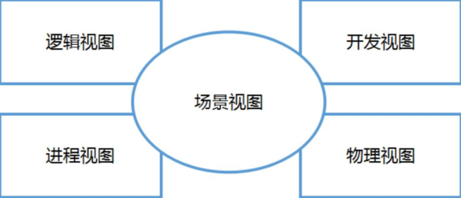
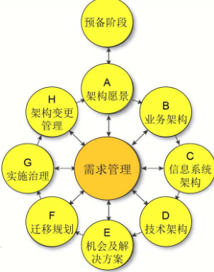
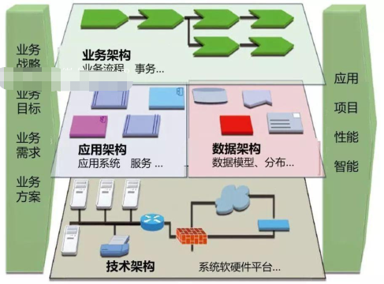

## 1. 架构的形式  
&emsp;&emsp;架构的形式以文档和代码呈现。我们一般说的架构既包括架构的设计过程，也包括设计的产出物，一般可以包括各类设计文档、设计图，也可以包括一些技术验证代码、Demo或者其他相关程序。文档的目的在于准确记录我们的思维产物，在软件尚未实现时，作为指导蓝图，尽量精确的描述清楚软件。  
&emsp;&emsp;在软件已经实现以后，部署运行的软件实例和代码只能说明软件目前是什么状态的，却无法告诉我们这个软件系统中间的决策信息。  
&emsp;&emsp;一个软件系统的长期稳定发展，必然需要一个可靠的、随着软件本身的维护不断同步更新的文档作为每次变更的出发点。这样，我们可以随时沿着架构相关的文档逆流而上，了解这个软件系统从整体到具体的设计思路。  
&emsp;&emsp;同时文档作为结项或交接的一部分，也是整个软件项目的产出物的一部分，成为公司IT资产的有机组成部分。  
&emsp;&emsp;文档是设计的载体，代码是系统功能实现的载体，技术和业务最终都有很大一部分体现在代码里。  
&emsp;&emsp;广义上来说，代码和代码里的注释，都可以认为是文档的一部分。社区有一种观点：良好结构的、可读性强的代码，是最好的“文档”。  
&emsp;&emsp;那么怎么才能写出好的代码呢？关键在于两个词：经验、重构。  
&emsp;&emsp;从代码里，我们可以很直观的了解到，程序做了什么、不能做到什么，以及能做到什么程度，以及其与相关的文档（包括业务文档和技术文档）是否一致。但是代码不适合作为唯一的“文档”，只有代码没有其他文档，就像是一部只有结尾没有开头和过程的电影。我们只能了解到这个系统的一个现在时间点的切面影像。  

## 2. 如何编写文档呢
### 2.1. 架构视图  
&emsp;&emsp;为了清晰的描述软件架构设计，我们就引入了一个概念：架构视图。什么是架构视图呢？  
&emsp;&emsp;Philippe Kruchten在其著作《Rational统一过程引论》中写道：
“一个架构视图是对于从某一视角或某一点上看到的系统所做的简化描述，描述中涵盖了系统的某一特定方面，而省略了于此方面无关的实体”  
&emsp;&emsp;也就是说我们可以使用从不同视角分别描述同一个架构设计，最后把这多个视角的设计综合到一起，就是这个系统的完整架构设计了。这些不同角度的设计文档，也成为了我们理解一个系统的基本依据。  
&emsp;&emsp;一个新的问题是：哪些视角可以作为全面描述一个系统架构的最核心视图呢？  
&emsp;&emsp;1995年，Philippe Kruchten在《IEEE Software》上发表了论文《4+1架构视图模型（The 4+1 View Model of Architecture）》，正式提出了使用场景视图、逻辑视图、开发视图、进程视图、物理视图五个方面来描述架构设计，引起了业界的极大关注，并最终被后来隶属于IBM的Rational软件公司统一软件开发过程方法论（Rational Unified Process，简称RUP）所采纳。  
&emsp;&emsp;在4+1视图模型中，不同架构视图承载不同的架构设计决策，支持不同的目标和用途。概括来说，我们可以从场景视图的功能需求、逻辑视图的对象与交互、进程视图的进程与通信、开发视图的项目开发组织结构、物理视图的网络与机器部署结构等这五个方面来描述一个系统的架构设计，并形成文档、设计图等设计输出物，用于指导后续的软件实现、测试、部署与维护等过程  
  
这些视图都有什么含义呢？
* 用例视图  
  &emsp;&emsp;也叫场景视图，关注最终用户需求，为整个技术架构的上下文环境，通常用UML用例图和活动图描述
* 逻辑视图  
  &emsp;&emsp;主要是整个系统的抽象结构表述，关注系统提供最终用户的功能，不涉及具体的编译即输出和部署，通常在UML中用类图，交互图，时序图来表述，类似与我们采用OOA的对象模型
* 开发视图  
  &emsp;&emsp;描述软件在开发环境下的静态组织，从程序实现人员的角度透视系统，也叫做实现视图（Implementation View）。开发视图关注程序包，不仅包括要编写的源程序，还包括可以直接使用的第三方SDK和现成框架、类库，以及开发的系统将运行于其上的系统软件或中间件, 在UML中用组件图，包图来表述。开发视图和逻辑视图之间可能存在一定的映射关系：比如逻辑层一般会映射到多个程序包等
* 进程视图  
  &emsp;&emsp;进程视图关注系统动态运行时，主要是进程以及相关的并发、同步、通信等问题。进程视图和开发视图的关系：开发视图一般偏重程序包在编译时期的静态依赖关系，而这些程序运行起来之后会表现为对象、线程、进程，进程视图比较关注的正是这些运行时单元的交互问题，在UML中通常用活动图表述  
* 物理视图  
  &emsp;&emsp;物理视图通常也叫做部署视图(Deployment View)，是从系统工程师解读系统，关注软件的物流拓扑结，以及如何部署机器和网络来配合软件系统的可靠性、可伸缩性等要求。物理视图和处理视图的关系：处理视图特别关注目标程序的动态执行情况，而物理视图重视目标程序的静态位置问题；物理视图是综合考虑软件系统和整个IT系统相互影响的架构视图  

### 2.2. 更为系统的架构方法论(togaf)  
  
  

## 3. 架构设计经验
### 3.1. 架构的目的-服务业务
&emsp;&emsp;架构设计服务于业务。架构首先也需要对业务负责。而业务也并非都是一成不变的，随着市场环境的变化、用户习惯的变化、竞争格局的变化，业务形态也一直在顺应环境而改变，架构设计也需要考虑系统在未来的一段时间内支撑这种调整。并且在满足了业务需求和一定的前瞻性的基础上，综合考虑成本、周期、效率、速度、风险等因素。  

### 3.2. 架构与团队组织形式相互影响
&emsp;&emsp;业务拆分的方法和技术框架的选择必然会影响到研发团队的组织形式。
业务拆分的越细致，越有利于我们更好的对项目的各项指标量化计算，更精确的估计工时和成本，从而指导我们每个小组应该分配多少资源，使用什么样的协同和任务确认形式。  
&emsp;&emsp;反过来，研发组织的结构和成熟度也会对我们最终所采取的技术架构产生重要的影响。比如一个由3个初级程序员组成的创业小团队不适于采取特别复杂且小众的开发框架。相反地，利用快速开发框架或脚手架把产品设计迅速实现应该是团队的核心诉求，所以某种全栈类的全家桶解决方案才可能是最适合的技术选择。

### 3.3. 每个系统都存在架构
&emsp;&emsp;每一个已经实现并运行的系统，都是特定架构设计的载体。有些系统对应的架构，有详细的设计文档来描述；有些系统的设计文档，残缺不全，甚至还因为在系统的发展变化的同时，文档没有更新，导致设计文档与实际系统不符；有些系统干脆就没有设计文档。但是这些系统，都是基于一定的架构来创建的。
每种架构方式，每个具体系统内所体现的架构设计，都是可以被工程师们理解，进而提炼出来一些架构思想和设计原则，这些思想和原则就是这种架构方式的风格。  
&emsp;&emsp;依据这些风格，我们可以将各种架构方式，进行分门别类，从而进一步讨论每种架构风格的特点。例如在实现期的代码形式中，系统由各个相似的类库作为组件构成，在运行期这些组件又同时在同一个进程中，这时我们可以认为这是一种“组件式单体架构风格”

### 3.4. 不要过度设计
&emsp;&emsp;矫枉过正，过犹不及。在做架构设计的时候，想当然把问题想复杂了，然后做了过于复杂化的方案。做技术选型的时候，因为自己熟悉和顺手，选了看起来“高大上”，但是实际上不适合的技术或者组件。  

### 3.5. 架构需要演进
&emsp;&emsp;随着计算机软硬件的不断发展，软件架构思想也在不断的发展变化。同时软件为其提供业务处理和服务能力的每个具体行业领域也在不断发展变化，业务处理流程、参与角色、业务形式不断的推陈出新。  
&emsp;&emsp;这就要求我们在系统架构设计时，保持终身学习的精神，持续吸收新思想新知识，保持贴近一线业务群体，随时因地制宜，调整架构设计，采取最适合当下场景的解决方案。  
&emsp;&emsp;同时对于存量的旧系统的维护与改造，很多时候无法一次达到目标，可以考虑循序渐进，设定几个大的里程碑，逐步推进，最终实现比较理想的架构设计。  
&emsp;&emsp;多年以来多很多老旧系统改造的经历，对我影响最深的就是，循序渐进，终达目标，特别是具体的设计实践中，思路和方法，比结论更重要。一个正确的结论在别处可能就是错的，但是思路和方法确实可以复用的。只有通过不断的迭代更新自己的知识和思想，才能一直做出来最适合的架构设计  

## 4. 总结