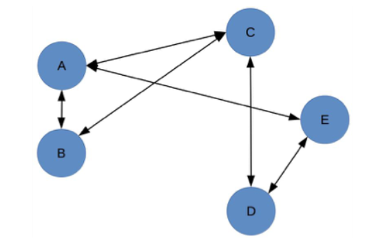
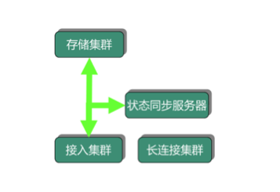
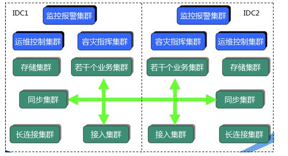
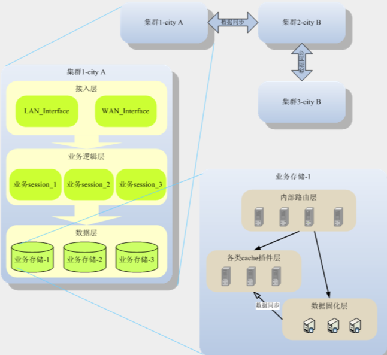
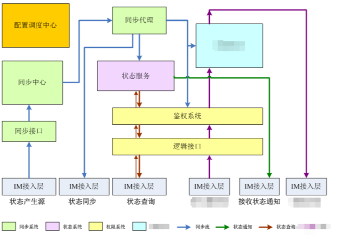

## 1. 开头
&emsp;&emsp;架构设计的主要目的是为了解决软件系统复杂度带来的问题，并分析了复杂度的来源。但是架构设计并没有像编程语言那样的语法来进行约束，更多的时候是面对多种可能性时进行选择。并没有一套通用的规范来指导架构师进行架构设计，更多是依赖架构师的经验和直觉。因此需要有一套原则来指导我们如何根据实际场景来指导架构设计，好在有经验的架构师总结下来一共有有这么几种原则：  
* 合适原则
* 简单原则
* 演化原则

## 2. 架构设计原则
### 2.1. 合适原则  
&emsp;&emsp;合适优于业界领先，怎么讲主要有三点因素： 
* 我们需要考虑现状，需要脚踏实地，没那么多人，却想干那么多活那是不可能的。   
* 没有那么多积累，却想一步登天,也是不可能的。 一个好的系统需要经历很多优化，调整，踩坑的。
* 没有那么卓越的业务场景，却幻想直接成功也不太可能。一个好的系统需要复杂的业务系统的检验的。  

真正优秀的架构都是在企业当前人力、条件、业务等各种约束下设计出来的，能够合理地将资源整合在一起并发挥出最大功效，并且能够快速落地  

### 2.2. 简单原则    
&emsp;&emsp;简单优于复杂。  
&emsp;&emsp;一个优秀的系统本身是非常的复杂的，比如zk，但是复杂并不是它优秀的原因，复杂是它的问题，但是系统设计者会不自觉地追求架构的复杂性。然而，“复杂”在制造领域代表先进，在建筑领域代表领先，但在软件领域，却恰恰相反，代表的是“问题”。  
&emsp;&emsp;软件领域的复杂性体现在两个方面：
* 结构的复杂性：
  * 组成复杂系统的组件数量更多；
  * 同时这些组件之间的关系也更加复杂  
  
  产生的问题：
  * 组件本身有一定概率出现故障，组件越多，那么会导致整个系统的故障率升高。
  * 某个组件改动，会影响关联的所有组件，这些被影响的组件同样会继续递归影响更多的组件，因为组件之间会有联系，这个问题会影响整个系统的开发效率，因为一旦变更涉及外部系统，需要协调各方统一进行方案评估、资源协调、上线配合  
  
  * 定位一个复杂系统中的问题总是比简单系统更加困难。首先是组件多，每个组件都有嫌疑，因此要逐一排查；其次组件间的关系复杂，有可能表现故障的组件并不是真正问题的根源
  
* 逻辑的复杂性：   
  &emsp;&emsp;一个组件内部如果逻辑很复杂，承担了太多的功能，会导致软件工程的每个环节都有问题：
  * 代码规模大，clone都很慢
  * 一行代码出错，整个组件凉凉
  * 开发效率慢，各种分支合并、各种分支覆盖
  * 产品、研发、测试、项目管理不停地开会讨论版本计划，协调资源，解决冲突
  * 版本太多，每天都要上线几十个版本，系统每隔 1 个小时重启一次
  * 线上运行出现故障，几十个人扑上去定位和处理  

    
  &emsp;&emsp;为什么会出现这种问题呢，最主要的是软件系统不像建筑工程，完工后一成不变，它需要不断的修改。是个动态的过程。  
     
  &emsp;&emsp;逻辑的复杂性还包括复杂的算法。复杂算法导致的问题主要是难以理解，进而导致难以实现、难以修改，并且出了问题难以快速解决。  

### 2.3. 演化原则  
演化优于一步到位  
&emsp; &emsp;这里再一次和建筑进行对比，建筑一旦完成（甚至一旦开建）就不可再变，而软件却需要根据业务的发展不断地变化。  
&emsp; &emsp;对于建筑来说，永恒是主题；而对于软件来说，变化才是主题.   
&emsp; &emsp;考虑到软件架构需要根据业务发展不断变化这个本质特点，软件架构设计其实更加类似于大自然“设计”一个生物，通过演化让生物适应环境，逐步变得更加强大:  
* 设计出来的架构要满足当时的业务需要
* 架构要不断地在实际应用过程中迭代，保留优秀的设计，修复有缺陷的设计，改正错误的设计，去掉无用的设计，使得架构逐渐完善
* 当业务发生变化时，架构要扩展、重构，甚至重写；代码也许会重写，但有价值的经验、教训、逻辑、设计等（类似生物体内的基因）却可以在新架构中延续  

这一点和生物的进化很像。  

**注意：架构师在进行架构设计时需要牢记这个原则，时刻提醒自己不要贪大求全，应该认真分析当前业务的特点，明确业务面临的主要问题，设计合理的架构，快速落地以满足业务需要，然后在运行过程中不断完善架构，不断随着业务演化架构，不管多牛的团队，也不可能完美预测所有的业务发展和变化路径下·**

### 2.4. 小结  
&emsp;&emsp;架构需要面向业务需求，并在各种资源（人、财、物、时、事）约束条件下去做权衡、取舍。而决策就会存在不确定性。采用一些高屋建瓴的设计原则有助于去消除不确定，去逼近解决问题的最优解。  
&emsp;&emsp;其中优先级为合适优于先进>演化优于一步到位>简单优于复杂，合适也就是适应当前需要是首位的，连当前需求都满足不了谈不到其他。架构整体发展是要不断演进的，在这个大前提下，尽量追求简单，但也有该复杂的时候，就要复杂，比如生物从单细胞一直演化到如今，复杂是避免不了的。 
* 合适原则  
  架构无优劣，但存合适性。“汝之蜜糖，吾之砒霜”；架构一定要匹配企业所在的业务阶段；不要面向简历去设计架构，高大上的架构不等于适用；削足适履与打肿充胖都不符合合适原则；所谓合适，一定要匹配业务所处阶段，能够合理地将资源整合在一起并发挥出最大功效，并能够快速落地。
* 简单原则  
  简单比复杂更加困难。面对系统结构、业务逻辑和复杂性，我们可以编写出复杂的系统，但在软件领域，复杂代表的是“问题”。架构设计时如果简单的方案和复杂的方案都可以满足需求，最好选择简单的方案。但是，事实上，当软件系统变得太复杂后，就会有人换一个思路进行重构、升级，将它重新变得简单，这也是软件开发的大趋势。 简单原则是一个朴素且伟大的原则，Google的MapReduce系统就采用了分而治之的思想，而背后就是将复杂问题转化为简单问题的典型案例 

* 演化原则  
  大到人类社会、自然生物，小到一个细胞，似乎都遵循这一普世原则，软件架构也不例外。业务在发展、技术在创新、外部环境在变化，这一切都是在告诫架构师不要贪大求全，或者盲目照搬大公司的做法。应该认真分析当前业务的特点，明确业务面临的主要问题，设计合理的架构，快速落地以满足业务需要，然后在运行过程中不断完善架构，不断随着业务演化架构。怀胎需要十月，早一月或晚一月都很危险。  

### 2.5. 案例分析  
#### 2.5.1. 淘宝   
根据一些资料显示，淘宝网站的架构设计发展历程为如下：  
* 个人网站  
  &emsp;淘宝当时在初创时，没有过多考虑技术是否优越、性能是否海量以及稳定性如何，主要的考虑因素就是：快！，在考虑如何买的时候，淘宝的决策依据主要也是“快”，买一个系统是为了“快速可用”，而买一个轻量级的系统是为了“快速开发”，架构设计和选择主要遵循的是“合适原则”和“简单原则”
* Oracle、支付宝、旺旺  
  &emsp;业务发展很快，2003 年底，MySQL 已经撑不住了。业务飞速发展，最快的方式支撑业务的发展还是去买，这个阶段买的就是“性能，这里架构设计和选择主要遵循的还是“合适原则”和“简单原则”
* Java 时代 1.0  
  &emsp;当时是使用PHP 的开源连接池 SQL Relay 连接到 Oracle，而这个代理经常死锁，死锁了就必须重启，而数据库又必须用 Oracle，于是决定换个开发语言。为什么选择java呢，当时 PHP 语言远远没有 Java 那么火、那么好招人。Java 是当时最成熟的网站开发语言，它有比较良好的企业开发框架，被世界上主流的大规模网站普遍采用，另外有 Java 开发经验的人才也比较多，后续维护成本会比较低。这次架构的变化没有再简单通过“买”来解决，而是通过重构来解决，架构设计和选择遵循了“演化原则”
* Java 时代 2.0  
  &emsp;淘宝做了很多优化工作：数据分库、放弃 EJB、引入 Spring、加入缓存、加入 CDN、采用开源的 JBoss。  
  &emsp;原有的方案存在固有缺陷，随着业务的发展，已经不是靠“买”就能够解决问题了，此时必须从整个架构上去进行调整和优化。比如说 Oracle 再强大，在做 like 类搜索的时候，也不可能做到纯粹的搜索系统如 Solr、Sphinx 等的性能，因为这是机制决定的  
  &emsp;随着规模的增大，纯粹靠买的一个典型问题开始成为重要的考虑因素，那就是成本。当买一台两台 Oracle 的时候，可能对成本并不怎么关心，但如果要买 100 台 Oracle，成本就是一个关键因素了。这就是量变带来质变的影响。
* Java 时代 3.0、分布式时代   
  自研技术已经自成一派，除了支撑本身的海量业务，也开始影响整个互联网的技术发展，到了这个阶段，业务规模急剧上升后，原来并不是主要复杂度的 IOE 成本开始成为了主要的问题，因此通过自研系统来降低 IOE 的成本，去 IOE 也是系统架构的再一次演化

#### 2.5.2. QQ  
* 十万级  
  最开始的手机 QQ 非常简答，就是一个接入服务区和一个存储服务器。  
  架构设计遵循的是“合适原则”和“简单原则”
* 百万级  
  2001 年，QQ 同时在线人数也突破了一百万，导致了现有架构的问题很大：  
  * 内存不够
  * 每台机器网卡、cpu、流量都成了瓶颈
  * 单体服务器已经不行了。  
  于是按照“演化原则”的指导进行了重构，重构的方案相比现在来说也还是简单得多，因此当时做架构设计时也遵循了“合适原则”和“简单原则”。  
  
* 千万级  
  QQ 同时在线人数突破了一千万，产生了新的问题。
  * 状态同步服务器遇到单机瓶颈
  * 单台接入服务器存不下，如果在线数进一步增加，甚至单台状态同步服务器也存不下
  * 单台状态同步服务器支撑不下所有在线用户
  * 单台接入服务器支撑不下所有在线用户的在线状态信息  
  架构需要继续改造升级，再一次“演化”  
  
* 亿级 IM 4.X  
  2010 年 3 月，QQ 同时在线人数过亿,新的问题诞生：  
  * 灵活性很差，比如“昵称”长度增加一半，需要两个月
  * 无法支撑某些关键功能，比如好友数上万、隐私权限控制、PC QQ 与手机 QQ 不可互踢、微信与 QQ 互通、异地容灾
  * IM 后台从 1.0 到 3.5 都是在原来基础上做改造升级的，但是持续打补丁已经难以支撑亿级在线，IM 后台 4.0 必须从头开始，重新设计实现  

  再次遵循了“演化原则”，决定重新打造一个这么复杂的系统，IM 4.0 架构如图所示，和之前的架构相比，架构本身都拆分为两个主要的架构：存储架构和通信架构：  
  存储架构：  
      
  通讯架构：  
    

#### 2.6. 小结    

&emsp;&emsp;对淘宝和手机 QQ 两个典型互联网业务的架构发展历程的详细拆解，可以看出，大型互联网架构发展的最重要甚至唯一的驱动力就是"情非得已"，伴随业务的高速发展，用户、数据、流量、业务复杂度都在呈指数级增长，总会突破现有商业、开源条件能够提供的解决方案的有效范围，企业发展到一定程度最终还是要立足自力更生，去摸索、去创新适合自己需求、符合自己业务体系的系统架构。现在的即使是现在非常复杂、非常强大的架构，也并不是一开始就进行了复杂设计，而是首先采取了简单的方式（简单原则），满足了当时的业务需要（合适原则），随着业务的发展逐步演化而来的（演化原则）。罗马不是一天建成的，架构也不是一开始就设计成完美的样子，然后可以一劳永逸一直用下去
&emsp;&emsp;为此，从更宏观的视角来看，不断演化是其架构发展的主旋律，而满足适合、追求简单是架构决策的重要依据。需求驱动技术的创新演化；技术反哺业务的发展升级。