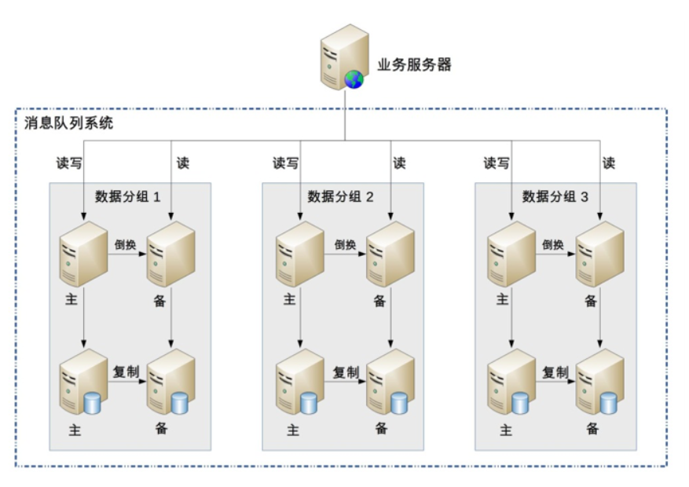

## 1. 开头  
&emsp;&emsp;前面我们介绍了架构设计的一些概念，以及分析了系统复杂度的来源，并知道了架构设计的宏观上的基本原则。那么当我们真要给某系统做架构设计时，有没有通用的设计思路呢？答案是有的。我们在对系统进行架构设计时，完全可以遵循该思路。主要的思路是：
* 识别系统复杂度
* 设计备选方案
* 评估和选择备选方案
* 详细方案设计  

&emsp;&emsp;主要是按照这几个大的步骤来思考即可。  

## 2. 识别复杂度  
### 2.1. 如何识别复杂度  
&emsp;&emsp;架构设计的本质目的是为了解决软件系统的复杂性，所以在我们设计架构时，首先就要分析系统的复杂性。只有正确分析出了系统的复杂性，后续的架构设计方案才不会偏离方向；否则，如果对系统的复杂性判断错误，即使后续的架构设计方案再完美再先进，都是南辕北辙，做的越好，错的越多、越离谱。  
&emsp;&emsp;例如，如果一个系统的复杂度本来是业务逻辑太复杂，功能耦合严重，架构师却设计了一个 TPS 达到 50000/ 秒的高性能架构，即使这个架构最终的性能再优秀也没有任何意义，因为架构没有解决正确的复杂性问题。  
&emsp;&emsp;架构的复杂度主要来源于“高性能”“高可用”“可扩展”等几个方面，但架构师在具体判断复杂性的时候，不能生搬硬套，认为任何时候架构都必须同时满足这三方面的要求。实际上大部分场景下，复杂度只是其中的某一个，少数情况下包含其中两个，如果真的出现同时需要解决三个或者三个以上的复杂度，要么说明这个系统之前设计的有问题，要么可能就是架构师的判断出现了失误，即使真的认为要同时满足这三方面的要求，也必须要进行优先级排序。   
&emsp;&emsp;例如，专栏前面提到过的“亿级用户平台”失败的案例，设计对标腾讯的 QQ，按照腾讯 QQ 的用户量级和功能复杂度进行设计，高性能、高可用、可扩展、安全等技术一应俱全，一开始就设计出了 40 多个子系统，然后投入大量人力开发了将近 1 年时间才跌跌撞撞地正式上线。上线后发现之前的过度设计完全是多此一举，而且带来很多问题：  
* 系统复杂无比，运维效率低下，每次业务版本升级都需要十几个子系统同步升级，操作步骤复杂，容易出错，出错后回滚还可能带来二次问题。

* 每次版本开发和升级都需要十几个子系统配合，开发效率低下。

* 子系统数量太多，关系复杂，小问题不断，而且出问题后定位困难。

* 开始设计的号称 TPS 50000/ 秒的系统，实际 TPS 连 500 都不到。
  
&emsp;&emsp;由于业务没有发展，最初的设计人员陆续离开，后来接手的团队，无奈又花了 2 年时间将系统重构，合并很多子系统，将原来 40 多个子系统合并成不到 20 个子系统，整个系统才逐步稳定下来。  
&emsp;&emsp;如果运气真的不好，接手了一个每个复杂度都存在问题的系统，那应该怎么办呢？答案是一个个来解决问题，不要幻想一次架构重构解决所有问题。例如这个“亿级用户平台”的案例，后来接手的团队其实面临几个主要的问题：系统稳定性不高，经常出各种莫名的小问题；系统子系统数量太多，系统关系复杂，开发效率低；不支持异地多活，机房级别的故障会导致业务整体不可用。如果同时要解决这些问题，就可能会面临这些困境：   
* 要做的事情太多，反而感觉无从下手。
* 设计方案本身太复杂，落地时间遥遥无期。
* 同一个方案要解决不同的复杂性，有的设计点是互相矛盾的。例如，要提升系统可用性，就需要将数据及时存储到硬盘上，而硬盘刷盘反过来又会影响系统性能  

&emsp;&emsp;因此，正确的做法是将主要的复杂度问题列出来，然后根据业务、技术、团队等综合情况进行排序，优先解决当前面临的最主要的复杂度问题。“亿级用户平台”这个案例，团队就优先选择将子系统的数量降下来，后来发现子系统数量降下来后，不但开发效率提升了，原来经常发生的小问题也基本消失了，于是团队再在这个基础上做了异地多活方案，也取得了非常好的效果。   
&emsp;&emsp;对于按照复杂度优先级解决的方式，存在一个普遍的担忧：如果按照优先级来解决复杂度，可能会出现解决了优先级排在前面的复杂度后，解决后续复杂度的方案需要将已经落地的方案推倒重来。这个担忧理论上是可能的，但现实中几乎是不可能出现的，原因在于软件系统的可塑性和易变性。对于同一个复杂度问题，软件系统的方案可以有多个，总是可以挑出综合来看性价比最高的方案。   
&emsp;&emsp;即使架构师决定要推倒重来，这个新的方案也必须能够同时解决已经被解决的复杂度问题，一般来说能够达到这种理想状态的方案基本都是依靠新技术的引入。例如，Hadoop 能够将高可用、高性能、大容量三个大数据处理的复杂度问题同时解决。   
&emsp;&emsp;识别复杂度对架构师来说是一项挑战，因为原始的需求中并没有哪个地方会明确地说明复杂度在哪里，需要架构师在理解需求的基础上进行分析。有经验的架构师可能一看需求就知道复杂度大概在哪里；如果经验不足，那只能采取“排查法”，从不同的角度逐一进行分析。  

### 2.2. 识别复杂度案例    

#### 2.2.1. 案例背景 
&emsp;&emsp;做一个微博系统，业务发展很快，系统也越来越多，系统间协作的效率很低：  
* 用户发一条微博后，微博子系统需要通知审核子系统进行审核，然后通知统计子系统进行统计，再通知广告子系统进行广告预测，接着通知消息子系统进行消息推送……
* 用户等级达到 VIP 后，等级子系统要通知福利子系统进行奖品发放     

&emsp;&emsp;这些问题背后的根源在于架构上各业务子系统强耦合，而消息队列系统正好可以完成子系统的解耦，于是提议要引入消息队列系统。经过一分析二讨论三开会四汇报五审批等一系列操作后，消息队列系统终于立项了。 其它背景信息：  
* 中间件团队规模不大，大约 6 人左右。
* 中间件团队熟悉 Java 语言，但有一个新同事 C/C++ 很牛。
* 开发平台是 Linux，数据库是 MySQL。
* 目前整个业务系统是单机房部署，没有双机房。   

#### 2.2.2. 分析过程
针对前浪微博的消息队列系统，采用“排查法”来分析复杂度，具体分析过程是：  
* 这个消息队列是否需要高性能  
  当前业务规模计算的性能要求并不高，但业务会增长，因此系统设计需要考虑一定的性能余量。由于现在的基数较低，为了预留一定的系统容量应对后续业务的发展，我们将设计目标设定为峰值的 4 倍，因此最终的性能要求是：TPS 为 1380，QPS 为 13800    
  
**PS：对于架构师来说，常见系统的性能量级需要烂熟于心，例如nginx负载均衡性能是3万左右，mc的读取性能5万左右，kafka号称百万级，zookeeper写入读取2万以上，http请求访问大概在2万左右，具体的数值和机器配置以及测试案例有关，但大概的量级不会变化很大。如果是业务系统，由于业务复杂度差异很大，有的每秒500请求可能就是高性能了，因此需要针对业务进行性能测试，确立性能基线，方便后续架构设计做比较。**

* 消息队列是否需要高可用性  
  微博子系统来说，如果消息丢了，导致没有审核，然后触犯了国家法律法规，则是非常严重的事情；对于等级子系统来说，如果用户达到相应等级后，系统没有给他奖品和专属服务，则 VIP 用户会很不满意，导致用户流失从而损失收入，虽然也比较关键，但没有审核子系统丢消息那么严重  
  综合来看，消息队列需要高可用性，包括消息写入、消息存储、消息读取都需要保证高可用性  

* 这个消息队列是否需要高可扩展性  
  基本无须扩展  

综合分析下来，消息队列的复杂性主要体现在这几个方面：高性能消息读取、高可用消息写入、高可用消息存储、高可用消息读取  

### 2.3. 小结   
架构设计由需求所驱动，本质目的是为了解决软件系统的复杂性；为此，我们在进行架构设计时，需要以理解需求为前提，首要进行系统复杂性的分析。具体做法是：
* 构建复杂度的来源清单——高性能、可用性、扩展性、安全、低成本、规模等。
* 结合需求、技术、团队、资源等对上述复杂度逐一分析是否需要？是否关键？
  * “高性能”主要从软件系统未来的TPS、响应时间、服务器资源利用率等客观指标，也可以从用户的主观感受方面去考虑。
  * “可用性”主要从服务不中断等质量属性，符合行业政策、国家法规等方面去考虑。
  * “扩展性”则主要从功能需求的未来变更幅度等方面去考虑。
* 按照上述的分析结论，得到复杂度按照优先级的排序清单，越是排在前面的复杂度，就越关键，就越优先解决
* 需要特别注意的是：随着所处的业务阶段不同、外部的技术条件和环境的不同，得到的复杂度问题的优先级排序就会有所不同。一切皆变化。  

## 3. 设计备选方案  
&emsp;&emsp;软件技术经过几十年的发展，新技术层出不穷，但是经过时间考验，已经被各种场景验证过的成熟技术其实更多，高可用的主备方案、集群方案，高性能的负载均衡、多路复用，可扩展的分层、插件化等技术  
&emsp;&emsp;只有当这种方式完全无法满足需求的时候，才会考虑进行方案的创新。而方案的创新绝大部分情况下也都是基于已有的成熟技术：  
* NoSQL，Key-Value 的存储和数据库的索引其实是很相似的。Memcache 只是把数据库的索引独立出来做成了一个缓存系统。
* Hadoop，大文件存储方案，基础其实是集群方案 + 数据复制方案  
### 3.1. 为什么设计备选方案  
&emsp;&emsp;虽说基于已有的技术或者架构模式进行组合，然后调整，大部分情况下就能够得到我们需要的方案，但并不意味着架构设计是一件很简单的事情。因为可选的模式有很多，组合的方案更多，往往一个问题的解决方案有很多个；如果再在组合的方案上进行一些创新，解决方案会更多。因此，如何设计最终的方案，并不是一件容易的事情，这个阶段也是很多架构师容易犯错的地方。  
  
&emsp;&emsp;架构设计的常见错误：  
* 设计最优秀的方案  
  我们的最终目的是，挑选合适自己业务、团队、技术能力的方案才是好方案；否则要么浪费大量资源开发了无用的系统，或者最终根本无法实现。这里需要遵循我们之前讲的“合适原则”和“简单原则“的要求。
* 只做一个方案  
  很多时候只做了一种方案，然后详细设计后就基于这个方案了，这样做会有很严重的问题：
  * 心里评估过于简单，可能没有想得全面，只是因为某一个缺点就把某个方案给否决了，而实际上没有哪个方案是完美的，某个地方有缺点的方案可能是综合来看最好的方案
  * 经验知识和技能也有局限，有可能某个评估的标准或者经验是不正确的
  * 单一方案设计会出现过度辩护的情况，即架构评审时，针对方案存在的问题和疑问  
* 方案过于详细     
  备选方案不等同于最终的方案，每个备选方案都写得很细会得不偿失 
  * 耗费了大量的时间和精力
  * 将注意力集中到细节中，忽略了整体的技术设计，导致备选方案数量不够或者差异不大
  * 评审的时候其他人会被很多细节给绕进去，评审效果很差  

### 3.2. 怎么设计备选方案  
方案的数量可以说是无穷无尽的，架构师也不可能穷举所有方案，那合理的做法应该是什么样的呢？  
* 备选方案的数量以 3 ~ 5 个为最佳
* 备选方案的差异要比较明显  
  需要有比较明显的差异，不能是一些细节的差异
* 备选方案的技术不要只局限于已经熟悉的技术
* 备选阶段关注的是技术选型，而不是技术细节  

### 3.3. 备选方案设计案例  
&emsp;&emsp;之前的微博案例，前面已经通过“排查法”识别了消息队列的复杂性主要体现在：高性能消息读取、高可用消息写入、高可用消息存储、高可用消息读取。我们对技术组合来设计备选方案。 
* 备选方案 1：采用开源的 Kafka  
  成熟的开源消息队列方案，功能强大，性能非常高，而且已经比较成熟，很多大公司都在使用
* 备选方案 2：集群 + MySQL 存储  
  分析思路：
  * 高性能消息读取属于“计算高可用”的范畴，java比c++受众更广，不必使用性能好的c++，优先java， 选择Netty框架作为网络通讯框架。
  * 由于性能要求还是很高，采用集群部署，直接采用简单的轮询即可
  * 高可用写入和高性能读取，可以采取集群的方式来满足。某台服务器异常的情况下，客户端直接将消息写入下一台正常的服务器即可
  * 高可用存储、高可用读取比较复杂：
    * 高可用存储”要求已经写入的消息在单台服务器宕机的情况下不丢失
    * “高可用读取”要求已经写入的消息在单台服务器宕机的情况下可以继续读取   
  
  
  &emsp;&emsp;对此我们可以利用 MySQL 的主备复制功能来达到“高可用存储“的目的，通过服务器的主备方案来达到“高可用读取”的目的  
      
  设计思路：  
  * 采用数据分散集群的架构，集群中的服务器进行分组，每个分组存储一部分消息数据
  * 每个分组包含一台主 MySQL 和一台备 MySQL，分组内主备数据复制，分组间数据不同步
  * 正常情况下，分组内的主服务器对外提供消息写入和消息读取服务，备服务器不对外提供服务；主服务器宕机的情况下，备服务器对外提供消息读取的服务
  * 客户端采取轮询的策略写入和读取消息
* 备选方案 3：集群 + 自研存储方案  
  &emsp;&emsp;在备选方案 2 的基础上，将 MySQL 存储替换为自研实现存储方案，因为 MySQL 的关系型数据库的特点并不是很契合消息队列的数据特点，参考 Kafka 的做法，可以自己实现一套文件存储和复制方案
  

**PS:其实备选方案还可以更多，例如，开源方案选择可能就包括 Kafka、ActiveMQ、RabbitMQ。集群方案的存储既可以考虑用 MySQL，也可以考虑用 HBase，还可以考虑用 Redis 与 MySQL 结合等。自研文件系统也可以有多个，可以参考 Kafka，也可以参考 LevelDB，还可以参考 HBase**  

### 3.4. 小结  
&emsp;&emsp;我们通过识别复杂度，确定了系统面临的主要复杂度问题，进而明确了设计方案的目标，就可以开展架构设计设计备选方案了。架构设计备选方案的工作更多的是从需求、团队、技术、资源等综合情况出发，对主流、成熟的架构模式进行选择、组合、调整、创新。    
几种常见的架构设计误区 ：  
* 只设计最优秀的方案。不要面向“简历”进行架构设计，而是要根据“合适”、“简单”、“演进”的架构设计原则，决策出与需求、团队、技术能力相匹配的合适方案
* 只做一个方案。一个方案容易陷入思考问题片面、自我坚持的认知陷阱  

如何做备选方案：  
* 备选方案不要过于详细。备选阶段解决的是技术选型问题，而不是技术细节
* 备选方案的数量以 3~5个为最佳
* 备选方案的技术差异要明显
* 备选方案不要只局限于已经熟悉的技术。  

**最后总结: 做事情永远都要有B方案**  

## 4. 详细方案设计  
详细方案设计就是将方案涉及的关键技术细节给确定下来.   

### 4.1. 常见的详细方案设计    
* 假如我Elasticsearch
  * 需要确定 Elasticsearch 的索引是按照业务划分，还是一个大索引就可以了；
  * 副本数量是 2 个、3 个还是 4 个
  * 集群节点数量是 3 个还是 6 个等。
* MySQL 分库分表
  * 需要确定哪些表要分库分表
  * 按照什么维度来分库分表
  * 分库分表后联合查询怎么处理等

* Nginx 来做负载均衡
  * Nginx 的主备怎么做
  * Nginx 的负载均衡策略用哪个
    * 轮询  
        每个请求按时间顺序逐一分配到不同的后端服务器，后端服务器分配的请求数基本一致，如果后端服务器“down 掉”，能自动剔除
    * 权重分配
        根据权重来进行轮询，权重高的服务器分配的请求更多，主要适应于后端服务器性能不均的情况，如新老服务器混用
    * ip_hash  
        每个请求按访问 IP 的 hash 结果分配，这样每个访客固定访问一个后端服务器，主要用于解决 session 的问题，如购物车类的应用
    * fair  
        按后端服务器的响应时间来分配请求，响应时间短的优先分配，能够最大化地平衡各后端服务器的压力，可以适用于后端服务器性能不均衡的情况，也可以防止某台后端服务器性能不足的情况下还继续接收同样多的请求从而造成雪崩效应
    * url_hash  
        按访问 URL 的 hash 结果来分配请求，每个 URL 定向到同一个后端服务器，适用于后端服务器能够将 URL 的响应结果缓存的情况

&emsp;&emsp;很轻量级的，我们无须像备选方案阶段那样操作，而只需要简单根据这些技术的适用场景选择就可以了  

### 4.2. 详细设计存在的问题  
&emsp;&emsp;主要存在的问题是，在详细设计阶段发现备选方案不可行，一般情况下主要的原因是备选方案设计时遗漏了某个关键技术点或者关键的质量属性  
&emsp;&emsp;由于细节点太多，方案非常庞大，整个项目可能要开发长达 1 年时间，最后只得废弃原来的备选方案，重新调整项目目标、计划和方案。这个项目的主要失误就是在备选方案评估时忽略了开发周期这个质量属性。  
为了避免上述问题的解决方案：   
* 备选方案设计和选型，还需要对备选方案的关键细节有较深入的理解。  
  不能不知知道技术细节，就贸然选择某技术。
* 通过分步骤、分阶段、分系统等方式，尽量降低方案复杂度。  
  方案本身的复杂度越高，某个细节推翻整个方案的可能性就越高，适当降低复杂性，可以减少这种风险 
* 如果方案本身就很复杂，那就采取设计团队的方式来进行设计，博采众长，汇集大家的智慧和经验，防止只有 1~2 个架构师可能出现的思维盲点或者经验盲区  

### 4.3. 案例  
接着前面微博的案例，挑选了备选方案 2 作为最终方案，我们对其进行详细方案的设计。其中主要的方案细节关键点如下：  
* 数据库表如何设计？
    * 数据库设计两类表，一类是日志表，用于消息写入时快速存储到 MySQL 中；另一类是消息表，每个消息队列一张表。
    * 业务系统发布消息时，首先写入到日志表，日志表写入成功就代表消息写入成功；后台线程再从日志表中读取消息写入记录，将消息内容写入到消息表中。
    * 业务系统读取消息时，从消息表中读取。
    * 日志表表名为 MQ_LOG，包含的字段：日志 ID、发布者信息、发布时间、队列名称、消息内容。
    * 消息表表名就是队列名称，包含的字段：消息 ID（递增生成）、消息内容、消息发布时间、消息发布者。
    * 日志表需要及时清除已经写入消息表的日志数据，消息表最多保存 30 天的消息数据。
* 数据如何复制？
  * 直接采用 MySQL 主从复制即可
  * 只复制消息存储表，不复制日志表。
* 主备服务器如何倒换？
  * 采用 ZooKeeper 来做主备决策，主备服务器都连接到 ZooKeeper 建立自己的节点
  * 主服务器的路径规则为“/MQ/server/ 分区编号 /master”，备机为“/MQ/server/ 分区编号 /slave”，节点类型为 EPHEMERAL。  
  * 备机监听主机的节点消息，当发现主服务器节点断连后，备服务器修改自己的状态，对外提供消息读取服务。
* 发送端和消费端如何寻址  
  * 利用zookeeper做注册中心，把broker的地址注册到zk上，发送端和消费端只要配置注册中心的地址即可获取集群所以broker地址
  * 当有broker下线时，发送端和消费端能及时更新broker地址。 
* 业务服务器如何写入消息？
  * 消息队列系统设计两个角色：生产者和消费者，每个角色都有唯一的名称。
  * 消息队列系统提供 SDK 供各业务系统调用，SDK 从配置中读取所有消息队列系统的服务器信息，SDK 采取轮询算法发起消息写入请求给主服务器。如果某个主服务器无响应或者返回错误，SDK 将发起请求发送到下一台服务器。
* 发送端消息重试
  * 当发送消息发生网络异常时（不包括超时异常），可以重新选择下一台broker来重试发送，重试策略可以自定义。
* 业务服务器如何读取消息？  
  * 消息队列系统提供 SDK 供各业务系统调用，SDK 从配置中读取所有消息队列系统的服务器信息，轮流向所有服务器发起消息读取请求。
  * 消息队列服务器需要记录每个消费者的消费状态，即当前消费者已经读取到了哪条消息，当收到消息读取请求时，返回下一条未被读取的消息给消费者。
* 业务服务器和消息队列服务器之间的通信协议如何设计？    
  * 考虑到消息队列系统后续可能会对接多种不同编程语言编写的系统，为了提升兼容性，传输协议用 TCP，数据格式为 ProtocolBuffer。
* 其它选择考虑的问题
  * 事务消息
    * 发送端分两步，先预发送消息，broker端只记录消息为预发送状态，再执行本地事务，然后再根据本地事务的成功或者失败发送确认消息（回滚还是提交），这步如果发生异常，broker启动定时任务，把未确认的消息发送给发送端回查事务状态（需要发送端提供回查接口）。
  * 定时消息
    * 发送端指定消息延时多长时间消费，broker端定时扫描定时消息，达到延时时间的消息加入到消费队列。
  * 顺序消息
    * 发送端在发生顺序消息时，只发送到相同broker的相同队列，消费端消费时，顺序消息只能由同一个消费端消息。
  * 消息重复问题
    * 消息中间件不解决消息重复的问题，有业务系统自己根据业务的唯一id去重。
  * 消息消费采用pull还是push
    * 考虑push模式会更复杂，故放弃，采用pull模式，消费端主动去拉，为了达到与push模式相同的低延迟效果，可以采用长轮询的方式，消费端轮询拉取消息费，当有消费可消费时，返回消息，如果没有可消费的消息，挂起当前线程，直到超时或者有可消费的消息为止。

### 4.4. 小结  