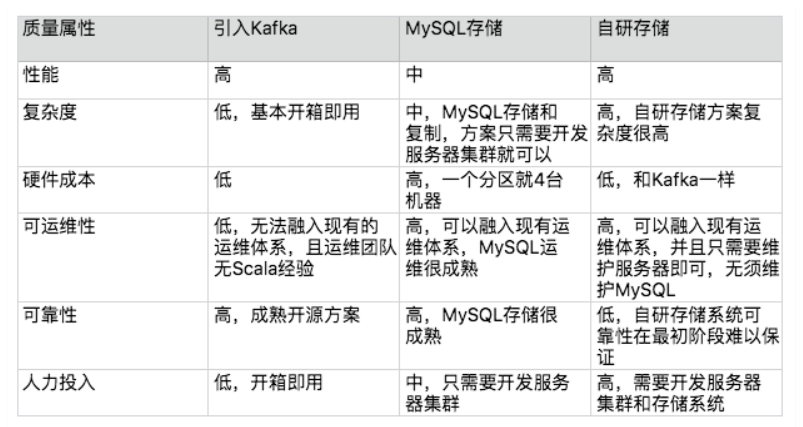

## 1. 开头  
&emsp;&emsp;前面我们介绍了架构设计的一些概念，以及分析了系统复杂度的来源，并知道了架构设计的宏观上的基本原则。那么当我们真要给某系统做架构设计时，有没有通用的设计思路呢？答案是有的。我们在对系统进行架构设计时，完全可以遵循该思路。主要的思路是：
* 识别系统复杂度
* 设计备选方案
* 评估和选择备选方案
* 详细方案设计  

&emsp;&emsp;主要是按照这几个大的步骤来思考即可。  

## 2. 识别复杂度  
### 2.1. 如何识别复杂度  
&emsp;&emsp;架构设计的本质目的是为了解决软件系统的复杂性，所以在我们设计架构时，首先就要分析系统的复杂性。只有正确分析出了系统的复杂性，后续的架构设计方案才不会偏离方向；否则，如果对系统的复杂性判断错误，即使后续的架构设计方案再完美再先进，都是南辕北辙，做的越好，错的越多、越离谱。  
&emsp;&emsp;例如，如果一个系统的复杂度本来是业务逻辑太复杂，功能耦合严重，架构师却设计了一个 TPS 达到 50000/ 秒的高性能架构，即使这个架构最终的性能再优秀也没有任何意义，因为架构没有解决正确的复杂性问题。  
&emsp;&emsp;架构的复杂度主要来源于“高性能”“高可用”“可扩展”等几个方面，但架构师在具体判断复杂性的时候，不能生搬硬套，认为任何时候架构都必须同时满足这三方面的要求。实际上大部分场景下，复杂度只是其中的某一个，少数情况下包含其中两个，如果真的出现同时需要解决三个或者三个以上的复杂度，要么说明这个系统之前设计的有问题，要么可能就是架构师的判断出现了失误，即使真的认为要同时满足这三方面的要求，也必须要进行优先级排序。   
&emsp;&emsp;例如，专栏前面提到过的“亿级用户平台”失败的案例，设计对标腾讯的 QQ，按照腾讯 QQ 的用户量级和功能复杂度进行设计，高性能、高可用、可扩展、安全等技术一应俱全，一开始就设计出了 40 多个子系统，然后投入大量人力开发了将近 1 年时间才跌跌撞撞地正式上线。上线后发现之前的过度设计完全是多此一举，而且带来很多问题：  
* 系统复杂无比，运维效率低下，每次业务版本升级都需要十几个子系统同步升级，操作步骤复杂，容易出错，出错后回滚还可能带来二次问题。

* 每次版本开发和升级都需要十几个子系统配合，开发效率低下。

* 子系统数量太多，关系复杂，小问题不断，而且出问题后定位困难。

* 开始设计的号称 TPS 50000/ 秒的系统，实际 TPS 连 500 都不到。
  
&emsp;&emsp;由于业务没有发展，最初的设计人员陆续离开，后来接手的团队，无奈又花了 2 年时间将系统重构，合并很多子系统，将原来 40 多个子系统合并成不到 20 个子系统，整个系统才逐步稳定下来。  
&emsp;&emsp;如果运气真的不好，接手了一个每个复杂度都存在问题的系统，那应该怎么办呢？答案是一个个来解决问题，不要幻想一次架构重构解决所有问题。例如这个“亿级用户平台”的案例，后来接手的团队其实面临几个主要的问题：系统稳定性不高，经常出各种莫名的小问题；系统子系统数量太多，系统关系复杂，开发效率低；不支持异地多活，机房级别的故障会导致业务整体不可用。如果同时要解决这些问题，就可能会面临这些困境：   
* 要做的事情太多，反而感觉无从下手。
* 设计方案本身太复杂，落地时间遥遥无期。
* 同一个方案要解决不同的复杂性，有的设计点是互相矛盾的。例如，要提升系统可用性，就需要将数据及时存储到硬盘上，而硬盘刷盘反过来又会影响系统性能  

&emsp;&emsp;因此，正确的做法是将主要的复杂度问题列出来，然后根据业务、技术、团队等综合情况进行排序，优先解决当前面临的最主要的复杂度问题。“亿级用户平台”这个案例，团队就优先选择将子系统的数量降下来，后来发现子系统数量降下来后，不但开发效率提升了，原来经常发生的小问题也基本消失了，于是团队再在这个基础上做了异地多活方案，也取得了非常好的效果。   
&emsp;&emsp;对于按照复杂度优先级解决的方式，存在一个普遍的担忧：如果按照优先级来解决复杂度，可能会出现解决了优先级排在前面的复杂度后，解决后续复杂度的方案需要将已经落地的方案推倒重来。这个担忧理论上是可能的，但现实中几乎是不可能出现的，原因在于软件系统的可塑性和易变性。对于同一个复杂度问题，软件系统的方案可以有多个，总是可以挑出综合来看性价比最高的方案。   
&emsp;&emsp;即使架构师决定要推倒重来，这个新的方案也必须能够同时解决已经被解决的复杂度问题，一般来说能够达到这种理想状态的方案基本都是依靠新技术的引入。例如，Hadoop 能够将高可用、高性能、大容量三个大数据处理的复杂度问题同时解决。   
&emsp;&emsp;识别复杂度对架构师来说是一项挑战，因为原始的需求中并没有哪个地方会明确地说明复杂度在哪里，需要架构师在理解需求的基础上进行分析。有经验的架构师可能一看需求就知道复杂度大概在哪里；如果经验不足，那只能采取“排查法”，从不同的角度逐一进行分析。  

### 2.2. 识别复杂度案例    

#### 2.2.1. 案例背景 
&emsp;&emsp;做一个微博系统，业务发展很快，系统也越来越多，系统间协作的效率很低：  
* 用户发一条微博后，微博子系统需要通知审核子系统进行审核，然后通知统计子系统进行统计，再通知广告子系统进行广告预测，接着通知消息子系统进行消息推送……
* 用户等级达到 VIP 后，等级子系统要通知福利子系统进行奖品发放     

&emsp;&emsp;这些问题背后的根源在于架构上各业务子系统强耦合，而消息队列系统正好可以完成子系统的解耦，于是提议要引入消息队列系统。经过一分析二讨论三开会四汇报五审批等一系列操作后，消息队列系统终于立项了。 其它背景信息：  
* 中间件团队规模不大，大约 6 人左右。
* 中间件团队熟悉 Java 语言，但有一个新同事 C/C++ 很牛。
* 开发平台是 Linux，数据库是 MySQL。
* 目前整个业务系统是单机房部署，没有双机房。   

#### 2.2.2. 分析过程
针对前浪微博的消息队列系统，采用“排查法”来分析复杂度，具体分析过程是：  
* 这个消息队列是否需要高性能  
  当前业务规模计算的性能要求并不高，但业务会增长，因此系统设计需要考虑一定的性能余量。由于现在的基数较低，为了预留一定的系统容量应对后续业务的发展，我们将设计目标设定为峰值的 4 倍，因此最终的性能要求是：TPS 为 1380，QPS 为 13800    
  
**PS：对于架构师来说，常见系统的性能量级需要烂熟于心，例如nginx负载均衡性能是3万左右，mc的读取性能5万左右，kafka号称百万级，zookeeper写入读取2万以上，http请求访问大概在2万左右，具体的数值和机器配置以及测试案例有关，但大概的量级不会变化很大。如果是业务系统，由于业务复杂度差异很大，有的每秒500请求可能就是高性能了，因此需要针对业务进行性能测试，确立性能基线，方便后续架构设计做比较。**

* 消息队列是否需要高可用性  
  微博子系统来说，如果消息丢了，导致没有审核，然后触犯了国家法律法规，则是非常严重的事情；对于等级子系统来说，如果用户达到相应等级后，系统没有给他奖品和专属服务，则 VIP 用户会很不满意，导致用户流失从而损失收入，虽然也比较关键，但没有审核子系统丢消息那么严重  
  综合来看，消息队列需要高可用性，包括消息写入、消息存储、消息读取都需要保证高可用性  

* 这个消息队列是否需要高可扩展性  
  基本无须扩展  

综合分析下来，消息队列的复杂性主要体现在这几个方面：高性能消息读取、高可用消息写入、高可用消息存储、高可用消息读取  

### 2.3. 小结   
架构设计由需求所驱动，本质目的是为了解决软件系统的复杂性；为此，我们在进行架构设计时，需要以理解需求为前提，首要进行系统复杂性的分析。具体做法是：
* 构建复杂度的来源清单——高性能、可用性、扩展性、安全、低成本、规模等。
* 结合需求、技术、团队、资源等对上述复杂度逐一分析是否需要？是否关键？
  * “高性能”主要从软件系统未来的TPS、响应时间、服务器资源利用率等客观指标，也可以从用户的主观感受方面去考虑。
  * “可用性”主要从服务不中断等质量属性，符合行业政策、国家法规等方面去考虑。
  * “扩展性”则主要从功能需求的未来变更幅度等方面去考虑。
* 按照上述的分析结论，得到复杂度按照优先级的排序清单，越是排在前面的复杂度，就越关键，就越优先解决
* 需要特别注意的是：随着所处的业务阶段不同、外部的技术条件和环境的不同，得到的复杂度问题的优先级排序就会有所不同。一切皆变化。  

## 3. 设计备选方案  
&emsp;&emsp;软件技术经过几十年的发展，新技术层出不穷，但是经过时间考验，已经被各种场景验证过的成熟技术其实更多，高可用的主备方案、集群方案，高性能的负载均衡、多路复用，可扩展的分层、插件化等技术  
&emsp;&emsp;只有当这种方式完全无法满足需求的时候，才会考虑进行方案的创新。而方案的创新绝大部分情况下也都是基于已有的成熟技术：  
* NoSQL，Key-Value 的存储和数据库的索引其实是很相似的。Memcache 只是把数据库的索引独立出来做成了一个缓存系统。
* Hadoop，大文件存储方案，基础其实是集群方案 + 数据复制方案  
### 3.1. 为什么设计备选方案  
&emsp;&emsp;虽说基于已有的技术或者架构模式进行组合，然后调整，大部分情况下就能够得到我们需要的方案，但并不意味着架构设计是一件很简单的事情。因为可选的模式有很多，组合的方案更多，往往一个问题的解决方案有很多个；如果再在组合的方案上进行一些创新，解决方案会更多。因此，如何设计最终的方案，并不是一件容易的事情，这个阶段也是很多架构师容易犯错的地方。  
  
&emsp;&emsp;架构设计的常见错误：  
* 设计最优秀的方案  
  我们的最终目的是，挑选合适自己业务、团队、技术能力的方案才是好方案；否则要么浪费大量资源开发了无用的系统，或者最终根本无法实现。这里需要遵循我们之前讲的“合适原则”和“简单原则“的要求。
* 只做一个方案  
  很多时候只做了一种方案，然后详细设计后就基于这个方案了，这样做会有很严重的问题：
  * 心里评估过于简单，可能没有想得全面，只是因为某一个缺点就把某个方案给否决了，而实际上没有哪个方案是完美的，某个地方有缺点的方案可能是综合来看最好的方案
  * 经验知识和技能也有局限，有可能某个评估的标准或者经验是不正确的
  * 单一方案设计会出现过度辩护的情况，即架构评审时，针对方案存在的问题和疑问  
* 方案过于详细     
  备选方案不等同于最终的方案，每个备选方案都写得很细会得不偿失 
  * 耗费了大量的时间和精力
  * 将注意力集中到细节中，忽略了整体的技术设计，导致备选方案数量不够或者差异不大
  * 评审的时候其他人会被很多细节给绕进去，评审效果很差  

### 3.2. 怎么设计备选方案  
方案的数量可以说是无穷无尽的，架构师也不可能穷举所有方案，那合理的做法应该是什么样的呢？  
* 备选方案的数量以 3 ~ 5 个为最佳
* 备选方案的差异要比较明显  
  需要有比较明显的差异，不能是一些细节的差异
* 备选方案的技术不要只局限于已经熟悉的技术
* 备选阶段关注的是技术选型，而不是技术细节  

### 3.3. 备选方案设计案例  
&emsp;&emsp;之前的微博案例，前面已经通过“排查法”识别了消息队列的复杂性主要体现在：高性能消息读取、高可用消息写入、高可用消息存储、高可用消息读取。我们对技术组合来设计备选方案。 
* 备选方案 1：采用开源的 Kafka  
  成熟的开源消息队列方案，功能强大，性能非常高，而且已经比较成熟，很多大公司都在使用
* 备选方案 2：集群 + MySQL 存储  
  分析思路：
  * 高性能消息读取属于“计算高可用”的范畴，java比c++受众更广，不必使用性能好的c++，优先java， 选择Netty框架作为网络通讯框架。
  * 由于性能要求还是很高，采用集群部署，直接采用简单的轮询即可
  * 高可用写入和高性能读取，可以采取集群的方式来满足。某台服务器异常的情况下，客户端直接将消息写入下一台正常的服务器即可
  * 高可用存储、高可用读取比较复杂：
    * 高可用存储”要求已经写入的消息在单台服务器宕机的情况下不丢失
    * “高可用读取”要求已经写入的消息在单台服务器宕机的情况下可以继续读取   
  
  
  &emsp;&emsp;对此我们可以利用 MySQL 的主备复制功能来达到“高可用存储“的目的，通过服务器的主备方案来达到“高可用读取”的目的  
      
  设计思路：  
  * 采用数据分散集群的架构，集群中的服务器进行分组，每个分组存储一部分消息数据
  * 每个分组包含一台主 MySQL 和一台备 MySQL，分组内主备数据复制，分组间数据不同步
  * 正常情况下，分组内的主服务器对外提供消息写入和消息读取服务，备服务器不对外提供服务；主服务器宕机的情况下，备服务器对外提供消息读取的服务
  * 客户端采取轮询的策略写入和读取消息
* 备选方案 3：集群 + 自研存储方案  
  &emsp;&emsp;在备选方案 2 的基础上，将 MySQL 存储替换为自研实现存储方案，因为 MySQL 的关系型数据库的特点并不是很契合消息队列的数据特点，参考 Kafka 的做法，可以自己实现一套文件存储和复制方案
  

**PS:其实备选方案还可以更多，例如，开源方案选择可能就包括 Kafka、ActiveMQ、RabbitMQ。集群方案的存储既可以考虑用 MySQL，也可以考虑用 HBase，还可以考虑用 Redis 与 MySQL 结合等。自研文件系统也可以有多个，可以参考 Kafka，也可以参考 LevelDB，还可以参考 HBase**  

### 3.4. 小结  
&emsp;&emsp;我们通过识别复杂度，确定了系统面临的主要复杂度问题，进而明确了设计方案的目标，就可以开展架构设计设计备选方案了。架构设计备选方案的工作更多的是从需求、团队、技术、资源等综合情况出发，对主流、成熟的架构模式进行选择、组合、调整、创新。    
几种常见的架构设计误区 ：  
* 只设计最优秀的方案。不要面向“简历”进行架构设计，而是要根据“合适”、“简单”、“演进”的架构设计原则，决策出与需求、团队、技术能力相匹配的合适方案
* 只做一个方案。一个方案容易陷入思考问题片面、自我坚持的认知陷阱  

如何做备选方案：  
* 备选方案不要过于详细。备选阶段解决的是技术选型问题，而不是技术细节
* 备选方案的数量以 3~5个为最佳
* 备选方案的技术差异要明显
* 备选方案不要只局限于已经熟悉的技术。  

**最后总结: 做事情永远都要有B方案**  

## 4. 评估备选方案  
在完成备选方案设计后，如何挑选出最终的方案也是一个很大的挑战  
### 4.1. 挑战  
* 每个方案都是可行的，如果方案不可行就根本不应该作为备选方案。
* 没有哪个方案是完美的。例如，A 方案有性能的缺点，B 方案有成本的缺点，C 方案有新技术不成熟的风险。
* 评价标准主观性比较强，比如设计师说 A 方案比 B 方案复杂，但另外一个设计师可能会认为差不多，因为比较难将“复杂”一词进行量化。  

### 4.2. 常见选型风格
### 4.2.1. 最简派  
设计师挑选一个看起来最简单的方案   
### 4.2.2. 最牛派  
最牛派的做法和最简派正好相反，设计师会倾向于挑选技术上看起来最牛的方案.  
比如性能最高的、可用性最好的、功能最强大的，或者淘宝用的、微信开源的、Google 出品   
### 4.2.3. 最熟派  
设计师基于自己的过往经验，挑选自己最熟悉的方案.熟悉什么使用什么    

### 4.2.4. 领导派
&emsp;&emsp;列出备选方案，设计师自己拿捏不定，然后就让领导来定夺，反正最后方案选的对那是领导厉害，方案选的不对怎么办？那也是领导“背锅”.  

  
&emsp;&emsp;并不存在绝对的正确或者绝对的错误，关键是不同的场景应该采取不同的方式.需要在合适的场景选择合适的方案，如何选择的呢？这又是一大问题。  

### 4.3. 评估和选择    
&emsp;&emsp;即核心在于：列出我们需要关注的**质量属性点**，然后分别从这些质量属性的维度去评估每个方案，再综合挑选适合当时情况的最优方案  

#### 4.3.1. 评估质量属性
常见的质量属性如下
* 性能
* 可用性
* 硬件成本
* 项目投入
* 复杂度
* 安全性
* 可扩展性等  

&emsp;&emsp;这里需要注意，评估这些质量属性时，需要遵循架构设计原则 1“合适原则”和原则 2“简单原则”，不可贪大求全。  
举个例子：  
&emsp;&emsp;例如购物网站，现在的 TPS 是 1000，而不是越高越好，只要能超过 2000 的都是合适的方案。不用担心业务翻倍增长，这种情况确实有可能存在，但概率很小。避免过度设计、一步到位的想法。  
&emsp;&emsp;即使真的出现这种情况，那就算是重新做方案，代价也是可以接受的，因为业务如此迅猛发展，钱和人都不是问题。  
&emsp;&emsp;通常情况下，如果性能、硬件成本属性评估和业务发展有关系。需要评估未来业务发展的规模时，一种简单的方式是将当前的业务规模乘以 2 ~4 即可。  
&emsp;&emsp;在一定范围内，一个方案，能够简单地扩容就能够跟上业务的发展，但是到达一定程度后，就不一样了，正如前面所说，量变引起质变，复杂度会飞跃提升：  
* 团队规模扩大，同一个系统上开发，开发效率变将很低
* 单机房的集群设计不满足业务需求了，需要升级为异地多活的架构  

&emsp;&emsp;如果团队一开始就预测到这两个问题，系统架构提前就拆分为多个子系统并且支持异地多活呢？这种“事后诸葛亮”也是不行的，因为最开始的时候团队只有 5 个人，5 个人在有限的时间内要完成后来 20 个人才能完成的高性能、异地多活、可扩展的架构，项目时间会遥遥无期，业务很难等待那么长的时间。  
&emsp;&emsp;所以讲了那么多，就是说评估属性的时候不要过度设计。遵循合适原则和简单原则。  

#### 4.3.2. 选择方案  
我们分析各个备选方案的各个质量属性，到底该选哪个方案呢，也是不确定的，因为极少出现某个方案在所有对比维度上都是最优的。通常情况，不同的类型的备选方案会有如下的缺陷：    
* 引入开源方案工作量小，但是可运维性和可扩展性差
* 自研工作量大，但是可运维和可维护性好
* 使用 C 语言开发性能高，但是目前团队 C 语言技术积累少
* 使用 Java 技术积累多，但是性能没有 C 语言开发高，成本会高一些   

##### 4.3.2.1. 常见错误  
* 数量对比法  
  总共 5 个质量属性的对比，其中 A 方案占优的有 3 个，B 方案占优的有 2 个，所以就挑选 A 方案。问题在于把所有质量属性的重要性等同，而没有考虑质量属性的优先级。不同的公司侧重点不一样，比如大公司成本考虑不多  

* 加权法  
  每个质量属性给一个权重。例如，性能的权重高中低分别得 10 分、5 分、3 分，成本权重高中低分别是 5 分、3 分、1 分，然后将每个方案的权重得分加起来，最后看哪个方案的权重得分最高就选哪个.  
  问题在于无法客观地给出每个质量属性的权重得分。性能权重得分为何是 10 分、5 分、3 分，而不是 5 分、3 分、1 分，或者是 100 分、80 分、60 分。分数是很难确定的，没有明确的标准。  

##### 4.3.2.2. 正确做法  
按优先级选择。即：
* 综合当前的业务发展情况、团队人员规模和技能、业务发展预测等因素，将质量属性按照优先级排序    
* 首先挑选满足第一优先级的，如果方案都满足，那就再看第二优先级
* 以此类推  
然后到最后，实际上是不可能的留下多个方案，因为备选方案需要有明显差异。  

这种方式核心思想就是先定一个目标的优先级，然后拿着方案一个一个的对。满足的留下，不满足的pass.  

### 4.4. 案例 
之前设计的微博的案例，一共设计出了这么几种备选方案。  
* 采用开源 Kafka 方案  
  * 业务主管倾向于采用 Kafka 方案，因为 Kafka 已经比较成熟，各个业务团队或多或少都了解过 Kafka。
  * 中间件团队部分研发人员也支持使用 Kafka，因为使用 Kafka 能节省大量的开发投入；但部分人员认为 Kafka 可能并不适合我们的业务场景，因为 Kafka 的设计目的是为了支撑大容量的日志消息传输，而我们的消息队列是为了业务数据的可靠传输。
  * 运维代表提出了强烈的反对意见：首先，Kafka 是 Scala 语言编写的，运维团队没 有维护 Scala 语言开发的系统的经验，出问题后很难快速处理；其次，目前运维团队已经有一套成熟的运维体系，包括部署、监控、应急等，使用 Kafka 无法融入这套体系，需要单独投入运维人力。
  * 测试代表也倾向于引入 Kafka，因为 Kafka 比较成熟，无须太多测试投入
* 集群 + MySQL 存储
  * 中间件团队的研发人员认为这个方案比较简单，但部分研发人员对于这个方案的性能持怀疑态度，毕竟使用 MySQL 来存储消息数据，性能肯定不如使用文件系统；并且有的研发人员担心做这样的方案是否会影响中间件团队的技术声誉，毕竟用 MySQL 来做消息队列，看起来比较“土”、比较另类。

  * 运维代表赞同这个方案，因为这个方案可以融入到现有的运维体系中，而且使用 MySQL 存储数据，可靠性有保证，运维团队也有丰富的 MySQL 运维经验；但运维团队认为这个方案的成本比较高，一个数据分组就需要 4 台机器（2 台服务器 + 2 台数据库）。

  * 测试代表认为这个方案测试人力投入较大，包括功能测试、性能测试、可靠性测试等都需要大量地投入人力。

  * 业务主管对这个方案既不肯定也不否定，因为反正都不是业务团队来投入人力来开发，系统维护也是中间件团队负责，对业务团队来说，只要保证消息队列系统稳定和可靠即可。
* 集群 + 自研存储系统  
  * 中间件团队部分研发人员认为这是一个很好的方案，既能够展现中间件团队的技术实力，性能上相比 MySQL 也要高；但另外的研发人员认为这个方案复杂度太高，按照目前的团队人力和技术实力，要做到稳定可靠的存储系统，需要耗时较长的迭代，这个过程中消息队列系统可能因为存储出现严重问题，例如文件损坏导致丢失大量数据。

  * 运维代表不太赞成这个方案，因为运维之前遇到过几次类似的存储系统故障导致数据丢失的问题，损失惨重。例如，MongoDB 丢数据、Tokyo Tyrant 丢数据无法恢复等。运维团队并不相信目前的中间件团队的技术实力足以支撑自己研发一个存储系统（这让中间件团队的人员感觉有点不爽）。

  * 测试代表赞同运维代表的意见，并且自研存储系统的测试难度也很高，投入也很大。

  * 业务主管对自研存储系统也持保留意见，因为从历史经验来看，新系统上线肯定有 bug，而存储系统出 bug 是最严重的，一旦出 bug 导致大量消息丢失，对系统的影响会严重  

综合下来：  
  

最终选择备选方案 2，原因有：  
* 排除备选方案 1 的主要原因是可运维性，因为再成熟的系统，上线后都可能出问题，如果出问题无法快速解决，则无法满足业务的需求；并且 Kafka 的主要设计目标是高性能日志传输，而我们的消息队列设计的主要目标是业务消息的可靠传输。

* 排除备选方案 3 的主要原因是复杂度，目前团队技术实力和人员规模（总共 6 人，还有其他中间件系统需要开发和维护）无法支撑自研存储系统（参考架构设计原则 2：简单原则）。

* 备选方案 2 的优点就是复杂度不高，也可以很好地融入现有运维体系，可靠性也有保障。  
* 备选方案 2 的第一个缺点是性能，业务目前需要的性能并不是非常高，方案 2 能够满足，即使后面性能需求增加，方案 2 的数据分组方案也能够平行扩展进行支撑（参考架构设计原则 3：演化原则）。

* 备选方案 2 的第二个缺点是成本，一个分组就需要 4 台机器，支撑目前的业务需求可能需要 12 台服务器，但实际上备机（包括服务器和数据库）主要用作备份，可以和其他系统并行部署在同一台机器上。

* 备选方案 2 的第三个缺点是技术上看起来并不很优越，但我们的设计目的不是为了证明自己（参考架构设计原则 1：合适原则），而是更快更好地满足业务需求。   

&emsp;&emsp;同样是上述 3 个备选方案，有的团队会选择引入 Kafka（例如，很多创业公司的初创团队，人手不够，需要快速上线支撑业务），有的会选择自研存储系统（例如，阿里开发了 RocketMQ，人多力量大，业务复杂是主要原因）。  

### 4.5. 小结  
* 评估和选择备选方案的方法  
  按优先级选择，即架构师综合当前的业务发展情况、团队人员规模和技能、业务发展预测等因素，将质量属性按照优先级排序，首先挑选满足第一优先级的，如果方案都满足，那就再看第二优先级……以此类推。
* RocketMQ 和 Kafka 有什么区别
  * 适用场景，Kafka适合日志处理；RocketMQ适合业务处理。
  * 性能，Kafka单机写入TPS号称在百万条/秒；RocketMQ大约在10万条/秒。Kafka单机性能更高。
  * 可靠性，RocketMQ支持异步/同步刷盘;异步/同步Replication；Kafka使用异步刷盘方式，异步Replication。RocketMQ所支持的同步方式提升了数据的可靠性。
  * 实时性，均支持pull长轮询，RocketMQ消息实时性更好
  * 支持的队列数，Kafka单机超过64个队列/分区，消息发送性能降低严重；RocketMQ单机支持最高5万个队列，性能稳定（这也是适合业务处理的原因之一）
* 为什么阿里会自研RocketMQ
  * Kafka的业务应用场景主要定位于日志传输；对于复杂业务支持不够
  * 阿里很多业务场景对数据可靠性、数据实时性、消息队列的个数等方面的要求很高
  * 当业务成长到一定规模，采用开源方案的技术成本会变高（开源方案无法满足业务的需要；旧版本、自开发代码与新版本的兼容等
  * 阿里在团队、成本、资源投入等方面约束性条件几乎没有
