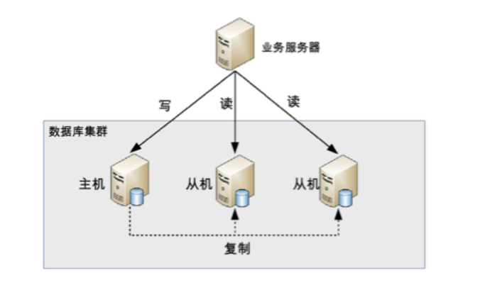
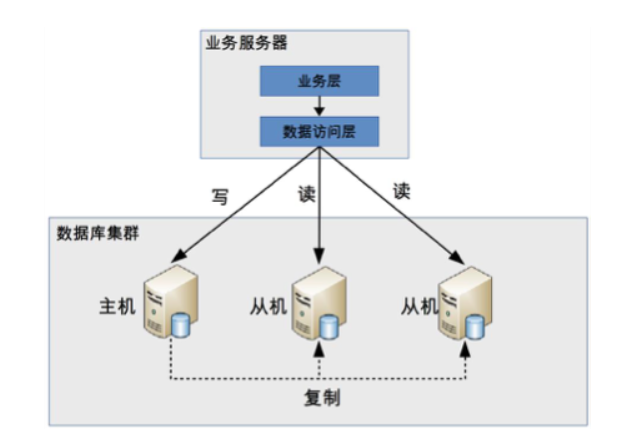
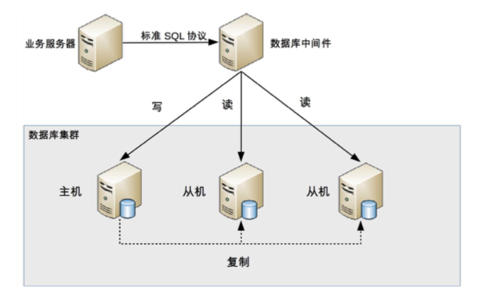
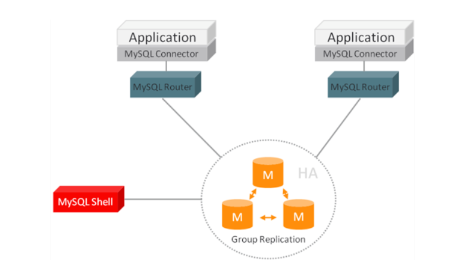
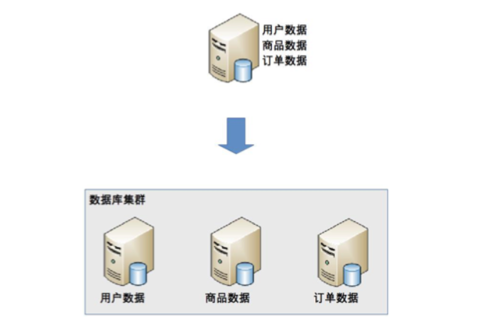
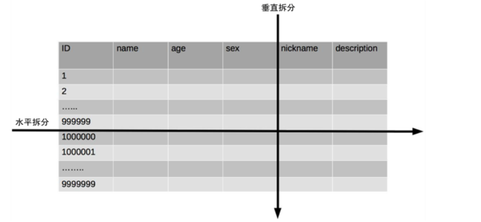

## 1. 开头  
&emsp;&emsp;为了更快、更好地设计出优秀的架构，除了需要有基础的架构设计理论外，还需要掌握业界已经成熟的各种架构模式。  
&emsp;&emsp;各种存储技术飞速发展，但关系数据库由于其 ACID 的特性和功能强大的 SQL 查询，目前还是各种业务系统中关键和核心的存储系统，很多场景下高性能的设计最核心的部分就是关系数据库的设计。  
&emsp;&emsp;单个数据库服务器已经难以满足业务需要，必须考虑数据库集群的方式来提升性能。高性能数据库集群一般有两种模式可以考虑：  
* 读写分离
* 分库分表
  

## 2. 读写分离 
### 2.1. 原理   
&emsp;&emsp;读写分离的基本原理是将数据库读写操作分散到不同的节点上。  
  
* 数据库服务器搭建主从集群，一主一从、一主多从都可以。
* 数据库主机负责读写操作，从机只负责读操作。
* 数据库主机通过复制将数据同步到从机，每台数据库服务器都存储了所有的业务数据。
* 业务服务器将写操作发给数据库主机，将读操作发给数据库从机   

**注意：主从和主备不一样，从是需要干活的，备一般被认为仅仅提供备份功能，不提供访问功能**    

### 2.2. 主从复制复杂度  
&emsp;&emsp;MySQL 为例，主从复制延迟可能达到 1 秒，大量数据同步，延迟 1 分钟也是有可能的，如果业务上有逻辑依赖读到的数据，那就会存在问题。    
解决方案：  
* 写操作后的读操作指定发给数据库主服务器  
  代码耦合度高，侵入严重。
* 读从机失败后再读一次主机  
  二次读取，如果有很多二次读取，将大大增加主机的读操作压力  
**PS：我们也可以先查redis，再查库表，如果redis中没有，说明就是过期的数据，这时候查从机就肯定存在了**
* 关键业务读写操作全部指向主机，非关键业务采用读写分离  
  关键业务走主库，不关键业务走从库，分离。

### 2.3. 分配机制复杂度    
即如何实现这个读写分离呢？  

#### 2.3.1. 程序代码封装  
在代码中抽象一个数据访问层（所以有的文章也称这种方式为“中间层封装”），实现读写操作分离和数据库服务器连接的管理  
常用的技术有，shardingjdbc、苞米豆  
  
* 实现简单，而且可以根据业务做较多定制化的功能。
* 每个编程语言都需要自己实现一次，无法通用，如果一个业务包含多个编程语言写的多个子系统，则重复开发的工作量比较大。
* 故障情况下，如果主从发生切换，则可能需要所有系统都修改配置并重启。  

#### 2.3.2. 中间件封装  
独立一套系统,实现读写操作分离和数据库服务器连接的管理,对业务服务器提供 SQL 兼容的协议，业务服务器无须自己进行读写分离.对于业务服务器来说，访问中间件和访问数据库没有区别，事实上在业务服务器看来，中间件就是一个数据库服务器  
  
* 支持多种编程语言  
  因为数据库中间件对业务服务器提供的是标准 SQL 接口。
* 数据库中间件要支持完整的 SQL 语法和数据库服务器的协议（例如，MySQL 客户端和服务器的连接协议）
  实现比较复杂，细节特别多，很容易出现 bug，需要较长的时间才能稳定。

* 数据库中间件自己不执行真正的读写操作，但所有的数据库操作请求都要经过中间件，中间件的性能要求也很高。

* 数据库主从切换对业务服务器无感知，数据库中间件可以探测数据库服务器的主从状态。
  例如，向某个测试表写入一条数据，成功的就是主机，失败的就是从机。     

* 系统一旦做好，接入的业务系统越多，节省的程序开发投入就越多，价值也越大
* 数据库中间件的复杂度要比程序代码封装高出一个数量级  
  
    

  ### 2.4. 小结  

## 3. 分库分表  
&emsp;&emsp;读写分离分散了数据库读写操作的压力，但没有分散存储压力。当数据量持续增大的时候，单台服务器将会成为存储的系统的瓶颈。  
### 3.1. 为什么要分库分表  
* 性能下降  
  数据量太大，读写的性能会下降，即使有索引，索引也会变得很大，性能同样会下降
* 维护困难  
  数据文件会变得很大，数据库备份和恢复需要耗费很长时间 
* 可靠性下降   
  极端情况下丢失数据的风险越高（例如，机房火灾导致数据库主备机都发生故障  

&emsp;基于上述的原因。单个数据库服务器存储的数据量不能太大，需要控制在一定的范围内。存储分散到多台数据库服务器。鸡蛋不要同时放在一个篮子里。  
数据库的拆分通常分为两个方面: 
* 业务分库
* 分表  
### 3.2. 业务分库  
什么是业务分库呢？  
业务分库指的是按照业务模块将数据分散到不同的数据库服务器。比如。我们可以将用户、商品、订单三个业务模块拆分至三个数据库中。这样就能能够分散存储和访问压力。如下图所示：  
    
虽然能够减轻数据库的压力，但是同时也引入了很多问题。 
#### 3.2.1. join 操作问题
&emsp;&emsp;显然在一个数据库中可以非常方便使用数据库自带的join操作，但是分库后很难进行join操作。需要多查一遍，比如订单信息的用户id。以前可以用join语句查询，现在需要先查出用户id，然后根据用户id然后再去用户表取把用户查询出来，增加了复杂度。
#### 3.2.2. 事务问题  
&emsp;&emsp;在同一个数据库中不同的表可以在同一个事务中修改。业务分库后，表分散到不同的数据库中，无法通过事务统一修改。虽然数据库厂商提供了一些分布式事务的解决方案（例如，MySQL 的 XA），但性能实在太低，与高性能存储的目标是相违背的。
&emsp;&emsp;为了解决事务问题，需要业务程序自己来模拟实现事务的功能。比如tcc、at、最终一致性事务、saga等方式来解决。比如tcc的解决。  
&emsp;&emsp;例如，先扣商品库存，扣成功后生成订单，如果因为订单数据库异常导致生成订单失败，业务程序又需要将商品库存加上；而如果因为业务程序自己异常导致生成订单失败，则商品库存就无法恢复了，需要人工通过日志等方式来手工修复库存异常。
#### 3.2.3. 成本问题  
之前在一个数据库就行了，现在需要三个数据库了，这就带来成本的提升。  
&emsp;&emsp;所以在业务的初期或者小型公司，可以除非必须，不必进行这么拆库。拆库带了如下的问题：   
* 初创业务存在很大的不确定性，并且数据量没那么大，拆库性价比不高
* 业务分库后，表之间的 join 查询、数据库事务无法简单实现了，需求工期变长了。
* 业务分库后，因为不同的数据要读写不同的数据库，代码中需要增加根据数据类型映射到不同数据库的逻辑，增加了工作量。  

#### 3.2.4. 小结
&emsp;&emsp;在做是否进行业务分库拆分的时候，我们要遵行架构设计三原则  
在业务的初期，业务量不大的时候可以不考虑业务拆分，因为反而带来了更大的复杂度，性价比不高。而大公司成熟的业务一开始就可能带来的大的数据量，即需要一开始就进行业务的拆分。  
&emsp;&emsp;

## 4. 分表  
&emsp;&emsp;将不同业务数据分散存储到不同的数据库服务器，能够支撑百万甚至千万用户规模的业务，但如果业务继续发展，同一业务的单表数据也会达到单台数据库服务器的处理瓶颈.  
&emsp;&emsp;单表的数据量是由极限的。数据量如果太大的话是无法满足性能要求的，此时就需要对单表数据进行拆分。  
&emsp;&emsp;一般有两种拆表的方法：  
* 水平拆分  
* 垂直拆分
 
  
  
如上所示，两种拆表的定义很容易理解。    

**注意：并不强制要求单表切分为多表后一定要分散到不同数据库中。因为一般情况下， 拆分后的表即使放在一个数据库中一般也能带来比较好的性能提升。如果放到其它的数据库，复杂度会进一步的提升。如果单表拆分为多表后，单台服务器依然无法满足性能要求，那就需要分散到多台服务器上了，需要考虑带来的更大的复杂度的问题了。**  
### 4.1. 水平拆分  
&emsp;&emsp;水平分表适合表行数特别大的表，有的公司要求单表行数超过 5000 万就必须进行分表。对于一些比较复杂的表，可能超过 1000 万就要分表了这个操作将会引入如下的复杂度问题。  
### 4.1.1. 路由  
&emsp;&emsp;某条数据具体属于哪个切分后的子表，需要增加路由算法进行计算，这个算法会引入一定的复杂性。常见的路由算法主要有：
* 范围路由  
  选取有序的数据列（例如，整形、时间戳等）作为路由的条件，不同分段分散到不同的数据库表中。如用户id，下单时间。可以随着数据的增加平滑地扩充新的表。原有的数据不需要动  
  范围路由设计的复杂点主要体现在分段大小的选取上。分段太小会导致切分后子表数量过多，增加维护复杂度；分段太大可能会导致单表依然存在性能问题，一般建议分段大小在 100 万至 2000 万之间，具体需要根据业务选取合适的分段大小。而且最早的情况会导致分布不均匀，假如按照 1000 万来进行分表，有可能某个分段实际存储的数据量只有 1000 条，而另外一个分段实际存储的数据量有 900 万条
* hash路由  
  选取某个列（或者某几个列组合也可以）的值进行 Hash 运算，然后根据 Hash 结果分散到不同的数据库表中，Hash 路由的优点是表分布比较均匀，缺点是扩充新的表很麻烦，所有数据都要重分布
  Hash 路由设计的复杂点主要体现在初始表数量的选取上，表数量太多维护比较麻烦，表数量太少又可能导致单表性能存在问题。而用了 Hash 路由后，增加字表数量是非常麻烦的，所有数据都要重分布
* 配置路由  
  配置路由就是路由表，用一张独立的表来记录路由信息。同样以用户 ID 为例，我们新增一张 user_router 表，这个表包含 user_id 和 table_id 两列，根据 user_id 就可以查询对应的 table_id.扩充表的时候，只需要迁移指定的数据，然后修改路由表就可以了  
  缺点就是必须多查询一次，会影响整体性能。而且路由表本身如果太大（例如，几亿条数据），性能同样可能成为瓶颈，如果我们再次将路由表分库分表
  
### 4.1.2. join 操作  
&emsp;&emsp;水平分表后，数据分散在多个表中，如果需要与其他表进行 join 查询，需要在业务代码或者数据库中间件中进行多次 join 查询，然后将结果合并
### 4.1.3. count() 操作    
原来的业务数据放在一张表中，计算这个业务的总量的时候，一个sql语句就可以搞定，但是现在不行了。解决方案有三种：
* count() 相加  
  即每个表都去操作一下，性能很低
* 记录数表  
  每次插入或者删除子表数据成功后，都更新“记录数表”，这种方式获取表记录数的性能要大大优于 count() 相加的方式。但是有数据不一致的风险。而且增加了写入数据的压力。所以对于一些不要求记录数实时保持精确的业务。可以通过后台定时更新记录数表。定时更新实际上就是“count() 相加”和“记录数表”的结合，即定时通过 count() 相加计算表的记录数，然后更新记录数表中的数据  
* 通过分布式缓存，如redis记录
### 4.1.4. orderby操作  
&emsp;&emsp;水平分表后，数据分散到多个子表中，排序操作无法在数据库中完成，只能由业务代码或者数据库中间件分别查询每个子表中的数据，然后汇总进行排序

### 4.2. 垂直拆分  
&emsp;&emsp;垂直分表适合将表中某些不常用且占了大量空间的列拆分出去。这个很好想。  
&emsp;&emsp;垂直分表引入的复杂性主要体现在表操作的数量要增加.原来只要一次查询就可以获取的字段，现在可能需要从多个字段的问题。不过这个复杂度比起水平分表复杂度是很低的。    

### 4.3. 实现方法  
和数据库读写分离类似，但是复杂度更高。分库分表具体的实现方式也是“程序代码封装”和“中间件封装”。
* 读写分离实现时只要识别 SQL 操作是读操作还是写操作。     
* 分库分表的实现除了要判断操作类型外，还要判断 SQL 中具体需要操作的表、操作函数（例如 count 函数)、order by、group by 操作等，然后再根据不同的操作进行不同的处理。例如 order by 操作，需要先从多个库查询到各个库的数据，然后再重新 order by 才能得到最终的结果。  

### 4.4. 小结  
&emsp;&emsp;分库分表，可以理解为是一种空间换时间的思路，同时分流了存储压力与读写压力  
&emsp;&emsp;数据库性能不够时，首先应该想到是否可以通过改善硬件条件等垂直扩容手段；其次可引入读写分离、缓存/NoSQL、全文检索等手段；然后，单库单表的访问仍然存在性能瓶颈，可考虑分库分表，并且分库分表可以按照业务进行垂直拆分，接着进行水平拆分。   
&emsp;&emsp;线上已经进行了分库分表的系统，需要进一步水平扩容时，一般没有太好的方案，要么一开始的分表方案就是按照id范围来设计的，要么就需要数据迁移。

