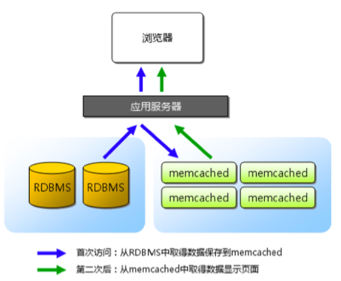

## 1. 开头  
某些复杂的业务场景下，单纯依靠存储系统的性能提升不够的.需要通过缓存来弥补存储系统的不足 

## 2. 适用场景  
* 需要经过复杂运算后得出的数据  
  比如需要统计在线人数，如果使用sql那是远远不够的。
* 读多写少的数据，存储系统有心无力  
  千万级数据的读取，而且读取频率大，比如微博等，这些数据如何展示呢，通过selelct查询数据库肯定是不行的。   

## 3.  Memcache的缓存架构  
 Memcache 就是一种缓存中间件，单台 Memcache 服务器简单的 key-value 查询能够达到 TPS 50000 以上  
 

## 4. 缓存的引入存在的问题  
 缓存虽然能够大大减轻存储系统的压力，但同时也给架构引入了更多复杂性。架构设计时如果没有针对缓存的复杂性进行处理，某些场景下甚至会导致整个系统崩溃 

### 4.1. 缓存穿透    
**缓存穿透**是指缓存没有发挥作用，业务系统虽然去缓存查询数据，但缓存中没有数据，业务系统需要再次去存储系统查询数据。主要有两种情况：  
* 存储数据不存在  
  一般情况大部分请求会命中缓存，少量的数据会从数据库中差，但是如果突然后大量的请求没有从缓存中查询，全部走向数据库。有可能会将存储系统拖垮  
  通常情况，我们可以直接设置一个默认值（可以是空值，也可以是具体的值）存到缓存中，这样第二次读取缓存时就会获取到默认值，而不会继续访问存储系统
* 缓存数据生成耗费大量时间或者资源  
  成缓存数据需要耗费较长时间或者耗费大量资源。如果刚好在业务访问的时候缓存失效了，那么也会出现缓存没有发挥作用，访问压力全部集中在存储系统上的情况。  
  比如电商平台的分页查询，前面用户经常点的一般会被自动缓存起来，不会有太大的问题，但是如果被别人爬虫抓取所有的页面，无法缓存，因此产生了问题。这种情况是没有办法避免的。

### 4.2. 缓存雪崩  
&emsp;&emsp;缓存雪崩是指当缓存失效（过期）后引起系统性能急剧下降的情况   
#### 4.2.1. 问题描述 
&emsp;&emsp;缓存过期被清除后，业务系统需要重新生成缓存，因此需要再次访问存储系统，再次进行运算，这个处理步骤耗时几十毫秒甚至上百毫秒.而对于一个高并发的业务系统来说，几百毫秒内可能会接到几百上千个请求.由于旧的缓存已经被清除，新的缓存还未生成，并且处理这些请求的线程都不知道另外有一个线程正在生成缓存，因此所有的请求都会去重新生成缓存，都会去访问存储系统，从而对存储系统造成巨大的性能压力。这些压力又会拖慢整个系统，严重的会造成数据库宕机，从而形成一系列连锁反应，造成整个系统崩溃  
#### 4.2.2. 解决方案  
* 更新锁  
  对缓存更新操作进行加锁保护，保证只有一个线程能够进行缓存更新，未能获取更新锁的线程要么等待锁释放后重新读取缓存，要么就返回空值或者默认值  
  但是对于一个大型分布式系统，如果有上百台服务同时更新缓存也会有雪崩的问题，可能需要分布式锁。防止并发取访问数据库。
* 后台更新    
  由后台线程来更新缓存，而不是由业务线程来更新缓存，缓存本身的有效期设置为永久，后台线程定时更新缓存      
  后台定时机制需要考虑一种特殊的场景，当缓存系统内存不够时，会“踢掉”一些缓存数据，从缓存被“踢掉”到下一次定时更新缓存的这段时间内，业务线程读取缓存返回空值，而业务线程本身又不会去更新缓存，因此业务上看到的现象就是数据丢了，解决方案有两种：  
  * 不仅仅定时更新，如果发现缓存被“踢了”就立刻更新缓存，这种方式实现简单，但读取时间间隔不能设置太长，因为如果缓存被踢了，缓存读取间隔时间又太长，这段时间内业务访问都拿不到真正的数据而是一个空的缓存值，用户体验一般
  * 业务线程发现缓存失效后，通过消息队列发送一条消息通知后台线程更新缓存。可能会出现多个业务线程都发送了缓存更新消息，但其实对后台线程没有影响，后台线程收到消息后更新缓存前可以判断缓存是否存在，存在就不执行更新操作。这种方式实现依赖消息队列，复杂度会高一些，但缓存更新更及时，用户体验更好   
**PS：后台更新机制还适合业务刚上线的时候进行缓存预热。缓存预热指系统上线后，将相关的缓存数据直接加载到缓存系统，而不是等待用户访问才来触发缓存加载**
### 4.3. 缓存热点  
虽然缓存系统本身的性能比较高，但对于一些特别热点的数据，如果大部分甚至所有的业务请求都命中同一份缓存数据，则这份数据所在的缓存服务器的压力也很大  
#### 4.3.1. 解决方案  
缓存热点的解决方案就是复制多份缓存副本，将请求分散到多个缓存服务器上，减轻缓存热点导致的单台缓存服务器压力。通过在缓存的 key 里面加上编号进行区分，每次读缓存时都随机读取其中某份缓存   
缓存副本设计有一个细节需要注意，就是不同的缓存副本不要设置统一的过期时间，否则就会出现所有缓存副本同时生成同时失效的情况，从而引发缓存雪崩效应。正确的做法是设定一个过期时间范围，不同的缓存副本的过期时间是指定范围内的随机值     

## 5. 如何实现缓存  
各种缓存设计方案通常情况下都是集成在存储访问方案中，可以采用“程序代码实现”的中间层方式，也可以采用独立的中间件来实现  

**小技巧：对于缓存雪崩问题，我们采取了双key策略：要缓存的key过期时间是t，key1没有过期时间。每次缓存读取不到key时就返回key1的内容，然后触发一个事件。这个事件会同时更新key和key1**
## 6. 小结      
好的缓存方案应该从这几个方面入手设计：
* 什么数据应该缓存
* 什么时机触发缓存和以及触发方式是什么
* 缓存的层次和粒度（ 网关缓存如 nginx，本地缓存如单机文件，分布式缓存如redis cluster，进程内缓存如全局变量）
* 缓存的命名规则和失效规则
* 缓存的监控指标和故障应对方案
* 可视化缓存数据如 redis 具体 key 内容和大小

