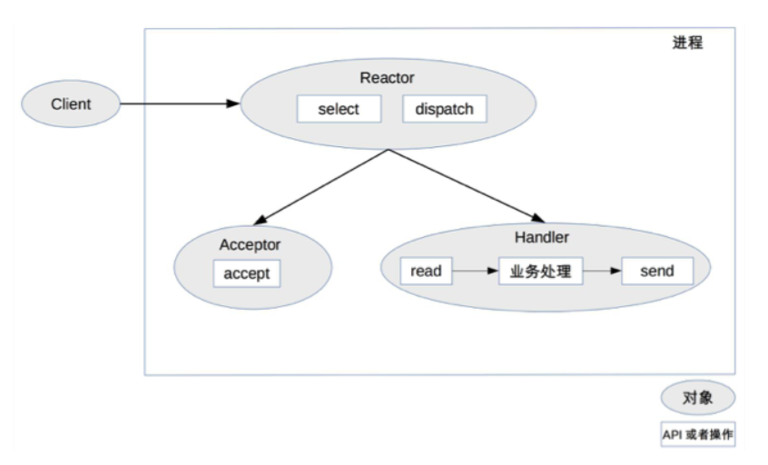
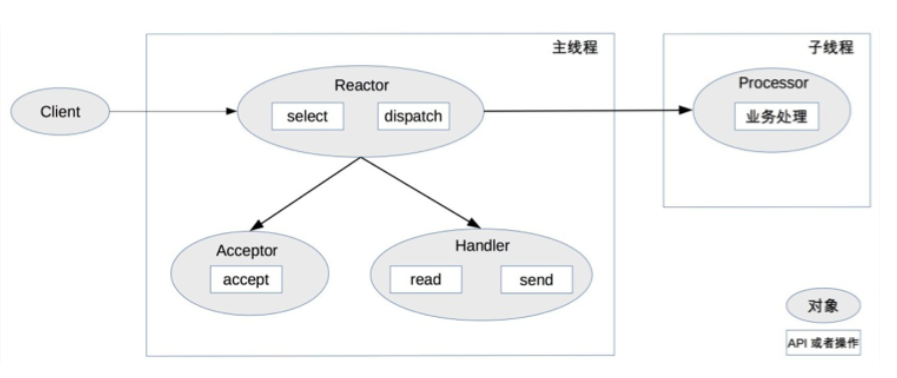

## 1. 开头    
&emsp;&emsp;**高性能架构的设计决定了系统性能的上限，实现细节决定了系统性能的下限**。高性能架构设计主要集中在两方面：
* 尽量提升单服务器的性能，将单服务器的性能发挥到极致。
* 如果单服务器无法支撑性能，设计服务器集群方案  

&emsp;&emsp;做一个系统还是写一行代码，都希望能够达到高性能的效果。而达到单机的高性能是非常复杂的，因为它涉及到了：磁盘、操作系统、CPU、内存、缓存、网络、编程语言、架构多个影响因子。随随便便的一个语句就可能导致性能变差，比如debug日志等等。但是我们这里只谈探讨单服务器高性能的关键之一就是服务器采取的并发模型，因为这个可操作空间更大些  

&emsp;&emsp;并发模型有如下两个关键设计点：
* 服务器如何管理连接
* 服务器如何处理请求  

&emsp;&emsp;这两个设计点和操作系统的 I/O 模型及进程模型非常相关：
* I/O 模型：阻塞、非阻塞、同步、异步。
* 进程模型：单进程、多进程、多线程。  

下面我们一步步阐述这几种设计模式  

## 2. PPC
&emsp;&emsp;PPC 是 Process Per Connection 的缩写，其含义是指每次有新的连接就新建一个进程去专门处理这个连接的请求。  
&emsp;&emsp;PPC 模式实现简单，比较适合服务器的连接数没那么多的情况。互联网兴起后，服务器的并发和访问量从几十剧增到成千上万。这种模式基本不可行，主要原因有：
* fork 代价高，需要分配很多内核资源，需要将内存映像从父进程复制到子进程。即使现在的操作系统在复制内存映像时用到了 Copy on Write（写时复制）技术，总体来说创建进程的代价还是很大的
* 父子进程通信复杂：父进程“fork”子进程时，文件描述符可以通过内存映像复制从父进程传到子进程，但“fork”完成后，父子进程通信就比较麻烦了，需要采用 IPC（Interprocess Communication）之类的进程通信方案。例如，子进程需要在 close 之前告诉父进程自己处理了多少个请求以支撑父进程进行全局的统计，那么子进程和父进程必须采用 IPC 方案来传递信息
* 支持的并发连接数量有限：如果每个连接存活时间比较长，而且新的连接又源源不断的进来，则进程数量会越来越多，操作系统进程调度和切换的频率也越来越高，系统的压力也会越来越大。因此，一般情况下，PPC 方案能处理的并发连接数量最大也就几百

## 3. prefork  
&emsp;&emsp;由于PPC模式 fork 进程代价高，用户访问时可能感觉比较慢。  
&emsp;&emsp;顾名思义，prefork 就是提前创建进程（pre-fork）。系统在启动的时候就预先创建好进程，然后才开始接受用户的请求，当有新的连接进来的时候，就可以省去 fork 进程的操作。其关键点为：  
* 多个子进程都 accept 同一个 socket
* 当有新的连接进入时，操作系统保证只有一个进程能最后 accept 成功  

该模式的缺点：
* 惊群效应，虽然只有一个子进程能 accept 成功，但所有阻塞在 accept 上的子进程都会被唤醒，这样就导致了不必要的进程调度和上下文切换了（和操作系统的版本有关系，Linux 2.6 版本后内核已经解决了 accept 惊群问题）
* 父子进程通信复杂、支持的并发连接数量有限目前实际应用也不多（Apache 服务器提供了 MPM prefork 模式，推荐在需要可靠性或者与旧软件兼容的站点时采用这种模式，默认情况下最大支持 256 个并发连接）

## 4. TPC  
&emsp;&emsp;TPC 是 Thread Per Connection 的缩写，其含义是指每次有新的连接就新建一个线程去专门处理这个连接的请求。   
&emsp;&emsp;与进程相比，线程更轻量级，创建线程的消耗比进程要少得多；同时多线程是共享进程内存空间的，线程通信相比进程通信更简单。  
&emsp;&emsp;因此，TPC 实际上是解决或者弱化了 PPC fork 代价高的问题和父子进程通信复杂的问题。  
&emsp;&emsp;和PPC相比，主进程不用“close”连接了。原因是在于子线程是共享主进程的进程空间的，连接的文件描述符并没有被复制，因此只需要一次 close 即可  

该模式的缺点：  
* 创建线程虽然比创建进程代价低，但并不是没有代价，高并发时（例如每秒上万连接）还是有性能问题。
* 无须进程间通信，但是线程间的互斥和共享又引入了复杂度，可能一不小心就导致了死锁问题。
* 多线程会出现互相影响的情况，某个线程出现异常时，可能导致整个进程退出（例如内存越界）。
* 同样存在 CPU 线程调度和切换代价的问题，TPC 方案本质上和 PPC 方案基本类似，在并发几百连接的场景下，反而更多地是采用 PPC 的方案，因为 PPC 方案不会有死锁的风险，也不会多进程互相影响，稳定性更高。

## 5. prethread
&emsp;&emsp;和 prefork 类似，prethread 模式会预先创建线程，然后才开始接受用户的请求，当有新的连接进来的时候，就可以省去创建线程的操作，让用户感觉更快、体验更好   
&emsp;&emsp;prethread 的实现方式相比 prefork的优势：  
* 主进程 accept，然后将连接交给某个线程处理。
* 子线程都尝试去 accept，最终只有一个线程 accept 成功   
* prethread 理论上可以比 prefork 支持更多的并发连接，Apache 服务器 MPM worker 模式默认支持 16 × 25 = 400 个并发处理线程

**PS：Apache 服务器的 MPM worker 模式本质上就是一种 prethread 方案，但稍微做了改进。Apache 服务器会首先创建多个进程，每个进程里面再创建多个线程，这样做主要是为了考虑稳定性，即：即使某个子进程里面的某个线程异常导致整个子进程退出，还会有其他子进程继续提供服务，不会导致整个服务器全部挂掉**  
## 6. 小结
&emsp;&emsp;不同并发模式的选择，还要考察三个指标，分别是响应时间（RT），并发数（Concurrency），吞吐量（TPS）。三者关系，吞吐量=并发数/平均响应时间。不同类型的系统，对这三个指标的要求不一样:  
* 三高系统，比如秒杀、即时通信，不能使用
* 三低系统，比如ToB系统，运营类、管理类系统，一般可以使用
* 高吞吐系统，如果是内存计算为主的，一般可以使用，如果是网络IO为主的，一般不能使用。

高并发需要根据两个条件划分：连接数量，请求数量。
* 海量连接（成千上万）海量请求：例如抢购，双十一等  
  面对海量的连接至少要使用IO复用模型或者异步IO模型，针对海量的请求，无论使用多进程处理还是多线程，单机都是无法支撑的，应该集群了,单机也要支持很多连接，不然集群成本太高
* 常量连接（几十上百）海量请求：例如中间件  
  常量连接，如使用TPC的preyhtead模型，启动几十上百的线程去处理连接，应该问题不大吧，但是老师举的列子是中间件是这类系统，我就有点疑问了，是不是中间件系统都可以是阻塞IO模型来实现，比如activemq既支持BIO也支持NIO，但是NIO只是解决了能处理更多的连接，而真正每个请求的处理快慢还得看后面的业务的处理；而阿里的rocketmq也是使用netty这样的NIO框架实现的。但在面对常量连接的场景下，NIO并没有优势啊。
* 海量连接常量请求：例如门户网站  
  这种系统我觉得非常适合使用netty这样的NIO框架来实现，IO复用模型可以处理海量的连接，而每个连接的请求数据量会很小，处理会很长快，如华仔说的门户网站，只要简单返回页面即可。
* 常量连接常量请求：例如内部运营系统，管理系统  
  这种系统，本讲的模式就很适合了。  

**注意：PPC和TPC对那些吞吐量比较大，长连接且连接数不多的系统应该比较适用。两种模式的特点都比较重，每个连接都能占有较多计算资源，一些内部系统，如日志系统用于实时监控的估计可以采用。这类型的系统一般连接数不多，吞吐量比较大，不求服务数量，求服务质量**   

&emsp;&emsp;单服务器高性能的 PPC 和 TPC 模式，它们的优点是实现简单，缺点是都无法支撑高并发的场景，尤其是互联网发展到现在，各种海量用户业务的出现，PPC 和 TPC 完全无能为力

## 7. Reactor
### 7.1. 背景
&emsp;&emsp;PPC 模式最主要的问题就是每个连接都要创建进程,连接结束后进程就销毁了,这样做其实是很大的浪费,线程也是一样的。为了解决这个问题，一个自然而然的想法就是资源复用，即不再单独为每个连接创建进程，而是创建一个进程池，将连接分配给进程，一个进程可以处理多个连接的业务。   
### 7.2. 问题
&emsp;&emsp;当一个连接一个进程时，进程可以采用“read -> 业务处理 -> write”的处理流程。如果当前连接没有数据可以读，则进程就阻塞在 read 操作上。如果一个进程处理多个连接，进程阻塞在某个连接的 read 操作上，此时即使其他连接有数据可读，进程也无法去处理，很显然这样是无法做到高性能的。  
&emsp;&emsp;最简单的方式是将 read 操作改为非阻塞，然后进程不断地轮询多个连接。这种方式也行，但是会耗费大量的cpu。  于是就有了多路复用技术
### 7.2. 多路复用  
* 当多条连接共用一个阻塞对象后，进程只需要在一个阻塞对象上等待，而无须再轮询所有连接，常见的实现方式有 select、epoll、kqueue 等。
* 当某条连接有新的数据可以处理时，操作系统会通知进程，进程从阻塞状态返回，开始进行业务处理。  

### 7.3. 反应器模式 
&emsp;&emsp;I/O 多路复用结合线程池，完美地解决了 PPC 和 TPC 的问题.并形成了一个解决高性能网络的通用模式，reactor模式。  
&emsp;&emsp;Reactor 会根据事件类型来调用相应的代码进行处理。Reactor 模式也叫 Dispatcher 模式（在很多开源的系统里面会看到这个名称的类，其实就是实现 Reactor 模式的），更加贴近模式本身的含义，即 I/O 多路复用统一监听事件，收到事件后分配（Dispatch）给某个进程。  
&emsp;&emsp;常用的Reactor模式一共有三种实现方案：  
* 单 Reactor 单进程 / 线程。
* 单 Reactor 多线程。
* 多 Reactor 多进程 / 线程。   

#### 7.3.1. 单 Reactor 单进程 / 线程  
    
&emsp;&emsp;select、accept、read、send 是标准的网络编程 API，dispatch 和“业务处理”是需要完成的操作  
* Reactor 对象通过 select 监控连接事件，收到事件后通过 dispatch 进行分发。
* 如果是连接建立的事件，则由 Acceptor 处理，Acceptor 通过 accept 接受连接，并创建一个 Handler 来处理连接后续的各种事件。
* 如果不是连接建立事件，则 Reactor 会调用连接对应的 Handler（第 2 步中创建的 Handler）来进行响应。
* Handler 会完成 read-> 业务处理 ->send 的完整业务流程。  

从上面可以看出：没有进程间通信，没有进程竞争，全部都在同一个进程内完成。  
缺点也比较明显：  
* 只有一个进程，无法发挥多核 CPU 的性能；
* 只能采取部署多个系统来利用多核 CPU，但这样会带来运维复杂度，本来只要维护一个系统，用这种方式需要在一台机器上维护多套系统。
* Handler 在处理某个连接上的业务时，整个进程无法处理其他连接的事件，很容易导致性能瓶颈。  

综合来看，该模式适用于业务处理非常快速的场景，如Redis
## 8. Proactor  
为了克服单 Reactor 单进程 / 线程方案的缺点，引入多进程 / 多线程是显而易见的，单 Reactor 多线程。  
  
* 主线程中，Reactor 对象通过 select 监控连接事件，收到事件后通过 dispatch 进行分发。
* 如果是连接建立的事件，则由 Acceptor 处理，Acceptor 通过 accept 接受连接，并创建一个 Handler 来处理连接后续的各种事件。
* 如果不是连接建立事件，则 Reactor 会调用连接对应的 Handler（第 2 步中创建的 Handler）来进行响应。
* Handler 只负责响应事件，不进行业务处理；Handler 通过 read 读取到数据后，会发给 Processor 进行业务处理。
* Processor 会在独立的子线程中完成真正的业务处理，然后将响应结果发给主进程的 Handler 处理；Handler 收到响应后通过 send 将响应结果返回给 client。   

如上所示，单 Reator 多线程方案能够充分利用多核多 CPU 的处理能力 。
缺点也比较明显：
* 多线程数据共享和访问比较复杂。例如，子线程完成业务处理后，要把结果传递给主线程的 Reactor 进行发送，这里涉及共享数据的互斥和保护机制。以 Java 的 NIO 为例，Selector 是线程安全的，但是通过 Selector.selectKeys() 返回的键的集合是非线程安全的，对 selected keys 的处理必须单线程处理或者采取同步措施进行保护。
* Reactor 承担所有事件的监听和响应，只在主线程中运行，瞬间高并发时会成为性能瓶颈。

## 9. 总结