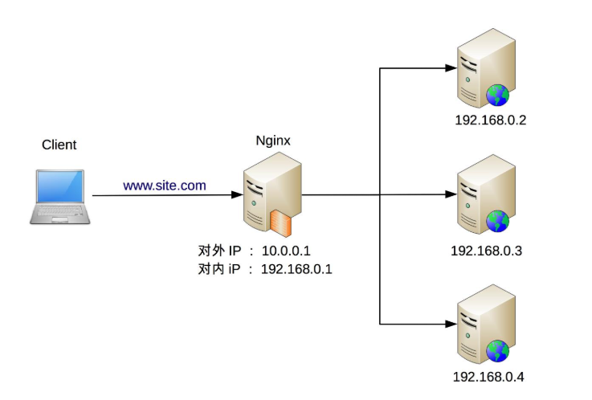

## 1. 开头  
&emsp;&emsp;单服务器无论如何优化，无论采用多好的硬件，总会有一个性能天花板.于是就有了增加更多的服务器来提升系统整体的计算能力。  
由于计算本身存在一个特点：同样的输入数据和逻辑，无论在哪台服务器上执行，都应该得到相同的输出。因此高性能集群设计的复杂度主要体现在任务分配这部分，需要设计合理的任务分配策略，将计算任务分配到多台服务器上执行  
&emsp;&emsp;如上面所说，高性能集群的复杂性主要体现在需要增加一个任务分配器，以及为任务选择一个合适的任务分配算法。负载均衡不只是为了计算单元的负载达到均衡状态，负载算法它的目的各不一样，有的基于吞吐量、响应时间、有的基于业务考虑。  

## 2. 负载均衡分类
### 2.1. DNS 负载均衡   
**DNS是最简单也是最常见的负载均衡方式，一般用来实现地理级别的均衡**   
&emsp;&emsp;北方的用户访问北京的机房，南方的用户访问深圳的机房。DNS 负载均衡的本质是 DNS 解析同一个域名可以返回不同的 IP 地址。例如，同样是 www.baidu.com，北方用户解析后获取的地址是 61.135.165.224（这是北京机房的 IP），南方用户解析后获取的地址是 14.215.177.38（这是深圳机房的 IP）。   
  
#### 2.1.1. 优点 
* 简单、成本低：负载均衡工作交给 DNS 服务器处理，无须自己开发或者维护负载均衡设备。
* 就近访问，提升访问速度：DNS 解析时可以根据请求来源 IP，解析成距离用户最近的服务器地址，可以加快访问速度，改善性能。   

#### 2.1.2. 缺点  
* 更新不及时：DNS 缓存的时间比较长，修改 DNS 配置后，由于缓存的原因，还是有很多用户会继续访问修改前的 IP，这样的访问会失败，达不到负载均衡的目的，并且也影响用户正常使用业务。
* 扩展性差：DNS 负载均衡的控制权在域名商那里，无法根据业务特点针对其做更多的定制化功能和扩展特性。
* 分配策略比较简单：DNS 负载均衡支持的算法少；不能区分服务器的差异（不能根据系统与服务的状态来判断负载）；也无法感知后端服务器的状态
&emsp;&emsp;DNS 负载均衡的一些缺点，对于时延和故障敏感的业务，有一些公司自己实现了 HTTP-DNS 的功能，即使用 HTTP 协议实现一个私有的 DNS 系统。这样的方案和通用的 DNS 优缺点正好相反
### 2.2. 硬件负载均衡
&emsp;&emsp;硬件负载均衡是通过单独的硬件设备来实现负载均衡功能，这类设备和路由器、交换机类似，可以理解为一个用于负载均衡的基础网络设备。目前业界典型的硬件负载均衡设备有两款：F5 和 A10。这类设备性能强劲、功能强大，但价格都不便宜，一般只有“土豪”公司才会考虑使用此类设备。普通业务量级的公司一是负担不起，二是业务量没那么大，用这些设备也是浪费。
#### 2.2.1. 优点
* 功能强大：全面支持各层级的负载均衡，支持全面的负载均衡算法，支持全局负载均衡。
* 性能强大：对比一下，软件负载均衡支持到 10 万级并发已经很厉害了，硬件负载均衡可以支持 100 万以上的并发。
* 稳定性高：商用硬件负载均衡，经过了良好的严格测试，经过大规模使用，稳定性高。
* 支持安全防护：硬件均衡设备除具备负载均衡功能外，还具备防火墙、防 DDoS 攻击等安全功能。
#### 2.2.2. 缺点
价格昂贵：最普通的一台 F5 就是一台“马 6”，好一点的就是“Q7”了。
扩展能力差：硬件设备，可以根据业务进行配置，但无法进行扩展和定制

### 2.3. 软件负载均衡   
&emsp;&emsp;软件负载均衡通过负载均衡软件来实现负载均衡功能，常见的有 Nginx 和 LVS，其中 Nginx 是软件的 7 层负载均衡，LVS 是 Linux 内核的 4 层负载均衡。4 层和 7 层的区别就在于协议和灵活性，Nginx 支持 HTTP、E-mail 协议；而 LVS 是 4 层负载均衡，和协议无关，几乎所有应用都可以做，例如，聊天、数据库等。  
&emsp;&emsp;软件和硬件的最主要区别就在于性能，硬件负载均衡性能远远高于软件负载均衡性能。Ngxin 的性能是万级，一般的 Linux 服务器上装一个 Nginx 大概能到 5 万 / 秒；LVS 的性能是十万级，据说可达到 80 万 / 秒；而 F5 性能是百万级，从 200 万 / 秒到 800 万 / 秒都有（数据来源网络，仅供参考，如需采用请根据实际业务场景进行性能测试）。当然，软件负载均衡的最大优势是便宜，一台普通的 Linux 服务器批发价大概就是 1 万元左右，相比 F5 的价格，那就是自行车和宝马的区别了。
&emsp;&emsp;除了使用开源的系统进行负载均衡，如果业务比较特殊，也可能基于开源系统进行定制（例如，Nginx 插件），甚至进行自研。    
  

#### 2.3.1. 优点     
* 简单：无论是部署还是维护都比较简单。
* 便宜：只要买个 Linux 服务器，装上软件即可。
* 灵活：4 层和 7 层负载均衡可以根据业务进行选择；也可以根据业务进行比较方便的扩展，例如，可以通过 Nginx 的插件来实现业务的定制化功能
#### 2.3.2. 缺点      
* 性能一般：一个 Nginx 大约能支撑 5 万并发。
* 功能没有硬件负载均衡那么强大。
* 一般不具备防火墙和防 DDoS 攻击等安全功能

## 3. 负载均衡的架构  
 3 种常见的负载均衡机制：
 * DNS 负载均衡
 * 硬件负载均衡
 * 软件负载均衡  
我们一般基于它们的优缺点进行组合使用，组合的基本原则为：DNS 负载均衡用于实现地理级别的负载均衡；硬件负载均衡用于实现集群级别的负载均衡；软件负载均衡用于实现机器级别的负载均衡  
  
* 地理级别负载均衡：www.xxx.com 部署在北京、广州、上海三个机房，当用户访问时，DNS 会根据用户的地理位置来决定返回哪个机房的 IP，图中返回了广州机房的 IP 地址，这样用户就访问到广州机房了。
* 集群级别负载均衡：广州机房的负载均衡用的是 F5 设备，F5 收到用户请求后，进行集群级别的负载均衡，将用户请求发给 3 个本地集群中的一个，我们假设 F5 将用户请求发给了“广州集群 2”。
* 机器级别的负载均衡：广州集群 2 的负载均衡用的是 Nginx，Nginx 收到用户请求后，将用户请求发送给集群里面的某台服务器，服务器处理用户的业务请求并返回业务响应   

如果业务量没这么大，则没有必要严格照搬这套架构，完全可以不需要 DNS 负载均衡，也不需要 F5 设备，只需要用 Nginx 作为一个简单的负载均衡  

## 4. 负载均衡算法  
负载均衡算法数量较多，大体上可以分为下面几类：  
* 任务平分类  
  负载均衡系统将收到的任务平均分配给服务器进行处理，这里的“平均”可以是绝对数量的平均，也可以是比例或者权重上的平均
* 负载均衡类  
  负载均衡系统根据服务器的负载来进行分配，主要的负载有：CPU 负载、连接数、I/O 使用率、网卡吞吐量。
* 性能最优类  
  负载均衡系统根据服务器的响应时间来进行任务分配，优先将新任务分配给响应最快的服务器
* Hash 类  
  根据任务中的某些关键信息进行 Hash 运算，相同Hash值的请求分配到同一台服务器上，常见的有源地址 Hash、目标地址 Hash、session id hash、用户 ID Hash。  

### 4.1. 轮询  
&emsp;&emsp;即无须关注服务器本身的状态，按照顺序轮流分配到服务器。缺点：
* 某个服务器当前因为触发了程序 bug 进入了死循环导致 CPU 负载很高，负载均衡系统是不感知的，还是会继续将请求源源不断地发送给它
* 集群中有新的机器是 32 核的，老的机器是 16 核的，负载均衡系统也是不关注的，新老机器分配的任务数是一样的   

**注意，运行状态是不关注的，如果服务器直接宕机了，或者断连了，任务分配器还是能够感知的，需要做出一定的响应的**  

### 4.2. 加权轮询  
&emsp;&emsp;根据服务器权重进行任务分配，一般是根据硬件配置进行静态配置的，采用动态的方式计算会更加契合业务，但复杂度也会更高。主要是解决不同服务器处理能力有差异的问题。但仍然无法根据服务器的状态差异进行任务分配的问题 
### 4.3. 负载最低优先
负载均衡系统将任务分配给当前负载最低的服务器  
负载的指标主要有：
* 连接数，LVS 这种 4 层网络负载均衡设备支持，服务器连接数越大，表明服务器压力越大
* HTTP 请求数，Nginx 这种 7 层网络负载系统 比较适合，但是需要自己去扩展。
* CPU、 I/O指标，只能自己开发这种分发系统  

该算法需要感知服务器当前的运行状态，完美地解决轮询算法的缺点。但是复杂度大幅上升：
  * 比如连接数，要求负载均衡系统统计每个服务器当前建立的连接，并且负载均衡系统和服务器之间是不是固定连接池做的，LVS 可以采取这种算法进行负载均衡，而一个通过连接池的方式连接 MySQL 集群的负载均衡系统就不适合采取这种算法进行负载均衡
  * CPU 负载最低优先，要求负载均衡系统以某种方式收集每个服务器的 CPU 负载，收集的间隔时间没有统一的标准。不同业务最优的时间间隔是不一样的，时间间隔太短容易造成频繁波动，时间间隔太长又可能造成峰值来临时响应缓慢  
  * 代码量上升，轮询可能是 5 行代码就能实现的算法，而负载最低优先算法可能要 1000 行才能实现，甚至需要负载均衡系统和服务器都要开发代码
  * 实现难度较高，经常可能有bug

负载最低优先算法虽然效果看起来很美好，但实际上真正应用的场景反而没有轮询（包括加权轮询）那么多  

### 4.4. 性能最优类    
&emsp;&emsp;优先将任务分配给处理速度最快的服务器，通过这种方式达到最快响应客户端的目的,本质上也是感知了服务器的状态，只是通过响应时间这个外部标准来衡量服务器状态  
性能最优优先类算法存在的问题和负载最低优先类算法类似:
* 收集和统计本身也会消耗较多的性能,因为需要收集和分析每个服务器每个任务的响应时间
* 通过采样率避免上面的问题，但是复杂度进一步上升，要确定合适的采样率，采样率太低会导致结果不准确，采样率太高会导致性能消耗较大，找到合适的采样率也是一件复杂的事情
* 采样周期的确定复杂，需要不断的去尝试，是 10 秒内性能最优，还是 1 分钟内性能最优，还是 5 分钟内性能最优，需要根据实际业务进行判断和选择

### 4.5. Hash 类
根据任务中的某些关键信息进行 Hash 运算，将相同 Hash 值的请求分配到同一台服务器上，这样做的目的主要是为了满足特定的业务需求   
主要的使用场景如下：
* 源地址 Hash  
  将来源于同一个源 IP 地址的任务分配给同一个服务器进行处理，适合于存在事务、会话的业务，会话信息  
* ID Hash  
  将某个 ID 标识的业务分配到同一个服务器中进行处理，这里的 ID 一般是临时性数据的 ID（如 session id）  

## 6. 总结  
负载均衡算法一共十来种之多，但经过抽取共性归纳之后就变成了4类，以后再新增加其他的算法，也不外乎是进行了丰富，种类并没有什么变化。  
我们这里可以来分析微信抢红包的多集群架构分析关键点：  
* 由于并发量特别高，需要有一个简单高效的算法，因而性能优先类算法可以不做考虑。
* 对于微信这种级别的机房，其容器化技术必然是炉火纯青，每一台vm的配置是可以完全相同的，因而也就无需采用负载均衡类算法和权重轮询算法
* 剩下来的就是hash类算法和简单轮询算法。
* 对于红包业务，最主要的操作是发红包和抢红包
* 不管是发个人红包还是发群红包整体业务相差不大，可以采用简单轮询算法，到任何一台服务器均可。
* 但抢个人红包和抢群红包是不同的，抢群红包是有先后顺序，当有多个人抢同一个群红包时最好是由同一个服务器进行处理，这台服务器在收到抢红包的请求后将请求放到一个队列中，而后按照先进先出的方式进行消费，可以保证先到的人能抢到红包，后到的人后抢到红包。
* 因而对于抢红包业务最好按照红包id进行hash负载。  

如果是只选择一个负载算法的话，就是hash负载，发红包按照userid进行hash负载，抢红包按照红包id进行hash负载