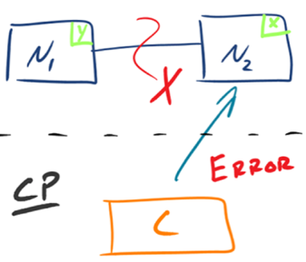

## 1. 背景  
&emsp;&emsp;设计高可用架构，首先我们需要知道什么时候高可用架构，能不能达到高可用，怎么达到高可用，这一系列的问题，有计算机大牛帮我们研究了。即cap理论是我们设计分布式系统必须掌握的。本篇文章主要介绍cap理论基础，作为我们思考高可用架构的思路，而又因为高可用架构设非常的复杂，异常的场景很多，只要有一个场景遗漏，架构设计就存在可用性隐患，而根据墨菲定律“可能出错的事情最终都会出错”，架构隐患总有一天会导致系统故障。因此，我们在进行架构设计的时候必须全面分析系统的可用性，前人正好总结了FMEA 方法，就是保证我们做到全面分析的一个非常简单但是非常有效的方法。
### 1.1. cap的起源  
&emsp;&emsp;计算机科学家埃里克·布鲁尔提出了cap猜想，2002 年，麻省理工学院的赛斯·吉尔伯特（Seth Gilbert）和南希·林奇（Nancy Lynch）发表了布鲁尔猜想的证明，使之成为分布式计算领域公认的一个定理。对于设计分布式系统的架构师来说，CAP 是必须掌握的理论  
## 2. cap理论 
### 2.1. cap的定义 
初版定义，并没有详细定义 Consistency、Availability、Partition Tolerance 三个单词的明确定义。不同的学者针对cap的理解各不一样，其中Robert Greiner的理解的出名，他写了两篇文章来阐述 CAP 理论，这里分析cap理论，主要是它的文章作为参考。
#### 2.1.1. 定义的区别
定义：
* 第一版：   
  对于一个分布式计算系统，不可能同时满足一致性（Consistence）、可用性（Availability）、分区容错性（Partition Tolerance）三个设计约束 
* 第二版：  
  在一个分布式系统（指互相连接并共享数据的节点的集合）中，当涉及读写操作时，只能保证一致性（Consistence）、可用性（Availability）、分区容错性（Partition Tolerance）三者中的两个，另外一个必须被牺牲    
分析：  
 * 第二版定义了什么才是 CAP 理论探讨的分布式系统，强调了两点：interconnected 和 share data，为何要强调这两点呢？ 因为分布式系统并不一定会互联和共享数据。最简单的例如 Memcache 的集群，相互之间就没有连接和共享数据，因此 Memcache 集群这类分布式系统就不符合 CAP 理论探讨的对象；而 MySQL 集群就是互联和进行数据复制的，因此是 CAP 理论探讨的对象
 * 第二版强调了 write/read pair，这点其实是和上一个差异点一脉相承的。也就是说，CAP 关注的是对数据的读写操作，而不是分布式系统的所有功能。例如，ZooKeeper 的选举机制就不是 CAP 探讨的对象
 * 由前两点分析，相比来说，第二版的定义更加精确

#### 2.1.2. 设计约束区别
* 一致性（Consistency）  
  第一版，所有节点在同一时刻都能看到相同的数据。   
  第二版，对某个指定的客户端来说，读操作保证能够返回最新的写操作结果。  
  其差异点主要有：
  * 第一版从节点 node 的角度描述，第二版从客户端 client 的角度描述。第二版更加符合我们观察和评估系统的方式，即站在客户端的角度来观察系统的行为和特征
  * 第一版的关键词是 see，第二版的关键词是 read。第一版解释中的 see，其实并不确切，因为节点 node 是拥有数据，而不是看到数据，即使要描述也是用 have；第二版从客户端 client 的读写角度来描述一致性，定义更加精确
  * 第一版强调同一时刻拥有相同数据（same time + same data），第二版并没有强调这点。意味着实际上对于节点来说，可能同一时刻拥有不同数据。  
**PS：在事务执行过程中，系统其实处于一个不一致的状态，不同的节点的数据并不完全一致，因此第一版的解释同一时刻拥有相同数据是不严谨的。而第二版强调 client 读操作能够获取最新的写结果就没有问题，因为事务在执行过程中，client 是无法读取到未提交的数据的，只有等到事务提交后，client 才能读取到事务写入的数据，而如果事务失败则会进行回滚，client 也不会读取到事务中间写入的数据**  

* 可用性（Availability）  
  第一版解释，每个请求都能得到成功或者失败的响应。第二版解释为，非故障的节点在合理的时间内返回合理的响应（不是错误和超时的响应）  
  其差异点主要有：  
  * 第一版是 every request，第二版强调了 A non-failing node。第一版的 every request 是不严谨的，因为只有非故障节点才能满足可用性要求，如果节点本身就故障了，发给节点的请求不一定能得到一个响应
  * 第一版的 response 分为 success 和 failure，第二版用了两个 reasonable：reasonable response 和 reasonable time，而且特别强调了 no error or timeout
  * 第一版的 success/failure 的定义太泛了，几乎任何情况，无论是否符合 CAP 理论，我们都可以说请求成功和失败，因为超时也算失败、错误也算失败、异常也算失败、结果不正确也算失败；即使是成功的响应，也不一定是正确的。例如，本来应该返回 100，但实际上返回了 90，这就是成功的响应，但并没有得到正确的结果。相比之下，第二版的解释明确了不能超时、不能出错，结果是合理的，注意没有说“正确”的结果。例如，应该返回 100 但实际上返回了 90，肯定是不正确的结果，但可以是一个合理的结果

* 分区容忍性（Partition Tolerance）  
   第一版解释，出现消息丢失或者分区错误时系统能够继续运行。第二版解释，当出现网络分区后，系统能够继续“履行职责”  
   其主要的差异点为：  
   * 第一版用的是 work，第二版用的是 function。  
    解释：work 强调“运行”，只要系统不宕机，我们都可以说系统在 work，返回错误也是 work，拒绝服务也是 work；而 function 强调“发挥作用”“履行职责”，这点和可用性是一脉相承的。也就是说，只有返回 reasonable response 才是 function。相比之下，第二版解释更加明确
   * 第一版描述分区用的是 message loss or partial failure，第二版直接用 network partitions  
    解释：第一版是直接说原因，即 message loss 造成了分区，但 message loss 的定义有点狭隘，因为通常我们说的 message loss（丢包），只是网络故障中的一种；第二版直接说现象，即发生了分区现象，不管是什么原因，可能是丢包，也可能是连接中断，还可能是拥塞，只要导致了网络分区，就通通算在里面

#### 2.1.3. 小结  
&emsp;&emsp;虽然 CAP 理论定义是三个要素中只能取两个，但放到分布式环境下来思考，我们会发现必须选择 P（分区容忍）要素，因为网络本身无法做到 100% 可靠，有可能出故障，所以分区是一个必然的现象。如果我们选择了 CA 而放弃了 P，那么当发生分区现象时，为了保证 C，系统需要禁止写入，当有写入请求时，系统返回 error（例如，当前系统不允许写入），这又和 A 冲突了，因为 A 要求返回 no error 和 no timeout。因此，分布式系统理论上不可能选择 CA 架构，只能选择 CP 或者 AP 架构   
注意：
**Paxos算法本身能提供的是，可靠的最终一致性保证。如有足够的隔离性措施，中间状态的无法被客户端读取，则可以达到强一致性，这种属于CP架构。其它情况，就是AP架构。**       
CAP定理存在不少坑点，理解起来很是令人费解：
* 适用场景。分布式系统有很多类型，有异构的，比如节点之间是上下游依赖的关系，有同构的，比如分区/分片型的、副本型的（主从、多主）。CAP定理的适用场景是副本型的这种
* 一致性的概念，从强到弱，线性一致性、顺序一致性、因果一致性、单调一致性、最终一致性，CAP中的一致性应该是指顺序一致性
* CAP中的一致性，与ACID中的一致性的区别。事务中的一致性，是指满足完整性约束条件，CAP中的一致性，是指读写一致性
* CAP中的可用性，与我们常说的高可用的区别。比如HBase、MongoDB属于CP架构，Cassandra、CounchDB属于AP系统，能说后者比前者更高可用么？应该不是。CAP中的可用性，是指在某一次读操作中，即便发现不一致，也要返回响应，即在合理时间内返回合理响应。我们常说的高可用，是指部分实例挂了，能自动摘除，并由其它实例继续提供服务，关键是冗余
* 哪些情况属于网络分区。网络故障造成的分区，属于。节点应用出现问题导致超时，属于。节点宕机或硬件故障，不属于    

paxos协议  
* Paxos算法本身是满足线性一致性的。线性一致性，也是实际系统能够达到的最强一致性。
* Paxos及其各种变体，在实际工程领域的实现，大多是做了一定程度的取舍，并不完全是线性一致性的。
* 比如，Zookeeper和Etcd，都是对于写操作（比如选举），满足线性一致性，对于读操作未必满足线性一致性。即可以选择线性一致性读取，也可以选择非线性一致性读取。这里的非线性一致性，就是顺序一致性。
* cap中的一致性，是指线性一致性，而不是顺序一致性。      
根据Raft的论文描述，工程上目前还没有完全实现paxos算法的系统
### 2.2. cap应用 
* CP架构  
  如下图所示，为了保证一致性，当发生分区现象后，N1 节点上的数据已经更新到 y，但由于 N1 和 N2 之间的复制通道中断，数据 y 无法同步到 N2，N2 节点上的数据还是 x。这时客户端 C 访问 N2 时，N2 需要返回 Error，提示客户端 C“系统现在发生了错误”，这种处理方式违背了可用性（Availability）的要求，因此 CAP 三者只能满足 CP  
    

* AP架构  
  如下图所示，为了保证可用性，当发生分区现象后，N1 节点上的数据已经更新到 y，但由于 N1 和 N2 之间的复制通道中断，数据 y 无法同步到 N2，N2 节点上的数据还是 x。这时客户端 C 访问 N2 时，N2 将当前自己拥有的数据 x 返回给客户端 C 了，而实际上当前最新的数据已经是 y 了，这就不满足一致性（Consistency）的要求了，因此 CAP 三者只能满足 AP。注意：这里 N2 节点返回 x，虽然不是一个“正确”的结果，但是一个“合理”的结果，因为 x 是旧的数据，并不是一个错乱的值，只是不是最新的数据而已  
    

### 2.2. cap的细节关键点
#### 2.2.1. cap运用的关键点
&emsp;&emsp;理论的优点在于清晰简洁、易于理解，但缺点就是高度抽象化，省略了很多细节，导致在将理论应用到实践时，由于各种复杂情况，可能出现误解和偏差，CAP 理论也不例外。如果我们没有意识到这些关键的细节点，那么在实践中应用 CAP 理论时，就可能发现方案很难落地  
##### 2.2.1.1. cap适用的粒度
&emsp;&emsp;CAP 关注的粒度是数据，而不是整个系统.    
这句话什么意思呢？就是cap的运用范围非常的窄。   
&emsp;&emsp;**C 与 A 之间的取舍可以在同一系统内以非常细小的粒度反复发生，而每一次的决策可能因为具体的操作，乃至因为牵涉到特定的数据或用户而有所不同**  
&emsp;&emsp;注意，认为我们在进行架构设计时，整个系统要么选择 CP，要么选择 AP这是非常不正确的，CAP 理论的定义和解释中，其实不是适用于system、node 这类系统级的概念。在实际设计过程中，每个系统不可能只处理一种数据，而是包含多种类型的数据，有的数据必须选择 CP，有的数据必须选择 AP。所以我们不能单纯的说一个系统是cp还是ap的。  
&emsp;&emsp;举个例子，一个最简单的用户管理系统为例，用户账号数据会选择 CP，而用户信息数据会选择 AP。所以我们不能笼统的说这个是ap还是cp的。   
推荐分析思路：CAP 理论落地实践时，我可以将需要将系统内的数据按照不同的应用场景和要求进行分类，每类数据选择不同的策略（CP 还是 AP），而不是直接限定整个系统所有数据都是同一策略

##### 2.2.1.2. CAP 是忽略网络延迟的  
&emsp;&emsp;在某一时刻，副本一定会有主从的不一致。我们在定义一致性时，并没有将延迟考虑进去。即CAP 理论中的 C 在实践中是不可能完美实现的，在数据复制的过程中，节点 A 和节点 B 的数据并不一致。  
&emsp;&emsp;因此，对于某些严苛的业务场景，例如和金钱相关的用户余额，或者和抢购相关的商品库存，技术上是无法做到分布式场景下完美的一致性的。而业务上必须要求一致性，因此单个用户的余额、单个商品的库存，理论上要求选择 CP 而实际上 CP 都做不到，只能选择 CA。也就是说，只能单点写入，其他节点做备份，无法做到分布式情况下多点写入.  
**注意：单个用户余额、单个商品库存”无法做分布式，但系统整体还是可以应用分布式架构的**    

用户账号信息系统案例：  
* 用户 id 为 0 ~ 100 的数据存储在 Node 1
* 将用户 id 为 101 ~ 200 的数据存储在 Node 2
* Client 根据用户 id 来决定访问哪个 Node
* 对于单个用户来说，读写操作都只能在某个节点上进行
* 对所有用户来说，有一部分用户的读写操作在 Node 1 上，有一部分用户的读写操作在 Node 2 上   
* 某个节点故障时，这个节点上的用户就无法进行读写操作了
* 在整体上来看，这种设计可以降低节点故障时受影响的用户的数量和范围，毕竟只影响 20% 的用户肯定要比影响所有用户要好

##### 2.2.1.3. 正常运行情况下，不存在 CP 和 AP 的选择，可以同时满足 CA
&emsp;&emsp;CAP 理论告诉我们分布式系统只能选择 CP 或者 AP，但其实这里的前提是系统发生了“分区”现象。如果系统没有发生分区现象，也就是说 P 不存在的时候（节点间的网络连接一切正常），我们没有必要放弃 C 或者 A，应该 C 和 A 都可以保证，这就要求架构设计的时候既要考虑分区发生时选择 CP 还是 AP，也要考虑分区没有发生时如何保证 CA。  
&emsp;&emsp;同样以用户管理系统为例，即使是实现 CA，不同的数据实现方式也可能不一样：用户账号数据可以采用“消息队列”的方式来实现 CA，因为消息队列可以比较好地控制实时性，但实现起来就复杂一些；而用户信息数据可以采用“数据库同步”的方式来实现 CA，因为数据库的方式虽然在某些场景下可能延迟较高，但使用起来简单

##### 2.2.1.4. 放弃并不等于什么都不做，需要为分区恢复后做准备  
&emsp;&emsp;CAP 理论告诉我们三者只能取两个，需要“牺牲”（sacrificed）另外一个，这里的“牺牲”是有一定误导作用的，因为“牺牲”让很多人理解成什么都不做。实际上，CAP 理论的“牺牲”只是说在分区过程中我们无法保证 C 或者 A，但并不意味着什么都不做。因为在系统整个运行周期中，大部分时间都是正常的，发生分区现象的时间并不长。例如，99.99% 可用性（俗称 4 个 9）的系统，一年运行下来，不可用的时间只有 50 分钟；99.999%（俗称 5 个 9）可用性的系统，一年运行下来，不可用的时间只有 5 分钟。分区期间放弃 C 或者 A，并不意味着永远放弃 C 和 A，我们可以在分区期间进行一些操作，从而让分区故障解决后，系统能够重新达到 CA 的状态  
&emsp;&emsp;最典型的就是在分区期间记录一些日志，当分区故障解决后，系统根据日志进行数据恢复，使得重新达到 CA 状态。同样以用户管理系统为例，对于用户账号数据，假设我们选择了 CP，则分区发生后，节点 1 可以继续注册新用户，节点 2 无法注册新用户（这里就是不符合 A 的原因，因为节点 2 收到注册请求后会返回 error），此时节点 1 可以将新注册但未同步到节点 2 的用户记录到日志中。当分区恢复后，节点 1 读取日志中的记录，同步给节点 2，当同步完成后，节点 1 和节点 2 就达到了同时满足 CA 的状态。  
&emsp;&emsp;而对于用户信息数据，假设我们选择了 AP，则分区发生后，节点 1 和节点 2 都可以修改用户信息，但两边可能修改不一样。例如，用户在节点 1 中将爱好改为“旅游、美食、跑步”，然后用户在节点 2 中将爱好改为“美食、游戏”，节点 1 和节点 2 都记录了未同步的爱好数据，当分区恢复后，系统按照某个规则来合并数据。例如，按照“最后修改优先规则”将用户爱好修改为“美食、游戏”，按照“字数最多优先规则”则将用户爱好修改为“旅游，美食、跑步”，也可以完全将数据冲突报告出来，由人工来选择具体应该采用哪一条

#### 2.2.2. acid  
ACID 是数据库管理系统为了保证事务的正确性而提出来的一个理论，ACID 包含四个约束：  
* Atomicity（原子性）  
  一个事务中的所有操作，要么全部完成，要么全部不完成，不会在中间某个环节结束。事务在执行过程中发生错误，会被回滚到事务开始前的状态，就像这个事务从来没有执行过一样
* Consistency（一致性）  
  在事务开始之前和事务结束以后，数据库的完整性没有被破坏
* Isolation（隔离性）  
  数据库允许多个并发事务同时对数据进行读写和修改的能力
* Durability（持久性）
  
**注意：ACID 中的 A（Atomicity）和 CAP 中的 A（Availability）意义完全不同，而 ACID 中的 C 和 CAP 中的 C 名称虽然都是一致性，但含义也完全不一样。ACID 中的 C 是指数据库的数据完整性，而 CAP 中的 C 是指分布式节点中的数据一致性。再结合 ACID 的应用场景是数据库事务**  

#### 2.2.3. base理论
&emsp;&emsp;BASE 是指基本可用（Basically Available）、软状态（ Soft State）、最终一致性（ Eventual Consistency），核心思想是即使无法做到强一致性（CAP 的一致性就是强一致性），但应用可以采用适合的方式达到最终一致性
* 基本可用（Basically Available）  
  分布式系统在出现故障时，允许损失部分可用性，即保证核心可用
* 软状态（Soft State）  
  允许系统存在中间状态，而该中间状态不会影响系统整体可用性。这里的中间状态就是 CAP 理论中的数据不一致
* 最终一致性（Eventual Consistency）
   系统中的所有数据副本经过一定时间后，最终能够达到一致的状态。  

&emsp;&emsp;BASE 理论本质上是对 CAP 的延伸和补充，更具体地说，是对 CAP 中 AP 方案的一个补充。前面在剖析 CAP 理论时，提到了其实和 BASE 相关的两点:  
* CAP 理论是忽略延时的，而实际应用中延时是无法避免的.   
  即：完美的 CP 场景是不存在的，即使是几毫秒的数据复制延迟，在这几毫秒时间间隔内，系统是不符合 CP 要求的。因此 CAP 中的 CP 方案，实际上也是实现了最终一致性，只是“一定时间”是指几毫秒而已
* AP 方案中牺牲一致性只是指分区期间，而不是永远放弃一致性   
  这一点其实就是 BASE 理论延伸的地方，分区期间牺牲一致性，但分区故障恢复后，系统应该达到最终一致性  

**PS：ACID 是数据库事务完整性的理论，CAP 是分布式系统设计理论，BASE 是 CAP 理论中 AP 方案的延伸**
## 2.3. 小结  
&emsp;&emsp;设计分布式系统的两大初衷：横向扩展（scalability）和高可用性（availability）。  
&emsp;&emsp;“横向扩展”是为了解决单点瓶颈问题，进而保证高并发量下的「可用性」；  
&emsp;&emsp;“高可用性”是为了解决单点故障（SPOF）问题，进而保证部分节点故障时的「可用性」。  
&emsp;&emsp;由此可以看出，分布式系统的核心诉求就是「可用性」。这个「可用性」正是 CAP 中的 A：用户访问系统时，可以在合理的时间内得到合理的响应。  
&emsp;&emsp;为了保证「可用性」，一个分布式系统通常由多个节点组成。这些节点各自维护一份数据，但是不管用户访问到哪个节点，原则上都应该读取到相同的数据。为了达到这个效果，一个节点收到写入请求更新自己的数据后，必须将数据同步到其他节点，以保证各个节点的数据「一致性」。这个「一致性」正是 CAP 中的 C：用户访问系统时，可以读取到最近写入的数据。   
&emsp;&emsp;需要注意的是：CAP 并没有考虑数据同步的耗时，所以现实中的分布式系统，理论上无法保证任何时刻的绝对「一致性」；不同业务系统对上述耗时的敏感度不同。   
&emsp;&emsp;分布式系统中，节点之间的数据同步是基于网络的。由于网络本身固有的不可靠属性，极端情况下会出现网络不可用的情况，进而将网络两端的节点孤立开来，这就是所谓的“网络分区”现象。“网络分区”理论上是无法避免的，虽然实际发生的概率较低、时长较短。没有发生“网络分区”时，系统可以做到同时保证「一致性」和「可用性」。   
&emsp;&emsp;发生“网络分区”时，系统中多个节点的数据一定是不一致的，但是可以选择对用户表现出「一致性」，代价是牺牲「可用性」：将未能同步得到新数据的部分节点置为“不可用状态”，访问到这些节点的用户显然感知到系统是不可用的。发生“网络分区”时，系统也可以选择「可用性」，此时系统中各个节点都是可用的，只是返回给用户的数据是不一致的。这里的选择，就是 CAP 中的 P。   
&emsp;&emsp;分布式系统理论上一定会存在 P，所以理论上只能做到 CP 或 AP。如果套用 CAP 中离散的 C/A/P 的概念，理论上没有 P 的只可能是单点（子）系统，所以理论上可以做到 CA。但是单点（子）系统并不是分布式系统，所以其实并不在 CAP 理论的描述范围内。   

这里举个例子，一个电商网站核心模块有会员，订单，商品，支付，促销管理等。  
&emsp;&emsp;对于会员模块，包括登录，个人设置，个人订单，购物车，收藏夹等，这些模块保证AP，数据短时间不一致不影响使用。  
&emsp;&emsp;订单模块的下单付款扣减库存操作是整个系统的核心，我觉得CA都需要保证，在极端情况下牺牲P是可以的。  
&emsp;&emsp;商品模块的商品上下架和库存管理保证CP,搜索功能因为本身就不是实时性非常高的模块，所以保证AP就可以了。  
&emsp;&emsp;促销是短时间的数据不一致，结果就是优惠信息看不到，但是已有的优惠要保证可用，而且优惠可以提前预计算，所以可以保证AP  
&emsp;&emsp;现在大部分的电商网站对于支付这一块是独立的系统，或者使用第三方的支付宝，微信。其实CAP是由第三方来保证的，支付系统是一个对CAP要求极高的系统，C是必须要保证的，AP中A相对更重要，不能因为分区，导致所有人都不能支付  

## 3. FMEA方法论  
&emsp;&emsp;因为高可用架构本身就非常复杂，异常的场景很多，只要有一个场景遗漏，架构设计就存在可用性隐患。因此，我们在进行架构设计的时候必须全面分析系统的可用性。那么如何才能做到“全面”呢？这里我们可以使用FMEA方法。   
&emsp;&emsp;FMEA（Failure mode and effects analysis，故障模式与影响分析）又称为失效模式与后果分析、失效模式与效应分析、故障模式与后果分析等，专栏采用“故障模式与影响分析”，因为这个中文翻译更加符合可用性的语境。FMEA 是一种在各行各业都有广泛应用的可用性分析方法，通过对系统范围内潜在的故障模式加以分析，并按照严重程度进行分类，以确定失效对于系统的最终影响。  
&emsp;&emsp;FMEA 最早是在美国军方开始应用的，20 世纪 40 年代后期，美国空军正式采用了 FMEA。尽管最初是在军事领域建立的方法，但 FMEA 方法现在已广泛应用于各种各样的行业，包括半导体加工、餐饮服务、塑料制造、软件及医疗保健行业。FMEA 之所以能够在这些差异很大的领域都得到应用，根本原因在于 FMEA 是一套分析和思考的方法，而不是某个领域的技能或者工具。   
&emsp;&emsp;回到软件架构设计领域，FMEA 并不能指导我们如何做架构设计，而是当我们设计出一个架构后，再使用 FMEA 对这个架构进行分析，看看架构是否还存在某些可用性的隐患    

**注意：FMEA只能分析高可用，高性能等其它架构不适合**
### 3.1. 如何进行FMEA分析  
其核心思路为：
* 给出初始的架构设计图。
* 假设架构中某个部件发生故障。
* 分析此故障对系统功能造成的影响。
* 根据分析结果，判断架构是否需要进行优化。  

具体的步骤为：  
* 罗列功能点  
  当前的 FMEA 分析涉及的功能点，注意这里的“功能点”指的是从用户角度来看的，而不是从系统各个模块功能点划分来看的。例如，对于一个用户管理系统，使用 FMEA 分析时 “登录”“注册”才是功能点，而用户管理系统中的数据库存储功能、Redis 缓存功能不能作为 FMEA 分析的功能点  
* 故障模式，可能发生的故障  
  故障模式指的是系统会出现什么样的故障，包括故障点和故障形式。需要特别注意的是，这里的故障模式并不需要给出真正的故障原因，我们只需要假设出现某种故障现象即可，例如 MySQL 响应时间达到 3 秒。造成 MySQL 响应时间达到 3 秒可能的原因很多：磁盘坏道、慢查询、服务器到 MySQL 的连接网络故障、MySQL bug 等，我们并不需要在故障模式中一一列出来，而是在后面的“故障原因”一节中列出来。因为在实际应用过程中，不管哪种原因，只要现象是一样的，对业务的影响就是一样的。  
  此外，故障模式的描述要尽量精确，多使用量化描述，避免使用泛化的描述。例如，推荐使用“MySQL 响应时间达到 3 秒”，而不是“MySQL 响应慢  

* 故障影响   
  当发生故障模式中描述的故障时，功能点具体会受到什么影响。常见的影响有：功能点偶尔不可用、功能点完全不可用、部分用户功能点不可用、功能点响应缓慢、功能点出错等。  
  故障影响也需要尽量准确描述。例如，推荐使用“20% 的用户无法登录”，而不是“大部分用户无法登录”。要注意这里的数字不需要完全精确，比如 21.25% 这样的数据其实是没有必要的，我们只需要预估影响是 20% 还是 40%    

* 严重程度  
  严重程度指站在业务的角度故障的影响程度，一般分为“致命 / 高 / 中 / 低 / 无”五个档次。严重程度按照这个公式进行评估：严重程度 = 功能点重要程度 × 故障影响范围 × 功能点受损程度。同样以用户管理系统为例：登录功能比修改用户资料要重要得多，80% 的用户比 20% 的用户范围更大，完全无法登录比登录缓慢要更严重。因此我们可以得出如下故障模式的严重程度  
  致命：超过 70% 用户无法登录。
  * 高：超过 30% 的用户无法登录。

  * 中：所有用户登录时间超过 5 秒。

  * 低：10% 的用户登录时间超过 5 秒。

  * 中：所有用户都无法修改资料。

  * 低：20% 的用户无法修改头像   
  
  对于某个故障的影响到底属于哪个档次，有时会出现一些争议。例如，“所有用户都无法修改资料”，有的人认为是高，有的人可能认为是中，这个没有绝对标准，一般建议相关人员讨论确定即可。也不建议花费太多时间争论，争执不下时架构师裁定即可  

* 故障原因  
  故障模式”中只描述了故障的现象，并没有单独列出故障原因。主要原因在于不管什么故障原因，故障现象相同，对功能点的影响就相同。那为何这里还要单独将故障原因列出来呢？主要原因有这几个：  
  * 不同的故障原因发生概率不相同  
    例如，导致 MySQL 查询响应慢的原因可能是 MySQL bug，也可能是没有索引。很明显“MySQL bug”的概率要远远低于“没有索引”；而不同的概率又会影响我们具体如何应对这个故障
  * 不同的故障原因检测手段不一样   
    例如，磁盘坏道导致 MySQL 响应慢，那我们需要增加机器的磁盘坏道检查，这个检查很可能不是当前系统本身去做，而是另外运维专门的系统；如果是慢查询导致 MySQL 慢，那我们只需要配置 MySQL 的慢查询日志即可
  * 不同的故障原因的处理措施不一样  
    例如，如果是 MySQL bug，我们的应对措施只能是升级 MySQL 版本；如果是没有索引，我们的应对措施就是增加索引。  

* 故障概率      
这里的概率就是指某个具体故障原因发生的概率。例如，磁盘坏道的概率、MySQL bug 的概率、没有索引的概率。一般分为“高 / 中 / 低”三档即可，具体评估的时候需要有以下几点需要重点关注  
  * 硬件  
    硬件随着使用时间推移，故障概率会越来越高。例如，新的硬盘坏道几率很低，但使用了 3 年的硬盘，坏道几率就会高很多
  * 开源系统  
    成熟的开源系统 bug 率低，刚发布的开源系统 bug 率相比会高一些；自己已经有使用经验的开源系统 bug 率会低，刚开始尝试使用的开源系统 bug 率会高
  * 自研系统  
    和开源系统类似，成熟的自研系统故障概率会低，而新开发的系统故障概率会高  

  高中低是相对的，只是为了确定优先级以决定后续的资源投入，没有必要绝对量化，因为绝对量化是需要成本的，而且很多时候都没法量化。例如，XX 开源系统是 3 个月故障一次，还是 6 个月才故障一次，是无法评估的

* 风险程度  
  风险程度就是综合严重程度和故障概率来一起判断某个故障的最终等级，风险程度 = 严重程度 × 故障概率。因此可能出现某个故障影响非常严重，但其概率很低，最终来看风险程度就低。“某个机房业务瘫痪”对业务影响是致命的，但如果故障原因是“地震”，那概率就很低。例如，广州的地震概率就很低，5 级以上地震的 20 世纪才 1 次（1940 年）；如果故障的原因是“机房空调烧坏”，则概率就比地震高很多了，可能是 2 年 1 次；如果故障的原因是“系统所在机架掉电”，这个概率比机房空调又要高了，可能是 1 年 1 次。同样的故障影响，不同的故障原因有不同的概率，最终得到的风险级别就是不同的   

* 已有措施    
  针对具体的故障原因，系统现在是否提供了某些措施来应对，包括：检测告警、容错、自恢复等  
针对具体的故障原因，系统现在是否提供了某些措施来应对，包括：检测告警、容错、自恢复等
  * 检测告警  
  最简单的措施就是检测故障，然后告警，系统自己不针对故障进行处理，需要人工干预
  * 容错  
  检测到故障后，系统能够通过备份手段应对。例如，MySQL 主备机，当业务服务器检测到主机无法连接后，自动连接备机读取数据。
  * 自恢复  
  检测到故障后，系统能够自己恢复。例如，Hadoop 检测到某台机器故障后，能够将存储在这台机器的副本重新分配到其他机器。当然，这里的恢复主要还是指“业务”上的恢复，一般不太可能将真正的故障恢复。例如，Hadoop 不可能将产生了磁盘坏道的磁盘修复成没有坏道的磁盘。  

* 规避措施  
  规避措施指为了降低故障发生概率而做的一些事情，可以是技术手段，也可以是管理手段。例如：
  * 技术手段：为了避免新引入的 MongoDB 丢失数据，在 MySQL 中冗余一份。
  * 管理手段：为了降低磁盘坏道的概率，强制统一更换服务时间超过 2 年的磁盘。  

* 解决措施  
解决措施指为了能够解决问题而做的一些事情，一般都是技术手段。例如：  
  * 为了解决密码暴力破解，增加密码重试次数限制。

  * 为了解决拖库导致数据泄露，将数据库中的敏感数据加密保存。

  * 为了解决非法访问，增加白名单控制。    

  一般来说，如果某个故障既可以采取规避措施，又可以采取解决措施，那么我们会优先选择解决措施，毕竟能解决问题当然是最好的。但很多时候有些问题是系统自己无法解决的，例如磁盘坏道、开源系统 bug，这类故障只能采取规避措施；系统能够自己解决的故障，大部分是和系统本身功能相关的

 * 后续规划  
  综合前面的分析，就可以看出哪些故障我们目前还缺乏对应的措施，哪些已有措施还不够，针对这些不足的地方，再结合风险程度进行排序，给出后续的改进规划。这些规划既可以是技术手段，也可以是管理手段；可以是规避措施，也可以是解决措施。同时需要考虑资源的投入情况，优先将风险程度高的系统隐患解决  
  * 地震导致机房业务中断：这个故障模式就无法解决，只能通过备份中心规避，尽量减少影响；
  * 而机柜断电导致机房业务中断：可以通过将业务机器分散在不同机柜来规避。
  * 敏感数据泄露：这个故障模式可以通过数据库加密的技术手段来解决。
  * MongoDB 断电丢数据：这个故障模式可以通过将数据冗余一份在 MySQL 中，在故障情况下重建数据来规避影响  

### 3.2. FMEA案例  
设计一个用户管理系统，包含登录和注册两个功能，模拟一次 FMEA 分析  
    
以上是一个初始架构，初始架构很简单：  
MySQL 负责存储，Memcache（以下简称 MC）负责缓存，Server 负责业务处理。我们来看看这个架构通过 FMEA 分析后，能够有什么样的发现，下表是分析的样例  
  
经过上表的 FMEA 分析，将“后续规划”列的内容汇总一下，我们最终得到了下面几条需要改进的措施：  
* MySQL 增加备机。
* MC 从单机扩展为集群。
* MySQL 双网卡连接。   

  

### 3.3. 小结  
hdfs就可以进行故障转移，这里可以分析一下