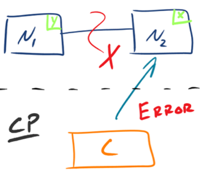
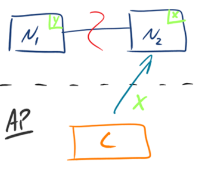
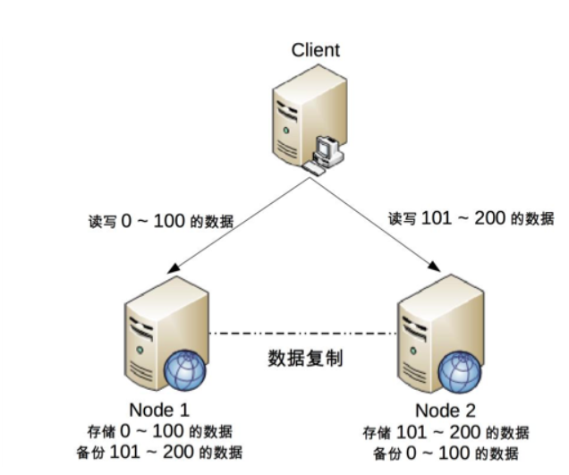

## 1. 背景  
&emsp;&emsp;设计高可用架构，首先我们需要知道什么时候高可用架构，能不能达到高可用，怎么达到高可用，这一系列的问题，有计算机大牛帮我们研究了。即cap理论是我们设计分布式系统必须掌握的。本篇文章主要介绍cap理论基础，作为我们思考高可用架构的思路，而又因为高可用架构设非常的复杂，异常的场景很多，只要有一个场景遗漏，架构设计就存在可用性隐患，而根据墨菲定律“可能出错的事情最终都会出错”，架构隐患总有一天会导致系统故障。因此，我们在进行架构设计的时候必须全面分析系统的可用性，前人正好总结了FMEA 方法，就是保证我们做到全面分析的一个非常简单但是非常有效的方法。
### 1.1. cap的起源  
&emsp;&emsp;计算机科学家埃里克·布鲁尔提出了cap猜想，2002 年，麻省理工学院的赛斯·吉尔伯特（Seth Gilbert）和南希·林奇（Nancy Lynch）发表了布鲁尔猜想的证明，使之成为分布式计算领域公认的一个定理。对于设计分布式系统的架构师来说，CAP 是必须掌握的理论  
## 2. cap理论 
### 2.1. cap的定义 
初版定义，并没有详细定义 Consistency、Availability、Partition Tolerance 三个单词的明确定义。不同的学者针对cap的理解各不一样，其中Robert Greiner的理解的出名，他写了两篇文章来阐述 CAP 理论，这里分析cap理论，主要是它的文章作为参考。
#### 2.1.1. 定义的区别
定义：
* 第一版：   
  对于一个分布式计算系统，不可能同时满足一致性（Consistence）、可用性（Availability）、分区容错性（Partition Tolerance）三个设计约束 
* 第二版：  
  在一个分布式系统（指互相连接并共享数据的节点的集合）中，当涉及读写操作时，只能保证一致性（Consistence）、可用性（Availability）、分区容错性（Partition Tolerance）三者中的两个，另外一个必须被牺牲    
分析：  
 * 第二版定义了什么才是 CAP 理论探讨的分布式系统，强调了两点：interconnected 和 share data，为何要强调这两点呢？ 因为分布式系统并不一定会互联和共享数据。最简单的例如 Memcache 的集群，相互之间就没有连接和共享数据，因此 Memcache 集群这类分布式系统就不符合 CAP 理论探讨的对象；而 MySQL 集群就是互联和进行数据复制的，因此是 CAP 理论探讨的对象
 * 第二版强调了 write/read pair，这点其实是和上一个差异点一脉相承的。也就是说，CAP 关注的是对数据的读写操作，而不是分布式系统的所有功能。例如，ZooKeeper 的选举机制就不是 CAP 探讨的对象
 * 由前两点分析，相比来说，第二版的定义更加精确

#### 2.1.2. 设计约束区别
* 一致性（Consistency）  
  第一版，所有节点在同一时刻都能看到相同的数据。   
  第二版，对某个指定的客户端来说，读操作保证能够返回最新的写操作结果。  
  其差异点主要有：
  * 第一版从节点 node 的角度描述，第二版从客户端 client 的角度描述。第二版更加符合我们观察和评估系统的方式，即站在客户端的角度来观察系统的行为和特征
  * 第一版的关键词是 see，第二版的关键词是 read。第一版解释中的 see，其实并不确切，因为节点 node 是拥有数据，而不是看到数据，即使要描述也是用 have；第二版从客户端 client 的读写角度来描述一致性，定义更加精确
  * 第一版强调同一时刻拥有相同数据（same time + same data），第二版并没有强调这点。意味着实际上对于节点来说，可能同一时刻拥有不同数据。  
**PS：在事务执行过程中，系统其实处于一个不一致的状态，不同的节点的数据并不完全一致，因此第一版的解释同一时刻拥有相同数据是不严谨的。而第二版强调 client 读操作能够获取最新的写结果就没有问题，因为事务在执行过程中，client 是无法读取到未提交的数据的，只有等到事务提交后，client 才能读取到事务写入的数据，而如果事务失败则会进行回滚，client 也不会读取到事务中间写入的数据**  

* 可用性（Availability）  
  第一版解释，每个请求都能得到成功或者失败的响应。第二版解释为，非故障的节点在合理的时间内返回合理的响应（不是错误和超时的响应）  
  其差异点主要有：  
  * 第一版是 every request，第二版强调了 A non-failing node。第一版的 every request 是不严谨的，因为只有非故障节点才能满足可用性要求，如果节点本身就故障了，发给节点的请求不一定能得到一个响应
  * 第一版的 response 分为 success 和 failure，第二版用了两个 reasonable：reasonable response 和 reasonable time，而且特别强调了 no error or timeout
  * 第一版的 success/failure 的定义太泛了，几乎任何情况，无论是否符合 CAP 理论，我们都可以说请求成功和失败，因为超时也算失败、错误也算失败、异常也算失败、结果不正确也算失败；即使是成功的响应，也不一定是正确的。例如，本来应该返回 100，但实际上返回了 90，这就是成功的响应，但并没有得到正确的结果。相比之下，第二版的解释明确了不能超时、不能出错，结果是合理的，注意没有说“正确”的结果。例如，应该返回 100 但实际上返回了 90，肯定是不正确的结果，但可以是一个合理的结果

* 分区容忍性（Partition Tolerance）  
   第一版解释，出现消息丢失或者分区错误时系统能够继续运行。第二版解释，当出现网络分区后，系统能够继续“履行职责”  
   其主要的差异点为：  
   * 第一版用的是 work，第二版用的是 function。  
    解释：work 强调“运行”，只要系统不宕机，我们都可以说系统在 work，返回错误也是 work，拒绝服务也是 work；而 function 强调“发挥作用”“履行职责”，这点和可用性是一脉相承的。也就是说，只有返回 reasonable response 才是 function。相比之下，第二版解释更加明确
   * 第一版描述分区用的是 message loss or partial failure，第二版直接用 network partitions  
    解释：第一版是直接说原因，即 message loss 造成了分区，但 message loss 的定义有点狭隘，因为通常我们说的 message loss（丢包），只是网络故障中的一种；第二版直接说现象，即发生了分区现象，不管是什么原因，可能是丢包，也可能是连接中断，还可能是拥塞，只要导致了网络分区，就通通算在里面

#### 2.1.3. 小结  
&emsp;&emsp;虽然 CAP 理论定义是三个要素中只能取两个，但放到分布式环境下来思考，我们会发现必须选择 P（分区容忍）要素，因为网络本身无法做到 100% 可靠，有可能出故障，所以分区是一个必然的现象。如果我们选择了 CA 而放弃了 P，那么当发生分区现象时，为了保证 C，系统需要禁止写入，当有写入请求时，系统返回 error（例如，当前系统不允许写入），这又和 A 冲突了，因为 A 要求返回 no error 和 no timeout。因此，分布式系统理论上不可能选择 CA 架构，只能选择 CP 或者 AP 架构   
注意：
**Paxos算法本身能提供的是，可靠的最终一致性保证。如有足够的隔离性措施，中间状态的无法被客户端读取，则可以达到强一致性，这种属于CP架构。其它情况，就是AP架构。**       
CAP定理存在不少坑点，理解起来很是令人费解：
* 适用场景。分布式系统有很多类型，有异构的，比如节点之间是上下游依赖的关系，有同构的，比如分区/分片型的、副本型的（主从、多主）。CAP定理的适用场景是副本型的这种
* 一致性的概念，从强到弱，线性一致性、顺序一致性、因果一致性、单调一致性、最终一致性，CAP中的一致性应该是指顺序一致性
* CAP中的一致性，与ACID中的一致性的区别。事务中的一致性，是指满足完整性约束条件，CAP中的一致性，是指读写一致性
* CAP中的可用性，与我们常说的高可用的区别。比如HBase、MongoDB属于CP架构，Cassandra、CounchDB属于AP系统，能说后者比前者更高可用么？应该不是。CAP中的可用性，是指在某一次读操作中，即便发现不一致，也要返回响应，即在合理时间内返回合理响应。我们常说的高可用，是指部分实例挂了，能自动摘除，并由其它实例继续提供服务，关键是冗余
* 哪些情况属于网络分区。网络故障造成的分区，属于。节点应用出现问题导致超时，属于。节点宕机或硬件故障，不属于    

paxos协议  
* Paxos算法本身是满足线性一致性的。线性一致性，也是实际系统能够达到的最强一致性。
* Paxos及其各种变体，在实际工程领域的实现，大多是做了一定程度的取舍，并不完全是线性一致性的。
* 比如，Zookeeper和Etcd，都是对于写操作（比如选举），满足线性一致性，对于读操作未必满足线性一致性。即可以选择线性一致性读取，也可以选择非线性一致性读取。这里的非线性一致性，就是顺序一致性。
* cap中的一致性，是指线性一致性，而不是顺序一致性。      
根据Raft的论文描述，工程上目前还没有完全实现paxos算法的系统
### 2.2. cap应用 
* CP架构  
  如下图所示，为了保证一致性，当发生分区现象后，N1 节点上的数据已经更新到 y，但由于 N1 和 N2 之间的复制通道中断，数据 y 无法同步到 N2，N2 节点上的数据还是 x。这时客户端 C 访问 N2 时，N2 需要返回 Error，提示客户端 C“系统现在发生了错误”，这种处理方式违背了可用性（Availability）的要求，因此 CAP 三者只能满足 CP  
    

* AP架构  
  如下图所示，为了保证可用性，当发生分区现象后，N1 节点上的数据已经更新到 y，但由于 N1 和 N2 之间的复制通道中断，数据 y 无法同步到 N2，N2 节点上的数据还是 x。这时客户端 C 访问 N2 时，N2 将当前自己拥有的数据 x 返回给客户端 C 了，而实际上当前最新的数据已经是 y 了，这就不满足一致性（Consistency）的要求了，因此 CAP 三者只能满足 AP。注意：这里 N2 节点返回 x，虽然不是一个“正确”的结果，但是一个“合理”的结果，因为 x 是旧的数据，并不是一个错乱的值，只是不是最新的数据而已  
    

### 2.2. cap的细节关键点
#### 2.2.1. cap运用的关键点
&emsp;&emsp;理论的优点在于清晰简洁、易于理解，但缺点就是高度抽象化，省略了很多细节，导致在将理论应用到实践时，由于各种复杂情况，可能出现误解和偏差，CAP 理论也不例外。如果我们没有意识到这些关键的细节点，那么在实践中应用 CAP 理论时，就可能发现方案很难落地  
##### 2.2.1.1. cap适用的粒度
&emsp;&emsp;CAP 关注的粒度是数据，而不是整个系统.    
这句话什么意思呢？就是cap的运用范围非常的窄。   
&emsp;&emsp;**C 与 A 之间的取舍可以在同一系统内以非常细小的粒度反复发生，而每一次的决策可能因为具体的操作，乃至因为牵涉到特定的数据或用户而有所不同**  
&emsp;&emsp;注意，认为我们在进行架构设计时，整个系统要么选择 CP，要么选择 AP这是非常不正确的，CAP 理论的定义和解释中，其实不是适用于system、node 这类系统级的概念。在实际设计过程中，每个系统不可能只处理一种数据，而是包含多种类型的数据，有的数据必须选择 CP，有的数据必须选择 AP。所以我们不能单纯的说一个系统是cp还是ap的。  
&emsp;&emsp;举个例子，一个最简单的用户管理系统为例，用户账号数据会选择 CP，而用户信息数据会选择 AP。所以我们不能笼统的说这个是ap还是cp的。   
推荐分析思路：CAP 理论落地实践时，我可以将需要将系统内的数据按照不同的应用场景和要求进行分类，每类数据选择不同的策略（CP 还是 AP），而不是直接限定整个系统所有数据都是同一策略

##### 2.2.1.2. CAP 是忽略网络延迟的  
&emsp;&emsp;在某一时刻，副本一定会有主从的不一致。我们在定义一致性时，并没有将延迟考虑进去。即CAP 理论中的 C 在实践中是不可能完美实现的，在数据复制的过程中，节点 A 和节点 B 的数据并不一致。  
&emsp;&emsp;因此，对于某些严苛的业务场景，例如和金钱相关的用户余额，或者和抢购相关的商品库存，技术上是无法做到分布式场景下完美的一致性的。而业务上必须要求一致性，因此单个用户的余额、单个商品的库存，理论上要求选择 CP 而实际上 CP 都做不到，只能选择 CA。也就是说，只能单点写入，其他节点做备份，无法做到分布式情况下多点写入.  
**注意：单个用户余额、单个商品库存”无法做分布式，但系统整体还是可以应用分布式架构的**    

用户账号信息系统案例：  
* 用户 id 为 0 ~ 100 的数据存储在 Node 1
* 将用户 id 为 101 ~ 200 的数据存储在 Node 2
* Client 根据用户 id 来决定访问哪个 Node
* 对于单个用户来说，读写操作都只能在某个节点上进行
* 对所有用户来说，有一部分用户的读写操作在 Node 1 上，有一部分用户的读写操作在 Node 2 上   
* 某个节点故障时，这个节点上的用户就无法进行读写操作了
* 在整体上来看，这种设计可以降低节点故障时受影响的用户的数量和范围，毕竟只影响 20% 的用户肯定要比影响所有用户要好

##### 2.2.1.3. 正常运行情况下，不存在 CP 和 AP 的选择，可以同时满足 CA
&emsp;&emsp;CAP 理论告诉我们分布式系统只能选择 CP 或者 AP，但其实这里的前提是系统发生了“分区”现象。如果系统没有发生分区现象，也就是说 P 不存在的时候（节点间的网络连接一切正常），我们没有必要放弃 C 或者 A，应该 C 和 A 都可以保证，这就要求架构设计的时候既要考虑分区发生时选择 CP 还是 AP，也要考虑分区没有发生时如何保证 CA。  
&emsp;&emsp;同样以用户管理系统为例，即使是实现 CA，不同的数据实现方式也可能不一样：用户账号数据可以采用“消息队列”的方式来实现 CA，因为消息队列可以比较好地控制实时性，但实现起来就复杂一些；而用户信息数据可以采用“数据库同步”的方式来实现 CA，因为数据库的方式虽然在某些场景下可能延迟较高，但使用起来简单

##### 2.2.1.4. 放弃并不等于什么都不做，需要为分区恢复后做准备  
&emsp;&emsp;CAP 理论告诉我们三者只能取两个，需要“牺牲”（sacrificed）另外一个，这里的“牺牲”是有一定误导作用的，因为“牺牲”让很多人理解成什么都不做。实际上，CAP 理论的“牺牲”只是说在分区过程中我们无法保证 C 或者 A，但并不意味着什么都不做。因为在系统整个运行周期中，大部分时间都是正常的，发生分区现象的时间并不长。例如，99.99% 可用性（俗称 4 个 9）的系统，一年运行下来，不可用的时间只有 50 分钟；99.999%（俗称 5 个 9）可用性的系统，一年运行下来，不可用的时间只有 5 分钟。分区期间放弃 C 或者 A，并不意味着永远放弃 C 和 A，我们可以在分区期间进行一些操作，从而让分区故障解决后，系统能够重新达到 CA 的状态  
&emsp;&emsp;最典型的就是在分区期间记录一些日志，当分区故障解决后，系统根据日志进行数据恢复，使得重新达到 CA 状态。同样以用户管理系统为例，对于用户账号数据，假设我们选择了 CP，则分区发生后，节点 1 可以继续注册新用户，节点 2 无法注册新用户（这里就是不符合 A 的原因，因为节点 2 收到注册请求后会返回 error），此时节点 1 可以将新注册但未同步到节点 2 的用户记录到日志中。当分区恢复后，节点 1 读取日志中的记录，同步给节点 2，当同步完成后，节点 1 和节点 2 就达到了同时满足 CA 的状态。  
&emsp;&emsp;而对于用户信息数据，假设我们选择了 AP，则分区发生后，节点 1 和节点 2 都可以修改用户信息，但两边可能修改不一样。例如，用户在节点 1 中将爱好改为“旅游、美食、跑步”，然后用户在节点 2 中将爱好改为“美食、游戏”，节点 1 和节点 2 都记录了未同步的爱好数据，当分区恢复后，系统按照某个规则来合并数据。例如，按照“最后修改优先规则”将用户爱好修改为“美食、游戏”，按照“字数最多优先规则”则将用户爱好修改为“旅游，美食、跑步”，也可以完全将数据冲突报告出来，由人工来选择具体应该采用哪一条

#### 2.2.2. acid

#### 2.2.3. base理论

## 3. 总结