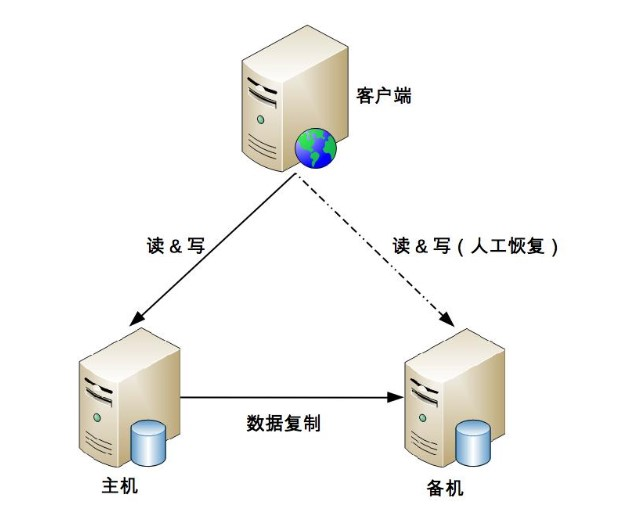
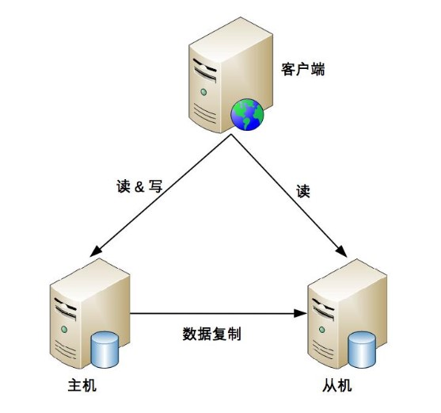
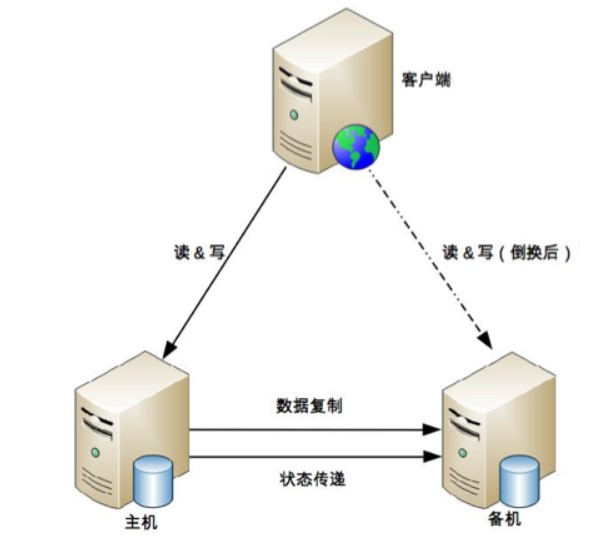
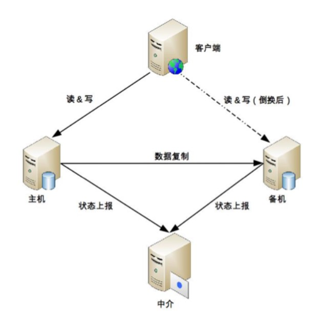
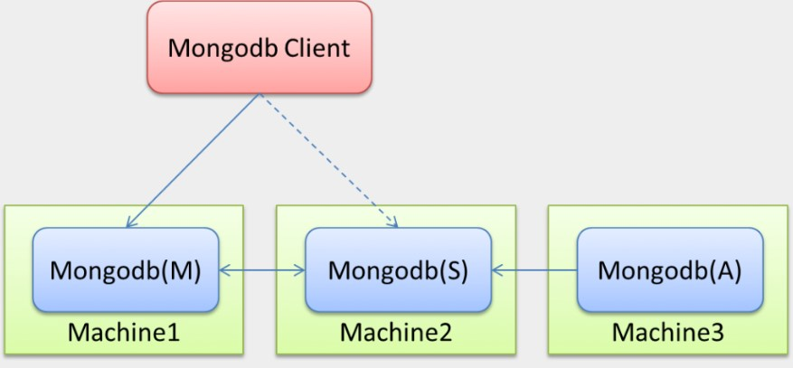
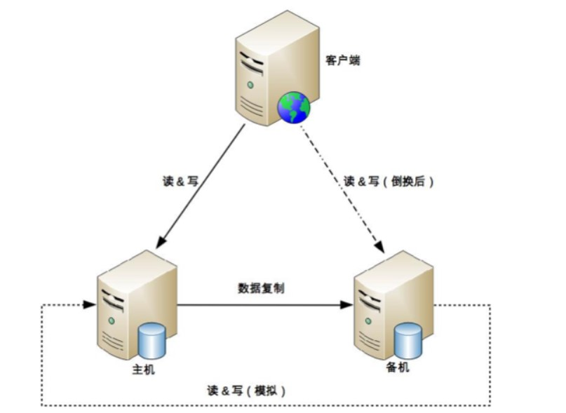
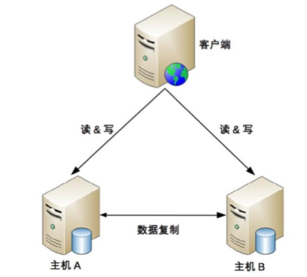
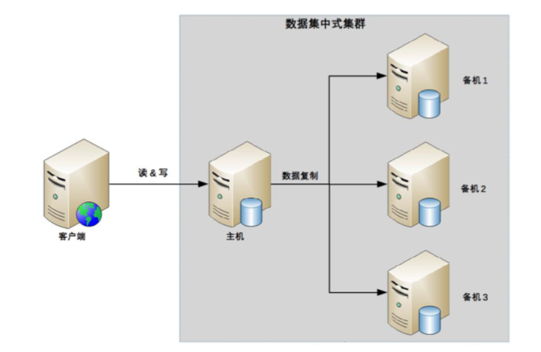
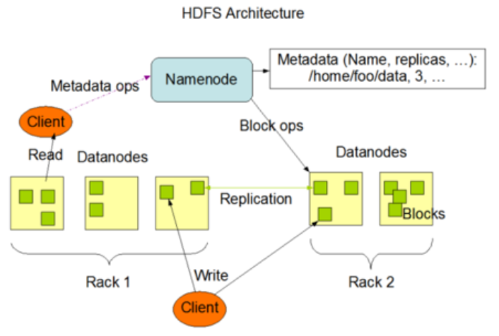

## 1. 概述  
&emsp;&emsp;如何来做存储高可用呢？本质都是通过冗余的方式来实现的。但是实现冗余，就会面临各种问题，其复杂性主要体现在如何应对复制延迟和中断导致的数据不一致问题。这些问题通常包括：  
* 数据如何复制。
* 各个节点的职责是什么
* 如何应对复制延迟
* 如果应对复制中断的问题   
&emsp;&emsp;为了解决这些问题，我们有了高可用架构模式，主要由三种：  
* 双机高可用架构
  * 主备
  * 主从
  * 主备/主从切换
  * 主主
* 数据集群架构
* 数据分区架构  

## 2. 双机高可用架构
### 2.1. 主备复制
&emsp;&emsp;主备复制是最常见也是最简单的一种存储高可用方案，几乎所有的存储系统都提供了主备复制的功能，例如 MySQL、Redis、MongoDB 等。

### 2.1.1. 基本机制

### 2.1.2. 分析  
优点：  
* 对于客户端来说，不需要感知备机的存在，即使灾难恢复后，原来的备机被人工修改为主机后，对于客户端来说，只是认为主机的地址换了而已，无须知道是原来的备机升级为主机。
* 对于主机和备机来说，双方只需要进行数据复制即可，无须进行状态判断和主备切换这类复杂的操作。  

缺点：  
* 备机仅仅只为备份，并没有提供读写操作，硬件成本上有浪费。
* 故障后需要人工干预，无法自动恢复。人工处理的效率是很低的  

### 2.1.3. 适用场景  
内部的后台管理系统使用主备复制架构的情况会比较多，例如学生管理系统、员工管理系统、假期管理系统等，因为这类系统的数据变更频率低，即使在某些场景下丢失数据，也可以通过人工的方式补全

### 2.2. 主备复制  
主机负责读写操作，从机只负责读操作，不负责写操作  

#### 2.2.1. 基本机制  
  

#### 2.2.2. 分析  
优点：  
* 主从复制在主机故障时，读操作相关的业务可以继续运行。
* 主从复制架构的从机提供读操作，发挥了硬件的性能    

缺点：  
* 主从复制架构中，客户端需要感知主从关系，并将不同的操作发给不同的机器进行处理，复杂度比主备复制要高。
* 主从复制架构中，从机提供读业务，如果主从复制延迟比较大，业务会因为数据不一致出现问题。
* 故障时需要人工干预。   

#### 2.2.3. 适用场景  
一般情况下，写少读多的业务使用主从复制的存储架构比较多。例如，论坛、BBS、新闻网站这类业务，此类业务的读操作数量是写操作数量的 10 倍甚至 100 倍以上   

### 2.3. 双机切换

&emsp;&emsp;主备和主从有两大重大缺陷为：  
* 主机故障，无法进行写操作
* 主机恢复，需要人工指定主机角色      

&emsp;&emsp;为了解决上述的问题，于是就有了双机切换，这两种方案就是在原有的基础上增加了自动切换功能。自动切换说着简单，其实需要考虑很多关键的细节

### 2.3.1. 双机切换关键点
* 主备间状态判断
  * 状态渠道  
    是相互间互相连接，还是第三方仲裁  
  * 状态检测条件
    机器是否宕机、进程是否存在、响应是否缓慢  
* 切换决策  
  * 切换时机  
    什么情况下备机应该升级为主机？是机器掉电后备机才升级，还是主机上的进程不存在就升级，还是主机响应时间超过 2 秒就升级，还是 3 分钟内主机连续重启 3 次就升级等  
  * 切换策略  
    原来的主机故障恢复后，要再次切换，确保原来的主机继续做主机，还是原来的主机故障恢复后自动成为新的备机  
  * 自动程度  
    切换是完全自动的，还是半自动的？例如，系统判断当前需要切换，但需要人工做最终的确认操作（例如，单击一下“切换”按钮）  

* 数据冲突  
  &emsp;&emsp;原有故障的主机恢复后，新旧主机之间可能存在数据冲突。   
  &emsp;&emsp;当原有故障的主机恢复后，新旧主机之间可能存在数据冲突。例如，用户在旧主机上新增了一条 ID 为 100 的数据，这个数据还没有复制到旧的备机，此时发生了切换，旧的备机升级为新的主机，用户又在新的主机上新增了一条 ID 为 100 的数据，当旧的故障主机恢复后，这两条 ID 都为 100 的数据，应该怎么处理。   

### 2.3.2. 常见双机切换架构
状态传递渠道的不同，常见的主备切换架构有三种形式：互连式、中介式和模拟式。   
#### 2.3.2.1. 互连式    
主机和备机多了一个“状态传递”的通道，这个通道就是用来传递状态信息的
    
互连式服务特点：  
* 可以是网络连接（例如，各开一个端口），也可以是非网络连接（用串口线连接）。
* 可以是主机发送状态给备机，也可以是备机到主机来获取状态信息。
* 可以和数据复制通道共用，也可以独立一条通道。
* 状态传递通道可以是一条，也可以是多条，还可以是不同类型的通道混合（例如，网络 + 串口）。  

客户端特点：  
* 为了切换后不影响客户端的访问，主机和备机之间共享一个对客户端来说唯一的地址。例如虚拟 IP，主机需要绑定这个虚拟的 IP。
* 客户端同时记录主备机的地址，哪个能访问就访问哪个；备机虽然能收到客户端的操作请求，但是会直接拒绝，拒绝的原因就是“备机不对外提供服务    

互连式的缺点：  
* 如果状态传递的通道本身有故障（例如，网线被人不小心踢掉了），那么备机也会认为主机故障了从而将自己升级为主机，而此时主机并没有故障，最终就可能出现两个主机。
* 虽然可以通过增加多个通道来增强状态传递的可靠性，但这样做只是降低了通道故障概率而已，不能从根本上解决这个缺点，而且通道越多，后续的状态决策会更加复杂，因为对备机来说，可能从不同的通道收到了不同甚至矛盾的状态信息  

#### 2.3.2.2. 中介式  
引入第三方中介，主备机之间不直接连接，而都去连接中介，并且通过中介来传递状态信息  
    
其关键点为：  
* 主机和备机不再通过互联通道传递状态信息，而是都将状态上报给中介这一角色。
* 单纯从架构上看，中介式似乎比互连式更加复杂了，首先要引入中介，然后要各自上报状态。然而事实上，中介式架构在状态传递和决策上却更加简单  

中介式的优点：   
* 连接管理更简单  
  主备机无须再建立和管理多种类型的状态传递连接通道，只要连接到中介即可，实际上是降低了主备机的连接管理复杂度。  

  例如，互连式要求主机开一个监听端口，备机来获取状态信息；或者要求备机开一个监听端口，主机推送状态信息到备机；如果还采用了串口连接，则需要增加串口连接管理和数据读取。采用中介式后，主备机都只需要把状态信息发送给中介，或者从中介获取对方的状态信息。无论是发送还是获取，主备机都是作为中介的客户端去操作，复杂度会降低  

* 状态决策更简单    
  主备机的状态决策简单了，无须考虑多种类型的连接通道获取的状态信息如何决策的问题，只需要按照下面简单的算法即可完成状态决策   
  * 无论是主机还是备机，初始状态都是备机，并且只要与中介断开连接，就将自己降级为备机，因此可能出现双备机的情况。
  * 主机与中介断连后，中介能够立刻告知备机，备机将自己升级为主机。
  * 如果是网络中断导致主机与中介断连，主机自己会降级为备机，网络恢复后，旧的主机以新的备机身份向中介上报自己的状态。
  * 如果是掉电重启或者进程重启，旧的主机初始状态为备机，与中介恢复连接后，发现已经有主机了，保持自己备机状态不变。
  * 主备机与中介连接都正常的情况下，按照实际的状态决定是否进行切换。例如，主机响应时间超过 3 秒就进行切换，主机降级为备机，备机升级为主机即可。

中介式的缺点：
* 如何实现中介本身的高可用。如果中介自己宕机了，整个系统就进入了双备的状态，写操作相关的业务就不可用了  

MongoDB 的 Replica Set 架构案例：  
  
* MongoDB(M) 表示主节点，MongoDB(S) 表示备节点，MongoDB(A) 表示仲裁节点。
* 主备节点存储数据，仲裁节点不存储数据。
* 客户端同时连接主节点与备节点，不连接仲裁节点  

目前可适用开源的组件作为中介的高可用方案，例如 ZooKeeper 和 Keepalived。ZooKeeper 本身已经实现了高可用集群架构，因此已经帮我们解决了中介本身的可靠性问题，在工程实践中推荐基于 ZooKeeper 搭建中介式切换架构。  

#### 2.3.2.3. 模拟式  
模拟式指主备机之间并不传递任何状态数据，而是备机模拟成一个客户端，向主机发起模拟的读写操作，根据读写操作的响应情况来判断主机的状态  
  
其特点：  
* 主备机之间只有数据复制通道，而没有状态传递通
* 备机通过模拟的读写操作来探测主机的状态，
* 然后根据读写操作的响应情况来进行状态决策   

优点：  
优点是实现更加简单，因为省去了状态传递通道的建立和管理工作   

缺点：  
* 因为模拟式读写操作获取的状态信息只有响应信息（例如，HTTP 404，超时、响应时间超过 3 秒等），没有互连式那样多样（除了响应信息，还可以包含 CPU 负载、I/O 负载、吞吐量、响应时间等）
* 基于有限的状态来做状态决策，可能出现偏差  

### 2.4. 主主复制  
主主复制指的是两台机器都是主机，互相将数据复制给对方，客户端可以任意挑选其中一台机器进行读写操作  
  
其特点为：  
* 两台都是主机，不存在切换的概念。
* 客户端无须区分不同角色的主机，随便将读写操作发送给哪台主机都可以  

  
优点：  
* 总体上来看要简单很多
* 无须状态信息传递，也无须状态决策和状态切换  

但是这种设计有很高的复杂度，即必须保证数据能够双向复制，而很多数据是不能双向复制：  
* 用户注册后生成的用户 ID，如果按照数字增长，那就不能双向复制，否则就会出现 X 用户在主机 A 注册，分配的用户 ID 是 100，同时 Y 用户在主机 B 注册，分配的用户 ID 也是 100，这就出现了冲突
* 库存不能双向复制。例如，一件商品库存 100 件，主机 A 上减了 1 件变成 99，主机 B 上减了 2 件变成 98，然后主机 A 将库存 99 复制到主机 B，主机 B 原有的库存 98 被覆盖，变成了 99，而实际上此时真正的库存是 97。类似的还有余额数据  

&emsp;&emsp;因此，主主复制架构对数据的设计有严格的要求，一般适合于那些临时性、可丢失、可覆盖的数据场景。例如，用户登录产生的 session 数据（可以重新登录生成）、用户行为的日志数据（可以丢失）、论坛的草稿数据（可以丢失）等

### 2.5. 小结  
政府信息网站使用主备或者主从架构就可以了。信息都是人工录入，可以补录。数据本来对实时性要求不高，所以出了故障人工修复也来得及。所以主备就够了，如果为了照顾形象可以用主从，保证主机故障后仍然可以查，不能新发    

## 3. 数据集群
&emsp;&emsp;主备、主从、主主架构本质上都有一个隐含的假设：主机能够存储所有数据，但主机本身的存储和处理能力肯定是有极限的。  
&emsp;&emsp;如果要存储拥有大量的数据，单台服务器肯定是无法存储和处理的，我们必须使用多台服务器来存储数据，这就是数据集群架构  
&emsp;&emsp;集群就是多台机器组合在一起形成一个统一的系统，数量上至少是3台，根据集群中机器承担的不同角色来划分，集群可以分为两类：  
* 数据集中集群
* 数据分散集群

### 3.1. 数据集中集群  
&emsp;&emsp;数据集中集群与主备、主从这类架构相似，我们也可以称数据集中集群为 1 主多备或者 1 主多从。无论是 1 主 1 从、1 主 1 备，还是 1 主多备、1 主多从，数据都只能往主机中写，而读操作可以参考主备、主从架构进行灵活多变  
   
&emsp;&emsp;由于集群里面的服务器数量更多，导致复杂度整体更高。  
其主要的复杂度在于：  
* 主机如何将数据复制给备机   
  * 主备和主从架构中，只有一条复制通道，而数据集中集群架构中，存在多条复制通道。多条复制通道首先会增大主机复制的压力，某些场景下我们需要考虑如何降低主机复制压力，或者降低主机复制给正常读写带来的压力。   
  * 多条复制通道可能会导致多个备机之间数据不一致，某些场景下我们需要对备机之间的数据一致性进行检查和修正
* 备机如何检测主机状态  
  * 主备和主从架构中，只有一台备机需要进行主机状态判断。在数据集中集群架构中，多台备机都需要对主机状态进行判断，而不同的备机判断的结果可能是不同的，如何处理不同备机对主机状态的不同判断，是一个复杂的问题
* 主机故障后，如何决定新的主机  
  * 主从架构中，如果主机故障，将备机升级为主机即可；而在数据集中集群架构中，有多台备机都可以升级为主机，但实际上只能允许一台备机升级为主机，那么究竟选择哪一台备机作为新的主机，备机之间如何协调，这也是一个复杂的问题

  
&emsp;&emsp;开源的数据集中集群以 ZooKeeper 为典型，ZooKeeper 通过 ZAB 算法来解决上述提到的几个问题，但 ZAB 算法的复杂度是很高的

### 3.2. 数据分散集群
&emsp;&emsp;数据分散集群指多个服务器组成一个集群，每台服务器都会负责存储一部分数据；同时，为了提升硬件利用率，每台服务器又会备份一部分数据。  
其复杂度主要有：  
* 均衡性
  * 算法需要保证服务器上的数据分区基本是均衡的，不能存在某台服务器上的分区数量是另外一台服务器的几倍的情况
* 容错性
  * 当出现部分服务器故障时，算法需要将原来分配给故障服务器的数据分区分配给其他服务器。
* 可伸缩性
  * 当集群容量不够，扩充新的服务器后，算法能够自动将部分数据分区迁移到新服务器，并保证扩容后所有服务器的均衡性。  

#### 3.2.1. 基本机制 
&emsp;&emsp;数据分散集群和数据集中集群的不同点在于，数据分散集群中的每台服务器都可以处理读写请求，因此不存在数据集中集群中负责写的主机那样的角色。但在数据分散集群中，必须有一个角色来负责执行数据分配算法，这个角色可以是独立的一台服务器，也可以是集群自己选举出的一台服务器。如果是集群服务器选举出来一台机器承担数据分区分配的职责，则这台服务器一般也会叫作主机，但我们需要知道这里的“主机”和数据集中集群中的“主机”，其职责是有差异的    

#### 3.2.2. Hadoop hdfs案例
&emsp;&emsp;Hadoop 的实现就是独立的服务器负责数据分区的分配，这台服务器叫作 Namenode。Hadoop 的数据分区管理架构如下:    
   
* HDFS 采用 master/slave 架构。
* 一个 HDFS 集群由一个 Namenode 和一定数目的 Datanodes 组成。 
* Namenode 是一个中心服务器，负责管理文件系统的名字空间（namespace），以及客户端对文件的访问。 
* 集群中的 Datanode 一般是一个节点一个，负责管理它所在节点上的存储。HDFS 暴露了文件系统的名字空间，用户能够以文件的形式在上面存储数据。
* 从内部看，一个文件其实被分成一个或多个数据块，这些块存储在一组 Datanode 上。 
* Namenode 执行文件系统的名字空间操作，比如打开、关闭、重命名文件或目录。它也负责确定数据块到具体 Datanode 节点的映射。
* Datanode 负责处理文件系统客户端的读写请求。在 Namenode 的统一调度下进行数据块的创建、删除和复制操作。  

**PS：Elasticsearch 集群通过选举一台服务器来做数据分区的分配，叫作 master node**  

### 3.3. 小结  
* 数据集中集群架构中，客户端只能将数据写到主机；
* 数据分散集群架构中，客户端可以向任意服务器中读写数据。
* 正是因为这个关键的差异，决定了两种集群的应用场景不同。一般来说，数据集中集群适合数据量不大，集群机器数量不多的场景。例如，ZooKeeper 集群，一般推荐 5 台机器左右，数据量是单台服务器就能够支撑；
* 而数据分散集群，由于其良好的可伸缩性，适合业务数据量巨大、集群机器数量庞大的业务场景。例如，Hadoop 集群、HBase 集群，大规模的集群可以达到上百台甚至上千台服务器

## 4. 数据分区  
&emsp;&emsp;前面我们讨论的存储高可用架构都是基于硬件故障的场景去考虑和设计的，主要考虑当部分硬件可能损坏的情况下系统应该如何处理，但对于一些影响非常大的灾难或者事故来说，有可能所有的硬件全部故障。我们需要基于地理级别的故障来设计高可用架构，这就是数据分区架构产生的背景。  
&emsp;&emsp;数据分区指将数据按照一定的规则进行分区，不同分区分布在不同的地理位置上，每个分区存储一部分数据，通过这种方式来规避地理级别的故障所造成的巨大影响。采用了数据分区的架构后，即使某个地区发生严重的自然灾害或者事故，受影响的也只是一部分数据，而不是全部数据都不可用；当故障恢复后，其他地区备份的数据也可以帮助故障地区快速恢复业务。  
如何设计一个这样的分区架构呢？主要可以从如下的方向思考：  
### 4.1. 数据分区思路  
#### 4.1.1. 数据量
数据量的大小直接决定了分区的规则复杂度。例如，使用 MySQL 来存储数据，假设一台 MySQL 存储能力是 500GB，那么 2TB 的数据就至少需要 4 台 MySQL 服务器；而如果数据是 200TB，并不是增加到 800 台的 MySQL 服务器那么简单。如果按照 4 台服务器那样去平行管理 800 台服务器，复杂度会发生本质的变化，具体表现为：
  * 800 台服务器里面可能每周都有一两台服务器故障，从 800 台里面定位出 2 台服务器故障，很多情况下并不是一件容易的事情，运维复杂度高。
  * 增加新的服务器，分区相关的配置甚至规则需要修改，而每次修改理论上都有可能影响已有的 800 台服务器的运行，不小心改错配置的情况在实践中太常见了。
  * 如此大量的数据，如果在地理位置上全部集中于某个城市，风险很大，遇到了水灾、大停电这种灾难性的故障时，数据可能全部丢失，因此分区规则需要考虑地理容灾  
  * 因此，数据量越大，分区规则会越复杂，考虑的情况也越多。
#### 4.1.2. 分区规则  
&emsp;&emsp;地理位置有近有远，因此可以得到不同的分区规则，包括洲际分区、国家分区、城市分区。具体采取哪种或者哪几种规则，需要综合考虑业务范围、成本等因素。  
&emsp;&emsp;通常情况下，洲际分区主要用于面向不同大洲提供服务，由于跨洲通讯的网络延迟已经大到不适合提供在线服务了，因此洲际间的数据中心可以不互通或者仅仅作为备份；国家分区主要用于面向不同国家的用户提供服务，不同国家有不同语言、法律、业务等，国家间的分区一般也仅作为备份；城市分区由于都在同一个国家或者地区内，网络延迟较低，业务相似，分区同时对外提供服务，可以满足业务异地多活之类的需求。
#### 4.1.3. 复制规则  
数据分区指将数据分散在多个地区，在某些异常或者灾难情况下，虽然部分数据受影响，但整体数据并没有全部被影响，本身就相当于一个高可用方案了。但仅仅做到这点还不够，因为每个分区本身的数据量虽然只是整体数据的一部分，但还是很大，这部分数据如果损坏或者丢失，损失同样难以接受。因此即使是分区架构，同样需要考虑复制方案。

### 4.2. 数据分区复制方案

#### 4.2.1. 集中式  
#### 4.2.2. 互备式
#### 4.2.3. 独立式