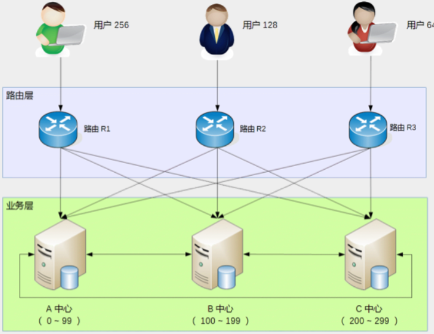

## 1. 开头
&emsp;&emsp;不管是存储高可用还是计算高可用，都是为了解决部分服务器故障的场景下，如何保证系统能够继续提供服务。  
&emsp;&emsp;但是，在一些极端场景下，有可能所有服务器都出现故障。例如，典型的有机房断电、机房火灾、地震、水灾……这些极端情况会导致某个系统所有服务器都故障，或者业务整体瘫痪，而且即使有其他地区的备份，把备份业务系统全部恢复到能够正常提供业务，花费的时间也比较长，可能是半小时，也可能是 12 小时。因为备份系统平时不对外提供服务，可能会存在很多隐藏的问题没有发现。如果业务期望达到即使在此类灾难性故障的情况下，业务也不受影响，或者在几分钟内就能够很快恢复，那么就需要设计异地多活架构。  

## 2. 异地多活定义

### 2.1. 什么是异地多活
判断一个系统是否符合异地多活，需要满足两个标准：
* 正常情况下，用户无论访问哪一个地点的业务系统，都能够得到正确的业务服务。
* 某个地方业务异常的时候，用户访问其他地方正常的业务系统，能够得到正确的业务服务。    

与“活”对应的是字是“备”，备是备份，正常情况下对外是不提供服务的，如果需要提供服务，则需要大量的人工干预和操作，花费大量的时间才能让“备”变成“活”

### 2.2. 异地多活架构复杂度  
实现异地多活架构不是没有代价的，相反其代价很高，具体表现为：
* 系统复杂度会发生质的变化，需要设计复杂的异地多活架构。
* 成本会上升，毕竟要多在一个或者多个机房搭建独立的一套业务系统

### 2.3. 异地多活的适用场景  
&emsp;&emsp;异地多活虽然功能很强大，但也不是每个业务不管三七二十一都要上异地多活。例如，常见的新闻网站、企业内部的 IT 系统、游戏、博客站点等，如果无法承受异地多活带来的复杂度和成本，是可以不做异地多活的，只需要做异地备份即可。   
&emsp;&emsp;如果业务规模很大，能够做异地多活的情况下还是尽量。首先，这样能够在异常的场景下给用户提供更好的体验；其次，业务规模很大肯定会伴随衍生的收入，例如广告收入，异地多活能够减少异常场景带来的收入损失。同样以新闻网站为例，虽然从业务的角度来看，新闻类网站对用户影响不大，反正用户也可以从其他地方看到基本相同的新闻，甚至用户几个小时不看新闻也没什么问题。但是从网站本身来看，几个小时不可访问肯定会影响用户对网站的口碑；其次几个小时不可访问，网站上的广告收入损失也会很大   

## 3. 异地多活常见模式  
### 3.1. 同城异地
&emsp;&emsp;同城异区指的是将业务部署在同一个城市不同区的多个机房。例如，在北京部署两个机房，一个机房在海淀区，一个在通州区，然后将两个机房用专用的高速网络连接在一起。  
&emsp;&emsp;如果我们考虑一些极端场景（例如，美加大停电、新奥尔良水灾），同城异区似乎没什么作用，那为何我们还要设计同城异区这种架构呢？答案就在于“同城”。  
&emsp;&emsp;同城的两个机房，距离上一般大约就是几十千米，通过搭建高速的网络，同城异区的两个机房能够实现和同一个机房内几乎一样的网络传输速度。这就意味着虽然是两个不同地理位置上的机房，但逻辑上我们可以将它们看作同一个机房，这样的设计大大降低了复杂度，减少了异地多活的设计和实现复杂度及成本。  
&emsp;&emsp;那如果采用了同城异区架构，一旦发生新奥尔良水灾这种灾难怎么办呢？很遗憾，答案是无能为力。但我们需要考虑的是，这种极端灾难发生概率是比较低的，可能几年或者十几年才发生一次。其次，除了这类灾难，机房火灾、机房停电、机房空调故障这类问题发生的概率更高，而且破坏力一样很大。而这些故障场景，同城异区架构都可以很好地解决。因此，结合复杂度、成本、故障发生概率来综合考虑，同城异区是应对机房级别故障的最优架构

### 3.2. 跨城异地  
&emsp;&emsp;跨城异地指的是业务部署在不同城市的多个机房，而且距离最好要远一些。例如，将业务部署在北京和广州两个机房，而不是将业务部署在广州和深圳的两个机房。  
&emsp;&emsp;为何跨城异地要强调距离要远呢？  
&emsp;&emsp;前面我在介绍同城异区的架构时提到同城异区不能解决新奥尔良水灾这种问题，而两个城市离得太近又无法应对如美加大停电这种问题，跨城异地其实就是为了解决这两类问题的，因此需要在距离上比较远，才能有效应对这类极端灾难事件。  
&emsp;&emsp;跨城异地虽然能够有效应对极端灾难事件，但“距离较远”这点并不只是一个距离数字上的变化，而是量变引起了质变，导致了跨城异地的架构复杂度大大上升。距离增加带来的最主要问题是两个机房的网络传输速度会降低，这不是以人的意志为转移的，而是物理定律决定的，即光速真空传播大约是每秒 30 万千米，在光纤中传输的速度大约是每秒 20 万千米，再加上传输中的各种网络设备的处理，实际还远远达不到理论上的速度。  
&emsp;&emsp;除了距离上的限制，中间传输各种不可控的因素也非常多。例如，挖掘机把光纤挖断、中美海底电缆被拖船扯断、骨干网故障等，这些线路很多是第三方维护，针对故障我们根本无能为力也无法预知。例如，广州机房到北京机房，正常情况下 RTT 大约是 50 毫秒左右，遇到网络波动之类的情况，RTT 可能飙升到 500 毫秒甚至 1 秒，更不用说经常发生的线路丢包问题，那延迟可能就是几秒几十秒了。  
&emsp;&emsp;以上描述的问题，虽然同城异区理论上也会遇到，但由于同城异区距离较短，中间经过的线路和设备较少，问题发生的概率会低很多。而且同城异区距离短，即使是搭建多条互联通道，成本也不会太高，而跨城异区距离太远，搭建或者使用多通道的成本会高不少。  
&emsp;&emsp;跨城异地距离较远带来的网络传输延迟问题，给异地多活架构设计带来了复杂性，如果要做到真正意义上的多活，业务系统需要考虑部署在不同地点的两个机房，在数据短时间不一致的情况下，还能够正常提供业务。这就引入了一个看似矛盾的地方：数据不一致业务肯定不会正常，但跨城异地肯定会导致数据不一致。  
&emsp;&emsp;如何解决这个问题呢？重点还是在“数据”上，即根据数据的特性来做不同的架构。如果是强一致性要求的数据，例如银行存款余额、支付宝余额等，这类数据实际上是无法做到跨城异地多活的。我们来看一个假设的例子，假如我们做一个互联网金融的业务，用户余额支持跨城异地多活，我们的系统分别部署在广州和北京，那么如果挖掘机挖断光缆后，会出现如下场景：  

* 用户 A 余额有 10000 元钱，北京和广州机房都是这个数据。
* 用户 A 向用户 B 转了 5000 元钱，这个操作是在广州机房完成的，完成后用户 A 在广州机房的余额是 5000 元。
* 由于广州和北京机房网络被挖掘机挖断，广州机房无法将余额变动通知北京机房，此时北京机房用户 A 的余额还是 10000 元。
* 用户 A 到北京机房又发起转账，此时他看到自己的余额还有 10000 元，于是向用户 C 转账 10000 元，转账完成后用户 A 的余额变为 0。
* 用户 A 到广州机房一看，余额怎么还有 5000 元？于是赶紧又发起转账，转账 5000 元给用户 D；此时广州机房用户 A 的余额也变为 0 了。
* 最终，本来余额 10000 元的用户 A，却转了 20000 元出去给其他用户。  

&emsp;&emsp;对于以上这种假设场景，虽然普通用户很难这样自如地操作，但如果真的这么做，被黑客发现后，后果不堪设想。正因为如此，支付宝等金融相关的系统，对余额这类数据，一般不会做跨城异地的多活架构，而只能采用同城异区这种架构。  

&emsp;&emsp;而对数据一致性要求不那么高，或者数据不怎么改变，或者即使数据丢失影响也不大的业务，跨城异地多活就能够派上用场了。例如，用户登录（数据不一致时用户重新登录即可）、新闻类网站（一天内的新闻数据变化较少）、微博类网站（丢失用户发布的微博或者评论影响不大），这些业务采用跨城异地多活，能够很好地应对极端灾难的场景

### 3.3. 跨国异地  
&emsp;&emsp;跨国异地指的是业务部署在不同国家的多个机房。相比跨城异地，跨国异地的距离就更远了，因此数据同步的延时会更长，正常情况下可能就有几秒钟了。这种程度的延迟已经无法满足异地多活标准的第一条：“正常情况下，用户无论访问哪一个地点的业务系统，都能够得到正确的业务服务”。例如，假设有一个微博类网站，分别在中国的上海和美国的纽约都建了机房，用户 A 在上海机房发表了一篇微博，此时如果他的一个关注者 B 用户访问到美国的机房，很可能无法看到用户 A 刚刚发表的微博。虽然跨城异地也会有此类同步延时问题，但正常情况下几十毫秒的延时对用户来说基本无感知的；而延时达到几秒钟就感觉比较明显了  
&emsp;&emsp;因此，跨国异地的“多活”，和跨城异地的“多活”，实际的含义并不完全一致。跨国异地多活的主要应用场景一般有这几种情况：
* 为不同地区用户提供服务  
  例如，亚马逊中国是为中国用户服务的，而亚马逊美国是为美国用户服务的，亚马逊中国的用户如果访问美国亚马逊，是无法用亚马逊中国的账号登录美国亚马逊的。

* 只读类业务做多活  
  例如，谷歌的搜索业务，由于用户搜索资料时，这些资料都已经存在于谷歌的搜索引擎上面，无论是访问英国谷歌，还是访问美国谷歌，搜索结果基本相同，并且对用户来说，也不需要搜索到最新的实时资料，跨国异地的几秒钟网络延迟，对搜索结果是没有什么影响的  

**PS:支付宝也没法100%保障，不然蓝翔挖掘机就不会导致支付宝故障了**  

## 4. 异地多活设计要点    
针对同城异区、跨城异地、跨国异地我们做了简要的分析
* 同城异区：关键在于搭建高速网络将两个机房连接起来，达到近似一个本地机房的效果。架构设计上可以将两个机房当作本地机房来设计，无须额外考虑  
* 跨城异地：关键在于数据不一致的情况下，业务不受影响或者影响很小，这从逻辑的角度上来说其实是矛盾的，架构设计的主要目的就是为了解决这个矛盾  
* 跨国异地：主要是面向不同地区用户提供业务，或者提供只读业务，对架构设计要求不高。  

因此，跨城异地多活是架构设计复杂度最高的一种，这里说的技巧主要是跨城异地多活
### 4.1. 保证核心业务的异地多活  
&emsp;&emsp;“异地多活”是为了保证业务的高可用，但很多架构师在考虑这个“业务”时，会不自觉地陷入一个思维误区：我要保证所有业务都能“异地多活”！  
&emsp;&emsp;假设我们需要做一个“用户子系统”，这个子系统负责“注册”“登录”“用户信息”三个业务。为了支持海量用户，我们设计了一个“用户分区”的架构，即正常情况下用户属于某个主分区，每个分区都有其他数据的备份，用户用邮箱或者手机号注册，路由层拿到邮箱或者手机号后，通过 Hash 计算属于哪个中心，然后请求对应的业务中心。基本的架构如下  
  
其异地多活复杂度如下：    
* 注册问题  
  &emsp;&emsp;A 中心注册了用户，数据还未同步到 B 中心，此时 A 中心宕机，为了支持注册业务多活，可以挑选 B 中心让用户去重新注册。看起来很容易就支持多活了，但仔细思考一下会发现这样做会有问题：一个手机号只能注册一个账号，A 中心的数据没有同步过来，B 中心无法判断这个手机号是否重复，如果 B 中心让用户注册，后来 A 中心恢复了，发现数据有冲突，怎么解决？实际上是无法解决的，因为同一个手机号注册的账号不能以后一次注册为准；而如果 B 中心不支持本来属于 A 中心的业务进行注册，注册业务的多活又成了空谈。  
  &emsp;&emsp;如果我们修改业务规则，允许一个手机号注册多个账号不就可以了吗？  
  &emsp;&emsp;这样做是不可行的，类似一个手机号只能注册一个账号这种规则，是核心业务规则，修改核心业务规则的代价非常大，几乎所有的业务都要重新设计，为了架构设计去改变业务规则（而且是这么核心的业务规则）是得不偿失的
* 用户信息问题   
  &emsp;&emsp;用户信息的修改和注册有类似的问题，即 A、B 两个中心在异常的情况下都修改了用户信息，如何处理冲突？  
  &emsp;&emsp;由于用户信息并没有账号那么关键，一种简单的处理方式是按照时间合并，即最后修改的生效。业务逻辑上没问题，但实际操作也有一个很关键的“坑”：怎么保证多个中心所有机器时间绝对一致？在异地多中心的网络下，这个是无法保证的，即使有时间同步也无法完全保证，只要两个中心的时间误差超过 1 秒，数据就可能出现混乱，即先修改的反而生效。  
  &emsp;&emsp;还有一种方式是生成全局唯一递增 ID，这个方案的成本很高，因为这个全局唯一递增 ID 的系统本身又要考虑异地多活，同样涉及数据一致性和冲突的问题。  
  &emsp;&emsp;综合上面的简单分析可以发现，如果“注册”“登录”“用户信息”全部都要支持异地多活，实际上是挺难的，有的问题甚至是无解的。那这种情况下我们应该如何考虑“异地多活”的架构设计呢？  
  &emsp;&emsp;答案其实很简单：**优先实现核心业务的异地多活架构！**     

&emsp;&emsp;对于这个模拟案例来说，“登录”才是最核心的业务，“注册”和“用户信息”虽然也是主要业务，但并不一定要实现异地多活，主要原因在于业务影响不同。对于一个日活 1000 万的业务来说，每天注册用户可能是几万，修改用户信息的可能还不到 1 万，但登录用户是 1000 万，很明显我们应该保证登录的异地多活。   
&emsp;&emsp;对于新用户来说，注册不了的影响并不明显，因为他还没有真正开始使用业务。用户信息修改也类似，暂时修改不了用户信息，对于其业务不会有很大影响。而如果有几百万用户登录不了，就相当于几百万用户无法使用业务，对业务的影响就非常大了：公司的客服热线很快就被打爆，微博、微信上到处都在传业务宕机，论坛里面到处是抱怨的用户，那就是互联网大事件了！  
&emsp;&emsp;而登录实现“异地多活”恰恰是最简单的，因为每个中心都有所有用户的账号和密码信息，用户在哪个中心都可以登录。用户在 A 中心登录，A 中心宕机后，用户到 B 中心重新登录即可。   

&emsp;&emsp;如果某个用户在 A 中心修改了密码，此时数据还没有同步到 B 中心，用户到 B 中心登录是无法登录的，这个怎么处理？这个后面再说。
