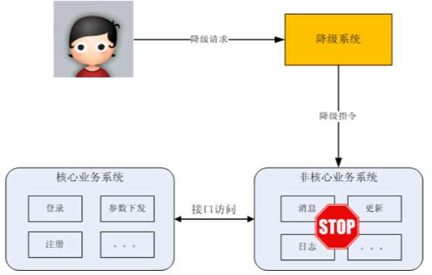
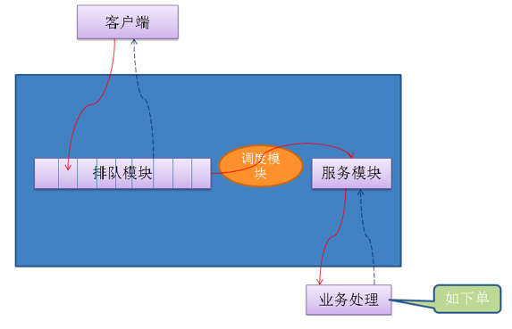

## 1. 开头  
&emsp;&emsp;异地多活方案主要应对系统级的故障，例如，机器宕机、机房故障、网络故障等问题，这些系统级的故障虽然影响很大，但发生概率较小。在实际业务运行过程中，还有另外一种故障影响可能没有系统级那么大，但发生的概率较高，这就是今天我要与你聊的如何应对接口级的故障。  
&emsp;&emsp;接口级故障的典型表现就是系统并没有宕机，网络也没有中断，但业务却出现问题了。例如，业务响应缓慢、大量访问超时、大量访问出现异常（给用户弹出提示“无法连接数据库”），这类问题的主要原因在于系统压力太大、负载太高，导致无法快速处理业务请求，由此引发更多的后续问题。例如，最常见的数据库慢查询将数据库的服务器资源耗尽，导致读写超时，业务读写数据库时要么无法连接数据库、要么超时，最终用户看到的现象就是访问很慢，一会访问抛出异常，一会访问又是正常结果  

## 2. 接口故障原因  
* 内部原因  
  程序 bug 导致死循环，某个接口导致数据库慢查询，程序逻辑不完善导致耗尽内存等。

* 外部原因  
  黑客攻击、促销或者抢购引入了超出平时几倍甚至几十倍的用户，第三方系统大量请求，第三方系统响应缓慢等     

## 3. 解决方案  
&emsp;&emsp;解决接口级故障的核心思想和异地多活基本类似：优先保证核心业务和优先保证绝大部分用户。
### 3.1. 降级  
&emsp;&emsp;降级指系统将某些业务或者接口的功能降低，可以是只提供部分功能，也可以是完全停掉所有功能。例如，论坛可以降级为只能看帖子，不能发帖子；也可以降级为只能看帖子和评论，不能发评论；而 App 的日志上传接口，可以完全停掉一段时间，这段时间内 App 都不能上传日志。  
&emsp;&emsp;降级的核心思想就是丢车保帅，优先保证核心业务。例如，对于论坛来说，90% 的流量是看帖子，那我们就优先保证看帖的功能；对于一个 App 来说，日志上传接口只是一个辅助的功能，故障时完全可以停掉。  
&emsp;&emsp;常见的实现降级的方式有：  
* 系统后门降级  
  简单来说，就是系统预留了后门用于降级操作。例如，系统提供一个降级 URL，当访问这个 URL 时，就相当于执行降级指令，具体的降级指令通过 URL 的参数传入即可。这种方案有一定的安全隐患，所以也会在 URL 中加入密码这类安全措施。  
  系统后门降级的方式实现成本低，但主要缺点是如果服务器数量多，需要一台一台去操作，效率比较低，这在故障处理争分夺秒的场景下是比较浪费时间的。
* 独立降级系统  
  为了解决系统后门降级方式的缺点，将降级操作独立到一个单独的系统中，可以实现复杂的权限管理、批量操作等功能。其基本架构如下：    
    

### 3.2. 熔断
&emsp;&emsp;熔断和降级是两个比较容易混淆的概念，因为单纯从名字上看好像都有禁止某个功能的意思，但其实内在含义是不同的，原因在于降级的目的是应对系统自身的故障，而熔断的目的是应对依赖的外部系统故障的情况。   
&emsp;&emsp;假设一个这样的场景：A 服务的 X 功能依赖 B 服务的某个接口，当 B 服务的接口响应很慢的时候，A 服务的 X 功能响应肯定也会被拖慢，进一步导致 A 服务的线程都被卡在 X 功能处理上，此时 A 服务的其他功能都会被卡住或者响应非常慢。这时就需要熔断机制了，即：A 服务不再请求 B 服务的这个接口，A 服务内部只要发现是请求 B 服务的这个接口就立即返回错误，从而避免 A 服务整个被拖慢甚至拖死。    
&emsp;&emsp;熔断机制实现的关键是需要有一个统一的 API 调用层，由 API 调用层来进行采样或者统计，如果接口调用散落在代码各处就没法进行统一处理了。  
&emsp;&emsp;熔断机制实现的另外一个关键是阈值的设计，例如 1 分钟内 30% 的请求响应时间超过 1 秒就熔断，这个策略中的“1 分钟”“30%”“1 秒”都对最终的熔断效果有影响。实践中一般都是先根据分析确定阈值，然后上线观察效果，再进行调优  

### 3.3. 限流
&emsp;&emsp;降级是从系统功能优先级的角度考虑如何应对故障，而限流则是从用户访问压力的角度来考虑如何应对故障。限流指只允许系统能够承受的访问量进来，超出系统访问能力的请求将被丢弃。  
&emsp;&emsp;虽然“丢弃”这个词听起来让人不太舒服，但保证一部分请求能够正常响应，总比全部请求都不能响应要好得多。  
&emsp;&emsp;限流一般都是系统内实现的，常见的限流方式可以分为两类：基于请求限流和基于资源限流。

#### 3.3.1. 基于请求限流  
&emsp;&emsp;基于请求限流指从外部访问的请求角度考虑限流，常见的方式有：限制总量、限制时间量。  
&emsp;&emsp;限制总量的方式是限制某个指标的累积上限，常见的是限制当前系统服务的用户总量，例如某个直播间限制总用户数上限为 100 万，超过 100 万后新的用户无法进入；某个抢购活动商品数量只有 100 个，限制参与抢购的用户上限为 1 万个，1 万以后的用户直接拒绝。限制时间量指限制一段时间内某个指标的上限，例如，1 分钟内只允许 10000 个用户访问，每秒请求峰值最高为 10 万。  
&emsp;&emsp;无论是限制总量还是限制时间量，共同的特点都是实现简单，但在实践中面临的主要问题是比较难以找到合适的阈值，例如系统设定了 1 分钟 10000 个用户，但实际上 6000 个用户的时候系统就扛不住了；也可能达到 1 分钟 10000 用户后，其实系统压力还不大，但此时已经开始丢弃用户访问了。  
&emsp;&emsp;即使找到了合适的阈值，基于请求限流还面临硬件相关的问题。例如一台 32 核的机器和 64 核的机器处理能力差别很大，阈值是不同的，可能有的技术人员以为简单根据硬件指标进行数学运算就可以得出来，实际上这样是不可行的，64 核的机器比 32 核的机器，业务处理性能并不是 2 倍的关系，可能是 1.5 倍，甚至可能是 1.1 倍。  
&emsp;&emsp;为了找到合理的阈值，通常情况下可以采用性能压测来确定阈值，但性能压测也存在覆盖场景有限的问题，可能出现某个性能压测没有覆盖的功能导致系统压力很大；另外一种方式是逐步优化，即：先设定一个阈值然后上线观察运行情况，发现不合理就调整阈值。  
&emsp;&emsp;基于上述的分析，根据阈值来限制访问量的方式更多的适应于业务功能比较简单的系统，例如负载均衡系统、网关系统、抢购系统等。

#### 3.3.2. 基于节点资源限流
&emsp;&emsp;基于请求限流是从系统外部考虑的，而基于资源限流是从系统内部考虑的，即：找到系统内部影响性能的关键资源，对其使用上限进行限制。常见的内部资源有：连接数、文件句柄、线程数、请求队列等。  
&emsp;&emsp;例如，采用 Netty 来实现服务器，每个进来的请求都先放入一个队列，业务线程再从队列读取请求进行处理，队列长度最大值为 10000，队列满了就拒绝后面的请求；也可以根据 CPU 的负载或者占用率进行限流，当 CPU 的占用率超过 80% 的时候就开始拒绝新的请求  
&emsp;&emsp;基于资源限流相比基于请求限流能够更加有效地反映当前系统的压力，但实践中设计也面临两个主要的难点：如何确定关键资源，如何确定关键资源的阈值。通常情况下，这也是一个逐步调优的过程，即：设计的时候先根据推断选择某个关键资源和阈值，然后测试验证，再上线观察，如果发现不合理，再进行优化。  

### 3.4. 排队  
&emsp;&emsp;排队实际上是限流的一个变种，限流是直接拒绝用户，排队是让用户等待一段时间，全世界最有名的排队当属 12306 网站排队了。排队虽然没有直接拒绝用户，但用户等了很长时间后进入系统，体验并不一定比限流好。  
&emsp;&emsp;由于排队需要临时缓存大量的业务请求，单个系统内部无法缓存这么多数据，一般情况下，排队需要用独立的系统去实现，例如使用 Kafka 这类消息队列来缓存用户请求。  
&emsp;&emsp;下面是 1 号店的“双 11”秒杀排队系统架构  
  
* 排队模块  
  负责接收用户的抢购请求，将请求以先入先出的方式保存下来。每一个参加秒杀活动的商品保存一个队列，队列的大小可以根据参与秒杀的商品数量（或加点余量）自行定义。
* 调度模块  
  负责排队模块到服务模块的动态调度，不断检查服务模块，一旦处理能力有空闲，就从排队队列头上把用户访问请求调入服务模块，并负责向服务模块分发请求。这里调度模块扮演一个中介的角色，但不只是传递请求而已，它还担负着调节系统处理能力的重任。我们可以根据服务模块的实际处理能力，动态调节向排队系统拉取请求的速度。
* 服务模块  
  负责调用真正业务来处理服务，并返回处理结果，调用排队模块的接口回写业务处理结果。  

## 4. 总结    
设计一个整点限量秒杀系统，包括登录、抢购、支付（依赖支付宝）等功能，如何设计接口级的故障应对手段？  
* 对于用户服务，在抢购期间可以准备降级策略，压力过大时保证用户登录的可用，注册和修改信息可以做降级处理
* 抢购下单涉及到订单，库存，和商品查询。可通过请求排队来限流，超出库存的请求直接返回  
  为了应对库存和商品服务可能发生的故障，可以提前对商品数据和库存数据做缓存，如果对端服务故障，本地也可以提供服务
* 支付依赖第三方系统，合理设置熔断策略，如支付平均时长超过限制可提示用户稍晚做支付  
* 抢购页面最大程度静态化，一般用户开始前会尝试刷新页面，查询压力要比下单压力大很多
* 抢购页面要求登陆后访问，一般人不会抢购开始那一刻才进来，错开登陆压力
* 活动未开始，不允许点击抢购按钮。对请求做轻量分析，对于请求过频繁或者可疑ua等做拉黑，为防误杀要求输验证码
* 抢购下单接口采用排队+限流，降低压力的同时保证公平性，如抢购1000件，只放2000人进来，其他返回排队人数过多。进来的请求全部入列，固定数量的队列消费者控制订单生成速率以及走到支付流程的速率。
* 支付如果依赖第三方的话，需要考虑熔断，然后做补偿或者容错措施，例如提示用户10分钟后再来支付

