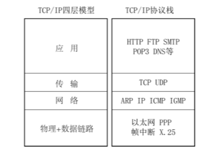
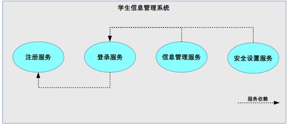

## 1. 开头  
&emsp;&emsp;软件系统与硬件和建筑系统最大的差异在于软件是可扩展的，一个硬件生产出来后就不会再进行改变、一个建筑完工后也不会再改变其整体结构。例如，一颗 CPU 生产出来后装到一台 PC 机上，不会再返回工厂进行加工以增加新的功能；金字塔矗立千年历经风吹雨打，但其现在的结构和当时建成完工时的结构并无两样。相比之下，软件系统就完全相反，如果一个软件系统开发出来后，再也没有任何更新和调整，反而说明了这套软件系统没有发展、没有生命力。真正有生命力的软件系统，都是在不断迭代和发展的，典型的如 Windows 操作系统，从 Windows 3.0 到 Windows 95 到 Windows XP，直到现在的 Windows 10，一直在跟着技术的发展而不断地发展  
&emsp;&emsp;软件系统的这种天生和内在的可扩展的特性，既是魅力所在，又是难点所在。魅力体现在我们可以通过修改和扩展，不断地让软件系统具备更多的功能和特性，满足新的需求或者顺应技术发展的趋势。而难点体现在如何以最小的代价去扩展系统，因为很多情况下牵一发动全身，扩展时可能出现到处都要改，到处都要推倒重来的情况。这样做的风险不言而喻：改动的地方越多，投入也越大，出错的可能性也越大。因此，如何避免扩展时改动范围太大，是软件架构可扩展性设计的主要思考点。  

## 2. 可扩展实现思路  
### 2.1. 核心思想  
&emsp;&emsp;可扩展性架构的设计方法很多，但万变不离其宗，所有的可扩展性架构设计，背后的基本思想都可以总结为一个字：拆，就是为了达成改这个不会影响那个的效果。  
&emsp;&emsp;拆，就是将原本大一统的系统拆分成多个规模小的部分，扩展时只修改其中一部分即可，无须整个系统到处都改，通过这种方式来减少改动范围，降低改动风险。  
&emsp;&emsp;说起来好像挺简单，毕竟“拆”我们见得太多了。一般情况下，我们要拆一个东西时，都是简单粗暴的。例如，用推土机拆房子、用剪刀拆快递包装、用手撕开包装袋等，反正拆完了这些东西就扔了。但面对软件系统，拆就没那么简单了，因为我们并不是要摧毁一个软件系统，而是要通过拆让软件系统变得更加优美（具备更好的可扩展性）。形象地说，软件系统中的“拆”是建设性的，因此难度要高得多。  
&emsp;&emsp;一般会有三种拆分方式：  
* 面向流程拆分：将整个业务流程拆分为几个阶段，每个阶段作为一部分 。  
* 面向服务拆分：将系统提供的服务拆分，每个服务作为一部分。  
* 面向功能拆分：将系统提供的功能拆分，每个功能作为一部分。    

### 2.2. 案例
#### 2.2.1. 网络模型案例
如对应 TCP/IP 四层模型
* 面向流程拆分  
  因为 TCP/IP 网络通信流程是：应用层 → 传输层 → 网络层 → 物理 + 数据链路层，不管最上层的应用层是什么，这个流程都不会变。  
    

* 面向服务拆分  
  对应应用层的 HTTP、FTP、SMTP 等服务，HTTP 提供 Web 服务，FTP 提供文件服务，SMTP 提供邮件服务，以此类推

* 面向功能拆分  
  每个服务都会提供相应的功能。例如，HTTP 服务提供 GET、POST 功能，FTP 提供上传下载功能，SMTP 提供邮件发送和收取功能  

#### 2.2.2. 学生管理系统   
* 面向流程拆分  
  展示层 → 业务层 → 数据层 → 存储层，各层含义是：
  * 展示层：负责用户页面设计，不同业务有不同的页面。例如，登录页面、注册页面、信息管理页面、安全设置页面等。
  * 业务层：负责具体业务逻辑的处理。例如，登录、注册、信息管理、修改密码等业务。
  * 数据层：负责完成数据访问。例如，增删改查数据库中的数据、记录事件到日志文件等
  * 存储层：负责数据的存储。例如，关系型数据库 MySQL、缓存系统 Memcache 等。  
  
* 面向服务拆分  
  将系统拆分为注册、登录、信息管理、安全设置等服务，最终架构示意图如下：  
  
* 面向功能拆分  
  每个服务都可以拆分为更多细粒度的功能，例如：
  * 注册服务：提供多种方式进行注册，包括手机号注册、身份证注册、学生邮箱注册三个功能。
  * 登录服务：包括手机号登录、身份证登录、邮箱登录三个功能。
  * 信息管理服务：包括基本信息管理、课程信息管理、成绩信息管理等功能。
  * 安全设置服务：包括修改密码、安全手机、找回密码等功能。

## 3. 如何选择拆分方式  
&emsp;&emsp;通过学生信息管理系统的案例可以发现，不同的拆分方式，架构图差异很大。但好像无论哪种方式，最终都是可以实现的。既然如此，我们何必费尽心机去选择呢，随便挑选一个不就可以。这样是不行的：**不同的拆分方式，本质上决定了系统的扩展方式**    
&emsp;&emsp;合理的拆分，能够强制保证即使程序员出错，出错的范围也不会太广，影响也不会太大  
### 3.1. 面向流程拆分  
&emsp;&emsp;将会得到分层架构， 扩展时大部分情况只需要修改某一层，少部分情况可能修改关联的两层，不会出现所有层都同时要修改。例如学生信息管理系统，如果我们将存储层从 MySQL 扩展为同时支持 MySQL 和 Oracle，那么只需要扩展存储层和数据层即可，展示层和业务层无须变动。
### 3.2. 面向服务拆分
&emsp;&emsp;将会得到SOA、微服务架构，对某个服务扩展，或者要增加新的服务时，只需要扩展相关服务即可，无须修改所有的服务。同样以学生管理系统为例，如果我们需要在注册服务中增加一种“学号注册”功能，则只需要修改“注册服务”和“登录服务”即可，“信息管理服务”和“安全设置”服务无须修改。
### 3.3. 面向功能拆分
&emsp;&emsp;将会得到微内核架构， 对某个功能扩展，或者要增加新的功能时，只需要扩展相关功能即可，无须修改所有的服务。同样以学生管理系统为例，如果我们增加“学号注册”功能，则只需要在系统中增加一个新的功能模块，同时修改“登录功能”模块即可，其他功能都不受影  

### 3.4. 最终方案  
可以在系统架构设计中进行组合使用的。以学生管理系统为例，我们最终可以这样设计架构：

* 整体系统采用面向服务拆分中的“微服务”架构，拆分为“注册服务”“登录服务”“信息管理服务”“安全服务”，每个服务是一个独立运行的子系统。

* 其中的“注册服务”子系统本身又是采用面向流程拆分的分层架构。

* “登录服务”子系统采用的是面向功能拆分的“微内核”架构。

## 4. 总结   
面向流程，大概指的是数据移动的流程，而不是业务流程。分层架构的本质，就是固定的内核，移动的数据。  
这里有一个问题，规则引擎是常用的一种支持可扩展的方式，按照今天的分析它的可扩展方式：  
* 首先，肯定不是分层架构，即不是面向流程的，因为规则引擎主要作用在业务层
* 也不应该是面向服务的，因为规则引擎都是跨越多个服务的
* 规则引擎和插件式架构，解决的都是功能扩展的问题。微内核架构就是一种插件式架构  
* 规则引擎应该是面向功能的扩展方式  

&emsp;&emsp;服务是一组相似功能的集合，例如用户登录是服务，这个服务支持手机号登录，微信登录，QQ登录3个登录功能，当然，如果你真的需要把手机号登录做成一个独立的服务也是可以的，不存在绝对的界限