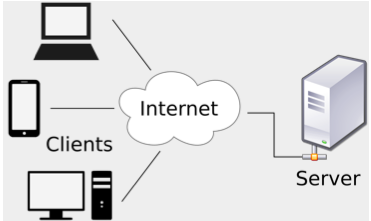
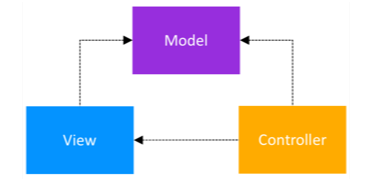
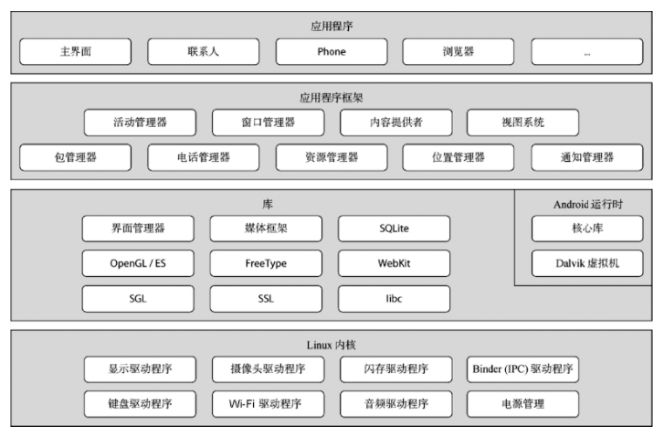
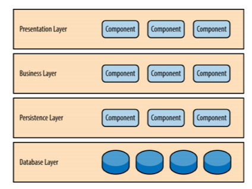
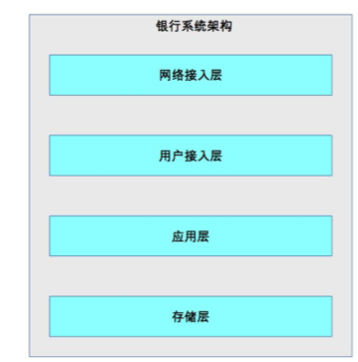
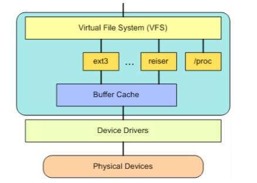
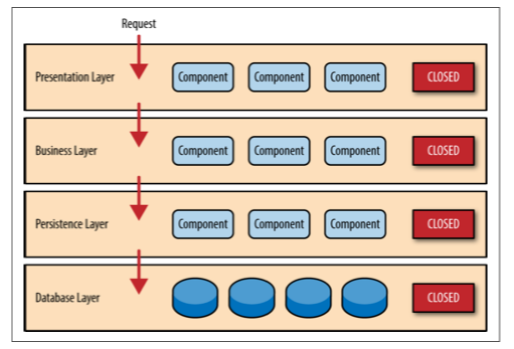
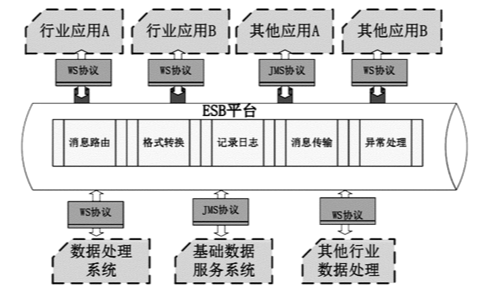

## 1. 开头  
传统的可扩展模式，包括分层架构和 SOA，主要是为了解决已存在的问题。

## 2. 分层架构  
&emsp;&emsp;分层架构是很常见的架构模式，它也叫 N 层架构，通常情况下，N 至少是 2 层。例如，C/S 架构、B/S 架构。常见的是 3 层架构（例如，MVC、MVP 架构）、4 层架构，5 层架构的比较少见，一般是比较复杂的系统才会达到或者超过 5 层，比如操作系统内核架构。  
&emsp;&emsp;按照分层架构进行设计时，根据不同的划分维度和对象，可以得到多种不同的分层架构。       
### 2.1. 分层维度
 * C/S 架构、B/S 架构    
&emsp;&emsp;划分的对象是整个业务系统，划分的维度是用户交互，即将和用户交互的部分独立为一层，支撑用户交互的后台作为另外一层。例如，下面是 C/S 架构结构图  

 * MVC 架构、MVP 架构  
  划分的对象是单个业务子系统，划分的维度是职责，将不同的职责划分到独立层，但各层的依赖关系比较灵活。例如，MVC 架构中各层之间是两两交互的  
  

 * 逻辑分层架构  
   划分的对象可以是单个业务子系统，也可以是整个业务系统，划分的维度也是职责。虽然都是基于职责划分，但逻辑分层架构和 MVC 架构、MVP 架构的不同点在于，逻辑分层架构中的层是自顶向下依赖的。典型的有操作系统内核架构、TCP/IP 架构。
   * Android 操作系统逻辑分层架构图。
     
   * J2EE 系统架构也是逻辑分层架构   
      
   * 业务系统逻辑分层  
       

### 2.2. 分层架构的特点  
&emsp;&emsp;无论采取何种分层维度，分层架构设计最核心的一点就是需要保证各层之间的差异足够清晰，边界足够明显，让人看到架构图后就能看懂整个架构，这也是分层不能分太多层的原因。否则如果两个层的差异不明显，就会出现程序员小明认为某个功能应该放在 A 层，而程序员老王却认为同样的功能应该放在 B 层，这样会导致分层混乱。如果这样的架构进入实际开发落地，则 A 层和 B 层就会乱成一锅粥，也就失去了分层的意义  
&emsp;&emsp;分层架构之所以能够较好地支撑系统扩展，本质在于隔离关注点（separation of concerns），即每个层中的组件只会处理本层的逻辑。比如说，展示层只需要处理展示逻辑，业务层中只需要处理业务逻辑，这样我们在扩展某层时，其他层是不受影响的，通过这种方式可以支撑系统在某层上快速扩展。例如，Linux 内核如果要增加一个新的文件系统，则只需要修改文件存储层即可，其他内核层无须变动。  
&emsp;&emsp;当然，并不是简单地分层就一定能够实现隔离关注点从而支撑快速扩展，分层时要保证层与层之间的依赖是稳定的，才能真正支撑快速扩展。例如，Linux 内核为了支撑不同的文件系统格式，抽象了 VFS 文件系统接口，架构图如下:  
  
&emsp;&emsp;如果没有 VFS，只是简单地将 ext2、ext3、reiser 等文件系统划为“文件系统层”，那么这个分层是达不到支撑可扩展的目的的。因为增加一个新的文件系统后，所有基于文件系统的功能都要适配新的文件系统接口；而有了 VFS 后，只需要 VFS 适配新的文件系统接口，其他基于文件系统的功能是依赖 VFS 的，不会受到影响。  
&emsp;&emsp;对于操作系统这类复杂的系统，接口本身也可以成为独立的一层。例如，我们把 VFS 独立为一层是完全可以的。而对于一个简单的业务系统，接口可能就是 Java 语言上的几个 interface 定义，这种情况下如果独立为一层，看起来可能就比较重了。例如，经典的 J2EE 分层架构中，Presentation Layer 和 Business Layer 之间如果硬要拆分一个独立的接口层，则显得有点多余了。  
&emsp;&emsp;分层结构的另外一个特点就是层层传递，也就是说一旦分层确定，整个业务流程是按照层进行依次传递的，不能在层之间进行跳跃。最简单的 C/S 结构，用户必须先使用 C 层，然后 C 层再传递到 S 层，用户是不能直接访问 S 层的。传统的 J2EE 4 层架构，收到请求后，必须按照下面的方式传递请求：  
    
&emsp;&emsp;分层结构的这种约束，好处在于强制将分层依赖限定为两两依赖，降低了整体系统复杂度。例如，Business Layer 被 Presentation Layer 依赖，自己只依赖 Persistence Layer。但分层结构的代价就是冗余，也就是说，不管这个业务有多么简单，每层都必须要参与处理，甚至可能每层都写了一个简单的包装函数。我以用户管理系统最简单的一个功能“查看头像”为例。查看头像功能的实现很简单，只是显示一张图片而已，但按照分层分册架构来实现，每层都要写一个简单的函数。   
&emsp;&emsp;我们是否应该自由选择是否绕过分层的约束呢？例如，“查看头像”的示例中，直接让 AvatarView 类访问 AvatarDao 类，不就可以减少 AvatarBizz 的冗余实现了吗？  
&emsp;&emsp;不建议这样做，分层架构的优势就体现在通过分层强制约束两两依赖，一旦自由选择绕过分层，时间一长，架构就会变得混乱。例如，Presentation Layer 直接访问 Persistence Layer，Business Layer 直接访问 Database Layer，这样做就失去了分层架构的意义，也导致后续扩展时无法控制受影响范围，牵一发动全身，无法支持快速扩展。除此以外，虽然分层架构的实现在某些场景下看起来有些啰嗦和冗余，但复杂度却很低。例如，样例中 AvatarBizz 的 getAvatarUrl 方法，实现起来很简单，不会增加太多工作量。  
&emsp;&emsp;分层架构另外一个典型的缺点就是性能，因为每一次业务请求都需要穿越所有的架构分层，有一些事情是多余的，多少都会有一些性能的浪费。当然，这里所谓的性能缺点只是理论上的分析，实际上分层带来的性能损失，如果放到 20 世纪 80 年代，可能很明显；但到了现在，硬件和网络的性能有了质的飞越，其实分层模式理论上的这点性能损失，在实际应用中，绝大部分场景下都可以忽略不计

## 3. SOA  
&emsp;&emsp;SOA 的全称是 Service Oriented Architecture，中文翻译为“面向服务的架构”，诞生于上世纪 90 年代，1996 年 Gartner 的两位分析师 Roy W. Schulte 和 Yefim V. Natis 发表了第一个 SOA 的报告。  
&emsp;&emsp;2005 年，Gartner 预言：到了 2008 年，SOA 将成为 80% 的开发项目的基础（https://www.safaribooksonline.com/library/view/soa-in-practice/9780596529550/ch01s04.html）。历史证明这个预言并不十分靠谱，SOA 虽然在很多企业成功推广，但没有达到占有绝对优势的地步。SOA 更多是在传统企业（例如，制造业、金融业等）落地和推广，在互联网行业并没有大规模地实践和推广。互联网行业推行 SOA 最早的应该是亚马逊，得益于杰弗·贝索斯的远见卓识，亚马逊内部的系统都以服务的方式构造，间接地促使了后来的亚马逊云计算技术的出现。  
### 3.1. SOA产生的背景  
* 企业各部门有独立的 IT 系统，比如人力资源系统、财务系统、销售系统，这些系统可能都涉及人员管理，各 IT 系统都需要重复开发人员管理的功能。例如，某个员工离职后，需要分别到上述三个系统中删除员工的权限。
* 各个独立的 IT 系统可能采购于不同的供应商，实现技术不同，企业自己也不太可能基于这些系统进行重构。
* 随着业务的发展，复杂度越来越高，更多的流程和业务需要多个 IT 系统合作完成。由于各个独立的 IT 系统没有标准的实现方式（例如，人力资源系统用 Java 开发，对外提供 RPC；而财务系统用 C# 开发，对外提供 SOAP 协议），每次开发新的流程和业务，都需要协调大量的 IT 系统，同时定制开发，效率很低。

### 3.2. SOA关键概念

#### 3.2.1. 服务  
&emsp;&emsp;所有业务功能都是一项服务，服务就意味着要对外提供开放的能力，当其他系统需要使用这项功能时，无须定制化开发。  
&emsp;&emsp;服务可大可小，可简单也可复杂。例如，人力资源管理可以是一项服务，包括人员基本信息管理、请假管理、组织结构管理等功能；而人员基本信息管理也可以作为一项独立的服务，组织结构管理也可以作为一项独立的服务。到底是划分为粗粒度的服务，还是划分为细粒度的服务，需要根据企业的实际情况进行判断  

#### 3.2.2. ESB
ESB 的全称是 Enterprise Service Bus，中文翻译为“企业服务总线”。从名字就可以看出，ESB 参考了计算机总线的概念。计算机中的总线将各个不同的设备连接在一起，ESB 将企业中各个不同的服务连接在一起。因为各个独立的服务是异构的，如果没有统一的标准，则各个异构系统对外提供的接口是各式各样的。SOA 使用 ESB 来屏蔽异构系统对外提供各种不同的接口方式，以此来达到服务间高效的互联互通。  

#### 3.2.3. 松耦合  
&emsp;&emsp;松耦合的目的是减少各个服务间的依赖和互相影响。因为采用 SOA 架构后，各个服务是相互独立运行的，甚至都不清楚某个服务到底有多少对其他服务的依赖。如果做不到松耦合，某个服务一升级，依赖它的其他服务全部故障，这样肯定是无法满足业务需求的。  
&emsp;&emsp;但实际上真正做到松耦合并没有那么容易，要做到完全后向兼容，是一项复杂的任务。   
&emsp;&emsp;典型的 SOA 架构样例如下：  
    

### 3.3. SOA缺点  
&emsp;&emsp;SOA 架构是比较高层级的架构设计理念，一般情况下我们可以说某个企业采用了 SOA 的架构来构建 IT 系统，但不会说某个独立的系统采用了 SOA 架构。例如，某企业采用 SOA 架构，将系统分为“人力资源管理服务”“考勤服务”“财务服务”，但人力资源管理服务本身通常不会再按照 SOA 的架构拆分更多服务，也不会再使用独立的一套 ESB，因为这些系统本身可能就是采购的，ESB 本身也是采购的，如果人力资源系统本身重构为多个子服务，再部署独立的 ESB 系统，成本很高，也没有什么收益。  
&emsp;&emsp;SOA 解决了传统 IT 系统重复建设和扩展效率低的问题，但其本身也引入了更多的复杂性。SOA 最广为人诟病的就是 ESB，ESB 需要实现与各种系统间的协议转换、数据转换、透明的动态路由等功能。例如，下图中 ESB 将 JSON 转换为 Java（摘自《Microservices vs. Service-Oriented Architecture》）    
    
    

&emsp;&emsp;ESB 虽然功能强大，但现实中的协议有很多种，如 JMS、WS、HTTP、RPC 等，数据格式也有很多种，如 XML、JSON、二进制、HTML 等。ESB 要完成这么多协议和数据格式的互相转换，工作量和复杂度都很大，而且这种转换是需要耗费大量计算性能的，当 ESB 承载的消息太多时，ESB 本身会成为整个系统的性能瓶颈。  
&emsp;&emsp;当然，SOA 的 ESB 设计也是无奈之举。回想一下 SOA 的提出背景就可以发现，企业在应用 SOA 时，各种异构的 IT 系统都已经存在很多年了，完全重写或者按照统一标准进行改造的成本是非常大的，只能通过 ESB 方式去适配已经存在的各种异构系统

## 4. 总结  
SOA是把多个系统整合，而微服务是把单个系统拆开来，方向正好相反。SOA是解决服务孤岛打通链条，是无奈之举。esb集中化的管理带来了性能不佳，厚重等问题。也无法快速扩展。不适合互联网的业务特点
