## 1. 开头  
&emsp;&emsp;由于微服务的理念中也包含了“服务”的概念，而 SOA 中也有“服务”的概念，我们自然而然地会提出疑问：微服务与 SOA 有什么关系？有什么区别？为何有了 SOA 还要提微服务？这几个问题是理解微服务的关键，否则如果只是跟风拿来就用，既不会用，也用不好，用了不但没有效果，反而还可能有副作用。  

## 2. 微服务与SOA  
### 2.1. 微服务与SOA区别的观点  
&emsp;&emsp;对于了解过 SOA 的人来说，第一次看到微服务这个概念肯定会有所疑惑：为何有了 SOA 还要提微服务呢？等到简单看完微服务的介绍后，可能很多人更困惑了：这不就是 SOA 吗？  关于 SOA 和微服务的关系和区别，大概分为下面几个典型的观点:    
* 微服务是 SOA 的实现方式    
  &emsp;&emsp;如下图所示，这种观点认为 SOA 是一种架构理念，而微服务是 SOA 理念的一种具体实现方法。例如，“微服务就是使用 HTTP RESTful 协议来实现 ESB 的 SOA”“使用 SOA 来构建单个系统就是微服务”和“微服务就是更细粒度的 SOA”  
  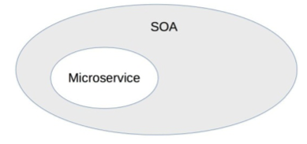
* 微服务是去掉 ESB 后的 SOA  
  &emsp;&emsp;如下图所示，这种观点认为传统 SOA 架构最广为人诟病的就是庞大、复杂、低效的 ESB，因此将 ESB 去掉，改为轻量级的 HTTP 实现，就是微服务  
  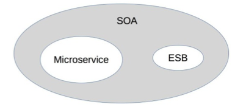    
* 微服务是一种和 SOA 相似但本质上不同的架构理念     
  &emsp;&emsp;如下图所示，这种观点认为微服务和 SOA 只是有点类似，但本质上是不同的架构设计理念。相似点在于下图中交叉的地方，就是两者都关注“服务”，都是通过服务的拆分来解决可扩展性问题。本质上不同的地方在于几个核心理念的差异：是否有 ESB、服务的粒度、架构设计的目标等。    
  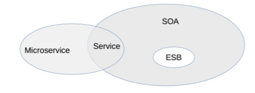
### 2.2. 准确的区别    
单纯从概念上是难以分辨的，我来对比一下 SOA 和微服务的一些具体做法，再来看看到底哪一种观点更加符合实际情况。 其实是第三种才服务情况，即微服务是一种和 SOA 相似但本质上不同的架构理念  
* 服务粒度  
  整体上来说，SOA 的服务粒度要粗一些，而微服务的服务粒度要细一些。例如，对一个大型企业来说，“员工管理系统”就是一个 SOA 架构中的服务；而如果采用微服务架构，则“员工管理系统”会被拆分为更多的服务，比如“员工信息管理”“员工考勤管理”“员工假期管理”和“员工福利管理”等更多服务
* 服务通信  
  SOA 采用了 ESB 作为服务间通信的关键组件，负责服务定义、服务路由、消息转换、消息传递，总体上是重量级的实现。微服务推荐使用统一的协议和格式，例如，RESTful 协议、RPC 协议，无须 ESB 这样的重量级实现。Martin Fowler 将微服务架构的服务通讯理念称为“Smart endpoints and dumb pipes”，简单翻译为“聪明的终端，愚蠢的管道”。之所以用“愚蠢”二字，其实就是与 ESB 对比的，因为 ESB 太强大了，既知道每个服务的协议类型（例如，是 RMI 还是 HTTP），又知道每个服务的数据类型（例如，是 XML 还是 JSON），还知道每个数据的格式（例如，是 2017-01-01 还是 01/01/2017），而微服务的“dumb pipes”仅仅做消息传递，对消息格式和内容一无所知
* 服务交付  
  SOA 对服务的交付并没有特殊要求，因为 SOA 更多考虑的是兼容已有的系统；微服务的架构理念要求“快速交付”，相应地要求采取自动化测试、持续集成、自动化部署等敏捷开发相关的最佳实践。如果没有这些基础能力支撑，微服务规模一旦变大（例如，超过 20 个微服务），整体就难以达到快速交付的要求，这也是很多企业在实行微服务时踩过的一个明显的坑，就是系统拆分为微服务后，部署的成本呈指数上升
* 应用场景  
  SOA 更加适合于庞大、复杂、异构的企业级系统，这也是 SOA 诞生的背景。这类系统的典型特征就是很多系统已经发展多年，采用不同的企业级技术，有的是内部开发的，有的是外部购买的，无法完全推倒重来或者进行大规模的优化和重构。因为成本和影响太大，只能采用兼容的方式进行处理，而承担兼容任务的就是 ESB。  
  微服务更加适合于快速、轻量级、基于 Web 的互联网系统，这类系统业务变化快，需要快速尝试、快速交付；同时基本都是基于 Web，虽然开发技术可能差异很大（例如，Java、C++、.NET 等），但对外接口基本都是提供 HTTP RESTful 风格的接口，无须考虑在接口层进行类似 SOA 的 ESB 那样的处理  

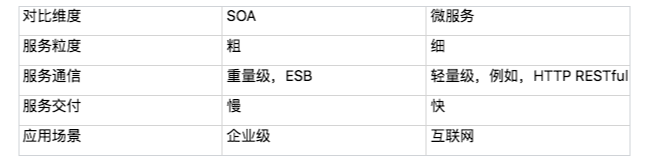  

&emsp;&emsp;SOA 和微服务本质上是两种不同的架构设计理念，只是在“服务”这个点上有交集而已，因此两者的关系应该是上面第三种观点.  
&emsp;&emsp;SOA 和微服务是两种不同理念的架构模式，并不存在孰优孰劣，只是应用场景不同而已。我们介绍 SOA 时候提到其产生历史背景是因为企业的 IT 服务系统庞大而又复杂，改造成本很高，但业务上又要求其互通，因此才会提出 SOA 这种解决方案。如果我们将微服务的架构模式生搬硬套到企业级 IT 服务系统中，这些 IT 服务系统的改造成本可能远远超出实施 SOA 的成本

### 2.3. 微服务架构缺点 
&emsp;&emsp;单纯从上面的对比来看，似乎微服务大大优于 SOA，这也导致了很多团队在实践时不加思考地采用微服务——既不考虑团队的规模，也不考虑业务的发展，也没有考虑基础技术的支撑，只是觉得微服务很牛就赶紧来实施，以为实施了微服务后就什么问题都解决了，而一旦真正实施后才发现掉到微服务的坑里面去了。  
我们看一下微服务具体有哪些坑：  
* 服务划分过细，服务间关系复杂  
  服务划分过细，单个服务的复杂度确实下降了，但整个系统的复杂度却上升了，因为微服务将系统内的复杂度转移为系统间的复杂度了。  
  从理论的角度来计算，n 个服务的复杂度是 n×(n-1)/2，整体系统的复杂度是随着微服务数量的增加呈指数级增加的。下图形象了说明了整体复杂度。  
  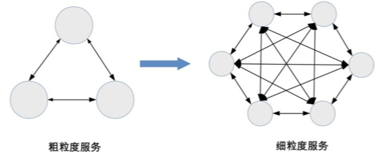    
  粗粒度划分服务时，系统被划分为 3 个服务，虽然单个服务较大，但服务间的关系很简单；细粒度划分服务时，虽然单个服务小了一些，但服务间的关系却复杂了很多。
* 服务数量太多，团队效率急剧下降  
  微服务的“微”字，本身就是一个陷阱，很多团队看到“微”字后，就想到必须将服务拆分得很细，有的团队人员规模是 5 ~ 6 个人，然而却拆分出 30 多个微服务，平均每个人要维护 5 个以上的微服务。  
  这样做给工作效率带来了明显的影响，一个简单的需求开发就需要涉及多个微服务，光是微服务之间的接口就有 6 ~ 7 个，无论是设计、开发、测试、部署，都需要工程师不停地在不同的服务间切换  
  * 开发工程师要设计多个接口，打开多个工程，调试时要部署多个程序，提测时打多个包。
  * 测试工程师要部署多个环境，准备多个微服务的数据，测试多个接口。
  * 运维工程师每次上线都要操作多个微服务，并且微服务之间可能还有依赖关系  

* 调用链太长，性能下降  
  &emsp;&emsp;由于微服务之间都是通过 HTTP 或者 RPC 调用的，每次调用必须经过网络。一般线上的业务接口之间的调用，平均响应时间大约为 50 毫秒，如果用户的一起请求需要经过 6 次微服务调用，则性能消耗就是 300 毫秒，这在很多高性能业务场景下是难以满足需求的。为了支撑业务请求，可能需要大幅增加硬件，这就导致了硬件成本的大幅上升。    

* 调用链太长，问题定位困难  
  &emsp;&emsp;系统拆分为微服务后，一次用户请求需要多个微服务协同处理，任意微服务的故障都将导致整个业务失败。然而由于微服务数量较多，且故障存在扩散现象，快速定位到底是哪个微服务故障是一件复杂的事情。下面是一个典型样例  
  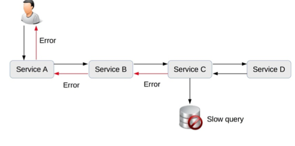    
  &emsp;&emsp;Service C 的数据库出现慢查询，导致 Service C 给 Service B 的响应错误，Service B 给 Service A 的响应错误，Service A 给用户的响应错误。我们在实际定位时是不会有样例图中这么清晰的，最开始是用户报错，这时我们首先会去查 Service A。导致 Service A 故障的原因有很多，我们可能要花半个小时甚至 1 个小时才能发现是 Service B 返回错误导致的。于是我们又去查 Service B，这相当于重复 Service A 故障定位的步骤……如此循环下去，最后可能花费了几个小时才能定位到是 Service C 的数据库慢查询导致了错误。  
  如果多个微服务同时发生不同类型的故障，则定位故障更加复杂，如下图所示:   
  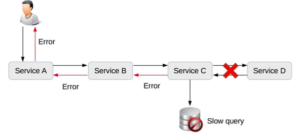    
  &emsp;&emsp;Service C 的数据库发生慢查询故障，同时 Service C 到 Service D 的网络出现故障，此时到底是哪个原因导致了 Service C 返回 Error 给 Service B，需要大量的信息和人力去排查
* 没有自动化支撑，无法快速交付   
  * 没有自动化测试支撑，每次测试时需要测试大量接口。
  * 没有自动化部署支撑，每次部署 6 ~ 7 个服务，几十台机器，运维人员敲 shell 命令逐台部署，手都要敲麻。
  * 没有自动化监控，每次故障定位都需要人工查几十台机器几百个微服务的各种状态和各种日志文件    

* 没有服务治理，微服务数量多了后管理混乱  
  信奉微服务理念的设计人员总是强调微服务的 lightweight 特性，并举出 ESB 的反例来证明微服务的优越之处。但具体实践后就会发现，随着微服务种类和数量越来越多，如果没有服务治理系统进行支撑，微服务提倡的 lightweight 就会变成问题。主要问题有：  
  * 服务路由：假设某个微服务有 60 个节点，部署在 20 台机器上，那么其他依赖的微服务如何知道这个部署情况呢？
  * 服务故障隔离：假设上述例子中的 60 个节点有 5 个节点发生故障了，依赖的微服务如何处理这种情况呢？
  * 服务注册和发现：同样是上述的例子，现在我们决定从 60 个节点扩容到 80 个节点，或者将 60 个节点缩减为 40 个节点，新增或者减少的节点如何让依赖的服务知道呢？

&emsp;&emsp;如果以上场景都依赖人工去管理，整个系统将陷入一片混乱，最终的解决方案必须依赖自动化的服务管理系统，这时就会发现，微服务所推崇的“lightweight”，最终也发展成和 ESB 几乎一样的复杂程度  

### 2.4. 小结    
微服务架构其实相当复杂，我是分成好几个阶段理解： 
* 第一阶段，微服务架构就是去掉了ESB的SOA架构，只不过是通信的方式和结构变了。对于初级的使用者而言，这样理解没有太大问题。
* 第二阶段，没有了ESB，原本很多由ESB组件做的事儿，转到服务的提供者和调用者这里了。他们需要考虑服务的拆分粒。大体仍然算是SOA架构
* 第三阶段，随着服务的数量大幅增加，服务的管理越来越困难，此时DevOps出现了。这个阶段的微服务架构，已经是跟SOA架构完全不同的东西了  

传统架构，转向微服务架构的经验：    
* 建设好基础设施，RPC、服务治理、日志、监控、持续集成、持续部署、运维自动化是基本的，其它包括服务编排、分布式追踪等
* 要逐步演进和迭代，不要过于激进，更不要拆分过细，拆分的粒度，要与团队的架构相互匹配
* 微服务与数据库方面，是个很大的难点，可以深入了解下领域驱动设计，做好领域建模，特别是数据库要随着服务一起拆分
* 微服务不是各种拆分，不是不顾一切地拆分

## 3. 微服务拆分方法  
上面我们知道微服务有那么多的缺点：   
* 微服务拆分过细，过分强调“small”。
* 微服务基础设施不健全，忽略了“automated”。
* 微服务并不轻量级，规模大了后，“lightweight”不再适应。   

为了更好的将微服务运用到实际系统之中，我们需要从三个角度进行思考：  
* 服务粒度
* 拆分方法
* 基础设施  

### 3.1. 服务粒度   
&emsp;&emsp;针对微服务拆分过细导致的问题，我建议基于团队规模进行拆分，类似贝索斯在定义团队规模时提出的“两个披萨”理论（每个团队的人数不能多到两张披萨都不够吃的地步），分享一个我认为微服务拆分粒度的“三个火枪手”原则，即一个微服务三个人负责开发。当我们在实施微服务架构时，根据团队规模来划分微服务数量，如果业务规继续发展，团队规模扩大，我们再将已有的微服务进行拆分。例如，团队最初有 6 个人，那么可以划分为 2 个微服务，随着业务的发展，业务功能越来越多，逻辑越来越复杂，团队扩展到 12 个人，那么我们可以将已有的 2 个微服务进行拆分，变成 4 个微服务。  
&emsp;&emsp;为什么是 3 个人，不是 4 个，也不是 2 个呢？  
&emsp;&emsp;首先，从系统规模来讲，3 个人负责开发一个系统，系统的复杂度刚好达到每个人都能全面理解整个系统，又能够进行分工的粒度；如果是 2 个人开发一个系统，系统的复杂度不够，开发人员可能觉得无法体现自己的技术实力；如果是 4 个甚至更多人开发一个系统，系统复杂度又会无法让开发人员对系统的细节都了解很深。  
&emsp;&emsp;其次，从团队管理来说，3 个人可以形成一个稳定的备份，即使 1 个人休假或者调配到其他系统，剩余 2 个人还可以支撑；如果是 2 个人，抽调 1 个后剩余的 1 个人压力很大；如果是 1 个人，这就是单点了，团队没有备份，某些情况下是很危险的，假如这个人休假了，系统出问题了怎么办？  
&emsp;&emsp;最后，从技术提升的角度来讲，3 个人的技术小组既能够形成有效的讨论，又能够快速达成一致意见；如果是 2 个人，可能会出现互相坚持自己的意见，或者 2 个人经验都不足导致设计缺陷；如果是 1 个人，由于没有人跟他进行技术讨论，很可能陷入思维盲区导致重大问题；如果是 4 个人或者更多，可能有的参与的人员并没有认真参与，只是完成任务而已。  
&emsp;&emsp;“三个火枪手”的原则主要应用于微服务设计和开发阶段，如果微服务经过一段时间发展后已经比较稳定，处于维护期了，无须太多的开发，那么平均 1 个人维护 1 个微服务甚至几个微服务都可以。当然考虑到人员备份问题，每个微服务最好都安排 2 个人维护，每个人都可以维护多个微服务  

### 3.2. 拆分方法  
基于“三个火枪手”的理论，我们可以计算出拆分后合适的服务数量，但具体怎么拆也是有技巧的，并不是快刀砍乱麻随便拆分成指定数量的微服务就可以了，也不是只能按照业务来进行拆分，而是可以根据目的的不同灵活地选取不同的拆分方式。接下来我一一介绍常见的拆分方式。  
*  基于业务逻辑拆分  
  &emsp;&emsp;这是最常见的一种拆分方式，将系统中的业务模块按照职责范围识别出来，每个单独的业务模块拆分为一个独立的服务。  
  &emsp;&emsp;基于业务逻辑拆分虽然看起来很直观，但在实践过程中最常见的一个问题就是团队成员对于“职责范围”的理解差异很大，经常会出现争论，难以达成一致意见。例如：假设我们做一个电商系统，第一种方式是将服务划分为“商品”“交易”“用户”3 个服务，第二种方式是划分为“商品”“订单”“支付”“发货”“买家”“卖家”6 个服务，哪种方式更合理，是不是划分越细越正确？  
  &emsp;&emsp;导致这种困惑的主要根因在于从业务的角度来拆分的话，规模粗和规模细都没有问题，因为拆分基础都是业务逻辑，要判断拆分粒度，不能从业务逻辑角度，而要根据前面介绍的“三个火枪手”的原则，计算一下大概的服务数量范围，然后再确定合适的“职责范围”，否则就可能出现划分过粗或者过细的情况，而且大部分情况下会出现过细的情况。  
  &emsp;&emsp;例如：如果团队规模是 10 个人支撑业务，按照“三个火枪手”规则计算，大约需要划分为 4 个服务，那么“登录、注册、用户信息管理”都可以划到“用户服务”职责范围内；如果团队规模是 100 人支撑业务，服务数量可以达到 40 个，那么“用户登录“就是一个服务了；如果团队规模达到 1000 人支撑业务，那“用户连接管理”可能就是一个独立的服务了。
* 基于可扩展拆分  
  &emsp;&emsp;将系统中的业务模块按照稳定性排序，将已经成熟和改动不大的服务拆分为稳定服务，将经常变化和迭代的服务拆分为变动服务。稳定的服务粒度可以粗一些，即使逻辑上没有强关联的服务，也可以放在同一个子系统中，例如将“日志服务”和“升级服务”放在同一个子系统中；不稳定的服务粒度可以细一些，但也不要太细，始终记住要控制服务的总数量。  
  &emsp;&emsp;这样拆分主要是为了提升项目快速迭代的效率，避免在开发的时候，不小心影响了已有的成熟功能导致线上问题。
* 基于可靠性拆分  
  将系统中的业务模块按照优先级排序，将可靠性要求高的核心服务和可靠性要求低的非核心服务拆分开来，然后重点保证核心服务的高可用。具体拆分的时候，核心服务可以是一个也可以是多个，只要最终的服务数量满足“三个火枪手”的原则就可以。  
  这样拆分带来下面几个好处：  
  * 避免非核心服务故障影响核心服务  
    例如，日志上报一般都属于非核心服务，但是在某些场景下可能有大量的日志上报，如果系统没有拆分，那么日志上报可能导致核心服务故障；拆分后即使日志上报有问题，也不会影响核心服务。  
  * 核心服务高可用方案可以更简单  
    核心服务的功能逻辑更加简单，存储的数据可能更少，用到的组件也会更少，设计高可用方案大部分情况下要比不拆分简单很多。
  * 能够降低高可用成本  
    将核心服务拆分出来后，核心服务占用的机器、带宽等资源比不拆分要少很多。因此，只针对核心服务做高可用方案，机器、带宽等成本比不拆分要节省较多  

* 基于性能拆分  
  &emsp;&emsp;基于性能拆分和基于可靠性拆分类似，将性能要求高或者性能压力大的模块拆分出来，避免性能压力大的服务影响其他服务。常见的拆分方式和具体的性能瓶颈有关，可以拆分 Web 服务、数据库、缓存等。例如电商的抢购，性能压力最大的是入口的排队功能，可以将排队功能独立为一个服务。  
  &emsp;&emsp;以上几种拆分方式不是多选一，而是可以根据实际情况自由排列组合，例如可以基于可靠性拆分出服务 A，基于性能拆分出服务 B，基于可扩展拆分出 C/D/F 三个服务，加上原有的服务 X，最后总共拆分出 6 个服务（A/B/C/D/F/X）  

### 3.3. 基础设施  
&emsp;&emsp;大部分人主要关注的是微服务的“small”和“lightweight”特性，但实际上真正决定微服务成败的，恰恰是那个被大部分人都忽略的“automated”。为何这样说呢？因为服务粒度即使划分不合理，实际落地后如果团队遇到麻烦，自然会想到拆服务或者合服务；如果“automated”相关的基础设施不健全，那微服务就是焦油坑，让研发、测试、运维陷入我上一期讲的各种微服务陷阱中。    
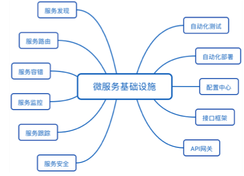    
&emsp;&emsp;微服务并不是很多人认为的那样又简单又轻量级。要做好微服务，这些基础设施都是必不可少的，否则微服务就会变成一个焦油坑，让业务和团队在里面不断挣扎且无法自拔。因此也可以说，微服务并没有减少复杂度，而只是将复杂度从 ESB 转移到了基础设施。你可以看到，“服务发现”“服务路由”等其实都是 ESB 的功能，只是在微服务中剥离出来成了独立的基础系统。  
&emsp;&emsp;虽然建设完善的微服务基础设施是一项庞大的工程，但也不用太过灰心，认为自己团队小或者公司规模不大就不能实施微服务了。第一个原因是已经有开源的微服务基础设施全家桶了，例如大名鼎鼎的 Spring Cloud 项目，涵盖了服务发现、服务路由、网关、配置中心等功能；第二个原因是如果微服务的数量并不是很多的话，并不是每个基础设施都是必须的。  
通常情况下，我建议按照下面优先级来搭建基础设施:    
* 服务发现、服务路由、服务容错：这是最基本的微服务基础设施。
* 接口框架、API 网关：主要是为了提升开发效率，接口框架是提升内部服务的开发效率，API 网关是为了提升与外部服务对接的效率。
* 自动化部署、自动化测试、配置中心：主要是为了提升测试和运维效率。
* 服务监控、服务跟踪、服务安全：主要是为了进一步提升运维效率。
* 以上 3 和 4 两类基础设施，其重要性会随着微服务节点数量增加而越来越重要，但在微服务节点数量较少的时候，可以通过人工的方式支撑，虽然效率不高，但也基本能够顶住    

### 3.4. 小结  
如果我们对于一个校验系统进行微服务改造，思路可按照如下：  
* 实施微服务按业务职责划分后，对应模块的数据库也必须要独立  
* 每个微服务项目需要拆分出数据库
* 团队开发时的问题，由于每小团队负责一个微服务，但开发时需要访问其他微服务，应该有个开发环境负责集成大家提交的代码，构建新版本供其他团队调用和调试；  

  
## 4. 微服务基础设施  
&emsp;&emsp;每项微服务基础设施都是一个平台、一个系统、一个解决方案，如果要自己实现，其过程和做业务系统类似，都需要经过需求分析、架构设计、开发、测试、部署上线等步骤，专栏里我来简单介绍一下每个基础设施的主要作用。  
这里主要来分析下主要的微服务基础设施。

### 4.1. 自动化测试    
&emsp;&emsp;微服务将原本大一统的系统拆分为多个独立运行的“微”服务，微服务之间的接口数量大大增加，并且微服务提倡快速交付，版本周期短，版本更新频繁。如果每次更新都靠人工回归整个系统，则工作量大，效率低下，达不到“快速交付”的目的，因此必须通过自动化测试系统来完成绝大部分测试回归的工作。    
&emsp;&emsp;自动化测试涵盖的范围包括代码级的单元测试、单个系统级的集成测试、系统间的接口测试，理想情况是每类测试都自动化。如果因为团队规模和人力的原因无法全面覆盖，至少要做到接口测试自动化

### 4.2. 自动化部署  
&emsp;&emsp;相比大一统的系统，微服务需要部署的节点增加了几倍甚至十几倍，微服务部署的频率也会大幅提升（例如，我们的业务系统 70% 的工作日都有部署操作），综合计算下来，微服务部署的次数是大一统系统部署次数的几十倍。这么大量的部署操作，如果继续采用人工手工处理，需要投入大量的人力，且容易出错，因此需要自动化部署的系统来完成部署操作。  
&emsp;&emsp;自动化部署系统包括版本管理、资源管理（例如，机器管理、虚拟机管理）、部署操作、回退操作等功能。

### 4.3. 配置中心  
&emsp;&emsp;微服务的节点数量非常多，通过人工登录每台机器手工修改，效率低，容易出错。特别是在部署或者排障时，需要快速增删改查配置，人工操作的方式显然是不行的。除此以外，有的运行期配置需要动态修改并且所有节点即时生效，人工操作是无法做到的。综合上面的分析，微服务需要一个统一的配置中心来管理所有微服务节点的配置。  
&emsp;&emsp;配置中心包括配置版本管理（例如，同样的微服务，有 10 个节点是给移动用户服务的，有 20 个节点给联通用户服务的，配置项都一样，配置值不一样）、增删改查配置、节点管理、配置同步、配置推送等功能  

### 4.4. 接口框架  
&emsp;&emsp;微服务提倡轻量级的通信方式，一般采用 HTTP/REST 或者 RPC 方式统一接口协议。但在实践过程中，光统一接口协议还不够，还需要统一接口传递的数据格式。例如，我们需要指定接口协议为 HTTP/REST，但这还不够，还需要指定 HTTP/REST 的数据格式采用 JSON，并且 JSON 的数据都遵循如下规范 :  
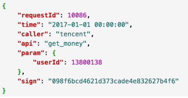  
&emsp;&emsp;如果我们只是简单指定了 HTTP/REST 协议，而不指定 JSON 和 JSON 的数据规范，那么就会出现这样混乱的情况：有的微服务采用 XML，有的采用 JSON，有的采用键值对；即使同样都是 JSON，JSON 数据格式也不一样。这样每个微服务都要适配几套甚至几十套接口协议，相当于把曾经由 ESB 做的事情转交给微服务自己做了，这样做的效率显然是无法接受的，因此需要统一接口框架。  
&emsp;&emsp;接口框架不是一个可运行的系统，一般以库或者包的形式提供给所有微服务调用。例如，针对上面的 JSON 样例，可以由某个基础技术团队提供多种不同语言的解析包（Java 包、Python 包、C 库等）。

### 4.5. API 网关  
&emsp;&emsp;系统拆分为微服务后，内部的微服务之间是互联互通的，相互之间的访问都是点对点的。如果外部系统想调用系统的某个功能，也采取点对点的方式，则外部系统会非常“头大”。因为在外部系统看来，它不需要也没办法理解这么多微服务的职责分工和边界，它只会关注它需要的能力，而不会关注这个能力应该由哪个微服务提供。  
&emsp;&emsp;除此以外，外部系统访问系统还涉及安全和权限相关的限制，如果外部系统直接访问某个微服务，则意味着每个微服务都要自己实现安全和权限的功能，这样做不但工作量大，而且都是重复工作。  
&emsp;&emsp;综合上面的分析，微服务需要一个统一的 API 网关，负责外部系统的访问操作。  
&emsp;&emsp;API 网关是外部系统访问的接口，所有的外部系统接⼊系统都需要通过 API 网关，主要包括接入鉴权（是否允许接入）、权限控制（可以访问哪些功能）、传输加密、请求路由、流量控制等功能。

### 4.6. 服务发现  
&emsp;&emsp;微服务种类和数量很多，如果这些信息全部通过手工配置的方式写入各个微服务节点，首先配置工作量很大，配置文件可能要配几百上千行，几十个节点加起来后配置项就是几万几十万行了，人工维护这么大数量的配置项是一项灾难；其次是微服务节点经常变化，可能是由于扩容导致节点增加，也可能是故障处理时隔离掉一部分节点，还可能是采用灰度升级，先将一部分节点升级到新版本，然后让新老版本同时运行。不管哪种情况，我们都希望节点的变化能够及时同步到所有其他依赖的微服务。如果采用手工配置，是不可能做到实时更改生效的。因此，需要一套服务发现的系统来支撑微服务的自动注册和发现。    
服务发现主要有两种实现方式：自理式和代理式：  
* 自理式      
  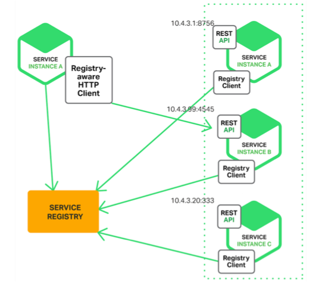     
  &emsp;&emsp;自理式结构就是指每个微服务自己完成服务发现。例如，图中 SERVICE INSTANCE A 访问 SERVICE REGISTRY 获取服务注册信息，然后直接访问 SERVICE INSTANCE B。  
  &emsp;&emsp;自理式服务发现实现比较简单，因为这部分的功能一般通过统一的程序库或者程序包提供给各个微服务调用，而不会每个微服务都自己来重复实现一遍；并且由于每个微服务都承担了服务发现的功能，访问压力分散到了各个微服务节点，性能和可用性上不存在明显的压力和风险
* 代理式    
  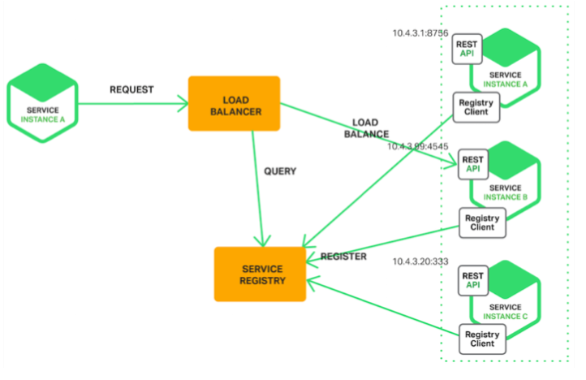   
  &emsp;&emsp;代理式结构就是指微服务之间有一个负载均衡系统（图中的 LOAD BALANCER 节点），由负载均衡系统来完成微服务之间的服务发现。  
  &emsp;&emsp;代理式的方式看起来更加清晰，微服务本身的实现也简单了很多，但实际上这个方案风险较大:  
    * 第一个风险是可用性风险，一旦 LOAD BALANCER 系统故障，就会影响所有微服务之间的调用；
    * 第二个风险是性能风险，所有的微服务之间的调用流量都要经过 LOAD BALANCER 系统，性能压力会随着微服务数量和流量增加而不断增加，最后成为性能瓶颈。因此 LOAD BALANCER 系统需要设计成集群的模式，但 LOAD BALANCER 集群的实现本身又增加了复杂性。  
  
&emsp;&emsp;不管是自理式还是代理式，服务发现的核心功能就是服务注册表，注册表记录了所有的服务节点的配置和状态，每个微服务启动后都需要将自己的信息注册到服务注册表，然后由微服务或者 LOAD BALANCER 系统到服务注册表查询可用服务。
### 4.7. 服务路由  
&emsp;&emsp;有了服务发现后，微服务之间能够方便地获取相关配置信息，但具体进行某次调用请求时，我们还需要从所有符合条件的可用微服务节点中挑选出一个具体的节点发起请求，这就是服务路由需要完成的功能。  
&emsp;&emsp;服务路由和服务发现紧密相关，服务路由一般不会设计成一个独立运行的系统，通常情况下是和服务发现放在一起实现的。对于自理式服务发现，服务路由是微服务内部实现的；对于代理式服务发现，服务路由是由 LOAD BALANCER 系统实现的。无论放在哪里实现，服务路由核心的功能就是路由算法。常见的路由算法有：随机路由、轮询路由、最小压力路由、最小连接数路由等  

### 4.8. 服务监控  
&emsp;&emsp;系统拆分为微服务后，节点数量大大增加，导致需要监控的机器、网络、进程、接口调用数等监控对象的数量大大增加；同时，一旦发生故障，我们需要快速根据各类信息来定位故障。这两个目标如果靠人力去完成是不现实的。举个简单例子：我们收到用户投诉说业务有问题，如果此时采取人工的方式去搜集、分析信息，可能把几十个节点的日志打开一遍就需要十几分钟了，因此需要服务监控系统来完成微服务节点的监控。  
&emsp;&emsp;服务监控的主要作用有：  
* 实时搜集信息并进行分析，避免故障后再来分析，减少了处理时间。
* 服务监控可以在实时分析的基础上进行预警，在问题萌芽的阶段发觉并预警，降低了问题影响的范围和时间。
* 通常情况下，服务监控需要搜集并分析大量的数据，因此建议做成独立的系统，而不要集成到服务发现、API 网关等系统中。   

### 4.9. 服务跟踪  
&emsp;&emsp;服务监控可以做到微服务节点级的监控和信息收集，但如果我们需要跟踪某一个请求在微服务中的完整路径，服务监控是难以实现的。因为如果每个服务的完整请求链信息都实时发送给服务监控系统，数据量会大到无法处理。  
&emsp;&emsp;服务监控和服务跟踪的区别可以简单概括为宏观和微观的区别。例如，A 服务通过 HTTP 协议请求 B 服务 10 次，B 通过 HTTP 返回 JSON 对象，服务监控会记录请求次数、响应时间平均值、响应时间最高值、错误码分布这些信息；而服务跟踪会记录其中某次请求的发起时间、响应时间、响应错误码、请求参数、返回的 JSON 对象等信息。  
&emsp;&emsp;目前无论是分布式跟踪还是微服务的服务跟踪，绝大部分请求跟踪的实现技术都基于 Google 的 Dapper 论文《Dapper, a Large-Scale Distributed Systems Tracing Infrastructure》。  

### 4.10. 服务安全  
&emsp;&emsp;系统拆分为微服务后，数据分散在各个微服务节点上。从系统连接的角度来说，任意微服务都可以访问所有其他微服务节点；但从业务的角度来说，部分敏感数据或者操作，只能部分微服务可以访问，而不是所有的微服务都可以访问，因此需要设计服务安全机制来保证业务和数据的安全性。  
&emsp;&emsp;服务安全主要分为三部分：接入安全、数据安全、传输安全。通常情况下，服务安全可以集成到配置中心系统中进行实现，即配置中心配置微服务的接入安全策略和数据安全策略，微服务节点从配置中心获取这些配置信息，然后在处理具体的微服务调用请求时根据安全策略进行处理。由于这些策略是通用的，一般会把策略封装成通用的库提供给各个微服务调用。基本架构如下：      
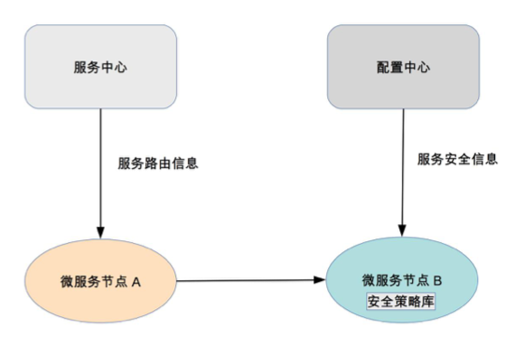
  

## 5. 微服务总结  
如果有10个人，完成所有的微服务设施的开发，可能的流程为：    
* 很明显是不可能是同时开工的，即使能够同时开工也是需要经过几轮迭代才能达到一个比较完善的状态    
* 依据简单原则和演化原则以及“三个火枪手”的人员分配原则，首先可以做API 网关、配置中心、服务发现、服务路由这4部分，经过一个月的开发+半个月的联调的先让基础框架搭建起来，业务能够运行起来
* 业务上线后，为了保证用户体验和问题跟踪，在保留一两个留守同学的情况下，开始服务容错、服务监控、服务跟踪这几部分的开发，因为这个阶段中可能还要回头修改已完成的部分让这几个部分配合的更好，联调的工作量也多了不少，这个过程大概要2.5月
* 而后随着业务逐渐增多，流量逐渐增加，为避免被黑产“薅羊毛”需要把服务安全部分给完成，同时为了快速响应新的业务需要把接口框架给完成，但此时有些同学会被已完成部分的日常维护、修bug等，这些初步需要两个月时间
* 在这里都完成后，可以开始自动化测试、自动化部署这部分，也按照两个月的时间，这样一轮下来总体需要8个月时间。
* 经过第一轮后微服务的基础实施是有了，但要真正的运作起来还需要经过几轮的迭代才可以，但此时面对老系统的维护新系统的开发整体的进度会变慢不少，这样一个合格的比较完善的微服务基础设施差不多要两年时间了。  