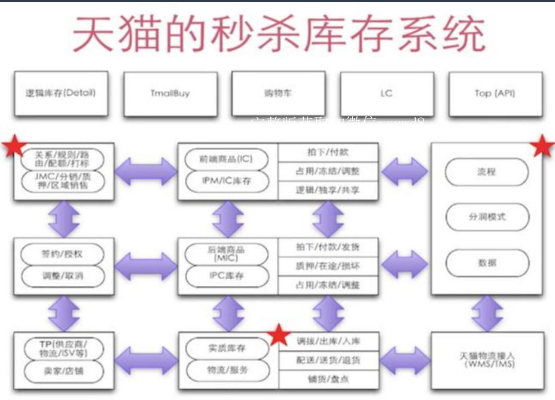
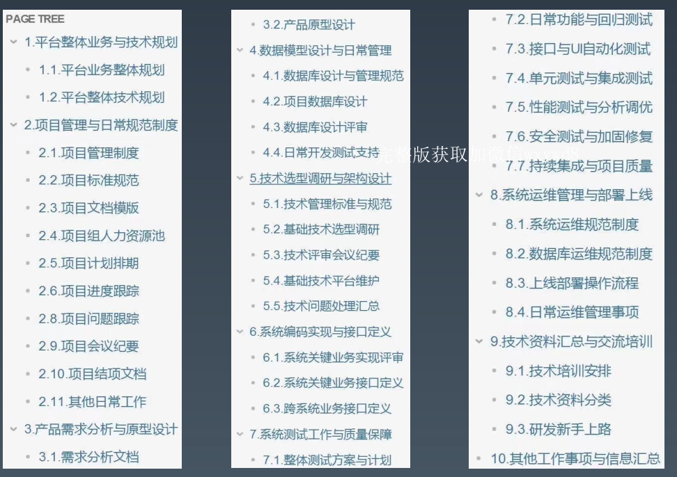

## 1. 什么是秒杀系统
1）业务角度  
一场营销促销活动，具有明确的活动业务特点  
2）技术角度  
一种主动DDos攻击，具备技术的不确定性和复杂度
## 2. 秒杀系统技术思路
### 2.1. 基本思路
* 丢弃订单，比如在前端直接随机丢订单
* 增大吞吐量，加机器，做扩容
* 队列，消息队列异步处理
* 内存预热，提前在每台机器分配库存的量，在库存里处理库存
* 流量拆分，根据业务或者其它特征，将压力分散开
* 服务降级，比如查询可以先关闭
### 2.2. 存在问题   
部分模式会导致销售不足或者超卖，销售不足可以从抢购里加一些名单补发，也可以加一轮秒杀。超卖比较麻烦，所以一般会多备一点货，比如抢100个iPhone，提前准备105个之类的，也会证明在实际操作里非常有价值。
### 2.3. 系统优化  
将营销促销活动，从交易业务系统里剥离出来，成为独立的系统。防止拖垮其它系统

## 3. 设计步骤  
### 1）分析现状
输出需求文档，输出当前系统的现状，业务和技术指标相关的文档和设计图，可行性分析文档
### 2）寻找路径
输出设计方案初稿，关键问题分析，关键技术选项报告，压测场景验证设计文档和demo,压测结果
### 3）确定方案
输出设计方案和设计图终稿，组织会议同步和宣讲。因为涉及到各个业务线的同事。  

## 4. 功能和非功能需求
### 4.1. 功能需求
秒杀的功能需求很简单  
1）商家：商家秒杀商品和库存，定义活动规则  
2）平台：自营不需要  
3）用户：满足条件，参与秒杀，抢购商品  
购买后的流程和普通商品一致。  
天猫的秒杀流程设计图：  
  

### 4.2. 非功能需求
根据业务指标需要估算并发指标，实际情况压力并不知道    
1）线上压测，现有系统指标的测量和计算  
2）参考业内水平，设定并发流量的倍数  
3）建立基线  
脱离场景谈性能，都是耍流氓，需要注意：不同互联网电商发展阶段，不同的现实条件下，对于秒杀系统的实际需求和解决办法，是有非常大的差异的。

问题：面试和实战有很大区别？
## 5. 设计文档
传统软件开发一般有概要设计和详细设计
### 5.1. 编写文档步骤
* 需求分析
* 整体设计
* 系统架构图：
业务架构图
技术架构图
数据架构图
部署架构图
### 5.2. 研发文档结构  

## 6. 技术选型  
原则上，综合考虑采用相当成熟稳定的合适技术。  
符合公司技术发展路线和选型规范（如果有）。  
方法：基于关键场景编写case，实现demo，验证多种类似技术的各项指标。  
参考公司和团队的研发成熟度和技术能力水平，业界技术雷达，可以适度预研，不建议大规模采用不熟悉的新技术。  
当你采用一个不熟悉的东西试图去解决已有问题，那么恭喜你，你现在有了2个问题 

## 7. 其它架构层面需要考虑的问题
### 7.1. 体系化的稳定性建设
### 7.2. 架构团队与架构能力建设
### 7.3. 营销活动工具的平台化建设