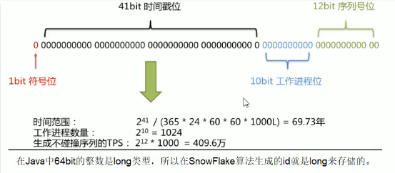
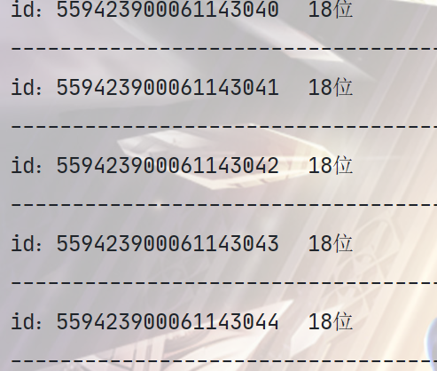

## 1. 开头

### 1.1. 分布式ID使用场景

在复杂分布式系统中，往往需要对大量的数据和消息进行唯一标识。

- 如在美团点评的**金融**、**支付**、**餐饮**、**酒店**等业务场景
- 猫眼电影等产品的系统中数据日渐增长，对数据分库分表后需要有一个唯一ID来表示一条数据或者消息。
- 特别一点的如**订单**、**骑手**、**优惠劵**也都需要一个唯一ID做为标识。

此时一个能生成唯一ID的系统是非常必要的。

### 1.2. ID生成要求

#### 1.2.1. 功能需求

* **全局唯一**：既然是唯一标识，那么全局唯一是最基本的要求。
* **趋势递增**：在MySQL的InnoDB引擎中使用的是聚集索引，由于多数RDBMS使用Btree的数据结构来存储索引数据，在主键的选择上面我们应该尽量使用有序的主键来保证写入性能。
* **单调递增**：保证下一个ID一定大于上一个ID，例如事务版本号、IM增量消息、排序等特殊需求。
* **信息安全**：如果ID是连续的，那么恶意用户的扒取工作就非常容易做了，直接按照顺序下载指定URL即可；如果是订单号那么更加危险，竞争对手可以知道我们一天的单量;所以在一些应用场景下，需要ID无规则不规则，让竞争对手不好猜。
* **含时间戳**：这样就能在开发中快速了解这个分布式ID的生成时间。

#### 1.2.2. 非功能需求

* **高可用**：发一个获取分布式ID的请求，服务器就要保证99.999%的情况下给我创建一个唯一分布式ID
* **低延迟**：发一个获取分布式ID的请求，服务器就要快，极速
* **高QPS**：假如并发一口气10万个创建分布式ID请求同时过来，服务器需要顶得住且成功创建10万个分布式ID

## 2. 通用方案

### 2.1. UUID

最简单的一种方案

```
public static void main(String[] args) {
    String uuid = UUID.randomUUID().toString();
    System.out.println(uuid);
}
```

如果只是考虑**唯一性**，那么UUID基本可以满足需求。

**缺点：**

- **无序**：无法预测他的生成顺序，不能生成递增有序的数字
- **主键**：ID作为主键时在特定的环境下会存在一些问题，比如做DB主键的场景下，UUID非常不适用，MySQL官方有明确的建议主键要尽量越短越好，36位的UUID不合要求。
- **索引**：会导致B+树索引的分裂。

### 2.2. 数据库自增主键

此种方案有一定的局限性，在高并发集群上此策略不可用

### 2.3. 基于Redis

基于Redis生成全局ID策略

- 因为Redis是单线程，天生保证原子性，所以可以使用`INCR`和`INCRBY`来实现。
- **集群分布式**
  * 在Redis集群下，同样和MySQL一样需要设置不同的增长步数
  * 同时key需要设置有效期;
  * 可以使用Redis集群来获取更高的吞吐量;
  * 假如一个集群中有五个Redis，那么初始化每台Redis步长分别是1，2，3，4，5，然后步长都是5

### 2.4. 雪花算法

- 推特的雪花算法生成ID能够按照时间有序生成。
- 雪花算法生成ID的结果是一个`64bit`大小的整数，为一个`Long`型（转换为字符串后长度最多19）
- 分布式系统内不会产生ID碰撞（由`datecenter`和`workerId`作区分），并且效率较高

#### 2.4.1. 结构

 

- **1bit符号位**

  不用，因为二进制最高位是符号位，1表示负数，0表示正数，生成的id一般都是用正数，所以最高位固定位0

- **41bit时间戳**

  用于记录时间戳，毫秒级

- - 41位可以表示2^41 - 1个数字
  - 如果只用来表示正整数（计算机正数包含0），可以表示的数值范围是0-2^41 - 1，减一是因为可表示的数值范围是从0开始算的，而不是1
  - 也就是说41位可以表示2^41 - 1个毫秒的值，转换为单位年则是69年。

- **10bit工作进程位**

  用于记录工作机器id

- - 可以部署在2^10 = 1024个节点，包括五位datacenterId和五位workerId
  - 五位可以表示的最大整数位2^5 - 1 = 31，即可以使用0，1，2…31这32个数字来表示不同的datacenterId和workerId

- **12bit序列号**

  序列号，用来记录同毫秒内 产生的不同的ID

- - 12bit可以表示的最大正整数位2^12 - 1 = 4095，即可以表示0，1….4094这4095个数字
  - 表示同一机器同一时间戳（毫秒）中产生的4095个ID序号

#### 2.4.2. 优势

- 所有生成的id按时间趋势递增
- 整个分布式内不会产生重复id，因为有datacenterId和workerId来做区分。
- 毫秒数在高位，自增序列在低位，整个ID都是趋势递增的
- 不依赖数据库、redis等第三方系统，以服务的方式部署，稳定性更高，生成ID的性能也是非常高的。
- 可以根据自身业务分配bit位，非常灵活

#### 2.4.3. 缺陷

- 依赖机器时钟，如果机器时钟回退，会导致重复ID生成
- 在单机上是递增的，但是由于设计到分布式环境，每台机器上的时钟不可能完全同步，有时候会出现不是全局递增的情况。（此缺点可以认为芜锁胃，一般分布式ID只要求趋势递增，并不会严格要求递增，90%的需求都只需要趋势递增）

#### 2.4.4. 源码

```
/**
 * twitter的snowflake算法 -- java实现
 * 
 * @author beyond
 * @date 2016/11/26
 */
public class SnowFlake {

    /**
     * 起始的时间戳
     */
    private final static long START_STMP = 1480166465631L;

    /**
     * 每一部分占用的位数
     */
    private final static long SEQUENCE_BIT = 12; //序列号占用的位数
    private final static long MACHINE_BIT = 5;   //机器标识占用的位数
    private final static long DATACENTER_BIT = 5;//数据中心占用的位数

    /**
     * 每一部分的最大值
     */
    private final static long MAX_DATACENTER_NUM = -1L ^ (-1L << DATACENTER_BIT);
    private final static long MAX_MACHINE_NUM = -1L ^ (-1L << MACHINE_BIT);
    private final static long MAX_SEQUENCE = -1L ^ (-1L << SEQUENCE_BIT);

    /**
     * 每一部分向左的位移
     */
    private final static long MACHINE_LEFT = SEQUENCE_BIT;
    private final static long DATACENTER_LEFT = SEQUENCE_BIT + MACHINE_BIT;
    private final static long TIMESTMP_LEFT = DATACENTER_LEFT + DATACENTER_BIT;

    private long datacenterId;  //数据中心
    private long machineId;     //机器标识
    private long sequence = 0L; //序列号
    private long lastStmp = -1L;//上一次时间戳

    public SnowFlake(long datacenterId, long machineId) {
        if (datacenterId > MAX_DATACENTER_NUM || datacenterId < 0) {
            throw new IllegalArgumentException("datacenterId can't be greater than MAX_DATACENTER_NUM or less than 0");
        }
        if (machineId > MAX_MACHINE_NUM || machineId < 0) {
            throw new IllegalArgumentException("machineId can't be greater than MAX_MACHINE_NUM or less than 0");
        }
        this.datacenterId = datacenterId;
        this.machineId = machineId;
    }

    /**
     * 产生下一个ID
     *
     * @return
     */
    public synchronized long nextId() {
        long currStmp = getNewstmp();
        if (currStmp < lastStmp) {
            throw new RuntimeException("Clock moved backwards.  Refusing to generate id");
        }

        if (currStmp == lastStmp) {
            //相同毫秒内，序列号自增
            sequence = (sequence + 1) & MAX_SEQUENCE;
            //同一毫秒的序列数已经达到最大
            if (sequence == 0L) {
                currStmp = getNextMill();
            }
        } else {
            //不同毫秒内，序列号置为0
            sequence = 0L;
        }

        lastStmp = currStmp;

        return (currStmp - START_STMP) << TIMESTMP_LEFT //时间戳部分
                | datacenterId << DATACENTER_LEFT       //数据中心部分
                | machineId << MACHINE_LEFT             //机器标识部分
                | sequence;                             //序列号部分
    }

    private long getNextMill() {
        long mill = getNewstmp();
        while (mill <= lastStmp) {
            mill = getNewstmp();
        }
        return mill;
    }

    private long getNewstmp() {
        return System.currentTimeMillis();
    }

    public static void main(String[] args) {
        SnowFlake snowFlake = new SnowFlake(2, 3);

        for (int i = 0; i < (1 << 12); i++) {
            System.out.println(snowFlake.nextId());
        }

    }
}
```

测试

```
SnowFlake snowFlake = new SnowFlake(1,1);
for (int i = 0; i < 10; i++) {
    long id = snowFlake.nextId();
    System.out.println("id：" + id + "\t" + String.valueOf(id).length() + "位");
    System.out.println("------------------------------------------");
}
```

 

### 2.5. 其它开源算法

- 百度开源的分布式唯一ID生成器UidGenerator
- Leaf–美团点评分布式ID生成系统

## 3. 总结

