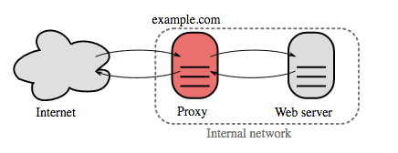
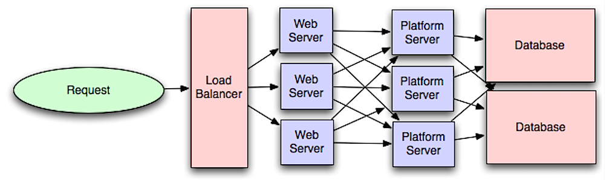
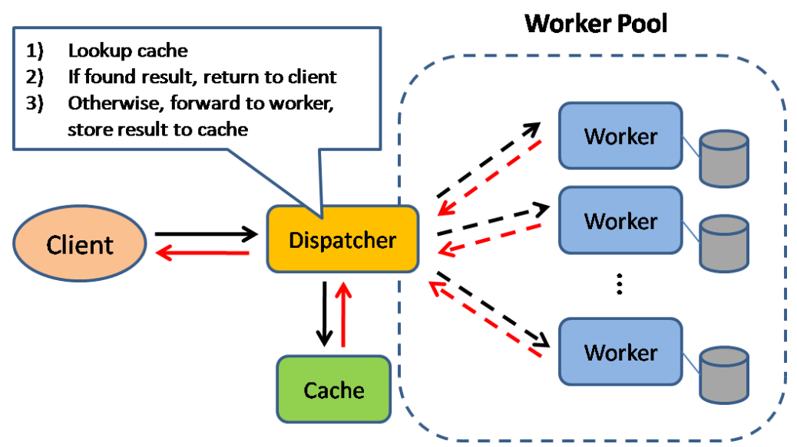

## 1. 设计思路

当面对一个系统的的时候，如何设计，有通用的思路，思路如下：

### 1.1. 前置信息

我们需要系统的描述使用场景，约束和假设

把所有需要的东西聚集在一起，审视问题。不停的提问，以至于我们可以明确使用场景和约束。讨论假设。

- 谁会使用它？
- 他们会怎样使用它？
- 有多少用户？
- 系统的作用是什么？
- 系统的输入输出分别是什么？
- 我们希望处理多少数据？
- 我们希望每秒钟处理多少请求？
- 我们希望的读写比率？

### 1.2. 设计图

使用所有重要的组件来描绘出一个高层级的设计。

- 画出主要的组件和连接
- 证明你的想法

### 1.3. 设计核心组件

对每一个核心组件进行详细深入的分析。举例来说，如果你被问到设计一个 url 缩写服务，开始讨论：

- 生成并储存一个完整 url 的 hash
  - MD5 和 Base62
  - Hash 碰撞
  - SQL 还是 NoSQL
  - 数据库模型
- 将一个 hashed url 翻译成完整的 url
  - 数据库查找
- API 和面向对象设计

### 1.4. 扩展设计

确认和处理瓶颈以及一些限制。举例来说就是你需要下面的这些来完成扩展性的议题吗？

- 负载均衡
- 水平扩展
- 缓存
- 数据库分片

论述可能的解决办法和代价。每件事情需要取舍。可以使用可扩展系统的设计原则来处理瓶颈。

### 1.5. 预估计算量

你或许会被要求通过手算进行一些估算。附录涉及到的是下面的这些资源：

- 使用预估计算量
- 2 的次方表
- 每个程序员都应该知道的延迟数

## 2. 设计原则

### 2.1. 性能与可扩展性

如果服务**性能**的增长与资源的增加是成比例的，服务就是可扩展的。通常，提高性能意味着服务于更多的工作单元，另一方面，当数据集增长时，同样也可以处理更大的工作单位。[1](http://www.allthingsdistributed.com/2006/03/a_word_on_scalability.html)

另一个角度来看待性能与可扩展性:

- 如果你的系统有**性能**问题，对于单个用户来说是缓慢的。
- 如果你的系统有**可扩展性**问题，单个用户较快但在高负载下会变慢

#### 2.1.1. 性能指标

性能指标通常是有两种：

* **延迟**

  延迟是执行操作或运算结果所花费的时间。

* **吞吐量**

  吞吐量是单位时间内（执行）此类操作或运算的数量。

通常我们的目标是：**可接受级延迟**下**最大化吞吐量**

### 2.2. 可用性与一致性

#### 2.2.1.  CAP理论

在一个分布式计算系统中，只能同时满足下列的两点:

- **一致性** 

  每次访问都能获得最新数据但可能会收到错误响应

- **可用性** 

  每次访问都能收到非错响应，但不保证获取到最新数据

- **分区容错性** 

  在任意分区网络故障的情况下系统仍能继续运行

**网络并不可靠，所以你应要支持分区容错性，并需要在软件可用性和一致性间做出取舍，因此我们一般分布式系统可以常用的模式为：**

* CP 一致性和分区容错性

* AP ─ 可用性与分区容错性

  响应节点上可用数据的最近版本可能并不是最新的。当分区解析完后，写入（操作）可能需要一些时间来传播。如果业务需求允许最终一致性，或当有外部故障时要求系统继续运行，AP 是一个不错的选择。

#### 2.2.2.  一致性模式

有同一份数据的多份副本，我们面临着怎样同步它们的选择，以便让客户端有一致的显示数据。回想 [CAP 理论](https://github.com/donnemartin/system-design-primer/blob/master/README-zh-Hans.md#cap-理论)中的一致性定义 ─ 每次访问都能获得最新数据但可能会收到错误响应

* 弱一致性

  在写入之后，访问可能看到，也可能看不到（写入数据）。尽力优化之让其能访问最新数据。

  这种方式可以 memcached 等系统中看到。弱一致性在 VoIP，视频聊天和实时多人游戏等真实用例中表现不错。打个比方，如果你在通话中丢失信号几秒钟时间，当重新连接时你是听不到这几秒钟所说的话的。

* 最终一致性

  在写入后，访问最终能看到写入数据（通常在数毫秒内）。数据被异步复制。

  DNS 和 email 等系统使用的是此种方式。最终一致性在高可用性系统中效果不错。

* 强一致性

  在写入后，访问立即可见。数据被同步复制。

  文件系统和关系型数据库（RDBMS）中使用的是此种方式。强一致性在需要记录的系统中运作良好。

#### 2.2.3.  可用性模式

有两种支持高可用性的模式: **故障切换（fail-over）和复制（replication）**。

* **故障切换**

  * 工作到备用切换（Active-passive）

    关于工作到备用的故障切换流程是，工作服务器发送周期信号给待机中的备用服务器。如果周期信号中断，备用服务器切换成工作服务器的 IP 地址并恢复服务。

    宕机时间取决于备用服务器处于“热”待机状态还是需要从“冷”待机状态进行启动。只有工作服务器处理流量。

    工作到备用的故障切换也被称为主从切换。

  * **双工作切换（Active-active）**

    在双工作切换中，双方都在管控流量，在它们之间分散负载。

    如果是外网服务器，DNS 将需要对两方都了解。如果是内网服务器，应用程序逻辑将需要对两方都了解。

    双工作切换也可以称为主主切换。

  **缺陷：故障切换**

  - 故障切换需要添加额外硬件并增加复杂性。

  - 如果新写入数据在能被复制到备用系统之前，工作系统出现了故障，则有可能会丢失数据。

* 复制

  主─从复制和主─主复制

  这个主题进一步探讨了[数据库](https://github.com/donnemartin/system-design-primer/blob/master/README-zh-Hans.md#数据库)部分:

  - [主─从复制](https://github.com/donnemartin/system-design-primer/blob/master/README-zh-Hans.md#主从复制)

  - [主─主复制](https://github.com/donnemartin/system-design-primer/blob/master/README-zh-Hans.md#主主复制)

## 3. 关键构件

### 3.1. DNS

#### 3.1.1. DNS作用

域名系统是把 [www.example.com](http://www.example.com/) 等域名转换成 IP 地址。

域名系统是分层次的，一些 DNS 服务器位于顶层。当查询（域名） IP 时，路由或 ISP 提供连接 DNS 服务器的信息。较底层的 DNS 服务器缓存映射，它可能会因为 DNS 传播延时而失效。DNS 结果可以缓存在浏览器或操作系统中一段时间，时间长短取决于[存活时间 TTL](https://en.wikipedia.org/wiki/Time_to_live)。

- **NS 记录（域名服务）** ─ 指定解析域名或子域名的 DNS 服务器。
- **MX 记录（邮件交换）** ─ 指定接收信息的邮件服务器。
- **A 记录（地址）** ─ 指定域名对应的 IP 地址记录。
- **CNAME（规范）** ─ 一个域名映射到另一个域名或 `CNAME` 记录（ example.com 指向 [www.example.com](http://www.example.com/) ）或映射到一个 `A` 记录。

#### 3.1.2. DNS算法

[CloudFlare](https://www.cloudflare.com/dns/) 和 [Route 53](https://aws.amazon.com/route53/) 等平台提供管理 DNS 的功能。某些 DNS 服务通过集中方式来路由流量:

- 加权轮询调度
  - 防止流量进入维护中的服务器
  - 在不同大小集群间负载均衡
  - A/B 测试
- 基于延迟路由
- 基于地理位置路由

#### 3.1.3. DNS缺陷

- 虽说缓存可以减轻 DNS 延迟，但连接 DNS 服务器还是带来了轻微的延迟。
- 虽然它们通常由[政府，网络服务提供商和大公司](http://superuser.com/questions/472695/who-controls-the-dns-servers/472729)管理，但 DNS 服务管理仍可能是复杂的。
- DNS 服务最近遭受 [DDoS 攻击](http://dyn.com/blog/dyn-analysis-summary-of-friday-october-21-attack/)，阻止不知道 Twitter IP 地址的用户访问 Twitter。

### 3.2. CDN

#### 3.2.1. CDN作用

内容分发网络（CDN）是一个全球性的代理服务器分布式网络，它从靠近用户的位置提供内容。通常，HTML/CSS/JS，图片和视频等静态内容由 CDN 提供，虽然亚马逊 CloudFront 等也支持动态内容。CDN 的 DNS 解析会告知客户端连接哪台服务器。

将内容存储在 CDN 上可以从两个方面来提供性能:

- 从靠近用户的数据中心提供资源
- 通过 CDN 你的服务器不必真的处理请求

#### 3.2.2. CDN使用

* CDN 推送（push）

  当你服务器上内容发生变动时，推送 CDN 接受新内容。直接推送给 CDN 并重写 URL 地址以指向你的内容的 CDN 地址。你可以配置内容到期时间及何时更新。内容只有在更改或新增是才推送，流量最小化，但储存最大化。

* CDN 拉取

  是当第一个用户请求该资源时，从服务器上拉取资源。你将内容留在自己的服务器上并重写 URL 指向 CDN 地址。直到内容被缓存在 CDN 上为止，这样请求只会更慢，

  [存活时间（TTL）](https://en.wikipedia.org/wiki/Time_to_live)决定缓存多久时间。CDN 拉取方式最小化 CDN 上的储存空间，但如果过期文件并在实际更改之前被拉取，则会导致冗余的流量。

  高流量站点使用 CDN 拉取效果不错，因为只有最近请求的内容保存在 CDN 中，流量才能更平衡地分散

#### 3.2.3. CDN缺陷

- CDN 成本可能因流量而异，可能在权衡之后你将不会使用 CDN。
- 如果在 TTL 过期之前更新内容，CDN 缓存内容可能会过时。
- CDN 需要更改静态内容的 URL 地址以指向 CDN。

### 3.3. 负载均衡器

#### 3.3.1. 好处

负载均衡器将传入的请求分发到应用服务器和数据库等计算资源。无论哪种情况，负载均衡器将从计算资源来的响应返回给恰当的客户端。负载均衡器的效用在于:

- 防止请求进入不好的服务器
- 防止资源过载
- 帮助消除单一的故障点

负载均衡器可以通过硬件（昂贵）或 HAProxy 等软件来实现。 增加的好处包括:

- **SSL 终结** 

  解密传入的请求并加密服务器响应，这样的话后端服务器就不必再执行这些潜在高消耗运算了。

  - 不需要再每台服务器上安装 [X.509 证书](https://en.wikipedia.org/wiki/X.509)。

- **Session 留存**

  如果 Web 应用程序不追踪会话，发出 cookie 并将特定客户端的请求路由到同一实例。

通常会设置采用[工作─备用](https://github.com/donnemartin/system-design-primer/blob/master/README-zh-Hans.md#工作到备用切换active-passive) 或 [双工作](https://github.com/donnemartin/system-design-primer/blob/master/README-zh-Hans.md#双工作切换active-active) 模式的多个负载均衡器，以免发生故障。

#### 3.3.2. 方式

负载均衡器能基于多种方式来路由流量:

- 随机
- 最少负载
- Session/cookie
- [轮询调度或加权轮询调度算法](http://g33kinfo.com/info/archives/2657)
- [四层负载均衡](https://github.com/donnemartin/system-design-primer/blob/master/README-zh-Hans.md#四层负载均衡)
- [七层负载均衡](https://github.com/donnemartin/system-design-primer/blob/master/README-zh-Hans.md#七层负载均衡)

#### 3.3.3. 水平扩展

负载均衡器还能帮助水平扩展，提高性能和可用性。使用商业硬件的性价比更高，并且比在单台硬件上**垂直扩展**更贵的硬件具有更高的可用性。相比招聘特定企业系统人才，招聘商业硬件方面的人才更加容易。

- 水平扩展引入了复杂度并涉及服务器复制
  - 服务器应该是无状态的:它们也不该包含像 session 或资料图片等与用户关联的数据。
  - session 可以集中存储在数据库或持久化[缓存](https://github.com/donnemartin/system-design-primer/blob/master/README-zh-Hans.md#缓存)（Redis、Memcached）的数据存储区中。
- 缓存和数据库等下游服务器需要随着上游服务器进行扩展，以处理更多的并发连接。

#### 3.3.4. 缺陷

- 如果没有足够的资源配置或配置错误，负载均衡器会变成一个性能瓶颈。
- 引入负载均衡器以帮助消除单点故障但导致了额外的复杂性。
- 单个负载均衡器会导致单点故障，但配置多个负载均衡器会进一步增加复杂性

### 3.4. 反向代理

 

反向代理是一种可以集中地调用内部服务，并提供统一接口给公共客户的 web 服务器。来自客户端的请求先被反向代理服务器转发到可响应请求的服务器，然后代理再把服务器的响应结果返回给客户端。

#### 3.4.1. 反向代理优势

- **增加安全性** 

  隐藏后端服务器的信息，屏蔽黑名单中的 IP，限制每个客户端的连接数。

- **提高可扩展性和灵活性** 

   客户端只能看到反向代理服务器的 IP，这使你可以增减服务器或者修改它们的配置。

- 本地终结 SSL 会话-解密传入请求，加密服务器响应，这样后端服务器就不必完成这些潜在的高成本的操作。

  - 免除了在每个服务器上安装 [X.509](https://en.wikipedia.org/wiki/X.509) 证书的需要

- **压缩** - 压缩服务器响应

- **缓存** - 直接返回命中的缓存结果

- 静态内容

  \- 直接提供静态内容

  - HTML/CSS/JS
  - 图片
  - 视频
  - 等等

#### 3.4.2. 负载均衡与反向代理

- 当你有多个服务器时，部署负载均衡器非常有用。通常，负载均衡器将流量路由给一组功能相同的服务器上。
- 即使只有一台 web 服务器或者应用服务器时，反向代理也有用，可以参考上一节介绍的好处。
- NGINX 和 HAProxy 等解决方案可以同时支持第七层反向代理和负载均衡。

#### 3.4.3. 缺陷

- 引入反向代理会增加系统的复杂度。
- 单独一个反向代理服务器仍可能发生单点故障，配置多台反向代理服务器（如[故障转移](https://en.wikipedia.org/wiki/Failover)）会进一步增加复杂度。

### 不利之处：反向代理

- 引入反向代理会增加系统的复杂度。
- 单独一个反向代理服务器仍可能发生单点故障，配置多台反向代理服务器（如[故障转移](https://en.wikipedia.org/wiki/Failover)）会进一步增加复杂度

### 3.5. 应用层

 

将 Web 服务层与应用层（也被称作平台层）分离，可以独立缩放和配置这两层。添加新的 API 只需要添加应用服务器，而不必添加额外的 web 服务器。

**单一职责原则**提倡小型的，自治的服务共同合作。小团队通过提供小型的服务，可以更激进地计划增长。应用层中的工作进程也有可以实现[异步化](https://github.com/donnemartin/system-design-primer/blob/master/README-zh-Hans.md#异步)。

#### 3.5.1. 微服务

与此讨论相关的话题是 [微服务](https://en.wikipedia.org/wiki/Microservices)，可以被描述为一系列可以独立部署的小型的，模块化服务。每个服务运行在一个独立的线程中，通过明确定义的轻量级机制通讯，共同实现业务目标。[1](https://smartbear.com/learn/api-design/what-are-microservices)

例如，Pinterest 可能有这些微服务： 用户资料、关注者、Feed 流、搜索、照片上传等

#### 3.5.2. 服务发现

像 [Consul](https://www.consul.io/docs/index.html)，[Etcd](https://coreos.com/etcd/docs/latest) 和 [Zookeeper](http://www.slideshare.net/sauravhaloi/introduction-to-apache-zookeeper) 这样的系统可以通过追踪注册名、地址、端口等信息来帮助服务互相发现对方。[Health checks](https://www.consul.io/intro/getting-started/checks.html) 可以帮助确认服务的完整性和是否经常使用一个 [HTTP](https://github.com/donnemartin/system-design-primer/blob/master/README-zh-Hans.md#超文本传输协议http) 路径。Consul 和 Etcd 都有一个内建的 [key-value 存储](https://github.com/donnemartin/system-design-primer/blob/master/README-zh-Hans.md#键-值存储) 用来存储配置信息和其他的共享信息。

#### 3.5.3. 缺点

- 添加由多个松耦合服务组成的应用层，从架构、运营、流程等层面来讲将非常不同（相对于单体系统）。
- 微服务会增加部署和运营的复杂度。

### 3.6. 数据库

### 3.7. 缓存

 

缓存可以提高页面加载速度，并可以减少服务器和数据库的负载。在这个模型中，分发器先查看请求之前是否被响应过，如果有则将之前的结果直接返回，来省掉真正的处理。

数据库分片均匀分布的读取是最好的。但是热门数据会让读取分布不均匀，这样就会造成瓶颈，如果在数据库前加个缓存，就会抹平不均匀的负载和突发流量对数据库的影响。

#### 3.7.1. 缓存种类

* 客户端缓存

  缓存可以位于客户端（操作系统或者浏览器），[服务端](https://github.com/donnemartin/system-design-primer/blob/master/README-zh-Hans.md#反向代理web-服务器)或者不同的缓存层。

* CDN 缓存

  [CDN](https://github.com/donnemartin/system-design-primer/blob/master/README-zh-Hans.md#内容分发网络cdn) 也被视为一种缓存。

* Web 服务器缓存

  [反向代理](https://github.com/donnemartin/system-design-primer/blob/master/README-zh-Hans.md#反向代理web-服务器)和缓存（比如 [Varnish](https://www.varnish-cache.org/)）可以直接提供静态和动态内容。Web 服务器同样也可以缓存请求，返回相应结果而不必连接应用服务器。

* 数据库缓存

  数据库的默认配置中通常包含缓存级别，针对一般用例进行了优化。调整配置，在不同情况下使用不同的模式可以进一步提高性能。

* 应用缓存

  基于内存的缓存比如 Memcached 和 Redis 是应用程序和数据存储之间的一种键值存储。由于数据保存在 RAM 中，它比存储在磁盘上的典型数据库要快多了。RAM 比磁盘限制更多，所以例如 [least recently used (LRU)](https://en.wikipedia.org/wiki/Cache_algorithms#Least_Recently_Used) 的[缓存无效算法](https://en.wikipedia.org/wiki/Cache_algorithms)可以将「热门数据」放在 RAM 中，而对一些比较「冷门」的数据不做处理。

  Redis 有下列附加功能：

  - 持久性选项
  - 内置数据结构比如有序集合和列表

#### 3.7.2. 应用缓存级别

应用缓存有多个缓存级别，分为两大类：**数据库查询**和**对象**：

- 行级别
- 查询级别
- 完整的可序列化对象
- 完全渲染的 HTML

一般来说，你应该尽量避免基于文件的缓存，因为这使得复制和自动缩放很困难。

* **数据库查询级别的缓存**

  当你查询数据库的时候，将查询语句的哈希值与查询结果存储到缓存中。这种方法会遇到以下问题：

  - 很难用复杂的查询删除已缓存结果。

  - 如果一条数据比如表中某条数据的一项被改变，则需要删除所有可能包含已更改项的缓存结果。

* **对象级别的缓存**

  将您的数据视为对象，就像对待你的应用代码一样。让应用程序将数据从数据库中组合到类实例或数据结构中：

  - 如果对象的基础数据已经更改了，那么从缓存中删掉这个对象。

  - 允许异步处理：workers 通过使用最新的缓存对象来组装对象。

建议缓存的内容：

- 用户会话
- 完全渲染的 Web 页面
- 活动流
- 用户图数据

#### 3.7.3. 缓存更新

由于你只能在缓存中存储有限的数据，所以你需要选择一个适用于你用例的缓存更新策略。

* **缓存模式**

  机制：

  应用从存储器读写。缓存不和存储器直接交互，应用执行以下操作：

  - 在缓存中查找记录，如果所需数据不在缓存中
  - 从数据库中加载所需内容
  - 将查找到的结果存储到缓存中
  - 返回所需内容

  ```
  def get_user(self, user_id):
      user = cache.get("user.{0}", user_id)
      if user is None:
          user = db.query("SELECT * FROM users WHERE user_id = {0}", user_id)
          if user is not None:
              key = "user.{0}".format(user_id)
              cache.set(key, json.dumps(user))
      return user
  ```

  ​	添加到缓存中的数据读取速度很快。缓存模式也称为延迟加载。只缓存所请求的数据，这避免了没有被请求的数据占满了缓存空间。

  缺点：

  - 请求的数据如果不在缓存中就需要经过三个步骤来获取数据，这会导致明显的延迟。
  - 如果数据库中的数据更新了会导致缓存中的数据过时。这个问题需要通过设置TTL 强制更新缓存或者直写模式来缓解这种情况。
  - 当一个节点出现故障的时候，它将会被一个新的节点替代，这增加了延迟的时间。

* **直写模式**

  机制：

  应用使用缓存作为主要的数据存储，将数据读写到缓存中，而缓存负责从数据库中读写数据。

  - 应用向缓存中添加/更新数据
  - 缓存同步地写入数据存储
  - 返回所需内容

  ```
  set_user(12345, {"foo":"bar"})
  ```

  ```
  def set_user(user_id, values):
      user = db.query("UPDATE Users WHERE id = {0}", user_id, values)
      cache.set(user_id, user)
  ```

  由于存写操作所以直写模式整体是一种很慢的操作，但是读取刚写入的数据很快。相比读取数据，用户通常比较能接受更新数据时速度较慢。缓存中的数据不会过时

  缺点：

  - 由于故障或者缩放而创建的新的节点，新的节点不会缓存，直到数据库更新为止。缓存应用直写模式可以缓解这个问题。
  - 写入的大多数数据可能永远都不会被读取，用 TTL 可以最小化这种情况的出现。

* **回写模式**

  在回写模式中，应用执行以下操作：

  - 在缓存中增加或者更新条目
  - 异步写入数据，提高写入性能。

  缺点：

  - 缓存可能在其内容成功存储之前丢失数据。
  - 执行直写模式比缓存或者回写模式更复杂。

* **刷新**

  缓存配置成在到期之前自动刷新最近访问过的内容。

  如果缓存可以准确预测将来可能请求哪些数据，那么刷新可能会导致延迟与读取时间的降低。

  **刷新缺点：**

  不能准确预测到未来需要用到的数据可能会导致性能不如不使用刷新。

  #### 3.7.4.  缓存缺点：

  - 需要保持缓存和真实数据源之间的一致性，比如数据库根据[缓存无效](https://en.wikipedia.org/wiki/Cache_algorithms)。
  - 需要改变应用程序比如增加 Redis 或者 memcached。
  - 无效缓存是个难题，什么时候更新缓存是与之相关的复杂问题。

### 3.8. 异步组件

异步工作流有助于减少那些原本顺序执行的请求时间。它们可以通过提前进行一些耗时的工作来帮助减少请求时间，比如定期汇总数据。

#### 3.8.1. 消息队列

消息队列接收，保留和传递消息。如果按顺序执行操作太慢的话，你可以使用有以下工作流的消息队列：

- 应用程序将作业发布到队列，然后通知用户作业状态
- 一个 worker 从队列中取出该作业，对其进行处理，然后显示该作业完成

不去阻塞用户操作，作业在后台处理。在此期间，客户端可能会进行一些处理使得看上去像是任务已经完成了。例如，如果要发送一条推文，推文可能会马上出现在你的时间线上，但是可能需要一些时间才能将你的推文推送到你的所有关注者那里去。

**Redis** 是一个令人满意的简单的消息代理，但是消息有可能会丢失。

**RabbitMQ** 很受欢迎但是要求你适应「AMQP」协议并且管理你自己的节点。

**Amazon SQS** 是被托管的，但可能具有高延迟，并且消息可能会被传送两次。

#### 3.8.2. 任务队列

任务队列接收任务及其相关数据，运行它们，然后传递其结果。 它们可以支持调度，并可用于在后台运行计算密集型作业。

**Celery** 支持调度，主要是用 Python 开发的。

#### 3.8.3. 背压

如果队列开始明显增长，那么队列大小可能会超过内存大小，导致高速缓存未命中，磁盘读取，甚至性能更慢。[背压](http://mechanical-sympathy.blogspot.com/2012/05/apply-back-pressure-when-overloaded.html)可以通过限制队列大小来帮助我们，从而为队列中的作业保持高吞吐率和良好的响应时间。一旦队列填满，客户端将得到服务器忙或者 HTTP 503 状态码，以便稍后重试。客户端可以在稍后时间重试该请求，也许是[指数退避](https://en.wikipedia.org/wiki/Exponential_backoff)。

#### 3.8.4. 异步的缺点

简单的计算和实时工作流等用例可能更适用于同步操作，因为引入队列可能会增加延迟和复杂性。


## 4. 网络通信

### 4.1. osi网络模型

 

### 4.2. HTTP

HTTP 是一种在客户端和服务器之间编码和传输数据的方法。它是一个请求/响应协议：客户端和服务端针对相关内容和完成状态信息的请求和响应。HTTP 是独立的，允许请求和响应流经许多执行负载均衡，缓存，加密和压缩的中间路由器和服务器。它是应用层协议。

一个基本的 HTTP 请求由一个动词（方法）和一个资源（端点）组成。 以下是常见的 HTTP 动词：

| 动词   | 描述                         | 幂等 | 安全性 | 可缓存                    |
| ------ | ---------------------------- | ---- | ------ | ------------------------- |
| GET    | 读取资源                     | Yes  | Yes    | Yes                       |
| POST   | 创建资源或触发处理数据的进程 | No   | No     | Yes，如果回应包含刷新信息 |
| PUT    | 创建或替换资源               | Yes  | No     | No                        |
| PATCH  | 部分更新资源                 | No   | No     | Yes，如果回应包含刷新信息 |
| DELETE | 删除资源                     | Yes  | No     | No                        |

### 4.3. TCP

传输控制协议（TCP）

TCP 是通过 [IP 网络](https://en.wikipedia.org/wiki/Internet_Protocol)的面向连接的协议。 使用[握手](https://en.wikipedia.org/wiki/Handshaking)建立和断开连接。 发送的所有数据包保证以原始顺序到达目的地，用以下措施保证数据包不被损坏：

- 每个数据包的序列号和[校验码](https://en.wikipedia.org/wiki/Transmission_Control_Protocol#Checksum_computation)。
- [确认包](https://en.wikipedia.org/wiki/Acknowledgement_(data_networks))和自动重传

如果发送者没有收到正确的响应，它将重新发送数据包。如果多次超时，连接就会断开。TCP 实行[流量控制](https://en.wikipedia.org/wiki/Flow_control_(data))和[拥塞控制](https://en.wikipedia.org/wiki/Network_congestion#Congestion_control)。这些确保措施会导致延迟，而且通常导致传输效率比 UDP 低。

为了确保高吞吐量，Web 服务器可以保持大量的 TCP 连接，从而导致高内存使用。在 Web 服务器线程间拥有大量开放连接可能开销巨大，消耗资源过多，也就是说，一个 [memcached](https://github.com/donnemartin/system-design-primer/blob/master/README-zh-Hans.md#memcached) 服务器。[连接池](https://en.wikipedia.org/wiki/Connection_pool) 可以帮助除了在适用的情况下切换到 UDP。

TCP 对于需要高可靠性但时间紧迫的应用程序很有用。比如包括 Web 服务器，数据库信息，SMTP，FTP 和 SSH。

以下情况使用 TCP 代替 UDP：

- 你需要数据完好无损。
- 你想对网络吞吐量自动进行最佳评估。

### 4.4. UDP

用户数据报协议（UDP）

UDP 是无连接的。数据报（类似于数据包）只在数据报级别有保证。数据报可能会无序的到达目的地，也有可能会遗失。UDP 不支持拥塞控制。虽然不如 TCP 那样有保证，但 UDP 通常效率更高。

UDP 可以通过广播将数据报发送至子网内的所有设备。这对 [DHCP](https://en.wikipedia.org/wiki/Dynamic_Host_Configuration_Protocol) 很有用，因为子网内的设备还没有分配 IP 地址，而 IP 对于 TCP 是必须的。

UDP 可靠性更低但适合用在网络电话、视频聊天，流媒体和实时多人游戏上。

以下情况使用 UDP 代替 TCP：

- 你需要低延迟
- 相对于数据丢失更糟的是数据延迟
- 你想实现自己的错误校正方法

### 4.5. RPC

#### 4.5.1. rpc定义

远程过程调用协议（RPC） 

在 RPC 中，客户端会去调用另一个地址空间（通常是一个远程服务器）里的方法。调用代码看起来就像是调用的是一个本地方法，客户端和服务器交互的具体过程被抽象。远程调用相对于本地调用一般较慢而且可靠性更差，因此区分两者是有帮助的。热门的 RPC 框架包括 [Protobuf](https://developers.google.com/protocol-buffers/)、[Thrift](https://thrift.apache.org/) 和 [Avro](https://avro.apache.org/docs/current/)。

RPC 是一个“请求-响应”协议：

- **客户端程序** ── 调用客户端存根程序。就像调用本地方法一样，参数会被压入栈中。
- **客户端 stub 程序** ── 将请求过程的 id 和参数打包进请求信息中。
- **客户端通信模块** ── 将信息从客户端发送至服务端。
- **服务端通信模块** ── 将接受的包传给服务端存根程序。
- **服务端 stub 程序** ── 将结果解包，依据过程 id 调用服务端方法并将参数传递过去。

#### 4.5.2. RPC 调用示例

```
GET /someoperation?data=anId

POST /anotheroperation
{
  "data":"anId";
  "anotherdata": "another value"
}
```

#### 4.5.3. RPC优缺点

RPC 专注于暴露方法。RPC 通常用于处理内部通讯的性能问题，这样你可以手动处理本地调用以更好的适应你的情况。

当以下情况时选择本地库（也就是 SDK）：

- 你知道你的目标平台。
- 你想控制如何访问你的“逻辑”。
- 你想对发生在你的库中的错误进行控制。
- 性能和终端用户体验是你最关心的事。

遵循 **REST** 的 HTTP API 往往更适用于公共 API。

**缺点：RPC**

- RPC 客户端与服务实现捆绑地很紧密。
- 一个新的 API 必须在每一个操作或者用例中定义。
- RPC 很难调试。
- 你可能没办法很方便的去修改现有的技术。举个例子，如果你希望在 [Squid](http://www.squid-cache.org/) 这样的缓存服务器上确保 [RPC 被正确缓存](http://etherealbits.com/2012/12/debunking-the-myths-of-rpc-rest/)的话可能需要一些额外的努力了。

### 4.6. REST

表述性状态转移（REST）

#### 4.6.1. 定义

REST 是一种强制的客户端/服务端架构设计模型，客户端基于服务端管理的一系列资源操作。服务端提供修改或获取资源的接口。所有的通信必须是无状态和可缓存的。

RESTful 接口有四条规则：

- **标志资源（HTTP 里的 URI）** ── 无论什么操作都使用同一个 URI。
- **表示的改变（HTTP 的动作）** ── 使用动作, headers 和 body。
- **可自我描述的错误信息（HTTP 中的 status code）** ── 使用状态码，不要重新造轮子。
- **[HATEOAS](http://restcookbook.com/Basics/hateoas/)（HTTP 中的HTML 接口）** ── 你的 web 服务器应该能够通过浏览器访问。

#### 4.6.2. REST 请求示例

```
GET /someresources/anId

PUT /someresources/anId
{"anotherdata": "another value"}
```

#### 4.6.3. REST优缺点

REST 关注于暴露数据。它减少了客户端／服务端的耦合程度，经常用于公共 HTTP API 接口设计。REST 使用更通常与规范化的方法来通过 URI 暴露资源，[通过 header 来表述](https://github.com/for-GET/know-your-http-well/blob/master/headers.md)并通过 GET、POST、PUT、DELETE 和 PATCH 这些动作来进行操作。因为无状态的特性，REST 易于横向扩展和隔离。

**缺点：**

- 由于 REST 将重点放在暴露数据，所以当资源不是自然组织的或者结构复杂的时候它可能无法很好的适应。举个例子，返回过去一小时中与特定事件集匹配的更新记录这种操作就很难表示为路径。使用 REST，可能会使用 URI 路径，查询参数和可能的请求体来实现。
- REST 一般依赖几个动作（GET、POST、PUT、DELETE 和 PATCH），但有时候仅仅这些没法满足你的需要。举个例子，将过期的文档移动到归档文件夹里去，这样的操作可能没法简单的用上面这几个 verbs 表达。
- 为了渲染单个页面，获取被嵌套在层级结构中的复杂资源需要客户端，服务器之间多次往返通信。例如，获取博客内容及其关联评论。对于使用不确定网络环境的移动应用来说，这些多次往返通信是非常麻烦的。
- 随着时间的推移，更多的字段可能会被添加到 API 响应中，较旧的客户端将会接收到所有新的数据字段，即使是那些它们不需要的字段，结果它会增加负载大小并引起更大的延迟。

#### 4.6.4. RPC与REST对比

| 操作                   | RPC                                                          | REST                                             |
| ---------------------- | ------------------------------------------------------------ | ------------------------------------------------ |
| 注册                   | **POST** /signup                                             | **POST** /persons                                |
| 注销                   | **POST** /resign { "personid": "1234" }                      | **DELETE** /persons/1234                         |
| 读取用户信息           | **GET** /readPerson?personid=1234                            | **GET** /persons/1234                            |
| 读取用户物品列表       | **GET** /readUsersItemsList?personid=1234                    | **GET** /persons/1234/items                      |
| 向用户物品列表添加一项 | **POST** /addItemToUsersItemsList { "personid": "1234"; "itemid": "456" } | **POST** /persons/1234/items { "itemid": "456" } |
| 更新一个物品           | **POST** /modifyItem { "itemid": "456"; "key": "value" }     | **PUT** /items/456 { "key": "value" }            |
| 删除一个物品           | **POST** /removeItem { "itemid": "456" }                     | **DELETE** /items/456                            |


## 5. 安全

## 6. 常见数值

### 6.1.2次方表

```
Power           Exact Value         Approx Value        Bytes
---------------------------------------------------------------
7                             128
8                             256
10                           1024   1 thousand           1 KB
16                         65,536                       64 KB
20                      1,048,576   1 million            1 MB
30                  1,073,741,824   1 billion            1 GB
32                  4,294,967,296                        4 GB
40              1,099,511,627,776   1 trillion           1 TB
```

### 6.2. 延迟数

```
Latency Comparison Numbers
--------------------------
L1 cache reference                           0.5 ns
Branch mispredict                            5   ns
L2 cache reference                           7   ns                      14x L1 cache
Mutex lock/unlock                           25   ns
Main memory reference                      100   ns                      20x L2 cache, 200x L1 cache
Compress 1K bytes with Zippy            10,000   ns       10 us
Send 1 KB bytes over 1 Gbps network     10,000   ns       10 us
Read 4 KB randomly from SSD*           150,000   ns      150 us          ~1GB/sec SSD
Read 1 MB sequentially from memory     250,000   ns      250 us
Round trip within same datacenter      500,000   ns      500 us
Read 1 MB sequentially from SSD*     1,000,000   ns    1,000 us    1 ms  ~1GB/sec SSD, 4X memory
Disk seek                           10,000,000   ns   10,000 us   10 ms  20x datacenter roundtrip
Read 1 MB sequentially from 1 Gbps  10,000,000   ns   10,000 us   10 ms  40x memory, 10X SSD
Read 1 MB sequentially from disk    30,000,000   ns   30,000 us   30 ms 120x memory, 30X SSD
Send packet CA->Netherlands->CA    150,000,000   ns  150,000 us  150 ms

Notes
-----
1 ns = 10^-9 seconds
1 us = 10^-6 seconds = 1,000 ns
1 ms = 10^-3 seconds = 1,000 us = 1,000,000 ns
```

 

基于上述数字的指标：

- 从磁盘以 30 MB/s 的速度顺序读取
- 以 100 MB/s 从 1 Gbps 的以太网顺序读取
- 从 SSD 以 1 GB/s 的速度读取
- 以 4 GB/s 的速度从主存读取
- 每秒能绕地球 6-7 圈
- 数据中心内每秒有 2,000 次往返

## 7. 总结