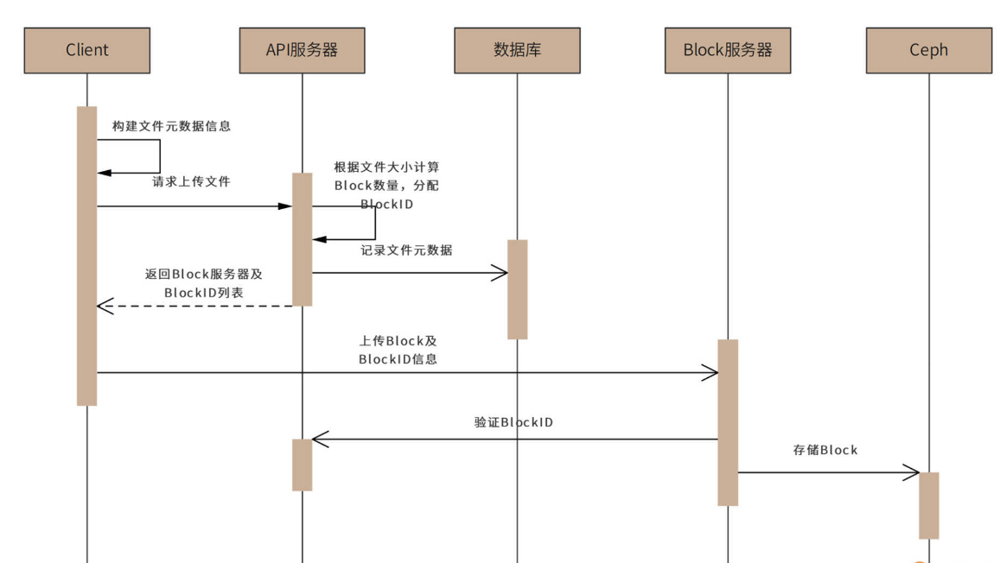
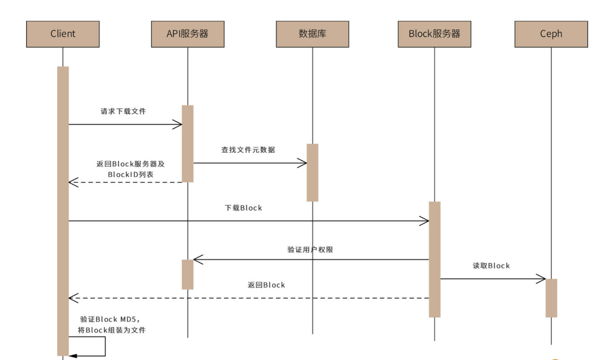
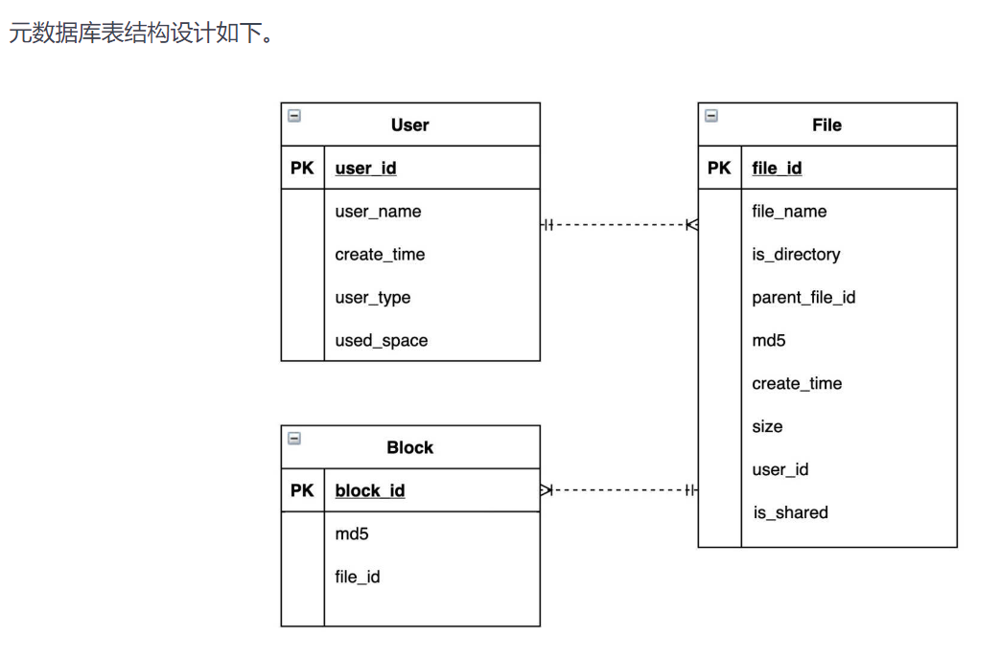
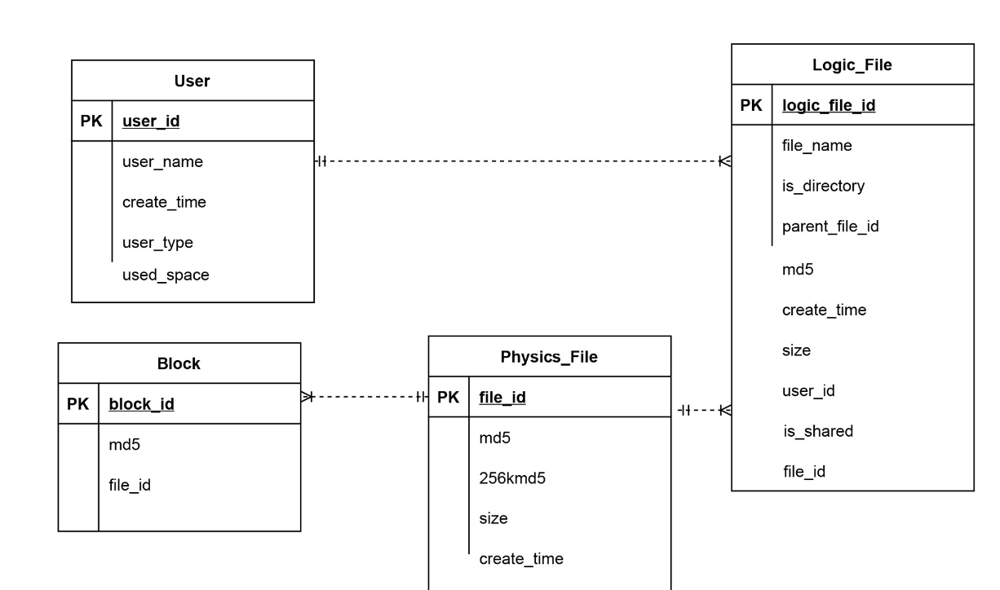

## 短 URL 生成器设计

利用散列算法结合布隆过滤器预生成放到存储里，每次获取短链并保存长链和短链的映射关系，请求的时候便可以找到长链了

## 网页爬虫设计

* URL调度器算法

  **URL调度器就需要决定当前先下载哪些URL**，广度优先搜索算法可能会导致爬虫一段时间内总是访问同一个网站

* 去重算法

  布隆过滤器

* 高可用设计

  当服务器宕机后重启时，系统需要能够正确恢复，保证既不会丢失数据，也不会重复下载

## 网盘系统设计

 

 

 

 

##  **短视频系统设计**

