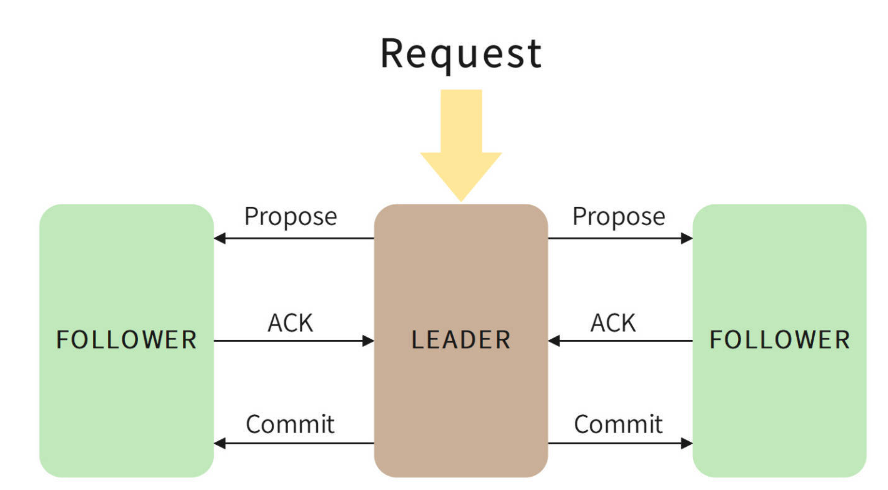
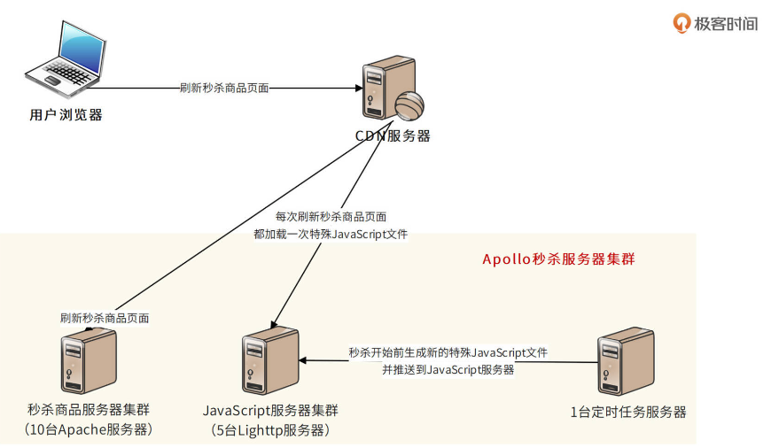
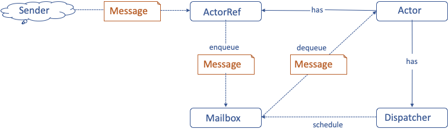
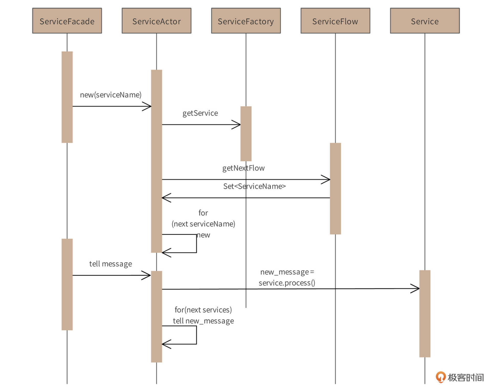
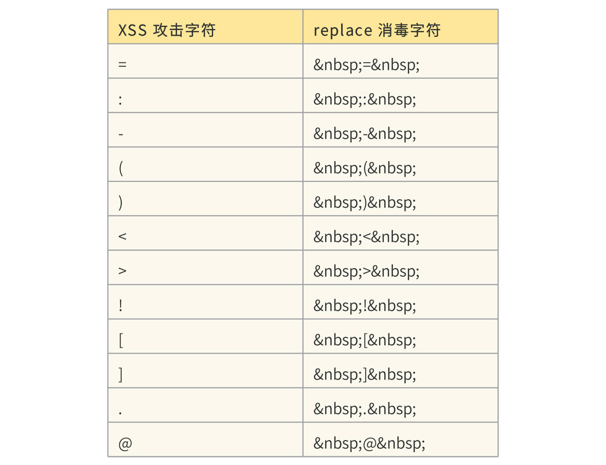
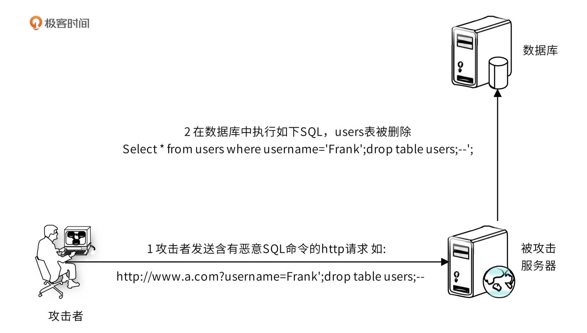
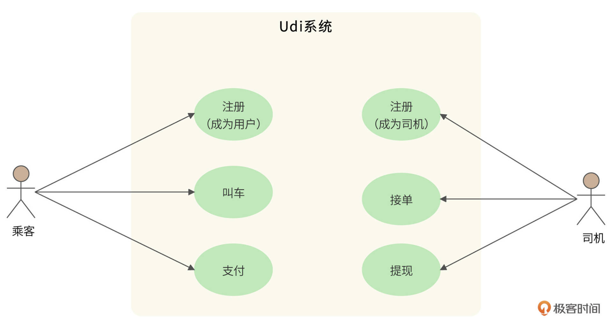
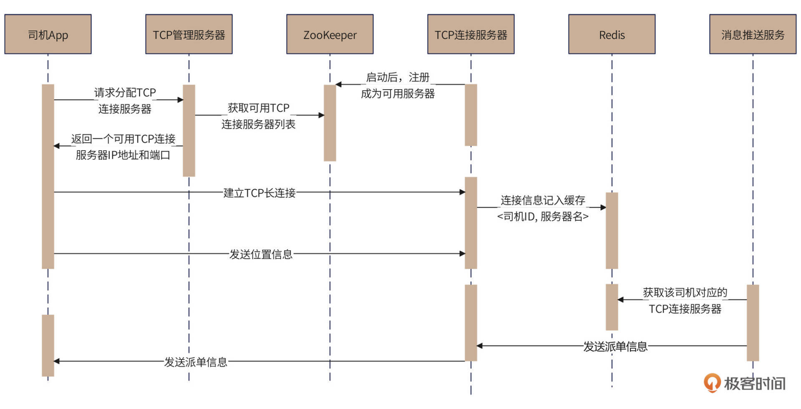
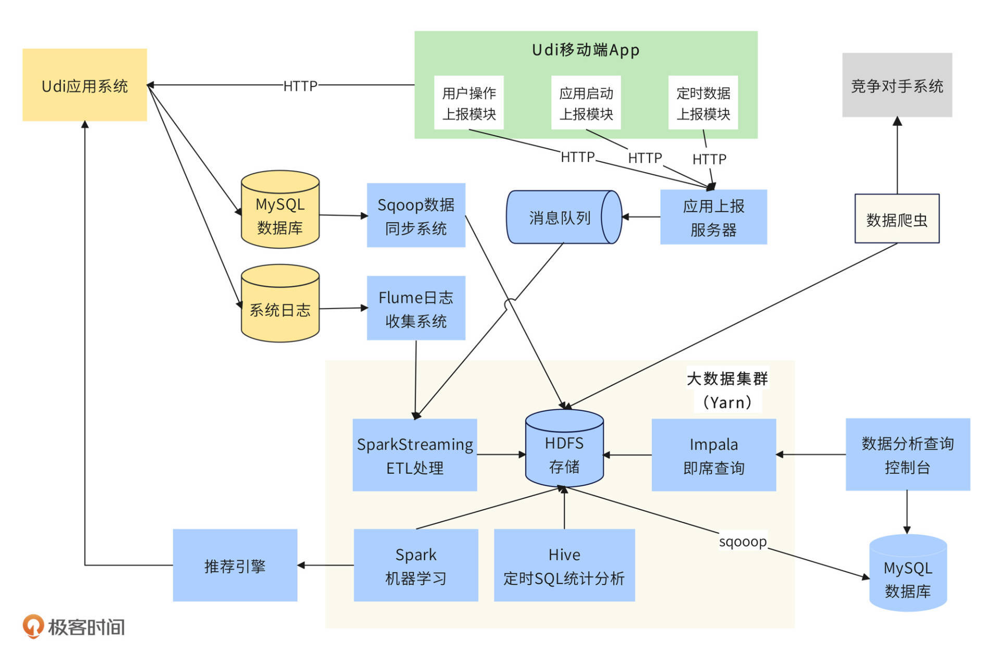
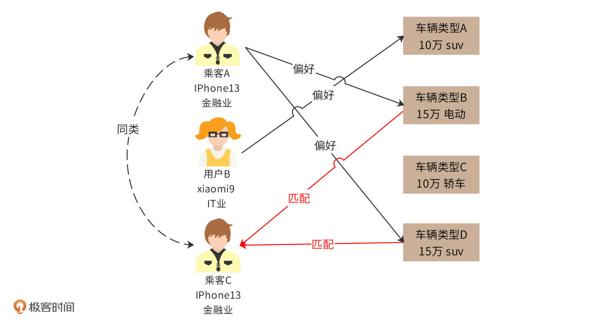

## 海量数据处理技术

### 短 URL 生成器设计

利用散列算法结合布隆过滤器预生成放到存储里，每次获取短链并保存长链和短链的映射关系，请求的时候便可以找到长链了

### 网页爬虫设计

* URL调度器算法

  **URL调度器就需要决定当前先下载哪些URL**，广度优先搜索算法可能会导致爬虫一段时间内总是访问同一个网站

* 去重算法

  布隆过滤器

* 高可用设计

  当服务器宕机后重启时，系统需要能够正确恢复，保证既不会丢失数据，也不会重复下载

### 网盘系统设s计

 

 

 

 

###  **短视频系统设计**

### 分布式存储技术方案

为了应对资源不足的问题，我们常采用水平伸缩，即分布式的方案。数据存储的分布式问题是所有分布式技术中最具挑战性的，因为相对于“无状态”（stateless）的计算逻辑（可执行程序），数据存储是“**有状态**”（stateful）的。无状态的计算逻辑可以在任何一台服务器执行而结果不会改变，但有状态的数据却意味着数据存储和计算资源的绑定：每一个数据都需要存储在特定的服务器上，如果再增加一台空的服务器，它没有数据，也就无法提供数据访问，无法实现伸缩。

数据存储的“有状态”特性还会带来其他问题：为了保证数据存储的可靠性，数据必须多备份存储，也就是说，同一个数据需要存储在多台服务器上。那么又如何保证多个备份的数据是一致的？

因此，海量数据存储的核心问题包括：如何利用分布式服务器集群实现海量数据的统一存储？如何正确选择服务器写入并读取数据？为了保证数据的高可用性，如何实现数据的多备份存储？数据多备份存储的时候，又如何保证数据的一致性？

为了解决这些问题，在这个模块的案例设计中，我们使用了多个典型的分布式存储技术方案：分布式文件系统HDFS、分布式NoSQL数据库HBase、分布式关系数据库。下面我们就来回顾这几个典型技术方案。你可以再重新审视一下，我们案例中的技术选型是否恰当，是否有改进的空间

#### HDFS

HDFS作为短URL、爬虫下载文件、短视频文件的存储方案。HDFS，即Hadoop分布式文件系统，其架构如下

 

HDFS的关键组件有两个，一个是NameNode，另一个是DataNode。

NameNode负责整个分布式文件系统的元数据管理，也就是文件路径名、访问权限、数据块ID、存储位置等信息。而DataNode负责文件数据的存储和读写操作，HDFS将文件数据分割成若干数据块（Block），每个DataNode存储一部分数据块，这样文件就分布存储在了整个HDFS服务器集群中。

HDFS集群会有很多台DataNode服务器（一般几百到几千不等），每台服务器配有数块硬盘，整个集群的存储容量大概在几PB到数百PB。通过这种方式，HDFS可以存储海量的文件数据。

HDFS为了保证数据的高可用，会将一个数据块复制为多份（缺省情况为3份），并将多份相同的数据块存储在不同的服务器上，甚至不同的机架上。这样当有硬盘损坏，或者某个DataNode服务器宕机，甚至某个交换机宕机，导致其存储的数据块不能访问的时候，客户端会查找其备份的数据块进行访问。

HDFS的典型应用场景是大数据计算，即使用MapReduce、Spark这样的计算框架来计算存储在HDFS上的数据。但是作为一个经典的分布式文件系统，我们也可以把HDFS用于海量文件数据的存储与访问，就像我们在这个模块的案例中那样

#### 分布式关系数据库

我们在[网盘案例]中，使用了分片的关系数据来存储元数据信息。这是因为关系数据存在存储结构的限制（使用B+树存储表数据），通常一张表的存储上限是几千万条记录。而在网盘的场景中，元数据在百亿以上，所以我们需要将数据分片存储。

分片的关系数据库，也被称为分布式关系数据库。也就是说，将一张表的数据分成若干片，其中每一片都包含了数据表中一部分的行记录，然后将每一片存储在不同的服务器上，这样一张表就存储在多台服务器上了。通过这种方式，每张表的记录数上限可以突破千万，保存百亿甚至更多的记录。

最简单的数据库分片存储可以采用硬编码的方式，我们在程序代码中直接指定把一条数据库记录存放在哪个服务器上。比如像下图这样，要将用户表分成两片，存储在两台服务器上，那么我们就可以在程序代码中根据用户ID进行分片计算，把ID为偶数（如94）的用户记录存储到服务器1，ID为奇数（如33）的用户记录存储到服务器2。

 

但是硬编码方式的缺点比较明显。如果要增加服务器，那么就必须修改分片逻辑代码，这样程序代码就会因为非业务需求产生不必要的变更；其次，分片逻辑会耦合在业务逻辑的程序代码中，修改分片逻辑或业务逻辑，都可能影响另一部分代码，从而出现Bug。

我们可以使用分布式关系数据库中间件来解决这个问题，在中间件中完成数据的分片逻辑，这样对应用程序是透明的。我们常用的分布式关系数据库中间件是MyCAT，原理如下图。

 

MyCAT是针对MySQL数据库设计的，应用程序可以像使用MySQL数据库一样连接MYCAT，提交SQL命令。MyCAT在收到SQL命令以后，查找配置的分片逻辑规则。

比如上图中，我根据地区进行数据分片，把不同地区的订单存储在不同的数据库服务器上。那么MyCAT就可以解析出SQL中的地区字段prov，根据这个字段连接相对应的数据库服务器。例子中SQL的地区字段是“wuhan”，而在MyCAT中配置“wuhan”对应的数据库服务器是dn1，所以用户提交的这条SQL最终会被发送给DB1@Mysql1数据库进行处理。

#### HBase

分布式关系数据库可以解决海量数据的存储与访问，但是关系数据库本身并不是分布式的，需要通过中间件或者硬编码的方式进行分片，这样对开发和运维并不友好，于是人们又设计出了一系列天然就是分布式的数据存储系统。因为这些数据存储系统通常不支持关系数据库的SQL语法，所以它们也被称为NoSQL数据库。

HBase就是NoSQL数据库中较为知名的一个产品。我们的短URL数据存储、短视频缩略图存储都使用了HBase作为存储方案。上面网盘元数据存储方案使用了分布式关系数据库，事实上，使用HBase这样的NoSQL数据库会是更好的方案。HBase架构如下。

 

HRegion是HBase中负责数据存储的主要进程，应用程序对数据的读写操作都是通过和HRetion通信完成的。也就是说，应用程序如果想要访问一个数据，必须先找到HRegion，然后将数据读写操作提交给HRegion，而HRegion最终将数据存储到HDFS文件系统中。由于HDFS是分布式、高可用的，所以HBase的数据存储天然是分布式、高可用的。

因此HBase的设计重点就是HRegion的分布式。HRegionServer是物理服务器，这些服务器构成一个分布式集群，每个HRegionServer上可以启动多个HRegion实例。当一个 HRegion中写入的数据太多，达到配置的阈值时，一个HRegion会分裂成两个HRegion，并将HRegion在整个集群中进行迁移，以使HRegionServer的负载均衡，进而实现HRegion的分布式。

应用程序如果想查找数据记录，需要使用数据的key。每个HRegion中存储一段Key值区间[key1, key2)的数据，而所有HRegion的信息，包括存储的Key值区间、所在HRegionServer地址、访问端口号等，都记录在HMaster服务器上。因此，应用程序要先访问HMaster服务器，得到数据key所在的HRegion信息，再访问对应的HRegion获取数据。为了保证HMaster的高可用，HBase会启动多个HMaster，并通过ZooKeeper选举出一个主服务器

#### ZooKeeper

我们在上面提到，分布式数据存储为了保证高可用，需要对数据进行多备份存储，但是多份数据之间可能无法保证数据的一致性，这就是著名的CAP原理。

CAP原理认为，一个提供数据服务的分布式系统无法同时满足数据**一致性**（Consistency）、**可用性**（Availibility）、**分区耐受性**（Patition Tolerance）这三个条件，如下图所示。

 

其中，一致性的意思是，每次读取数据，要么读取到最近写入的数据，要么返回一个错误，而不是过期数据，这样就能保证数据一致。

可用性的意思是，每次请求都应该得到一个响应，而不是返回一个错误或者失去响应，不过这个响应不需要保证数据是最近写入的。也就是说，系统需要一直都能正常使用，不会引起调用者的异常，但是并不保证响应的数据是最新的。

分区耐受性的意思是，即使因为网络原因，部分服务器节点之间消息丢失或者延迟了，系统依然应该是可以操作的。

当网络分区失效发生时，要么我们取消操作，保证数据一致性，但是系统却不可用；要么我们继续写入数据，但是数据的一致性就得不到保证。

对于一个分布式系统而言，网络失效一定会发生，也就是说，分区耐受性是必须要保证的，那么可用性和一致性就只能二选一，这就是CAP原理。

由于互联网对高可用的追求，大多数分布式存储系统选择可用性，而放松对一致性的要求。而ZooKeeper则是一个保证数据一致性的分布式系统，它主要通过一个ZAB算法（Zookeeper Atomic Broadcast， Zookeeper原子广播）实现数据一致性，算法过程如下。

 

ZooKeeper集群由多台服务器组成，为了保证多台服务器上存储的数据是一致的，ZAB需要在这些服务器中选举一个Leader，所有的写请求都必须提交给Leader。Leader服务器会向其他服务器（Follower）发起Propose，通知所有服务器：“我们要完成一个写操作请求，请大家检查自己的数据状态是否有问题。”

如果所有Follower服务器都回复Leader服务器ACK，即没有问题，那么Leader服务器会向所有Follower发送Commit命令，要求所有服务器完成写操作。这样包括Leader服务器在内的所有ZooKeeper集群服务器的数据，就都更新并保持一致了。如果有两个客户端程序同时请求修改同一个数据，因为必须要经过Leader的审核，而Leader只接受其中一个请求，数据也会保持一致。

在实际应用中，客户端程序可以连接任意一个Follower，进行数据读写操作。如果是写操作，那么这个请求会被Follower发送给Leader，进行如上所述的处理；如果是读操作，因为所有服务器的数据都是一致的，那么这个Follower直接把自己本地的数据返回给客户端就可以了。

因为ZooKeeper具有这样的特性，所以很多分布式系统都使用ZooKeeper选择主服务器。为了保证系统高可用，像HDFS中的NameNode，或者HBase中的HMaste都需要主主热备，也就是多台服务器充当主服务器，这样任何一台主服务器宕机，都不会影响系统的可用性。

但是在运行期，只能有一台主服务器提供服务，否则系统就不知道该接受哪台服务器的指令，即出现所谓的系统脑裂，因此系统需要选举主服务器。而ZooKeeper的数据一致性特点可以保证只有一台服务器选举成功。在专栏后面的网约车架构案例中，我们也使用了ZooKeeper进行服务器管理。

#### 布隆过滤器

我们在[短URL生成]以及[网络爬虫的案例]中，还使用了布隆过滤器检查内容是否重复，即检查短URL或者网页内容的MD5是否已经存在。如果用Hash表检查重复，千亿级的网页内容MD5就需要一个非常大的Hash表，内存资源消耗非常大。而用布隆过滤器，使用较小的内存就可以检查海量数据中一个数据是否存在。文件MD5重复性检查的布隆过滤器原理如下

 

布隆过滤器首先开辟一块巨大的连续内存空间，比如开辟一个 1600G 比特的连续内存空间，也就是 200GB 大的一个内存空间，并将这个空间所有比特位都设置为 0。然后对每个MD5使用多种Hash算法，比如使用 8 种Hash算法，分别计算 8 个Hash值，并保证每个Hash值是落在这个 1600G 的空间里的，也就是，每个 Hash 值对应 1600G 空间里的一个地址下标。然后根据计算出来的Hash值将对应的地址空间里的比特值设为 1，这样一个MD5就可以将8个比特位设置为 1。

如果要检查一个MD5是否存在，只需要让MD5重复使用这 8 个哈希算法，计算出8个地址下标，然后检查它们里面的二进制数是否全是 1，如果是 ，那么表示这个MD5已经存在了。所以，在海量MD5中检查一个MD5是否存在，布隆过滤器会比哈希表更节约内存空间。

#### 小结

因为数据存储是有状态的，所以海量数据存储的分布式架构要解决的核心问题就是：在一个有很多台服务器的分布式集群中，如何知道数据存储在哪台服务器上？

解决方案有两种，一种是有专门的服务器记录数据存储在哪里，即有一个**元数据服务器**。HDFS里的NameNode和HBase里的HMaster都是这样的角色。应用程序想访问数据，需要先和元数据服务器通信，获取数据存储的位置，再去具体的数据存储服务器上访问数据。

另一种解决方案是通过某种算法计算要访问的数据的位置，这种算法被称作**数据路由算法**。分片数据库的硬编码算法就是一种数据路由算法，根据分片键计算该记录在哪台服务器上。MyCAT其实也是采用路由算法，只不过将硬编码的分片逻辑记录在了配置文件中。

## 高性能架构

### 秒杀系统

#### 系统分析

- **独立开发部署秒杀系统，避免影响现有系统和业务**

秒杀活动只是网站营销的一个附加活动，这个活动具有时间短、瞬间并发访问量大的特点，如果和网站原有应用部署在一起，必然会对现有业务造成冲击，稍有不慎可能导致整个系统瘫痪。

而且由于秒杀时的最高并发访问量巨大，整个电商系统需要部署比平常运营多好几倍的服务器，而这些服务器在绝大部分时候都是用不着的，浪费惊人。所以秒杀业务不能使用正常的电商业务流程，也不能和正常的网站交易业务共用服务器，甚至域名也需要使用自己独立的域名。总之，我们需要设计部署专门的秒杀系统，进行专门应对。

- **防止跳过秒杀页面直接下单**

秒杀的游戏规则是：到了秒杀时间才能开始对商品下单购买。在此时间点之前，只能浏览商品信息，不能下单。而下单页面也是一个普通的 URL，如果得到这个 URL，不用等到秒杀开始就可以下单了。秒杀系统 Apollo 必须避免这种情况

#### 概要设计

要解决的核心问题有：

- 如何设计一个独立于原有电子商务系统的秒杀系统，并独立部署。
- 这个秒杀系统如何承受比正常情况高数百倍的高并发访问压力。
- 如何防止跳过秒杀页面获得下单URL。- 我们将讨论这三个问题的解决方案，并设计秒杀系统部署模型

#### 系统页面设计

秒杀系统为秒杀而设计，不同于一般的网购行为，参与秒杀活动的用户更关心的是如何能快速刷新商品页面，在秒杀开始的时候抢先进入下单页面，而不是精细的商品描述等用户体验细节，因此秒杀系统的页面设计应尽可能简单。秒杀商品页面如图

 

下单表单也尽可能简单，购买数量只能是一个且不可以修改，送货地址和付款方式都使用用户默认设置，没有默认也可以不填，允许等订单提交后修改；只有第一个提交的订单发送给订单子系统，才能成功创建订单，其余用户提交订单后只能看到秒杀结束页面。

秒杀系统只需要设计购买和下单两个页面就可以了，因为不管有多少用户来参与秒杀，只有第一个提交下单的用户才能秒杀成功，因此提交订单并创单成功的用户只有一个，这个时候就没有什么高并发了。所以订单管理、支付以及其他业务都可以使用原来的系统和功能

#### 流量控制

高并发的用户请求会给系统带来巨大的负载压力，严重的可能会导致系统崩溃。虽然我们设计并

部署了独立的秒杀系统，秒杀时的高并发访问压力只会由秒杀系统承担，不会影响到主站的电子商务核心系统，但是秒杀系统的高并发压力依然不容小觑。

此外，秒杀系统为了提高用户参与度和可玩性，秒杀开始的时候，浏览器或App并不会自动点亮购买按钮，而是要求用户不停刷新页面，使用户保持一个高度活跃的状态。但是这样一来，用户在秒杀快要开始的时候拼命刷新页面，会给系统带来更大的高并发压力。

我们知道，**缓存是提高响应速度、降低服务器负载压力的重要手段**。所以，控制访问流量、降低系统负载压力的第一个设计方案就是使用缓存。Apollo采用多级缓存方案，可以更有效地降低服务器的负载压力。

首先，浏览器尽可能在本地缓存当前页面，页面本身的HTML、JavaScript、CSS、图片等内容全部开启浏览器缓存，刷新页面的时候，浏览器事实上不会向服务器提交请求，这样就避免了服务器的访问负载压力。

其次，秒杀系统还使用CDN缓存。CDN即内容分发网络，是由网络运营服务商就近为用户提供的一种缓存服务。秒杀相关的HTML、JavaScript、CSS、图片都可以缓存到CDN中，秒杀开始前，即使有部分用户新打开浏览器，也可以通过CDN加载到这些静态资源，不会访问服务器，又一次避免了服务器的访问负载压力。

同样，秒杀系统中提供HTML、JavaScript、CSS、图片的静态资源服务器和提供商品浏览的秒杀商品服务器也要在本地开启缓存功能，进一步降低服务器的负载压力。

使用多级缓存的秒杀系统部署图如下。

 

以上是针对秒杀开始前，缓存可以降低用户频繁刷新给服务器造成的流量压力。但是秒杀开始后，用户购买和下单的并发请求就不能使用缓存了，但我们仍然需要对高并发的请求流量进行控制。因此，秒杀开始后，秒杀系统会使用一个**计数器**对并发请求进行限流处理，如下图

 

因为最终成功秒杀到商品的用户只有一个，所以需要在用户提交订单时，检查是否已经有其他用户提交订单。事实上，为了减轻下单页面服务器的负载压力，可以控制进入下单页面的入口，只有少数用户能进入下单页面，其他用户则直接进入秒杀结束页面。假设下单服务器集群有 10 台服务器，每台服务器只接受最多10个下单请求，这样整个系统只需要承受100并发就可以了，而秒杀成功的用户也只能出现在这100并发请求中。

事实上，限流是一种非常常用的高并发设计方案，我们会在下个模块专门设计一个通用的限流器。通过缓存和限流这两种设计方案，已经可以应对绝大多数情况下秒杀带来的高并发压力

#### 购买按钮点亮方案设计与下单URL下发

购买按钮只有在秒杀活动开始时才能点亮，在此之前是灰色的。如果该页面是动态生成的，当然可以在服务器端构造响应页面输出，控制该按钮是灰色还是点亮。但是在前面的设计中，为了减轻服务器端负载压力，更好地利用CDN、反向代理等性能优化手段，该页面被设计成了静态页面，缓存在 CDN、秒杀商品服务器，甚至用户浏览器上。秒杀开始时，用户刷新页面，请求根本不会到达应用服务器。

因此，我们需要在秒杀商品静态页面中加入一个特殊的 JavaScript 文件，这个JavaScript 文件设置为不被任何地方缓存。秒杀未开始时，该JavaScript文件内容为空。当秒杀开始时，定时任务会生成新的 JavaScript 文件内容，并推送到JavaScript服务器。

新的JavaScript文件包含了秒杀是否开始的标志和下单页面 URL 的随机数参数。当用户刷新页面时，新JavaScript文件会被用户浏览器加载，根据JavaScript中的参数控制秒杀按钮的点亮。当用户点击按钮时，提交表单的URL参数也来自这个JavaScript文件，如图

 

这个JavaScript文件还有一个优点，那就是它本身非常小，即使每次浏览器刷新都访问 JavaScript 文件服务器，也不会对服务器集群和网络带宽造成太大压力。

#### 部署模型

 

用户在浏览器打开秒杀商品页面，浏览器检查本地是否有缓存该商品信息。如果没有，就通过CDN加载，如果CDN也没有，就访问秒杀商品服务器集群。

用户刷新页面时，除了特殊JavaScript文件，其他页面和资源文件都可以通过缓存获得，秒杀没开始的时候，特殊JavaScript文件内容是空的，所以即使高并发也没有什么负载和带宽访问压力。秒杀开始时，定时任务服务器会推送一个包含点亮按钮指令和下单URL内容的新JavaScript文件，用来替代原来的空文件。用户这时候再刷新就会加载该新的JavaScript文件，使购买按钮点亮，并能进入下单页面。

下单URL中会包含一个随机数，这个随机数也会由定时任务推送给下单服务器，下单服务器收到用户请求的时候，检查请求中包含的随机数是否正确，即检查该请求是否是伪造的。

进入下单服务器的请求会被服务器进行限流处理，每台服务器超过10个的请求会被重定向到秒杀结束页面。只有前十个请求返回下单页面。用户填写下单页面并提交到下单服务器后，需要通过全局计数器进行计数。全局计数器会根据秒杀商品库存数量，确定允许创单的请求个数，超过这个数目的请求也将重定向到秒杀结束页面。最终只有有限的几个用户能够秒杀成功，进入订单处理子系统，完成交易

### 地理空间邻近

​	移动App，用户打开App后，上传、编辑自己的基本信息，然后系统（推荐算法）根据其地理位置和个人信息，为其推荐位置邻近的用户。用户在手机上查看对方的照片和资料，如果感兴趣，希望进一步联系，就向右滑动照片；如果不感兴趣，就向左滑动照片。

​	如果两个人都向右滑动了对方，就表示他们互相感兴趣。系统就通知他们配对成功，并为他们开启聊天功能，可以更进一步了解对方，决定是否建立更深入的关系；

#### 整体架构

 

首先，用户所有请求都通过统一的**网关服务器**处理。网关服务器负责限流、防攻击、用户身份识别及权限验证、微服务调用及数据聚合封装等，而真正的业务逻辑则通过访问微服务来完成。Liao的关键微服务有：用户微服务、图片微服务、配对微服务、聊天微服务、推荐微服务、邻近算法微服务等。Liao的网关预计将承担每天百亿次规模的访问压力。

**用户微服务**管理用户的个人信息、兴趣爱好以及交友偏好等，此外也负责用户登录服务，只有登录用户才能访问系统。因为需要存储十亿条用户数据，所以用户数据库采用分片的MySQL数据库。

**图片微服务**用于管理用户照片，提供用户照片存储及展示的功能。Liao需要存储的图片数大约几百亿张。我们使用Nginx作为图片服务器，图片服务器可以线性扩容，每写满一台服务器（及其Slave服务器），就继续写入下一台服务器。服务器IP、图片路径则记录在用户数据库中。同时，购买CDN服务，缓存热门的用户照片。

**配对**微**服务**负责将互相喜欢的用户配对，通知用户，并加入彼此的通讯录中。用户每次右划操作都调用该微服务。系统设置一个用户每天可以喜欢（右划）的人是有上限的，但是，对于活跃用户而言，长期积累下来，喜欢的人的数量还是非常大的，因此配对微服务会将数据发送给一个流式大数据引擎进行计算。

**推荐微服务**负责向用户展示其可能感兴趣的、邻近的用户。因此，一方面，推荐微服务需要根据用户操作、个人兴趣、交友偏好调用协同过滤等推荐算法进行推荐，另一方面必须保证推荐的用户在当前用户的附近

#### SQL邻近算法

我们可以将用户经、纬度直接记录到数据库中，纬度记录在latitude字段，经度记录在longitude字段，用户当前的纬度和经度为X，Y，如果我们想要查找和当前用户经、纬度距离D之内的其他用户，可以通过如下SQL实现。

```sql
select * from users where latitude between X-D and X+D and longitude between Y-D and Y+D;
```

这样的SQL实现起来比较简单，但是如果有十亿用户，数据分片在几百台服务器上，SQL执行效率就会很低。而且我们用经、纬度距离进行近似计算，在高纬度地区，这种近似计算的偏差还是非常大的。

同时“between X-D and X+D”以及“between Y-D and Y+D”也会产生大量中间计算数据，这两个betwen会先返回经度和纬度各自区间内的所有用户，再进行交集and处理

我们的用户量非常大，而计算邻近好友又是一个非常高频的访问，同时，分片数据库进行集合计算需要在中间代理服务器或应用程序服务器完成计算，因此，这样的交集计算带来计算负载压力是我们的系统完全不能承受的。所以这个方案可以被放弃。

#### 地理网格邻近算法

我们划分的网格远比图中示意的要密集得多，赤道附近，经、纬度方向每10公里一个网格。

这样每个用户必然会落入到一个网格中，我们在用户表中记录用户所在的网格ID（gridID），然后借助这个字段进行辅助查找，将查找范围限制在用户所在的网格（gridIDx0）及其周围8个网格（gridIDx1 ~ gridIDx8）中，可以极大降低中间数据量，SQL如下。

```sql
select * from users where latitude between X-D and X+D and longitude between Y-D and Y+D and gridID in (gridIDx0,gridIDx1,gridIDx2,gridIDx3,gridIDx4,gridIDx5,gridIDx6,gridIDx7,gridIDx8);
```

这条SQL要比上面SQL的计算负载压力小得多，但是对于高频访问的分片数据库而言，用这样的SQL进行邻近好友查询依然是不能承受的，同样距离精度也不满足要求。

但是基于这种网格设计思想，我们发现，我们可以不通过数据库就能实现邻近好友查询：我们可以**将所有的网格及其包含的用户都记录在内存中**。当我们进行邻近查询时，只需要在内存中计算用户及其邻近的8个网格内的所有用户的距离即可。

我们可以估算下所有用户经、纬度都加载到内存中需要的内存量：\(\\small 1G\\times3\\times4B=12GB\)（用户ID、经度、纬度，都采用4个字节编码，总用户数1G）。这个内存量是完全可以接受的。

实际上，通过恰当地选择网格的大小，我们不停访问当前用户位置周边的网格就可以由近及远不断得到邻近的其他用户，而不需要再通过SQL来得到。那么如何选择网格大小？如何根据用户位置得到其所在的网格？又如何得到当前用户位置周边的其他网格呢？我们看下实践中更常用的动态网格和GeoHash算法

#### 动态网格算法

事实上，不管如何选择网格大小，可能都不合适。因为在陆家嘴即使很小的网格可能就包含近百万的用户，而在可可西里，非常大的网格也包含不了几个用户。

因此，我们希望能够动态设定网格的大小，如果一个网格内用户太多，就把它分裂成几个小网格，小网格内如果用户还是太多，继续分裂更小的网格，如下图。

 

这是一个四叉树网格结构，开始的时候整个地球只有一个网格，当用户增加，超过阈值（500个用户）的时候，就分裂出4个子树，4个子树对应父节点网格的4个地理子网格。同时，将用户根据位置信息重新分配到4个子树中。同样，如图中所示，如果某个子树中的用户增加，超过了阈值，该子树继续分裂成4个子树。

因此，我们可以将全球用户分配在这样一个4叉树网格结构中，所有的用户都必然在这个4叉树的叶子节点中，而且每个节点内包含的用户数不超过500个。那么，陆家嘴的网格可能就会很小，而可可西里的网格就会很大，太平洋对应的网格可能有几千公里。

当给定当前用户的经、纬度，查询邻近用户的时候，首先从根节点开始查找，如果根节点就是叶子节点，那么直接遍历根节点中的所有用户，计算距离即可。如果根节点不是叶子节点，那么根据给定的经、纬度判断其在网格中的位置，左上、右上、右下、左下，4个位置，顺序对应4个子树，根据网格位置访问对应的子树。如果子树是叶子节点，那么在叶子节点中查找，如果不是叶子节点，继续上面的过程，直到叶子节点。

上面的过程只能找到当前用户所在网格的好友，如何查找邻近网格的其他用户呢？事实上，我们只需要将4叉树所有的叶子节点顺序组成一个双向链表，每个节点在链表上的若干个前驱和后继节点正好就是其地理位置邻近的节点。

动态网格也叫4叉树网格，在空间邻近算法中较为常用，也能满足Liao的需求。但是编程实现稍稍有点麻烦，而且如果网格大小设计不合适，导致树的高度太高，每次查找需要遍历的路径太长，性能结果也比较差。我们再看下性能和灵活性更好的GeoHash算法

#### GeoHash算法（重点）

除了动态网格算法，GeoHash事实上是另外一种变形了的网格算法，同时也是Redis中Geo函数使用的算法。GeoHash是将网格进行编码，然后根据编码进行Hash存储的一种算法。

经、纬度数字的不同精度，意味着经、纬度的误差范围，比如保留经、纬度到小数点后第1位，那么误差范围最大可能会达到11公里（在赤道附近）。也就是说，小数点后1位精度的经、纬度，其覆盖范围是一个11km * 11km的网格。

那么，我们用小数点后1位精度的经、纬度做key，网格内的用户集合做value，就可以构建一个Hash表的对。通过查找这个KV对及其周围8个网格的KV对，计算这些value内所有用户和当前用户的距离，就可以找到邻近11公里内的所有用户。

实践中，redis的GeoHash并不会直接用经、纬度做key，而是采用一种基于Z阶曲线的编码方式，将二维的经、纬度，转化为一维的二进制数字，再进行base32编码，具体过程如下。

首先，分别针对经度和纬度，求取当前区间（对于纬度而言，开始的区间就是[-90, 90], 对于经度而言，开始区间就是[-180, 180]）的平均值，将当前区间分为两个区间。然后用用户的经、纬度和区间平均值进行比较，用户经、纬度必然落在两个区间中的一个，如果大于平均值，那么取1，如果小于平均值，那么取0。继续求取当前区间的平均值，进一步将当前区间分为两个区间。如此不断重复，可以在经度和纬度方向上，得到两个二进制数。这个二进制数越长，其所在的区间越小，精度越高。

下图表示经、纬度<42.60411, -5.59041>的二进制编码过程，最终得到纬度12位编码，经度13位编码。


得到两个二进制数后，再将它们合并成一个二进制数。合并规则是，从第一位开始，奇数位为经度，偶数位为纬度，上面例子合并后的结果为 01101 11111 11000 00100 00010 ，共25位二进制数。

将25位二进制数划分成5组，每组5个二进制数，对应的10进制数是0-31，采用Base32编码，可以得到一个5位字符串，Base32编码表如下。


编码计算过程如下。


最后得到一个字符串“ezs42”，作为Hash表的key。25位二进制的GeoHash编码，其误差范围大概2.4公里，即对应一个\(\\small 2.4km\\times2.4km\)的网格。网格内的用户都作为value放入到Hash表中。

一般说来，通过选择GeoHash的编码长度，实现不同大小的网格，就可以满足我们邻近交友的应用场景了。但是在Redis中，需要面对更通用的地理位置计算场景，所以Redis中的GeoHash并没有用Hash表存储，而是用跳表存储。

Redis使用52位二进制的GeoHash编码，误差范围0.6米。Redis将编码后的二进制数按照Z阶曲线的布局，进行一维化展开。即将二维的经、纬度上的点，用一条Z型曲线连接起来，Z阶曲线布局示例如下图。


事实上，所谓的Z阶曲线布局，本质其实就是基于GeoHash的二进制排序。将这些经过编码的2进制数据用跳表存储。查找用户的时候，可以快速找到该用户，沿着跳表前后检索，得到的就是邻近的用户。

邻近算法最终选择使用Hash表存储的GeoHash算法，经度采用13bit编码，纬度采用12bit编码，即最后的GeoHash编码5个字符，每个网格\(\\small 4.9km\\times4.9km\\approx 25km^{2}\)，将整个地球分为\(\\small 2^{25}\\approx3300万\)个网格，去掉海洋和几乎无人生存的荒漠极地，需要存储的Hash键不到500万个，采用Hash表存储。Hash表的key是GeoHash编码，value是一个List，其中包含了所有相同GeoHash编码的用户ID。

查找邻近好友的时候，Liao将先计算用户当前位置的GeoHash值（5个字符），然后从Hash表中读取该Hash值对应的所有用户，即在同一个网格内的用户，进行匹配，将满足匹配条件的对象返回给用户。如果一个网格内匹配的对象数量不足，计算周围8个网格的GeoHash值，读取这些Hash值对应的用户列表，继续匹配。

### 搜索引擎

#### 技术挑战

- 针对爬虫获取的海量数据，如何高效地进行数据管理；
- 当用户输入搜索词的时候，如何快速查找包含搜索词的网页内容；
- 如何对搜索结果的网页内容进行排序，使排在搜索结果列表前面的网页，正好是用户期望看到的内容

#### 整体架构

 

分布式爬虫通过存储服务器将爬取的网页存储到分布式文件集群HDFS，为了提高存储效率，网页将被压缩后存储。存储的时候，网页一个文件挨着一个文件地连续存储，存储格式如下。

 

每个网页被分配得到一个8字节长整型docID，docID之后用2个字节记录网页的URL的长度，之后4个字节记录压缩后网页内容数据的长度，所有存储的网页的头14个字节都是同样的格式。之后存储URL字符串和压缩后的网页内容数据。读取文件的时候，先读14个字节的头信息，根据头信息中记录的URL长度和数据长度，再读取对应长度的URL和网页内容数据。

搜索引擎能够快速查找的核心就是利用索引，根据用户的查询内容查找匹配的索引，根据索引列表构建结果页面。索引的构造主要通过索引构造器完成，索引构造器读取HDFS中的网页内容，解压缩后提取网页中的单词，构建一个“docID->单词列表”的正排索引。然后，索引构造器再根据这个正排索引构建一个“单词->docID列表”的倒排索引，“docID列表”就是包含了这个单词的所有网页列表。利用这个倒排索引，搜索器可以快速获得用户搜索词对应的所有网页。

网页中所有的单词构成了一个词典，实际上，词典就是一个Hash表，key就是单词，value就是倒排索引的网页列表。虽然互联网页的内容非常庞大，但是使用到的单词其实是非常有限的。根据Google的报告，256M内存可以存放1400万个单词，这差不多就是英文单词的全部了。

在构建索引的过程中，因为要不断修改索引列表，还要进行排序，所以，有很多操作是需要进行加锁同步完成的。对于海量的互联网页的计算，这样的索引构建速度太慢了。因此我们设计了64个索引桶，根据docID取模，将不同网页分配到不同的桶中，在每个桶中分别进行索引构建，通过并行计算来加快索引处理速度。

索引构造器在读取网页内容、构造索引的时候，还会调用URL提取器，将网页中包含的URL提取出来，构建一个链接关系表。链接关系表的格式是“docID->docID”，前一个docID是当前网页的docID，后一个docID是当前网页中包含的URL对应的docID。一个网页中会包含很多个URL，也就是会构建出很多个这样的链接关系。后面会利用这个链接关系表，使用PageRank排名算法对所有网页进行打分排名，当索引器得到查找的网页列表时，利用PageRank值进行排名，最终呈现给用户，保证用户最先看到的网页是最接近用户期望的结果页面

一个运行良好的搜索引擎的核心技术就是索引和排名，所以我们将分别说明这两种技术要点。

#### 索引

索引构造器从HDFS读取网页内容后，解析每个页面，提取网页里的每个单词。如果是英文，那么每个单词都用空格分隔，比较容易；如果是中文，需要使用中文分词器才能提取到每个单词，比如“高并发架构”，使用中文分词器得到的就是“高并发”、“架构”两个词。

首先，索引构造器将所有的网页都读取完，构建出所有的“docID->单词列表”正排索引。


然后遍历所有的正排索引，再按照“单词→docID列表”的方式组织起来，就是倒排索引了。


我们这个例子中只有两个单词、7个网页。事实上，Bingoo数以千亿的网页就是这样通过倒排索引组织起来的，网页数量虽然庞大，但是单词数却是比较有限的。所以，整个倒排索引的大小相比于网页数量要小得多。Bingoo将每个单词对应的网页列表存储在硬盘中，而单词则存储在内存的Hash表，也就是词典中，词典示例：


对于部分热门的单词，整个网页列表也可以存储在内存中，相当于缓存。在词典中，每个单词记录下硬盘或者内存中的网页列表地址，这样只要搜索单词，就可以快速得到对应的网页地址列表。Bingoo根据列表中的网页编号docID，展示对应的网页信息摘要，就完成了海量数据的快速检索。

如果用户的搜索词正好是一个单词，比如“高并发”，那么直接查找词典，得到网页列表就完成查找了。但是如果用户输入的是一个句话，那么搜索器就需要将这句话拆分成几个单词，然后分别查找倒排索引。这样的话，得到的就是几个网页列表，还需要对这几个网页列表求交集，才能得到最终的结果列表。

比如，用户输入“高并发架构”进行搜索，那么搜索器就会拆分成两个词：“高并发”、“架构”，得到两个倒排索引：

高并发->2,3,5,7

架构->1,2,4

需要对这两个倒排索引求交集，也就是同时包含“高并发”和“架构”的网页才是符合搜索要求的结果，最终的交集结果应该是只有一篇网页，即docID为2的满足要求。

列表求交集最简单的实现就是双层for循环，但是这种算法的时间复杂度是O(n^2)，我们的网页列表长度（n）可能有千万级甚至更高，这样的计算效率太低。

一个改进的算法是**拉链法**，我们将网页列表先按照docID的编号进行排序，得到的就是这样两个有序链表：


同时遍历两个链表，如果其中一个链表当前指向的元素小于另一个链表当前指向的元素，那么这个链表就继续向前遍历；如果两个链表当前指向的元素相同，该元素就是交集元素，记录在结果列表中；依此继续向前遍历，直到其中一个链表指向自己的尾部nil。

拉链法的时间复杂度是O(2n)，远优于双层循环。但是对于千万级的数据而言，还是太慢。我们还可以采用**数据分片**的方式进行并行计算，以实现性能优化。

比如，我们的docID分布在[0, 1万亿)区间，而每个倒排索引链表平均包含1千万个docID。我们把所有的docID按照1千亿进行数据分片，就会得到10个区间[0, 1千亿)[1千亿，2千亿)……[9千亿，1万亿)。每个倒排索引链表大致均匀分布在这10个区间，我们就可以依照这10个区间范围，将每个要遍历的链表切分为10片，每片大约包含1百万个docID。两个链表只在自己对应的分片内求交集即可，因此我们可以启动10个线程对10个分片进行并行计算，速度可提高10倍。

事实上，两个1千万长度的链表求交集，最终的结果可能不过几万，也就是说，大部分的比较都是不相等的。比如下面的例子。


第一个链表遍历到自己的最后一个元素，才和第二个链表的第一个元素相同。那么第一个链表能不能跳过前面那些元素呢？很自然，我们想到可以用**跳表**来实现，如下图。


**跳表实际上是在链表上构建多级索引**，在索引上遍历可以跳过底层的部分数据，我们可以利用这个特性实现链表的跳跃式比较，加快计算速度。使用跳表的交集计算时间复杂度大约是O(log(n))。

此外，虽然搜索引擎利用倒排索引已经能很快得到搜索结果了，但搜索引擎应用还会使用缓存对搜索进行加速，将整个搜索词对应的搜索结果直接放入缓存，以减少倒排索引的访问压力，以及不必要的集合计算。

#### PageRank排名算法

Bingoo使用PageRank算法进行网页结果排名，以保证搜索结果更符合用户期待。

PageRank算法会根据网页的链接关系给网页打分。如果一个网页A包含另一个网页B的超链接，那么就认为A网页给B网页投了一票。一个网页得到的投票越多，说明自己越重要；越重要的网页给自己投票，自己也越重要。

PageRank算法就是计算每个网页的PageRank值，最终的搜索结果也是以网页的PageRank值排序，展示给用户。事实证明，这种排名方法非常有效，PageRank值更高的网页，确实更满足用户的搜索期望。

以下面四个网页A、B、C、D举例，带箭头的线条表示链接。


B网页包含了A、D两个页面的超链接，相当于B网页给A、D每个页面投了一票，如果初始的时候，所有页面都是1分，那么经过这次投票后，B给了A和D每个页面1/2分（B包含了A、D两个超链接，所以每个投票值1/2分），自己从C页面得到1/3分（C包含了A、B、D三个页面的超链接，每个投票值1/3分）。

而A页面则从B、C、D分别得到1/2，1/3，1分。用公式表示就是

\(\\small PR（A） = \\frac{PR（B）}{2}+\\frac{PR（C）}{3}+\\frac{PR（D）}{1}\)

等号左边是经过一次投票后，A页面的PageRank分值；等号右边每一项的分子是包含A页面超链接的页面的PageRank分值，分母是该页面包含的超链接数目。

这样经过一次计算后，每个页面的PageRank分值就会重新分配，重复同样的算法过程，经过几次计算后，根据每个页面PageRank分值进行排序，就得到一个页面重要程度的排名表。根据这个排名表，将用户搜索出来的网页结果排序，排在前面的通常也正是用户期待的结果。

但是这个算法还有个问题，如果某个页面只包含指向自己的超链接，其他页面不断给它送分，而自己一分不出，随着计算执行次数越多，它的分值也就越高，这显然是不合理的。这种情况就像下图所示的，A页面只包含指向自己的超链接。


解决方案是，设想浏览一个页面的时候，有一定概率不是点击超链接，而是在地址栏输入一个URL访问其他页面，表示在公式上，就是

\(\\small PR（A） = \\alpha(\\frac{PR（B）}{2}+\\frac{PR（C）}{3}+\\frac{PR（D）}{1})+\\frac{（1-\\alpha）}{4}\)

上面\(\\small （1-\\alpha）\)就是跳转到其他任何页面的概率，通常取经验值0.15(即\(\\small \\alpha\) 为0.85)，因为有一定概率输入的URL是自己的，所以加上上面公式最后一项，其中分母4表示所有网页的总数。

那么对于N个网页，任何一个页面\(\\small P_{i}\)的PageRank计算公式如下：

\(\\small PageRank（P_{i}）=\\alpha \\sum_{P_{j}\\in M(P_{i})}^{}{\\frac{PageRank(P_{j})}{L(P_{j})}} + \\frac{1-\\alpha}{N}\)

公式中，\(\\small P_{j}\\in M(P_{i})\) 表示所有包含有\(\\small P_{i}\)超链接的\(\\small P_{j}\)，\(\\small L(P_{j})\)表示\(\\small P_{j}\)页面包含的超链接数，N表示所有的网页总和。由于Bingoo要对全世界的网页进行排名，所以这里的N是一个万亿级的数字。

计算开始的时候，将所有页面的PageRank值设为1，带入上面公式计算，每个页面都得到一个新的PageRank值。再把这些新的PageRank值带入上面的公式，继续得到更新的PageRank值，如此迭代计算，直到所有页面的PageRank值几乎不再有大的变化才停止。

### 反应式编程

反应式编程本质上是一种异步编程方案，在多线程（协程）、异步方法调用、异步I/O访问等技术基础之上，提供了一整套与异步调用相匹配的编程模型，从而实现程序调用非阻塞、即时响应等特性，即开发出一个反应式的系统，以应对编程领域越来越高的并发处理需求。

反应式系统应该具备如下的4个特质。

- **即时响应**：应用的调用者可以即时得到响应，无需等到整个应用程序执行完毕。也就是说应用调用是非阻塞的。
- **回弹性**：当应用程序部分功能失效的时候，应用系统本身能够进行自我修复，保证正常运行，保证响应，不会出现系统崩溃和宕机的情况。
- **弹性**：系统能够对应用负载压力做出响应，能够自动伸缩以适应应用负载压力，根据压力自动调整自身的处理能力，或者根据自身的处理能力，调整进入系统中的访问请求数量。
- **消息驱动**：功能模块之间、服务之间通过消息进行驱动，以完成服务的流程。

目前主流的反应式编程框架有RxJava、Reactor等，它们的主要特点是基于**观察者设计模式**的异步编程方案，编程模型采用函数式编程。

观察者模式和函数式编程有自己的优势，但是反应式编程并不是必须用观察者模式和函数式编程。我们准备开发一个纯消息驱动，完全异步，支持命令式编程的反应式编程框架，框架名称为“Flower”。

#### 需求分析

互联网及物联网场景下的应用系统开发，基本上都是高并发系统开发。也就是说，在同一个时刻，会有大量的用户或设备请求到达系统，进行计算处理。但是传统的编程模型都是阻塞式编程，阻塞式编程有什么特点，会产生什么问题呢？我们来看一段代码示例。

```csharp
void a(){
  ....
  int x = m();
  int y = n();
  return x + y;
}
```

在方法a中调用了方法m，那么在方法m返回之前，就不会调用方法n，即方法a被方法m阻塞了。这种编程模型下，方法m和方法n不能同时执行，系统的运行速度就不会快，并发处理能力就不会很高。

还有更严重的情况。服务器通常为每个用户请求创建一个线程，而创建的总线程数是有限的，每台服务器通常几百个。如果方法m是一个远程调用，处理比较慢，当方法a调用方法m时，执行方法a的线程就会被长期挂起，无法释放。如果所有线程都因为方法m而无法释放，导致服务器线程耗尽，就会使服务器陷入假死状态，外部表现就是服务器宕机，失去响应，系统严重故障。

Flower框架应该满足如下典型Web应用的线程特性。


当并发用户请求到达应用服务器时，Web容器线程不需要执行应用程序代码，它只是将用户的HTTP请求变为请求对象，将请求对象异步交给Flower框架的Service去处理，而Web容器线程自身立刻就返回。

如果是传统的阻塞式编程，Web容器线程要完成全部的请求处理操作，直到返回响应结果才能释放线程，所以需要很多Web容器线程。但使用Flower框架只需要极少的容器线程就可以处理较多的并发用户请求，而且容器线程不会阻塞。

同样，在Flower框架中，用户请求交给业务Service对象以后，Service之间依然是使用异步消息通讯而非阻塞式的调用。一个Service完成业务逻辑处理计算以后，会返回一个处理结果，这个结果会以消息的方式异步发送给下一个Service。

#### 概要设计

Flower框架实现异步无阻塞，一方面是利用了Java Web容器的异步特性，主要是Servlet3.0以后提供的AsyncContext，快速释放容器线程；另一方面则利用了异步的数据库驱动和异步的网络通信，主要是HttpAsyncClient等异步通信组件。而Flower框架内，核心应用代码之间的异步无阻塞调用，则是利用了Akka 的Actor模型。

Akka Actor的异步消息驱动实现如下。



一个Actor向另一个Actor发起通讯时，当前Actor就是一个消息的发送者Sender，它需要获得另一个Actor的ActorRef，也就是一个引用，通过引用进行消息通信。而ActorRef收到消息以后，会将这个消息放到目标Actor的Mailbox里面，然后就立即返回了。

也就是说，一个Actor向另一个Actor发送消息时，不需要等待对方真正地处理这个消息，只需要将消息发送到目标Actor的Mailbox里面就可以了。Sender不会被阻塞，可以继续执行自己的其他操作。而目标Actor检查自己的Mailbox中是否有消息，如果有，则从Mailbox里面获取消息，并进行异步的处理。而所有的Actor会共享线程，这些线程不会有任何的阻塞。

但是Actor编程模型无法满足人们日常的编程习惯以及Flower的命令式编程需求，所以我们需要将Akka Actor封装到一个Flower的编程框架中，并通过Flower提供一个新的编程模型。

Flower基于Akka的Actor进行开发，将Service封装到Actor里面，并且将Actor收到的消息作为参数传入Service进行调用。

Flower框架的主要元素包括：Flower Service（服务）、Flower 流程和Flower容器。其中，Service实现一个细粒度的服务功能，Service之间会通过Message关联，前一个Service的返回值（Message），必须是后一个Service的输入参数（Message）。而Flower容器就负责在Service间传递Massage，从而使Service按照业务逻辑编辑成一个Flow（流程）。

在Flower内部，消息是一等公民，基于Flower开发的应用系统是面向消息的应用系统。消息由Service产生，是Service的返回值；同时消息也是Service的输入。前一个Service的返回消息是下一个Service的输入消息，**没有耦合**的Service正是通过消息关联起来，组成一个Service流程，并最终构建出一个拥有完整处理能力的应用系统。流程举例：

```markdown
// -> service1 -> service2 -> service5 -> service4
//      ^      |             ^              |
//      |       -> service3 -|              |
//      |___________________________________|
```

#### 详细设计

Flower核心类图如下。


Flower框架核心关键类及其职责如下：

1. Service以及HttpService接口是框架的编程核心，开发者开发的Service需要实现Service或者HttpService接口。HttpService与Service的不同在于HttpService在接口方法中传递Web参数，开发者利用Web接口可以将计算结果直接print到HTTP客户端；
2. ServiceFactory负责用户以及框架内置的service实例管理（加载*.services文件）；
3. ServiceFlow负责流程管理（加载*.flow文件）；
4. ServiceActor将Service封装到Actor。

Flower初始化及调用时序图如下。



图中包含两个过程，第一个过程是**服务流程初始化**过程。首先，开发者通过ServiceFacade调用已经定义好的服务流程。然后，ServiceFacade根据传入的flow名和service名，创建第一个ServiceActor。这个ServiceActor将通过ServiceFactory来装载Service实例，并通过ServiceFlow获得当前Service在流程中所配置的后续Service（可能有多个）。依此递归，创建后续Service的ServiceActor，并记录其对应的ActorRef。

时序图中的第二个过程是**消息流处理**过程。调用者发送给ServiceFacade的消息，会被flow流程中的第一个ServiceActor处理，这个ServiceActor会调用对应的Service实例，并将Service实例的返回值作为消息发送给流程定义的后续ServiceActor。

使用Flower框架开发应用程序，就是开发各种Service，开发服务Service类必须实现Flower框架的Service接口或者HTTP接口，在process方法内完成服务业务逻辑处理。Service代码示例如下。

```java
public class UserServiceA implements Service<User, User> {
  static final Logger logger = LoggerFactory.getLogger(UserServiceA.class);
  @Override
  public User process(User message, ServiceContext context) throws Throwable {
    message.setDesc(message.getDesc() + " --> " + getClass().getSimpleName());
    message.setAge(message.getAge() + 1);
    logger.info("结束处理消息, message : {}", message);
    return message;
  }
}
```

##### 服务注册

开发者开发的服务需要在Flower中注册才可以调用，Flower提供两种服务注册方式：配置文件方式和编程方式。

编程方式示例如下。

```cpp
 ServiceFactory serviceFactory = flowerFactory.getServiceFactory();
 serviceFactory.registerService(UserServiceA.class.getSimpleName(), UserServiceA.class);
 serviceFactory.registerService(UserServiceB.class.getSimpleName(), UserServiceB.class);
 serviceFactory.registerService(UserServiceC1.class.getSimpleName(), UserServiceC1.class);
```

配置文件方式支持用配置文件进行注册，服务定义配置文件扩展名: .services，放在classpath下，Flower框架自动加载注册，比如flower_test.services。配置文件内容如下。

```ini
UserServiceA = com.ly.train.flower.base.service.user.UserServiceA
UserServiceB = com.ly.train.flower.base.service.user.UserServiceB
UserServiceC1 = com.ly.train.flower.base.service.user.UserServiceC1
```

##### 流程编排

在Flower中，服务之间的依赖关系不能通过传统的服务之间依赖调用实现，如开头的方法a调用方法m那样。而需要通过流程编排方式，实现服务间依赖。服务编排方式也有两种，配置文件方式和编程方式。

下面的例子演示的是以**编程方式**编排流程。

```cpp
// UserServiceA -> UserServiceB -> UserServiceC1
final String flowName = "flower_test";
ServiceFlow serviceFlow = serviceFactory.getOrCreateServiceFlow(flowName);
serviceFlow.buildFlow(UserServiceA.class, UserServiceB.class);
serviceFlow.buildFlow(UserServiceB.class, UserServiceC1.class);
serviceFlow.build();
```

而流程**配置文件方式**则使用扩展名: .flow，放在classpath下，Flower框架会自动加载编排流程。 比如flower_test.flow，文件名flower_test就是流程的名字，流程执行时需要指定流程名。配置文件内容示例如下。

```rust
UserServiceA -> UserServiceB
UserServiceB -> UserServiceC1
```

我们将服务Service代码开发好，注册到了Flower框架中，并通过流程编排的方式编排了这几个Service的依赖关系，后面就可以用流程名称进行调用了。调用代码示例如下，其中flowName是流程的名字，user是流程中的一个Service名，是流程开始的Service。

```java
final FlowRouter flowRouter = flowerFactory.buildFlowRouter(flowName, 16);
flowRouter.asyncCallService(user);
```

Flower框架源代码及更多资料可参考 https://github.com/zhihuili/flower。

### 高性能架构方案

除了系统并发数，一般说来，和系统性能相关的量化指标还有响应时间和吞吐量。在前面的案例分析中，我们也多次估算过响应时间和吞吐量。我们再重新回顾下这几个指标的定义。


吞吐量、响应时间和并发数三者之间是有关联性的。\(\\small 吞吐量 = 并发数\\div响应时间\)。并发数不变，响应时间足够快，那么单位时间的吞吐量就会相应地提高。

以上这些性能指标，我们可以在系统运行期通过监控系统获取，也可以在系统上线前通过性能测试来获取，以此来了解我们系统的性能特性，以及判断系统能否承受预期的高并发压力。

#### 性能测试

性能测试就是使用性能测试工具，通过多线程模拟用户请求，对系统施加高并发的访问压力，得到以上这些性能指标。事实上，随着请求线程数，即并发数逐渐增加，系统的吞吐量和响应时间会呈现出不同的性能特性。具体说来，整个测试过程又可细分为性能测试、负载测试、压力测试三个阶段。

**性能测试**是以系统设计初期规划的性能指标为预期目标，对系统不断施加压力，验证系统在资源可接受的范围内是否达到了性能预期目标。这个过程中，随着并发数的增加，吞吐量也在增加，但是响应时间变化不大。系统正常情况下的并发访问压力应该都在这个范围内。

**负载测试**则是对系统不断施加并发请求，增加系统的压力，直到系统的某项或多项指标达到安全临界值。这个过程中，随着并发数的增加，吞吐量只有小幅的增加，达到最大值后，吞吐量还会下降，而响应时间则会不断增加。

**压力测试**是指在超过安全负载的情况下，增加并发请求数，对系统继续施加压力，直到系统崩溃或不再处理任何请求，此时的并发数就是系统的最大压力承受能力。这个过程中，吞吐量迅速下降，响应时间迅速增加。到了系统崩溃点，吞吐量为0，响应时间无穷大。

性能压测工具不断增加并发请求线程数，持续对系统进行性能测试、负载测试、压力测试，得到对应的TPS和响应时间，将这些指标画在一个坐标系里，就得到系统的性能特性曲线。


上图中，横轴是系统并发数，左侧黄色纵轴为吞吐量TPS，对应图中黄色曲线。可以看到，随着并发数增加，系统负载压力也不断增加，系统吞吐量是先上升后下降；右侧蓝色纵轴为响应时间，对应图中蓝色曲线，随着并发负载压力的不断增加，系统响应时间先是缓慢增长，到了某个点后，响应时间急剧增加。

通过性能测试，如果发现系统的性能特性并不能满足我们的预期，就需要对系统进行性能优化。架构方面核心的优化思路有三个：**通过分布式集群扩展系统的服务器，降低单一服务器的负载压力；通过缓存的方式降低系统的读负载压力；通过消息队列降低系统的写负载压力**。对应的技术方案分别是：负载均衡、分布式缓存、消息队列，我称之为高性能架构的三板斧。

#### 负载均衡

所谓负载均衡，就是将高并发的用户请求分发到多台应用服务器组成的一个服务器集群上，利用更多的服务器资源处理高并发下的计算压力，提升整体的性能指标。下图是比较常用的应用层负载均衡。


用户的HTTP请求先到达应用层负载均衡服务器，负载均衡服务器从应用服务器集群中选择一台服务器的IP地址(10.0.0.3)，然后将HTTP请求转发给该服务器。该服务器处理完成后，将响应内容返回给负载均衡服务器，再由负载均衡服务器返回给用户。

不同用户并发提交访问请求的时候，负载均衡服务器就会将这些请求分发到不同的应用服务器上，每台应用服务器处理的用户请求并发量都不是很高，而这样构成的一个应用服务器集群却可以承受较高的并发访问压力。

但是，这种应用层负载均衡有个比较大的问题，就是所有请求、响应HTTP通信都需要通过负载均衡服务器，而HTTP协议又是一个比较重的应用层协议，协议的处理需要消耗比较多的计算资源。也就是说，应用层负载均衡服务器将会是整个应用服务器集群的瓶颈。

因此，**应用层负载均衡通常用在规模比较小的集群上**，而对于大规模的应用服务器集群，我们使用IP层负载均衡或者链路层负载均衡。

IP层是网络通讯协议的网络层，所以有时候IP层负载均衡也叫网络层负载均衡。它的主要工作原理是用户的请求到达负载均衡服务器后，负载均衡服务器会对网络层数据包的IP地址进行转换，将其修改为应用服务器的IP地址，然后把数据包重新发送出去，请求数据就会到达应用服务器。如下图。


IP负载均衡不需要在HTTP协议层工作，可以在操作系统内核直接修改IP数据包的地址，所以效率比应用层负载均衡高得多。但不管是请求还是响应的数据包，都要通过负载均衡服务器进行IP地址转换，而响应的数据通常都会比较大，甚至会超过IP负载均衡服务器网卡带宽。因此对于大规模的应用服务器集群，IP层负载均衡服务器还是会成为响应的流量瓶颈。

优化的方案就是采用**链路层负载均衡**。链路层负载均衡服务器并不修改请求数据包的IP地址，而是修改数据链路层里的网卡mac地址，在数据链路层实现负载均衡。应用服务器返回响应数据的时候，因为IP地址没有修改过，所以这个响应会直接到达用户的设备，而不会再经过负载均衡服务器。如下图。


链路层负载均衡避免响应数据再经过负载均衡服务器，因而可以承受较大的数据传输压力，目前大型互联网应用大多使用链路层负载均衡。

#### 分布式缓存

负载均衡可以降低单服务器的并发负载压力，但是需要更多的服务器，同时也无法降低数据库的负载压力。为了弥补这些缺陷，我们还需要使用缓存优化系统性能。所谓缓存，就是将要多次读取的数据暂存起来，这样应用程序就不必从数据源重复加载数据了，以此降低数据源的计算负载压力，提高数据响应速度。

高并发架构中常见的分布式缓存有三种：CDN、反向代理和分布式对象缓存。

**CDN**（Content Delivery Network）即内容分发网络。我们上网的时候，App或者浏览器想要连接到互联网应用的服务器，需要移动、电信这样的网络服务商为我们提供网络服务，建立网络连接才可以上网。而这些服务商需要在全国范围内部署骨干网络、交换机机房，才能完成网络连接服务。

因为这些交换机机房可能会离用户非常近，所以我们自然想到了，互联网应用能不能在这些交换机机房中部署缓存服务器呢？这样的话，用户就可以近距离获得自己需要的数据，既提高了响应速度，又节约了网络带宽和服务器资源。

答案是当然可以。这个部署在网络服务商机房中的缓存就是CDN，因为距离用户非常近，又被称作网络连接的第一跳。目前很多互联网应用大约80%以上的网络流量都是通过CDN返回的。


我们有时候需要通过代理上网，这个代理是代理我们的客户端上网设备。而**反向代理**则是代理服务器，所有的网络请求都需要通过反向代理才能到达应用程序服务器。那么在这里加一个缓存，尽快将数据返回给用户，而不是发送给应用服务器，这就是反向代理缓存。


用户请求到达反向代理缓存服务器，反向代理检查本地是否有需要的数据，如果有就直接返回；如果没有，就请求应用服务器，得到需要的数据后缓存在本地，然后返回给用户。同时，只要将后面的应用服务器部署为一个集群，反向代理服务器在请求后面的应用服务器的时候，进行负载均衡选择，那么这个反向代理缓存服务器也就同时成为了前面讨论的应用层负载均衡服务器。也就是说，一台服务器，既做反向代理服务器，也做负载均衡服务器。

CDN和反向代理缓存对应用程序是透明的，通常被当做系统前端的一部分。而应用程序如果要使用缓存，就需要**分布式对象缓存**。分布式对象缓存访问架构如下图。


多台缓存服务器构成一个缓存集群，缓存数据存储在每台服务器的内存中。每个程序需要依赖一个缓存客户端SDK，通过SDK的API来访问缓存服务器。应用程序先调用API，由API调用SDK的路由算法，路由算法根据缓存的key值，计算这个key应该访问哪台缓存服务器。路由算法计算得到目标服务器的IP地址和端口号后，API再调用SDK的通信模块，将值以及缓存操作命令发送给具体的某台缓存服务器，最终由这台服务器完成缓存操作。

使用缓存架构可以减少不必要的计算，快速响应用户请求。但是缓存只能改善系统的读操作性能，对于写操作，缓存是无能为力的。我们不能把用户提交的数据直接写入缓存中，因为缓存通常被认为是一种不可靠的存储。

#### 消息队列

优化写操作性能的主要手段是使用消息队列，将写操作异步化。典型的应用程序写数据的方式如下图。


应用服务器收到用户写操作请求后，调用数据库操作接口，完成数据写入数据库的操作。但是数据库处理速度比较慢，同时又对并发压力比较敏感。大量操作请求同时提交到数据库，可能会导致数据库负载压力太大而崩溃。

使用消息队列将写操作异步化如下图。


应用服务器收到用户写操作请求后，不是直接调用数据库，而是将写操作请求发送给消息队列服务器，再由消息消费者服务器从消息队列服务器消费消息，完成对数据库的写操作。

这样会带来两个好处。一方面，用户请求发送给消息队列就可以直接返回响应给用户了，而消息队列服务器的处理速度要远远快于数据库，用户端的响应时间可以极大缩短；另一方面，消息队列写数据库的时候，可以根据数据库的负载能力控制写入的速度，即使用户请求并发很高，也不会导致数据库崩溃，消息队列可以使系统运行在一个性能最优的负载压力范围内。

这种在用户请求高并发的时候控制处理速度，在用户请求低谷的时候，继续处理请求的方式叫做“削峰填谷”，如下图。


消息队列将直接调用的高峰访问压力推迟到访问低谷的时候处理，使系统保持在性能最优的状态下运行

微博（microblog）是一种允许用户即时更新简短文本（比如140个字符），并可以公开发布的微型博客形式。今天我们就来开发一个面向全球用户、可以支持10亿级用户体量的微博系统，系统名称为“Weitter”。

我们知道，微博有一个重要特点就是部分明星大V拥有大量的粉丝。如果明星们发布一条比较有话题性的个人花边新闻，比如宣布结婚或者离婚，就会引起粉丝们大量的转发和评论，进而引起更大规模的用户阅读和传播。

这种突发的单一热点事件导致的高并发访问会给系统带来极大的负载压力，处理不当甚至会导致系统崩溃。而这种崩溃又会成为事件热点的一部分，进而引来更多的围观和传播。

因此，Weitter的技术挑战，一方面是微博这样类似的信息流系统架构是如何设计的，另一方面就是如何解决大V们的热点消息产生的突发高并发访问压力，保障系统的可用性。今天我们就来看看这样的系统架构该怎么设计。

### 微博设计

#### 需求分析

Weitter的核心功能只有三个：发微博，关注好友，刷微博。


1. 发微博：用户可以发表微博，内容包含不超过140个字的文本，可以包含图片和视频。
2. 关注好友：用户可以关注其他用户。
3. 刷微博：用户打开自己的微博主页，主页显示用户关注的好友最近发表的微博；用户向下滑动页面（或者点刷新按钮），主页将更新关注好友的最新微博，且最新的微博显示在最上方；主页一次显示20条微博，当用户滑动到主页底部后，继续向上滑动，会按照时间顺序，显示当前页面后续的20条微博。
4. 此外，用户还可以收藏、转发、评论微博。

#### 性能指标估算

系统按10亿用户设计，按20%日活估计，大约有2亿日活用户（DAU），其中每个日活用户每天发表一条微博，并且平均有500个关注者。

而对于**发微博所需的存储空间**，我们做如下估算。

- **文本内容存储空间**

遵循惯例，每条微博140个字，如果以UTF8编码存储汉字计算，则每条微博需要\(\\small 140\\times3=420\)个字节的存储空间。除了汉字内容以外，每条微博还需要存储微博ID、用户ID、时间戳、经纬度等数据，按80个字节计算。那么每天新发表微博文本内容需要的存储空间为100GB。

\(\\small 2亿 \\times (420B +80B) = 100GB/天\)

- **多媒体文件存储空间**

除了140字文本内容，微博还可以包含图片和视频，按每5条微博包含一张图片，每10条微博包含一个视频估算，每张图片500KB，每个视频2MB，每天还需要60TB的多媒体文件存储空间。

\(\\small 2亿\\div5\\times500KB+2亿\\div10\\times2MB=60TB/天\)

对于**刷微博的访问并发量**，我们做如下估算。

- **QPS**

假设两亿日活用户每天浏览两次微博，每次向上滑动或者进入某个人的主页10次，每次显示20条微博，每天刷新微博次数40亿次，即40亿次微博查询接口调用，平均QPS大约5万。

\(\\small 40亿\\div（24\\times60\\times60）=46296/秒\)

高峰期QPS按平均值2倍计算，所以系统需要满足10万QPS。

- **网络带宽**

10万QPS刷新请求，每次返回微博20条，那么每秒需访问200万条微博。按此前估计，每5条微博包含一张图片，每10条微博包含一个视频，需要的**网络总带宽**为4.8Tb/s。

\(\\small （200万\\div5\\times500KB+200万\\div10\\times2MB）\\times8bit=4.8Tb/s\)

#### 概要设计

在需求分析中我们可以看到，Weitter的业务逻辑比较简单，但是**并发量**和**数据量**都比较大，所以，**系统架构的核心就是解决高并发的问题**，系统整体部署模型如下。


这里包含了“Get请求”和“Post请求”两条链路，Get请求主要处理刷微博的操作，Post请求主要处理发微博的请求，这两种请求处理也有重合的部分，我们拆分着来看。

我们先来看看**Get请求**的部分。


用户通过CDN访问Weitter的数据中心、图片以及视频等极耗带宽的请求，绝大部分可以被CDN缓存命中，也就是说，4.8Tb/s的带宽压力，90%以上可以通过CDN消化掉。

没有被CDN命中的请求，一部分是图片和视频请求，其余主要是用户刷新微博请求、查看用户信息请求等，这些请求到达数据中心的反向代理服务器。反向代理服务器检查本地缓存是否有请求需要的内容。如果有，就直接返回；如果没有，对于图片和视频文件，会通过分布式文件存储集群获取相关内容并返回。分布式文件存储集群中的图片和视频是用户发表微博的时候，上传上来的。

对于用户微博内容等请求，如果反向代理服务器没有缓存，就会通过负载均衡服务器到达应用服务器处理。应用服务器首先会从Redis缓存服务器中，检索当前用户关注的好友发表的最新微博，并构建一个结果页面返回。如果Redis中缓存的微博数据量不足，构造不出一个结果页面需要的20条微博，应用服务器会继续从MySQL分片数据库中查找数据。

以上处理流程主要是针对读（http get）请求，那如果是发表微博这样的写（http post）请求呢？我们再来看一下**写请求**部分的图。


你会看到，客户端不需要通过CDN和反向代理，而是直接通过负载均衡服务器到达应用服务器。应用服务器一方面会将发表的微博写入Redis缓存集群，一方面写入分片数据库中。

在写入数据库的时候，如果直接写数据库，当有高并发的写请求突然到来，可能会导致数据库过载，进而引发系统崩溃。所以，数据库写操作，包括发表微博、关注好友、评论微博等，都写入到消息队列服务器，由消息队列的消费者程序从消息队列中按照一定的速度消费消息，并写入数据库中，保证数据库的负载压力不会突然增加。

#### 详细设计

用户刷新微博的时候，如何能快速得到自己关注的好友的最新微博列表？10万QPS的并发量如何应对？如何避免数据库负载压力太大以及如何快速响应用户请求？详细设计将基于功能需求和概要设计，主要讨论这些问题。

##### **微博的发表/订阅问题**

Weitter用户关注好友后，如何快速得到所有好友的最新发表的微博内容，即发表/订阅问题，是微博的核心业务问题。

一种简单的办法就是“推模式”，即建一张用户订阅表，用户关注的好友发表微博后，立即在用户订阅中为该用户插入一条记录，记录用户id和好友发表的微博id。这样当用户刷新微博的时候，只需要从用户订阅表中按用户id查询所有订阅的微博，然后按时间顺序构建一个列表即可。也就是说，**推模式是在用户发**微博**的时候推送给所有的关注者**，如下图，用户发表了微博0，他的所有关注者的订阅表都插入微博0。


推模式实现起来比较简单，但是推模式意味着，如果一个用户有大量的关注者，那么该用户每发表一条微博，就需要在订阅表中为每个关注者插入一条记录。而对于明星用户而言，可能会有几千万的关注者，明星用户发表一条微博，就会导致上千万次的数据库插入操作，直接导致系统崩溃。

所以，对于10亿级用户的微博系统而言，我们需要使用“拉模式”解决发表/订阅问题。也就是说，用户刷新微博的时候，根据其关注的好友列表，查询每个好友近期发表的微博，然后将所有微博按照时间顺序排序后构建一个列表。也就是说，**拉模式是在用户刷微博的时候拉取他关注的所有好友的最新微博**，如下图：


拉模式极大降低了发表微博时写入数据的负载压力，但是却又急剧增加了刷微博时候读数据库的压力。因为对于用户关注的每个好友，都需要进行一次数据库查询。如果一个用户关注了大量好友，查询压力也是非常巨大的。

所以，首先需要限制用户关注的好友数，在Weitter中，普通用户关注上限是2000人，VIP用户关注上限是5000人。其次，需要尽量减少刷新时查询数据库的次数，也就是说，微博要尽量通过缓存读取。

但即使如此，你会发现每次刷新的查询压力还是太大，所以Weitter最终采用“推拉结合”的模式。也就是说，如果用户当前在线，那么就会使用推模式，系统会在缓存中为其创建一个好友最新发表微博列表，关注的好友如果有新发表微博，就立即将该微博插入列表的头部，当该用户刷新微博的时候，只需要将这个列表返回即可。

如果用户当前不在线，那么系统就会将该列表删除。当用户登录刷新的时候，用拉模式为其重新构建列表。

那么如何确定一个用户是否在线？一方面可以通过用户操作时间间隔来判断，另一方面也可以通过机器学习，预测用户的上线时间，利用系统空闲时间，提前为其构建最新微博列表。

##### 缓存使用策略

通过前面的分析我们已经看到，Weitter是一个典型的高并发读操作的场景。10万QPS刷新请求，每个请求需要返回20条微博，如果全部到数据库中查询的话，数据库的QPS将达到200万，即使是使用分片的分布式数据库，这种压力也依然是无法承受的。所以，我们需要大量使用缓存以改善性能，提高吞吐能力。

但是缓存的空间是有限的，我们必定不能将所有数据都缓存起来。一般缓存使用的是LRU淘汰算法，即当缓存空间不足时，将最近最少使用的缓存数据删除，空出缓存空间存储新数据。

但是LRU算法并不适合微博的场景，因为在拉模式的情况下，当用户刷新微博的时候，我们需要确保其关注的好友最新发表的微博都能展示出来，如果其关注的某个好友较少有其他关注者，那么这个好友发表的微博就很可能会被LRU算法淘汰删除出缓存。对于这种情况，系统就不得不去数据库中进行查询。

而最关键的是，系统并不能知道哪些好友的数据通过读缓存就可以得到全部最新的微博，而哪些好友需要到数据库中查找。因此不得不全部到数据库中查找，这就失去了使用缓存的意义。

基于此，我们在Weitter中使用**时间淘汰算法**，**也就是将最近一定天数内发布的微博全部缓存起来，用户刷新微博的时候，只需要在缓存中进行查找。如果查找到的微博数满足一次返回的条数（20条），就直接返回给用户；如果缓存中的微博数不足，就再到数据库中查找。

最终，Weitter决定缓存7天内发表的全部微博，需要的缓存空间约700G。缓存的key为用户ID，value为用户最近7天发表的微博ID列表。而微博ID和微博内容分别作为key和value也缓存起来。

此外，对于特别热门的微博内容，比如某个明星的离婚微博，这种针对单个微博内容的高并发访问，由于访问压力都集中一个缓存key上，会给单台Redis服务器造成极大的负载压力。因此，微博还会启用**本地缓存模式**，即应用服务器在内存中缓存特别热门的微博内容，应用构建微博刷新页的时候，会优先检查微博ID对应的微博内容是否在本地缓存中。

Weitter最后确定的本地缓存策略是：针对拥有100万以上关注者的大V用户，缓存其48小时内发表的全部微博。

现在，我们来看一下Weitter整体的缓存架构。


##### 数据库分片策略

前面我们分析过，Weitter每天新增2亿条微博。也就是说，平均每秒钟需要写入2400条微博，高峰期每秒写入4600条微博。这样的写入压力，对于单机数据库而言是无法承受的。而且，每年新增700亿条微博记录，这也超出了单机数据库的存储能力。因此，Weitter的数据库需要采用分片部署的分布式数据库。分片的规则可以采用用户ID分片或者微博 ID分片。

如果按用户ID（的hash值）分片，那么一个用户发表的全部微博都会保存到一台数据库服务器上。这样做的好处是，当系统需要按用户查找其发表的微博的时候，只需要访问一台服务器就可以完成。

但是这样做也有缺点，对于一个明星大V用户，其数据访问会成热点，进而导致这台服务器负载压力太大。同样地，如果某个用户频繁发表微博，也会导致这台服务器数据增长过快。

要是按微博 ID（的hash值）分片，虽然可以避免上述按用户ID分片的热点聚集问题，但是当查找一个用户的所有微博时，需要访问所有的分片数据库服务器才能得到所需的数据，对数据库服务器集群的整体压力太大。

综合考虑，用户ID分片带来的热点问题，可以通过优化缓存来改善；而某个用户频繁发表微博的问题，可以通过设置每天发表微博数上限（每个用户每天最多发表50条微博）来解决。最终，Weitter采用按用户ID分片的策略。

#### 小结

微博事实上是**信息流应用产品**中的一种，这类应用都以滚动的方式呈现内容，而内容则被放置在一个挨一个、外观相似的版块中。微信朋友圈、抖音、知乎、今日头条等，都是这类应用。因此这些应用也都需要面对微博这样的发表/订阅问题：**如何为海量高并发用户快速构建页面内容**？

在实践中，信息流应用也大多采用文中提到的**推拉结合模式**，区别只是朋友圈像微博一样推拉好友发表的内容，而今日头条则推拉推荐算法计算出来的结果。同样地，这类应用为了加速响应时间，也大量使用CDN、反向代理、分布式缓存等缓存方案。所以，熟悉了Weitter的架构，就相当于掌握了信息流产品的架构。

### 全球维基百科

Wepedia的功能比较简单，只有编辑词条和搜索查看词条这两个核心功能。但是Wepedia的设计目标是支撑每日10亿次以上的访问压力。因此设计目标主要是简单、高效地支持高并发访问，以及面对全球用户时保证\(\\small 7\\times24\)小时高可用。

#### 概要设计

Wepedia的整体架构，也就是简化的部署模型如图。


在梳理Wepedia整体逻辑之前，先说明下架构图中核心组件的作用。


用户在Web端查看一个百科词条的时候，首先通过GeoDNS进行域名解析，得到离用户最近的数据中心所属的CDN服务器的IP地址。用户浏览器根据这个IP地址访问CDN服务器，如果CDN服务器上缓存有用户访问的词条内容，就直接返回给用户；如果没有，CDN会访问和自己在同一个区域的Wepedia的数据中心服务器。

准确地说，CDN访问的是Wepedia数据中心负载均衡服务器LVS的IP地址。请求到达LVS后，LVS会将该请求分发到某个Nginx服务器上。Nginx收到请求后，也查找自己服务器上是否有对应的词条内容，如果没有，就将请求发送给第二级LVS负载均衡服务器。

接着，第二级LVS将请求分发给某个Apache服务器，Apache会调用PHP程序处理该请求。PHP程序访问Redis服务器集群，确认是否有该词条的对象。如果有，就将该对象封装成HTML响应内容，返回给用户；如果没有，就访问MySQL数据库来查找该词条的数据内容。PHP程序一方面会将MySQL返回的数据构造成对象，然后封装成HTML返回用户，一方面会将该对象缓存到Redis。

如果用户的HTTP请求是一个图片，那么Nginx则会访问LightHttp服务器，获取图片内容。

因为Nginx缓存着词条内容，那么当词条编辑者修改了词条内容时，Nginx缓存的词条内容就会成为脏数据。解决这个问题通常有两种方案，一种是设置失效时间，到了失效时间，缓存内容自动失效，Nginx重新从Apache获取最新的内容。但是这种方案并不适合Wepedia的场景，因为词条内容不会经常被编辑，频繁失效没有意义，只是增加了系统负载压力；而且，在失效时间到期前，依然有脏数据的问题。

Wepedia为了解决Nginx缓存失效的问题，采用了另一种解决方案：失效通知。词条编辑者修改词条后，Invalidation notification模块就会通知所有Nginx服务器，该词条内容失效，进而从缓存中删除它。这样，当用户访问的时候，就不会得到脏数据了。

**多数据中心架构**

Wepedia在全球部署多个数据中心，可以就近为用户提供服务。因为即使是最快的光纤网络，从地球一端访问另一端的数据中心，在通信链路上的延迟就需要近150ms。

\(\\small （地球周长4万KM\\div2）\\div光速30万KM/s\\times请求响应2次通信\\approx133ms\)

150ms是一个人类能够明显感知的卡顿时间。再加上服务器的处理时间，用户的响应等待时间可能会超过1秒钟，而页面加载时间超过1秒钟，用户就会明显不耐烦。多数据中心架构可以通过GeoDNS为用户选择最近的数据中心服务器，减少网络通信延迟，提升用户体验。

另一方面，多数据中心还具有容灾备份功能，如果因为天灾或者人祸导致某个数据中心机房不可用，那么用户还可以访问其他数据中心，保证Wepedia是可用的。

但是多数据中心需要解决**数据一致性**的问题：如果词条编辑者修改词条内容，只记录在距离自己最近的数据中心，那么这份数据就会和其他数据中心的不一致。所以，Wepedia需要在多个数据中心之间进行数据同步，用户不管访问哪个数据中心，看到的词条内容都应该是一样的。

Wepedia的多数据中心架构如图。


Wepedia的多数据中心架构为一主多从架构，即一个主数据中心，多个从数据中心。如果用户请求是Get请求（读请求），那么请求就会在该数据中心处理。如果请求是Post请求（写请求），那么请求到达Nginx的时候，Nginx会判断自己是否为主数据中心，如果是，就直接在该数据中心处理请求；如果不是，Nginx会将该Post请求转发给主数据中心。

通过这种方式，主数据中心根据Post请求更新数据库后，再通过Canal组件将更新同步给其他所有从数据中心的MySQL，从而使所有数据中心的数据保持一致。同样，LightHttp中的图片数据也进行同步，开发LightHttp插件，将收到的图片，发送给所有从数据中心。

数据中心之间采用类似ZooKeeper的选主策略进行通信，如果主数据中心不可用，其他数据中心会重新选举一个主数据中心。而如果某个从数据中心失火了，用户请求域名解析到其他数据中心即可。

这种多数据中心架构虽然使词条编辑操作的时间变长，但是由于Wepedia的绝大多数请求都是Get请求（Get与Post请求比超过1000：1），因此对系统的整体影响并不很大。同时用一种简单、廉价的方式实现多数据中心的数据一致性，开发和运维成本都比较低。

#### 详细设计

作为一个百科服务类网站，Wepedia 主要面临的挑战是：应对来自全球各地的巨量并发的词条查询请求。因此详细设计重点关注Wepedia的性能优化。

##### 前端性能优化

前端是指应用服务器（也就是 PHP 服务器）之前的部分，包括 DNS 服务、 CDN 服务、反向代理服务、静态资源服务等。对 Wepedia 而言，80% 以上的用户请求可以通过前端服务返回，请求根本不会到达应用服务器，这也就使得网站最复杂、最有挑战的PHP应用服务端和存储端压力骤减。

Wepedia 前端架构的核心是反向代理服务器 Nginx 集群，大约需要部署数十台服务器。请求通过 LVS 负载均衡地分发到每台 Nginx 服务器，热点词条被缓存在这里，大量请求可直接返回响应，减轻应用负载压力。而Nginx 缓存 不能命中的请求，会再通过 LVS 发送到 Apache 应用服务器集群。

在反向代理 Nginx 之前，是 CDN 服务，它对于 Wepedia 性能优化功不可没。因为用户查询的词条大部分集中在比重很小的热点词条上，这些词条内容页面缓存在 CDN 服务器上，而 CDN 服务器又部署在离用户浏览器最近的地方，用户请求直接从 CDN 返回，响应速度非常快，这些请求甚至根本不会到达 Wepedia 数据中心的 Nginx 服务器，服务器压力减小，节省的资源可以更快地处理其他未被 CDN 缓存的请求。

Wepedia CDN 缓存的几条准则：

1. 内容页面不包含动态信息，以免页面内容缓存很快失效或者包含过时信息。
2. 每个内容页面有唯一的 REST 风格的 URL，以便 CDN 快速查找并避免重复缓存。
3. 在 HTML 响应头写入缓存控制信息，通过应用控制内容是否缓存及缓存有效期等。

##### **服务端性能优化**

服务端主要是 PHP 服务器，这里是业务逻辑的核心部分，运行的模块都比较复杂笨重，需要消耗较多的资源，Wepedia 需要将最好的服务器部署在这里（和数据库配置一样的服务器），从硬件上改善性能。

除了硬件改善，Wepedia 还需要使用其他开源组件对应用层进行优化：

1. 使用 APC，这是一个 PHP 字节码缓存模块，可以加速代码执行，减少资源消耗。
2. 使用 Tex 进行文本格式化，特别是将科学公式内容转换成图片格式。
3. 替换 PHP 的字符串查找函数 strtr()，使用更优化的算法重构。

##### 存储端性能优化

包括缓存、存储、数据库等被应用服务器依赖的服务都可以归类为存储端服务。存储端服务通常是一些有状态的服务，即需要进行数据存储。这些服务大多建立在网络通信和磁盘操作基础上，是性能的瓶颈，也是性能优化的关键环节。

存储端优化最主要的手段是使用缓存，将热点数据缓存在分布式缓存系统的内存中，加速应用服务器的数据读操作速度，减轻存储和数据库服务器的负载。

Wepedia 的缓存使用策略如下：

1. 热点特别集中的数据直接缓存到应用服务器的本地内存中，因为要占用应用服务器的内存且每台服务器都需要重复缓存这些数据，因此这些数据量很小，但是读取频率极高。
2. 缓存数据的内容尽量是应用服务器可以直接使用的格式，比如 HTML 格式，以减少应用服务器从缓存中获取数据后解析构造数据的代价。
3. 使用缓存服务器存储 session 对象。

作为存储核心数据资产的 MySQL 数据库，需要做如下优化：

1. 使用较大的服务器内存。在 Wepedia 应用场景中，增加内存比增加其他资源更能改善 MySQL 性能。
2. 使用 RAID5 磁盘阵列以加速磁盘访问。
3. 使用MySQL 主主复制及主从复制，保证数据库写入高可用，并将读负载分散在多台服务器。

#### 小结

高可用架构中的各种策略，基本上都是针对一个数据中心内的系统架构、针对服务器级别的软硬件故障而进行设计的。但如果整个数据中心都不可用，比如数据中心所在城市遭遇了地震，机房遭遇了火灾或者停电，不管我们架构的设计多么的高可用，应用依然是不可用的。

为了解决这个问题，同时也为了提高系统的处理能力、改善用户体验，很多大型互联网应用都采用了异地多活的多机房架构策略，也就是说将数据中心分布在多个不同地点的机房里，这些机房都可以对外提供服务。用户可以连接任何一个机房进行访问，这样每个机房都可以提供完整的系统服务，即使某一个机房不可使用，系统也不会宕机，依然保持可用

## 高可用架构

### 限流器设计方案

#### 需求分析

我们将Diana定位为一个限流器组件，即Diana的主要应用场景是部署在微服务网关或者其他HTTP服务器入口，以过滤器的方式对请求进行过滤，对超过限流规则的请求返回“服务不可用”HTTP响应。

Diana的限流规则可通过配置文件获取，并需要支持本地配置和远程配置两种方式，远程配置优先于本地配置。限流方式包括：

- 全局限流：针对所有请求进行限流，即保证整个系统处理的请求总数满足限流配置。
- 账号限流：针对账号进行限流，即对单个账号发送的请求进行限流。
- 设备限流：针对设备进行限流，即对单个客户端设备发送的请求进行限流。
- 资源限流：针对某个资源（即某个URL）进行限流，即保证访问该资源的请求总数满足限流配置。

并且Diana设计应遵循开闭原则，能够支持灵活的限流规则功能扩展，即未来在不修改现有代码和兼容现有配置文件的情况下，支持新的配置规则。

#### 概要设计

Diana的设计目标是一个限流器组件，即Diana并不是一个独立的系统，不可以独立部署进行限流，而是部署在系统网关（或者其他HTTP服务器上），作为网关的一个组件进行限流，部署模型如下：


用户请求（通过负载均衡服务器）到达网关服务器。网关服务器本质也是一个HTTP服务器，限流器是部署在网关中的一个过滤器（filter）组件，和网关中的签名校验过滤器、用户权限过滤器等配置在同一个过滤器责任链（Chain of Responsibility）上。限流器应该配置在整个过滤器责任链的前端，也就是说，如果请求超过了限流，请求不需要再进入其他过滤器，直接被限流器拒绝。

用户请求进入限流器后，根据限流策略，判断该请求是否已经超过限流，如果超过，限流器直接返回状态码为503（Too Many Requests）的响应；如果没有超过限流，请求继续向下处理（经过其他网关过滤器），并最终调用微服务完成处理。

限流器的策略可以在本地配置，也可以通过远程的配置中心服务器加载，即远程配置。远程配置优先于本地配置。

##### 限流模式设计

请求是否超过限流，主要就是判断单位时间请求数量是否超过配置的请求限流数量。单位时间请求数量，可以本地记录，也可以远程记录。方便起见，本地记录称作本地限流，远程记录称作远程限流（也叫分布式限流）。

本地限流意味着，每个网关服务器需要根据本地记录的单位时间请求数量进行限流。假设限流配置为每秒限流50请求，如果该网关服务器本地记录的当前一秒内接受请求数量达到50，那么这一秒内的后续请求都返回503响应。如果整个系统部署了100台网关服务器，每个网关配置本地限流为每秒50，那么，整个系统每秒最多可以处理5000个请求。

远程限流意味着，所有网关共享同一个限流数量，每个网关服务器收到请求后，从远程服务器中获取单位时间内已处理请求数，如果超过限流，就返回503响应。也就是说，可能某个网关服务器一段时间内根本就没有请求到达，但是远程的已处理请求数已经达到了限流上限，那么这台网关服务器也必须拒绝请求。我们使用Redis作为记录单位时间请求数量的远程服务器。

##### 高可用设计

为了保证配置中心服务器和Redis服务器宕机时，限流器组件的高可用。限流器应具有自动降级功能，即配置中心不可用，则使用本地配置；Redis服务器不可用，则降级为本地限流。

#### 详细设计

常用的限流算法有4种，固定窗口（Window）限流算法，滑动窗口（Sliding Window）限流算法，漏桶（Leaky Bucket）限流算法，令牌桶（Token Bucket）限流算法。我们将详细讨论这四种算法的实现。

此外，限流器运行期需要通过配置文件获取对哪些URL路径进行限流；本地限流还是分布式限流；对用户限流还是对设备限流，还是对所有请求限流；限流的阈值是多少；阈值的时间单位是什么；具体使用哪种限流算法。因此，我们需要先看下配置文件的设计。

##### 配置文件设计

Diana限流器使用YAML进行配置，配置文件举例如下：

```sql
Url:/
rules:
 - actor:device
   unit:second
   rpu:10
   algo:TB
   scope:global
 - actor:all
   unit:second
   rpu:50
   algo:W
   scope:local
```

配置文件的配置项有7种，分别说明如下：

1. Url记录限流的资源地址，”/“表示所有请求，配置文件中的路径可以互相包含，比如“/”包含“/sample”，限流器要先匹配“/”的限流规则，如果“/”的限流规则还没有触发（即访问”/“的流量，也就是单位时间所有的请求总和没有达到限流规则），则再匹配“/sample”。
2. 每个Url可以配置多个规则rules，每个规则包括actor，unit，rpu，algo，scope
3. actor为限流对象，可以是账号（actor），设备（device），全部（all）
4. unit为限流时间单位，可以是秒（second），分（minute），时（hour），天（day）
5. rpu为单位时间限流请求数（request per unit），即上面unit定义的单位时间内允许通过的请求数目，如unit为second，rpu为100，表示每秒允许通过100个请求，每秒超过100个请求就进行限流，返回503响应
6. scope为rpu生效范围，可以是本地（local），也可以是全局（global），scope也决定了单位时间请求数量是记录在本地还是远程，local记录在本地，global记录在远程。
7. algo限流算法，可以是window，sliding window，leaky bucket，token bucket 。

Diana支持配置4种限流算法，使用者可以根据自己的需求场景，为不同资源地址配置不同的限流算法，下面详细描述这四种算法实现。

##### **固定窗口（Window）限流算法**

固定窗口限流算法就是将配置文件中的时间单位unit作为一个时间窗口，每个窗口仅允许限制流量内的请求通过，如图。


我们将时间轴切分成一个一个的限流窗口，每个限流窗口有一个窗口开始时间和一个窗口结束时间，窗口开始时，计数器清零，每进入一个请求，计数器就记录+1。如果请求数目超过rpu配置的限流请求数，就拒绝服务，返回503响应。当前限流窗口结束后，就进入下个限流窗口，计数器再次清零，重新开始。处理流程活动图如下。


上图包括“初始化”和“处理流程”两个泳道。初始化的时候，设置“窗口计数器”和“当前窗口结束时间”两个变量。处理请求的时候，判断当前时间是否大于“当前窗口结束时间”，如果大于，那么重置“窗口计数器”和“当前窗口结束时间”两个变量；如果没有，窗口计数器+1，并判断计数器是否大于配置的限流请求数rpu，根据结果决定是否进行限流。

这里的“窗口计数器”可以本地记录，也可以远程记录，也就是配置中的local和global。固定窗口算法在配置文件中algo项可配置“window”或者缩写“W”。

固定窗口实现比较容易，但是如果使用这种限流算法，在一个限流时间单位内，通过的请求数可能是rpu的两倍，无法达到限流的目的，如下图。


假设单位时间请求限流数rpu为100，在第一个限流窗口快要到结束时间的时候，突然进来100个请求，因为这个请求量在限流范围内，所以没有触发限流，请求全部通过。然后进入第二个限流窗口，限流计数器清零。这时又忽然进入100个请求，因为已经进入第二个限流窗口，所以也没触发限流。在短时间内，通过了200个请求，这样可能会给系统造成巨大的负载压力。

##### 滑动窗口（Sliding Window）限流算法

改进固定窗口缺陷的方法是采用滑动窗口限流算法，如下图。


滑动窗口就是将限流窗口内部切分成一些更小的时间片，然后在时间轴上滑动，每次滑动，滑过一个小时间片，就形成一个新的限流窗口，即滑动窗口。然后在这个滑动窗口内执行固定窗口算法即可。

滑动窗口可以避免固定窗口出现的放过两倍请求的问题，因为一个短时间内出现的所有请求必然在一个滑动窗口内，所以一定会被滑动窗口限流。

滑动窗口的算法实现基本和固定窗口一致，只要改动重置“窗口计数器”和“当前窗口结束时间”的逻辑就可以。固定窗口算法重置为窗口结束时间+1 unit 时间，滑动窗口算法重置为窗口结束时间+1个时间片。但是固定窗口算法重置后，窗口计数器为0，而滑动窗口需要将窗口计数器设置为当前窗口已经经过的时间片的请求总数，比如上图里，一个滑动窗口被分为5个时间片，滑动窗口2的浅蓝色部分就是已经经过了4个时间片。

滑动窗口算法在配置文件中algo项可配置“sliding window”或者缩写“SW”。

##### 漏桶（Leaky Bucket）限流算法

漏桶限流算法是模拟水流过一个有漏洞的桶进而限流的思路，如图。


水龙头的水先流入漏桶，再通过漏桶底部的孔流出。如果流入的水量太大，底部的孔来不及流出，就会导致水桶太满溢出去。

限流器利用漏桶的这个原理设计漏桶限流算法，用户请求先流入到一个特定大小的漏桶中，系统以特定的速率从漏桶中获取请求并处理。如果用户请求超过限流，就会导致漏桶被请求数据填满，请求溢出，返回503响应。

所以漏桶算法不仅可以限流，当流量超过限制的时候会拒绝处理，直接返回503响应，还能控制请求的处理速度。

实践中，可以采用队列当做漏桶。如图。


构建一个特定长度的队列queue作为漏桶，开始的时候，队列为空，用户请求到达后从队列尾部写入队列，而应用程序从队列头部以特定速率读取请求。当读取速度低于写入速度的时候，一段时间后，队列会被写满，这时候写入队列操作失败。写入失败的请求直接构造503响应返回。

但是使用队列这种方式，实际上是把请求处理异步化了（写入请求的线程和获取请求的线程不是同一个线程），并不适合我们目前同步网关的场景（如果使用前面设计过的Flower框架开发的异步网关就可以用这种队列方式）。

因此Diana实现漏桶限流算法并不使用消息队列，而是阻塞等待。根据限流配置文件计算每个请求之间的间隔时间，例如：限流每秒10个请求，那么每两个请求的间隔时间就必须>=100ms。用户请求到达限流器后，根据当前最近一个请求处理的时间和阻塞的请求线程数目，计算当前请求线程的sleep时间。每个请求线程的sleep时间不同，最后就可以实现每隔100ms唤醒一个请求线程去处理，从而达到漏桶限流的效果。

计算请求线程sleep时间的伪代码如下：

```kotlin
初始化 :
间隔时间 = 100ms;
阻塞线程数 = 0;
最近请求处理时间戳  = 0；

long sleep时间(){
  //最近没有请求，不阻塞
  if((now - 最近请求处理时间戳） >= 间隔时间 and 阻塞线程数 <= 0）{
    最近请求处理时间戳 = now;
    return 0; //不阻塞
  }
  //排队请求太多，漏桶溢出
  if(阻塞线程数 > 最大溢出线程数) {
    return MAX_TIME;//MAX_TIME表示阻塞时间无穷大，当前请求被限流
  }
  //请求在排队，阻塞等待
    阻塞线程数++;
    return 间隔时间 * 阻塞线程数 - (now - 最近请求处理时间戳) ;
}
```

请求线程sleep时间结束，继续执行的时候，修改阻塞线程数：

```lua
最近请求处理时间戳 = now;
阻塞线程数--;
```

注意，以上代码多线程并发执行，需要进行加锁操作。

使用漏桶限流算法，即使系统资源很空闲，多个请求同时到达时，漏桶也是慢慢地一个接一个地去处理请求，这其实并不符合人们的期望，因为这样就是在浪费计算资源。因此除非有特别的场景需求，否则不推荐使用该算法。

漏桶算法的algo配置项名称为“leaky bucket”或者“LB”。

##### 令牌桶（Token Bucket）限流算法

令牌桶是另一种桶限流算法，模拟一个特定大小的桶，然后向桶中以特定的速度放入令牌（token），请求到达后，必须从桶中取出一个令牌才能继续处理。如果桶中已经没有令牌了，那么当前请求就被限流，返回503响应。如果桶中的令牌放满了，令牌桶也会溢出。


上面的算法描述似乎需要有一个专门线程生成令牌，还需要一个数据结构模拟桶。实际上，令牌桶的实现，只需要在请求获取令牌的时候，通过时间计算，就可以算出令牌桶中的总令牌数。伪代码如下：

```kotlin
初始化 :
最近生成令牌时间戳 = 0；
总令牌数 = 0；
令牌生成时间间隔 = 100ms;

boolean 获取令牌(){
  //令牌桶中有令牌，直接取令牌即可
  if(总令牌数 >= 1){
    总令牌数--；
    return true;
  }
  //令牌桶中没有令牌了，重算现在令牌桶中的总令牌数，可能算出的总令牌数依然为0
  总令牌数 = min(令牌数上限值，总令牌数 + 
  (now - 最近生成令牌时间戳) / 令牌生成时间间隔)；
  if(总令牌数 >= 1){
    总令牌数--；
    最近生成令牌时间戳 = now；//有令牌了，才能重设时间
    return true；
  }
  return false；
}
```

令牌桶限流算法综合效果比较好，能在最大程度利用系统资源处理请求的基础上，实现限流的目标，建议通常场景中优先使用该算法，Diana的缺省配置算法也是令牌桶。令牌桶算法的algo配置项名称为“token bucket”或“TB”。

### 高可用架构方案总结

可用性指标反映系统的可用程度，也可以估算出年度不可用时间。我们熟悉的互联网产品（淘宝、百度、微信等）的可用性大多是4个9。


不同的应用可用性可能会相差很大，主要差别就是在面对各种故障的时候，高可用设计做得是否足够好，我总结了一些高可用架构的技术方案，并称之为高可用架构的十种武器。

#### 第一种武器：解耦

耦合度过高是软件设计的万恶之源，也是造成系统可用性问题的罪魁祸首。一个高度耦合的系统，牵一发而动全身，任何微小的改动都可能会导致意想不到的bug和系统崩溃。连最基本的功能维护都已经勉为其难，更不用奢谈什么高可用了。

历数软件技术进化史，就是一部软件开发解耦的历史。从汇编语言到面向过程的语言，再到面向对象的语言，编程语言的要素本身就越来越低耦合。各种编程框架的出现也几乎只有一个目标：使软件变得更加低耦合。Web应用容器使得HTTP协议处理与业务开发解耦，开发者不需要关注网络通信和协议处理，只需要关注请求和响应对象的逻辑处理即可。MVC框架进一步将视图逻辑与业务逻辑解耦，前后端工作进一步分离。

这里，我再介绍两种低耦合的设计原则。

**组件的低耦合原则**：无循环依赖原则，即技术组件之间不能循环依赖，不能A依赖B，B又依赖A；稳定依赖原则，即被依赖的组件尽量稳定，尽量少因为业务变化而变化；稳定抽象原则，即要想使组件稳定，组件就要更加抽象。

**面向对象的低耦合原则**：开闭原则，即对修改封闭、对扩展开放，对象可以扩展新功能，但是不能修改代码；依赖倒置原则，即高层对象不能依赖低层对象，而是要依赖抽象接口，而抽象接口属于高层；接口隔离原则，不要强迫使用者依赖它们不需要的方法，要用接口对方法进行隔离。

#### 第二种武器：隔离

如果说解耦是逻辑上的分割，那么隔离就是物理上的分割。即将低耦合的组件进行独立部署，将不同组件在物理上隔离开来。每个组件有自己独立的代码仓库；每个组件可以独立发布，互不影响；每个组件有自己独立的容器进行部署，互不干扰。

所以，隔离就是分布式技术在业务上的应用，最常见的就是我们前面案例中也多次使用的微服务技术方案。微服务将一个复杂的大应用（单体架构系统）进行拆解，拆分成若干更细粒度的微服务，这些微服务之间互相依赖，实现原来大应用的功能逻辑。然后将这些微服务独立开发和发布，独立部署，微服务之间通过RPC（远程过程调用）进行依赖调用，就是微服务架构。

隔离使得系统间关系更加清晰，故障可以更加隔离开来，问题的发现与解决也更加快速，系统的可用性也更高。

不过，还要强调一下，**隔离必须在低耦合的基础上进行才有意义**。如果组件之间的耦合关系千头万绪、混乱不堪，隔离只会让这种混乱更雪上加霜。

#### 第三种武器：异步

异步可以认为是在隔离的基础上进一步解耦，将物理上已经分割的组件之间的依赖关系进一步切断，使故障无法扩散，提高系统可用性。异步在架构上的实现手段主要是使用消息队列。

比如用户注册的场景。新用户提交注册请求后，需要给用户发送邮件，发送短信，保存数据库，还要将注册消息同步给其他产品等等。如果用微服务调用的方式，那么后续操作任何一个故障，都会导致业务处理失败，用户无法完成注册。

使用消息队列的异步架构，新用户注册消息发送给消息队列就立即返回，后续的操作通过消费消息来完成，即使某个操作发生故障也不会影响用户注册成功。如下图。


#### 第四种武器：备份

备份主要解决硬件故障下系统的可用性，即一个服务部署在多个服务器上，当某个服务器故障的时候，请求切换到其他服务器上继续处理，保证服务是可用的。所以，备份与失效转移（failover）总是成对出现的，共同构成一个高可用解决方案。

**最常见的备份就是负载均衡**，前面的课程中说过，负载均衡主要解决高性能问题。但是，多台服务器构成一个集群，这些服务器天然就是互相备份的关系，任何一台服务器失效，只需要将分发到这台服务器的请求分发给其他服务器即可，如下图


由于应用服务器上只运行程序，不存储数据，所以请求切换到任何一台服务器，处理结果都是相同的。而对于存储数据的服务器，比如数据库，互相备份的服务器必须要互相同步数据，下图是MySQL主主备份的架构图。


#### 第五种武器：重试

远程服务可能会由于线程阻塞、垃圾回收或者网络抖动，而无法及时返回响应，调用者可以通过重试的方式修复单次调用的故障。

需要注意的是，重试是有风险的。比如一个转账操作，第一次请求转账后没有响应，也许仅仅是响应数据在网络中超时了，如果这个时候进行重试，那么可能会导致重复转账，反而造成重大问题。

所以，**可以重试的服务必须是幂等的**。所谓幂等，即服务重复调用和调用一次产生的结果是相同的。有些服务天然具有幂等性，比如将用户性别设置为男性，不管设置多少次，结果都一样。

#### 第六种武器：熔断

重试主要解决偶发的因素导致的单次调用失败，但是如果某个服务器一直不稳定，甚至已经宕机，再请求这个服务器或者进行重试都没有意义了。所以为了保证系统整体的高可用，对于不稳定或者宕机的服务器需要进行熔断。

熔断的主要方式是使用断路器阻断对故障服务器的调用，断路器状态图如下。


断路器有三种状态，关闭、打开、半开。断路器正常情况下是关闭状态，每次服务调用后都通知断路器。如果失败了，失败计数器就+1，如果超过开关阈值，断路器就打开，这个时候就不再请求这个服务了。过一段时间，达到断路器预设的时间窗口后，断路器进入半开状态，发送一个请求到该服务，如果服务调用成功，那么说明服务恢复，断路器进入关闭状态，即正常状态；如果服务调用失败，那么说明服务故障还没修复，断路器继续进入到打开状态，服务不可用。

#### 第七种武器：补偿

前面几种方案都是故障发生时如何处理，而补偿则是故障发生后，如何弥补错误或者避免损失扩大。比如将处理失败的请求放入一个专门的补偿队列，等待失败原因消除后进行补偿，重新处理。

补偿最典型的使用场景是事务补偿。在一个分布式应用中，多个相关事务操作可能分布在不同的服务器上，如果某个服务器处理失败，那么整个事务就是不完整的。按照传统的事务处理思路，需要进行事务回滚，即将已经成功的操作也恢复到事务以前的状态，保证事务的一致性。

传统的事务回滚主要依赖数据库的特性，当事务失败的时候，数据库执行自己的undo日志，就可以将同一个事务的多条数据记录恢复到事务之初的状态。但是分布式服务没有undo日志，所以需要开发专门的事务补偿代码，当分布式事务失效的时候，调用事务补偿服务，将事务状态恢复如初。

#### 第八种武器：限流

在高并发场景下，如果系统的访问量超过了系统的承受能力，可以通过限流对系统进行保护。限流是指对进入系统的用户请求进行流量限制，如果访问量超过了系统的最大处理能力，就会丢弃一部分用户请求，保证整个系统可用。这样虽然有一部分用户的请求被丢弃，但大部分用户还是可以访问系统的，总比整个系统崩溃，所有的用户都不可用要好。

我们在[第15篇]专门讨论过限流器的设计，这里不再赘述。

#### 第九种武器：降级

降级是保护系统高可用的另一种手段。有一些系统功能是非核心的，但是也给系统产生了非常大的压力，比如电商系统中有确认收货这个功能，即便用户不确认收货，系统也会超时自动确认。

但实际上确认收货是一个非常重的操作，因为它会对数据库产生很大的压力：它要进行更改订单状态，完成支付确认，并进行评价等一系列操作。如果在系统高并发的时候去完成这些操作，那么会对系统雪上加霜，使系统的处理能力更加恶化。

解决办法就是在系统高并发的时候（例如淘宝双十一），将确认收货、评价这些非核心的功能关闭，也就是对系统进行降级，把宝贵的系统资源留下来，给正在购物的人，让他们去完成交易。

#### 第十种武器：多活

多活，即异地多活，在多个地区建立数据中心，并都可以对用户提供服务，任何地区级的灾难都不会影响系统的可用。异地多活的架构案例我们已经在[第14讲]讨论过了。异地多活最极端的案例，是某应用准备将自己的服务器发射到太空，即使地球毁灭也能保证系统可用。

异地多活的架构需要考虑的重点是，用户请求如何分发到不同的机房去。这个主要可以在域名解析的时候完成，也就是用户进行域名解析的时候，会根据就近原则或者其他一些策略，完成用户请求的分发。另一个至关重要的技术点是，因为是多个机房都可以独立对外提供服务，所以也就意味着每个机房都要有完整的数据记录。用户在任何一个机房完成的数据操作，都必须同步传输给其他的机房，进行数据实时同步。

数据库实时同步最需要关注的就是数据冲突问题。同一条数据，同时在两个数据中心被修改了，该如何解决？某些容易引起数据冲突的服务采用类似MySQL的主主模式，也就是说多个机房在某个时刻是有一个主机房的，某些请求只能到达主机房才能被处理，其他的机房不处理这一类请求，以此来避免关键数据的冲突。

#### 小结

除了以上的高可用架构方案，还有一些高可用的运维方案。

**通过自动化测试减少系统的Bug**。对于一个稳定运行的系统，每次变更发布可能只改动极小的一部分，如果只测试这一小部分的功能，那么潜在的其他可能引起故障的连带变更就会被忽视，进而可能引发大问题。但是如果全部都回归测试一遍，投入的测试成本又非常高。自动化测试可以实现自动化回归，对于那些没有变更的功能，自动发现是否有引入的Bug或预期之外的变更。

**通过自动化监控尽早发现系统的故障**。监控系统是技术团队的眼睛，没有监控的系统犹如盲人在崎岖的山路狂奔。所以，一个成熟的高可用系统中必定包含着完整的监控系统，实时监控各种技术指标和业务指标的变化。如果系统出现故障，超过设定的阈值就会引发监控系统报警，或者启动自动化故障修复服务。

**通过预发布验证发现测试环境无法发现的Bug**。系统在发布上线之前要经过各种测试，但是测试环境和线上运行环境还是会有很多不同。所以需要在线上集群中部署一台专门的预发布服务器，这台服务器访问的数据和资源完全是线上的，但是不会被用户访问到。开发人员发布代码的时候，先发布到这台预发布服务器，然后在这台服务器上做预发布验证，没有问题才会将代码发布到其他服务器上；如果有问题，也不会影响到用户访问，保证系统的高可用。

此外还可以**通过灰度发布降低软件错误带来的影响**。在一个大规模的应用集群中，每次只发布一小部分服务器，观察没有问题，再继续发布，保证即使程序有Bug，产生的影响也控制在较小的范围内。

## 安全架构

### 非法请求拦截

#### 需求分析

HTTP请求发送到Web服务器时，请求首先到达Zhurong防火墙，防火墙判断请求中是否包含恶意攻击信息。如果包含，防火墙根据配置策略，可选择拒绝请求，返回418状态码；也可以将请求中的恶意数据进行消毒处理，也就是对恶意数据进行替换，或者插入某些字符，从而使请求数据不再具有攻击性，然后再调用应用程序处理。如下图：


Zhurong需要处理的攻击和安全漏洞列表：


#### 概要设计

Zhurong能够发现恶意攻击请求的主要手段，是对HTTP请求内容进行正则表达式匹配，将各种攻击类型可能包含的恶意内容构造成正则表达式，然后对HTTP请求头和请求体进行匹配。如果匹配成功，那么就触发相关的处理逻辑，直接拒绝请求；或者将请求中的恶意内容进行消毒，即进行字符替换，使攻击无法生效。

其中，恶意内容正则表达式是通过远程配置来获取的。如果发现了新的攻击漏洞，远程配置的漏洞攻击正则表达式就会进行更新，并在所有运行了Zhurong防火墙的服务器上生效，拦截新的攻击。组件图如下：


HTTP请求先到达请求过滤器，请求过滤器提取HTTP请求头和HTTP请求体中的数据，这个过滤器其实就是Java中的Filter。过滤器调用漏洞策略处理器进行处理，而漏洞策略处理器需要调用漏洞定义文件加载模块获得漏洞定义规则，漏洞定义文件加载模块缓存了各种漏洞定义规则文件，如果缓存超时，就从远程配置中心重新加载漏洞定义规则。

漏洞定义规则文件是Zhurong的核心，该文件定义了攻击的正则表达式，过滤器正是通过使用这些正则表达式匹配HTTP请求头和HTTP请求体的方式，识别出HTTP请求中是否存在攻击内容。同时，漏洞定义规则文件中还定义了发现攻击内容后的处理方式：是拒绝请求，跳转到出错页面，还是采用消毒的方式，将攻击内容字符进行替换。

漏洞规则定义文件采用XML格式，示例如下：

```xml
<?xml version="1.0"?>

<recipe
    attacktype="Sql"
    path="^/protectfolder/.*$"
    description="Sql injection attacks"
>      
    <ruleSet
        stage = "request"
        condition = "or"
      >       
        <action
            name="forward"
            arg="error.html"
            />
        <rule
            operator = "regex"
            arg = "paramNames[*]"
            value = "select|update|delete|count|*|sum|master|script|'|declare|
　　　　　　　　　　or|execute|alter|statement|executeQuery|count|executeUpdate"
            />
    </ruleSet>  

    <ruleSet
        stage = "response"
        condition = "or"
>   
        <action
           name ="replace"
           arg = " "   
            />   
        <rule
            operator = "regex"
            arg = " responseBody "
            value = "(//.+\n)|(/**.+*/)|(<!--.*-->)"
            />
    </ruleSet>  

</recipe>
```

recipe是漏洞定义文件的根标签，属性attacktype表示处理的攻击类型，有以下几种。

- SQL： SQL注入攻击
- XSS： 跨站点脚本攻击
- CSC： 注释与异常信息泄露
- CSRF： 跨站点请求伪造
- FB： 路径遍历与强制浏览- path表示要处理的请求路径，可以为空，表示处理所有请求路径。

ruleSet是漏洞处理规则集合，一个漏洞文件可以包含多个ruleSet。stage标签表示处理的阶段，请求阶段：request，响应阶段：response。condition表示和其他规则的逻辑关系，“or”表示“或”关系，即该规则处理完成后，其他规则不需要再处理；“and”表示“与”关系，该规则处理完成后，其他规则还需要再处理。

action表示发现攻击后的处理动作。“forward”表示表示跳转到出错页面，后面的“arg”表示要跳转的路径；“replace”表示对攻击内容进行替换，即所谓的消毒，使其不再具有攻击性，后面的“arg”表示要替换的内容。

rule表示漏洞规则，触发漏洞规则，就会引起action处理动作。operator表示如何匹配内容中的攻击内容，“regex”表示正则表达式匹配，“urlmatch”表示URL路径匹配。“arg”表示要匹配的目标，可以是HTTP请求参数名、请求参数值、请求头、响应体、ULR路径。“value”就是匹配攻击内容的正则表达式。

#### 详细设计

Zhurong可以处理的攻击类型有哪些？它们的原理是什么？Zhurong对应的处理方法又是什么？详细设计将解决这些问题。

##### XSS跨站点脚本攻击

XSS 攻击即跨站点脚本攻击(Cross Site Script)，指黑客通过篡改网页，注入恶意 JavaScript脚本，在用户浏览网页时，控制用户浏览器进行恶意操作的一种攻击方式。

常见的 XSS 攻击类型有两种，一种是反射型，攻击者诱使用户点击一个嵌入恶意脚本的链接，达到攻击的目的。如图：


攻击者发布的微博中有一个含有恶意脚本的 URL（在实际应用中，该脚本在攻击者自己的服务器 www.2kt.cn上，URL 中包含脚本的链接），用户点击该 URL，会自动关注攻击者的新浪微博 ID，发布含有恶意脚本 URL 的微博，攻击就被扩散了。

另外一种 XSS 攻击是持久型 XSS 攻击，黑客提交含有恶意脚本的请求，保存在被攻击的 Web 站点的数据库中，用户浏览网页时，恶意脚本被包含在正常页面中，达到攻击的目的。如图：


此种攻击经常使用在论坛、博客等 Web 应用中。

Zhurong采用正则表达式匹配含有XSS攻击内容的请求，正则表达式如下：

```markdown
"(?:\b(?:on(?:(?:mo(?:use(?:o(?:ver|ut)|down|move|up)|ve)|key(?:press|down|up)|c(?:hange|lick)|s(?:elec|ubmi)t|(?:un)?load|dragdrop|resize|focus|blur)\b\W*?=|abort\b)|(?:l(?:owsrc\b\W*?\b(?:(?:java|vb)script|shell)|ivescript)|(?:href|url)\b\W*?\b(?:(?:java|vb)script|shell)|background-image|mocha):|type\b\W*?\b(?:text\b(?:\W*?\b(?:j(?:ava)?|ecma)script\b|[vbscript])|application\b\W*?\bx-(?:java|vb)script\b)|s(?:(?:tyle\b\W*=.*\bexpression\b\W*|ettimeout\b\W*?)\(|rc\b\W*?\b(?:(?:java|vb)script|shell|http):)|(?:c(?:opyparentfolder|reatetextrange)|get(?:special|parent)folder)\b|a(?:ctivexobject\b|lert\b\W*?\())|<(?:(?:body\b.*?\b(?:backgroun|onloa)d|input\b.*?\\btype\b\W*?\bimage)\b|![CDATA[|script|meta)|(?:.(?:(?:execscrip|addimpor)t|(?:fromcharcod|cooki)e|innerhtml)|\@import)\b)"
```

匹配成功后，根据漏洞定义文件，可以选择forward到错误页面，也可以采用replace方式进行消毒，replace消毒表如下：



在XSS攻击字符前后加上“&nbsp;”字符串，使得攻击脚本无法运行，同时在浏览器显示的时候不会影响显示内容。

##### SQL注入攻击

SQL 注入攻击的原理如下：



攻击者在 HTTP 请求中注入恶意 SQL 命令(drop table users;)，服务器用请求参数构造数据库 SQL 命令时，恶意 SQL 被一起构造，并在数据库中执行。

如果在Web页面中有个输入框，要求用户输入姓名，普通用户输入一个普通的姓名Frank，那么最后提交的HTTP请求如下：

```bash
http://www.a.com?username=Frank
```

服务器在处理计算后，向数据库提交的SQL查询命令如下：

```bash
Select id from users where username='Frank';
```

但是恶意攻击者可能会提交这样的HTTP请求：

```bash
http://www.a.com?username=Frank';drop table users;--
```

即输入的uername是：

```vbnet
Frank';drop table users;--
```

这样，服务器在处理后，最后生成的SQL是这样的：

```sql
Select id from users where username='Frank';drop table users;--';
```

事实上，这是两条SQL，一条select查询SQL，一条drop table删除表SQL。数据库在执行完查询后，就将users表删除了，系统崩溃了。

处理SQL注入攻击的rule正则表达式如下。

```ruby
(?:\b(?:(?:s(?:elect\b(?:.{1,100}?\b(?:(?:length|count|top)\b.{1,100}?\bfrom|from\b.{1,100}?\bwhere)|.*?\b(?:d(?:ump\b.*\bfrom|ata_type)|(?:to_(?:numbe|cha)|inst)r))|p_(?:(?:addextendedpro|sqlexe)c|(?:oacreat|prepar)e|execute(?:sql)?|makewebtask)|ql_(?:longvarchar|variant))|xp_(?:reg(?:re(?:movemultistring|ad)|delete(?:value|key)|enum(?:value|key)s|addmultistring|write)|e(?:xecresultset|numdsn)|(?:terminat|dirtre)e|availablemedia|loginconfig|cmdshell|filelist|makecab|ntsec)|u(?:nion\b.{1,100}?\bselect|tl_(?:file|http))|group\b.*\bby\b.{1,100}?\bhaving|load\b\W*?\bdata\b.*\binfile|(?:n?varcha|tbcreato)r|autonomous_transaction|open(?:rowset|query)|dbms_java)\b|i(?:n(?:to\b\W*?\b(?:dump|out)file|sert\b\W*?\binto|ner\b\W*?\bjoin)\b|(?:f(?:\b\W*?\(\W*?\bbenchmark|null\b)|snull\b)\W*?\()|(?:having|or|and)\b\s+?(?:\d{1,10}|'[^=]{1,10}')\s*?[=<>]+|(?:print]\b\W*?\@|root)\@|c(?:ast\b\W*?\(|oalesce\b))|(?:;\W*?\b(?:shutdown|drop)|\@\@version)\b|'(?:s(?:qloledb|a)|msdasql|dbo)')
```

从请求中匹配到SQL注入攻击内容后，可以设置跳转错误页面，也可以选择消毒replace，replace表如下：


##### CSRF跨站点请求伪造攻击

CSRF(Cross Site Request Forgery，跨站点请求伪造)，攻击者通过跨站请求，以合法用户的身份进行非法操作，如转账交易、发表评论等，如图：


CSRF 的主要手法是利用跨站请求，在用户不知情的情况下，以用户的身份伪造请求。其核心是利用了浏览器 Cookie 或服务器 Session 策略，盗取用户身份。

Zhurong的防攻击策略，是过滤器自动在所有响应页面的表单form中添加一个隐藏字段，合法用户在提交请求的时候，会将这个隐藏字段发送到服务器，防火墙检查隐藏字段值是否正确，来确定是否为CSRF攻击。恶意用户的请求是自己伪造的，无法构造这个隐藏字段，就会被防火墙拦截。

1、客户端通过账户密码登录访问网站A。
2、网站A验证客户端的账号密码，成功则生成一个sessionlD，并返回给客户端存储在浏览器中。
3、该客户端Tab—个新页面访问了网站B。
4、网站B自动触发要求该客户端访问网站A。(即在网站B中有链接指向网站A)
5、客户端通过网站B中的链接访问网站A。(此时携带有合法的SessionID进行访问站A的)
6、此时网站A只需检验sessionIlD是否合法，合法则执行相应的操作。(因此具体啥工具就得看链接，以及网站B要求访问时携带的数据)

所以要被CSRF攻击，必须同时满足两个条件：

登录受信任网站A，并在本地生成Cookie。
在不登出A的情况下，访问危险网站B

##### 注释与异常信息泄露

为调试程序方便或其他不恰当的原因，有时程序开发人员会在前端页面程序中使用 HTML 注释语法进行程序注释，这些 HTML 注释就会显示在客户端浏览器，给黑客造成攻击便利。

此外，许多 Web 服务器默认是打开异常信息输出的，即服务器端未处理的异常堆栈信息会直接输出到客户端浏览器，这种方式虽然对程序调试和错误报告有好处，但同时也给黑客造成可乘之机。黑客通过故意制造非法输入，使系统运行时出错，获得异常信息，从而寻找系统漏洞进行攻击。

匹配HTML注释的正则表达式如下：

```xml
“&lt;!--(.|&#x000A;|&#x000D;)*--&gt;”
```

如果匹配到HTML注释，就用空字符串replace该注释。

对于异常信息泄露，Zhurong会检查响应状态码。如果响应状态码为500系列错误，则会进一步匹配响应体内容，检查是否存在错误堆栈信息

### 加密平台

加密、解密过程由加密算法、加密密钥、解密算法、解密密钥组成。下图是一个对称加密、解密过程。对称加密密钥和解密密钥是同一个密钥，调用加密算法可将明文加密为密文，调用解密算法可将密文还原为明文。


所以，如果窃取数据的人知道了解密算法和密钥，即使数据是加密的，也可以轻松对密文进行还原，得到原始的明文数据。而很多时候，解密算法和密钥都以源代码的方式保存在代码仓库里，黑客如果窃取了源代码，或者内部人泄露了源代码，那么所有的秘密就都不是秘密了。

此外，在某些情况下，我们的系统需要和外部系统进行对称加密数据传输，比如和银行加密传输信用卡卡号，这时候涉及到密钥交换，即我方人员和银行人员对接，直接传递密钥。如果因密钥泄露导致重大经济损失，那么持有密钥的人员将无法自证清白，这又会导致没有人愿意保管密钥。

因此，我们设计了一个加解密服务系统，系统名称为“Venus”，统一管理所有的加解密算法和密钥。应用程序只需要依赖加解密服务SDK，调用接口进行加解密即可，而真正的算法和密钥在系统服务端进行管理，保证算法和密钥的安全。

#### 需求分析

一般说来，日常开发中的加解密程序存在如下问题：

1. 密钥（包括非对称加解密证书）保存在源文件或者配置文件中，存储分散而不安全。
2. 密钥没有分片交换机制，不能满足高安全级密钥管理和交换的要求。
3. 密钥缺乏版本管理，不能灵活升级，一旦修改密钥，此前加密的数据就可能无法解密。
4. 加密解密算法程序不统一，同样算法不同实现，内部系统之间密文不能正确解析。
5. 部分加解密算法程序使用了弱加解密算法和弱密钥，存在安全隐患。

为此，我们需要设计开发一个专门的加解密服务及密钥管理系统，以解决以上问题。

Venus是一个加解密服务系统，核心功能是加解密服务，辅助功能是密钥与算法管理。此外，Venus还需要满足以下非功能需求：

- **安全性需求**- 必须保证密钥的安全性，保证没有人能够有机会看到完整的密钥。因此一个密钥至少要拆分成两片，分别存储在两个异构的、物理隔离的存储服务器中 。在需要进行密钥交换的场景中，将密钥至少拆分成两个片段，每个管理密钥的人只能看到一个密钥片段，需要双方所有人分别交接才能完成一次密钥交换。
- **可靠性需求**- 加解密服务必须可靠，即保证高可用。无论在加解密服务系统服务器宕机、还是网络中断等各种情况下，数据正常加解密都需要得到保障。
- **性能需求**- 加解密计算的时间延迟主要花费在加解密算法上，也就是说，加载加解密算法程序、获取加解密密钥的时间必须短到可以忽略不计。

根据以上加解密服务系统功能和非功能需求，系统用例图设计如下：


系统主要参与者（Actor）包括：


系统主要用例过程和功能包括：

1. 开发工程师使用密钥管理功能为自己开发的应用申请加解密算法和密钥；
2. 安全工程师使用密钥管理功能审核算法和密钥的强度是否满足数据安全要求；
3. （经过授权的）密钥管理者使用密钥管理功能可以查看密钥（的一个分片）；
4. 应用程序调用加解密功能完成数据的加密、解密；
5. 加密解密功能和密钥管理功能调用密钥服务功能完成密钥的存储和读取；
6. 密钥服务功能访问一个安全、可靠的密钥存储系统读写密钥。

总地说来，Venus应满足如下需求：

1. 集中、分片密钥存储与管理，多存储备份，保证密钥安全易管理。
2. 密钥申请者、密钥管理者、密钥访问者，多角色多权限管理，保证密钥管理与传递的安全。
3. 通过密钥管理控制台完成密钥申请、密钥管理、密钥访问控制等一系列密钥管理操作，实现便捷的密钥管理。
4. 统一加解密服务API，简单接口，统一算法，为内部系统提供一致的加解密算法实现。

#### 概要设计

针对上述加解密服务及密钥安全管理的需求，设计加解密服务系统Venus整体结构如下：


应用程序调用Venus提供的加解密SDK服务接口，对信息进行加解密，该SDK接口提供了常用的加密解密算法并可根据需求任意扩展。SDK加解密服务接口调用Venus密钥服务器的密钥服务，以取得加解密密钥，并缓存在本地。而密钥服务器中的密钥则来自多个密钥存储服务器，一个密钥分片后存储在多个存储服务器中，每个服务器都由不同的人负责管理。密钥申请者、密钥管理者、安全审核人员通过密钥管理控制台管理更新密钥，每个人各司其事，没有人能查看完整的密钥信息。

##### 部署模型

Venus部署模型如图：


Venus系统的核心服务器是Key Server服务器，提供密钥管理服务。密钥分片存储在文件服务器File Store和数据库DB中。

使用Venus加解密服务的应用程序（Application）部署在应用程序服务器（App Server）中，依赖Venus提供的SDK API进行数据加解密。而Venus SDK 则是访问密钥服务器（Key Server）来获取加解密算法代码和密钥。

安全起见，密钥将被分片存储在文件服务器（Key File Store）和数据库服务器（Key DB）中。所以Key Server服务器中部署了密钥管理组件（Key Manager），用于访问数据库中的应用程序密钥元信息（Key Meta Data），以此获取密钥分片存储信息。Key Server服务器根据这些信息访问File Store和DB，获取密钥分片，并把分片拼接为完整密钥，最终返回给SDK。

此外，密钥管理控制台（Key Console）提供一个web页面，供开发工程师、安全工程师、密钥管理者进行密钥申请、更新、审核、查看等操作。

##### 加解密调用时序图

加解密调用过程如下时序图所示。


1. 应用程序App调用Venus SDK对数据进行加密（解密）。
2. SDK检查在本地是否有缓存加解密需要的密钥和加解密算法代码，如果有缓存，就直接使用该算法和密钥进行加解密。
3. 如果本地没有缓存密钥和算法，请求远程服务器返回密钥和算法。
4. 部署在Venus服务器的Key Manager收到请求后，访问数据库，检查该应用配置的密钥和算法Meta信息。
5. 数据库返回的Mata信息中包括了密钥的分片信息和存储位置，Key Manager访问文件服务器和数据库，获取密钥分片，并将多个分片合并成一个完整密钥，返回给客户端SDK。
6. SDK收到密钥后，缓存在本地进程内存中，并完成对App加解密调用的处理。

通过该设计，我们可以看到，Venus对密钥进行分片存储，不同存储服务器由不同运维人员管理。就算需要进行密钥交换，那么参与交换的人员，每个人也只能获得一个密钥分片，无法得到完整的密钥，这样就保证了密钥的安全性。

密钥缓存在SDK所在的进程（也就是应用程序App所在的进程）中，只有第一次调用时会访问远程的Venus服务器，其他调用只访问本进程缓存。因此加解密的性能只受加解密的数据大小和算法的影响，不受Venus服务的性能影响，满足了性能要求。

同时，由于密钥在缓存中，如果Venus服务器临时宕机，或者网络通信中断，也不会影响到应用程序的正常使用，保证了Venus的可靠性。但是如果Venus服务器长时间宕机，那么应用重新启动，本地缓存被清空，就需要重新请求密钥，这时候应用就不可用了。那么Venus如何在这种情况下仍然保证高可用呢？

解决方案就是对Venus服务器、数据库和文件服务器做高可用备份。Venus服务器部署2-3台服务器，构建一个小型集群，SDK通过软负载均衡访问Venus服务器集群，若发现某台Venus服务器宕机，就进行失效转移。同样，数据库和文件服务器也需要做主从备份。

#### 详细设计

Venus详细设计主要关注SDK核心类设计。其他的例如数据库结构设计、服务器密钥管理Console设计等，这里不做展开。

##### 密钥领域模型

为了便于SDK缓存、管理密钥信息以及SDK与Venus服务端传输密钥信息，我们设计了一个密钥领域模型，如下图：


1. 一个应用程序使用的所有密钥信息都记录在KeyBox对象中，KeyBox对象中有一个keySuitMap成员变量，这个map的key是密钥名称，value是一个KeySuit对象。
2. KeySuit类中有一个keyChainMap成员变量，这个map类的key是版本号，value是一个KeyChain对象。Venus因为安全性需求，需要支持多版本的密钥。也就是说，对同一类数据的加密密钥过一段时间就会进行版本升级，这样即使密钥泄露，也只会影响一段时间的数据，不会导致所有的数据都被解密。
3. KeySuit类的另一个成员变量currentVersion记录当前最新的密钥版本号，也就是当前用来进行数据加密的密钥版本号。而解密的时候，则需要从密文数据中提取出加密密钥版本号（或者由应用程序自己记录密钥版本号，在解密的时候提供给Venus SDK API），根据这个版本号获取对应的解密密钥。
4. 具体每个版本的密钥信息记录在KeyChain中，包含了密钥名称name、密钥版本号version、加入本地缓存的时间cache_time、该版本密钥创建的时间versionTime、对应的加解密算法algorithm，当然，还有最重要的密钥分片列表keyChipList，里面按序记录着这个密钥的分片信息。
5. KeyChip记录每个密钥分片，包括分片编号no，以及分片密钥内容chip。

##### 核心服务类设计

应用程序通过调用加解密API VenusService完成数据加解密。如下图：


1. Venus SDK的核心类是VenusService，应用程序调用该对象的encrypt方法进行加密，decrypt方法进行解密。应用程序需要构造VenusData对象，将加解密数据传给VenusService，VenusService加解密完成后创建一个新的VenusData对象，将加解密的结果写入该对象并返回。VenusData成员变量在后面详细讲解。
2. VenusService通过VenusConnector类连接Venus服务器获取密钥KeyBox和算法Algorithm，并调用Algorithm的对应方法完成加解密。

以加密为例，具体处理过程时序图如下：


首先，应用程序App创建VenusData对象，并将待加密数据写入该对象。接着，App调用VenusService的encrypt方法进行加密，VenusService检查加密需要的密钥和算法是否已经有缓存，如果没有，就调用VenusConnector请求服务器，返回密钥和算法。VenusConnector将根据返回的算法字节码来构造加密算法的实例对象，同时根据返回的密钥构造相关密钥对象，并写入KeyBox，完成更新。

下一步，VenusService会根据更新后的KeyBox中的密钥和算法进行加密，并将加密结果写入VenusData。最后，应用程序App从返回的VenusData中获取加密后的数据即可。

##### 加解密数据接口VenusData设计

VenusData用于表示Venus加解密操作输入和输出的数据，也就是说，加解密的时候构造VenusData对象调用Service对应的方法，加解密完成后返回值还是一个VenusData对象。

VenusData包含的属性如下图：


VenusData用作输入时：

1. 属性bytes和text只要设置一个，即要么处理的是二进制bytes数据，要么是Striing数据，如果两个都设置了，Venus会抛出异常。
2. 属性version可以不设置（即null），表示Venus操作使用的密钥版本是当前版本。
3. 属性outputWithText表示输出的VenusData是否处理为text类型，缺省值是true。
4. 属性dataWithVersion表示加密后的VenusData的bytes和text 中是否包含使用密钥的版本信息，这样在解密的时候可以不指定版本，缺省值是false。

如果dataWithVersion设置为true，即表示加密后密文内包含版本号，这种情况下，VenusService需要在密文头部增加3个字节的版本号信息，其中头两个字节为固定的magic code：0x5E、0x23，第三个字节为版本号（也就是说，密钥版本号只占用一个字节，最多支持256个版本）。

VenusData用作输出时，Venus会设置属性keyName（和输入时的值一样）、version、 bytes、 outputWithText、dataWithVersion（和输入时的值一样），并根据输入的 outputWithText决定是否设置text属性。

##### 测试用例代码demo

```java
    public static void testVenusService() throws Exception {
        // 准备数据
        VenusData data1 = new VenusData();
        data1.setKeyName("aeskey1");
        data1.setText("PlainText");
        // 加密操作
        VenusData encrypt = VenusService.encrypt(data1);
        System.out.printf("Key Name: %s, Secret Text: %s, Version: %d.\n", encrypt.getKeyName(),
                encrypt.getText(), encrypt.getVersion());
        // 准备数据
        VenusData data2 = new VenusData();
        data2.setKeyName("aeskey1");
        data2.setBytes(encrypt.getBytes());
        data2.setVersion(encrypt.getVersion());
        // 解密操作
        VenusData decrypt = VenusService.decrypt(data2);
        System.out.printf("Key Name: %s, Plain Text: %s, Version: %d.\n", decrypt.getKeyName(),
                decrypt.getText(), decrypt.getVersion());
    }
```

### 区块链平台架构

阮一峰博客：

https://www.ruanyifeng.com/blog/2017/12/blockchain-tutorial.html

区块链重构架构文档：

https://learn.lianglianglee.com/%e4%b8%93%e6%a0%8f/%e6%9d%8e%e6%99%ba%e6%85%a7%20%c2%b7%20%e9%ab%98%e5%b9%b6%e5%8f%91%e6%9e%b6%e6%9e%84%e5%ae%9e%e6%88%98%e8%af%be/19%20%e8%ae%b8%e5%8f%af%e5%9e%8b%e5%8c%ba%e5%9d%97%e9%93%be%e9%87%8d%e6%9e%84%ef%bc%9a%e6%97%a0%e4%b8%ad%e5%bf%83%e7%9a%84%e5%8c%ba%e5%9d%97%e9%93%be%e6%80%8e%e4%b9%88%e5%81%9a%e5%88%b0%e5%8f%af%e4%bf%a1%e4%bb%bb%ef%bc%9f.md

## 网约车系统设计

### 系统设计

#### 需求分析

Udi是一个网约车平台，核心功能是将乘客的叫车订单发送给附近的网约车司机，司机接单后，到上车点接乘客并送往目的地，到达后，乘客支付订单。根据平台的分成比例，司机提取一部分金额作为收益，用例图如下：



Udi平台预计注册乘客5亿，日活用户5千万，平均每个乘客1.2个订单，日订单量6千万。平均客单价30元，平台每日总营收18亿元。平台和司机按3：7的比例进行分成，那么平台每天可赚5.4亿元。

另外，平台预计注册司机5千万，日活司机2千万。

#### 概要设计

网约车平台是共享经济的一种，目的就是要将乘客和司机撮合起来，所以需要开发两个App应用，一个是给乘客的，用来叫车；一个是给司机的，用来接单。Udi整体架构如下图：


相应的，Udi的系统也可以分成两个部分，一个部分是面向乘客的。乘客通过手机App注册成为用户，然后就可以在手机上选择出发地和目的地，进行叫车了。乘客叫车的HTTP请求首先通过一个负载均衡服务器集群，到达网关集群，再由网关集群调用相关的微服务，完成请求处理，如下图：


网关处理叫车请求的过程是：网关首先调用订单微服务，为用户的叫车请求创建一个订单，订单微服务将订单记录到数据库中，并将订单状态设置为“创建”。然后网关调用叫车微服务，叫车微服务将用户信息、出发地、目的地等数据封装成一个消息，发送到消息队列，等待系统为订单分配司机。

Udi系统的另一部分是面向司机的，司机需要不停将自己的位置信息发送给平台，同时，还需要随时接收来自平台的指令。因此，不同于用户通过HTTP发送请求给平台，司机App需要通过TCP长连接和平台服务器保持通信，如下图：


Udi司机App每3秒向平台发送一次当前的位置信息，包括当前车辆经纬度，车头朝向等。位置信息通过TCP连接到达平台的TCP连接服务器集群，TCP连接服务器集群的作用类似网关，只不过是以TCP长连接的方式向App端提供接入服务。TCP连接服务器将司机的位置信息更新到地理位置服务。

对于前面已经写入到消息队列的乘客叫车订单信息，分单子系统作为消息消费者，从消息队列中获取并处理。分单子系统首先将数据库中的订单状态修改为“派单中”，然后调用派单引擎进行派单。派单引擎根据用户的上车出发地点，以及司机上传的地理位置信息进行匹配，选择最合适的司机进行派单。派单消息通过一个专门的消息推送服务进行发送，消息推送服务利用TCP长连接服务器，将消息发送给匹配到的司机，同时分单子系统更新数据库订单状态为“已派单”。

#### 详细设计

关于Udi的详细设计，我们将关注网约车平台一些独有的技术特点：长连接管理、派单算法、距离计算。此外，因为订单状态模型是所有交易类应用都非常重要的一个模型，所以我们也会在这里讨论Udi的订单状态模型。

##### 长连接管理

因为司机App需要不断向Udi系统发送当前位置信息，以及实时接收Udi推送的派单请求，所以司机App需要和Udi系统保持长连接。因此，我们选择让司机App和Udi系统直接通过TCP协议进行长连接。

TCP连接和HTTP连接不同。HTTP是无状态的，每次HTTP请求都可以通过负载均衡服务器，被分发到不同的网关服务器进行处理，正如乘客App和服务器的连接那样。也就是说，HTTP在发起请求的时候，无需知道自己要连接的服务器是哪一台。

而TCP是长连接，一旦建立了连接，连接通道就需要长期保持，**不管是司机App发送位置信息给服务器，还是服务器推送派单信息给司机App，都需要使用这个特定的连接通道**。也就是说，司机App和服务器的连接是特定的，司机App需要知道自己连接的服务器是哪一台，而Udi给司机App推送消息的时候，也需要知道要通过哪一台服务器才能完成推送。

所以，司机端的TCP长连接需要进行专门管理，处理司机App和服务器的连接信息，具体架构如下图。


**处理长连接的核心是TCP管理服务器集群**。司机App会在启动时通过负载均衡服务器，与TCP管理服务器集群通信，请求分配一个TCP长连接服务器。

TCP管理服务器检查ZooKeeper服务器，获取当前可以服务的TCP连接服务器列表，然后从这些服务器中选择一个，返回其IP地址和通信端口给司机App。这样，司机App就可以直接和这台TCP连接服务器建立长连接，并发送位置信息了。

TCP连接服务器启动的时候，会和ZooKeeper集群通信，报告自己的状态，便于TCP管理服务器为其分配连接。司机App和TCP连接服务器建立长连接后，TCP连接服务器需要向Redis集群记录这个长连接关系，记录的键值对是<司机ID, 服务器名>。

当Udi系统收到用户订单，派单引擎选择了合适的司机进行派单时，系统就可以通过消息推送服务给该司机发送派单消息。消息推送服务器通过Redis获取该司机App长连接对应的TCP服务器，然后消息推送服务器就可以通过该TCP服务器的长连接，将派单消息推送给司机App了。

长连接管理的主要时序图如下：



如果TCP服务器宕机，那么司机App和它的长连接也就丢失了。司机App需要重新通过HTTP来请求TCP管理服务器为它分配新的TCP服务器。TCP管理服务器收到请求后，一方面返回新的TCP服务器的IP地址和通信端口，一方面需要从Redis中删除原有的<司机ID, 服务器名>键值对，保证消息推送服务不会使用一个错误的连接线路推送消息。

##### 距离计算

乘客发起一个叫车请求时，Udi需要为其寻找合适的司机并进行派单，所谓合适的司机，最主要的因素就是距离。在[第9讲]的交友系统设计中，我们已经讨论过GeoHash算法，Udi就是直接使用Redis的GeoHash进行邻近计算。司机的位置信息实时更新到Redis中，并直接调用Redis的GeoHash命令georadius计算乘客的邻近司机。

但是Redis使用跳表存储GeoHash，Udi日活司机两千万，每3秒更新一次位置信息，平均每秒就需要对跳表做将近7百万次的更新，如此高并发地在一个跳表上更新，是系统不能承受的。所以，我们需要将司机以及跳表的粒度拆得更小。

Udi以城市作为地理位置的基本单位，也就是说，每个城市在Redis中建立一个GeoHash的key，这样，一个城市范围内的司机存储在一个跳表中。对于北京这样的超级城市，还可以更进一步，以城区作为key，进一步降低跳表的大小和单个跳表上的并发量。

##### 派单算法

前面说过，派单就是寻找合适的司机，而合适的主要因素就是距离，所以最简单的派单算法就是直接通过Redis获取距离乘客上车点最近的空闲网约车即可。

但是这种算法效果非常差，因为Redis计算的是两个点之间的空间距离，但是司机必须沿道路行驶过来，在复杂的城市路况下，也许几十米的空间距离行驶十几分钟也未可知。

因此，我们必须用行驶距离代替空间距离，即Udi必须要依赖一个地理系统，对司机当前位置和上车点进行路径规划，计算司机到达上车点的距离和时间。事实上，我们主要关注的是时间，也就是说，派单算法需要从Redis中获取多个邻近用户上车点的空闲司机，然后通过地理系统来计算每个司机到达乘客上车点的时间，最后将订单分配给花费时间最少的司机。

如果附近只有一个乘客，那么为其分配到达时间最快的司机就可以了。但如果附近有多个乘客，那么就需要考虑所有人的等待时间了。比如附近有乘客1和乘客2，以及司机X和司机Y。司机X接乘客1的时间是2分钟，接乘客2的时间是3分钟；司机Y接乘客1的时间是3分钟，接乘客2的时间是5分钟。

如果按照单个乘客最短时间选择，给乘客1分配司机X，那么乘客2只能分配司机Y了，乘客总的等待时间就是7分钟。如果给乘客1分配司机Y，乘客2分配司机X，乘客总等待时间就是6分钟。司机的时间就是平台的金钱，显然，后者这样的派单更节约所有司机的整体时间，也能为公司带来更多营收，同时也为整体用户带来更好的体验。

这样，我们就不能一个订单一个订单地分别分配司机，我们需要将一批订单聚合在一起，统一进行派单，如下图：


分单子系统收到用户的叫车订单后，不是直接发送给派单引擎进行派单，而是发给一个订单聚合池，订单聚合池里有一些订单聚合桶。订单写完一个聚合桶，就把这个聚合桶内的全部订单推送给派单引擎，由派单引擎根据整体时间最小化原则进行派单。

这里的“写完一个聚合桶”，有两种实现方式，一种是间隔一段时间算写完一个桶，一种是达到一定数量算写完一个桶。最后Udi选择间隔3秒写一个桶。

这里需要关注的是，派单的时候需要依赖地理系统进行路径规划。事实上，乘客到达时间和金额预估、行驶过程导航、订单结算与投诉处理，都需要依赖地理系统。Udi初期会使用第三方地理系统进行路径规划，但是将来必须要建设自己的地理系统。

##### 订单状态模型

对于交易型系统而言，订单是其最核心的数据，主要业务逻辑也是围绕订单展开。在订单的生命周期里，订单状态会多次变化，每次变化都是由于核心的业务状态发生了改变，也因此在前面设计的多个地方都提到订单状态。但是这种散乱的订单状态变化无法统一描述订单的完整生命周期，因此我们设计了订单状态模型，如下图：


用户叫车后，系统即为其创建一个订单，订单进入“创单”状态。然后该订单通过消息队列进入分单子系统，分单子系统调用派单引擎为其派单，订单状态进入“派单中”。派单引擎分配到司机，一方面发送消息给司机，一方面修改订单状态为“已派单”。

如果司机去接到乘客，订单状态就改为“行程中”；如果司机拒绝接单，就需要为乘客重新派单，订单重新进入消息队列，同时订单状态也改回为“派单中”；如果司机到达上车点，但是联系不到乘客，没有接到乘客，那么订单就会标记为“已取消”。如果在派单中，乘客自己选择取消叫车，订单也进入“已取消”状态。“已取消”是订单的一种最终状态，订单无法再转变为其他状态。

司机到达目的地后，通过App确认送达，订单进入“待支付”状态，等待用户支付订单金额。用户支付后，完成订单生命周期，订单状态为“已完成”。

订单状态模型可以帮助我们总览核心业务流程，在设计阶段，可以通过状态图发现业务流程不完备的地方，在开发阶段，可以帮助开发者确认流程实现是否有遗漏。

### DDD重构

#### DDD理论

领域是一个组织所做的事情以及其包含的一切，通俗地说，就是组织的业务范围和做事方式，也是软件开发的目标范围。比如对于淘宝这样一个以电子商务为主要业务的组织，C2C电子商务就是它的领域。**领域驱动设计就是从领域出发，分析领域内模型及其关系，进而设计软件系统的方法。**

但是如果我们说要对C2C电子商务这个领域进行建模设计，那么这个范围就太大了，不知道该如何下手。所以通常的做法是把整个领域拆分成多个**子域**，比如用户、商品、订单、库存、物流、发票等。强相关的多个子域组成一个**限界上下文**，它是对业务领域范围的描述，对于系统实现而言，限界上下文相当于是一个子系统或者一个模块。限界上下文和子域共同组成组织的领域，如下：


不同的限界上下文，也就是不同的子系统或者模块之间会有各种的交互合作。如何设计这些交互合作呢？DDD使用**上下文映射图**来完成，如下：


在DDD中，领域模型对象也被称为**实体**。先通过业务分析，识别出实体对象，然后通过相关的业务逻辑，设计实体的属性和方法。而限界上下文和上下文映射图则是微服务设计的关键，通常在实践中，限界上下文被设计为微服务，而上下文映射图就是微服务之间的依赖关系。具体设计过程如下图：


首先，领域专家和团队一起讨论分析业务领域，确认业务期望，将业务分解成若干个业务场景。然后，针对每个场景画UML活动图，活动图中包含泳道，通过高内聚原则对功能逻辑不断调整，使功能和泳道之间的归属关系变得更加清晰合理。**这些泳道最终就是限界上下文，泳道内的功能就是将来微服务的功能边界，泳道之间的调用流程关系，就是将来微服务之间的依赖关系，即上下文映射图。**

但是，这个状态的泳道还不能直接转化成限界上下文。有些限界上下文可能会很大，有些依赖关系可能会比较强。而一个限界上下文不应该超过一个团队的职责范围，因为根据康威定律：组织**架构决定系统架构**，两个团队维护一个微服务，必然会将这个微服务搞成事实上的两个微服务。所以，我们还需要根据团队特性、过往的工作职责、技能经验，重新对泳道图进行调整，使其符合团队的职责划分，这时候才得到限界上下文。

在这个限界上下文基础上，考虑技术框架、非功能需求、服务重用性等因素，进一步进行调整，就得到最终的限界上下文设计，形成我们的微服务架构设计。

我们将遵循上述DDD方法过程对Udi微服务进行重新分析设计，并进行系统重构。

#### 重构设计

首先分析我们的业务领域，通过头脑/事件风暴的形式，收集领域内的所有事件/命令，并识别事件/命令的发起方即对应的实体。最后识别出来的实体以及相关活动如下表：


基于核心实体模型，绘制实体关系图，如下：


在实体间关系明确且完整的前提下，我们就可以针对各个业务场景，绘制场景活动图。活动图比较多，这里仅用拼车场景作为示例，如下：


依据各种重要场景的活动图，参考团队职责范围，结合微服务重用性考虑及非功能需求，产生限界上下文如下表：


针对每个限界上下文进一步设计其内部的聚合、聚合根、实体、值对象、功能边界。以订单限界上下文为例：


上述订单实体的属性和功能如下表：


最后，在实现层面，设计对应的微服务架构如下图：


这是一个基于领域模型的分层架构，最下层为聚合根对象，组合实体与值对象，完成核心业务逻辑处理。上面一层为领域服务层，主要调用聚合根对象完成订单子域的业务，根据业务情况，也会在这一层和其他微服务通信，完成更复杂的、超出当前实体职责的业务，所以这一层也是一个聚合层。

再上面一层是应用服务层，将实体的功能封装成各种服务，供各种应用场景调用。而最上面是一个接口层，提供微服务调用接口。

#### 小结

领域驱动设计很多时候雷声大，雨点小，说起来各种术语满天飞，真正开发实践的时候又无从下手。这节的案例来自一个真实落地的DDD重构设计文档，你可以参考这个文档，按图索骥，应用到自己的开发实践中。

既然说到“按图索骥”，那我认为也有必要在这一节的最后，帮你画一个更有概括性的DDD重构路线图，我们把使用DDD进行系统重构的过程分为以下六步：

1. 讨论当前系统存在的问题，发现问题背后的根源。比如：架构与代码混乱，需求迭代困难，部署麻烦，bug率逐渐升高；微服务边界不清晰，调用依赖关系复杂，团队职责混乱。
2. 针对问题分析具体原因。比如：微服务 A 太庞大，微服务B和C职责不清，团队内业务理解不一致，内部代码设计不良，硬编码和耦合太多。
3. 重新梳理业务流程，明确业务术语，进行DDD战略设计，具体又可以分为三步。- a. 进行头脑风暴，分析业务现状和期望，构建领域语言；- b. 画泳道活动图、结合团队特性设计限界上下文；- c. 根据架构方案和非功能需求确定微服务设计。
4. 针对当前系统实现和DDD设计不匹配的地方，设计微服务重构方案。比如：哪些微服务需要重新开发，哪些微服务的功能需要从A调整到B，哪些微服务需要分拆。
5. DDD技术验证。针对比较重要、问题比较多的微服务进行重构打样，设计聚合根、实体、值对象，重构关键代码，验证设计是否合理以及团队能否驾驭DDD。
6. 任务分解与持续重构。在尽量不影响业务迭代的前提下，按照重构方案，将重构开发和业务迭代有机融合。

### 大数据优化

大数据平台的主要目标是根据用户的不同喜好，为其分配不同的车型，一方面改善用户体验，另一方面也增加平台营收。此外，如何为用户推荐最优的上车点和下车点，如何分析订单和营收波动，如何发现潜在的高风险用户等等，也需要依赖大数据平台。

大数据技术不同于我们前面设计的高并发案例，高并发案例虽然也要处理海量用户的请求，但是每个用户请求都是独立的，计算与存储也是每个用户独立进行的。而大数据技术则要将这些海量的用户数据进行关联计算，因此，适用于高并发架构的各种分布式技术并不能解决大数据的问题。

#### 整体设计

根据Udi大数据应用场景的需求，需要将手机App端数据、数据库订单和用户数据、操作日志数据、网络爬虫爬取的竞争对手数据统一存储到大数据平台，并支持数据分析师、算法工程师提交各种SQL语句、机器学习算法进行大数据计算，并将计算结果存储或返回。Udi大数据平台架构如下图：



##### 大数据采集与导入

Udi大数据平台整体可分为三个部分，第一个部分是大数据采集与导入。这一部分又可以分为4小个部分，App端数据采集、系统日志导入、数据库导入、爬虫数据导入。

App端除了业务功能模块，还需要包含几个数据埋点上报模块。App启动的时候，应用启动上报模块会收集用户手机信息，比如手机型号、系统版本、手机上安装的应用列表等数据；App运行期间，也会通过定时数据上报模块，每5秒上报一次数据，主要是用户当前地理位置数据；用户点击操作的时候，一方面会发送请求到Udi后端应用系统，一方面也会通过用户操作上报模块将请求数据以及其他一些更详细的参数发送给后端的应用上报服务器。

后端的应用上报服务器收到前端采集的数据后，发送给消息队列，SparkStreamin从消息队列中消费消息，对数据进行清洗、格式化等ETL处理，并将数据写入到HDFS存储中。

Udi后端应用系统在处理用户请求的过程中，会产生大量日志和数据，这些存储在日志系统和MySQL数据库中的数据也需要导入到大数据平台。Flume日志收集系统会将Udi后端分布式集群中的日志收集起来，发送给SparkStreaming进行ETL处理，最后写入到HDFS中。而MySQL的数据则通过Sqoop数据同步系统直接导入到HDFS中。

除了以上这些Udi系统自己产生的数据，为了更好地应对市场竞争，Udi还会通过网络爬虫从竞争对手的系统中爬取数据。需要注意的是，这里的爬虫不同于[04讲]中的爬虫，因为竞争对手不可能将订单预估价等敏感数据公开。因此，爬虫需要模拟成普通用户爬取数据，这些爬来的数据也会存储在HDFS中，供数据分析师和产品经理在优化定价策略时分析使用。

##### 大数据计算

Udi大数据平台的第二个部分是大数据计算。写入到HDFS中的数据，一方面供数据分析师进行统计分析，一方面供算法工程师进行机器学习。

数据分析师会通过两种方式分析数据。一种是通过交互命令进行即时查询，通常是一些较为简单的SQL。分析师提交SQL后，在一个准实时、可接受的时间内返回查询结果，这个功能是通过Impala完成的。另外一种是定时SQL统计分析，通常是一些报表类统计，这些SQL一般比较复杂，需要关联多张表进行查询，耗时较长，通过Hive完成，每天夜间服务器空闲的时候定时执行。

算法工程师则开发各种Spark程序，基于HDFS中的数据，进行各种机器学习。

以上这些大数据计算组件，Hive、Spark、SparkStreaming、Impala都部署在同一个大数据集群中，通过Yarn进行资源管理和调度执行。每台服务器既是HDFS的DataNode数据存储服务器，也是Yarn的NodeManager节点管理服务器，还是Impala的Impalad执行服务器。通过Yarn的调度执行，这些服务器上既可以执行SparkStreaming的ETL任务，也可以执行Spark机器学习任务，而执行Hive命令的时候，这些机器上运行的是MapReduce任务。

##### 数据导出与应用

Udi大数据平台的第三个部分是数据导出与应用。Hive命令执行完成后，将结果数据写入到HDFS中，这样并不方便数据分析师或者管理人员查看报表数据。因此还需要用Sqoop将HDFS中的数据导出到MySQL中，然后通过数据分析查询控制台，以图表的方式查看数据。

而机器学习的计算结果则是一些学习模型或者画像数据，将这些数据推送给推荐引擎，由推荐引擎实时响应Udi系统的推荐请求。

大数据平台一方面是一个独立的系统，数据的存储和计算都在其内部完成。一方面又和应用系统有很多关联，数据需要来自应用系统，而计算的结果也需要给应用系统使用。上面的架构图中，属于大数据平台的组件我用蓝色标出，其他颜色代表非大数据平台组件或者系统。

#### 大数据派单引擎设计

我们在第20讲讨论了Udi派单引擎，这个派单引擎并没有考虑乘客和车型的匹配关系。根据Udi的运营策略，车辆新旧程度、车辆等级与舒适程度、司机服务水平会影响到订单的价格。派单成功时，系统会根据不同车辆情况预估不同的订单价格并发送给乘客，但是有些乘客会因为预估价格太高而取消订单，而有些乘客则会因为车辆等级太低而取消订单，还有些乘客则会在上车后因为车辆太旧而给出差评。

Udi需要利用大数据技术优化派单引擎，针对不同类别的乘客匹配尽可能合适的车辆。上面采集了乘客的手机型号及手机内安装应用列表，订单数据记录了乘客上下车地点，乘客评价以及订单取消原因记录了用户乘车偏好，车辆及司机数据记录了车辆级别和司机信息，这些数据最终都会同步到大数据平台。

我们将利用这些数据优化Udi派单引擎。根据用户画像、车辆画像、乘车偏好进行同类匹配。

##### **基于乘客分类的匹配**

根据乘客的注册信息、App端采集的乘客手机型号、手机内安装应用列表、常用上下车地点等，我们可以将乘客分类，然后根据同类乘客的乘车偏好，预测乘客的偏好并进行匹配。



比如根据数据分类，乘客A和乘客C是同类乘客，而乘客A偏好车辆类型B和D。乘客C叫车的时候，那么派单系统会优先给他派单车辆类型B和D。

##### **基于车辆分类的匹配**

事实上，我们可以直接根据车辆类型属性，对车辆类型进行再分类。比如通过机器学习统计分析，车辆类型B和D可以归为一类，那么如果乘客C偏好车辆类型B，那么我们可以认为车辆类型D也匹配他。


使用推荐引擎对派单系统进行优化，为乘客分配更合适的车辆，前提是需要对用户和车辆进行分类与画像，想要完成这部分工作，我们可以在大数据平台的Spark机器学习模块通过聚类分析、分类算法、协同过滤算法，以及Hive统计分析模块进行数据处理，将分类后的数据推送给派单引擎去使用。

派单引擎在原有的最小化等车时间基础上，对派单进行调整，使车辆和乘客偏好更匹配，改善用户体验，也增加了平台营收。

#### 小结

网约车是一个格外依赖大数据进行用户体验优化的应用。比如用户上车点，在一个几千平方米的POI区域内，乘客方便等车，司机不违章的地点可能只有一两个，这一两个点又可能在任何地图上都没有标示。这就意味着，司机和乘客需要通过电话沟通很久才知道对方说的上车点在哪里，然后要么乘客徒步几百米走过来，要么司机绕一大圈去接，给司机和乘客都造成很多麻烦，平台也会因此流失很多用户。

对于这种问题，电子地图应用的厂商需要派测绘人员现场标注这些点。而对于网约车平台，由于不停在上传司机的位置信息，只需要根据乘客最后的上车点进行聚类分析，就会发现该区域大部分乘客最后都是在某个点上车，这个点就是最佳上车点。也就是说，只需要最初的一批乘客忍受麻烦，他们的行为数据就可以被网约车平台用于机器学习和数据挖掘，并被用于优化用户体验。

网约车平台像这样依赖大数据的地方还有很多。所以，网约车平台需要尽可能获取、存储用户和司机的各种行为与业务数据，并基于这些数据不断进行分析、挖掘，寻找潜在的商业机会和用户体验优化。对于一个数亿用户规模的网约车平台，这些数据的规模是非常庞大的，因此需要一个强大、灵活的大数据平台才能完成数据的存储与计算