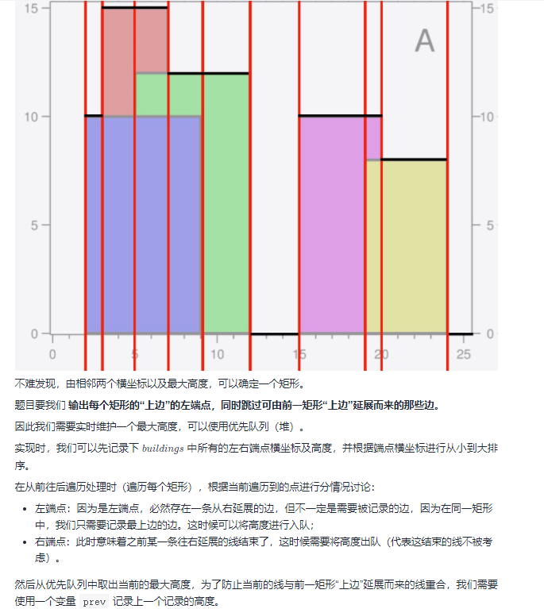

## 1. 概念
## 2. 经典题目
* 【41】给你一个未排序的整数数组 nums，请你找出其中没有出现的最小的正整数。
  * 如果将元素能够一一对应下标，那么遇到第一个和元素不相等的下标时即时没有出现的最小的正整数
  * 遍历原数组
  * 遇到当前元素要对应的数组的位置不一致，则交换，循环判断，因为要对应的数组的值交换过来大概率可能也不满足相等的条件，直到不能满足>0或者不相等。

```
    public int firstMissingPositive(int[] nums) {
        int len = nums.length;
        for (int i = 0; i < len; i++) {
            while (nums[i] > 0 && nums[i] <= len && nums[nums[i] - 1] != nums[i]) {
                swap(nums, nums[i] - 1, i);
            }
        }
        for (int i = 0; i < len; i++) {
            if (nums[i] != i + 1) {
                return i+1;
            }
        }
        return len+1;
    }

    public void swap(int[] nums, int i , int j) {
        if (i == j) {
            return;
        }
        int temp = nums[i];
        nums[i] = nums[j];
        nums[j] = temp;
    }
```

* 【48】给定一个 n × n 的二维矩阵 matrix 表示一个图像。请你将图像顺时针旋转 90 度
  * 上下反转
  * 对接反转
  * 或者对接线反转、左右反转
```
    public void rotate(int[][] matrix) {
        int col = matrix[0].length, row = matrix.length;
        //up and down swap
        for (int i = 0; i < row/2; i++) {
            for (int j = 0; j < col; j++) {
                int temp = matrix[i][j];
                matrix[i][j] = matrix[col - i - 1][j];
                matrix[col - i - 1][j] = temp;
            }
        }
        //对角线交换
        for (int i = 0; i < row; i++) {
            for (int j = 0; j < i; j++) {
                int temp = matrix[i][j];
                matrix[i][j] = matrix[j][i];
                matrix[j][i] = temp;
            }
        }
    }
```  


* 【88】给你两个按 非递减顺序 排列的整数数组 nums1 和 nums2，另有两个整数 m 和 n ，分别表示 nums1 和 nums2 中的元素数目.请你 合并 nums2 到 nums1 中，使合并后的数组同样按 非递减顺序 排列。 
  * 注意从后往前插入
  * 哪个大就拿哪个插入
  * 有可能j完了，i还没完，那么就不用插入了，说明已经完成了
  * 如果i完了，如果没还需要插入j
```
    public void merge(int[] nums1, int m, int[] nums2, int n) {
        int i = m - 1, j = n - 1, k = m + n - 1;
        while (j >= 0) {
            nums1[k--] = i < 0 || nums2[j] > nums1[i] ? nums2[j--] : nums1[i--];
        }
    }
```


* 【498】给你一个大小为 m x n 的矩阵 mat ，请以对角线遍历的顺序，用一个数组返回这个矩阵中的所有元素。
  * 这里需要基于一个事实，往上走和往下走的i+j的和是相等的。
  * 注意这里往上走，到头了，两个都满足，优先下移动
  * 往下走，到头了，两个都满足，优先右移动
```
    public int[] findDiagonalOrder(int[][] mat) {
        if (mat == null || mat.length == 0) {
            return new int[]{};
        }
        int row = mat.length, col = mat[0].length;
        int[] res = new int[row * col];
        for (int i = 0, r = 0, c = 0; i < res.length; i++) {
            res[i] = mat[r][c];
            //如果为偶数向上跑
            if ((r + c) % 2 == 0) {
                //优先下移动，如果向上到了最右边
                if (c >= col - 1) {
                    r++;
               //如果向上到顶了, 右移动
                } else if (r <= 0) {
                    c++;
                } else {
                    r--;
                    c++;
                }
                //如果为奇数向下跑
            } else {
                //优先右移动，如果向下到底了, 右移动
                if (r >= row - 1) {
                    c++;
                //如果向下到了最左
                } else if (c <= 0) {
                    r++;
                } else {
                    c--;
                    r++;
                }
            }
        }
        return res;
    }
```
* 【56】以数组 intervals 表示若干个区间的集合，其中单个区间为 intervals[i] = [starti, endi] 。请你合并所有重叠的区间，并返回一个不重叠的区间数组，该数组需恰好覆盖输入中的所有区间。 
  * 先排序，利用Arrays方法的排序
  * 从1开始遍历元素，和最新的结果元素的尾部比较，如果在范围之内，说明需要合并，否则结果元素顺移。
```
   public int[][] merge(int[][] intervals) {
        Arrays.sort(intervals, (o1, o2) -> o1[0] - o2[0]);
        int idx = 0;
        for (int i = 1; i < intervals.length; i++) {
            //如果前一个结尾比结果的开头还大，说明需要合并
            if (intervals[idx][1] >= intervals[i][0]) {
                intervals[idx][1] = Math.max(intervals[idx][1], intervals[i][1]);
            } else {
                intervals[++idx][0] = intervals[i][0];
                intervals[idx][1] = intervals[i][1];
            }
        }
        return Arrays.copyOf(intervals, idx + 1);
    }
```

* 【287】给定一个包含 n + 1 个整数的数组 nums ，其数字都在 1 到 n 之间（包括 1 和 n），可知至少存在一个重复的整数。假设 nums 只有 一个重复的整数 ，找出 这个重复的数 。 
  * 有重复的数可以看成有环的链表
  * 1,3,4,2,2


```
    public int findDuplicate(int[] nums) {
       //有重复数字的数组可以看成是有环的链表
        int slow = 0, fast = nums[0];
        while (slow != fast) {
            slow = nums[slow];
            fast = nums[nums[fast]];
        }
        slow = 0;
        while (slow != nums[fast]) {
            slow = nums[slow];
            fast = nums[fast];
        }
        return nums[fast];
    }

       public int findDuplicate(int[] nums) {
        //有重复数字的数组可以看成是有环的链表
        int slow = 0, fast = 0;
        while (true) {
            slow = nums[slow];
            fast = nums[nums[fast]];
            if (slow == fast) {
                slow = 0;
                while (nums[slow] != nums[fast]) {
                    slow = nums[slow];
                    fast = nums[fast];
                }
                return nums[slow];
            }
        }
    }
```

* 【59】给你一个正整数 n ，生成一个包含 1 到 n² 所有元素，且元素按顺时针顺序螺旋排列的 n x n 正方形矩阵 matrix 。
  * 定义上下左右四个边界
  * 模拟螺线增加即可。
```
    public int[][] generateMatrix(int n) {
        int[][] res = new int[n][n];
        int t = 0, b = n - 1, l = 0, r = n - 1, idx = 1;
        while (idx <= n * n) {
            for (int i = l; i <= r; i++) {
                res[t][i] = idx++;
            }
            t++;
            for (int i = t; i <= b; i++) {
                res[i][r] = idx++;
            }
            r--;
            for (int i = r; i >= l; i--) {
                res[b][i] = idx++;
            }
            b--;
            for (int i = b; i >= t; i--) {
                res[i][l] = idx++;
            }
            l++;
        }
        return res;
    }
```
* 【283】给定一个数组 nums，编写一个函数将所有 0 移动到数组的末尾，同时保持非零元素的相对顺序
```
    public void moveZeroes(int[] nums) {
        int idx = 0;
        for (int i = 0; i < nums.length; i++) {
            if (nums[i] != 0) {
                int temp = nums[idx];
                nums[idx++] = nums[i];
                nums[i] = temp;
            } 
        }
    }
```

* 【169】给定一个大小为 n 的数组，找到其中的多数元素。多数元素是指在数组中出现次数 大于 ⌊ n/2 ⌋ 的元素。 
  * 摩尔投票，玩一个诸侯争霸的游戏，假设你方人口超过总人口一半以上，并且能保证每个人口出去干仗都能一对一同归于尽。最后还有人活下来的国家就是胜利。那就大混战呗，最差所有人都联合起来对付你（对应你每次选择作为计数器的数都是众数），或者其他国家也会相互攻击（会选择其他数作为计数器的数），但是只要你们不要内斗，最后肯定你赢。最后能剩下的必定是自己人。 
```
    public int majorityElement(int[] nums) {
        int count = 1, cur = nums[0];
        for (int i = 1; i < nums.length; i++) {
            if (cur == nums[i]) {
                count++;
            } else {
                count--;
                //如果抵消完了，需要重新设置一个数
                if (count == 0) {
                    cur = nums[i + 1];
                }
            }
        }
        return cur;
    }
```


* 【offer03】在一个长度为 n 的数组 nums 里的所有数字都在 0～n-1 的范围内。数组中某些数字是重复的，但不知道有几个数字重复了，也不知道每个数字重复了几次。请找出数组中任意一个重复的数字
```
    //方法1，原地交换
    public int findRepeatNumber(int[] nums) {
        int i = 0;
        while (i < nums.length) {
            if (nums[i] == i) {
                i++;
                continue;
            }
            //它应该存放的位置
            int shouldIdx = nums[i];
            //如果shouldIdx的位置的值不等于它存在的位置，交换
            if (nums[shouldIdx] != shouldIdx) {
                nums[i] = nums[shouldIdx];
                nums[shouldIdx] = shouldIdx;
            } else {
                return nums[shouldIdx];
            }
        }
        return -1;
    }

       //方法2，hash
         public int findRepeatNumber(int[] nums) {
            Set<Integer> set = new HashSet<Integer>();
            int repeat = -1;
            for (int num : nums) {
                if (!set.add(num)) {
                    repeat = num;
                    break;
                }
            }
            return repeat;
        }
     //方法3，hash
     public int findRepeatNumber(int[] nums) {
        int[] arr = new int[nums.length];
        for(int i = 0; i < nums.length; i++){
            arr[nums[i]]++;
            if(arr[nums[i]] > 1) return nums[i];
        }
        return -1;
    }
```

* 【offer61】从若干副扑克牌中随机抽 5 张牌，判断是不是一个顺子，即这5张牌是不是连续的。2～10为数字本身，A为1，J为11，Q为12，K为13，而大、小王为 0 ，可以看成任意数字。A 不能视为 14。 
  * 如果重复，肯定错误。 如果不存在0，则最大值最小值之差必定为4 其他情况，最大值最小值之差小于4即可
```
    public boolean isStraight(int[] nums) {
        Arrays.sort(nums);
        int kingIdx = 0;
        for (int i = 0; i < nums.length; i++) {
            if (nums[i] == 0) {
                kingIdx++;
            } else if (i < nums.length - 1 && nums[i] == nums[i + 1]) {
                return false;
            }
        }
        return nums[nums.length - 1] - nums[kingIdx] < 5;
    }
```

* 【977】. 有序数组的平方
给你一个按 非递减顺序 排序的整数数组 nums，返回 每个数字的平方 组成的新数组，要求也按 非递减顺序 排序。
```
    public int[] sortedSquares(int[] nums) {
        int[] res = new int[nums.length];
        //相当于两个有序数据合并
        for (int idx = nums.length - 1, lo = 0, hi = idx; idx >= 0; idx--) {
            if (Math.abs(nums[lo]) > Math.abs(nums[hi])) {
                res[idx] = nums[lo] * nums[lo];
                lo++;
            } else {
                res[idx] = nums[hi] * nums[hi];
                hi--;
            }
        }
        return res;
    }
```

* 【offer21】调整数组顺序使奇数位于偶数前面
```
    public int[] exchange(int[] nums) {
        int lo = 0, hi = nums.length - 1;
        for (int i = 0; i < hi; i++) {
            while (nums[i] % 2 == 0 && i < hi) {
                swap(nums, i, hi--);
            }
            //奇数
           nums[lo++] = nums[i];
        }
        return nums;
    }

    private void swap(int[] nums, int i, int j) {
        int temp = nums[i];
        nums[i] = nums[j];
        nums[j] = temp;
    }
```


* 【189】给你一个数组，将数组中的元素向右轮转 k 个位置，其中 k 是非负数
  * 我们可以采用翻转的方式，比如12345经过翻转就变成了54321，这样已经做到了把前面的数字放到后面去，但是还没有完全达到我们的要求，比如，我们只需要把12放在后面去，目标数组就是34512，与54321对比发现我们就只需要在把分界线前后数组再进行翻转一次就可得到目标数组了。所以此题只需要采取三次翻转的方式就可以得到目标数组，首先翻转分界线前后数组，再整体翻转一次即可
```
    public void rotate(int[] nums, int k) {
        k = k % nums.length;
        if (k == 0) {
            return;
        }
        reverse(nums, 0, nums.length - 1);
        reverse(nums, 0, k - 1);
        reverse(nums, k, nums.length - 1);
    }

    private void reverse(int[] nums, int lo, int hi) {
        if (lo >= hi) {
            return;
        }
        while (lo < hi) {
            int temp = nums[hi];
            nums[hi] = nums[lo];
            nums[lo] = temp;
            hi--;
            lo++;
        }
    }
```

## 前缀和

* 【60】给出集合 [1,2,3,...,n]，其所有元素共有 n! 种排列，按大小顺序列出所有排列情况，并一一标记，当 n = 3 时,给定 n 和 k，返回第 k 个排列
  * 如下面的注释
```
    /**
    直接用回溯法做的话需要在回溯到第k个排列时终止就不会超时了, 但是效率依旧感人
    可以用数学的方法来解, 因为数字都是从1开始的连续自然数, 排列出现的次序可以推
    算出来, 对于n=4, k=15 找到k=15排列的过程:
    
    1 + 对2,3,4的全排列 (3!个)         
    2 + 对1,3,4的全排列 (3!个)         3, 1 + 对2,4的全排列(2!个)
    3 + 对1,2,4的全排列 (3!个)-------> 3, 2 + 对1,4的全排列(2!个)-------> 3, 2, 1 + 对4的全排列(1!个)-------> 3214
    4 + 对1,2,3的全排列 (3!个)         3, 4 + 对1,2的全排列(2!个)         3, 2, 4 + 对1的全排列(1!个)
    
    确定第一位:
        k = 14(从0开始计数)
        index = k / (n-1)! = 2, 说明第15个数的第一位是3 
        更新k
        k = k - index*(n-1)! = 2
    确定第二位:
        k = 2
        index = k / (n-2)! = 1, 说明第15个数的第二位是2
        更新k
        k = k - index*(n-2)! = 0
    确定第三位:
        k = 0
        index = k / (n-3)! = 0, 说明第15个数的第三位是1
        更新k
        k = k - index*(n-3)! = 0
    确定第四位:
        k = 0
        index = k / (n-4)! = 0, 说明第15个数的第四位是4
    最终确定n=4时第15个数为3214 
    **/

    public String getPermutation(int n, int k) {
        int pre = 1;
        List<Integer> nIdx = new ArrayList<>();
        int[] chen = new int[n + 1];
        chen[0] = 1;
        for (int i = 1; i <= n; i++) {
            chen[i] = pre * i;
            pre = chen[i];
            nIdx.add(i);
        }
        k--;//相当于在 n 个数字的全排列中找到下标为 k - 1 的那个数，因此 k 先减 1
        StringBuffer res = new StringBuffer();
        for (int i = 1; i <= n; i++) {
            int idx = k / chen[n - i];
            res.append(nIdx.remove(idx));
            k -= chen[n - i] * idx;
        }
        return res.toString();
    }
```

* 【238】 除自身以外数组的乘积
给你一个整数数组 nums，返回 数组 answer ，其中 answer[i] 等于 nums 中除 nums[i] 之外其余各元素的乘积 。

题目数据 保证 数组 nums之中任意元素的全部前缀元素和后缀的乘积都在  32 位 整数范围内。

请不要使用除法，且在 O(n) 时间复杂度内完成此题
```
 public int[] productExceptSelf(int[] nums) {
        int[] ans = new int[nums.length];
        ans[0] = 1;
        for (int i = 1; i < nums.length; i++) {
            ans[i] = ans[i - 1] * nums[i - 1];
        }
        int pre = 1;
        for (int i = nums.length - 1; i >= 0; i--) {
            ans[i] = ans[i] * pre;
            pre = pre * nums[i];
        }
        return ans;
    }
```

* 【974】给定一个整数数组 A，返回其中元素之和可被 K 整除的（连续、非空）子数组的数目
  * 同余定理
  * 在方法一中我们利用前缀和数组来求解问题，对于子数组numsi:j(不包含下标j)，其区间和为sum[j] sum](其中sum为预处理得到的前缀和数组)，
    。我们要判断的是(sum[j-sumi)%K是否等于0。
    根据mod运算的性质，我们知道(sum[]-sum[1)%K=sum5]%K-sum1%K。故若想(sum[j]-sum[1)%K=0，则必有sum[j]%K=sum1%K。
    。所有满足numsi:中元素之和可以被K整除的开始下标i，必有sum1%K=sum1%K。我们以 sum1%K作为键值统计其出现的频率，从而对于每个下标j我们可以立即获得能和它组成满足要求的子数组的开始下标i的数量。
  * 由于数组中有可能出现负数，我们需要将其加 K 从而使其 \%K 之后的值为正数,可查阅负数取模问题

```
   public int subarraysDivByK(int[] nums, int k) {
        Map<Integer, Integer> hash = new HashMap<>();
        hash.put(0, 1);
        int res = 0, pre = 0;
        for (int num : nums) {
            pre+=num;
            int key = (pre % k + k) % k, count = hash.getOrDefault(key, 0);
            res += count;
            hash.put(key, count + 1);
        }
        return res;
    }
```


* 【1524】 和为奇数的子数组数目，给你一个整数数组 arr 。请你返回和为 奇数 的子数组数目。由于答案可能会很大，请你将结果对 10^9 + 7 取余后返回。
  * 如果我们知道以前一个元素结尾的偶数和奇数子数组的数量，我们就可以计算出元素有多少偶数和奇数子数组n：
  * 如果n是偶数，我们增加偶数子数组的数量；奇数子阵列的数量不变。
  * 如果n是奇数，则奇子数组的个数为前一个偶数子数组的个数+1。偶数子数组的个数为前一个奇子数组的个数。


```
    public int numOfSubarrays(int[] arr) {
        int odd = 0, even = 0, sum = 0;
        for (int i : arr) {
            if (i % 2 == 1) {//为奇数
                int temp = odd;
                odd = even + 1;//上一个元素的偶数数量加1，为以当前元素结尾子数组和为奇数，因为偶数+奇数为奇数
                even = temp;//以当前元素结尾的子数组为偶数的数量，为上一个元素的奇数数量，因为必须要加上一个奇数才能达成偶数
            } else {
                even++;
            }
            sum = (sum + odd) % 1000000007;
        }
        return sum;
    }
```


* 【27】给你一个数组 nums 和一个值 val，你需要 原地 移除所有数值等于 val 的元素，并返回移除后数组的新长度。

不要使用额外的数组空间，你必须仅使用 O(1) 额外空间并 原地 修改输入数组。

元素的顺序可以改变。你不需要考虑数组中超出新长度后面的元素。
```
    public int removeElement(int[] nums, int val) {
        int idx = 0;
        for (int num : nums) {
            if (num != val) {
                nums[idx++] = num;
            }
        }
        return idx;
    }
```

* 【365】水壶问题，有两个容量分别为 x升 和 y升 的水壶以及无限多的水。请判断能否通过使用这两个水壶，从而可以得到恰好 z升 的水？

如果可以，最后请用以上水壶中的一或两个来盛放取得的 z升 水。

你允许：

装满任意一个水壶
清空任意一个水壶
从一个水壶向另外一个水壶倒水，直到装满或者倒空
  * 思路如下：
思路及算法

首先对题目进行建模。观察题目可知，在任意一个时刻，此问题的状态可以由两个数字决定：X 壶中的水量，以及 Y 壶中的水量。

在任意一个时刻，我们可以且仅可以采取以下几种操作：

把 X 壶的水灌进 Y 壶，直至灌满或倒空；
把 Y 壶的水灌进 X 壶，直至灌满或倒空；
把 X 壶灌满；
把 Y 壶灌满；
把 X 壶倒空；
把 Y 壶倒空。
因此，本题可以使用深度优先搜索来解决。搜索中的每一步以 remain_x, remain_y 作为状态，即表示 X 壶和 Y 壶中的水量。在每一步搜索时，我们会依次尝试所有的操作，递归地搜索下去。这可能会导致我们陷入无止境的递归，因此我们还需要使用一个哈希结合（HashSet）存储所有已经搜索过的 remain_x, remain_y 状态，保证每个状态至多只被搜索一次。

在实际的代码编写中，由于深度优先搜索导致的递归远远超过了 Python 的默认递归层数（可以使用 sys 库更改递归层数，但不推荐这么做），因此下面的代码使用栈来模拟递归，避免了真正使用递归而导致的问题。
```
class Solution {
    public boolean canMeasureWater(int x, int y, int z) {
        Deque<int[]> stack = new LinkedList<int[]>();
        stack.push(new int[]{0, 0});
        Set<Long> seen = new HashSet<Long>();
        while (!stack.isEmpty()) {
            if (seen.contains(hash(stack.peek()))) {
                stack.pop();
                continue;
            }
            seen.add(hash(stack.peek()));
            
            int[] state = stack.pop();
            int remain_x = state[0], remain_y = state[1];
            if (remain_x == z || remain_y == z || remain_x + remain_y == z) {
                return true;
            }
            // 把 X 壶灌满。
            stack.push(new int[]{x, remain_y});
            // 把 Y 壶灌满。
            stack.push(new int[]{remain_x, y});
            // 把 X 壶倒空。
            stack.push(new int[]{0, remain_y});
            // 把 Y 壶倒空。
            stack.push(new int[]{remain_x, 0});
            // 把 X 壶的水灌进 Y 壶，直至灌满或倒空。
            stack.push(new int[]{remain_x - Math.min(remain_x, y - remain_y), remain_y + Math.min(remain_x, y - remain_y)});
            // 把 Y 壶的水灌进 X 壶，直至灌满或倒空。
            stack.push(new int[]{remain_x + Math.min(remain_y, x - remain_x), remain_y - Math.min(remain_y, x - remain_x)});
        }
        return false;
    }

    public long hash(int[] state) {
        return (long) state[0] * 1000001 + state[1];
    }
}
```


* 【1504】统计全 1 子矩形, 给你一个只包含 0 和 1 的 rows * columns 矩阵 mat ，请你返回有多少个 子矩形 的元素全部都是 1 。
  * 矩阵里每个点(i.j)统计他这行左边到他这个位置最多有几个连续的1，存为left[i][j]。然后对于每个点(i.j)，我们固定子矩形的右下角为(i.j)，利用left从该行i向上寻找子矩阵左上角为第k行的矩阵个数。每次将子矩阵个数加到答案中即可。
时间复杂度O(nnm)，空间复杂度O(nm)。
```
    public int numSubmat(int[][] mat) {
        int m = mat.length, n = mat[0].length, ans = 0;
        int[][] left = new int[m][n];
        for (int i = 0; i < m; i++) {
            int count = 0;
            for (int j = 0; j < n; j++) {
                if (mat[i][j] == 1) {
                    count ++;
                    left[i][j] = count;
                } else {
                    count = 0;
                }
                int min = Integer.MAX_VALUE;
                for (int k = i; k >= 0 && left[k][j] > 0; k--) {
                    min = Math.min(left[k][j], min);
                    ans += min;
                }
            }
        }
        return ans;
    }
```

* 【1232】缀点成线。在一个 XY 坐标系中有一些点，我们用数组 coordinates 来分别记录它们的坐标，其中 coordinates[i] = [x, y] 表示横坐标为 x、纵坐标为 y 的点。

请你来判断，这些点是否在该坐标系中属于同一条直线上，是则返回 true，否则请返回 false
```
    /*
    * 叉乘 a * b
    * = | x1, y1 | = x1 * y2 - y1 * x2
    *   | x2, y2 |
    * 若结果小于 0，表示向量 b 在向量 a 的顺时针方向；
    * 若结果大于 0，表示向量 b 在向量 a 的逆时针方向；
    * 若结果为 0，表示向量 b 与向量 a 平行；
    */
    public boolean checkStraightLine(int[][] coordinates) {
        int x1 = coordinates[1][0] - coordinates[0][0], y1 = coordinates[1][1] - coordinates[0][1];
        for (int i = 2; i < coordinates.length; i++) {
            int x2 = coordinates[i][0] - coordinates[0][0], y2 = coordinates[i][1] - coordinates[0][1];
            if (x1 * y2 != x2 * y1) {
                return false;
            }
        }
        return true;
    }
```

* 【628】给你一个整型数组 nums ，在数组中找出由三个数组成的最大乘积，并输出这个乘积。
  * 排序之后最大乘积就两种情况：1、如果全是正数就是最后三个数相乘 2、如果有负数最大的乘机要么是最后三个数相乘，要么是两个最小的负数相乘再乘以最大的正数
```
    public int maximumProduct(int[] nums) {
        Arrays.sort(nums);
        int n = nums.length;
        return Math.max(nums[n - 3] * nums[n - 2] * nums[n - 1], nums[0] * nums[1] * nums[n - 1]);
    }
```

* 【26】删除有序数组中的重复项。给你一个有序数组 nums ，请你 原地 删除重复出现的元素，使每个元素 只出现一次 ，返回删除后数组的新长度。

不要使用额外的数组空间，你必须在 原地 修改输入数组 并在使用 O(1) 额外空间的条件下完成。
  * 比较简单，没什么好说的 
```
    public int removeDuplicates(int[] nums) {
        int idx = 1;
        //[0,0,1,1,1,2,2,3,3,4]
        for (int i = 1; i < nums.length; i++) {
            if (nums[i] != nums[i - 1]) {
                nums[idx++] = nums[i];
            }
        }
        return idx;
    }
```

* 【149】 直线上最多的点数  
  给你一个数组 points ，其中 points[i] = [xi, yi] 表示 X-Y 平面上的一个点。求最多有多少个点在同一条直线上。

```
/**
因此一个朴素的做法是先枚举两条点（确定一条线），然后检查其余点是否落在该线中。

为了避免除法精度问题，当我们枚举两个点 ii 和 jj 时，不直接计算其对应直线的 斜率和 截距，而是通过判断 ii 和 jj 与第三个点 kk 形成的两条直线斜率是否相等（斜率相等的两条直线要么平行，要么重合，平行需要 44 个点来唯一确定，我们只有 33 个点，所以可以直接判定两直线重合）。
*/
    public int maxPoints(int[][] points) {
        int n = points.length;//n个数
        int ans = 1;
        for (int i = 0; i < n; i++) {
            int[] p1 = points[i];
            for (int j = i + 1; j < n; j++) {
                int[] p2 = points[j];
                int count = 2;
                for (int k = j + 1; k < n; k++) {
                    int[] p3 = points[k];
                    if ((p1[0] - p3[0]) * (p1[1] - p2[1]) == (p1[0] - p2[0]) * (p1[1] - p3[1])) {
                        count++;
                    }
                }
                ans = Math.max(ans, count);
            }
        }
        return ans;
    }
```

* 【303】 区域和检索 - 数组不可变
给定一个整数数组  nums，求出数组从索引 i 到 j（i ≤ j）范围内元素的总和，包含 i、j 两点。

实现 NumArray 类：

NumArray(int[] nums) 使用数组 nums 初始化对象
int sumRange(int i, int j) 返回数组 nums 从索引 i 到 j（i ≤ j）范围内元素的总和，包含 i、j 两点（也就是 sum(nums[i], nums[i + 1], ... , nums[j])）

  * 前缀和
```
    int[] pre;
    public NumArray(int[] nums) {
        pre = new int[nums.length + 1];
        for (int i = 0; i < nums.length; i++) {
            pre[i + 1] = pre[i] + nums[i];
        }
    }

    public int sumRange(int left, int right) {
        return pre[right + 1] - pre[left];
    }
```

* 【304】二维区域和检索 - 矩阵不可变
给定一个二维矩阵 matrix，以下类型的多个请求：

计算其子矩形范围内元素的总和，该子矩阵的 左上角 为 (row1, col1) ，右下角 为 (row2, col2) 。
实现 NumMatrix 类：

NumMatrix(int[][] matrix) 给定整数矩阵 matrix 进行初始化
int sumRegion(int row1, int col1, int row2, int col2) 返回 左上角 (row1, col1) 、右下角 (row2, col2) 所描述的子矩阵的元素 总和 。
  * 二维数组的前缀和
```
    int[][] pre;
    public NumMatrix(int[][] matrix) {
        pre = new int[matrix.length + 1][matrix[0].length + 1];
        for (int i = 0; i < matrix.length; i++) {
            for (int j = 0; j < matrix[0].length; j++) {
                pre[i + 1][j + 1] = matrix[i][j] + pre[i][j + 1] + pre[i + 1][j] - pre[i][j];
            }
        }
    }

    public int sumRegion(int row1, int col1, int row2, int col2) {
        return pre[row2 + 1][col2 + 1] - pre[row2 + 1][col1] - pre[row1][col2 + 1] + pre[row1][col1];
    }
```

* 【1574】删除最短的子数组使剩余数组有序
给你一个整数数组 arr ，请你删除一个子数组（可以为空），使得 arr 中剩下的元素是 非递减 的。

一个子数组指的是原数组中连续的一个子序列。

请你返回满足题目要求的最短子数组的长度
  * 先从后往前找到右边界
  * 再从前往后找左边界，扩大左边界，如果右边界小了则扩大右边界
```
    public int findLengthOfShortestSubarray(int[] arr) {
        int n = arr.length;
        int r = n - 1;
        for (; r >= 1; r--) {//从后往前找到拐点
            if (arr[r - 1] > arr[r]) {
                break;
            }
        }
        int ans = r;
        for (int i = 0; i < r; i++) {
            if (r == n || arr[r] >= arr[i]) {
                ans = Math.min(r - i - 1, ans);
            } else {
                r++;
            }
            if (arr[i + 1] < arr[i]) {//说明前半截全废了
                break;
            }
        }
        return ans;
    }
```

* 【80】删除有序数组中的重复项 II
给你一个有序数组 nums ，请你 原地 删除重复出现的元素，使每个元素 最多出现两次 ，返回删除后数组的新长度。

不要使用额外的数组空间，你必须在 原地 修改输入数组 并在使用 O(1) 额外空间的条件下完成。

 
```
    public int removeDuplicates(int[] nums) {
        int idx = 0;
        for (int num : nums) {
            if (idx < 2 || nums[idx - 2] != num) {
                nums[idx++] = num;
            }
        }
        return idx;
    }
```

* 【525】连续数组
给定一个二进制数组 nums , 找到含有相同数量的 0 和 1 的最长连续子数组，并返回该子数组的长度
  * 令0为-1，那么相加为0的时候就说明0和1相等
  * 那么只要前缀s1-s2为0，就说明满足要求，即s1=s2;
```
    public int findMaxLength(int[] nums) {
        for (int i = 0; i < nums.length; i++) {
            if (nums[i] == 0) {
                nums[i] = -1;
            }
        }
        Map<Integer, Integer> hash = new HashMap<>();
        hash.put(0, -1);
        int sum = 0, ans = 0;
        for (int i = 0; i < nums.length; i++) {
            sum += nums[i];
            if (hash.containsKey(sum)) {
                ans = Math.max(ans, i - hash.get(sum));
            } else {
                hash.put(sum, i);
            }
        }
        return ans;
    }
```

* 【344】反转字符串
```
    public void reverseString(char[] s) {
        int i = 0, j = s.length - 1;
        while (i < j) {
            char temp = s[i];
            s[i] = s[j];
            s[j] = temp;
            i++;
            j--;
        }
    }
```

* 【1299】将每个元素替换为右侧最大元素
给你一个数组 arr ，请你将每个元素用它右边最大的元素替换，如果是最后一个元素，用 -1 替换。

完成所有替换操作后，请你返回这个数组
```
    public int[] replaceElements(int[] arr) {
        int max = -1;
        for (int i = arr.length - 1; i >= 0; i--) {
            int temp = arr[i];
            arr[i] = max;
            max = Math.max(max, temp);
        }
        return arr;
    }
```


* 【349】两个数组的交集
```
    public int[] intersection(int[] nums1, int[] nums2) {
        Set<Integer> set = Arrays.stream(nums1).mapToObj(c -> c).collect(Collectors.toSet());
        return Arrays.stream(nums2).
                filter(c -> set.contains(c)).distinct().mapToObj(c -> c).mapToInt(c -> c).toArray();
    }
```

* 【485】. 最大连续 1 的个数
给定一个二进制数组， 计算其中最大连续 1 的个数
```
    public int findMaxConsecutiveOnes(int[] nums) {
        int max = 0, maxHere = 0;
        for (int num : nums) {
            max = Math.max(max, maxHere = num == 0 ? 0 : maxHere + 1);
        }
        return max;
    }
```

* 【836】. 矩形重叠
矩形以列表 [x1, y1, x2, y2] 的形式表示，其中 (x1, y1) 为左下角的坐标，(x2, y2) 是右上角的坐标。矩形的上下边平行于 x 轴，左右边平行于 y 轴。

如果相交的面积为 正 ，则称两矩形重叠。需要明确的是，只在角或边接触的两个矩形不构成重叠。

给出两个矩形 rec1 和 rec2 。如果它们重叠，返回 true；否则，返回 false
  * 卡住不相交的情况即可
```
   public boolean isRectangleOverlap(int[] rec1, int[] rec2) {
        if (rec1[0] >= rec2[2] || rec1[1] >= rec2[3] || rec1[2] <= rec2[0] || rec1[3] <= rec2[1]) {
            return false;
        }
        return true;
    }
```

* 【offer17】输入数字 n，按顺序打印出从 1 到最大的 n 位十进制数。比如输入 3，则打印出 1、2、3 一直到最大的 3 位数 999
```
    public int[] printNumbers(int n) {
        int[] ans = new int[(int) Math.pow(10, n) - 1];
        for (int i = 1; i <= ans.length; i++) {
            ans[i - 1] = i;
        }
        return ans;
    }
    

    
```
//大数的解法
```
   public int[] printNumbers(int n) {
        ans = new int[(int)Math.pow(10, n) - 1];
        for (int i = 1; i <= n; i++) {
            dfs("", i);
        }
        return ans;
    }

    private void dfs(String s, int n) {
        if (n == 0) {
            ans[idx++] = Integer.valueOf(s);
            return;
        }
        for (int i = s.length() == 0 ? 1 : 0; i < 10; i++) {
            dfs(s + i, n - 1);
        }
    }

    int idx;
    int[] ans;
```


* 【448】找到所有数组中消失的数字
给你一个含 n 个整数的数组 nums ，其中 nums[i] 在区间 [1, n] 内。请你找出所有在 [1, n] 范围内但没有出现在 nums 中的数字，并以数组的形式返回结果  

&emsp;&emsp;我们可以用一个哈希表记录数组nums 中的数字，由于数字范围均在[1,n]中，记录数字后我们再利用哈希表检查[1, n]中的每一个数是否出现，从而找到缺失的数字。
由于数字范围均在[1,n]中，我们也可以用一个长度为n 的数组来代替哈希表。这一做法的空间复杂度是O(n)的。我们的目标是优化空间复杂度到O(1)。
注意到nums的长度恰好也为n，能否让nums充当哈希表呢?
由于nums的数字范围均在[1,n]中，我们可以利用这一范围之外的数字，来表达「是否存在」的含义。具体来说，遍历nums，每遇到一个数a，就让 nums[c― 1]增加n。由于nums中所有数均在[1,n]中，增加以后，这些数必然大于n。最后我们遍历nums，若nums[i]未大于n，就说明没有遇到过数i＋1。这样我们就找到了缺失的数字。
注意，当我们遍历到某个位置时，其中的数可能已经被增加过，因此需要对n取模来还原出它本来的值。

```
    public List<Integer> findDisappearedNumbers(int[] nums) {
        int n = nums.length;
        for (int num : nums) {
            int i = (num - 1) % n;
            nums[i] += n;
        }
        List<Integer> ans = new ArrayList();
        for (int i = 0; i < n; i++) {
            if (nums[i] <= n) {
                ans.add(i + 1);
            }
        }
        return ans;
    }
```

* 【905】. 按奇偶排序数组
给定一个非负整数数组 A，返回一个数组，在该数组中， A 的所有偶数元素之后跟着所有奇数元素。

你可以返回满足此条件的任何数组作为答案
```
    public int[] sortArrayByParity(int[] nums) {
        int idx = 0;
        for (int i = 0; i < nums.length; i++) {
            if (nums[i] % 2 == 0) {
                swap(nums, idx++, i);
            }
        }
        return nums;
    }

    public void swap(int[] nums, int i, int j) {
        int temp = nums[i];
        nums[i] = nums[j];
        nums[j] = temp;
    }
```


* 【941】. 有效的山脉数组
给定一个整数数组 arr，如果它是有效的山脉数组就返回 true，否则返回 false。

让我们回顾一下，如果 A 满足下述条件，那么它是一个山脉数组：

arr.length >= 3
在 0 < i < arr.length - 1 条件下，存在 i 使得：
arr[0] < arr[1] < ... arr[i-1] < arr[i]
arr[i] > arr[i+1] > ... > arr[arr.length - 1]
```
   public boolean validMountainArray(int[] arr) {
        int lo = 0, hi = arr.length - 1;
        //上山
        while (lo < hi && arr[lo + 1] > arr[lo]) {
            lo++;
        }
        while (hi > lo && arr[hi - 1] > arr[hi]) {
            hi--;
        }
        return hi != arr.length - 1 && lo != 0 && lo == hi;
    }
```


* 【218】. 天际线问题  
  城市的 天际线 是从远处观看该城市中所有建筑物形成的轮廓的外部轮廓。给你所有建筑物的位置和高度，请返回 由这些建筑物形成的 天际线 。

每个建筑物的几何信息由数组 buildings 表示，其中三元组 buildings[i] = [lefti, righti, heighti] 表示：

lefti 是第 i 座建筑物左边缘的 x 坐标。
righti 是第 i 座建筑物右边缘的 x 坐标。
heighti 是第 i 座建筑物的高度。
你可以假设所有的建筑都是完美的长方形，在高度为 0 的绝对平坦的表面上。

天际线 应该表示为由 “关键点” 组成的列表，格式 [[x1,y1],[x2,y2],...] ，并按 x 坐标 进行 排序 。关键点是水平线段的左端点。列表中最后一个点是最右侧建筑物的终点，y 坐标始终为 0 ，仅用于标记天际线的终点。此外，任何两个相邻建筑物之间的地面都应被视为天际线轮廓的一部分。

注意：输出天际线中不得有连续的相同高度的水平线。例如 [...[2 3], [4 5], [7 5], [11 5], [12 7]...] 是不正确的答案；三条高度为 5 的线应该在最终输出中合并为一个：[...[2 3], [4 5], [12 7], ...]   
    
  * 

参考：https://leetcode-cn.com/problems/the-skyline-problem/solution/gong-shui-san-xie-sao-miao-xian-suan-fa-0z6xc/
```
    public List<List<Integer>> getSkyline(int[][] buildings) {
        List<List<Integer>> ans = new ArrayList<>();
        List<int[]> ps = new ArrayList<>();
        for (int[] building : buildings) {
            int l = building[0], r = building[1], h = building[2];
            ps.add(new int[]{l, -h});
            ps.add(new int[]{r, h});
        }
        ps.sort((a, b) -> a[0] == b[0] ? a[1] - b[1] : a[0] - b[0]);
        PriorityQueue<Integer> queue = new PriorityQueue<>((a, b) -> b - a);
        int pre = 0;
        queue.offer(pre);
        for (int[] p : ps) {
            int cur = p[0], h = p[1];
            if (h < 0) {
                queue.offer(-h);
            } else {
                queue.remove(h);
            }
            int top = queue.peek();
            if (top != pre) {
                List<Integer> res = new ArrayList<>();
                res.add(cur);
                res.add(top);
                ans.add(res);
                pre = top;
            }
        }
        return ans;
    }
```

* 【面试题 17.24】. 最大子矩阵
给定一个正整数、负整数和 0 组成的 N × M 矩阵，编写代码找出元素总和最大的子矩阵。

返回一个数组 [r1, c1, r2, c2]，其中 r1, c1 分别代表子矩阵左上角的行号和列号，r2, c2 分别代表右下角的行号和列号。若有多个满足条件的子矩阵，返回任意一个均可。

注意：本题相对书上原题稍作改动
  * 很巧妙
  * 需要转化成1维的最大连续子数组和问题
  * 需要注意边界条件，注意前缀和是列的前缀和
  * top和bottom代表上下边界
  * 内部数组求最大的连续数组和

```
    public int[] getMaxMatrix(int[][] matrix) {
        int[] ans = new int[4];
        int[][] pre = new int[matrix.length + 1][matrix[0].length];
        for (int i = 0; i < matrix.length; i++) {
            for (int j = 0; j < matrix[0].length; j++) {
                pre[i + 1][j] = matrix[i][j] + pre[i][j];
            }
        }
        int max = matrix[0][0];
        for (int top = 0; top < matrix.length; top++) {
            for (int bottom = top; bottom < matrix.length; bottom++) {
                int[] arr = new int[matrix[0].length];
                for (int i = 0; i < arr.length; i++) {
                    arr[i] = pre[bottom + 1][i] - pre[top][i];
                }
                int sum = arr[0], start = 0;
                for (int i = 1; i < arr.length; i++) {
                    if (sum > 0) {
                        sum += arr[i];
                    } else {
                        sum = arr[i];
                        start = i;
                    }
                    if (sum > max) {
                        max = sum;
                        ans[0] = top;
                        ans[1] = start;
                        ans[2] = bottom;
                        ans[3] = i;
                    }
                }
            }
        }
        return ans;
    }
```

* 【334】 递增的三元子序列
给你一个整数数组 nums ，判断这个数组中是否存在长度为 3 的递增子序列。

如果存在这样的三元组下标 (i, j, k) 且满足 i < j < k ，使得 nums[i] < nums[j] < nums[k] ，返回 true ；否则，返回 false
```
  public boolean increasingTriplet(int[] nums) {
        //min最小，max尽可能小
        int min = Integer.MAX_VALUE, max = Integer.MAX_VALUE;
        for (int i = 0; i < nums.length; i++) {
            if (min >= nums[i]) {
                min = nums[i];
            } else if (max >= nums[i]) {
                max = nums[i];
            } else {
                return true;
            }
        }
        return false;
    }
```