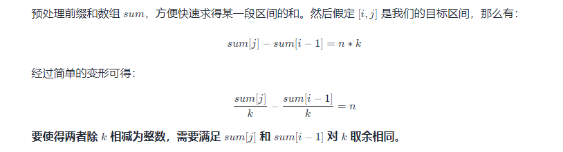

## 1. 概念
## 2. 经典题目
* 【41】给你一个未排序的整数数组 nums，请你找出其中没有出现的最小的正整数。
  * 如果将元素能够一一对应下标，那么遇到第一个和元素不相等的下标时即时没有出现的最小的正整数
  * 遍历原数组
  * 遇到当前元素要对应的数组的位置不一致，则交换，循环判断，因为要对应的数组的值交换过来大概率可能也不满足相等的条件，直到不能满足>0或者不相等。

```
    public int firstMissingPositive(int[] nums) {
        int len = nums.length;
        for (int i = 0; i < len; i++) {
            while (nums[i] > 0 && nums[i] <= len && nums[nums[i] - 1] != nums[i]) {
                swap(nums, nums[i] - 1, i);
            }
        }
        for (int i = 0; i < len; i++) {
            if (nums[i] != i + 1) {
                return i+1;
            }
        }
        return len+1;
    }

    public void swap(int[] nums, int i , int j) {
        if (i == j) {
            return;
        }
        int temp = nums[i];
        nums[i] = nums[j];
        nums[j] = temp;
    }
```

* 【48】给定一个 n × n 的二维矩阵 matrix 表示一个图像。请你将图像顺时针旋转 90 度
  * 上下反转
  * 对接反转
```
    public void rotate(int[][] matrix) {
        int col = matrix[0].length, row = matrix.length;
        //up and down swap
        for (int i = 0; i < row/2; i++) {
            for (int j = 0; j < col; j++) {
                int temp = matrix[i][j];
                matrix[i][j] = matrix[col - i - 1][j];
                matrix[col - i - 1][j] = temp;
            }
        }
        //对角线交换
        for (int i = 0; i < row; i++) {
            for (int j = 0; j < i; j++) {
                int temp = matrix[i][j];
                matrix[i][j] = matrix[j][i];
                matrix[j][i] = temp;
            }
        }
    }
```  


* 【88】给你两个按 非递减顺序 排列的整数数组 nums1 和 nums2，另有两个整数 m 和 n ，分别表示 nums1 和 nums2 中的元素数目.请你 合并 nums2 到 nums1 中，使合并后的数组同样按 非递减顺序 排列。 
  * 注意从后往前插入
  * 哪个大就拿哪个插入
  * 有可能j完了，i还没完，那么就不用插入了，说明已经完成了
  * 如果i完了，如果没还需要插入j
```
    public void merge(int[] nums1, int m, int[] nums2, int n) {
        int i = m - 1, j = n - 1, k = m + n - 1;
        while (j >= 0) {
            nums1[k--] = i < 0 || nums2[j] > nums1[i] ? nums2[j--] : nums1[i--];
        }
    }
```


* 【498】给你一个大小为 m x n 的矩阵 mat ，请以对角线遍历的顺序，用一个数组返回这个矩阵中的所有元素。
  * 这里需要基于一个事实，往上走和往下走的i+j的和是相等的。
  * 注意这里往上走，到头了，两个都满足，优先下移动
  * 往下走，到头了，两个都满足，优先右移动
```
    public int[] findDiagonalOrder(int[][] mat) {
        if (mat == null || mat.length == 0) {
            return new int[]{};
        }
        int row = mat.length, col = mat[0].length;
        int[] res = new int[row * col];
        for (int i = 0, r = 0, c = 0; i < res.length; i++) {
            res[i] = mat[r][c];
            //如果为偶数向上跑
            if ((r + c) % 2 == 0) {
                //优先下移动，如果向上到了最右边
                if (c >= col - 1) {
                    r++;
               //如果向上到顶了, 右移动
                } else if (r <= 0) {
                    c++;
                } else {
                    r--;
                    c++;
                }
                //如果为奇数向下跑
            } else {
                //优先右移动，如果向下到底了, 右移动
                if (r >= row - 1) {
                    c++;
                //如果向下到了最左
                } else if (c <= 0) {
                    r++;
                } else {
                    c--;
                    r++;
                }
            }
        }
        return res;
    }
```


* 给定一个包含 n + 1 个整数的数组 nums ，其数字都在 1 到 n 之间（包括 1 和 n），可知至少存在一个重复的整数。假设 nums 只有 一个重复的整数 ，找出 这个重复的数 。 
  * 有重复的数可以看成有环的链表
  * 1,3,4,2,2


```
    public int findDuplicate(int[] nums) {
        //有重复数字的数组可以看成是有环的链表
        int slow = 0, fast = nums[0];
        while (slow != fast) {
            slow = nums[slow];
            fast = nums[nums[fast]];
        }
        fast = nums[slow];
        slow = 0;
        while (slow != nums[fast]) {
            slow = nums[slow];
            fast = nums[fast];
        }
        return nums[fast];
    }
```

* 【59】给你一个正整数 n ，生成一个包含 1 到 n² 所有元素，且元素按顺时针顺序螺旋排列的 n x n 正方形矩阵 matrix 。
  * 定义上下左右四个边界
  * 模拟螺线增加即可。
```
    public int[][] generateMatrix(int n) {
        int[][] res = new int[n][n];
        int t = 0, b = n - 1, l = 0, r = n - 1, idx = 1;
        while (idx <= n * n) {
            for (int i = l; i <= r; i++) {
                res[t][i] = idx++;
            }
            t++;
            for (int i = t; i <= b; i++) {
                res[i][r] = idx++;
            }
            r--;
            for (int i = r; i >= l; i--) {
                res[b][i] = idx++;
            }
            b--;
            for (int i = b; i >= t; i--) {
                res[i][l] = idx++;
            }
            l++;
        }
        return res;
    }
```
* 【283】给定一个数组 nums，编写一个函数将所有 0 移动到数组的末尾，同时保持非零元素的相对顺序
```
    public void moveZeroes(int[] nums) {
        int idx = 0;
        for (int i = 0; i < nums.length; i++) {
            if (nums[i] != 0) {
                int temp = nums[idx];
                nums[idx++] = nums[i];
                nums[i] = temp;
            } 
        }
    }
```

* 【169】给定一个大小为 n 的数组，找到其中的多数元素。多数元素是指在数组中出现次数 大于 ⌊ n/2 ⌋ 的元素。 
  * 摩尔投票，玩一个诸侯争霸的游戏，假设你方人口超过总人口一半以上，并且能保证每个人口出去干仗都能一对一同归于尽。最后还有人活下来的国家就是胜利。那就大混战呗，最差所有人都联合起来对付你（对应你每次选择作为计数器的数都是众数），或者其他国家也会相互攻击（会选择其他数作为计数器的数），但是只要你们不要内斗，最后肯定你赢。最后能剩下的必定是自己人。 
```
    public int majorityElement(int[] nums) {
        int count = 1, cur = nums[0];
        for (int i = 1; i < nums.length; i++) {
            if (cur == nums[i]) {
                count++;
            } else {
                count--;
                //如果抵消完了，需要重新设置一个数
                if (count == 0) {
                    cur = nums[i + 1];
                }
            }
        }
        return cur;
    }
```


* 【offer03】在一个长度为 n 的数组 nums 里的所有数字都在 0～n-1 的范围内。数组中某些数字是重复的，但不知道有几个数字重复了，也不知道每个数字重复了几次。请找出数组中任意一个重复的数字
```
    //方法1，原地交换
    public int findRepeatNumber(int[] nums) {
        int i = 0;
        while (i < nums.length) {
            if (nums[i] == i) {
                i++;
                continue;
            }
            //它应该存放的位置
            int shouldIdx = nums[i];
            //如果shouldIdx的位置的值不等于它存在的位置，交换
            if (nums[shouldIdx] != shouldIdx) {
                nums[i] = nums[shouldIdx];
                nums[shouldIdx] = shouldIdx;
            } else {
                return nums[shouldIdx];
            }
        }
        return -1;
    }

       //方法2，hash
         public int findRepeatNumber(int[] nums) {
            Set<Integer> set = new HashSet<Integer>();
            int repeat = -1;
            for (int num : nums) {
                if (!set.add(num)) {
                    repeat = num;
                    break;
                }
            }
            return repeat;
        }
     //方法3，hash
     public int findRepeatNumber(int[] nums) {
        int[] arr = new int[nums.length];
        for(int i = 0; i < nums.length; i++){
            arr[nums[i]]++;
            if(arr[nums[i]] > 1) return nums[i];
        }
        return -1;
    }
```


* 【523】 给你一个整数数组 nums 和一个整数 k ，编写一个函数来判断该数组是否含有同时满足下述条件的连续子数组
  取余定理  
  
  * 先求出前缀和
  * 使用 HashSet 来保存出现过的值
  * 让循环从 22 开始枚举右端点（根据题目要求，子数组长度至少为 22），每次将符合长度要求的位置的取余结果存入 HashSet
  * 如果枚举某个右端点 jj 时发现存在某个左端点 ii 符合要求，则返回 True
```
      public boolean checkSubarraySum(int[] nums, int k) {
        int[] pre = new int[nums.length + 1];
        for (int i = 0; i < nums.length; i++) {
            pre[i + 1] = pre[i] + nums[i];
        }
        Set<Integer> hash = new HashSet<>();
        for (int i = 2; i <= nums.length; i++) {
            hash.add(pre[i - 2] % k);
            if (hash.contains(pre[i] % k)) {
                return true;
            }
        }
        return false;
    }
```
* 【offer61】从若干副扑克牌中随机抽 5 张牌，判断是不是一个顺子，即这5张牌是不是连续的。2～10为数字本身，A为1，J为11，Q为12，K为13，而大、小王为 0 ，可以看成任意数字。A 不能视为 14。 
  * 如果重复，肯定错误。 如果不存在0，则最大值最小值之差必定为4 其他情况，最大值最小值之差小于4即可
```
    public boolean isStraight(int[] nums) {
        Arrays.sort(nums);
        int kingIdx = 0;
        for (int i = 0; i < nums.length; i++) {
            if (nums[i] == 0) {
                kingIdx++;
            } else if (i < nums.length - 1 && nums[i] == nums[i + 1]) {
                return false;
            }
        }
        return nums[nums.length - 1] - nums[kingIdx] < 5;
    }
```


```
    public int[] sortedSquares(int[] nums) {
        int[] res = new int[nums.length];
        //相当于两个有序数据合并
        for (int idx = nums.length - 1, lo = 0, hi = idx; idx >= 0; idx--) {
            if (Math.abs(nums[lo]) > Math.abs(nums[hi])) {
                res[idx] = nums[lo] * nums[lo];
                lo++;
            } else {
                res[idx] = nums[hi] * nums[hi];
                hi--;
            }
        }
        return res;
    }
```

* 【offer21】调整数组顺序使奇数位于偶数前面
```
    public int[] exchange(int[] nums) {
        int lo = 0, hi = nums.length - 1;
        for (int i = 0; i < hi; i++) {
            while (nums[i] % 2 == 0 && i < hi) {
                swap(nums, i, hi--);
            }
            //奇数
           nums[lo++] = nums[i];
        }
        return nums;
    }

    private void swap(int[] nums, int i, int j) {
        int temp = nums[i];
        nums[i] = nums[j];
        nums[j] = temp;
    }
```