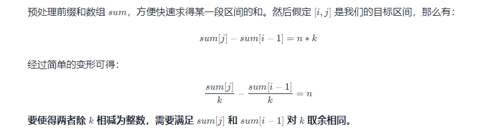

## 1. 概述
## 2. 经典题目


### map映射
   * 【1】给定一个整数数组 nums 和一个整数目标值 target，请你在该数组中找出 和为目标值 target 的那 两个 整数，并返回它们的数组下标
   * 遍历元素放到map中
   * 判断target-num是否在集合中，如果等于说明找到了。
```
    public int[] twoSum(int[] nums, int target) {
        Map<Integer, Integer> hash  = new HashMap<>();
        for (int i = 0; i < nums.length; i++) {
            if (hash.containsKey(target-nums[i])) {
                return new int[] {hash.get(target-nums[i]), i};
            }
            hash.put(nums[i], i);
        }
        return null;
    }
```
### hash表
* 【128】给定一个未排序的整数数组 nums ，找出数字连续的最长序列（不要求序列元素在原数组中连续）的长度
  * 使用hash表记录，可以方便查找
  * 一串数字，可以分为两类，零散的数据和连续的数字
  * 我们现在寻找连续数字的开头
  * 遍历hash表，如果它的上一个在hash表中，说明不是连续的开头
  * 反之是连续数字的开头，然后一个个遍历加1是不是在hash中，如果是则计数加1
  * 取最大值即可

```
   public int longestConsecutive(int[] nums) {
        Set<Integer> hash = new HashSet<>();
        for (int num : nums) {
            hash.add(num);
        }
        int max = 0;
        for (int num : hash) {
            //如果这个数的上一个不在hash中，说明可能为连续数字的开头
            if (!hash.contains(num - 1)) {
                int start = num;
                while (hash.contains(start + 1)) {
                    start++;
                }
                max = Math.max(max, start - num + 1);
            }
        }
        return max;
    }
```
* 【560】给你一个整数数组 nums 和一个整数 k ，请你统计并返回该数组中和为 k 的连续子数组的个数。 
  * 使用map存储前缀和对应的数量，有可能为多个
  * 如果当前的前缀和之前的某个前缀能够满足使得和为k，res++
  * 注意边界条件，前缀和正好等于k的情况，需要初始化preCount.put(0, 1);
```
    public int subarraySum(int[] nums, int k) {
        int preSum = 0, res = 0;
        //前缀和对应的数量，有可能为多个
        Map<Integer, Integer> preCount = new HashMap<>();
        //前缀和正好等于k的情况
        preCount.put(0, 1);
        for (int num : nums) {
            //当前的前缀和
            preSum += num;
            //如果当前的前缀和之前的某个前缀能够满足使得和为k
            if (preCount.containsKey(preSum - k)) {
                res += preCount.get(preSum - k);
            }
            preCount.put(preSum, preCount.getOrDefault(preSum, 0) + 1);
        }
        return res;
    }
```

* 【347】给你一个整数数组 nums 和一个整数 k ，请你返回其中出现频率前 k 高的元素。你可以按 任意顺序 返回答案。
  * 使用一个map记录每个数字的次数
  * 记录每个次数对应的数字
  * 从后往前记录记录结果 
```
   public int[] topKFrequent(int[] nums, int k) {
        Map<Integer, Integer> numCounts = new HashMap<>();
        for (int num : nums) {
            numCounts.put(num, numCounts.getOrDefault(num, 0) + 1);
        }
        List<Integer>[] countList = new List[nums.length + 1];
        for (Map.Entry<Integer, Integer> numCount : numCounts.entrySet()) {
            if (countList[numCount.getValue()] == null) {
                countList[numCount.getValue()] = new ArrayList<>();
            }
            countList[numCount.getValue()].add(numCount.getKey());
        }
        List<Integer> res = new ArrayList<>();
        for (int i = countList.length - 1; i >= 0 && res.size() < k; i--) {
            if (countList[i] != null) {
                res.addAll(countList[i]);
            }
        }
        return res.stream().mapToInt(re -> re).toArray();
    }
```


* 【454】给你四个整数数组 nums1、nums2、nums3 和 nums4 ，数组长度都是 n ，请你计算有多少个元组 (i, j, k, l) 能满足：

0 <= i, j, k, l < n
nums1[i] + nums2[j] + nums3[k] + nums4[l] == 0

```
    public int fourSumCount(int[] nums1, int[] nums2, int[] nums3, int[] nums4) {
        Map<Integer, Integer> hash = new HashMap<>();
        for (int n1 : nums1) {
            for (int n2 : nums2) {
                hash.put(n1 + n2, hash.getOrDefault(n1 + n2, 0) + 1);
            }
        }
        int res = 0;
        for (int n3 : nums3) {
            for (int n4 : nums4) {
                res += hash.getOrDefault(-(n3 + n4), 0);
            }
        }
        return res;
    }
```

* 【1424】对角线遍历 II，给你一个列表 nums ，里面每一个元素都是一个整数列表。请你依照下面各图的规则，按顺序返回 nums 中对角线上的整数。   

```
   public int[] findDiagonalOrder(List<List<Integer>> nums) {
        Map<Integer, LinkedList<Integer>> hash = new HashMap<>();
        int maxKey = 0, count = 0;
        for (int i = 0; i < nums.size(); i++) {
            for (int j = 0; j < nums.get(i).size(); j++) {
                hash.computeIfAbsent(i + j, x -> new LinkedList<>()).addFirst(nums.get(i).get(j));
                count++;
                maxKey = Math.max(maxKey, i + j);
            }
        }
        int[] ans = new int[count];
        count = 0;
        for (int i = 0; i <= maxKey; i++) {
            for (int i1 : hash.get(i)) {
                ans[count++] = i1;
            }
        }
        return ans;
    }
```

* 【49】. 字母异位词分组
给你一个字符串数组，请你将 字母异位词 组合在一起。可以按任意顺序返回结果列表。

字母异位词 是由重新排列源单词的字母得到的一个新单词，所有源单词中的字母通常恰好只用一次

```
   public List<List<String>> groupAnagrams(String[] strs) {
        Map<String, List<String>> map = new HashMap<>();
        for (String s : strs) {
            char[] temp = s.toCharArray();
            Arrays.sort(temp);
            String key = new String(temp);
            map.computeIfAbsent(key, k -> new ArrayList<>()).add(s);
        }
        return new ArrayList<>(map.values());
    }
```

* 【523】 给你一个整数数组 nums 和一个整数 k ，编写一个函数来判断该数组是否含有同时满足下述条件的连续子数组
  取余定理  
  
  * 先求出前缀和
  * 使用 HashSet 来保存出现过的值
  * 让循环从 22 开始枚举右端点（根据题目要求，子数组长度至少为 22），每次将符合长度要求的位置的取余结果存入 HashSet
  * 如果枚举某个右端点 jj 时发现存在某个左端点 ii 符合要求，则返回 True
```
      public boolean checkSubarraySum(int[] nums, int k) {
        int[] pre = new int[nums.length + 1];
        for (int i = 0; i < nums.length; i++) {
            pre[i + 1] = pre[i] + nums[i];
        }
        Set<Integer> hash = new HashSet<>();
        for (int i = 2; i <= nums.length; i++) {
            hash.add(pre[i - 2] % k);
            if (hash.contains(pre[i] % k)) {
                return true;
            }
        }
        return false;
    }
```

* 【594】. 最长和谐子序列
和谐数组是指一个数组里元素的最大值和最小值之间的差别 正好是 1 。

现在，给你一个整数数组 nums ，请你在所有可能的子序列中找到最长的和谐子序列的长度。

数组的子序列是一个由数组派生出来的序列，它可以通过删除一些元素或不删除元素、且不改变其余元素的顺序而得到
  * hash表计数
  * 排序双指针循环
```
    public int findLHS(int[] nums) {
        Map<Integer, Integer> hash = new HashMap<>();
        for (int num : nums) {
            hash.put(num, hash.getOrDefault(num, 0) + 1);
        }
        int ans = 0;
        for (int i = 0; i < nums.length; i++) {
            if (hash.containsKey(nums[i] -1)) {
                ans = Math.max(ans, hash.get(nums[i]-1) + hash.get(nums[i]));
            }
        }
        return ans;
    }


    class Solution {
    public int findLHS(int[] nums) {
        Arrays.sort(nums);
        int n = nums.length, ans = 0;
        for (int i = 0, j = 0; j < n; j++) {
            while (i < j && nums[j] - nums[i] > 1) i++;
            if (nums[j] - nums[i] == 1) ans = Math.max(ans, j - i + 1);
        }
        return ans;
    }
}

```


#### [面试题 17.05.  字母与数字](https://leetcode.cn/problems/find-longest-subarray-lcci/)

难度中等49收藏分享切换为英文接收动态反馈

给定一个放有字母和数字的数组，找到最长的子数组，且包含的字母和数字的个数相同。

返回该子数组，若存在多个最长子数组，返回左端点下标值最小的子数组。若不存在这样的数组，返回一个空数组。

**示例 1:**

```
输入: ["A","1","B","C","D","2","3","4","E","5","F","G","6","7","H","I","J","K","L","M"]

输出: ["A","1","B","C","D","2","3","4","E","5","F","G","6","7"]
```

**示例 2:**

```
输入: ["A","A"]

输出: []
```

**提示：**

- `array.length <= 100000`

```
   public String[] findLongestSubarray(String[] array) {
        int start = 0, end = 0, pre = 0;
        Map<Integer, Integer> left = new HashMap<>();
        left.put(0, -1);
        for (int i = 0; i < array.length; i++) {
            pre += (Character.isDigit(array[i].charAt(0)) ? 1 : -1);
            if (!left.containsKey(pre)) {
                left.put(pre, i);
            } else {
                int last = left.get(pre);
                if (i - last > end - start) {
                    start = last;
                    end = i;
                }
            }
        }
        return Arrays.copyOfRange(array, start + 1, end + 1);
    }
```

#### [954. 二倍数对数组](https://leetcode.cn/problems/array-of-doubled-pairs/)

难度中等181

给定一个长度为偶数的整数数组 `arr`，只有对 `arr` 进行重组后可以满足 “对于每个 `0 <= i < len(arr) / 2`，都有 `arr[2 * i + 1] = 2 * arr[2 * i]`” 时，返回 `true`；否则，返回 `false`。

 

**示例 1：**

```
输入：arr = [3,1,3,6]
输出：false
```

**示例 2：**

```
输入：arr = [2,1,2,6]
输出：false
```

**示例 3：**

```
输入：arr = [4,-2,2,-4]
输出：true
解释：可以用 [-2,-4] 和 [2,4] 这两组组成 [-2,-4,2,4] 或是 [2,4,-2,-4]
```

 

**提示：**

- `0 <= arr.length <= 3 * 104`
- `arr.length` 是偶数
- `-105 <= arr[i] <= 105`

依题意，我们首先对每个元素的出现次数用哈希表进行维护，然后用一个 listlist 存储其中的各个元素。然后遍历各个元素，对于每个元素 keykey 判断是否有足够的 2k2k ，如果有，更新 2k2k 的数量；如果没有，返回 falsefalse 。

要注意的是，由于map的无序性，会导致遍历时可能会从中间元素开始遍历，此时后面的数就会受到影响。所以，我们要从小的元素开始遍历，以确保元素匹配的正确性。

```
class Solution {
    public boolean canReorderDoubled(int[] arr) {
        //思路:模拟
        Map<Integer,Integer> map = new HashMap<>();
        //维护元素个数
        for (int i : arr) {
            map.put(i, map.getOrDefault(i, 0) + 1);
        }
        List<Integer> list = new ArrayList<>(map.keySet());
        //例:[10,20,40,80]
        //由于map的无序性,导致遍历时可能会从中间开始遍历(20)
        //此时后面的数(40)就会收到影响
        list.sort((o1, o2) -> Math.abs(o1) - Math.abs(o2));

        for (int key : list) {
            //判断是否有足够的 2 * key
            if (map.get(key) > map.getOrDefault(2 * key, 0)) {
                return false;
            }
            //维护2 * key的数量
            map.put(2 * key, map.getOrDefault(2 * key, 0) - map.get(key));
        }
        return true;
    }
}
```
