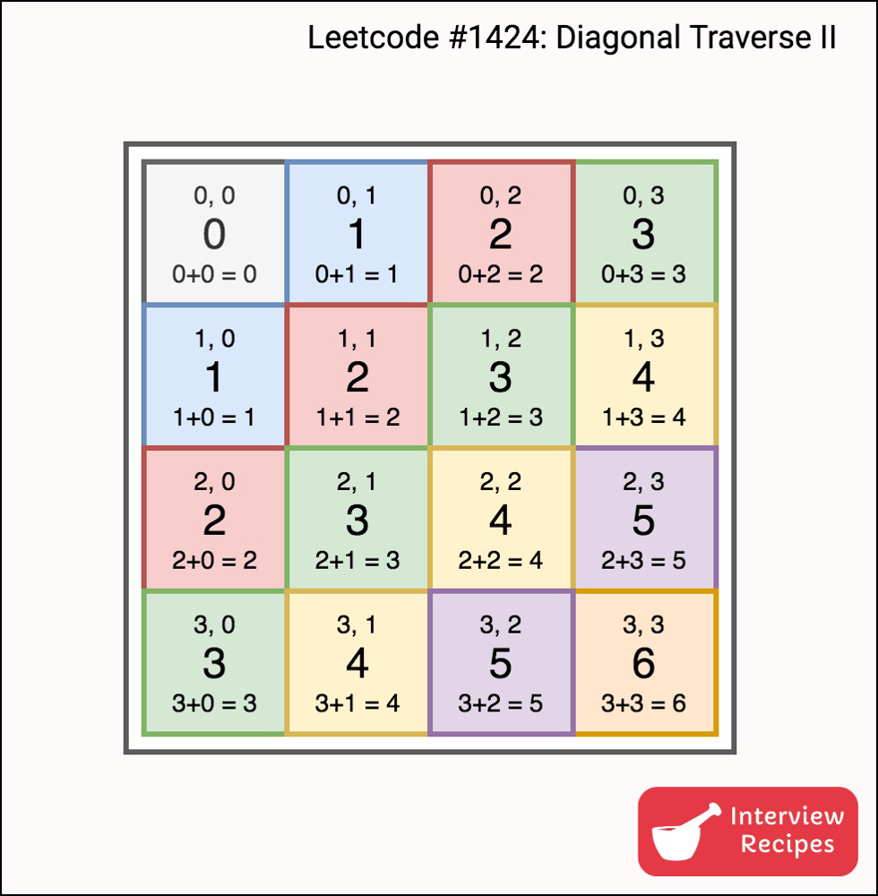

## 1. 概述
## 2. 经典题目


### map映射
   * 【1】给定一个整数数组 nums 和一个整数目标值 target，请你在该数组中找出 和为目标值 target 的那 两个 整数，并返回它们的数组下标
   * 遍历元素放到map中
   * 判断target-num是否在集合中，如果等于说明找到了。
```
    public int[] twoSum(int[] nums, int target) {
        Map<Integer, Integer> hash  = new HashMap<>();
        for (int i = 0; i < nums.length; i++) {
            if (hash.containsKey(target-nums[i])) {
                return new int[] {hash.get(target-nums[i]), i};
            }
            hash.put(nums[i], i);
        }
        return null;
    }
``` 
### hash表
* 【128】给定一个未排序的整数数组 nums ，找出数字连续的最长序列（不要求序列元素在原数组中连续）的长度
  * 使用hash表记录，可以方便查找
  * 一串数字，可以分为两类，零散的数据和连续的数字
  * 我们现在寻找连续数字的开头
  * 遍历hash表，如果它的上一个在hash表中，说明不是连续的开头
  * 反之是连续数字的开头，然后一个个遍历加1是不是在hash中，如果是则计数加1
  * 取最大值即可

```
   public int longestConsecutive(int[] nums) {
        Set<Integer> hash = new HashSet<>();
        for (int num : nums) {
            hash.add(num);
        }
        int max = 0;
        for (int num : hash) {
            //如果这个数的上一个不在hash中，说明可能为连续数字的开头
            if (!hash.contains(num - 1)) {
                int start = num;
                while (hash.contains(start + 1)) {
                    start++;
                }
                max = Math.max(max, start - num + 1);
            }
        }
        return max;
    }
```
* 【560】给你一个整数数组 nums 和一个整数 k ，请你统计并返回该数组中和为 k 的连续子数组的个数。 
  * 使用map存储前缀和对应的数量，有可能为多个
  * 如果当前的前缀和之前的某个前缀能够满足使得和为k，res++
  * 注意边界条件，前缀和正好等于k的情况，需要初始化preCount.put(0, 1);
```
    public int subarraySum(int[] nums, int k) {
        int preSum = 0, res = 0;
        //前缀和对应的数量，有可能为多个
        Map<Integer, Integer> preCount = new HashMap<>();
        //前缀和正好等于k的情况
        preCount.put(0, 1);
        for (int num : nums) {
            //当前的前缀和
            preSum += num;
            //如果当前的前缀和之前的某个前缀能够满足使得和为k
            if (preCount.containsKey(preSum - k)) {
                res += preCount.get(preSum - k);
            }
            preCount.put(preSum, preCount.getOrDefault(preSum, 0) + 1);
        }
        return res;
    }
```

* 【347】给你一个整数数组 nums 和一个整数 k ，请你返回其中出现频率前 k 高的元素。你可以按 任意顺序 返回答案。
  * 使用一个map记录每个数字的次数
  * 记录每个次数对应的数字
  * 从后往前记录记录结果 
```
   public int[] topKFrequent(int[] nums, int k) {
        Map<Integer, Integer> numCounts = new HashMap<>();
        for (int num : nums) {
            numCounts.put(num, numCounts.getOrDefault(num, 0) + 1);
        }
        List<Integer>[] countList = new List[nums.length + 1];
        for (Map.Entry<Integer, Integer> numCount : numCounts.entrySet()) {
            if (countList[numCount.getValue()] == null) {
                countList[numCount.getValue()] = new ArrayList<>();
            }
            countList[numCount.getValue()].add(numCount.getKey());
        }
        List<Integer> res = new ArrayList<>();
        for (int i = countList.length - 1; i >= 0 && res.size() < k; i--) {
            if (countList[i] != null) {
                res.addAll(countList[i]);
            }
        }
        return res.stream().mapToInt(re -> re).toArray();
    }
```


* 【454】给你四个整数数组 nums1、nums2、nums3 和 nums4 ，数组长度都是 n ，请你计算有多少个元组 (i, j, k, l) 能满足：

0 <= i, j, k, l < n
nums1[i] + nums2[j] + nums3[k] + nums4[l] == 0

```
    public int fourSumCount(int[] nums1, int[] nums2, int[] nums3, int[] nums4) {
        Map<Integer, Integer> hash = new HashMap<>();
        for (int n1 : nums1) {
            for (int n2 : nums2) {
                hash.put(n1 + n2, hash.getOrDefault(n1 + n2, 0) + 1);
            }
        }
        int res = 0;
        for (int n3 : nums3) {
            for (int n4 : nums4) {
                res += hash.getOrDefault(-(n3 + n4), 0);
            }
        }
        return res;
    }
```

* 【1424】对角线遍历 II，给你一个列表 nums ，里面每一个元素都是一个整数列表。请你依照下面各图的规则，按顺序返回 nums 中对角线上的整数。   

```
   public int[] findDiagonalOrder(List<List<Integer>> nums) {
        Map<Integer, LinkedList<Integer>> hash = new HashMap<>();
        int maxKey = 0, count = 0;
        for (int i = 0; i < nums.size(); i++) {
            for (int j = 0; j < nums.get(i).size(); j++) {
                hash.computeIfAbsent(i + j, x -> new LinkedList<>()).addFirst(nums.get(i).get(j));
                count++;
                maxKey = Math.max(maxKey, i + j);
            }
        }
        int[] ans = new int[count];
        count = 0;
        for (int i = 0; i <= maxKey; i++) {
            for (int i1 : hash.get(i)) {
                ans[count++] = i1;
            }
        }
        return ans;
    }
```

* 【49】. 字母异位词分组
给你一个字符串数组，请你将 字母异位词 组合在一起。可以按任意顺序返回结果列表。

字母异位词 是由重新排列源单词的字母得到的一个新单词，所有源单词中的字母通常恰好只用一次

```
   public List<List<String>> groupAnagrams(String[] strs) {
        Map<String, List<String>> map = new HashMap<>();
        for (String s : strs) {
            char[] temp = s.toCharArray();
            Arrays.sort(temp);
            String key = new String(temp);
            map.computeIfAbsent(key, k -> new ArrayList<>()).add(s);
        }
        return new ArrayList<>(map.values());
    }
```