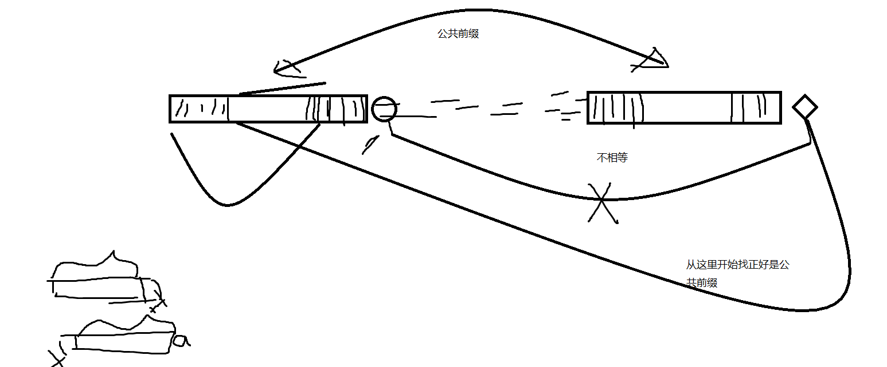
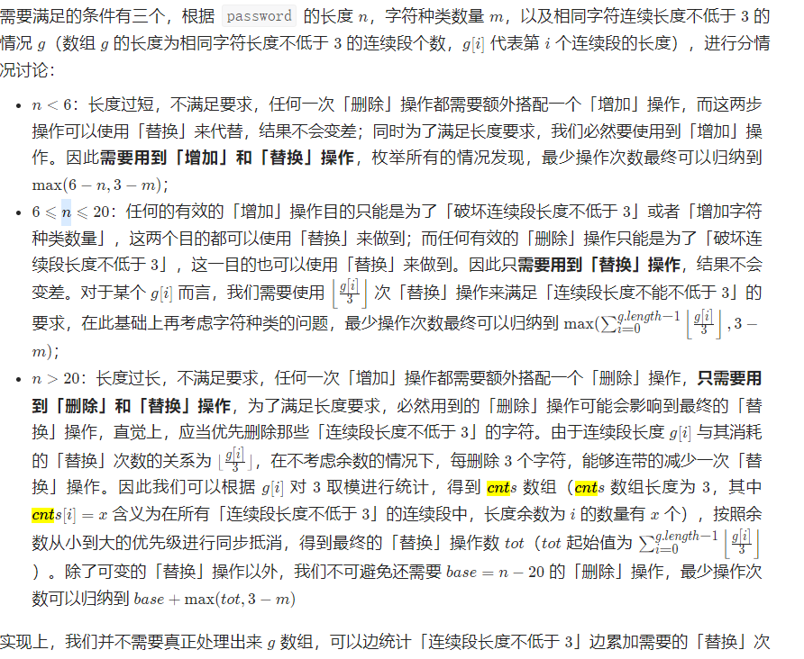

## 1. 概述
## 2. 经典算法
* 【394】给定一个经过编码的字符串，返回它解码后的字符串3[a2[c]]转化成accaccacc
  * 使用栈保存循环的次数
  * 使用栈保存[以前的字符串，因为有可能要取出来和拼接好的的字符组合。
  * stringbufer先存储字母，遇到了[需要暂且存到栈里，遇到]需要从栈中取出来拼接重复
```
        //保存数字
        Deque<Integer> nums = new ArrayDeque<>();
        Deque<String> preStr = new ArrayDeque();
        StringBuffer repeatStr = new StringBuffer();
        for (int i = 0; i < s.length(); i++) {
            char c = s.charAt(i);
            //如果当前是数字
            if (Character.isDigit(c)) {
                int num = c - '0';
                while (Character.isDigit(s.charAt(i + 1))) {
                    num = (s.charAt(++i) - '0') + num * 10;
                }
                nums.push(num);
                //如果出现了[，需要重新拼接[]里面的字符串了，存放到preStr里面
            } else if (c == '[') {
                preStr.push(repeatStr.toString());
                repeatStr.setLength(0);
            } else if (c == ']') {
                int num = nums.pop();
                StringBuffer temp = new StringBuffer();
                temp.append(preStr.pop());
                while (num-- > 0) {
                    temp.append(repeatStr);
                }
                repeatStr = new StringBuffer(temp.toString());
            } else if (Character.isLetter(c)) {
                repeatStr.append(c);
            }
        }
        return repeatStr.toString();
```


* 【8】请你来实现一个 myAtoi(string s) 函数，使其能将字符串转换成一个 32 位有符号整数（类似 C/C++ 中的 atoi 函数）
  * 先找到数字的开头
  * 判断是+还是-
  * 拼接数字，注意是否越界
  * 和边界的十位以上比较
  * 如果直接大于十位以上就越界了
  * 如果等于边界的十位以上， 比较个位数即可。
```
    public int myAtoi(String s) {
        int idx = 0;
        while (idx < s.length() && s.charAt(idx) == ' ') {
            idx++;
        }
        if (idx == s.length()) {
            return 0;
        }
        int sign = 1, res = 0;
        if (s.charAt(idx) == '-') {
            sign = -1;
            idx++;
        } else if (s.charAt(idx) == '+') {
            idx++;
        }
        while (idx < s.length() && Character.isDigit(s.charAt(idx))) {
            //有两种情况：
            // ① res乘以10直接就大于边界了
            // ② res等于边界，需要比较下一位和边界的个位数比较，
            if (res > Integer.MAX_VALUE/10 || (res == Integer.MAX_VALUE/10 && (s.charAt(idx) - '0') > 7)) {
                return sign == 1 ? Integer.MAX_VALUE : Integer.MIN_VALUE;
            }
            res =s.charAt(idx++) - '0' +  res * 10;
        }
        return res * sign;
    }
```

* 【227】给你一个字符串表达式 s ，请你实现一个基本计算器来计算并返回它的值
  * 遇到+、-需要处理tempRes的值，将其累加
  * 注意，遇到符号位，判断上一个符号，上一个符号是+或-,ans可以进行累加了，ans=temp+ans,temp先等于当前累加的
  * 三个变量
    * ans是计算好的结果
    * temp是当前符号和上一符号的结果，遍历到下一符号时，就进行累加


```
    public int calculate(String s) {
        //遇到数字就存储到tempNum，遇到一个运算符，可根据上一个运算符来判断如何存储
        //如果上一个字符为+或-号，说明这以前的数字可以了结了。
        //0+a+z*c*e+b+c*d/f*s/x
        int tempRes = 0, res = 0, num = 0;
        char preSign = '+';
        for (int i = 0; i < s.length(); i++) {
            char c = s.charAt(i);
            if (Character.isDigit(c)) {
                num = c - '0' + num * 10;
            }
            // 0 + 2+3-5/2*3 + 3 - 1
            //如果是最后一个数字字符，或者是加减乘除字符串
            if (i == s.length() - 1 || (!Character.isDigit(c) && c != ' ')) {
                switch (preSign) {
                    //上一个字符是加号
                    case '+':
                        res += tempRes;
                        tempRes = num;
                        break;
                    case '-':
                        res += tempRes;
                        tempRes = -num;
                        break;
                    case '*':
                        tempRes *= num;
                        break;
                    case '/':
                        tempRes /= num;
                        break;
                }
                num = 0;
                preSign = c;
            }
        }
        return res + tempRes;
    }
```

* 【151】 翻转字符串里的单词
  * 原地交换算法：
  * 先反转整个字符串
  * 逐个反转每一个单词
  * 去除多余的空格
```
    public String reverseWords(String s) {
        char[] charArray = s.toCharArray();
        reverse(charArray, 0, charArray.length - 1);
        reverseWords(charArray);
        return cleanSpace(charArray);
    }

    public void reverseWords(char[] charArray) {
        int i = 0, j = 0;
        while (j < charArray.length) {
            while (i < j || (i < charArray.length && charArray[i] == ' ')) {  // 设置新的单词起点（小于之前的j或者为空字符）
                i++;
            }
            while (i > j || (j < charArray.length && charArray[j] != ' ')) {  //设置新的单词结束点（大于之前的j或者为字母）
                j++;
            }
            reverse(charArray, i, j - 1);
        }
    }

    public String cleanSpace(char[] charArray) {
        int i = 0, j = 0;
        while (j < charArray.length) {
            while (j< charArray.length && charArray[j] == ' ') {
                j++;
            }
            while (j < charArray.length && charArray[j] != ' ') {
                charArray[i++] = charArray[j++];
            }
            while (j< charArray.length && charArray[j] == ' ') {
                j++;
            }
            if (j < charArray.length) {
                charArray[i++] = ' ';
            }
        }
        return new String(charArray).substring(0, i);
    }

    public void reverse(char[] array, int lo, int hi) {
        while (lo < hi) {
            char lv = array[lo];
            array[lo] = array[hi];
            array[hi] = lv;
            lo++;
            hi--;
        }
    }
```

* 【43】给定两个以字符串形式表示的非负整数 num1 和 num2，返回 num1 和 num2 的乘积，它们的乘积也表示为字符串形式
  * 乘数 num1 位数为 MM，被乘数 num2 位数为 NN， num1 x num2 结果 res 最大总位数为 M+N
  * num1[i] x num2[j] 的结果为 tmp(位数为两位，"0x","xy"的形式)，其第一位位于 res[i+j]，第二位位于 res[i+j+1]
   
```
    public String multiply(String num1, String num2) {
        int n1 = num1.length(), n2 = num2.length();
        if (n1 == 0 || n2 == 0) {
            return "";
        }
        int[] res = new int[n1 + n2];
        for (int i = n1 - 1; i >= 0; i--) {
            for (int j = n2 - 1; j >= 0; j--) {
                int p1 = i + j, p2 = i + j + 1;
                int mul = (num1.charAt(i) - '0') * (num2.charAt(j) - '0') + res[p2];
                res[p2] = mul % 10;
                res[p1] += mul / 10;
            }
        }
        StringBuffer buffer = new StringBuffer();
        for (int i = 0; i < res.length; i++) {
            if (buffer.length() == 0 && res[i] == 0 && i < res.length - 1) {
                continue;
            }
            buffer.append(res[i]);
        }
        return buffer.toString();
    }
//参考解答 https://leetcode-cn.com/problems/multiply-strings/solution/gao-pin-mian-shi-xi-lie-zi-fu-chuan-cheng-fa-by-la
```

* 【224】给你一个字符串表达式 s ，请你实现一个基本计算器来计算并返回它的值(1+(4+5+2)-3)+(6+8)
  * 熟练度。
```
   public int calculate(String s) {
        Deque<Integer> deque = new ArrayDeque<>();
        int res = 0, lastSign = 1;
        for (int i = 0; i < s.length(); i++) {
            if (Character.isDigit(s.charAt(i))) {
                int num = s.charAt(i) - '0';
                while (i < s.length() - 1 && Character.isDigit(s.charAt(i + 1))) {
                    num = (s.charAt(++i) - '0') + num * 10;
                }
                res = lastSign * num + res;
            } else if (s.charAt(i) == ')') {
                res = deque.pop() + deque.pop() * res;
            } else if (s.charAt(i) == '(') {
                deque.push(lastSign);
                deque.push(res);
                res = 0;
                lastSign = 1;
            } else if (s.charAt(i) == '+') {
                lastSign = 1;
            } else if (s.charAt(i) == '-') {
                lastSign = -1;
            }
        }
        return res;
    }
```
* 【14】编写一个函数来查找字符串数组中的最长公共前缀。
```
    public String longestCommonPrefix(String[] strs) {
        String base = strs[0];
        for (int i = 1; i < strs.length; i++) {
            while (strs[i].indexOf(base) != 0) {
                base = base.substring(0, base.length() - 1);
            }
        }
        return base;
    }
```

* 【166】给定两个整数，分别表示分数的分子 numerator 和分母 denominator，以 字符串形式返回小数，如果小数部分为循环小数，则将循环的部分括在括号内，如果存在多个答案，只需返回 任意一个，对于所有给定的输入，保证 答案字符串的长度小于 104 
  * 哈希表记录所有被除数的下标，如果出现了重复的被除数，则证明出现了循环，把左括号塞到记录的下标位置，右括号放在最后
```
   public String fractionToDecimal(int numerator, int denominator) {
        StringBuffer res = new StringBuffer();
        long a = numerator, b = denominator;
        if (a < 0 && b > 0 || a > 0 && b < 0) {
            res.append("-");
        }
        a = Math.abs(a);
        b = Math.abs(b);
        res.append(a / b);
        if (a % b == 0) {
            return res.toString();
        }
        res.append(".");
        Map<Long, Integer> hash = new HashMap<>();
        while ((a = a % b * 10) > 0 && !hash.containsKey(a)) {
            res.append(a / b);
            hash.put(a, res.length() - 1);
        }
        if (a == 0) {
            return res.toString();
        }
        return res.insert(hash.get(a).intValue(), "(").append(")").toString();
    }
```

* 【28】给你两个字符串 haystack 和 needle ，请你在 haystack 字符串中找出 needle 字符串出现的第一个位置（下标从 0 开始）。如果不存在，则返回 -1
  * 简单的是暴力法
  * kmp法

```
    //暴力法
    public int strStr(String haystack, String needle) {
        if (needle.length() == 0) {
            return 0;
        }
        int m = haystack.length(), n = needle.length();
        for (int i = 0; i <= m - n; i++) {
            for (int j = 0; j < n; j++) {
                if (haystack.charAt(i + j) != needle.charAt(j)) {
                    break;
                }
                if (j == n - 1) {
                    return i;
                }
            }
        }
        return -1;
    }
```


* 【6】将一个给定字符串 s 根据给定的行数 numRows ，以从上往下、从左到右进行 Z 字形排列。
  * 字符串s是以Z字形为顺序存储的字符串，目标是按行打印。
  * 设numRows行字符串分别为ssn，则容易发现:按顺序遍历字符串s时，每个字符
    c在Z字形中对应的行索引先从s增大至sn，再从s减小至s1如此反复。
  * 因此，解决方案为:模拟这个行索引的变化，在遍历s中把每个字符填到正确的行res[i]。
  * 算法流程:按顺序遍历字符串s;
  *  1.res[i] +=c:把每个字符填入对应行si
  *  2 i+=flag:更新当前字符c对应的行索引;
  * 3.f1ag=-f1ag:在达到Z字形转折点时，执行反向。
```
   public String convert(String s, int numRows) {
        if (numRows < 2) {
            return s;
        }
        StringBuffer[] buffers = new StringBuffer[numRows];
        for (int i = 0; i < buffers.length; i++) {
            buffers[i] = new StringBuffer();
        }
        int sign = -1, idx = 0;
        for (char c : s.toCharArray()) {
            buffers[idx] = buffers[idx].append(c);
            if (idx == 0 || idx == numRows - 1) {
                sign = - sign;
            }
            idx += sign;
        }
        return Stream.of(buffers).collect(Collectors.joining());
    }
```

* 【71】给你一个字符串 path ，表示指向某一文件或目录的 Unix 风格 绝对路径 （以 '/' 开头），请你将其转化为更加简洁的规范路径.在 Unix 风格的文件系统中，一个点（.）表示当前目录本身；此外，两个点 （..） 表示将目录切换到上一级（指向父目录）；两者都可以是复杂相对路径的组成。部分。任意多个连续的斜杠（即，'//'）都被视为单个斜杠 '/' 。 对于此问题，任何其他格式的点（例如，'...'）均被视为文件/目录名称。 /a/./b/../../c/ -》 /c
  * 使用spilt切割
  * 注意上述有可能产生空字符串
  * 如果是..则从结果移除
  * 如果是.则contineu
```
    public String simplifyPath(String path) {
        Deque<String> deque = new LinkedList<>();
        //输入：path = "/a/./b/../../c/"
        //输出："/c"
        for (String s : path.split("/")) {
            if (s.equals("..")) {
                if (!deque.isEmpty()) {
                    deque.pollLast();
                }
            } else if (s.equals(".") || s.isEmpty()) {
                continue;
            } else {
                deque.addLast(s);
            }
        }
        return "/" + String.join("/", deque);
    }
```

* 【722】给一个 C++ 程序，删除程序中的注释。这个程序source是一个数组，其中source[i]表示第i行源码。 删除//和/**/的注释
  * 定义一个块注释标识

```
   public List<String> removeComments(String[] source) {
        StringBuffer codeStr = new StringBuffer();
        List<String> res = new ArrayList<>();
        boolean block = false;
        for (String line : source) {
            for (int i = 0; i < line.length(); i++) {
                // 处于块状注释之中.
                if (block) {
                    //如果结束
                    if (line.charAt(i) == '*' && i < line.length() - 1 && line.charAt(i + 1) == '/') {
                        block = false;
                        i++;
                    }
                    //没有处于块状注释中，
                } else {
                    //如果后面是//，直接跳出
                    if (line.charAt(i) == '/' && i < line.length() - 1 && line.charAt(i + 1) == '/') {
                        break;
                        //如果是/*,说明是开头注释，继续循环看有没有结束的
                    } else if (line.charAt(i) == '/' && i < line.length() - 1 && line.charAt(i + 1) == '*') {
                        block = true;
                        i++;
                    } else {
                        codeStr.append(line.charAt(i));
                    }
                }
            }
            //如果有块注释，先不添加
            if (!block && codeStr.length() > 0) {
                res.add(codeStr.toString());
                codeStr.setLength(0);
            }
        }
        return res;
    }
```


* 【459】给定一个非空的字符串，判断它是否可以由它的一个子串重复多次构成。给定的字符串只含有小写英文字母，并且长度不超过10000
```
    public boolean repeatedSubstringPattern(String s) {
        //abcabcabcabc
        int n = s.length();
        //至少要有两个重复的，所以要保证2*i的样子。
        for (int i = 1; 2 * i <= n; i++) {
            //需要能被i整除的i才可能是重复的
            if (n % i == 0) {
                boolean check = true;
                for (int j = i; j < n; j++) {
                    //和第一截的每一位相比
                    if (s.charAt(j) != s.charAt(j - i)) {
                        check = false;
                    }
                }
                if (check) {
                    return true;
                }
            }
        }
        return false;
    }
```
* 【offer45】输入一个非负整数数组，把数组里所有数字拼接起来排成一个数，打印能拼接出的所有数字中最小的一个。 
```
    public String minNumber(int[] nums) {
        return Arrays.stream(nums).mapToObj(String::valueOf).sorted((o1, o2) -> (o1 + o2).compareTo(o2 + o1)).collect(Collectors.joining());
    }

    //去除前导零版本
     public String minNumber(int[] nums) {
        return Arrays.stream(nums).mapToObj(num -> String.valueOf(num)).
                sorted((a, b) -> (a + b).compareTo(b + a)).reduce((a, b) -> a.equals("0") ? b : a + b).get();
    }
```


* 【767】重构字符串.给定一个字符串S，检查是否能重新排布其中的字母，使得两相邻的字符不同。若可行，输出任意可行的结果。若不可行，返回空字符串
  * 需要根据每个字母在字符串中出现的次数处理每个字母放置的位置。如果出现次数最多的字母可以在重新排布之后不相邻，则可以重新排布字母使得相邻的字母都不相同。如果出现次数最多的字母过多，则无法重新排布字母使得相邻的字母都不相同
```
    public String reorganizeString(String s) {
        int[] count = new int[26];
        for (char c : s.toCharArray()) {
            count[c - 'a']++;
        }
        //找出出现次数最大的次数的idx
        int maxIdx = 0;
        for (int i = 0; i < count.length; i++) {
            if (count[i] > count[maxIdx]) {
                maxIdx = i;
            }
        }
        //如果最大的次数超过了1半，则直接返回“”
        if (count[maxIdx] > (s.length() + 1) / 2) {
            return "";
        }
        char[] res = new char[s.length()];
        int idx = 0;
        //填充偶数位数
        while (count[maxIdx]-- > 0) {
            res[idx] = (char) (maxIdx + 'a');
            idx +=2;
        }
        //填充剩余的位数
        for (int i = 0; i < count.length; i++) {
            while (count[i]-- > 0) {
                if (idx >= res.length) {
                    //偶数填充完毕后，置为1，开始填充奇数
                    idx = 1;
                }
                res[idx] = (char) (i + 'a');
                idx +=2;
            }
        }
        return new String(res);
    }
```

* 【165】给你两个版本号 version1 和 version2 ，请你比较它们版本号由一个或多个修订号组成，各修订号由一个 '.' 连接。每个修订号由 多位数字 组成，可能包含 前导零 。每个版本号至少包含一个字符。修订号从左到右编号，下标从 0 开始，最左边的修订号下标为 0 ，下一个修订号下标为 1 ，以此类推。例如，2.5.33 和 0.1 都是有效的版本号.比较版本号时，请按从左到右的顺序依次比较它们的修订号。比较修订号时，只需比较 忽略任何前导零后的整数值 。也就是说，修订号 1 和修订号 001 相等 。如果版本号没有指定某个下标处的修订号，则该修订号视为 0 。例如，版本 1.0 小于版本 1.1 ，因为它们下标为 0 的修订号相同，而下标为 1 的修订号分别为 0 和 1 ，0 < 1 
  * 两个指针一轮轮比较
  * 注意正则表达式中的“.”表示除“\n”外的所有字符，所以匹配实际的“.”就需要用“\.”进行标记来表示，但“\”符号的使用还需要配合转义符“\”，即“\\”表示为一个“\”。所以最后通过"\\."来进行“.”的匹配

```
   public int compareVersion(String version1, String version2) {
        String[] v1 = version1.split("."), v2 = version2.split(".");
        int idx1 = 0, idx2 = 0;
        while (idx1 < v1.length || idx2 < v2.length) {
            int num1 = idx1 < v1.length ? Integer.valueOf(v1[idx1++]) : 0,
                    num2 = idx2 < v2.length ? Integer.valueOf(v2[idx2++]) : 0;
            if (num1 != num2) {
                return num1 > num2 ? 1 : -1;
            }
        }
        return 0;
    }
```

* 【offer50】在字符串 s 中找出第一个只出现一次的字符。如果没有，返回一个单空格。 s 只包含小写字母。
  * 使用数组记录每个字符的次数
  * 遍历字符串，如果次数为1则返回该字符
```
    public char firstUniqChar(String s) {
        int[] count = new int[26];
        for (char c : s.toCharArray()) {
            count[c - 'a']++;
        }
        for (int i = 0; i < s.length(); i++) {
            if (count[s.charAt(i) - 'a'] == 1) {
                return s.charAt(i);
            }
        }
        return ' ';
    }
```

* 【168】给你一个整数 columnNumber ，返回它在 Excel 表中相对应的列名称。 
  * 这是一道从 11 开始的的 2626 进制转换题。对于一般性的进制转换题目，只需要不断地对 columnNumbercolumnNumber 进行 % 运算取得最后一位，然后对 columnNumbercolumnNumber 进行 / 运算，将已经取得的位数去掉，直到 columnNumbercolumnNumber 为 00 即可。一般性的进制转换题目无须进行额外操作，是因为我们是在「每一位数值范围在 [0,x)[0,x)」的前提下进行「逢 xx 进一」。但本题需要我们将从 11 开始，因此在执行「进制转换」操作前，我们需要先对 columnNumbercolumnNumber 执行减一操作，从而实现整体偏移。
```
    public String convertToTitle(int n) {
        StringBuffer buffer = new StringBuffer();
        while (n > 0) {
            n--;
            buffer.append((char)(n % 26 + 'A'));
            n/=26;
        }
        return buffer.reverse().toString();
    }
```


* 【949】给定一个由 4 位数字组成的数组，返回可以设置的符合 24 小时制的最大时间。
  * arr = [1,2,3,4]，有效的 24 小时制时间是 "12:34"，"12:43"，"13:24"，"13:42"，"14:23"，"14:32"，"21:34"，"21:43"，"23:14" 和 "23:41" 。这些时间中，"23:41" 是最大时间 
```
    public String largestTimeFromDigits(int[] arr) {
        String res = "";
        for (int i = 0; i < 4; i++) {
            for (int j = 0; j < 4; j++) {
                for (int k = 0; k < 4; k++) {
                    if (i == k || j == k || i == j) {
                        continue;
                    }
                    String h = "" + arr[i] + arr[j], m ="" +  arr[k] + arr[6-i-j-k], t =  h + ":"+m;
                    if (h.compareTo("24") < 0 && m.compareTo("60") < 0 && res.compareTo(t) < 0) {
                        res = t;
                    }
                }
            }
        }
        return res;
    }
```

* 【443】给你一个字符数组 chars ，请使用下述算法压缩。从一个空字符串 s 开始。对于 chars 中的每组 连续重复字符。如果这一组长度为 1 ，则将字符追加到 s 中。否则，需要向 s 追加字符，后跟这一组的长度。压缩后得到的字符串 s 不应该直接返回 ，需要转储到字符数组 chars 中。需要注意的是，如果组长度为 10 或 10 以上，则在 chars 数组中会被拆分为多个字符。请在 修改完输入数组后 ，返回该数组的新长度。你必须设计并实现一个只使用常量额外空间的算法来解决此问题

```
    public int compress(char[] chars) {
        int idx = 0, i = 0;
        while (i < chars.length) {
            char cur = chars[i];
            int count = 0;
            while (i < chars.length && cur == chars[i]) {
                i++;
                count++;
            }
            chars[idx++] = cur;
            if (count != 1) {
                for (char c : String.valueOf(count).toCharArray()) {
                    chars[idx++] = c;
                }
            }
        }
        return idx;
    }
```

* 【125】给定一个字符串，验证它是否是回文串，只考虑字母和数字字符，可以忽略字母的大小写。说明：本题中，我们将空字符串定义为有效的回文串
  * 双指针跳过不符合要求的字符即可

```
   public boolean isPalindrome(String s) {
        int lo = 0, hi = s.length() - 1;
        while (lo < hi) {
            if (!Character.isLetterOrDigit(s.charAt(lo))) {
                lo++;
                continue;
            }
            if (!Character.isLetterOrDigit(s.charAt(hi))) {
                hi--;
                continue;
            }
            if (Character.toLowerCase(s.charAt(lo)) != Character.toLowerCase(s.charAt(hi))) {
                return false;
            }
            lo++;
            hi--;
        }
        return true;
```
* 【468】编写一个函数来验证输入的字符串是否是有效的 IPv4 或 IPv6 地址。 
```
    // 如果是有效的 IPv4 地址，返回 "IPv4" ； 
    // 如果是有效的 IPv6 地址，返回 "IPv6" ； 
    // 如果不是上述类型的 IP 地址，返回 "Neither" 。 
    // 
    //
    // IPv4 地址由十进制数和点来表示，每个地址包含 4 个十进制数，其范围为 0 - 255， 用(".")分割。比如，172.16.254.1； 
    //
    // 同时，IPv4 地址内的数不会以 0 开头。比如，地址 172.16.254.01 是不合法的。 
    //
    // IPv6 地址由 8 组 16 进制的数字来表示，每组表示 16 比特。这些组数字通过 (":")分割。比如, 2001:0db8:85a3:0000:0
    //000:8a2e:0370:7334 是一个有效的地址。而且，我们可以加入一些以 0 开头的数字，字母可以使用大写，也可以是小写。所以， 2001:db8:85
    //a3:0:0:8A2E:0370:7334 也是一个有效的 IPv6 address地址 (即，忽略 0 开头，忽略大小写)。 
    //
    // 然而，我们不能因为某个组的值为 0，而使用一个空的组，以至于出现 (::) 的情况。 比如， 2001:0db8:85a3::8A2E:0370:7334
    // 是无效的 IPv6 地址。 
    //
    // 同时，在 IPv6 地址中，多余的 0 也是不被允许的。比如， 02001:0db8:85a3:0000:0000:8a2e:0370:7334 是无效的
    //。 
        public String validIPAddress(String queryIP) {
            return "IPv6".equals(isVailidIPV6(queryIP)) ? "IPv6" : isVildIPV4(queryIP);
        }
    
    private String isVailidIPV6(String queryIP) {
        String[] spilt = queryIP.split(":", -1);
        if (spilt.length != 8) {
            return "Neither";
        }
        String hex = "0123456789abcdefABCDEF";
        for (String s : spilt) {
            if (s.trim().length() == 0 || s.length() > 4) {
                return "Neither";
            }
            for (char c : s.toCharArray()) {
                if (hex.indexOf(c) == -1) {
                    return "Neither";
                }
            }
        }
        return "IPv6";
    }
    
    private String isVildIPV4(String queryIP) {
        String[] spilt = queryIP.split("\\.", -1);
        if (spilt.length != 4) {
            return "Neither";
        }
        for (String s : spilt) {
            if (s.trim().length() == 0 || (s.length() > 1 && s.startsWith("0") )|| s.length() > 3) {
                return "Neither";
            }
            for (char c : s.toCharArray()) {
                if (!Character.isDigit(c)) {
                    return "Neither";
                }
            }
            int num = Integer.valueOf(s);
            if (num < 0 || num >= 256) {
                return "Neither";
            }
        }
        return "IPv4";

```

* 【383】给你两个字符串：ransomNote 和 magazine ，判断 ransomNote 能不能由 magazine 里面的字符构成。如果可以，返回 true ；否则返回 false 。 magazine 中的每个字符只能在 ransomNote 中使用一次。 
```
    public boolean canConstruct(String ransomNote, String magazine) {
        int[] dict = new int[26];
        for (char c : magazine.toCharArray()) {
            dict[c - 'a']++;
        }
        for (char c : ransomNote.toCharArray()) {
            if (--dict[c - 'a'] < 0) {
                return false;
            }
        }
        return true;
    }
```


* 【726】给你一个字符串化学式 formula ，返回 每种原子的数量 。

原子总是以一个大写字母开始，接着跟随 0 个或任意个小写字母，表示原子的名字。

如果数量大于 1，原子后会跟着数字表示原子的数量。如果数量等于 1 则不会跟数字。

例如，"H2O" 和 "H2O2" 是可行的，但 "H1O2" 这个表达是不可行的。
两个化学式连在一起可以构成新的化学式。

例如 "H2O2He3Mg4" 也是化学式。
由括号括起的化学式并佐以数字（可选择性添加）也是化学式。

例如 "(H2O2)" 和 "(H2O2)3" 是化学式。
返回所有原子的数量，格式为：第一个（按字典序）原子的名字，跟着它的数量（如果数量大于 1），然后是第二个原子的名字（按字典序），跟着它的数量（如果数量大于 1），以此类推。
```
    public String countOfAtoms(String formula) {
        Deque<TreeMap> deque = new ArrayDeque<>();
        TreeMap<String, Integer> map = new TreeMap<>();
        int i = 0, len = formula.length();
        while (i < len) {
            if (formula.charAt(i) == '(') {
                i++;
                deque.push(map);
                map = new TreeMap<>();
            } else if (formula.charAt(i) == ')') {
                i++;
                int val = 0;
                while (i < len && Character.isDigit(formula.charAt(i))) {
                    val = val * 10 + (formula.charAt(i++) - '0');
                }
                val = (val == 0 ? 1 : val);
                if (!deque.isEmpty()) {
                    TreeMap<String, Integer> temp = map;
                    map = deque.pop();
                    for (Map.Entry<String, Integer> entry : temp.entrySet()) {
                        map.put(entry.getKey(), map.getOrDefault(entry.getKey(), 0) + entry.getValue() * val);
                    }
                }
            } else {
                int ls = i++;
                if (i < len && Character.isLowerCase(formula.charAt(i))) {
                    i++;
                }
                String atom = formula.substring(ls, i);
                int val = 0;
                while (i < len && Character.isDigit(formula.charAt(i))) {
                    val = val * 10 + (formula.charAt(i++) - '0');
                }
                val = (val == 0 ? 1 : val);
                map.put(atom, map.getOrDefault(atom, 0) + val);
            }
        }
        StringBuffer res = new StringBuffer();
        for (Map.Entry<String, Integer> entry : map.entrySet()) {
            res.append(entry.getKey());
            if (entry.getValue() > 1) {
                res.append(entry.getValue());
            }
        }
        return res.toString();
    }
```


* 【301】删除无效的括号
，给你一个由若干括号和字母组成的字符串 s ，删除最小数量的无效括号，使得输入的字符串有效。

返回所有可能的结果。答案可以按 任意顺序 返回
```
    // 0 1 2 3 4 5 6 7 8 9
    // ( ( ) ( ) ) ) ) ( )
    //             ^ 在这里发现右括号多了一个，可以删除 s[2], s[4], s[5], s[6] 中的任意一个
    //               但是 s[4], s[5], s[6] 删除后，得出来的子串都是一样的，这里还需要去重
    // 删除 s[2] 后，此时 m = 6, n = 2，这条分支记为 B1
    // 0 1 2 3 4 5 6 7 8
    // ( ( ( ) ) ) ) ( )
    //     ^n      ^m
    // 删除 s[4] 后, 此时 m = 6, n = 4，这条分支记为 B2
    // 0 1 2 3 4 5 6 7 8
    // ( ( ) ( ) ) ) ( )
    //         ^n  ^m
    // 接下来分析分支B2,(分支B1你可以类似分析)，删除 s[4] 后，产生的新串会丢给新的 remove 函数，继续从位置 m = 6 处扫描，但是没有必要从头开始
    // 从位置 m = 6 这里继续扫描即可，发现 s[6] 又不符合条件，于是你又得在 s[0..m] 之间找到一个右括号删除。
    //
    // 0 1 2 3 4 5 6 7 8
    // ( ( ) ( ) ) ) ( )
    //         ^n  ^m
    //
    // 如果你不记录 n 的值，再次进入递归的时候，你又得从位置 0 开始重新找右括号，这时候你可能会删除 s[2]，
    // 这就有问题了，s[2] 删除后变成下面这样。如果你分析了一下 B1 分支，你就会发现产生了一个重复串，和下面一模一样。
    // 0 1 2 3 4 5 6 7 8
    // ( ( ( ) ) ) ( )
    //         ^n  ^m
    // 所以 B2 分支，是不能从位置 0 开始寻找右括号删除，而应该从 n 这个位置开始寻找右括号去删除。删除之后变成下面这样
    // 0 1 2 3 4 5 6 7 8
    // ( ( ) ( ) ) ( )
    //         ^n  ^m
    public List<String> removeInvalidParentheses(String s) {
        List<String> ans = new ArrayList<>();
        removes(s, 0, 0, ans, new char[]{'(', ')'});
        return ans;
    }

    private void removes(String s, int m, int n, List<String> ans, char[] chars) {
        int stack = 0;
        for (int i = m; i < s.length(); i++) {
            if (s.charAt(i) == chars[0]) {
                stack++;
            }
            if (s.charAt(i) == chars[1]) {
                stack--;
            }
            if (stack >= 0) {
                continue;
            }
            for (int j = n; j <= i; j++) {
                if (s.charAt(j) == chars[1] && (j == n || s.charAt(j - 1) != chars[1])) {
                    removes(s.substring(0, j) + s.substring(j + 1), i, j, ans, chars);
                }
            }
            return;
        }
        String reverse = new StringBuffer(s).reverse().toString();
        if (chars[1] == ')') {
            removes(reverse, 0, 0, ans, new char[]{')', '('});
        } else {
            ans.add(reverse);
        }
    }
```

* 【696】计数二进制子串.给定一个字符串 s，统计并返回具有相同数量 0 和 1 的非空（连续）子字符串的数量，并且这些子字符串中的所有 0 和所有 1 都是成组连续的。
重复出现（不同位置）的子串也要统计它们出现的次数

 * 首先，我计算连续分组的 1 或 0 的数量。例如“0110001111”将是[1, 2, 3, 4]。其次，对于 1 和 0 连续分组的任何可能的子串，有效子串的数量将是 0 和 1 的最小数量。例如“0001111”，将是min(3, 4) = 3, ( "01", "0011", "000111")

```
    public int countBinarySubstrings(String s) {
        int cur = 1, pre = 0, ans = 0;
        for (int i = 1; i < s.length(); i++) {
            if (s.charAt(i - 1) == s.charAt(i)) {
                cur++;
            } else {
                ans += Math.min(cur, pre);
                pre = cur;
                cur = 1;
            }
        }
        return ans + Math.min(cur, pre);
    }
```

* 【524】通过删除字母匹配到字典里最长单词。给你一个字符串 s 和一个字符串数组 dictionary ，找出并返回 dictionary 中最长的字符串，该字符串可以通过删除 s 中的某些字符得到。

如果答案不止一个，返回长度最长且字母序最小的字符串。如果答案不存在，则返回空字符串。
```
    public String findLongestWord(String s, List<String> dictionary) {
        dictionary.sort(((o1, o2) -> o1.length() == o2.length() ?
                o1.compareTo(o2) : o2.length() - o1.length()));

        for (String t : dictionary) {
            int i = 0, j = 0;
            while (i < s.length() && j < t.length()) {
                if (s.charAt(i++) == t.charAt(j)) {
                    j++;
                }
            }
            if (t.length() == j) {
                return t;
            }
        }
        return "";
    }
```

* 【400】给你一个整数 n ，请你在无限的整数序列 [1, 2, 3, 4, 5, 6, 7, 8, 9, 10, 11, ...] 中找出并返回第 n 位上的数字。
    // 基本规律:
    // [1, 9]        有9 * 1个数字     => 9 * 1 * 1     => 9 * 10^0 * 1
    // [10, 99]      有90 * 2个数字    => 9 * 10 * 2    => 9 * 10^1 * 2
    // [100, 999]    有900 * 3个数字   => 9 * 100 * 3   => 9 * 10^2 * 3
    // [1000, 9999]  有9000 * 4个数字  => 9 * 1000 * 4  => 9 * 10^3 * 4
    //          
```
   public int findNthDigit(int n) {
        int len = 1,  start = 1;
        long count = 9;
        while (n > count * len) {
            n -= count * len;//还剩下多少位
            count *= 10;
            len++;
            start *= 10;
        }
        String num = Integer.toString((n - 1) / len + start);//找到n所在的那个数字
        return num.charAt((n - 1) % len) - '0';
    }
```
* 【777】在LR字符串中交换相邻字符,在一个由 'L' , 'R' 和 'X' 三个字符组成的字符串（例如"RXXLRXRXL"）中进行移动操作。一次移动操作指用一个"LX"替换一个"XL"，或者用一个"XR"替换一个"RX"。现给定起始字符串start和结束字符串end，请编写代码，当且仅当存在一系列移动操作使得start可以转换成end时， 返回True。
  * 思路分析： 题目的意思是说 ‘R’只能向右移动，并且只能移向’X’，‘L’只能向左移动，并且只能移向’X’。
  * 第一：如果将start、end中的‘X’全部去掉得到的newStart 和 newEnd相等才有可能转换成功。
  * 第二：如果start中'R'的左边'X'的个数超过在end中对应位置的'R'的左边'X'的个数，则不能转换成功，因为start中的'R'只能向右移动，右边的'X'只能增加不能减少
  * 第三：如果end中'L'的左边'X'的个数超过在start中对应位置的'L'的左边'X'的个数，则不能转换成功，因为start中的'L'只能向左移动，左边的'X'只能减少不能增加
```
    public boolean canTransform(String start, String end) {
        if (!start.replace("X", "").equals(end.replace("X", ""))) {
            return false;
        }
        int p1 = 0, p2 = 0;
        //x <- R, L -> X
        while (p1 < start.length() && p2 < end.length()) {
            while (p1 < start.length() && start.charAt(p1) == 'X') {
                p1++;
            }
            while (p2 < start.length() && end.charAt(p2) == 'X') {
                p2++;
            }
            if (p1 == start.length() && p2 == end.length()) {
                return true;
            }
            if (p1 == start.length() || p2 == end.length()) {
                return false;
            }
            if(start.charAt(p1) != end.charAt(p2)){
                return false;
            }
            //x不够R进行右移
            if (start.charAt(p1) == 'R' && p1 > p2) {
                return false;
            }
            //x不够L进行左移
            if (start.charAt(p1) == 'L' && p2 > p1) {
                return false;
            }
            p1++;
            p2++;
        }
        return true;
    }
```

* 【736】 Lisp 语法解析
给你一个类似 Lisp 语句的字符串表达式 expression，求出其计算结果。

表达式语法如下所示:

表达式可以为整数，let 表达式，add 表达式，mult 表达式，或赋值的变量。表达式的结果总是一个整数。
(整数可以是正整数、负整数、0)
let 表达式采用 "(let v1 e1 v2 e2 ... vn en expr)" 的形式，其中 let 总是以字符串 "let"来表示，接下来会跟随一对或多对交替的变量和表达式，也就是说，第一个变量 v1被分配为表达式 e1 的值，第二个变量 v2 被分配为表达式 e2 的值，依次类推；最终 let 表达式的值为 expr表达式的值。
add 表达式表示为 "(add e1 e2)" ，其中 add 总是以字符串 "add" 来表示，该表达式总是包含两个表达式 e1、e2 ，最终结果是 e1 表达式的值与 e2 表达式的值之 和 。
mult 表达式表示为 "(mult e1 e2)" ，其中 mult 总是以字符串 "mult" 表示，该表达式总是包含两个表达式 e1、e2，最终结果是 e1 表达式的值与 e2 表达式的值之 积 。
在该题目中，变量名以小写字符开始，之后跟随 0 个或多个小写字符或数字。为了方便，"add" ，"let" ，"mult" 会被定义为 "关键字" ，不会用作变量名。
最后，要说一下作用域的概念。计算变量名所对应的表达式时，在计算上下文中，首先检查最内层作用域（按括号计），然后按顺序依次检查外部作用域。测试用例中每一个表达式都是合法的。有关作用域的更多详细信息，请参阅示例。
```
    public int evaluate(String expression) {
        return eval(expression, new HashMap<>());
    }

    private int eval(String exp, Map<String, Integer> parent) {
        if (!exp.startsWith("(")) {
            //如果为数字或者为负数
            if (Character.isDigit(exp.charAt(0)) || exp.charAt(0) == '-') {
                return Integer.parseInt(exp);
            }
            return parent.get(exp);
        }
        Map<String, Integer> curParams = new HashMap<>();//存储当前的变量
        curParams.putAll(parent);
        //去掉括号的
        List<String> tokens = parse(exp.substring(exp.startsWith("(m") ? 6 : 5, exp.length() - 1));
        if (exp.startsWith("(a")) {
            return eval(tokens.get(0), curParams) + eval(tokens.get(1), curParams);
        } else if (exp.startsWith("(m")) {
            return eval(tokens.get(0), curParams) * eval(tokens.get(1), curParams);
        } else {
            for (int i = 0; i < tokens.size() - 2; i+=2) {
                curParams.put(tokens.get(i), eval(tokens.get(i + 1), curParams));
            }
            return eval(tokens.get(tokens.size() - 1), curParams);
        }
    }

    //x 1 y 2 x (add x y) (add x y) ==》 [x, 1, y, 2, x, (add x y), (add x y)]
    public List<String> parse(String exp) {
        //(let x 1 y 2 x (add x y) (add x y))
        List<String> list = new ArrayList<>();
        StringBuffer str = new StringBuffer();
        int sign = 0;
        for (char c : exp.toCharArray()) {
            if (c == '(') {
                sign++;
            }
            if (c == ')') {
                sign--;
            }
            if (sign == 0 && c == ' ') {
                list.add(str.toString());
                str = new StringBuffer();
            } else {
                str.append(c);
            }
        }
        if (str.length() > 0) {
            list.add(str.toString());
        }
        return list;
    }
```


* 【1190】 反转每对括号间的子串
给出一个字符串 s（仅含有小写英文字母和括号）。

请你按照从括号内到外的顺序，逐层反转每对匹配括号中的字符串，并返回最终的结果。

注意，您的结果中 不应 包含任何括号。


```
   //(ed(et(oc))el)
    public String reverseParentheses(String s) {
        Deque<String> deque = new ArrayDeque<>();
        StringBuffer buffer = new StringBuffer();
        for (char c : s.toCharArray()) {
            if (c == ')') {
                buffer.reverse().insert(0, deque.pop());
            } else if (c == '(') {
                deque.push(buffer.toString());
                buffer.setLength(0);
            } else {
                buffer.append(c);
            }
        }
        return buffer.toString();
    }
```

* 【13】 罗马数字转整数
罗马数字包含以下七种字符: I， V， X， L，C，D 和 M。

字符          数值
I             1
V             5
X             10
L             50
C             100
D             500
M             1000
例如， 罗马数字 2 写做 II ，即为两个并列的 1 。12 写做 XII ，即为 X + II 。 27 写做  XXVII, 即为 XX + V + II 。

通常情况下，罗马数字中小的数字在大的数字的右边。但也存在特例，例如 4 不写做 IIII，而是 IV。数字 1 在数字 5 的左边，所表示的数等于大数 5 减小数 1 得到的数值 4 。同样地，数字 9 表示为 IX。这个特殊的规则只适用于以下六种情况：

I 可以放在 V (5) 和 X (10) 的左边，来表示 4 和 9。
X 可以放在 L (50) 和 C (100) 的左边，来表示 40 和 90。 
C 可以放在 D (500) 和 M (1000) 的左边，来表示 400 和 900。
给定一个罗马数字，将其转换成整数。

```
    public int romanToInt(String s) {
        if (s == null || s.length() == 0) {
            return 0;
        }
        HashMap<Character, Integer> map = new HashMap<>();
        map.put('I', 1);
        map.put('V', 5);
        map.put('X', 10);
        map.put('L', 50);
        map.put('C', 100);
        map.put('D', 500);
        map.put('M', 1000);
        int sum = map.get(s.charAt(s.length() - 1));
        for (int i = s.length() - 2; i >= 0; i--) {
            char one = s.charAt(i), two = s.charAt(i + 1);
            if (map.get(one) < map.get(two)) {//前一位小于后一位，说明要减去
                sum -= map.get(one);
            } else {
                sum += map.get(one);
            }
        }
        return sum;
    }
```


* 【12】整数转罗马数字
```
    public String intToRoman(int num) {
        String[] m = new String[]{"M", "CM", "D", "CD", "C", "XC", "L", "XL", "X", "IX", "V", "IV","I"};
        int[] n = new int[]{1000, 900, 500, 400, 100, 90, 50, 40, 10, 9, 5, 4, 1};
        StringBuffer ans = new StringBuffer();
        for (int i = 0; i < m.length; i++) {
            while (num >= n[i]) {
                ans.append(m[i]);
                num -= n[i];
            }
        }
        return ans.toString();
    }
```

* 【214】最短回文串
  给定一个字符串 s，你可以通过在字符串前面添加字符将其转换为回文串。找到并返回可以用这种方式转换的最短回文串。
  * kmp算法找到最长公共前后缀
  * 先用#分割，找到最长的相同的，说明这一部分已经是回文串了。
  * aacecaaa#aaacecaa
  * **aacecaa**a#a**aacecaa**
  * 如上述所示，最长的公共前后缀为7，那么表示这一部分已经是回文字符串了，那么后一部分改为前后缀即可。



```
    public String shortestPalindrome(String s) {
        int[] table = getTable(s + "#" + new StringBuffer(s).reverse());
        return new StringBuffer(s.substring(table[table.length - 1])).reverse() + s;
    }

    public int[] getTable(String s) {
        int idx = 0;
        int[] table = new int[s.length()];
        //aacecaaa#aaacecaa
        for (int i = 1; i < s.length(); ) {
            if (s.charAt(idx) == s.charAt(i)) {
                table[i++] = ++idx;
            } else {
                //如果有前后缀相同，则看看
                //  //找到最大的公共前缀和的公共前后缀，这样才有可能组合成新的公共前后缀
                if (idx > 0) {
                    idx = table[idx - 1];
                } else {
                    i++;
                }
            }
        }
        return table;
    }
```

* 【680】. 验证回文字符串 Ⅱ
给定一个非空字符串 s，最多删除一个字符。判断是否能成为回文字符串。
```
    //abc ddx cba
    public boolean validPalindrome(String s) {
        int lo = 0, hi = s.length() - 1;
        while (lo < hi) {
            if (s.charAt(lo) != s.charAt(hi)) {
                return validPalindrome(s, lo + 1, hi) || validPalindrome(s, lo, hi - 1);
            }
            lo++;
            hi--;
        }
        return true;
    }

    public boolean validPalindrome(String s, int i, int j) {
        while (i < j) {
            if (s.charAt(i) != s.charAt(j)) {
                return false;
            }
            i++;
            j--;
        }
        return true;
    }
```

* 这里，我们首先将大小作为a，b，c的和。
* 然后我们用3个变量A，B，C来计算A，B，C的发生率
* 现在我们迭代，直到大小
* 检查a、b、c中的最大数字，以及计数是否小于2，或者其他字母的计数是否为2，并且仍然有可以添加的字母，然后我们追加该字母，从该特定字母的总计数中递减，增加该字母的发生率，并将其他字母设置为零。
```
   public String longestDiverseString(int a, int b, int c) {
        int total = a + b + c;
        int A = 0, B = 0, C = 0;//每个字母的当前长度
        StringBuffer ans = new StringBuffer();
        while (ans.length() < total) {
            //checks a is largest and its count still < 2 or B and C =2 and there are still a that can be added 
            if ((a >= b && a >= c && A < 2) || (B >= 2 && a > 0) || (C >= 2 && a > 0)) {
                ans.append("a");
                a--;
                A++;
                B = 0;
                C = 0;
                //check b is largest and its count still < 2 or A and C = 2 and there are still b that cam be added
            } else if ((b >= c && b >= a && B < 2) || (A >= 2 && b > 0) || (C >= 2 && b > 0)) {
                ans.append("b");
                b--;
                B++;
                A = 0;
                C = 0;
                //checks c is largest and its count still < 2 or B and A = 2 and there are still c that can be added
            } else if ((c >= a && c >= b && C < 2) || (A >= 2 && c > 0) || (B >= 2 && c > 0)) {
                ans.append("c");
                c--;
                C++;
                A = 0;
                B = 0;
            } else {
                break;
            }
        }
        return ans.toString();
    }
```

* 【848】字母移位。  
  有一个由小写字母组成的字符串 S，和一个整数数组 shifts。

    我们将字母表中的下一个字母称为原字母的 移位（由于字母表是环绕的， 'z' 将会变成 'a'）。

    例如·，shift('a') = 'b'， shift('t') = 'u',， 以及 shift('z') = 'a'。

    对于每个 shifts[i] = x ， 我们会将 S 中的前 i+1 个字母移位 x 次。

    返回将所有这些移位都应用到 S 后最终得到的字符串。


```
   public String shiftingLetters(String s, int[] shifts) {
        for (int i = shifts.length - 2; i >= 0; i--) {
            shifts[i] = (shifts[i + 1] + shifts[i]) % 26;//每一位的最终移动的次数
        }
        char[] chars = s.toCharArray();
        for (int i = 0; i < chars.length; i++) {
            chars[i] = (char) ((chars[i] - 'a' + shifts[i]) % 26 + 'a');
        }
        return new String(chars);
    }
```


* 【179】 最大数
给定一组非负整数 nums，重新排列每个数的顺序（每个数不可拆分）使之组成一个最大的整数。

注意：输出结果可能非常大，所以你需要返回一个字符串而不是整数。
  * lamda表达式
```
    public String largestNumber(int[] nums) {
        return Arrays.stream(nums)
                .mapToObj(String::valueOf).sorted((a, b) -> (b + a).compareTo(a + b))
                .reduce((x, y) -> x.equals("0") ? y : x + y).get();
    }
```


* 【564】寻找最近的回文数
给定一个整数 n ，你需要找到与它最近的回文数（不包括自身）。

“最近的”定义为两个整数差的绝对值最小
```
    public String nearestPalindromic(String n) {
        // input: n 12345
        int len = n.length();
        long num = Long.valueOf(len % 2 == 0 ? n.substring(0, len / 2) : n.substring(0, len / 2 + 1));
        List<Long> candidators = new ArrayList<>();
        candidators.add(getPalindrome(num, len % 2 == 0));// 123 21
        candidators.add(getPalindrome(num + 1, len % 2 == 0));// 12421
        candidators.add(getPalindrome(num - 1, len % 2 == 0));// 12221
        candidators.add((long) Math.pow(10, len) + 1); // 100001
        candidators.add((long) (Math.pow(10, len - 1) - 1)); // 9999
        long diff = Integer.MAX_VALUE, _n = Long.valueOf(n);
        long res = 0;

        for (Long candidator : candidators) {
            if (candidator == _n) {
                continue;
            }
            if (Math.abs(candidator - _n) < diff) {
                res = candidator;
                diff = Math.abs(candidator - _n);
            } else if (Math.abs(candidator - _n) == diff) {
                res = Math.min(candidator, res);
            }
        }
        return "" + res;
    }

    public long getPalindrome(long num, boolean even) {
        long res = num, left = even ? num : num / 10; //
        while (left > 0) {
            res = res * 10 + (left % 10);
            left /= 10;
        }
        return res;
    }
```

* 【67】|二进制求和
```
    public String addBinary(String a, String b) {
        int i = a.length() - 1, j = b.length() - 1;
        int sum = 0;
        StringBuffer buffer = new StringBuffer();
        while (i >= 0 || j >= 0 || sum > 0) {
            if (i >= 0) {
                sum += a.charAt(i) - '0';
                i--;
            }
            if (j >= 0) {
                sum += b.charAt(j) - '0';
                j--;
            }
            buffer.insert(0, sum % 2);
            sum /= 2;
        }
        return buffer.toString();
    }
```

* 【1156】. 单字符重复子串的最大长度
如果字符串中的所有字符都相同，那么这个字符串是单字符重复的字符串。

给你一个字符串 text，你只能交换其中两个字符一次或者什么都不做，然后得到一些单字符重复的子串。返回其中最长的子串的长度
```
   public int maxRepOpt1(String text) {
        int[] dict = new int[26];
        int max = 0;
        for (int i = 0; i < text.length(); i++) {
            int idx = text.charAt(i) - 'a';
            dict[idx]++;
            max = Math.max(max, dict[idx]);
        }
        if (max <= 1) {
            return 1;
        }
        int i = 0, ans = 0;
        while (i < text.length()) {
            int j = i;
            char cur = text.charAt(i);
            while (j < text.length() && text.charAt(j) == cur) { //
                j++;
            }
            int k = j + 1;
            while (k < text.length() && text.charAt(k) == cur) {
                k++;
            }
            ans = Math.max(ans, dict[cur - 'a'] == k - i - 1 ? k - i - 1 : k - i);//如果正好为cur的个数的化，说明不能往别人那里借用了。不等于，说明可以借用，结果要大
            i = j;
        }
        return ans;
    }
```


```
public String reverseLeftWords(String s, int n) {
        String res = "";
        for(int i = n; i < n + s.length(); i++)
            res += s.charAt(i % s.length());
        return res;
    }
```
* 【Offer 58 - II】. 左旋转字符串
字符串的左旋转操作是把字符串前面的若干个字符转移到字符串的尾部。请定义一个函数实现字符串左旋转操作的功能。比如，输入字符串"abcdefg"和数字2，该函数将返回左旋转两位得到的结果"cdefgab"。


```
   public String reverseLeftWords(String s, int n) {
        char[] array = s.toCharArray();
        char[] ans = new char[s.length()];
        //abcdefg   cdefg ab
        for (int i = 0; i < array.length; i++) {
            if (i < n) {
                ans[s.length() - n + i] = s.charAt(i);
            } else {
                ans[i - n] = s.charAt(i);
            }
        }
        return new String(ans);
    }
```

* 【 Offer 05】剑指 Offer 05. 替换空格
请实现一个函数，把字符串 s 中的每个空格替换成"%20"。
```
    public String replaceSpace(String s) {
        StringBuffer ans = new StringBuffer();
        for (char c : s.toCharArray()) {
            if (c == ' ') {
                ans.append("%20");
            } else {
                ans.append(c);
            }
        }
        return ans.toString();
    }
```

* 【30】. 串联所有单词的子串
给定一个字符串 s 和一些 长度相同 的单词 words 。找出 s 中恰好可以由 words 中所有单词串联形成的子串的起始位置。

注意子串要与 words 中的单词完全匹配，中间不能有其他字符 ，但不需要考虑 words 中单词串联的顺序

```
   public List<Integer> findSubstring(String s, String[] words) {
        Map<String, Integer> dict = new HashMap<>();
        for (String word : words) {
            dict.put(word, dict.getOrDefault(word, 0) + 1);
        }
        int targetLen = s.length(), dictCount = words.length, len = words[0].length();
        List<Integer> ans = new ArrayList<>();
        for (int i = 0; i < targetLen - dictCount * len + 1; i++) {
            String subStr = s.substring(i, i + dictCount * len);
            if (connet(subStr, dict, len)) {
                ans.add(i);
            }
        }
        return ans;
    }

    private boolean connet(String subStr, Map<String, Integer> dict, int len) {
        Map<String, Integer> count = new HashMap<>();
        for (int i = 0; i < subStr.length() - len + 1; i += len) {
            String c = subStr.substring(i, i + len);
            count.put(c, count.getOrDefault(c, 0) + 1);
        }
        return count.equals(dict);
    }
```

* 【1044】 最长重复子串
给你一个字符串 s ，考虑其所有 重复子串 ：即 s 的（连续）子串，在 s 中出现 2 次或更多次。这些出现之间可能存在重叠。

返回 任意一个 可能具有最长长度的重复子串。如果 s 不含重复子串，那么答案为 "" 。

* 滚动哈希（Rabin_Karp）算法滚动哈希（Rabin_Karp）算法,滚动hash，加上类似2分发

* https://blog.csdn.net/weixin_43731933/article/details/90453955

```
    /*
    二分+字符串hash:参考彤哥的题解
    */
    // 全局素数:用于hash计算
    private static final int PRIME = 31;
    public String longestDupSubstring(String s) {
        String res = "";
        // 注意:右边界是从s.length()-1开始
        int l = 0, r = s.length() - 1;
        // 这里要保证重合时的也要检查一次是否存在重复的:因此为l<=r
        while(l <= r) {
            // mid偏右是为不错过大的值
            int mid = l + (r - l + 1) / 2;
            // 判断长度为mid的重复字串是否能找到
            String dupMid = check(s, mid);     
            if(!"".equals(dupMid)) {
                // 1.若能找到:保存当前子串继续向右查找(可能有更大的)
                l = mid + 1;
                res = dupMid;
            }else {
                // 2.若找不到:向左查找
                r = mid - 1;
            }
        }
        return res;
    }

    /*
    通过滑动窗口查找s中有没有出现过len长度的重复子串
    */
    private String check(String s, int len) {
        String ans = "";
        // 保存之前出现过的hash值
        Set<Long> seen = new HashSet<>();
        // 先计算原始窗口的hash值
        // hash初始化为0
        long hash = 0;
        // 当前窗口的指数权重:用于退出窗口字符串的hash计算
        long pow = 1;
        for(int i = 0; i < len; i++) {
            hash = PRIME * hash + s.charAt(i);
            pow *= PRIME;
        }
        // 首个长度为len的字符串hash也要加入seen
        seen.add(hash);
        // 开始遍历s中每一个长度为len的窗口判断是否出现过重复的字符串
        // 以当退出窗口的索引i为遍历基准:[0,1,2,3,4],len=3->因此退出窗口的有i=0,1
        for(int i = 0; i < s.length() - len; i++) {
            // 计算当前窗口的hash值
            hash = hash * PRIME + s.charAt(i + len) - pow * s.charAt(i);
            // 若之前出现过该hash值 && 当前截取的字符串在之前已经出现过:说明出现了重复子串
            // 这里要充分利用seen.contains(hash)的短路效应可以大大提升效率!!!
            if(seen.contains(hash) && s.indexOf(ans = s.substring(i + 1, i + len + 1)) < i + 1) {
                return ans;
            }
            // 别忘了添加当前hash
            seen.add(hash);
        }
        // 没找到重复的就返回""
        return ans;
    }
```


* 【242】.有效的字母异位词
  给定两个字符串 s 和 t ，编写一个函数来判断 t 是否是 s 的字母异位词。

注意：若 s 和 t 中每个字符出现的次数都相同，则称 s 和 t 互为字母异位词
```
    方法1，排序判断

  方法2，hash表
  public boolean isAnagram(String s, String t) {
        if (s.length() != t.length()) {
            return false;
        }
        int[] dict = new int[26];
        for (char c : s.toCharArray()) {
            dict[c - 'a']++;
        }
        for (char c : t.toCharArray()) {
            if (--dict[c - 'a'] < 0) {
                return false;
            }
        }
        return true;
    }
```

* 【557】. 反转字符串中的单词 III
给定一个字符串 s ，你需要反转字符串中每个单词的字符顺序，同时仍保留空格和单词的初始顺序。

```
   public String reverseWords(String s) {
        int i = 0, j = 0;
        char[] chars = s.toCharArray();
        while (j < s.length()) {
            while (j < s.length() && chars[j] != ' ') {
                j++;
            }
            swap(chars, i, j - 1);
            i = ++j;
        }
        return new String(chars);
    }

    public void swap(char[] chars, int i, int j) {
        while (i < j) {
            char t = chars[i];
            chars[i] = chars[j];
            chars[j] = t;
            i++;
            j--;
        }
    }
```

* 【420】. 强密码检验器


如果一个密码满足下述所有条件，则认为这个密码是强密码：
由至少 6 个，至多 20 个字符组成。
至少包含 一个小写 字母，一个大写 字母，和 一个数字 。
同一字符 不能 连续出现三次 (比如 "...aaa..." 是不允许的, 但是 "...aa...a..." 如果满足其他条件也可以算是强密码)。
给你一个字符串 password ，返回 将 password 修改到满足强密码条件需要的最少修改步数。如果 password 已经是强密码，则返回 0 。

在一步修改操作中，你可以：

插入一个字符到 password ，
从 password 中删除一个字符，或
用另一个字符来替换 password 中的某个字符

```
public int strongPasswordChecker(String password) {
        int a = 0, A = 0, n = 0, len = password.length();
        for (char c : password.toCharArray()) {
            if (Character.isDigit(c)) {
                n = 1;
            } else if (Character.isLowerCase(c)) {
                a = 1;
            } else if (Character.isUpperCase(c)) {
                A = 1;
            }
        }
        int m = a + A + n;
        if (len < 6) {
            return Math.max(6 - len, 3 - m);
        } else if (len < 20) {
            int cnt = 0;
            for (int i = 0; i < len; ) {
                int j = i;
                while (j < len && password.charAt(j) == password.charAt(i)) {
                    j++;
                }
                if (j - i >= 3) {
                    cnt += (j - i) / 3;
                }
                i = j;
            }
            return Math.max(cnt, 3 - m);
        } else {
            int cnt = 0;
            int[] yu = new int[3];
            for (int i = 0; i < len; ) {
                int j = i;
                while (j < len && password.charAt(j) == password.charAt(i)) {
                    j++;
                }
                if (j - i >= 3) {
                    cnt += (j - i) / 3;
                    yu[(j - i) % 3]++;
                }
                i = j;
            }
            int base = len - 20, temp = base;
            // cnt 代表替换操作数，将连续子串分别看做长度为 3，4，5的子串，对其进行删除操作可以抵消一部分替换操作
            // 最后剩余的，都将是长度为 5 的连续子串（或者说可以看做都是长度为5的子串），需要进行三次删除操作或一次替换操作
            for (int i = 0; i < 3; i++) {
                //余0的和余1的通过删除处理完之后都会变成余2的字符串，所以剩下的替换次数都是用于解决这些字符串的，对于这样的字符串，每3次删除能减少一次替换
                if (i == 2) yu[i] = cnt;
                if (yu[i] > 0 && temp != 0) {
                    // 对于取余数为 i 的连续字符串，需要删除的字符数量为 i + 1
                    int del = Math.min(temp, yu[i] * (i + 1));
                    //以前替换的用删除代替，
                    cnt -= del / (i + 1);
                    temp -= del;
                }
            }
            return base + Math.max(3 - m, cnt);
        }
```

* 【1410】. HTML 实体解析器
「HTML 实体解析器」 是一种特殊的解析器，它将 HTML 代码作为输入，并用字符本身替换掉所有这些特殊的字符实体。

HTML 里这些特殊字符和它们对应的字符实体包括：

双引号：字符实体为 &quot; ，对应的字符是 " 。
单引号：字符实体为 &apos; ，对应的字符是 ' 。
与符号：字符实体为 &amp; ，对应对的字符是 & 。
大于号：字符实体为 &gt; ，对应的字符是 > 。
小于号：字符实体为 &lt; ，对应的字符是 < 。
斜线号：字符实体为 &frasl; ，对应的字符是 / 。
给你输入字符串 text ，请你实现一个 HTML 实体解析器，返回解析器解析后的结果。

  * 很巧妙，使用map，遍历考验代码功底

```
   public String entityParser(String text) {
        Map<String, String> dic = new HashMap<>();
        dic.put("&quot;", "\"");
        dic.put("&apos;", "'");
        dic.put("&amp;", "&");
        dic.put("&gt;", ">");
        dic.put("&lt;", "<");
        dic.put("&frasl;", "/");
        //and I quote: &quot;...&quot;
        StringBuffer ans = new StringBuffer(), cur = new StringBuffer();
        for (char c : text.toCharArray()) {
            if (c == '&') {
                ans.append(cur);
                cur.setLength(0);
                cur.append('&');
            } else if (c == ';') {
                cur.append(c);
                if (dic.containsKey(cur.toString())) {
                    ans.append(dic.get(cur.toString()));
                } else {
                    ans.append(cur.toString());
                }
                cur.setLength(0);
            } else {
                cur.append(c);
            }
        }
        return ans.append(cur).toString();
    }
```

* 【1328】. 破坏回文串
给你一个由小写英文字母组成的回文字符串 palindrome ，请你将其中 一个 字符用任意小写英文字母替换，使得结果字符串的 字典序最小 ，且 不是 回文串。

请你返回结果字符串。如果无法做到，则返回一个 空串 。

如果两个字符串长度相同，那么字符串 a 字典序比字符串 b 小可以这样定义：在 a 和 b 出现不同的第一个位置上，字符串 a 中的字符严格小于 b 中的对应字符。例如，"abcc” 字典序比 "abcd" 小，因为不同的第一个位置是在第四个字符，显然 'c' 比 'd' 小

```
   public String breakPalindrome(String palindrome) {
        if (palindrome.length() <= 1) {
            return "";
        }
        char[] chars = palindrome.toCharArray();
        for (int i = 0; i < chars.length / 2; i++) {
            if (chars[i] != 'a') {
                chars[i] = 'a';
                return String.valueOf(chars);
            }
        }
        chars[chars.length -1] = 'b';
        return String.valueOf(chars);
    }
```


* 【1405】. 最长快乐字符串
如果字符串中不含有任何 'aaa'，'bbb' 或 'ccc' 这样的字符串作为子串，那么该字符串就是一个「快乐字符串」。

给你三个整数 a，b ，c，请你返回 任意一个 满足下列全部条件的字符串 s：

s 是一个尽可能长的快乐字符串。
s 中 最多 有a 个字母 'a'、b 个字母 'b'、c 个字母 'c' 。
s 中只含有 'a'、'b' 、'c' 三种字母。
如果不存在这样的字符串 s ，请返回一个空字符串 ""
```
   public String longestDiverseString(int a, int b, int c) {
        StringBuffer ans = new StringBuffer();
        int n = a + b + c, A = 0, B = 0, C = 0;
        while (ans.length() < n) {
            if ((a >= b && a >= c && A < 2) || (B >= 2 && a > 0) || (C >= 2 && a > 0)) {//剩下的比其它多的可以添加，别的已经添加大于2个且剩下还有的可以添加
                ans.append("a");
                a--;
                A++;
                B = 0;
                C = 0;
            } else if ((b >= a && b >= c && B < 2) || (A >= 2 && b > 0) || (C >= 2 && b > 0)) {
                ans.append("b");
                b--;
                B++;
                A = 0;
                C = 0;
            } else if ((c >= a && c >= b && C < 2) || (B >= 2 && c > 0) || (A >= 2 && c > 0)) {
                ans.append("c");
                c--;
                C++;
                A = 0;
                B = 0;
            } else{
                break;
            }
        }
        return ans.toString();
    }
```


* 【剑指 Offer 58 - I】. 翻转单词顺序
  输入一个英文句子，翻转句子中单词的顺序，但单词内字符的顺序不变。为简单起见，标点符号和普通字母一样处理。例如输入字符串"I am a student. "，则输出"student. a am I"

  * 考验代码功底
```
   public String reverseWords(String s) {
        char[] x = s.toCharArray();
        reverse(x, 0, x.length - 1);
        StringBuffer buffer = new StringBuffer();
        int i = 0, j = 0;
        while (j < x.length) {
            while (i < x.length && x[i] == ' ') {
                i++;
            }
            while (j < x.length && (x[j] != ' ' || j < i)) {
                j++;
            }
            if (i == s.length()) {
                break;
            }
            if (buffer.length() > 0) {
                buffer.append(" ");
            }
            reverse(x, i, j - 1);
            buffer.append(x, i, j - i);
            i = j;
        }
        return buffer.toString();
    }

    public void reverse(char[] x, int i, int j) {
        while (i < j) {
            char temp = x[i];
            x[i] = x[j];
            x[j] = temp;
            i++;
            j--;
        }
    }
```


* 剑指 Offer 20. 表示数值的字符串

难度中等340

请实现一个函数用来判断字符串是否表示**数值**（包括整数和小数）。

**数值**（按顺序）可以分成以下几个部分：

1. 若干空格
2. 一个 **小数** 或者 **整数**
3. （可选）一个 `'e'` 或 `'E'` ，后面跟着一个 **整数**
4. 若干空格

**小数**（按顺序）可以分成以下几个部分：

1. （可选）一个符号字符（`'+'` 或 `'-'`）
2. 下述格式之一：
   1. 至少一位数字，后面跟着一个点 `'.'`
   2. 至少一位数字，后面跟着一个点 `'.'` ，后面再跟着至少一位数字
   3. 一个点 `'.'` ，后面跟着至少一位数字

**整数**（按顺序）可以分成以下几个部分：

1. （可选）一个符号字符（`'+'` 或 `'-'`）
2. 至少一位数字

部分**数值**列举如下：

- `["+100", "5e2", "-123", "3.1416", "-1E-16", "0123"]`

部分**非数值**列举如下：

- `["12e", "1a3.14", "1.2.3", "+-5", "12e+5.4"]`

```
   public boolean isNumber(String s) {
        if(s == null || s.length() == 0) return false; // s为空对象或 s长度为0(空字符串)时, 不能表示数值
        boolean isNum = false, isDot = false, ise_or_E = false; // 标记是否遇到数位、小数点、‘e’或'E'
        char[] str = s.trim().toCharArray();  // 删除字符串头尾的空格，转为字符数组，方便遍历判断每个字符
        for(int i=0; i<str.length; i++) {
            if(str[i] >= '0' && str[i] <= '9') isNum = true; // 判断当前字符是否为 0~9 的数位
            else if(str[i] == '.') { // 遇到小数点
                if(isDot || ise_or_E) return false; // 小数点之前可以没有整数，但是不能重复出现小数点、或出现‘e’、'E'
                isDot = true; // 标记已经遇到小数点
            }
            else if(str[i] == 'e' || str[i] == 'E') { // 遇到‘e’或'E'
                if(!isNum || ise_or_E) return false; // ‘e’或'E'前面必须有整数，且前面不能重复出现‘e’或'E'
                ise_or_E = true; // 标记已经遇到‘e’或'E'
                isNum = false; // 重置isNum，因为‘e’或'E'之后也必须接上整数，防止出现 123e或者123e+的非法情况
            }
            else if(str[i] == '-' ||str[i] == '+') { 
                if(i!=0 && str[i-1] != 'e' && str[i-1] != 'E') return false; // 正负号只可能出现在第一个位置，或者出现在‘e’或'E'的后面一个位置
            }
            else return false; // 其它情况均为不合法字符
        }
        return isNum;
    }
```


* 【面试题 01.03】. URL化

难度简单72

URL化。编写一种方法，将字符串中的空格全部替换为`%20`。假定该字符串尾部有足够的空间存放新增字符，并且知道字符串的“真实”长度。（注：用`Java`实现的话，请使用字符数组实现，以便直接在数组上操作。）

* 最后chars.length - idx - 1因为它这个给出的空间，不是都是有效的长度，有可能是超过转换后的长度的，所以只需要取真实的长度

```
    public String replaceSpaces(String S, int length) {
        char[] chars = S.toCharArray();
        int idx = chars.length - 1;
        for (int i = length - 1; i >= 0; i--) {
            if (chars[i] == ' ') {
                chars[idx--] = '0';
                chars[idx--] = '2';
                chars[idx--] = '%';
            } else {
                chars[idx--] = chars[i];
            }
        }
        return new String(chars, idx + 1, chars.length - idx - 1);
    }
```


* 【68】文本左右对齐

难度困难284收藏分享切换为英文接收动态反馈

给定一个单词数组 `words` 和一个长度 `maxWidth` ，重新排版单词，使其成为每行恰好有 `maxWidth` 个字符，且左右两端对齐的文本。

你应该使用 “**贪心算法**” 来放置给定的单词；也就是说，尽可能多地往每行中放置单词。必要时可用空格 `' '` 填充，使得每行恰好有 *maxWidth* 个字符。

要求尽可能均匀分配单词间的空格数量。如果某一行单词间的空格不能均匀分配，则左侧放置的空格数要多于右侧的空格数。

文本的最后一行应为左对齐，且单词之间不插入**额外的**空格。

**注意:**

- 单词是指由非空格字符组成的字符序列。
- 每个单词的长度大于 0，小于等于 *maxWidth*。
- 输入单词数组 `words` 至少包含一个单词

```
    /**
    
输入: words = ["This", "is", "an", "example", "of", "text", "justification."], maxWidth = 16
输出:
[
   "This    is    an",
   "example  of text",
   "justification.  "
]
输入:words = ["What","must","be","acknowledgment","shall","be"], maxWidth = 16
输出:
[
  "What   must   be",
  "acknowledgment  ",
  "shall be        "
]
解释: 注意最后一行的格式应为 "shall be    " 而不是 "shall     be",
     因为最后一行应为左对齐，而不是左右两端对齐。       
     第二行同样为左对齐，这是因为这行只包含一个单词。


    */
    
    
    public List<String> fullJustify(String[] words, int maxWidth) {
        int left = 0;// left 作为第一个单词开始。
        List<String> ans = new ArrayList<>();
        while (left < words.length) {
            int right = findRight(left, words, maxWidth);//贪婪地尝试尽可能向右走，直到填满当前行。
            ans.add(justify(left, right, words, maxWidth));
            left = right + 1;
        }
        return ans;
    }

    //在所有情况下，我们都会用空格填充右侧，直到达到线条的最大宽度；
    private String justify(int left, int right, String[] words, int maxWidth) {
        if (left == right) {
            return padRight(words[left], maxWidth);
        }
        int sum = words[left].length();
        for (int i = left + 1; i <= right; i++) {
            sum += words[i].length();//计算单词总长度
        }
        boolean isLast = right == words.length - 1;//判断是否是最后一个单词
        int spaceLength = maxWidth - sum,//总的空格数
                betweenCount = right - left,//单词之间的间距个数
                betweenLength = isLast ? 1 : spaceLength / betweenCount,//间距空格长度，如果它是最后一行，则结果是所有单词由一个空格分隔
                remain = isLast ? 0 : spaceLength % betweenCount;//剩余空格数，我们平均计算每个空间的大小，如果有剩余，我们分配一个额外的空间，直到它消失。

        StringBuffer ans = new StringBuffer();
        for (int i = left; i < right; i++) {
            ans.append(words[i])
                    .append(whitespace(betweenLength))
                    .append(remain-- > 0 ? " " : "");//剩余空格数，我们平均计算每个空间的大小，如果有剩余，我们分配一个额外的空间，直到它消失
                    //因为尽可能的左边的空格多
        }
        ans.append(words[right]);
        return isLast ? padRight(ans.toString(), maxWidth) : ans.toString();
    }

    private int findRight(int left, String[] words, int maxWidth) {
        int right = left + 1, sum = words[left].length();
        while (right < words.length && sum + 1 + words[right].length() <= maxWidth) {
            sum += words[right++].length() + 1;
        }
        return right - 1;
    }

    public String whitespace(int num) {
        StringBuffer ans = new StringBuffer();
        for (int i = 0; i < num; i++) {
            ans.append(" ");
        }
        return ans.toString();
    }

    public String padRight(String s, int maxWidth) {
        return s + whitespace(maxWidth - s.length());
    }
```


* 【385】迷你语法分析器

  难度中等178

  给定一个字符串 s 表示一个整数嵌套列表，实现一个解析它的语法分析器并返回解析的结果 `NestedInteger` 。列表中的每个元素只可能是整数或整数嵌套列表

```
  输入：s = "324",
输出：324
解释：你应该返回一个 NestedInteger 对象，其中只包含整数值 324。
示例 2：

输入：s = "[123,[456,[789]]]",
输出：[123,[456,[789]]]
解释：返回一个 NestedInteger 对象包含一个有两个元素的嵌套列表：
1. 一个 integer 包含值 123
2. 一个包含两个元素的嵌套列表：
    i.  一个 integer 包含值 456
    ii. 一个包含一个元素的嵌套列表
         a. 一个 integer 包含值 789

来源：力扣（LeetCode）
链接：https://leetcode.cn/problems/mini-parser
著作权归领扣网络所有。商业转载请联系官方授权，非商业转载请注明出处。
  
  
  public NestedInteger deserialize(String s) {
        NestedInteger ans = new NestedInteger();
        if (s == null || s.length() == 0) {
            return ans;
        }
        if (s.charAt(0) != '[') {
            ans.setInteger(Integer.parseInt(s));
            return ans;
        }
        if (s.length() > 2) {
            int count = 0, start = 1;
            for (int i = 1; i < s.length(); i++) {
                char c = s.charAt(i);
                if (count == 0 && (c == ',' || i == s.length() - 1)) {
                    ans.add(deserialize(s.substring(start, i)));
                    start = i + 1;
                } else if (c == '[') {
                    count++;
                } else if(c == ']'){
                    count--;
                }
            }
        }
        return ans;
    }
```

