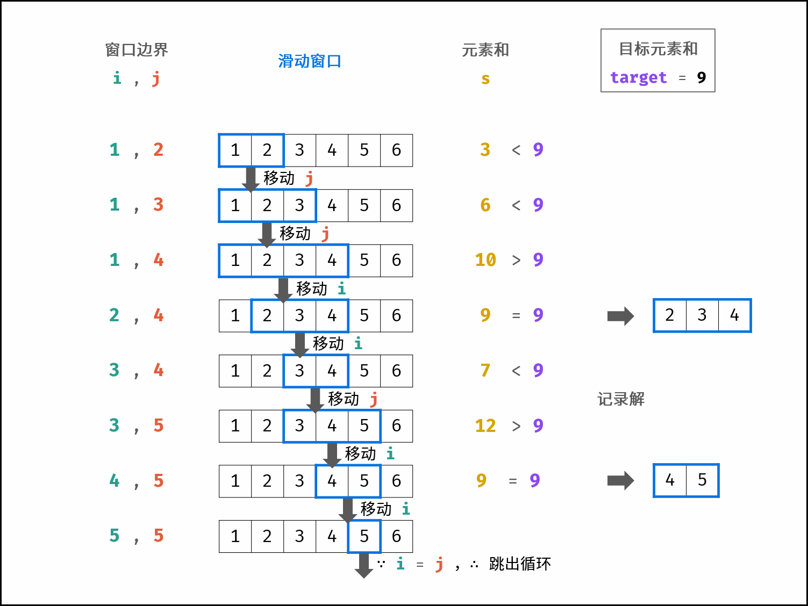

## 1. 概念

## 2. 经典题目
### 滑动窗口
* 【3】给定一个字符串 s ，请你找出其中不含有重复字符的 最长子串 的长度
  * 双指针
  * 最开始两个指针都指向0
  * 整体思想是，右指针右移动，并记录每一位元素的最大位移，如果发现要遍历的元素曾经有过，则将左指针调整至最大的位置+1，进而重新计算
  * 如果右指针发现数组存在该元素，则选取i和存在的作为最大树最为左指针
  * abc -> a[b]c[b] 第二个b作为左指针了
  * abc[b]  -> abc[b]ef[a] ，如果出现了a，即使a存在，左指针依然不 变，因为取i是取最大的
  * abcbef[a]xy[a]，，如果后面又出现了a则需要更新i了，因为i比位置比以前的远
```
    public int lengthOfLongestSubstring(String s) {
        int[] check = new int[128];
        int ans = 0;
        for (int i = 0, j = 0; j < s.length(); j++) {
            i = check[s.charAt(j)] > 0 ? Math.max(i, check[s.charAt(j)]) : i;
            check[s.charAt(j)] = j + 1;
            ans = Math.max(ans, j - i + 1);
        }
        return ans;
    }
```
* 【31】实现获取 下一个排列 的函数，算法需要将给定数字序列重新排列成字典序中下一个更大的排列（即，组合出下一个更大的整数）
  * 贪心的思想，只有前面比后面小才可能交换成大的，找到这个小的后，需要找到最刚刚大的，然后交换，再排个序就好了
  * 从后往前找，找到刚刚比上一个小的元素记作下标i
  * 从后往前找，找到刚刚比i大的元素，交换
  * 将i+1后的元素升序，即是最小的

```
       public static void swap(int[] array, int i, int j) {
        int temp = array[i];
        array[i] = array[j];
        array[j] = temp;
    }

    public static void reverse(int[] array, int i, int j) {
        while (i < j) {
            swap(array, i++, j--);
        }
    }
    public void nextPermutation(int[] nums) {
        int i = nums.length - 1;
        while (i > 0 && nums[i - 1] >= nums[i]) {
            i--;
        }
        if (i == 0) {
            reverse(nums, 0, nums.length - 1);
            return;
        }
        int k = i - 1, j = nums.length - 1;
        while (j > k && nums[k] >= nums[j]) {
            j--;
        }
        swap(nums, k, j);
        reverse(nums, i, nums.length - 1);
    }
   
   public void nextPermutation(int[] nums) {
        int i = nums.length - 1;
        while (i >= 0) {
            if (i < nums.length - 1 && nums[i] < nums[i + 1]) {
                break;
            }
            i--;
        }
        if (i >= 0) {
            int j = nums.length - 1;
            while (j > i && nums[i] >= nums[j]) {
                j--;
            }
            swap(nums, i, j);
        }
        reverse(nums, i+1, nums.length-1);
    }

    public void reverse(int[] nums, int lo, int hi) {
        while (lo < hi) {
            swap(nums, lo++, hi--);
        }
    }

    public void swap(int[] nums, int lo, int hi){
        if (lo == hi) {
            return;
        }
        int temp = nums[lo];
        nums[lo] = nums[hi];
        nums[hi] = temp;
    }
```

```
    public void nextPermutation(int[] nums) {
        int i = nums.length - 2;
        while (i >= 0 && nums[i] >= nums[i + 1]) {
            i--;
        }
        if (i >= 0) {
            int j = nums.length - 1;
            while (j > i) {
                if (nums[j] > nums[i]) {
                    break;
                }
                j--;
            }
            swap(nums, i, j);
        }
        reverse(nums, i + 1, nums.length - 1);
    }

    public void swap(int[] nums, int i, int j) {
        int temp = nums[i];
        nums[i] = nums[j];
        nums[j] = temp;
    }

    public void reverse(int[] nums, int i, int j) {
        while (i < j) {
            swap(nums, i++, j--);
        }
    }
```


* 【76】给你一个字符串 s 、一个字符串 t 。返回 s 中涵盖 t 所有字符的最小子串。如果 s 中不存在涵盖 t 所有字符的子串，则返回空字符串
  * 贪心算法、滚动窗口
  * 两个指针，右指针右移动，直到t中的字符全部覆盖
  * 左值针右移，直到停在第一个补全的位置
  * 记录较小的窗口大小和起始位置
  * 左值针右移一位，触发右指针移动
```
    public String minWindow(String s, String t) {
        int[] check = new int[128];
        for (int i = 0; i < t.length(); i++) {
            check[t.charAt(i)]++;
        }
        int left = 0, right = 0, count = t.length(), start = 0, windowLength = Integer.MAX_VALUE;
        while (right < s.length()) {
            if (check[s.charAt(right)] > 0) {
                count--;
            }
            check[s.charAt(right)]--;
            if (count == 0) {
                //左值针右移动，直到遇到包含的第一个的t字符
                while (left < right && check[s.charAt(left)] < 0) {
                    check[s.charAt(left)]++;
                    left++;
                }
                if (right - left + 1 < windowLength) {
                    windowLength = right - left + 1;
                    start = left;
                }
                check[s.charAt(left)]++;
                left++;
                count++;
            }
            right++;
        }
        return windowLength == Integer.MAX_VALUE ? "" : s.substring(start, start + windowLength);

    }
```

* 【402】 给你一个以字符串表示的非负整数 num 和一个整数 k ，移除这个数中的 k 位数字，使得剩下的数字最小。请你以字符串形式返回这个最小的数字。 
  * 将string放入使用stringbuffer方便删除字符串
  * 贪心的思想，每次从左往右找到第一个大的一个数，删除
  * 需要及时校验字符串是否为空了
  * 需要每次校验是否有前导零

该方法已经超时了
```
    public String removeKdigits(String num, int k) {
        //利用stringbuffer进行删除数据
        StringBuffer buffer = new StringBuffer(num);
        //按照k的次数，一次一次的删除从前往后找的第一个大的数字
        for (int i = 0; i < k; i++) {
            int idx = 0;
            //找到后一个数字大于前一个数字位置。即第一个大于的数字.
            for (int j = 1; j < buffer.length() && buffer.charAt(j) >= buffer.charAt(j-1); j++) {
                idx = j;
            }
            //删除这个数字
            buffer.delete(idx, idx + 1);
            //有可能删除完了，需要校验一下
            if (buffer.length() == 0) {
                return "0";
            }
            //删除前导0
            while (buffer.charAt(0) == '0' && buffer.length() > 1) {
                buffer.delete(0, 1);
            }
        }
        return buffer.toString();
    }
```
使用栈
```
    public String removeKdigits(String num, int k) {
        Deque<Character> deque = new ArrayDeque<>();
        for (char c : num.toCharArray()) {
            while (!deque.isEmpty() && deque.peek() > c && k-- > 0) {
                deque.pop();
            }
            if (c != '0' || !deque.isEmpty()) {
                deque.push(c);
            }
        }
        while (k-- > 0 && !deque.isEmpty()) {
            deque.pop();
        }
        StringBuffer stringBuffer = new StringBuffer();
        while (!deque.isEmpty()) {
            stringBuffer.append(deque.pollLast());
        }
        return stringBuffer.length() == 0 ? "0" : stringBuffer.toString();
    }
```


* 【209】 给定一个含有 n 个正整数的数组和一个正整数 target， 找出该数组中满足其和 ≥ target 的长度最小的 连续子数组 [numsl, numsl+1, ..., numsr-1, numsr] ，并返回其长度。如果不存在符合条件的子数组，返回 0
  * 滑动窗口
  * 左边先增加，右边减少。
```
    public int minSubArrayLen(int target, int[] nums) {
        int lo = 0, hi = 0, len = Integer.MAX_VALUE;
        while (hi < nums.length) {
            target -= nums[hi++];
            while (lo < hi && target <= 0) {
                len = Math.min(len, hi - lo);
                target += nums[lo++];
            }
        }
        return len == Integer.MAX_VALUE ? 0 : len;
    }
```


* 【670】 给定一个非负整数，你至多可以交换一次数字中的任意两位。返回你能得到的最大值
  * 记录每个数字最大出现的位置
  * 从头遍历如果发现有比大的小，就交换
```
    public int maximumSwap(int num) {
        char[] charArray = Integer.toString(num).toCharArray();
        int[] maxIdx = new int[10];
        //记录每个数字的最后一个出现的下标
        for (int i = 0; i < charArray.length; i++) {
            maxIdx[charArray[i] - '0'] = i;
        }
        for (int i = 0; i < charArray.length; i++) {
            //从高位遍历，1992132，
            //从最高的开始遍历
            for (int j = 9; j > charArray[i] - '0'; j--) {
                if (maxIdx[j] > i) {
                    char temp = charArray[maxIdx[j]];
                    charArray[maxIdx[j]] = charArray[i];
                    charArray[i] = temp;
                    return Integer.valueOf(new String(charArray));
                }
            }
        }
        return num;
    }
```

* 【11】给你 n 个非负整数 a1，a2，...，an，每个数代表坐标中的一个点 (i, ai) 。在坐标内画 n 条垂直线，垂直线 i 的两个端点分别为 (i, ai) 和 (i, 0) 。找出其中的两条线，使得它们与 x 轴共同构成的容器可以容纳最多的水
  * 一开始两个指针一个指向开头一个指向结尾，此时容器的底是最大的，接下来随着指针向内移动，会造成容器的底变小，在这种情况下想要让容器盛水变多，就只有在容器的高上下功夫。 那我们该如何决策哪个指针移动呢？我们能够发现不管是左指针向右移动一位，还是右指针向左移动一位，容器的底都是一样的，都比原来减少了 1。这种情况下我们想要让指针移动后的容器面积增大，就要使移动后的容器的高尽量大，所以我们选择指针所指的高较小的那个指针进行移动，这样我们就保留了容器较高的那条边，放弃了较小的那条边，以获得有更高的边的机会
```
    public int maxArea(int[] height) {
        int left = 0, right = height.length - 1, res = 0;
        while (left < right) {
            int lv = height[left], rv = height[right];
            if (lv < rv) {
                res = Math.max(lv * (right - left), res);
                left++;
            } else {
                res = Math.max(rv * (right - left), res);
                right--;
            }
        }
        return res;
    }

```


* 【135】老师想给孩子们分发糖果，有 N 个孩子站成了一条直线，老师会根据每个孩子的表现，预先给他们评分。每个孩子至少分配到 1 个糖果，评分更高的孩子必须比他两侧的邻位孩子获得更多的糖果
  * 从左到右，保存以左边对比，每个孩子至少的糖果
  * 以右到左，判断以右边对比，每个孩子至少的糖果
  * 取最大值。
```
    public int candy(int[] ratings) {
        int[] ans = new int[ratings.length];
        ans[0] = 1;
        for (int i = 1; i < ans.length; i++) {
            ans[i] = (ratings[i] > ratings[i - 1] ? ans[i - 1] + 1 : 1);
        }
        int sum = ans[ratings.length - 1];
        for (int i = ans.length - 2; i >= 0; i--) {
            ans[i] = ratings[i] > ratings[i + 1] && ans[i] <= ans[i + 1] ? ans[i + 1] + 1 : ans[i];
            sum += ans[i];
        }
        return sum;
    }
   
   
   public int candy(int[] ratings) {
        int[] left = new int[ratings.length], right = new int[ratings.length];
        Arrays.fill(left, 1);
        Arrays.fill(right, 1);
        for (int i = 1; i < ratings.length; i++) {
            if (ratings[i] > ratings[i - 1]) {
                left[i] = left[i - 1] + 1;
            }
        }
        int res = 0;
        for (int i = ratings.length - 1; i >= 0; i--) {
            if (i <  ratings.length - 1 && ratings[i] > ratings[i + 1]) {
                right[i] = right[i + 1] + 1;
            }
            res += Math.max(left[i], right[i]);
        }
        return res;
    }
```

* 【556】给你一个正整数 n ，请你找出符合条件的最小整数，其由重新排列 n 中存在的每位数字组成，并且其值大于 n 。如果不存在这样的正整数，则返回 -1 。 
  * 贪心算法
  * 从后往前找到比后面小的元素，这样才可能有小数字
  * 然后从后往前找到刚刚比上一个元素大或相等的元素交换，那么交换后，一定是比前一个小后一个大的。
  * 对后续的元素反转一下就正好是结果了。
  * 注意题目要求可能会大于Integer的最大值，需要用Long判断结果

```
   public int nextGreaterElement(int n) {
        char[] chars = String.valueOf(n).toCharArray();
        if (chars.length <= 1) {
            return -1;
        }
        //从后往前找，刚刚比后一个小的点
        int i = chars.length - 2;
        while (i >= 0 && chars[i] >= chars[i + 1]) {
            i--;
        }
        if (i < 0) {
            return -1;
        }
        //找到刚好比i大的点作为交换的点
        int swapJoint = chars.length - 1;
        while (swapJoint > i && chars[swapJoint] <= chars[i]) {
            swapJoint--;
        }
        swap(chars, i, swapJoint);
        reverse(chars, i + 1, chars.length - 1);
        long res = Long.valueOf(String.valueOf(chars));
        return res > Integer.MAX_VALUE ? -1 : (int) res;
    }

    private void swap(char[] chars, int i, int j) {
        char temp = chars[i];
        chars[i] = chars[j];
        chars[j] = temp;
    }

    private void reverse(char[] chars, int i, int j) {
        while (i < j) {
            swap(chars, i++, j--);
        }
    }
```

* 【763】字符串 S 由小写字母组成。我们要把这个字符串划分为尽可能多的片段，同一字母最多出现在一个片段中。返回一个表示每个字符串片段的长度的列表。 
  *  先扫描一遍整个S，建立一个字典，字典的键是字母，值是这个字母最后一次出现的下标
  *  再线性扫描S，设置变量right 用于表示分隔开的子字符串的末尾在S里的下标，变量left表示子字符串的开头在S里的下标
  *  当前扫描的元素的最后一次出现的下标比right大，就说明子字符串还需要延长，就刷新right
  *  如果当前扫描的元素的下标已经达到了right，就说明这个子字符串完全已经找到了，就可以把答案添加到res中
```
    public List<Integer> partitionLabels(String s) {
        int[] last = new int[26];
        for (int i = 0; i < s.length(); i++) {
            last[s.charAt(i) - 'a'] = i;
        }
        List<Integer> res = new ArrayList();
        int start = 0, end = 0;
        for (int i = 0; i < s.length(); i++) {
            end = Math.max(end, last[s.charAt(i) - 'a']);
            if (end == i) {
                res.add(end - start + 1);
                start = end + 1;
            }
        }
        return res;
    }
```

* 【134】在一条环路上有 N 个加油站，其中第 i 个加油站有汽油 gas[i] 升。你有一辆油箱容量无限的的汽车，从第 i 个加油站开往第 i+1 个加油站需要消耗汽油 cost[i] 升。你从其中的一个加油站出发，开始时油箱为空.如果你可以绕环路行驶一周，则返回出发时加油站的编号，否则返回 -1。 
  * 两个数组之差的总和必须大于等于0，否则不能完成绕行
  * 一个站的收益如果小于0，肯定不能作为起点；而连续的多个站也可以等效地看做一个站，如果其累积收益小于0，就跳过，寻找下一个。
```
    public int canCompleteCircuit(int[] gas, int[] cost) {
        //总汽油消耗差，聚合消耗差，下标
        int total = 0, single = 0, idx = 0;
        for (int i = 0; i < cost.length; i++) {
            total += gas[i] - cost[i];//总和必须大于等于0，否则不能完成绕行
            single += gas[i] - cost[i];
            if (single < 0) {
                idx = i + 1;//一个站的收益如果小于0，肯定不能作为起点；而连续的多个站也可以等效地看做一个站，如果其累积收益小于0，就跳过，寻找下一个
                single = 0;// 还原到初始状态
            }
        }
        return total < 0 ? -1 : idx % gas.length ;
    }
```

* 【45】给你一个非负整数数组 nums ，你最初位于数组的第一个位置。 数组中的每个元素代表你在该位置可以跳跃的最大长度.你的目标是使用最少的跳跃次数到达数组的最后一个位置。 假设你总是可以到达数组的最后一个位置
  * 总体思想，每次跳最远的，注意最后一步不能跳
  * 当前节点能够触达的最远节点
  * 记录一个步数
  * 记录当前这一步能够移动位置
  * 参考https://leetcode-cn.com/problems/jump-game-ii/solution/xiang-xi-tong-su-de-si-lu-fen-xi-duo-jie-fa-by-10/
```
    public int jump(int[] nums) {
        int maxIdx = 0,/*当前节点能够触达的最远节点*/steps = 0, /*步数*/stepIdx = 0; /*当前移动位置*/
        for (int i = 0; i < nums.length - 1; i++) {
            maxIdx = Math.max(maxIdx, i + nums[i]);
            if (i == stepIdx) {//
                steps++;
                stepIdx = maxIdx;
            }
        }
        return steps;
    }

       public int jump(int[] nums) {
        int length = nums.length;
        int end = 0;
        int maxPosition = 0; 
        int steps = 0;
        for (int i = 0; i < length - 1; i++) {
            maxPosition = Math.max(maxPosition, i + nums[i]); 
            if (i == end) {
                end = maxPosition;
                steps++;
            }
        }
        return steps;
    }
```
* 【55】给定一个非负整数数组 nums ，你最初位于数组的 第一个下标
  * 不一定非要明确一次究竟跳几步，每次取最大的跳跃步数，这个就是可以跳跃的覆盖范围。这个范围内，别管是怎么跳的，反正一定可以跳过来
  * 每次取最大跳跃步数（取最大覆盖范围），整体最优解：最后得到整体最大覆盖范围，看是否能到终点
```
    public boolean canJump(int[] nums) {
        //2,3,1,1,4
        int maxIdx = 0;
        for (int i = 0; i < nums.length; i++) {
            if (i > maxIdx) {
                return false;
            }
            maxIdx = Math.max(maxIdx, i + nums[i]);
        }
        return true;
    }
```


* 【354】给你一个二维整数数组 envelopes ，其中 envelopes[i] = [wi, hi] ，表示第 i 个信封的宽度和高度。当另一个信封的宽度和高度都比这个信封大的时候，这个信封就可以放进另一个信封里，如同俄罗斯套娃一样。请计算 最多能有多少个 信封能组成一组“俄罗斯套娃”信封（即可以把一个信封放到另一个信封里面）
  * 如下面的注释
```
    [[1, 1], [2, 3], [4, 6], [4, 5], [6, 7]]
    Searching for height of 1
    Result of search: -1
    Inserting height at index: 0
    1 0 0 0 0 
    l is now 1
    Searching for height of 3
    Result of search: -2
    Inserting height at index: 1
    1 3 0 0 0 
    l is now 2
    Searching for height of 6
    Result of search: -3
    Inserting height at index: 2
    1 3 6 0 0 
    l is now 3
    Searching for height of 5
    Result of search: -3
    Inserting height at index: 2
    1 3 5 0 0 
    l is now 3
    Searching for height of 7
    Result of search: -4
    Inserting height at index: 3
    1 3 5 7 0 
    l is now 4
    Max number of envelopes: 4


    //方法1，贪心加二分查找
    public int maxEnvelopes(int[][] envelopes) {
        if (envelopes == null || envelopes.length == 0 || envelopes[0].length != 2) {
            return 0;
        }
        //先按照长度递增排序，如果长相等，则按照宽递减排序,如果是不是递减排序,相同的的长度如果遇到更高的宽度则会被认为是合适的宽度，这是不符合要求的，导致结果变多。
        Arrays.sort(envelopes, (e1, e2) -> e1[0] == e2[0] ? e2[1] - e1[1] : e1[0] - e2[0]);
        //记录递增序列的最后一个元素值，如[3,4,7]表示长度为1的递增序列最后一位为3，长度为2的递增序列最后一位为4，一次类推
        int[] tails = new int[envelopes.length];
        //递增序列的长度
        int len = 0;
        for (int[] envelope : envelopes) {
            int idx = Arrays.binarySearch(tails, 0, len, envelope[1]);
            //如果为负数则没找到，返回的时候要插入的下标的负数
            if (idx < 0) {
                idx = -(idx + 1);
            }
            //如果新的递增序列的最后一位的值
            tails[idx] = envelope[1];
            //如果递增子序列长度增加了，则len加1
            if (idx == len) {
                len++;
            }
        }
        return len;
    }
      //方法2,标准的动态规划
      public int maxEnvelopes(int[][] envelopes) {
        if (envelopes.length == 0) {
            return 0;
        }
        
        int n = envelopes.length;
        Arrays.sort(envelopes, new Comparator<int[]>() {
            public int compare(int[] e1, int[] e2) {
                if (e1[0] != e2[0]) {
                    return e1[0] - e2[0];
                } else {
                    return e2[1] - e1[1];
                }
            }
        });

        int[] f = new int[n];
        Arrays.fill(f, 1);
        int ans = 1;
        for (int i = 1; i < n; ++i) {
            for (int j = 0; j < i; ++j) {
                if (envelopes[j][1] < envelopes[i][1]) {
                    f[i] = Math.max(f[i], f[j] + 1);
                }
            }
            ans = Math.max(ans, f[i]);
        }
        return ans;
    }
```

* 【1004】最大连续1的个数 III.给定一个由若干 0 和 1 组成的数组 A，我们最多可以将 K 个值从 0 变成 1 。返回仅包含 1 的最长（连续）子数组的长度
  * 题意转化为找出一个最长的子数组，该子数组内最多允许有 K 个 0
  * 求最大连续子区间，可以使用滑动窗口方法。滑动窗口的限制条件是：窗口内最多有 K 个 0
  * 使用 leftleft 和 rightright 两个指针，分别指向滑动窗口的左右边界。
  * right 主动右移：rightright 指针每次移动一步。当 A[right]A[right] 为 00，说明滑动窗口内增加了一个 00
  * left 被动右移：判断此时窗口内 00 的个数，如果超过了 KK，则 leftleft 指针被迫右移，直至窗口内的 00 的个数小于等于 KK 为止
  * 滑动窗口长度的最大值就是所求
```
    public int longestOnes(int[] nums, int k) {
        int zeros = 0, lo = 0, hi = 0, res = 0;
        while (hi < nums.length) {
            if (nums[hi] == 0) {
                zeros++;
            }
            //保证滑动窗口中的0小于k的个数
            while (zeros > k) {
                if (nums[lo++] == 0) {
                    zeros--;
                }
            }
            //统计1的个数
            res = Math.max(res, hi - lo + 1);
            hi++;
        }
        return res;
    }
```

* 【567】给你两个字符串 s1 和 s2 ，写一个函数来判断 s2 是否包含 s1 的排列。如果是，返回 true ；否则，返回 false 。  换句话说，s1 的排列之一是 s2 的 子串
  * 滑动窗口
```
   public boolean checkInclusion(String s1, String s2) {
        int[] dict = new int[26], freq = new int[26];
        int size = 0;//统计s1字母的个数
        for (int i = 0; i < s1.length(); i++) {
            int c = s1.charAt(i) - 'a';
            if (dict[c] == 0) {
                size++;
            }
            dict[c]++;//记录s1每个字母的个数
        }
        int lo = 0, hi = 0, match = 0;
        while (hi < s2.length()) {
            int c = s2.charAt(hi) - 'a';
            freq[c]++;
            if (dict[c] == freq[c]) {//s2某一个字符的数量达到了s1的某一个字符的数量了。
                match++;
            }
            while (match == size) { //不符合匹配要求，需要从左收缩窗口,因为有可能字符不是s1数组的元素
                if (s1.length() == (hi - lo + 1)) {//s1所有字符数量都有了，且长度为滑动窗口长度，说明是连续的,符合要求
                    return true;
                }
                int lc = s2.charAt(lo++) - 'a';
                freq[lc]--;
                if (freq[lc] < dict[lc]) {//其它元素是大于dict的
                    match--;
                }
            }
            hi++;
        }
        return false;
    }
```
//注意理解
```
   public boolean checkInclusion(String s1, String s2) {
        int[] dict = new int[26];
        for (char c : s1.toCharArray()) {
            dict[c - 'a']++;
        }
        int i = 0, j = 0;
        while (j < s2.length()) {
            char c = s2.charAt(j++);
            dict[c - 'a']--;
            //出现了多余的字符，注意理解例如aabc  x[aab(a)]cz -->只需要移动到dict[a]>=0即可，即 xa[ab(a)]cz -> xa[ab(a)]cz
            while (dict[c - 'a'] < 0) {
                char l = s2.charAt(i++);
                dict[l - 'a']++;
            }
            if (j - i == s1.length()) {
                return true;
            }
        }
        return false;
    }
```


* 【922】给定一个非负整数数组 A， A 中一半整数是奇数，一半整数是偶数。对数组进行排序，以便当 A[i] 为奇数时，i 也是奇数；当 A[i] 为偶数时， i 也是偶数。 你可以返回任何满足上述条件的数组作为答案。

```
   public int[] sortArrayByParityII(int[] nums) {
        int j = 1;//奇数初始位置
        for (int i = 0; i < nums.length; i += 2) {
            if (nums[i] % 2 == 1) { //如果偶数的位置是奇数,则需要找个偶数来交换
                while (nums[j] % 2 == 1) {//如果奇数的位置就是奇数，则往后移动寻转，直到不是的
                    j += 2;
                }
                swap(nums, i, j);
            }
        }
        return nums;
    }

    private void swap(int[] nums, int i, int j) {
        int temp = nums[i];
        nums[i] = nums[j];
        nums[j] = temp;
    }
```


* 【offer48】请从字符串中找出一个最长的不包含重复字符的子字符串，计算该最长子字符串的长度
  * 滑动窗口
  * 遍历hi时，根据hi在以前是否存在重复来更新左值针
  * 取与lo的最大值即可
```
    public int lengthOfLongestSubstring(String s) {
        if (s == null || s.length() == 0) {
            return 0;
        }
        int[] cache = new int[128];
        int lo = 0, hi = 0, res = 1;
        while (hi < s.length()) {
            //遍历hi时，根据hi在以前是否存在重复来更新左值针
            lo = cache[s.charAt(hi)] > 0 ? Math.max(cache[s.charAt(hi)], lo) : lo;
            cache[s.charAt(hi)] = hi + 1;
            res = Math.max(res, hi - lo + 1);
            hi++;
        }
        return res;
    }
```

* 【581】最短无序连续子数组，给你一个整数数组 nums ，你需要找出一个 连续子数组 ，如果对这个子数组进行升序排序，那么整个数组都会变为升序排序。请你找出符合题意的 最短 子数组，并输出它的长度。
  * 如果最右端的一部分已经排好序，这部分的每个数都比它左边的最大值要大，同理，如果最左端的一部分排好序，这每个数都比它右边的最小值小。所以我们从左往右遍历，如果i位置上的数比它左边部分最大值小，则这个数肯定要排序， 就这样找到右端不用排序的部分，同理找到左端不用排序的部分，它们之间就是需要排序的部分
  * 从左到右循环，记录最大值为 max，若 nums[i] < max, 则表明位置 i 需要调整, 循环结束，记录需要调整的最大位置 i 为 high; 同理，从右到左循环，记录最小值为 min, 若 nums[i] > min, 则表明位置 i 需要调整，循环结束，记录需要调整的最小位置 i 为 low.
```
    public int findUnsortedSubarray(int[] nums) {
        int hi = 0, lo = nums.length - 1, max = nums[0], min = nums[nums.length - 1];
        for (int i = 0; i < nums.length; i++) {
            max = Math.max(nums[i], max);
            min = Math.min(nums[nums.length - 1 - i], min);
            if (max > nums[i]) {
                hi = i;
            }
            if (min < nums[nums.length - 1 - i]) {
                lo = nums.length - 1 - i;
            }
        }
        return hi > lo ? hi - lo + 1 : 0;
    }
```


* 【438】找到字符串中所有字母异位词。给定两个字符串 s 和 p，找到 s 中所有 p 的 异位词 的子串，返回这些子串的起始索引。不考虑答案输出的顺序。

异位词 指由相同字母重排列形成的字符串（包括相同的字符串）。
   * 可伸缩的滑动窗口，窗口最大只能到p.length()
```
    public List<Integer> findAnagrams(String s, String p) {
        List<Integer> list = new ArrayList<>();
    if (s == null || s.length() == 0 || p == null || p.length() == 0) return list;
    
    int[] hash = new int[256]; //character hash
    
    //record each character in p to hash
    for (char c : p.toCharArray()) {
        hash[c]++;
    }
    //two points, initialize count to p's length
    int left = 0, right = 0, count = p.length();
    
    while (right < s.length()) {
        //move right everytime, if the character exists in p's hash, decrease the count
        //current hash value >= 1 means the character is existing in p
        if (hash[s.charAt(right)] >= 1) {
            count--;
        }
        hash[s.charAt(right)]--;
        right++;
        
        //when the count is down to 0, means we found the right anagram
        //then add window's left to result list
        if (count == 0) {
            list.add(left);
        }
        //if we find the window's size equals to p, then we have to move left (narrow the window) to find the new match window
        //++ to reset the hash because we kicked out the left
        //only increase the count if the character is in p
        //the count >= 0 indicate it was original in the hash, cuz it won't go below 0
        if (right - left == p.length() ) {
           
            if (hash[s.charAt(left)] >= 0) {
                count++;
            }
            hash[s.charAt(left)]++;
            left++;
        
        }

        
    }
        return list;
    }
```

* 【435】给定一个区间的集合，找到需要移除区间的最小数量，使剩余区间互不重叠。

注意:

可以认为区间的终点总是大于它的起点。
区间 [1,2] 和 [2,3] 的边界相互“接触”，但没有相互重叠。
  * 贪心策略，先计算最多能组成的不重叠区间个数，然后用区间总个数减去不重叠区间的个数。

在每次选择中，选择的区间结尾越小，留给后面的区间的空间越大，那么后面能够选择的区间个数也就越大。

按区间的结尾进行升序排序，每次选择结尾最小，并且和前一个区间不重叠的区间。

在对数组进行排序的时候也可以使用 lambda 表示式来创建 Comparator ，不过算法运行时间会比较长点
```
    public int eraseOverlapIntervals(int[][] intervals) {
        if (intervals == null || intervals.length < 2) {
            return 0;
        }
        Arrays.sort(intervals, Comparator.comparingInt(o -> o[1]));
        int count = 1, lastEnd = intervals[0][1];
        for (int[] interval : intervals) {
            if (interval[0] < lastEnd) {
                continue;
            }
            lastEnd = interval[1];
            count++;
        }
        return intervals.length - count;
    }
```


* 【mianshi1606】给定两个整数数组a和b，计算具有最小差绝对值的一对数值（每个数组中取一个值），并返回该对数值的差
  * 排序后，进行比较
  *     int diff = a[i] - b[j]
    如果 diff < 0 ，表示 a[i] 小于 b[j] ，a 尽可能接近 b，那么 i++
    如果 diff > 0 ，表示 a[i] 大于 b[j] ，b 尽可能接近 a，那么 j++

```
    /*
    对两个数组进行排序
    双指针
    
    int diff = a[i] - b[j]
    如果 diff < 0 ，表示 a[i] 小于 b[j] ，a 尽可能接近 b，那么 i++
    如果 diff > 0 ，表示 a[i] 大于 b[j] ，b 尽可能接近 a，那么 j++

    特殊情况：
    a = {1,2,3,4,5}
    b = {6,7,8,9,10}
    如果 a 数组最大值比 b 数组最小值还小，那么 a 数组 i 会一直右移，直到到达边界 break
    */
    public int smallestDifference(int[] a, int[] b) {
        Arrays.sort(a);
        Arrays.sort(b);
        int i = 0, j = 0, min = Integer.MAX_VALUE;
        while (i < a.length && j < b.length) {
            long diff = (long)(a[i] - b[j]); //使用 long，防止 -2147483648 转正数后还是 -2147483648
            if (diff < 0) {
                i++;
            } else {
                j++;
            }
            min = (int)Math.min(Math.abs(diff), min);
        }
        return min;
    }
```


* 【658】给定一个排序好的数组 arr ，两个整数 k 和 x ，从数组中找到最靠近 x（两数之差最小）的 k 个数。返回的结果必须要是按升序排好的。整数 a 比整数 b 更接近 x 需要满足：|a - x| < |b - x| 或者  |a - x| == |b - x| 且 a < b 
  * 一个一个删，因为是有序数组，且返回的是连续升序子数组，所以 每一次删除的元素一定位于边界 ；
  * 一共 7 个元素，要保留 3 个元素，因此要删除 4 个元素；
  * 因为要删除的元素都位于边界，于是可以使用 双指针 对撞的方式确定保留区间，即「最优区间」
```
    public List<Integer> findClosestElements(int[] arr, int k, int x) {
        int lo = 0, hi = arr.length - 1, removes = arr.length - k;
        while (removes > 0) {
            if (x - arr[lo] <= arr[hi] - x) {
                hi--;
            } else {
                lo++;
            }
            removes--;
        }
        List<Integer> res = new ArrayList<>();
        for (int i = lo; i <= hi; i++) {
            res.add(arr[i]);
        }
        return res;
    }
```

* 【1288】删除被覆盖区间
  给你一个区间列表，请你删除列表中被其他区间所覆盖的区间。
  只有当 c <= a 且 b <= d 时，我们才认为区间 [a,b) 被区间 [c,d) 覆盖。
  在完成所有删除操作后，请你返回列表中剩余区间的数目。

  * 将区间按左边界升序排序，若左边界相同，则按区间右边界进行降序排序（为了使被覆盖的区间排到后面）。

两个区间之间会有三种情况：（1）覆盖；（2）不相交；（3）相交，所以需要比较两个区间的左边界和右边界的值。
```
    public int removeCoveredIntervals(int[][] intervals) {
        Arrays.sort(intervals, (o1, o2) -> o1[0] == o2[0] ? o2[1] - o1[1] : o1[0] - o2[0]);
        int last = intervals[0][1], count = 0;
        for (int i = 1; i < intervals.length; i++) {
            if (intervals[i][1] <= last) {
                count++;
            } else {
                last = intervals[i][1];
            }
        }
        return intervals.length - count;
    }
```
* 【223】矩形面积，给你 二维 平面上两个 由直线构成且边与坐标轴平行/垂直 的矩形，请你计算并返回两个矩形覆盖的总面积。

每个矩形由其 左下 顶点和 右上 顶点坐标表示：

第一个矩形由其左下顶点 (ax1, ay1) 和右上顶点 (ax2, ay2) 定义。
第二个矩形由其左下顶点 (bx1, by1) 和右上顶点 (bx2, by2) 定义。
* 总面积减去阴影的面积

```
    public int computeArea(int ax1, int ay1, int ax2, int ay2, int bx1, int by1, int bx2, int by2) {
        int width = Math.max(0, Math.min(ax2, bx2) - Math.max(ax1, bx1));
        int height = Math.max(0, Math.min(ay2, by2) - Math.max(ay1, by1));
        return (ax2 - ax1) * (ay2 - ay1) + (bx2 - bx1) * (by2 - by1) - width * height;
    }
```
* 【1456】定长子串中元音的最大数目。
给你字符串 s 和整数 k 。

请返回字符串 s 中长度为 k 的单个子字符串中可能包含的最大元音字母数。

英文中的 元音字母 为（a, e, i, o, u）。
```
    public int maxVowels(String s, int k) {
        int i = 0, j = 0, total = 0, max = 0;
        while (j < s.length()) {
            if (check(s.charAt(j++))) {//右边界滑动1位
                total++;
            }
            while (j - i == k) {  //到达长度要求
                max = Math.max(max, total);//更新结果
                if (check(s.charAt(i))) {//移动左边界，判断是否需要total减少
                    total--;
                }
                i++;
            }
        }
        return max;
    }

    private boolean check(char ch) {
        return ch == 'a' || ch == 'e' || ch == 'i' | ch == 'o' || ch == 'u';
    }
```

【678】有效的括号字符串、  
给定一个只包含三种字符的字符串：（ ，） 和 *，写一个函数来检验这个字符串是否为有效字符串。有效字符串具有如下规则：

任何左括号 ( 必须有相应的右括号 )。
任何右括号 ) 必须有相应的左括号 ( 。
左括号 ( 必须在对应的右括号之前 )。
* 可以被视为单个右括号 ) ，或单个左括号 ( ，或一个空字符串。
一个空字符串也被视为有效字符串。

使用贪心的思想，可以将空间复杂度降到O(1)。
从左到右遍历字符串，遍历过程中，未匹配的左括号数量可能会出现如下变化:·如果遇到左括号，则未匹配的左括号数量加1;
·如果遇到右括号，则需要有一个左括号和右括号匹配，因此未匹配的左括号数量减1;
·如果遇到星号，由于星号可以看成左括号、右括号或空字符串，因此未匹配的左括号数量可能加1、减1或不变。
基于上述结论，可以在遍历过程中维护未匹配的左括号数量可能的最小值和最大值，根据遍历到的字符更新最小值和最大值:
·如果遇到左括号，则将最小值和最大值分别加1;·如果遇到右括号，则将最小值和最大值分别减1;·如果遇到星号，则将最小值减1，将最大值加1。
任何情况下，未匹配的左括号数量必须非负，因此当最大值变成负数时，说明没有左括号可以和右括号匹配，返回false。
当最小值为0时，不应将最小值继续减少，以确保最小值非负。
遍历结束时，所有的左括号都应和右括号匹配，因此只有当最小值为0时，字符串s才是有效的括号字符串。

```
    public boolean checkValidString(String s) {
        int min = 0, max = 0;//未匹配的左括号的可能最小值和最大值
        for (char c : s.toCharArray()) {
            if (c == '(') { //出现新的左括号
                min++;
                max++;
            } else if (c == ')') {//出现右括号将其抵消
                min--;
                max--;
            } else {//出现其他的，可能是左括号，也可能是右括号
                min--;
                max++;
            }
            min = Math.max(0, min);
            if (min > max) {
                return false;
            }
        }
        return min == 0;
    }
```

* 【1658】 将 x 减到 0 的最小操作数
  给你一个整数数组 nums 和一个整数 x 。每一次操作时，你应当移除数组 nums 最左边或最右边的元素，然后从 x 中减去该元素的值。请注意，需要 修改 数组以供接下来的操作使用。如果可以将 x 恰好 减到 0 ，返回 最小操作数 ；否则，返回 -1 。
  * 滑动窗口找中间最长的片段使得sum(片段)=sum(nums)-x 
```
   public int minOperations(int[] nums, int x) {
        int target = Arrays.stream(nums).sum() - x;
        if (target < 0) {
            return -1;
        }
        int lo = 0, hi = 0, ans = Integer.MIN_VALUE, sum = 0;
        while (hi < nums.length) {
            sum += nums[hi++];
            while (sum > target) {
                sum -= nums[lo++];
            }
            if (sum == target) {
                ans = Math.max(hi - lo, ans);
            }

        }
        return ans == Integer.MIN_VALUE ? -1 : nums.length - ans;
    }
```

```
//注意边界条件
public int minOperations(int[] nums, int x) {
        int target = Arrays.stream(nums).sum() - x;
        if (target < 0) {
            return -1;
        }
        //最长子数组
        int i = 0, j = 0, max = Integer.MIN_VALUE;
        while (j < nums.length) {
            target -= nums[j++];
            if (target == 0) {
                max = Math.max(max, j - i);
            }
            while (i <= j && target < 0) {
                target += nums[i++];
            }
        }
        return max == Integer.MIN_VALUE ? -1 : nums.length - max;
    }
```


* 【1675】 数组的最小偏移量
  给你一个由 n 个正整数组成的数组 nums 。

你可以对数组的任意元素执行任意次数的两类操作：

如果元素是 偶数 ，除以 2
例如，如果数组是 [1,2,3,4] ，那么你可以对最后一个元素执行此操作，使其变成 [1,2,3,2]
如果元素是 奇数 ，乘上 2
例如，如果数组是 [1,2,3,4] ，那么你可以对第一个元素执行此操作，使其变成 [2,2,3,4]
数组的 偏移量 是数组中任意两个元素之间的 最大差值 。

返回数组在执行某些操作之后可以拥有的 最小偏移量
  * 首先: 一个数的变化范围有限, 比如所有的奇数都只能做一次乘 2 操作, 偶数可以做若干次除以 2 的操作.

比如 3 可以变成 3, 6; 4 可以变成 1, 2, 4; 12 可以变成 3, 6, 12...

数值可以双向变化不好处理, 我们先变成单向的: 把所有数都变成自己可变化范围的最大值.

那么现在剩下的操作就只有把数缩小了.

而偏移量 = 最大值 - 最小值, 所以我们要做的就是缩小最大值. (缩小其他数值也无法优化偏移量)

那么操作就是: 不断缩小当前的最大值即可, 直到不能缩小, 期间不断维护答案.

Java 使用 TreeSet 或者 PriorityQueue 都可以动态维护最大值.

空间复杂度 o(N), 时间复杂度 o(NlogNlogN)

最多循环 NlogN 次, 因为一个数除以 2 的次数是 logN; 每次循环是 logN.
  * 佬的这个题解可以 先把值都变成最大值，奇数*2，偶数不变。 然后每次对最大的值/2，求差值，差值的最小值就是答案

```
    public int minimumDeviation(int[] nums) {
        TreeSet<Integer> treeSet = new TreeSet<>();
        for (int num : nums) {
            treeSet.add(num % 2 == 0 ? num : 2 * num);
        }
        int ans = treeSet.last() - treeSet.first();
        while (ans > 0 && treeSet.last() % 2 == 0) {
            int tempMax = treeSet.last();
            treeSet.remove(tempMax);
            treeSet.add(tempMax / 2);
            ans = Math.min(treeSet.last() - treeSet.first(), ans);
        }
        return ans;
    }
```

* 【Offer 43】 1～n 整数中 1 出现的次数
输入一个整数 n ，求1～n这n个整数的十进制表示中1出现的次数。

例如，输入12，1～12这些整数中包含1 的数字有1、10、11和12，1一共出现了5次。
  * 见下面的思路
假设 n = xyzdabc，此时我们求千位是 1 的个数，也就是 d 所在的位置。

那么此时有三种情况，

d == 0，那么千位上 1 的个数就是 xyz * 1000
d == 1，那么千位上 1 的个数就是 xyz * 1000 + abc + 1
d > 1，那么千位上 1 的个数就是 xyz * 1000 + 1000

```
如果n = 4560234
让我们统计一下千位有多少个 1
xyz 可以取 0 到 455, abc 可以取 0 到 999
4551000 to 4551999 (1000)
4541000 to 4541999 (1000)
4531000 to 4531999 (1000)
...
  21000 to   21999 (1000)
  11000 to   11999 (1000)    
   1000 to    1999 (1000)
总共就是 456 * 1000

如果 n = 4561234
xyz 可以取 0 到 455, abc 可以取 0 到 999
4551000 to 4551999 (1000)
4541000 to 4541999 (1000)
4531000 to 4531999 (1000)
...
1000 to 1999 (1000)
xyz 还可以取 456, abc 可以取 0 到 234
4561000 to 4561234 (234 + 1)
总共就是 456 * 1000 + 234 + 1

如果 n = 4563234
xyz 可以取 0 到 455, abc 可以取 0 到 999    
4551000 to 4551999 (1000)
4541000 to 4541999 (1000)
4531000 to 4531999 (1000)
...
1000 to 1999 (1000)
xyz 还可以取 456, abc 可以取 0 到 999
4561000 to 4561999 (1000)
总共就是 456 * 1000 + 1000
```
```
    public int countDigitOne(int n) {
        int count = 0;
        for (long k = 1; k <= n; k *= 10) {
            //xyzdabc
            long xyzd = n / k;
            long abc = n % k;
            long d = xyzd % 10;
            long xyz = xyzd / 10;
            count += k * xyz;
            if (d > 1) {
                count += k;
            }
            if (d == 1) {
                count += abc + 1;
            }
        }
        return count;
    }
```


* 【807】. 保持城市天际线
给你一座由 n x n 个街区组成的城市，每个街区都包含一座立方体建筑。给你一个下标从 0 开始的 n x n 整数矩阵 grid ，其中 grid[r][c] 表示坐落于 r 行 c 列的建筑物的 高度 。

城市的 天际线 是从远处观察城市时，所有建筑物形成的外部轮廓。从东、南、西、北四个主要方向观测到的 天际线 可能不同。

我们被允许为 任意数量的建筑物 的高度增加 任意增量（不同建筑物的增量可能不同） 。 高度为 0 的建筑物的高度也可以增加。然而，增加的建筑物高度 不能影响 从任何主要方向观察城市得到的 天际线 。

在 不改变 从任何主要方向观测到的城市 天际线 的前提下，返回建筑物可以增加的 最大高度增量总和   

  * 把每一行的而最大值，和每一竖的最大值求出来，遍历每一个点能够增大不能超过这个两个值。
```
   public int maxIncreaseKeepingSkyline(int[][] grid) {
        int[] row = new int[grid.length], col = new int[grid[0].length];
        for (int i = 0; i < grid.length; i++) {
            for (int j = 0; j < grid.length; j++) {
                row[i] = Math.max(row[i], grid[i][j]);
                col[j] = Math.max(col[j], grid[i][j]);
            }
        }
        int ans = 0;
        for (int i = 0; i < grid.length; i++) {
            for (int j = 0; j < grid.length; j++) {
                //每个点不能超过横向和竖向的最大值
                ans += Math.min(row[i], col[j]) - grid[i][j];
            }
        }
        return ans;
    }
```

* 【1147】段式回文
你会得到一个字符串 text 。你应该把它分成 k 个子字符串 (subtext1, subtext2，…， subtextk) ，要求满足:

subtexti 是非空字符串
所有子字符串的连接等于 text ( 即subtext1 + subtext2 + ... + subtextk == text )
subtexti == subtextk - i + 1 表示所有 i 的有效值( 即 1 <= i <= k )
返回k可能最大值
```
    public int longestDecomposition(String text) {
        String lo = "", hi = "";
        int ans = 0;
        for (int i = 0; i < text.length(); i++) {
            lo = lo + text.charAt(i);
            hi = text.charAt(text.length() - i - 1) + hi;
            if (lo.equals(hi)) {
                lo = "";
                hi = "";
                ans++;
            }
        }
        return ans;
    }
```

* 【321】 拼接最大数
给定长度分别为 m 和 n 的两个数组，其元素由 0-9 构成，表示两个自然数各位上的数字。现在从这两个数组中选出 k (k <= m + n) 个数字拼接成一个新的数，要求从同一个数组中取出的数字保持其在原数组中的相对顺序。

求满足该条件的最大数。结果返回一个表示该最大数的长度为 k 的数组    说明: 请尽可能地优化你算法的时间和空间复杂度

  * 让我们考虑当元素相等时 [6,5,4] & [6,4,9] 在这种情况下，我们应该从第一个数组中选择前 6 个，然后从第二个数组中选择第二个 6，情况本来是如果第一个数组是 [6,7,4]，则不同。首先从第一个数组中选择 6，然后从第一个数组中再次选择 7，然后从第二个数组中选择 6。这与归并排序的归并不同
```
   public int[] maxNumber(int[] nums1, int[] nums2, int k) {
        int[] ans = new int[k];
        int n = nums1.length, m = nums2.length;
        //遍历第一个数组取的数量
        for (int i = Math.max(0, k - m); i <= n && i <= k; i++) {
            int[] cur = merge(maxK(nums1, i), maxK(nums2, k - i), k);
            ans = greater(ans, 0, cur, 0) ? ans : cur;
        }
        return ans;
    }


    //将两个数组合并成k位数，保证这个是最大的前k位
    public int[] merge(int[] nums1, int[] nums2, int k) {
        int[] ans = new int[k];
        for (int i = 0, j = 0, r = 0; r < k; r++) {
            ans[r] = greater(nums1, i, nums2, j) ? nums1[i++] : nums2[j++];
        }
        return ans;
    }

    //两个数组比较，从i，j下标开始，哪个数组的可能的字典序最大
    public boolean greater(int[] nums1, int i, int[] nums2, int j) {
        while (i < nums1.length && j < nums2.length && nums1[i] == nums2[j]) {
            i++;
            j++;
        }
        return j == nums2.length || (i < nums1.length && nums1[i] > nums2[j]);
    }

    //找出顺序不变的最大前k位数
    public int[] maxK(int[] nums, int k) {
        int[] ans = new int[k];
        int n = nums.length;
        for (int i = 0, j = 0; i < n; i++) {
            while (n - i > k - j && j > 0 && ans[j - 1] < nums[i]) {//还剩下备胎比剩下的指标大
                j--;
            }
            if (j < k) {
                ans[j++] = nums[i];
            }
        }
        return ans;
    }
```


* 【1665】. 完成所有任务的最少初始能量
给你一个任务数组 tasks ，其中 tasks[i] = [actuali, minimumi] ：

actuali 是完成第 i 个任务 需要耗费 的实际能量。
minimumi 是开始第 i 个任务前需要达到的最低能量。
比方说，如果任务为 [10, 12] 且你当前的能量为 11 ，那么你不能开始这个任务。如果你当前的能量为 13 ，你可以完成这个任务，且完成它后剩余能量为 3 。

你可以按照 任意顺序 完成任务。

请你返回完成所有任务的 最少 初始能量
  * 思路，actual精力与minunum越接近越好，先拜访那些门槛较低的投资者
/*
直觉
需要排序minimum - actual


解释
我们有n投资人，
每个投资人都可以投入actual精力，
他认为你的公司minimum有价值。

如果你已经至少有minimum - actual精力，
投资人就会给你投入actual精力。

假设你得到了所有的投资，
你最后至少有多少能量？

我们按所需的能量排序minimum - actual。
res是我们当前的能量。
每一轮我们都会获得能量a并达到目标max(res + a, m)。
最后直接返回res。


继续故事
以下解释来自@kaiwensun，投他一票。

minimum - actual是投资者的“酒吧”。 如果您的公司在投资者评估您的公司时还
没有至少minimum - actual能量/价值， 那么您就没有达到投资者的标准。 他们不想投资给你。


不过不用担心，您可以
从自己的口袋里支付一些额外的能量/金钱来达到minimum - actual并达到标准，
然后投资者将投入实际能量。

最终，每个投资者都会对你进行实际投资。
您想支付尽可能少的自费能源/金钱。

因此，您希望您的公司的能量/价值尽可能高，
然后再拜访投资者以评估您的公司。

换句话说，你想先拜访那些门槛较低的投资者。

所以我们按照投资者的“bar”，
即他们的minimum - actual.


复杂
时空O(sort)
_O(sort)


*/

```
    public int minimumEffort(int[][] tasks) {
        Arrays.sort(tasks, ((o1, o2) -> (o1[1] - o1[0]) - (o2[1] - o2[0])));
        int ans = 0;
        for (int[] task : tasks) {
            ans = Math.max(task[0] + ans, task[1]);
        }
        return ans;
    }
```


* 【632】最小区间
你有 k 个 非递减排列 的整数列表。找到一个 最小 区间，使得 k 个列表中的每个列表至少有一个数包含在其中。

我们定义如果 b-a < d-c 或者在 b-a == d-c 时 a < c，则区间 [a,b] 比 [c,d] 小
  * 将分组打横后，记录每个分组的编号，所以用list存储int[]
  * 用滑动窗口求覆盖所有分组后的最小窗口
```
  public int[] smallestRange(List<List<Integer>> nums) {
        List<int[]> array = new ArrayList<>();
        for (int i = 0; i < nums.size(); i++) {
            for (int item : nums.get(i)) {
                array.add(new int[]{item, i});
            }
        }
        array.sort((o1, o2) -> o1[0] - o2[0]);
        int[] ans = new int[]{1, 0}, count = new int[nums.size()];
        int lo = 0, hi = 0, k = 0;
        while (hi < array.size()) {
            if (count[array.get(hi)[1]]++ == 0) {
                k++;
            }
            //如果右指针遍历的分组数等于分组总数，说明满足要求了
            if (k == nums.size()) {
                //收缩左指针
                while (lo < hi && count[array.get(lo)[1]] > 1) {
                    count[array.get(lo)[1]]--;
                    lo++;
                }
                if ((ans[1] < ans[0]) || (array.get(hi)[0] - array.get(lo)[0] < ans[1] - ans[0])) {
                    ans[1] = array.get(hi)[0];
                    ans[0] = array.get(lo)[0];
                }
            }
            hi++;
        }
        return ans;
    }
```


* 【976】. 三角形的最大周长
  给定由一些正数（代表长度）组成的数组 nums ，返回 由其中三个长度组成的、面积不为零的三角形的最大周长 。如果不能形成任何面积不为零的三角形，返回 0。
  * 排序后，从大到小遍历，最大的边，如果最大的另外两个表都满足不了，则最大边要减小
```
    public int largestPerimeter(int[] nums) {
        Arrays.sort(nums);
        for (int z = nums.length - 1; z >= 2; z--) {
            int lo = z - 2, hi = z - 1;
            if (nums[lo] + nums[hi] > nums[z]) {
                return nums[lo] + nums[hi] + nums[z];
            }
        }
        return 0;
    }
```

* 【1647】. 字符频次唯一的最小删除次数
如果字符串 s 中 不存在 两个不同字符 频次 相同的情况，就称 s 是 优质字符串 。

给你一个字符串 s，返回使 s 成为 优质字符串 需要删除的 最小 字符数。

字符串中字符的 频次 是该字符在字符串中的出现次数。例如，在字符串 "aab" 中，'a' 的频次是 2，而 'b' 的频次是 1 

```
    public int minDeletions(String s) {
        Set<Integer> hash = new HashSet<>();
        int[] dict = new int[26];
        for (char c : s.toCharArray()) {
            dict[c - 'a']++;
        }
        int ans = 0;
        for (int i = 0; i < 26; i++) {
            //如果添加的字母个数已经有了说明可以添加
            while (dict[i] > 0 && !hash.add(dict[i])) {
                dict[i]--;
                ans++;
            }
        }
        return ans;
    }
```


* 【646】. 最长数对链
给出 n 个数对。 在每一个数对中，第一个数字总是比第二个数字小。

现在，我们定义一种跟随关系，当且仅当 b < c 时，数对(c, d) 才可以跟在 (a, b) 后面。我们用这种形式来构造一个数对链。

给定一个数对集合，找出能够形成的最长数对链的长度。你不需要用到所有的数对，你可以以任何顺序选择其中的一些数对来构造。
```
    public int findLongestChain(int[][] pairs) {
        Arrays.sort(pairs, (o1, o2) -> o1[1] - o2[1]);
        int ans = 1, last = pairs[0][1];
        for (int[] pair : pairs) {
            if (pair[0] > last) {
                ans++;
                last = pair[1];
            }
        }
        return ans;

    }
```

* 【738】. 单调递增的数字
当且仅当每个相邻位数上的数字 x 和 y 满足 x <= y 时，我们称这个整数是单调递增的。

给定一个整数 n ，返回 小于或等于 n 的最大数字，且数字呈 单调递增
```
    public int monotoneIncreasingDigits(int n) {
        char[] num = Integer.toString(n).toCharArray();
        int i = num.length - 1, j = -1;
        while (i > 0) {
            if (num[i - 1] > num[i]) {
                num[i - 1]--;
                j = i - 1;
            }
            i--;
        }
        if (j == -1) {
            return n;
        }
        j++;
        while (j < num.length) {
            num[j++] = '9';
        }
        return Integer.parseInt(new String(num));
    }
```

* 【324】. 摆动排序 II
给你一个整数数组 nums，将它重新排列成 nums[0] < nums[1] > nums[2] < nums[3]... 的顺序。


```
public void wiggleSort(int[] nums) {
        int[] help = nums.clone(); //不能写成int[] help = nums,排序后两个数组都改变
        Arrays.sort(help);
        int N = nums.length;
        //比如123456
        for (int i = 1; i < nums.length; i += 2) {
            nums[i] = help[--N]; //遍历完成后 x 6 x 5 x 4 
        }
        for (int i = 0; i < nums.length; i += 2) {
            nums[i] = help[--N]; //便利完成后 3 6 2 5 1 4
        }
    }

```

```
  public void wiggleSort(int[] nums) {
        int[] copy = Arrays.copyOf(nums, nums.length);
        Arrays.sort(copy);
        
        int n = nums.length;
        int left = (n + 1) / 2 - 1; // median index
        int right = n - 1; // largest value index
        for (int i = 0; i < nums.length; i++)
        {   // copy large values on odd indexes
            if(i%2==1){
                nums[i] = copy[right];
                right--;
            } else{ // copy values decremeting from median on even indexes
                nums[i] = copy[left];
                left--;
            }
        }
    }
```


```
/**

你可以假设所有输入数组都可以得到满足题目要求的结果
数组按照从小到大排序后，从中间切分,比如 123456 切分后123，456 穿插进行后142536符合题意
但是1223这种就不行了，但是穿插规则可以变一下，两部分逆序穿插，即2 3 1 2
*/
    public void wiggleSort(int[] nums) {
        Arrays.sort(nums);
        int[] ans = new int[nums.length];
        //123456
        int n = nums.length - 1;
       // x6x5x4
        for (int i = 1; i < nums.length; i += 2) {
            ans[i] = nums[n--];
        }
        //362514
        for (int i = 0; i < nums.length; i += 2) {
            ans[i] = nums[n--];
        }
        System.arraycopy(ans, 0, nums, 0, nums.length);
    }
```
* 【Offer57】 - II. 和为s的连续正数序列
输入一个正整数 target ，输出所有和为 target 的连续正整数序列（至少含有两个数）。

序列内的数字由小到大排列，不同序列按照首个数字从小到大排列


```
   public int[][] findContinuousSequence(int target) {
        int i = 1, j = 2, s = 3;
        List<int[]> ans = new ArrayList<>();
        while (i < target) {
            if (s == target) {
                int[] t = new int[j - i + 1];
                for (int k = i; k <= j; k++) {
                    t[k - i] = k;
                }
                ans.add(t);
            }
            if (s >= target) {
                s-=i;
                i++;
            } else {
                j++;
                s+=j;
            }
        }
        return ans.toArray(new int[0][]);
    }
```


* 【697】. 数组的度
给定一个非空且只包含非负数的整数数组 nums，数组的 度 的定义是指数组里任一元素出现频数的最大值。

你的任务是在 nums 中找到与 nums 拥有相同大小的度的最短连续子数组，返回其长度
```
    public int findShortestSubArray(int[] nums) {
        //记录次数，和每个数第一次出现的位置
        Map<Integer, Integer> count = new HashMap<>(), firstIdx = new HashMap<>();
        int ans = 0, degree = 0;
        for (int i = 0; i < nums.length; i++) {
            count.put(nums[i], count.getOrDefault(nums[i], 0) + 1);
            firstIdx.putIfAbsent(nums[i], i);
            if (count.get(nums[i]) > degree) {
                degree = count.get(nums[i]);
                ans = i - firstIdx.get(nums[i]) + 1;
            } else if (count.get(nums[i]) == degree) {
                ans = Math.min(ans, i- firstIdx.get(nums[i]) + 1);
            }
        }
        return ans;
    }
```


* 【915】分割数组

难度中等95收藏分享切换为英文接收动态反馈

给定一个数组 `nums` ，将其划分为两个连续子数组 `left` 和 `right`， 使得：

- `left` 中的每个元素都小于或等于 `right` 中的每个元素。
- `left` 和 `right` 都是非空的。
- `left` 的长度要尽可能小。

*在完成这样的分组后返回 `left` 的 **长度*** 。

用例可以保证存在这样的划分方法

维护两个变量 当前最大值和左数组最大值

```
//维护两个变量 当前最大值和左数组最大值
   public int partitionDisjoint(int[] nums) {
        int leftMax = nums[0], totalMax = nums[0], idx = 0;
        for (int i = 1; i < nums.length; i++) {
            totalMax = Math.max(totalMax, nums[i]);
            if (leftMax > nums[i]) {
                idx = i;
                leftMax = totalMax;
            }
        }
        return idx + 1;
    }
```

