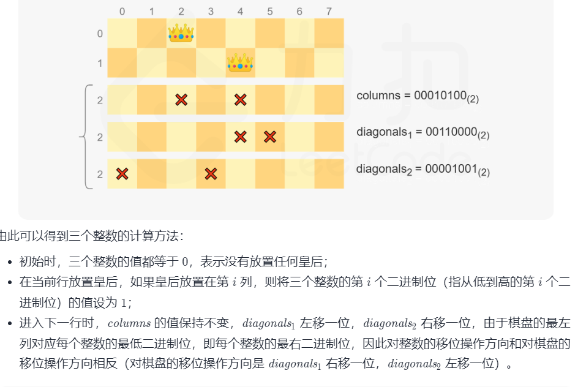
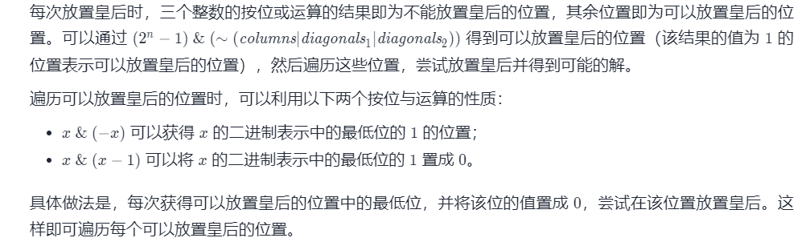

## 1. 概念

## 2. 经典题目 
* 【415】给定两个字符串形式的非负整数 num1 和num2 ，计算它们的和并同样以字符串形式返回
  * 从后往前加
  * 取余取模
  * 注意进位
```
    public String addStrings(String num1, String num2) {
        int n1 = num1.length() - 1, n2 = num2.length() - 1, sum = 0;
        StringBuffer res = new StringBuffer();
        while (n1 >= 0 || n2 >= 0 || sum != 0) {
            if (n1 >= 0) {
                sum += (num1.charAt(n1--) - '0');
            }
            if (n2 >= 0) {
                sum += (num2.charAt(n2--) - '0');
            }
           // res.append(sum % 10);
             buffer.insert(0, sum % 10);
            sum  /= 10;
        }
      //  return res.reverse().toString();
    }
```

* 【191】编写一个函数，输入是一个无符号整数（以二进制串的形式），返回其二进制表达式中数字位数为 '1' 的个数（也被称为汉明重量）

```
    public int hammingWeight(int n) {
        int count = 0;
        while (n != 0) {
            count += n & 1;
            n >>>= 1;
        }
        return count;
    }
    
    public int hammingWeight(int n) {
        int ret = 0;
        while (n != 0) {
            n &= n - 1;
            ret++;
        }
        return ret;
    }
```

* 【136】给定一个非空整数数组，除了某个元素只出现一次以外，其余每个元素均出现两次。找出那个只出现了一次的元素。 
  * 交换律：a ^ b ^ c <=> a ^ c ^ b
  * 任何数于0异或为任何数 0 ^ n => n
  * 相同的数异或为0: n ^ n => 0
```
    public int singleNumber(int[] nums) {
        int res = 0;
        for (int num : nums) {
            res = res ^ num;
        }
        return res;
    }
```

* 【260】给定一个整数数组 nums，其中恰好有两个元素只出现一次，其余所有元素均出现两次。 找出只出现一次的那两个元素。你可以按 任意顺序 返回答案
```
  public int[] singleNumber(int[] nums) {
        int xor = 0;
        for (int num : nums) {
            xor ^= num;
        }
        //找到不同两个数的异或结果的二进制低位1作为标识
        //1代表这一位二进制它们肯定不同
        int mark = xor & -xor;
        int[] res = new int[2];
        for (int num : nums) {
            //将数分为两组，分别为1个数和多个成对的数
            //不同的两个数肯定分开，相同的肯定是一组
            if ((num & mark) == 0) {
                res[0] ^= num;
            } else {
                res[1] ^= num;
            }
        }
        return res;
    }
```

* 【7】给你一个 32 位的有符号整数 x ，返回将 x 中的数字部分反转后的结果。  如果反转后整数超过 32 位的有符号整数的范围 [−231, 231 − 1] ，就返回 0。 假设环境不允许存储 64 位整数（有符号或无符号）
  * 小于2^31的10位数，首位只能是1或2，反转过来末位是1或2，小于7。如果大于7，输入就溢出了。所以不用考虑末位的7和-8，只要保证其余9位满足条件就行
  * 
```
    /**
    一直纠结于边界条件判断，试图通过比较MAX_VALUE和输入数字n反转后的每一位，但是反转后发现比较过程中就出现了溢出现象，然后又想通过反转后的数字reverse与MAX_VALUE mod 10去比较，其实很接近于官方解答了，但判断条件越发复杂，代码逻辑很不优雅。直接看答案了

重点在于2^31和2^31-1最大位为2，也就是说如果数字小于10位时不用去考虑越界问题。等于10位时，只用比较反转后的数字reverse前9位与最大最小值的前9位即可。因为输入数字为10位时，最高位不可能超过2，就是说反转之后reverse的最低位最大为2，不可能超过7，所以前9位不超过最大最小值前9位时，第10位（最低位）不存在超过最大最小值最低位的情况，也就自然不用关注最低位了
    */
    public int reverse(int x) {
        int r = 0;
        while (x != 0) { //循环条件判断条件不能是x>0，因为忽略了 负数
            if (r < Integer.MIN_VALUE / 10 || r > Integer.MAX_VALUE / 10) {
                return 0;
            }
            r = r * 10 + x % 10;
            x /= 10;
        }
        return r;
    }

    //方法2
    public int reverse(int x) {
        int r = 0;
        while (x != 0) { //循环条件判断条件不能是x>0，因为忽略了 负数
            int temp = r * 10 + x % 10;
            if (temp/10 != r) { //// 溢出!!!了
                return 0;
            }
            r = temp;
            x /= 10;
        }
        return r;
    }
```

* 【338】比特位计数，给你一个整数 n ，对于 0 <= i <= n 中的每个 i ，计算其二进制表示中 1 的个数 ，返回一个长度为 n + 1 的数组 ans 作为答案。
  * i & (i - 1)可以去掉i最右边的一个1（如果有），因此 i & (i - 1）是比 i 小的，而且i & (i - 1)的1的个数已经在前面算过了，所以i的1的个数就是 i & (i - 1)的1的个数加上1
```
    public int[] countBits(int n) {
        int[] res = new int[n + 1];
        for (int i = 1; i <= n; i++) {
            res[i] = res[(i - 1) & i] + 1;
        }
        return res;
    }
```

* 【51】N 皇后，n 皇后问题 研究的是如何将 n 个皇后放置在 n×n 的棋盘上，并且使皇后彼此之间不能相互攻击。

给你一个整数 n ，返回所有不同的 n 皇后问题 的解决方案。

每一种解法包含一个不同的 n 皇后问题 的棋子放置方案，该方案中 'Q' 和 '.' 分别代表了皇后和空位。  
  
  
```
    public List<List<String>> solveNQueens(int n) {
        List<List<String>> ans = new ArrayList<>();
        int[] queens = new int[n];
        dfs(n, 0, queens, ans, 0, 0, 0);
        return ans;
    }

    private void dfs(int n, int row, int[] q, List<List<String>> ans, int col, int pie, int la) {
        if (row == n) {
            ans.add(transfer(q));
            return;
        }
        //找到当前行的可用的皇后，并用1标记，2的n次方减1，表示全是1
        int availableQ = ((1 << n) - 1) & (~(pie | la | col));
        while (availableQ != 0) {
            //找到第一个1的数字
            int pos = availableQ & (-availableQ);
            availableQ &= availableQ - 1;
            //获取一共由多少1个
            int count = Integer.bitCount(pos - 1);
            q[row] = count;
            dfs(n, row + 1, q, ans, col | pos, (pie | pos) >> 1, (la | pos) << 1);
        }
    }

    public List<String> transfer(int[] n) {
        List<String> ans = new ArrayList<>();
        for (int i : n) {
            char[] str = new char[n.length];
            Arrays.fill(str, '.');
            str[i] = 'Q';
            ans.add(new String(str));
        }
        return ans;
    }
```

* 【29】两数相除,给定两个整数，被除数 dividend 和除数 divisor。将两数相除，要求不使用乘法、除法和 mod 运算符。

返回被除数 dividend 除以除数 divisor 得到的商。

整数除法的结果应当截去（truncate）其小数部分，例如：truncate(8.345) = 8 以及 truncate(-2.7335) = -2

```
59 / 3 = z
⇒ 59 = 3*z
⇒ x*z <= 59
⇒ 3 * (2^4 + 2^1 + 2^0 )
⇒ 3* ( 16 + 2 + 1)
⇒ 57
  
 而 z =  (2^4 + 2^1 + 2^0 ) = 10011 (19)

按照下面写程序的思路，先得到z值的所有可能情况,
z = {3*2^0,  3*2^1,  3*2^2,  3*2^3,  3*2^4} ,因为3 * (2^5) > 59了，所以往后的不计入在内。

计算z值（ans = 0）：
1, 59 - 3*2^4 = 11, 结果集ans = ans + 1<<4 = 16
2, 11 - 3*2^1 = 5, 结果集ans = ans + 1<< 1 = 16 + 2 = 18
3, 5 - 3*2^0 = 2, 结果集ans = ans + 1<< 0 = 16 + 2  + 1= 19(即，二进制10011)
4，2 < 3 ，循环终止，返回结果ans。
```
```

    /**
     * 解题思路：这题是除法，所以先普及下除法术语
     * 商，公式是：(被除数-余数)÷除数=商，记作：被除数÷除数=商...余数，是一种数学术语。
     * 在一个除法算式里，被除数、余数、除数和商的关系为：(被除数-余数)÷除数=商，记作：被除数÷除数=商...余数，
     * 进而推导得出：商×除数+余数=被除数。
     *
     * 要求商，我们首先想到的是减法，能被减多少次，那么商就为多少，但是明显减法的效率太低
     *
     * 那么我们可以用位移法，因为计算机在做位移时效率特别高，向左移1相当于乘以2，向右位移1相当于除以2
     *
     * 我们可以把一个dividend（被除数）先除以2^n，n最初为31，不断减小n去试探,当某个n满足dividend/2^n>=divisor时，
     *
     * 表示我们找到了一个足够大的数，这个数*divisor是不大于dividend的，所以我们就可以减去2^n个divisor，以此类推
     *
     * 我们可以以100/3为例
     *
     * 2^n是1，2，4，8...2^31这种数，当n为31时，这个数特别大，100/2^n是一个很小的数，肯定是小于3的，所以循环下来，
     *
     * 当n=5时，100/32=3, 刚好是大于等于3的，这时我们将100-32*3=4，也就是减去了32个3，接下来我们再处理4，同样手法可以再减去一个3
     *
     * 所以一共是减去了33个3，所以商就是33
     *
     * 这其中得处理一些特殊的数，比如divisor是不能为0的，Integer.MIN_VALUE和Integer.MAX_VALUE
     *
     */
    public int divide(int dividend, int divisor) {
        if (divisor == 0 || (Integer.MIN_VALUE == dividend && divisor == -1)) {
            return Integer.MAX_VALUE;
        }
        //商×除数+余数=被除数。
        //可以根据2进制的高位慢慢逼近结果
        long beichu = Math.abs((long) dividend), chu = Math.abs((long) divisor);
        int ans = 0;
        for (int i = 31; i >= 0; i--) {
            if ((beichu >> i) >= chu) {//正好逼近到结果及以上
                ans += 1 << i;
                beichu -= chu << i;
            }
        }
        int sign = dividend ^ divisor;//大于零说明符号相反
        return sign < 0 ? -ans : ans;
    }
```
【405】数字转换为十六进制数。给定一个整数，编写一个算法将这个数转换为十六进制数。对于负整数，我们通常使用 补码运算 方法。

注意:

十六进制中所有字母(a-f)都必须是小写。
十六进制字符串中不能包含多余的前导零。如果要转化的数为0，那么以单个字符'0'来表示；对于其他情况，十六进制字符串中的第一个字符将不会是0字符。 
给定的数确保在32位有符号整数范围内。
不能使用任何由库提供的将数字直接转换或格式化为十六进制的方法。
```
   public String toHex(int num) {
        if (num == 0) {
            return "0";
        }
        char[] chars = { '0', '1', '2', '3', '4', '5', '6', '7', '8', '9', 'a', 'b', 'c', 'd', 'e', 'f' };
        //0xf代表二进制的后四位
        StringBuffer res = new StringBuffer();
        while (res.length() < 8 && num != 0) {
            res.append(chars[num & 0xf]);
            num >>= 4 ;
        }
        return res.reverse().toString();
    }
```


* 【137】只出现一次的数字 II
给你一个整数数组 nums ，除某个元素仅出现 一次 外，其余每个元素都恰出现 三次 。请你找出并返回那个只出现了一次的元素
  * 比较难理解，参考https://leetcode-cn.com/problems/single-number-ii/solution/single-number-ii-mo-ni-san-jin-zhi-fa-by-jin407891/
  * 如果位出现了1+1+1，则需要回归0，即two->如果是1的话，则要为0
```

如果能设计一个状态转换电路，使得一个数出现3次时能自动抵消为0，最后剩下的就是只出现1次的数。

开始设计：一个二进制位只能表示0或者1。也就是天生可以记录一个数出现了一次还是两次。

x ^ 0 = x;
x ^ x = 0;
要记录出现3次，需要两个二进制位。那么上面单独的x就不行了。我们需要两个变量，每个变量取一位：

ab ^ 00 = ab;
ab ^ ab = 00;
这里，a、b都是32位的变量。我们使用a的第k位与b的第k位组合起来的两位二进制，表示当前位出现了几次。也就是，一个8位的二进制x就变成了16位来表示。

x = x[7] x[6] x[5] x[4] x[3] x[2] x[1] x[0]

x = (a[7]b[7]) (a[6]b[6]) ... (a[1]b[1]) (a[0]b[0])

于是，就有了这一幕....

它是一个逻辑电路，a、b变量中，相同位置上，分别取出一位，负责完成00->01->10->00，也就是开头的那句话，当数字出现3次时置零。

也就是说对于a,b 相对应的第i位( 0 <= i <= 31)

初始化: a[i]=0, b[i]=0
每次执行一次如下代码:

b = (b ^ nums[i]) & ~a;
a = (a ^ nums[i]) & ~b;
a[i]和b[i]的进行如下更新:

如果该位第一次遇到1: a[i]=0, b[i]=1
如果该位第二次遇到1: a[i]=1, b[i]=0
如果该位第三次遇到1: a[i]=0, b[i]=0
所以b最后保留了那些多余的1的位.

```


```
    public int singleNumber(int[] nums) {
        int one = 0, two = 0;
        for (int num : nums) {
            one = one ^ num & ~two;
            two = two ^ num & ~one;
        }
        return one;
    }
```


* 【861】 翻转矩阵后的得分
有一个二维矩阵 A 其中每个元素的值为 0 或 1 。

移动是指选择任一行或列，并转换该行或列中的每一个值：将所有 0 都更改为 1，将所有 1 都更改为 0。

在做出任意次数的移动后，将该矩阵的每一行都按照二进制数来解释，矩阵的得分就是这些数字的总和。

返回尽可能高的分数。

  * 题目要求每行表示的数的和最大，那么我们很容易就想到可以让每行表示的数尽可能的大。由于每行为一个二进制数，那么我们肯定希望所有位置都尽可能为 1，尤其是数字的高位，最好就是 1。我们通过观察样例发现，每行的第一个数字都为 1。我们想下，的确不论如何翻转，第一列全为 1的结果一定大于其它任何结果的。所以我们先把最高位为 0 的行翻转，并且那些最高位为 1 的是不能行翻转的。对于样例 1，进行如下的变换
  * 我们再去考虑列翻转。对于每列，我们肯定希望 1 越多越好，因为每个 1 都会让那行的数字更大。那么统计每列中 0 和 1 的个数，如果 0 多就列翻转，否则不列翻转。对于样例 1，变换继续
 
```
    public int matrixScore(int[][] grid) {
        int n = grid.length, m = grid[0].length;
        for (int i = 0; i < n; i++) {
            if (grid[i][0] == 0) {//如果行的首位是0，那么就反转这一行能够保证值最大
                for (int j = 0; j < m; j++) {
                    grid[i][j] ^= 1;
                }
            }
        }
        int ans = 0;
        for (int j = 0; j < m; j++) {//逐列进行反转
            int cnt = 0;//统计一列中1的个数
            for (int i = 0; i < n; i++) {
                cnt += grid[i][j];
            }
            //10100
            //11011
            ans += Math.max(cnt, n - cnt) * (1 << m - j - 1);//如果一列0占多数，则反转0为1，否则不反转，将该位的值累加到结果中
        }
        return ans;
    }
```
* 【Offer 56 - I】. 数组中数字出现的次数
一个整型数组 nums 里除两个数字之外，其他数字都出现了两次。请写程序找出这两个只出现一次的数字。要求时间复杂度是O(n)，空间复杂度是O(1)。
  * //得到异或结果，即为不相同两个数的异或结果sum
  * 得到sum的二进制的1的最低位
  * 分成两个组进行异或，每组异或后的结果就是不相同两个数的其中之一

```
    public int[] singleNumbers(int[] nums) {
        int sum = 0;
        for (int num : nums) {
            sum ^= num;
        }
        sum = (-sum) & sum;
        int[] ans = new int[2];
        for (int num : nums) {
            if ((num & sum) == 0) {
                ans[0] ^= num;
            } else {
                ans[1] ^= num;
            }
        }
        return ans;
    }
```

* 【397】整数替换
给定一个正整数 n ，你可以做如下操作：

如果 n 是偶数，则用 n / 2替换 n 。
如果 n 是奇数，则可以用 n + 1或n - 1替换 n 。
n 变为 1 所需的最小替换次数是多少？

主要体现在对α为奇数时的处理，我们总是处理α＋1和a ―1两种情况。
我们可以从二进制的角度进行分析:给定起始值n，求解将其变为(000..0001)2的最小步数。
  * 对于偶数(二进制最低位为0)而言，我们只能进行一种操作，其作用是将当前值α其进行一个单位的右移;
  * 对于奇数（二进制最低位为1)而言，我们能够进行+1或-1操作，分析两种操作为α产生的影响:
    * 对于+1操作而言:最低位必然为1，此时如果次低位为0的话，+1相当于将最低位和次低位交换;如果次低位为1的话，+1操作将将「从最低位开始，连续一段的1」进行消除（置零)，并在连续一段的高一位添加一个1;   
    * 对于-1操作而言:最低位必然为1，其作用是将最低位的1进行消除。
因此，对于α为奇数所能执行的两种操作，+1能够消除连续一段的1，只要次低位为1(存在连续段)，应当优先使用 +1操作，但需要注意边界a=3时的情况(此时选择-1操作)。

```
    public int integerReplacement(int _n) {
        long n = _n;
        int ans = 0;
        while (n != 1) {
            ans++;
            if (n % 2 == 0) {
                n /= 2;
            } else {
                if (n != 3 && (n >> 1 & 1) == 1) {//如果次低位也为1的话，说明加1更划算
                    n++;
                } else {
                    n--;
                }
            }
        }
        return ans;
    }
```


* 【mianshi0805】. 递归乘法
递归乘法。 写一个递归函数，不使用 * 运算符， 实现两个正整数的相乘。可以使用加号、减号、位移，但要吝啬一些
  * a*b =  a * b/2 * 2 ; 
  * 奇数情况a*b = a + a* (b/2) *2
```
    public int multiply(int A, int B) {
        return B == 1 ? A : (multiply(A, B >> 1) << 1) + ((B & 1) == 1 ? A : 0);
    }
```

* 【421】数组中两个数的最大异或值
给你一个整数数组 nums ，返回 nums[i] XOR nums[j] 的最大运算结果，其中 0 ≤ i ≤ j < n 。

进阶：你可以在 O(n) 的时间解决这个问题吗？

```
    public int findMaximumXOR(int[] nums) {
        int ans = 0, mask = 0;
        for (int i = 30; i >= 0 ; i--) {
            //设置当前位的标记
            mask |= 1 << i;
            HashSet<Integer> set = new HashSet<>();
            //将当前位的前缀存储到hash中
            for (int num : nums) {
                set.add(num & mask);
            }
            //假设当前可以得到抑异或值target
            int target = ans | 1 << i;
            for (Integer s : set) {
                int temp = target ^ s;
                //异或定理有一个性质： a^b=c =>a^c=b也成立
                //如果hash中有a^b=c中的c，则说明假设成立
                if (set.contains(temp)) {
                    ans = target;
                    break;
                }
            }
        }
        return ans;
    }
```

* 【171】Excel 表列序号.给你一个字符串 columnTitle ，表示 Excel 表格中的列名称。返回 该列名称对应的列序号

```
    public int titleToNumber(String columnTitle) {
        int n = columnTitle.length(), ans = 0;
        for (int i = 0; i < n; i++) {
            ans = ans * 26 + (columnTitle.charAt(i) - 'A' + 1);
        }
        return ans;
    }
```
【231】2 的幂
给你一个整数 n，请你判断该整数是否是 2 的幂次方。如果是，返回 true ；否则，返回 false 。

如果存在一个整数 x 使得 n == 2x ，则认为 n 是 2 的幂次方

```
class Solution {
    public boolean isPowerOfTwo(int n) {
        return n > 0 && (n & (n-1)) == 0;
    }
}


```
* 【268】. 丢失的数字
给定一个包含 [0, n] 中 n 个数的数组 nums ，找出 [0, n] 这个范围内没有出现在数组中的那个数。


```
    public int missingNumber(int[] nums) {
        int res = nums.length;
        for (int i = 0; i < nums.length; i++) {
            res ^= i ^ nums[i];
        }
        return res;
    }
```


* 【190】. 颠倒二进制位
颠倒给定的 32 位无符号整数的二进制位。

提示：

请注意，在某些语言（如 Java）中，没有无符号整数类型。在这种情况下，输入和输出都将被指定为有符号整数类型，并且不应影响您的实现，因为无论整数是有符号的还是无符号的，其内部的二进制表示形式都是相同的。
在 Java 中，编译器使用二进制补码记法来表示有符号整数。因此，在 示例 2 中，输入表示有符号整数 -3，输出表示有符号整数 -1073741825

```
    public int reverseBits(int n) {
        int ans = 0;
        for (int i = 1; i <= 32 && n != 0; i++) {
            ans |= (n & 1) << (32 - i);
            n >>>= 1;
        }
        return ans;
    }
```


* 【剑指Offer65】. 不用加减乘除做加法
写一个函数，求两个整数之和，要求在函数体内不得使用 “+”、“-”、“*”、“/” 四则运算符号
```
   public int add(int a, int b) {
        while (b != 0) {
            int c = (a & b) << 1;
            a ^= b;
            b = c;
        }
        return a;
    }
```


* 【393】. UTF-8 编码验证
给定一个表示数据的整数数组 data ，返回它是否为有效的 UTF-8 编码。

UTF-8 中的一个字符可能的长度为 1 到 4 字节，遵循以下的规则：

对于 1 字节 的字符，字节的第一位设为 0 ，后面 7 位为这个符号的 unicode 码。
对于 n 字节 的字符 (n > 1)，第一个字节的前 n 位都设为1，第 n+1 位设为 0 ，后面字节的前两位一律设为 10 。剩下的没有提及的二进制位，全部为这个符号的 unicode 码。
这是 UTF-8 编码的工作方式：

   Char. number range  |        UTF-8 octet sequence
      (hexadecimal)    |              (binary)
   --------------------+---------------------------------------------
   0000 0000-0000 007F | 0xxxxxxx
   0000 0080-0000 07FF | 110xxxxx 10xxxxxx
   0000 0800-0000 FFFF | 1110xxxx 10xxxxxx 10xxxxxx
   0001 0000-0010 FFFF | 11110xxx 10xxxxxx 10xxxxxx 10xxxxxx
注意：输入是整数数组。只有每个整数的 最低 8 个有效位 用来存储数据。这意味着每个整数只表示 1 字节的数据。
```
   public boolean validUtf8(int[] data) {
        for (int i = 0; i < data.length; ) {
            int j = 7, cur = data[i];
            while (j >= 0 && ((cur >> j) & 1) == 1) {
                j--;
            }
            int cnt = 7 - j;
            //不符合要求,因为必须要时110xxx、1110xx、11110、110xxx、1010
            if (cnt == 1 || cnt > 4) {
                return false;
            }
            if (cnt + i - 1 >= data.length) {
                return false;
            }
            for (int k = i + 1; k < i + cnt; k++) {
                if (((data[k] >> 7) & 1) == 1 && ((data[k] >> 6) & 1) == 0) {
                    continue;
                }
                return false;
            }
            if (cnt == 0) {
                i++;
            } else {
                i += cnt;
            }
        }
        return true;
    }
```
```
注释版
    public boolean validUtf8(int[] data) {
        int n = data.length;
        //0 <= data[i] <= 255(二进制中为11111111，8bit=1byte)，所以每个data[i]占1个字节
        //满足条件的头字节有：0xxxxxxx 110xxxxx 1110xxxx 11110xxx
        for (int i = 0 ; i < n ; ) {
            int t = data[i];
            //1.校验头字节
            int j = 7, cnt = 0; //cnt为头字节中开头1的数量
            while(j >= 0 && ((t >> j) & 1) == 1 && ++cnt >= 0) j--;
            //开头要么是0个1(即1个0)，要么是2-4个1
            if (cnt == 1 || cnt > 4) return false;
            //2.头字节后面的字节数小于 cnt-1个
            if (i + cnt - 1 >= n) return false;
            //3.判断头字节后的cnt-1个字节前两位开头是否为10
            for (int k = i + 1 ; k < i + cnt ; k++) {
                if (((data[k] >> 7) & 1) == 1 && ((data[k] >> 6) & 1) == 0) continue;
                return false;
            }
            //4.当前的字符满足规则，继续向后判断
            //如果cnt=0，即为题目说的1字节的字符，则当前data[i]为一个有效的unicode
            if (cnt == 0) i++;
            //cnt不为0，向后移动cnt个字符
            else i += cnt;
        }
        return true;
    }
```