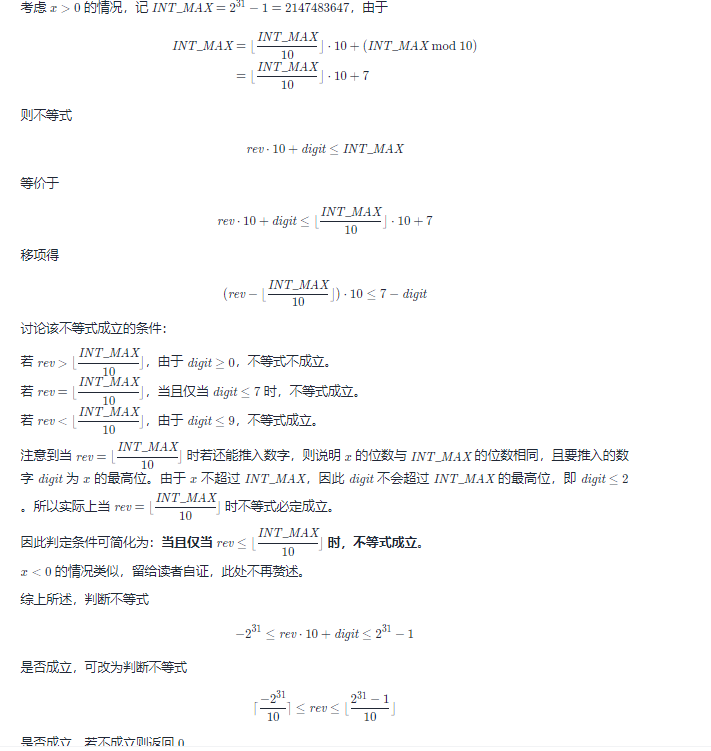

## 1. 概念

## 2. 经典题目 
* 【415】给定两个字符串形式的非负整数 num1 和num2 ，计算它们的和并同样以字符串形式返回
  * 从后往前加
  * 取余取模
  * 注意进位
```
    public String addStrings(String num1, String num2) {
        int n1 = num1.length() - 1, n2 = num2.length() - 1, sum = 0;
        StringBuffer res = new StringBuffer();
        while (n1 >= 0 || n2 >= 0 || sum != 0) {
            if (n1 >= 0) {
                sum += (num1.charAt(n1--) - '0');
            }
            if (n2 >= 0) {
                sum += (num2.charAt(n2--) - '0');
            }
            res.append(sum % 10);
            sum  /= 10;
        }
        return res.reverse().toString();
    }
```

* 【191】编写一个函数，输入是一个无符号整数（以二进制串的形式），返回其二进制表达式中数字位数为 '1' 的个数（也被称为汉明重量）

```
    public int hammingWeight(int n) {
        int count = 0;
        while (n != 0) {
            count += n & 1;
            n >>>= 1;
        }
        return count;
    }
```

* 【136】给定一个非空整数数组，除了某个元素只出现一次以外，其余每个元素均出现两次。找出那个只出现了一次的元素。 
  * 交换律：a ^ b ^ c <=> a ^ c ^ b
  * 任何数于0异或为任何数 0 ^ n => n
  * 相同的数异或为0: n ^ n => 0
```
    public int singleNumber(int[] nums) {
        int res = 0;
        for (int num : nums) {
            res = res ^ num;
        }
        return res;
    }
```

* 【260】给定一个整数数组 nums，其中恰好有两个元素只出现一次，其余所有元素均出现两次。 找出只出现一次的那两个元素。你可以按 任意顺序 返回答案
```
  public int[] singleNumber(int[] nums) {
        int xor = 0;
        for (int num : nums) {
            xor ^= num;
        }
        //找到不同两个数的异或结果的二进制低位1作为标识
        //1代表这一位二进制它们肯定不同
        int mark = xor & -xor;
        int[] res = new int[2];
        for (int num : nums) {
            //将数分为两组，分别为1个数和多个成对的数
            //不同的两个数肯定分开，相同的肯定是一组
            if ((num & mark) == 0) {
                res[0] ^= num;
            } else {
                res[1] ^= num;
            }
        }
        return res;
    }
```

* 【7】给你一个 32 位的有符号整数 x ，返回将 x 中的数字部分反转后的结果。  如果反转后整数超过 32 位的有符号整数的范围 [−231, 231 − 1] ，就返回 0。 假设环境不允许存储 64 位整数（有符号或无符号）
* 
```
    public int reverse(int x) {
        int r = 0;
        while (x != 0) { //循环条件判断条件不能是x>0，因为忽略了 负数
            if (r < Integer.MIN_VALUE / 10 || r > Integer.MAX_VALUE / 10) {
                return 0;
            }
            r = r * 10 + x % 10;
            x /= 10;
        }
        return r;
    }

    //方法2
    public int reverse(int x) {
        int r = 0;
        while (x != 0) { //循环条件判断条件不能是x>0，因为忽略了 负数
            int temp = r * 10 + x % 10;
            if (temp/10 != r) { //// 溢出!!!了
                return 0;
            }
            r = temp;
            x /= 10;
        }
        return r;
    }
```

* 【338】比特位计数，给你一个整数 n ，对于 0 <= i <= n 中的每个 i ，计算其二进制表示中 1 的个数 ，返回一个长度为 n + 1 的数组 ans 作为答案。
  * i & (i - 1)可以去掉i最右边的一个1（如果有），因此 i & (i - 1）是比 i 小的，而且i & (i - 1)的1的个数已经在前面算过了，所以i的1的个数就是 i & (i - 1)的1的个数加上1
```
    public int[] countBits(int n) {
        int[] res = new int[n + 1];
        for (int i = 1; i <= n; i++) {
            res[i] = res[(i - 1) & i] + 1;
        }
        return res;
    }
```

* 【51】N 皇后，n 皇后问题 研究的是如何将 n 个皇后放置在 n×n 的棋盘上，并且使皇后彼此之间不能相互攻击。

给你一个整数 n ，返回所有不同的 n 皇后问题 的解决方案。

每一种解法包含一个不同的 n 皇后问题 的棋子放置方案，该方案中 'Q' 和 '.' 分别代表了皇后和空位。  
  
  
```
    public List<List<String>> solveNQueens(int n) {
        List<List<String>> ans = new ArrayList<>();
        int[] queens = new int[n];
        dfs(n, 0, queens, ans, 0, 0, 0);
        return ans;
    }

    private void dfs(int n, int row, int[] q, List<List<String>> ans, int col, int pie, int la) {
        if (row == n) {
            ans.add(transfer(q));
            return;
        }
        //找到当前行的可用的皇后，并用1标记
        int availableQ = ((1 << n) - 1) & (~(pie | la | col));
        while (availableQ != 0) {
            //找到第一个1的数字
            int pos = availableQ & (-availableQ);
            availableQ &= availableQ - 1;
            //获取一共由多少1个
            int count = Integer.bitCount(pos - 1);
            q[row] = count;
            dfs(n, row + 1, q, ans, col | pos, (pie | pos) >> 1, (la | pos) << 1);
        }
    }

    public List<String> transfer(int[] n) {
        List<String> ans = new ArrayList<>();
        for (int i : n) {
            char[] str = new char[n.length];
            Arrays.fill(str, '.');
            str[i] = 'Q';
            ans.add(new String(str));
        }
        return ans;
    }
```