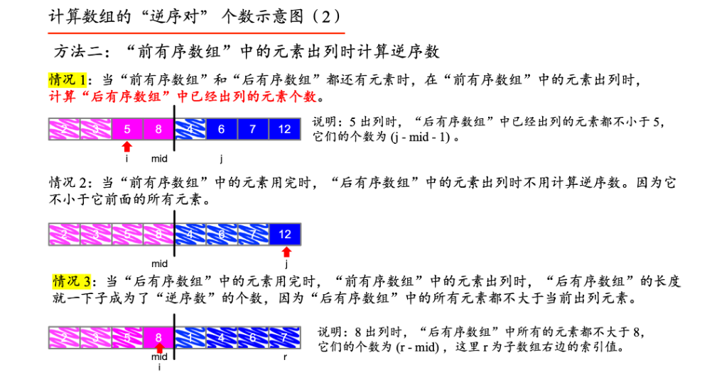

## 1. 概念


## 2. 经典题目
* 【215】给定整数数组 nums 和整数 k，请返回数组中第 k 个最大的元素。
  * 快速排序思想
  * 找出任意一个数的下标，使得右边比它都大
  * 比较这个数和k是不是相等,相等则说明就是它
  * 大于k,右指针下移动mark位置，再找出一个数，使得右边比它大
  * 小于k，左指针上移动mark位置，再找出一个数，使得右边比它大
  * 重复即可
```
    public int findKthLargest(int[] nums, int k) {
        k = nums.length - k;
        int lo = 0, hi = nums.length - 1;
        while (lo < hi) {
            int higherMark = getHigherMark(nums, lo, hi);
            if (k == higherMark) {
                return nums[k];
            } else if (k > higherMark){
                lo = higherMark + 1;
            } else {
                hi = higherMark - 1;
            }
        }
        return nums[lo];
    }

    //快速排序的经典操作
    public int getHigherMark(int[] nums, int left, int right) {
        int lowerMark = left;
        while (left < right) {
            if (nums[left] < nums[right]) {
                swap(nums, lowerMark++, left);
            }
            left++;
        }
        swap(nums, lowerMark, right);
        return lowerMark;
    }


    public void swap(int[] nums, int i, int j) {
        if (i == j) {
            return;
        }
        int temp = nums[i];
        nums[i] = nums[j];
        nums[j] = temp;
    }
```

* 【148】给你链表的头结点 head ，请将其按 升序 排列并返回 排序后的链表 
    * 标准的归并排序
    * 先写出合并两个有序链表的方法
    * 如何归并呢？数组是取首位和末尾中间为作为mid，链表可以采用快慢指针的方法找到
    ```
    //归并排序
    public ListNode sortList(ListNode head) {
        if (head == null || head.next == null) {
            return head;
        }
        ListNode slow = head, fast = head.next;
        while (fast != null && fast.next != null) {
            slow = slow.next;
            fast = fast.next.next;
        }
        ListNode secondHead = slow.next;
        slow.next = null;
        return merge(sortList(head), sortList(secondHead));
    }
    
    //合并有序链表的标准写法
    public ListNode merge(ListNode node1, ListNode node2) {
        if (node1 == null) {
            return node2;
        }
        if (node2 == null) {
            return node1;
        }
        if (node1.val < node2.val) {
            node1.next = merge(node1.next, node2);
            return node1;
        } else {
            node2.next = merge(node2.next, node1);
            return node2;
        }
    }
   ```

* 【offer40】输入整数数组 arr ，找出其中最小的 k 个数。例如，输入4、5、1、6、2、7、3、8这8个数字，则最小的4个数字是1、2、3、4  
    * 利用快排思想找到某一个下标，左边的比它小右边比它大
    * 如果idx == k说明正好
    * 如果idx > k，说明idx大于k了需要将hi下移
    * 如果idx < k，说明idx小于k了需要将lo上移
   ```
    public int[] getLeastNumbers(int[] arr, int k) {
        if (k == 0) {
            return new int[]{};
        }
        k--;
        int lo = 0, hi = arr.length - 1;
        while (lo <= hi) {
            int idx = quickSort(arr, lo, hi);
            if (idx == k) {
                return Arrays.copyOf(arr, k + 1);
            } else if (idx > k) {
                hi = idx - 1;
            } else {
                lo = idx + 1;
            }
        }
        return null;
    }
    
    public int quickSort(int[] arr, int start, int end) {
        int readyIdx = end;
        while (start < end) {
            if (arr[start] <= arr[end]) {
                swap(arr, readyIdx--, end);
            }
            end--;
        }
        swap(arr, readyIdx, start);
        return readyIdx;
    }
    
    public void swap(int[] arr, int i, int j) {
        int temp = arr[i];
        arr[i] = arr[j];
        arr[j] = temp;
    }
    
   ```

* 【offer51】在数组中的两个数字，如果前面一个数字大于后面的数字，则这两个数字组成一个逆序对。输入一个数组，求出这个数组中的逆序对的总数
    * 典型的不能再典型的归并排序实现
   ```
      public int reversePairs(int[] nums) {
        mergeSort(nums, 0, nums.length - 1);
        return count;
    }


    public void mergeSort(int[] nums, int start, int end) {
        if (start >= end) {
            return;
        }
        int mid = (start + end) >> 1;
        mergeSort(nums, start, mid);
        mergeSort(nums, mid + 1, end);
        mergeSortArray(nums, start, mid, end);
    }
    
    int count = 0;
    
    public void mergeSortArray(int[] nums, int start, int mid, int end) {
        int[] res = new int[end - start + 1];
        int idx = 0, i = start, j = mid + 1;
        while (i <= mid && j <= end) {
            if (nums[i] <= nums[j]) {
                res[idx++] = nums[i++];
            } else {
                res[idx++] = nums[j++];
                count += mid - i + 1;
            }
        }
        while (i <= mid) {
            res[idx++] = nums[i++];
        }
        while (j <= end) {
            res[idx++] = nums[j++];
        }
        System.arraycopy(res, 0, nums, start, res.length);
    }
   ```

* 【75】给定一个包含红色、白色和蓝色，一共 n 个元素的数组，原地对它们进行排序，使得相同颜色的元素相邻，并按照红色、白色、蓝色顺序排列
   * 注意循环的放在前面
   ```
       public void sortColors(int[] nums) {
        //0、 1 和 2
        int i = 0, j = nums.length - 1;
        for (int k = 0; k < nums.length; k++) {
            while (nums[k] == 2 && k < j) {
                swap(nums, k, j--);
            }
            if (nums[k] == 0) {
                swap(nums, k, i++);
            }
        }
    }
    
    private void swap(int[] nums, int i, int j) {
        int temp = nums[i];
        nums[i] = nums[j];
        nums[j] = temp;
    }
   ```

* 【mianshi17.14】设计一个算法，找出数组中最小的k个数。以任意顺序返回这k个数均可
  * 快排思想 
   ```
   public int[] smallestK(int[] arr, int k) {
        if (k <= 0) {
            return new int[]{};
        }
        int lo = 0, hi = arr.length - 1;
        while (lo <= hi) {
            int idx = smallerConunt(arr, lo, hi);
            if (idx == k - 1) {
                return Arrays.copyOf(arr, k);
            } else if (idx < k - 1){
                lo = idx + 1;
            } else {
                hi = idx - 1;
            }
        }
        return new int[]{};
    }

    private int smallerConunt(int[] arr, int lo, int hi) {
        int idx = lo;
        while (lo < hi) {
            if (arr[lo] < arr[hi]) {
                swap(arr, lo, idx++);
            }
            lo++;
        }
        swap(arr, idx, hi);
        return idx;
    }
    
    private void swap(int[] arr, int i, int j) {
        int temp = arr[i];
        arr[i] = arr[j];
        arr[j] = temp;
    }
```


* 【912】. 排序数组
给你一个整数数组 nums，请你将该数组升序排列
```
   public int[] sortArray(int[] nums) {
        sort(nums, 0, nums.length - 1);
        return nums;
    }

    public void sort(int[] nums, int i, int j) {
        if (i >= j) {
            return;
        }
        int mid = getMid(nums, i, j);
        sort(nums, i, mid - 1);
        sort(nums, mid + 1, j);
    }
    
    public int getMid(int[] nums, int i, int j) {
        int x = new Random().nextInt(j - i + 1) + i;
        swap(nums, j, x);
        int idx = i;
        while (i < j) {
            if (nums[i] <= nums[j]) {
                swap(nums, idx++, i);
            }
            i++;
        }
        swap(nums, idx, j);
        return idx;
    }
    
    public void swap(int[] nums, int i, int j) {
        int temp = nums[i];
        nums[i] = nums[j];
        nums[j] = temp;
    }
```


## 桶排序
* 【164】 最大间距  给定一个无序的数组 nums，返回 数组在排序之后，相邻元素之间最大的差值 。如果数组元素个数小于 2，则返回 0 。
您必须编写一个在「线性时间」内运行并使用「线性额外空间」的算法

```
   public int maximumGap(int[] nums) {
        int len = nums.length;
        if (len < 2) {
            return 0;
        }
        int min = Integer.MAX_VALUE, max = Integer.MIN_VALUE;
        for (int num : nums) {
            min = Math.min(min, num);
            max = Math.max(max, num);
        }
        //2468 -> length = 2; size = 3 + 1;
        int bucketLength = Math.max(1, (max - min) / (len - 1));
        int[][] buckets = new int[(max - min) / bucketLength+ 1][2];
        for (int[] bucket : buckets) {
            bucket[0] = Integer.MAX_VALUE;
            bucket[1] = Integer.MIN_VALUE;
        }
        for (int num : nums) {
            int bucketIndex = (num -min)/bucketLength;
            //记录分布到桶中的最大值和最小值
            buckets[bucketIndex][0] = Math.min(buckets[bucketIndex][0], num);
            buckets[bucketIndex][1] = Math.max(buckets[bucketIndex][1], num);
        }
        int maxGap = 0, preMax = Integer.MIN_VALUE;
        for (int[] bucket : buckets) {
            if (bucket[0] != Integer.MAX_VALUE) {
                if (preMax != Integer.MIN_VALUE) {
                    maxGap = Math.max(maxGap, bucket[0] - preMax);
                }
                preMax = bucket[1];
            }
        }
        return maxGap;
    }


    private class Bucket {
    int min = Integer.MAX_VALUE;
    int max = Integer.MIN_VALUE;
}

//详细解释
public int maximumGap(int[] nums) {
    if (nums == null || nums.length < 2) {
        return 0;
    }
    
    int min = Integer.MAX_VALUE;
    int max = Integer.MIN_VALUE;
    for (int i : nums) {
        min = Math.min(min, i);
        max = Math.max(max, i);
    }
    
    // 分配桶的长度和个数是桶排序的关键
    // 在 n 个数下，形成的两两相邻区间是 n - 1 个，比如 [2,4,6,8] 这里
    // 有 4 个数，但是只有 3 个区间，[2,4], [4,6], [6,8]
    // 因此，桶长度 = 区间总长度 / 区间总个数 = (max - min) / (nums.length - 1)
    int bucketSize = Math.max(1, (max - min) / (nums.length - 1));
    
    // 上面得到了桶的长度，我们就可以以此来确定桶的个数
    // 桶个数 = 区间长度 / 桶长度
    // 这里考虑到实现的方便，多加了一个桶，为什么？
    // 还是举上面的例子，[2,4,6,8], 桶的长度 = (8 - 2) / (4 - 1) = 2
    //                           桶的个数 = (8 - 2) / 2 = 3
    // 已知一个元素，需要定位到桶的时候，一般是 (当前元素 - 最小值) / 桶长度
    // 这里其实利用了整数除不尽向下取整的性质
    // 但是上面的例子，如果当前元素是 8 的话 (8 - 2) / 2 = 3，对应到 3 号桶
    //              如果当前元素是 2 的话 (2 - 2) / 2 = 0，对应到 0 号桶
    // 你会发现我们有 0,1,2,3 号桶，实际用到的桶是 4 个，而不是 3 个
    // 透过例子应该很好理解，但是如果要说根本原因，其实是开闭区间的问题
    // 这里其实 0,1,2 号桶对应的区间是 [2,4),[4,6),[6,8)
    // 那 8 怎么办？多加一个桶呗，3 号桶对应区间 [8,10)
    Bucket[] buckets = new Bucket[(max - min) / bucketSize + 1];
    
    for (int i = 0; i < nums.length; ++i) {
        int loc = (nums[i] - min) / bucketSize;
        
        if (buckets[loc] == null) {
            buckets[loc] = new Bucket();
        }
        
        buckets[loc].min = Math.min(buckets[loc].min, nums[i]);
        buckets[loc].max = Math.max(buckets[loc].max, nums[i]);
    }
    
    int previousMax = Integer.MAX_VALUE; int maxGap = Integer.MIN_VALUE;
    for (int i = 0; i < buckets.length; ++i) {
        if (buckets[i] != null && previousMax != Integer.MAX_VALUE) {
            maxGap = Math.max(maxGap, buckets[i].min - previousMax);
        }
        
        if (buckets[i] != null) {
            previousMax = buckets[i].max;
            maxGap = Math.max(maxGap, buckets[i].max - buckets[i].min);
        }
    }
    
    return maxGap;
}
```

* 【315】. 计算右侧小于当前元素的个数
给你一个整数数组 nums ，按要求返回一个新数组 counts 。数组 counts 有该性质： counts[i] 的值是  nums[i] 右侧小于 nums[i] 的元素的数量  
  

```
   public List<Integer> countSmaller(int[] nums) {
        ans = new int[nums.length];
        index = new int[nums.length];
        for (int i = 0; i < nums.length; i++) {
            index[i] = i;
        }
        mergeSort(nums, 0, nums.length - 1);
        return Arrays.stream(ans).boxed().collect(Collectors.toList());
    }

    private void mergeSort(int[] nums, int lo, int hi) {
        if (lo >= hi) {
            return;
        }
        int mid = lo + (hi - lo) / 2;
        mergeSort(nums, lo, mid);
        mergeSort(nums, mid + 1, hi);
        if (nums[index[mid]] < nums[index[mid + 1]]) {
            return;
        }
        merge(nums, lo, hi, mid);
    }
    
    private void merge(int[] nums, int lo, int hi, int mid) {
        int[] array = new int[hi - lo + 1];
        int idx1 = lo, idx2 = mid + 1, idx = 0;
        while (idx1 <= mid && idx2 <= hi) {
            if (nums[index[idx1]] <= nums[index[idx2]]) {
                ans[index[idx1]] += (idx2 - mid - 1);
                array[idx++] = index[idx1++];
            } else {
                array[idx++] = index[idx2++];
            }
        }
        while (idx1 <= mid) {
            ans[index[idx1]] += (idx2 - mid - 1);
            array[idx++] = index[idx1++];
        }
        while (idx2 <= hi) {
            array[idx++] = index[idx2++];
        }
        System.arraycopy(array, 0, index, lo, array.length);
    }
    
    int[] ans;
    int[] index;

```
```

#### [539. 最小时间差](https://leetcode-cn.com/problems/minimum-time-difference/)

难度中等200

给定一个 24 小时制（小时:分钟 **"HH:MM"**）的时间列表，找出列表中任意两个时间的最小时间差并以分钟数表示。

 

**示例 1：**

```
输入：timePoints = ["23:59","00:00"]
输出：1
```

**示例 2：**

```
输入：timePoints = ["00:00","23:59","00:00"]
输出：0
```

 

**提示：**

- `2 <= timePoints.length <= 2 * 104`
- `timePoints[i]` 格式为 **"HH:MM"**

根据题意，我们需要找出「时钟盘」中的夹角最小的两个时间点，其中包括了分布在 00:00 左右两侧（横跨了一天）的时间点。

因此，一种简单的方式是对于每个 timePoints[i]，我们不仅记录「当天该时间点」对应的的偏移量，还记录「下一天该时间点」对应的偏移量。

处理所有的 timePoints[i]后，对偏移量进行排序，遍历找到所有相邻元素之间的最小值。

```
   public int findMinDifference(List<String> timePoints) {
        int n = timePoints.size();
        if (n > 1440 || n < 2) {
            return 0;
        }
        int[] b = new int[2 * n];
        for (int i = 0; i < b.length; i += 2) {
            String[] time = timePoints.get(i / 2).split(":");
            int h = Integer.valueOf(time[0]), m = Integer.valueOf(time[1]);
            b[i] = h * 60 + m;
            b[i + 1] = h * 60 + m + 1440;
        }
        Arrays.sort(b);
        int ans = b[1] - b[0];
        for (int i = 2; i < b.length; i++){
            ans = Math.min(ans, b[i] - b[i-1]);
        }
        return ans;
    }
```

利用当天最多只有 60 * 24 = 1440个不同的时间点（跨天的话则是双倍），我们可以使用数组充当哈希表进行计数，同时根据「抽屉原理」，若 timePoints 数量大于 1440，必然有两个相同时间点，用作剪枝。

然后找到间隔最小两个时间点，这种利用「桶排序」的思路避免了对 timePointstimePoints 所对应的偏移量进行排序，而 O(C) 的复杂度使得所能处理的数据范围没有上限

```
    public int findMinDifference(List<String> timePoints) {
        int n = timePoints.size();
        if (n > 1440) return 0;
        int[] cnts = new int[1440 * 2 + 10];
        for (String s : timePoints) {
            String[] ss = s.split(":");
            int h = Integer.parseInt(ss[0]), m = Integer.parseInt(ss[1]);
            cnts[h * 60 + m]++;
            cnts[h * 60 + m + 1440]++;
        }
        int ans = 1440, last = -1;
        for (int i = 0; i <= 1440 * 2 && ans != 0; i++) {
            if (cnts[i] == 0) continue;
            if (cnts[i] > 1) ans = 0;
            else if (last != -1) ans = Math.min(ans, i - last);
            last = i;
        }
        return ans;
    }
、
```

