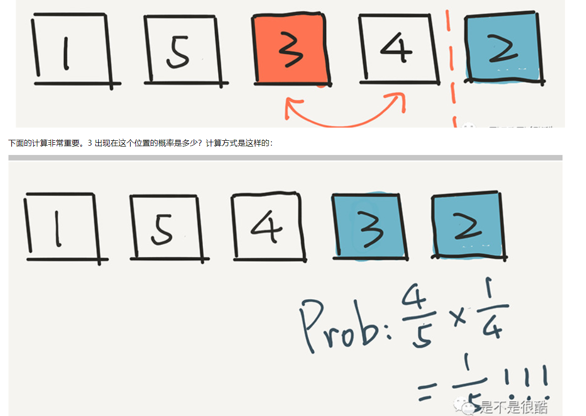
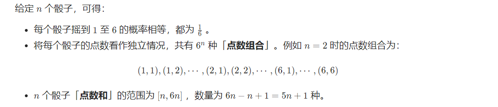

## 1. 概念

## 2. 经典题目
* 【470】已有方法 rand7 可生成 1 到 7 范围内的均匀随机整数，试写一个方法 rand10 生成 1 到 10 范围内的均匀随机整数
  * 此题基于两个结论
  * (rand_X() - 1) × Y + rand_Y() ==> 可以等概率的生成[1, X * Y]范围的随机数
  * 如x为1-Y的随机数，y为z的倍数，x%z+1;就是1-到z的随机数了
  * 本题目初始为7，那么可以找到1-49的概率，进而通过第二个结论算出1-40取模+1的概率
```
    public int rand10() {
        //有这么两个结论：
        // 1. (rand_X() - 1) × Y + rand_Y() ==> 可以等概率的生成[1, X * Y]范围的随机数
        // 2. 如x为1-Y的随机数，y为z的倍数，x%z+1;就是1-到z的随机数了。
        //7-1 * 7 + 7;
        while (true) {
            int x = rand7(), y = rand7();
            //套用公式，1-49的概率
            int z = (x - 1) * 7 + y;
            if (z <= 40) {
                //1-10的概率生成
                return z % 10 + 1;
            }
            // 1-9的概率
            x = z - 40;
            //1-7的概率
            y = rand7();
            //套用公式，1-63的概率
            z = (x - 1) * 7 + y;
            if (z <= 60) {
                return z % 10 + 1;
            }
            // 1-3的概率
            x = z - 60;
            //1-7的概率
            y = rand7();
            //套用公式，1-21的概率
            z = (x - 1) * 7 + y;
            if (z <= 20) {
                return z % 10 + 1;
            }
        }
    }
```

* 【528】给你一个 下标从 0 开始 的正整数数组 w ，其中 w[i] 代表第 i 个下标的权重，请你实现一个函数 pickIndex ，它可以 随机地 从范围 [0, w.length - 1] 内（含 0 和 w.length - 1）选出并返回一个下标。选取下标 i 的 概率 为 w[i] / sum(w)
  * 先求出每个下标的前缀和
  * 求出最后的前缀和范围内的随机数
  * 遍历前缀和，看随机数落在哪一个下标就是题目要求的随机数。
```
   public pickIndex(int[] w) {
        random = new Random();
        pre = new int[w.length];
        for (int i = 0; i < pre.length; i++) {
            pre[i] = i > 0 ? pre[i - 1] + w[i] : w[i];
        }
    }
    int[] pre;
    Random random;
    public int pickIndex() {
       int pickIdx = random.nextInt(pre[pre.length - 1]) + 1;
        for (int i = 0; i < pre.length; i++) {
            if (pickIdx <= pre[i]) {
                return i;
            }
        }
        return 0;
    }
```

* 【398】给定一个可能含有重复元素的整数数组，要求随机输出给定的数字的索引。 您可以假设给定的数字一定存在于数组中
  * 蓄水池经典问题
  * 对第i个元素，以1/i的概率更新取值，以1 - 1/i的概率保留原值,则n个元素最终留下的概率都是1/n
  * 数据1被留下：（1/2）(2/3) = 1/3
  * 数据2被留下概率：（1/2）(2/3) = 1/3
  * 数据3被留下概率：1/3

```
   public Solution(int[] nums) {
        random = new Random();
        this.nums = nums;
    }
    int[] nums;
    Random random;
    public int pick(int target) {
        int count = 0, res = -1;
        for (int i = 0; i < nums.length; i++) {
            if (nums[i] == target && random.nextInt(++count) == 0) {
                res = i;
            }
        }
        return res;
    }
```

* 【380】O(1) 时间插入、删除和获取随机元素,实现RandomizedSet 类：

RandomizedSet() 初始化 RandomizedSet 对象
bool insert(int val) 当元素 val 不存在时，向集合中插入该项，并返回 true ；否则，返回 false 。
bool remove(int val) 当元素 val 存在时，从集合中移除该项，并返回 true ；否则，返回 false 。
int getRandom() 随机返回现有集合中的一项（测试用例保证调用此方法时集合中至少存在一个元素）。每个元素应该有 相同的概率 被返回。
你必须实现类的所有函数，并满足每个函数的 平均 时间复杂度为 O(1) 。

  * list使用查找索引o1,hash查找val为o1

```

    public RandomizedSet() {
        list = new ArrayList<>();
        hash = new HashMap<>();
        random = new Random();
    }

    Random random;
    List<Integer> list;
    Map<Integer, Integer> hash;

    public boolean insert(int val) {
        if (hash.containsKey(val)) {
            return false;
        }
        hash.put(val, list.size());//存放的是val的下标
        list.add(val);
        return true;
    }

    public boolean remove(int val) {
        if (!hash.containsKey(val)) {
            return false;
        }

        int removeIdx = hash.get(val);
        if (removeIdx < list.size() - 1) {//删除的元素不是list最后一个，将当前的位置给最后一位用
            int lastVal = list.get(list.size() - 1);
            list.set(removeIdx, lastVal);
            hash.put(lastVal, removeIdx);
        }
        hash.remove(val);
        list.remove(list.size() - 1);
        return true;
    }

    public int getRandom() {
        return list.get(random.nextInt(list.size()));
    }
```

* 【384】. 打乱数组
给你一个整数数组 nums ，设计算法来打乱一个没有重复元素的数组。

实现 Solution class:

Solution(int[] nums) 使用整数数组 nums 初始化对象
int[] reset() 重设数组到它的初始状态并返回
int[] shuffle() 返回数组随机打乱后的结果

  * 注意随机数 swap(clone, i, random.nextInt(i + 1));这样才能保证每个数字整体是随机打乱的。

  * 高纳德洗牌算法

     

    概率都是5分之一
```
    public Solution(int[] nums) {
        this.nums = nums;
        this.random = new Random();
    }

    int[] nums;
    Random random;

    public int[] reset() {
        return nums;
    }

    public int[] shuffle() {
        int[] clone = nums.clone();
        for (int i = 0; i < clone.length; i++) {
            swap(clone, i, random.nextInt(i + 1));
        }
        return clone;
    }

    private void swap(int[] nums, int i, int j) {
        int temp = nums[i];
        nums[i] = nums[j];
        nums[j] = temp;
    }
```


* 【1227】. 飞机座位分配概率
有 n 位乘客即将登机，飞机正好有 n 个座位。第一位乘客的票丢了，他随便选了一个座位坐下。

剩下的乘客将会：

如果他们自己的座位还空着，就坐到自己的座位上，

当他们自己的座位被占用时，随机选择其他座位
第 n 位乘客坐在自己的座位上的概率是多少？

```
f(n) = 1/n                                    -> 1st person picks his own seat
    + 1/n * 0                                 -> 1st person picks last one's seat
	+ (n-2)/n * (                            ->1st person picks one of seat from 2nd to (n-1)th
        1/(n-2) * f(n-1)                   -> 1st person pick 2nd's seat
        1/(n-2) * f(n-2)                  -> 1st person pick 3rd's seat
        ......
        1/(n-2) * f(2)                     -> 1st person pick (n-1)th's seat
	)
	
=> f(n) = 1/n * ( f(n-1) + f(n-2) + f(n-3) + ... + f(1) )

Now, you can easily get
f(1) = 1
f(2) = 1/2
f(3) = 1/2
...

再解释一下，
如果第一个选择我的座位，我们知道

1st和ith之间的任何人，都有自己的座位
然后，当我们来到人 i 时，它就变成了一个子问题

我随机坐
其余的遵循相同的规则
从 i 到最后（含），还有 n - (i-1) 个座位
所以它是 af(n-i+1)
证明当 n > 2 时它是 1/2
从上面的证明中我们知道

when n > 2,
f(n) = 1/n * ( f(n-1) + f(n-2) + ... + f(1) )
f(n-1) = 1/(n-1) * (f(n-2) + f(n-3) + ... + f(1))

because, the 2nd equation requires n-1 > 1
以便

n * f(n) = f(n-1) + f(n-2) + f(n-3) + ... + f(1)
(n-1) * f(n-1) = f(n-2) + f(n-3) + ... + f(1)
两边相减，我们得到

n * f(n) - (n-1)*f(n-1) = f(n-1)

=> n * f(n) = n * f(n-1)
=> f(n) = f(n-1) , when n > 2
那么我们知道，
f(1) =1
f(2) = 1/2
从这里开始
f(n) = f(n-1) = ... = f(2) = 1/2


我认为这是唯一正确的答案。f(n) = 1 / n + (n - 2) / n * f(n - 1) 的其他解释说 f(n-1) 是子问题是有缺陷的，因为当第一个人随机坐下（第 i 个座位), 子问题不是 f(n-1) 而是 f(n-i+1) 因为从第一个人到第 (i-1) 个人，每个人都要坐自己的座位，所以子问题的座位比较少比n-1。因此应该构建一个 dp，其中 dp[n] 不是子问题本身，而是子问题 f(n) + f(n-1) + ... + f(1) 的总和。
f(n) = 1/n                                    -> 1st person picks his own seat, all others including the nth person is going to get their own seats
    + 1/n * 0                                 -> 1st person picks last one's seat, there's no chance the nth peroson is going to get his own seat
	+ (n-2)/n * (                        ->1st person picks one of seat from 2nd to (n-1)th
        1/(n-2) * f(n-1) +                 -> 1st person picks 2nd seat, see explanation 1 below
        1/(n-2) * f(n-2) +                 -> 1st person picks 3rd seat see explanation 2 below
        ......
        1/(n-2) * f(2)                     -> 1st person pick (n-1)th's seat
	)

f(n) = 1/n + 0 + 1/n * (f(n-1) + f(n-2) + ... + f(2)) = 1/n * (f(n-1) + f(n-2) + ... + f(2) + 1) = 1/n * (f(n-1) + f(n-2) + ... + f(2) + f(1)) because f(1) = 1 

Explanation 1:
1st person picks 2nd seat, then the 2nd person becomes the new "careless" person, and he can pick 1st, 3rd, 4th ... nth seat. To him, the number of seats is n-1. This is a subproblem.
Explanation 2:
1st person picks 3rd seat, then the 2nd person will sit at his own seat, and the 3rd person becomes the new "careless" peroson, and he can pick 1st, 4th, 5th .., nth seat. To him, the number of seats is n-2. This is a subproblem.
```

```
    public double nthPersonGetsNthSeat(int n) {
        return n == 1 ? 1.0 : 0.5;
    }
```


* 【剑指 Offer 60】. n个骰子的点数

难度中等427

把n个骰子扔在地上，所有骰子朝上一面的点数之和为s。输入n，打印出s的所有可能的值出现的概率。

 

你需要用一个浮点数数组返回答案，其中第 i 个元素代表这 n 个骰子所能掷出的点数集合中第 i 小的那个的概率。

  


**示例 1:**

```
输入: 1
输出: [0.16667,0.16667,0.16667,0.16667,0.16667,0.16667]
```

**示例 2:**

```
输入: 2
输出: [0.02778,0.05556,0.08333,0.11111,0.13889,0.16667,0.13889,0.11111,0.08333,0.05556,0.02778]
```

 

**限制：**

```
1 <= n <= 11
```

```

```

```
public double[] dicesProbability(int n) {
    double[][] dp = new double[n + 1][6 * n + 1];
    for (int i = 1; i <= 6; i++) {
        dp[1][i] = 1.0 / 6;
    }
    for (int i = 2; i <= n; i++) {
        for (int j = i; j <= 6 * i; j++) {
            for (int k = 1; k <= 6; k++) {
                if (j - k > 0) {
                    dp[i][j] += dp[i - 1][j - k] / 6;
                } else {
                    break;
                }
            }
        }
    }
    double[] ans = new double[5 * n + 1];
    for (int i = 0; i <= 5 * n; i++) {
        ans[i] = dp[n][n + i];
    }
    return ans;
}
```

