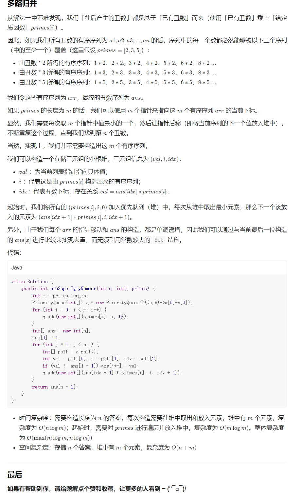
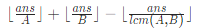
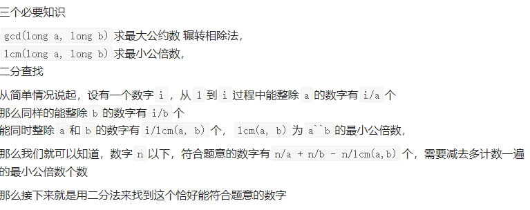
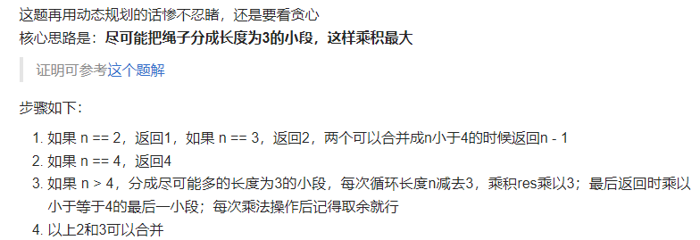
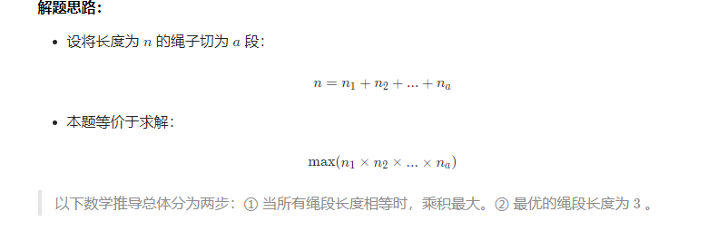
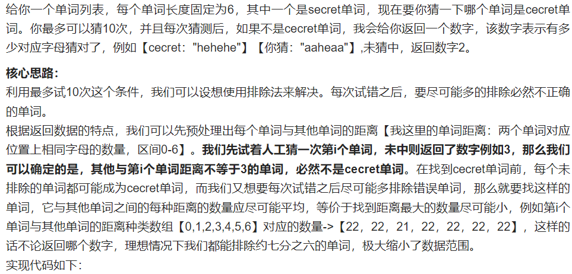
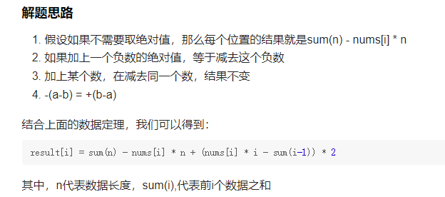
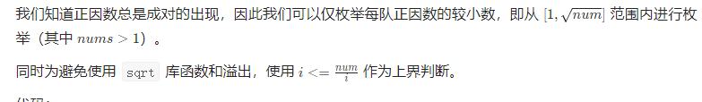

## 1. 开头
## 2. 经典题目

* 【Offer 62】圆圈中最后剩下的数字
0,1,···,n-1这n个数字排成一个圆圈，从数字0开始，每次从这个圆圈里删除第m个数字（删除后从下一个数字开始计数）。求出这个圆圈里剩下的最后一个数字。

例如，0、1、2、3、4这5个数字组成一个圆圈，从数字0开始每次删除第3个数字，则删除的前4个数字依次是2、0、4、1，因此最后剩下的数字是3。

```
    /*
    思路：使用数学方法(先举例)
            你要知道最后的结果是3，带着结果去看问题

        第一次，【0, 1, 2, 3, 4】，本轮要踢出2                                  看3
        (下一轮开始从3计数，为了方便读者看出规律，将开始计数的那一位移到开头)
        第二次，【3, 4, 0, 1】，本轮要踢出0                                     看1
        第三次，【1, 3, 4】，本轮要踢出4                                        看1
        第四次，【1, 3】 本轮要踢出1                                            看3
        第五次，【3】
        最后返回3

        我们要使用的数学方法，就是从结果0号位置，反推最开始在哪
        你从第二次，向上看第一次
        你会发现，原来3在0的位置
                现在，3在(0 + 3) % 5
                        => +3 回到上次的位置
                        => %5 防止数组溢出，并且数组本来就是循环数组

        f(n) = ( f(n - 1) + m ) % n
        解释意思：
            f(n) 表示上一次
            f(n - 1) 表示这次，因为我们要从这次回推上一次
            m 表示隔几个
            n表示上一次的数组长度

     */
  public int lastRemaining(int n, int m) {
        int ans = 0;
        // 最后一轮剩下2个人，所以从2开始反推
        for (int i = 2; i <= n; i++) {
            ans = (ans + m) % i;
        }
        return ans;
    }
```

* 【204】 计数质数
  统计所有小于非负整数 n 的质数的数量
  * 对于一个质数 x，如果按上文说的我们从 2x 开始标记其实是冗余的，应该直接从 x\cdot xx⋅x 开始标记，因为 2x,3x,\ldots2x,3x,… 这些数一定在 xx 之前就被其他数的倍数标记过了，例如 2 的所有倍数，3 的所有倍数等
  * 当然这里还可以继续优化，对于一个质数x，如果按上文说的我们从2x开始标记其实是冗余的，应该直接从x*x开始标记，因为2.x , 3.x , ....这些数一定在x之前就被其他数的倍数标记过了，例如2的所有倍数，3的所有倍数等。
```
    public int countPrimes(int n) {
        int ans = 0;
        boolean[] check = new boolean[n];
        for (int i = 2; i < n; i++) {
            if (!check[i]) {
                ans++;
                if ((long) i * i < n) {
                    for (int j = i * i; j < n; j += i) {
                        check[j] = true;
                    }
                }
            }
        }
        return ans;
    }
```

* 【9】回文数
给你一个整数 x ，如果 x 是一个回文整数，返回 true ；否则，返回 false 。

回文数是指正序（从左向右）和倒序（从右向左）读都是一样的整数
```
  public boolean isPalindrome(int x) {
        if (x < 0) {
            return false;
        }
        if (x == 0) {
            return true;
        }
        int n = 0, y = x;
        while (x != 0) {
            n = n * 10 + x % 10;
            x /= 10;
        }
        return y == n;
    }
```

* 【1363】. 形成三的最大倍数
给你一个整数数组 digits，你可以通过按任意顺序连接其中某些数字来形成 3 的倍数，请你返回所能得到的最大的 3 的倍数。

由于答案可能不在整数数据类型范围内，请以字符串形式返回答案。

如果无法得到答案，请返回一个空字符串

  * 如果取模3等于0，那其实可以都要，如果是1，那就得去掉一个1或者两个2，如果是2那就得去掉一个2或者两个1
  * 而这些删掉一个数的函数其实是类似的，可以反复调用。注意在如果全是0输出0而不是00000. 删完数之后判断答案的最高位是不是0即可


https://leetcode.com/problems/largest-multiple-of-three/discuss/518830/C%2B%2BJava-Concise-O(n)


```
/**
显然，尝试数字组合是行不通的，因为我们最多可以有 10,000 个数字。幸运的是，有一个方便的可分性测试：

如果一个数的所有数字之和能被 3 整除，则该数能被 3 整除。

观察 1：由于顺序无关紧要，最大的数可以通过从最大 ( 9) 到最小 ( 0) 的数字相加来形成，例如9999966330000。

因此，我们可以只计算每个数字的出现次数，然后生成字符串。

观察 2：我们需要使用所有数字来形成最大数。如果我们对所有数字求和，并且 3 的模不为零，我们需要删除 1（最好）或 2 个最小的数字。例如，如果和的模 3 是1，我们将尝试删除1、4或7（如果存在）或 、 或2的5两个8。

更多示例：

9965341 % 3 == 1; 我们删除1以获得最大的数字。
9952000 % 3 == 1; 现在我们需要删除两个数字2和5，因为没有1,4或7
*/

public String largestMultipleOfThree(int[] digits) {
    int m1[] = new int[] {1, 4, 7, 2, 5, 8}, m2[] = new int[] {2, 5, 8, 1, 4, 7};
    int sum = 0, ds[] = new int[10];
    for (int d : digits) {
        ++ds[d];
        sum += d;
    }
    while (sum % 3 != 0) {
        for (int i : sum % 3 == 1 ? m1 : m2) {
          if (ds[i] > 0) {
            --ds[i];
            sum -= i;
            break;
          }
        }
      }
    StringBuilder sb = new StringBuilder();
    for (int i = 9; i >= 0; --i)
        sb.append(Character.toString('0' + i).repeat(ds[i]));     
    return sb.length() > 0 && sb.charAt(0) == '0' ? "0" : sb.toString();
}
```


* 【1201】. 丑数 III
给你四个整数：n 、a 、b 、c ，请你设计一个算法来找出第 n 个丑数。

丑数是可以被 a 或 b 或 c 整除的 正整数
  * 使用了容斥原理  
  * 二分法
 

```
    public int nthUglyNumber(int n, int a, int b, int c) {
        long ab = (long) a * (long) b / gcd(a, b);
        long ac = (long) a * (long) c / gcd(a, c);
        long bc = (long) b * (long) c / gcd(b, c);
        long abc = (long) a * bc / gcd(bc, a);
        long lo = 1, hi = (long) 2e9;
        while (lo < hi) {
            long mid = lo + (hi - lo) / 2;
            long val = mid / a + mid / b + mid / c - mid / ab - mid / ac - mid / bc + mid / abc;
            if (val < n) {
                lo = mid + 1;
            } else {
                hi = mid;
            }
        }
        return (int) lo;
    }


    //求最大公约数，比如6，4为2
    //2，3为1
    public long gcd(long x, long y) {
        if (x == 0) return y;
        return gcd(y % x, x);
    }
```

```
  //该方法思路可以借鉴，但是结果不对,有可能重复
   public int nthUglyNumber(int n, int a, int b, int c) {
        int[] dp = new int[n + 1];
        for (int i = 1, a1 = 1, b1 = 1, c1 = 1; i <= n; i++) {
            int next = Math.min(c * c1, Math.min(a * a1, b * b1));
            dp[i] = next;
            if (next == c * c1) {
                c1++;
            }
            if (next == b * b1) {
                b1++;
            }
            if (next == a * a1) {
                a1++;
            }
        }
        return dp[n];
    }
```


* 【1104】二叉树寻路,在一棵无限的二叉树上，每个节点都有两个子节点，树中的节点 逐行 依次按 “之” 字形进行标记。

如下图所示，在奇数行（即，第一行、第三行、第五行……）中，按从左到右的顺序进行标记；

而偶数行（即，第二行、第四行、第六行……）中，按从右到左的顺序进行标记。


给你树上某一个节点的标号 label，请你返回从根节点到该标号为 label 节点的路径，该路径是由途经的节点标号所组成的

```
    /**
Normally Ordered Binary Tree:
             1
           /   \
         2       3
       /  \     /  \
     4     5   6     7
   / |    /|   |\    | \
 8   9  10 11 12 13  14  15


 Zig Zag Binary Tree:
             1
           /   \
         3       2  <- 3+2-3 = 2/2 = 1
       /  \     /  \
     4     5   6     7   <- 7+4-4 = 7/2 = 3
   / |    /|   |\    | \
 15 14  13 12 11 10  9  8   <- 15+8-14 = 9/2 = 4

 反演公式：（当前级别的最大数量 + 当前级别的最小数量）- 当前数量
例如要找到 14 的反演： 15 + 8 - 14 = 9
从这里你只需将 9 除以 2 即可找到父 4

想法 3）您必须在每个级别运行反转公式，因为在每个级别，该行都相对于前一行反转
    */
    public List<Integer> pathInZigZagTree(int label) {
        int level = 1, maxCount = 1;
        while (maxCount * 2 <= label) {
            maxCount *= 2;
            level++;
        }
        List<Integer> res = new LinkedList<>();
        while (label > 0) {
            res.add(label);
            int curLevelMax = (int) Math.pow(2, level) - 1,  curLevelMin = (int) Math.pow(2, level - 1) ;
            label = (curLevelMax + curLevelMin - label)/2;
            level--;
        }
        Collections.reverse(res);
        return res;
    }
```

* 【932】. 漂亮数组
对于某些固定的 N，如果数组 A 是整数 1, 2, ..., N 组成的排列，使得：

对于每个 i < j，都不存在 k 满足 i < k < j 使得 A[k] * 2 = A[i] + A[j]。

那么数组 A 是漂亮数组。


给定 N，返回任意漂亮数组 A（保证存在一个）

```
/* A 是漂亮数组，则 a * A + b 也是漂亮数组 
 * A 为奇数漂亮数组，B 为偶数漂亮数组，A + B 为漂亮数组
 * 数组两两配对，左数组 * 2 - 1 一定是奇数组，右数组 * 2 一定为偶数组，合并一定为漂亮数组
 * 假设 [1] 是最小漂亮数组，按照上面规律递推得到的一定是漂亮数组。 
 * |1|1|1|1|1|1|1|1|
 * |1 2|1 2|1 2|1 2|
 * |1 3 2 4|1 3 2 4|
 * |1 5 3 7 2 6 4 8|
 */

class Solution {
    public int[] beautifulArray(int N) {
        int[] a = new int[N];
        Arrays.fill(a, 1);
        part(a, 0, N - 1);
        return a;
    }
    public void part(int[] a, int lo, int hi) {
        if (hi <= lo) return;
        int mid = lo + (hi - lo) / 2;
        part(a, lo, mid);
        part(a, mid + 1, hi);
        for (int i = lo; i <= mid; i++) {
            a[i] = 2 * a[i] - 1;
        } 
        for (int i = mid + 1; i <= hi; i++) {
            a[i] = 2 * a[i];
        }
        return;
    }
}
```

* 【313】. 超级丑数
超级丑数 是一个正整数，并满足其所有质因数都出现在质数数组 primes 中。

给你一个整数 n 和一个整数数组 primes ，返回第 n 个 超级丑数 。

题目数据保证第 n 个 超级丑数 在 32-bit 带符号整数范围内  
 


```
   public int nthSuperUglyNumber(int n, int[] primes) {
        PriorityQueue<int[]> priorityQueue = new PriorityQueue<>((o1, o2) -> o1[0] - o2[0]);
        for (int i = 0; i < primes.length; i++) {
            priorityQueue.add(new int[]{primes[i], i, 0});
        }
        int[] ans = new int[n];
        ans[0] = 1;
        for (int j = 1; j < n; ) {
            int[] min = priorityQueue.poll();
            if (min[0] != ans[j - 1]) {
                ans[j++] = min[0];
            }
            priorityQueue.offer(new int[]{primes[min[1]] * ans[min[2] + 1], min[1], min[2] + 1});
        }
        return ans[n - 1];
    }
```


* 【829】. 连续整数求和
给定一个正整数 n，返回 连续正整数满足所有数字之和为 n 的组数 
```
    public int consecutiveNumbersSum(int n) {
        int ans = 0;
        for (int i = 1; n > 0; n -= i++) {
            ans +=  (n % i == 0 ? 1 : 0);
        }
        return ans;
    }
```
参考
```
    def consecutiveNumbersSum(self, N: int) -> int:
        # 1个数时，必然有一个数可构成N
        # 2个数若要构成N，第2个数与第1个数差为1，N减掉这个1能整除2则能由商与商+1构成N
        # 3个数若要构成N，第2个数与第1个数差为1，第3个数与第1个数的差为2，N减掉1再减掉2能整除3则能由商、商+1与商+2构成N
        # 依次内推，当商即第1个数小于等于0时结束
        res, i = 0, 1
        while N > 0:
            res += N % i == 0
            N -= i
            i += 1
        return res

```


* 【172】. 阶乘后的零
给定一个整数 n ，返回 n! 结果中尾随零的数量。

提示 n! = n * (n - 1) * (n - 2) * ... * 3 * 2 * 1
/*
    求n!
    0的来源 2 * 5 所以一对2和5即可产生一个0,所以0的个数即为min(阶乘中5的个数和2的个数) 
    又因为是2的倍数的数一定比是5的倍数的数多 所以2的个数一定>=5的个数 所以只需要统计 5 的个数了
    例如 5！ = 1 * 2 * 3 * 4 * 5
                  2      2 2  5    一个2和一个5配对出现0 所以5!末尾只有一个零
        而在 n = 25 时 可以产生5的有 5 10 15 20 25 
                                    即 n/5 = 5个 然鹅 25 = 5*5 所以少算了一个5 
        n>=25时,故而需要补上它 因此所有可以产生25的也要加上 
                                    即为 n/5 + n/25  然鹅 125 = 5*25 所以又少算了一个5
        n>=125时,故而需要补上它 因此所有可以产生125的也要加上
                                    即为 n/5 + n/25 + n/125  然鹅 625 = 5*125 所以又少算了一个5
        继续补上...
        所以最终为 n/5 + n/25 + n/125 + n/625 + ... 
                即 n/5 + n/5/5 + n/5/5/5 + n/5/5/5/5 + ... 
        代码如下
    */

```
    public int trailingZeroes(int n) {
        int ans = 0;
        while (n >= 5) {
            ans += (n/=5);
        }
        return ans;
    }
```


【396】旋转函数

难度中等221收藏分享切换为英文接收动态反馈

给定一个长度为 `n` 的整数数组 `nums` 。

假设 `arrk` 是数组 `nums` 顺时针旋转 `k` 个位置后的数组，我们定义 `nums` 的 **旋转函数** `F` 为：

- `F(k) = 0 * arrk[0] + 1 * arrk[1] + ... + (n - 1) * arrk[n - 1]`

返回 *`F(0), F(1), ..., F(n-1)`中的最大值* 。

生成的测试用例让答案符合 **32 位** 整数。

```
      /*

F(0) =            (0 * 4) + (1 * 3) + (2 * 2) + (3 * 6)      1式
                -----------------------------
F(1) = (0 * 6) + (1 * 4) + (2 * 3) + (3 * 2)                 2式
                -----------------------------

        2式画线部分 - 1式画线部分 = sum - arr[n - 1]

F(1) - F(0) = sum - arr[n - 1] - (n - 1) * arr[n - 1]
            = sum - n * arr[n - 1]

F(1) = F(0) + sum - n * arr[n - 1]

F(k) = F(k - 1) + sum - n * arr[n - k]

*/
   public int maxRotateFunction(int[] nums) {
        int sum = Arrays.stream(nums).sum(), pre = 0, n = nums.length;
        for (int i = 0; i < nums.length; i++) {
            pre += nums[i] * i;
        }
        int ans = pre;
        for (int i = 1; i <= n; i++) {
            pre = pre + sum - n * nums[n - i];
            ans = Math.max(ans, pre);
        }
        return ans;
    }
```


* 【779】.第K个语法符号

我们构建了一个包含 n 行( 索引从 1  开始 )的表。首先在第一行我们写上一个 0。接下来的每一行，将前一行中的0替换为01，1替换为10。

例如，对于 n = 3 ，第 1 行是 0 ，第 2 行是 01 ，第3行是 0110 。
给定行数 n 和序数 k，返回第 n 行中第 k 个字符。（ k 从索引 1 开始）

```
   //01排列
//              0
//          /        \
//      0                1
//    /   \            /    \
//  0       1        1       0
// / \     /  \     /  \    / \
//0   1   1    0   1    0  0   1
    public int kthGrammar(int n, int k) {
        if (n == 1) {
            return 0;
        }
        if (k % 2 == 0) {
            return kthGrammar(n - 1, k / 2) == 1 ? 0 : 1;
        }
        return kthGrammar(n - 1, k / 2 + 1);
    }
```

* 【593】. 有效的正方形

难度中等91收藏分享切换为英文接收动态反馈

给定2D空间中四个点的坐标 `p1`, `p2`, `p3` 和 `p4`，如果这四个点构成一个正方形，则返回 `true` 。

点的坐标 `pi` 表示为 `[xi, yi]` 。输入 **不是** 按任何顺序给出的。

一个 **有效的正方形** 有四条等边和四个等角(90度角)

```
   public boolean validSquare(int[] p1, int[] p2, int[] p3, int[] p4) {
   // 1、正方形四条边相等，是个菱形。
            // 2、正方形对角线相等。
            // 综上，set中应该有两条不相等的距离，且不能包含 0，0 说明有重合点
        add(p1, p2);
        add(p3, p4);
        add(p1, p4);
        add(p2, p3);
        add(p2, p4);
        add(p1, p3);
        return hash.size() == 2 && !hash.contains(0);
    }
    Set<Integer> hash = new HashSet<>();
    public void add(int[] a, int[] b) {
        hash.add((a[0] - b[0]) * (a[0] - b[0])  +  (a[1] - b[1]) *  (a[1] - b[1]));
    }
```


#### [357. 统计各位数字都不同的数字个数](https://leetcode.cn/problems/count-numbers-with-unique-digits/)

难度中等289

给你一个整数 `n` ，统计并返回各位数字都不同的数字 `x` 的个数，其中 `0 <= x < 10n` 。

 

**示例 1：**

```
输入：n = 2
输出：91
解释：答案应为除去 11、22、33、44、55、66、77、88、99 外，在 0 ≤ x < 100 范围内的所有数字。 
```

**示例 2：**

```
输入：n = 0
输出：1
```

 

**提示：**

- `0 <= n <= 8`

```
    public int countNumbersWithUniqueDigits(int n) {
        int ans = 1, p = 9;
        for (int i = 1; i <= n; i++) {
            ans += p;
            p*=(10-i);
        }
        return ans;
    }
```

```
    public int countNumbersWithUniqueDigits(int n) {
        int ans = 1, p = 9;
        for (int i = 1; i <= n; i++) {
            ans += p;
            p*=(10-i);
        }
        return ans;
    }
```


#### [878. 第 N 个神奇数字](https://leetcode.cn/problems/nth-magical-number/)

难度困难100

一个正整数如果能被 `a` 或 `b` 整除，那么它是神奇的。

给定三个整数 `n` , `a` , `b` ，返回第 `n` 个神奇的数字。因为答案可能很大，所以返回答案 **对** `109 + 7` **取模** 后的值。

**示例 1：**

```
输入：n = 1, a = 2, b = 3
输出：2
```

**示例 2：**

```
输入：n = 4, a = 2, b = 3
输出：6
```

 

**提示：**

- `1 <= n <= 109`
- `2 <= a, b <= 4 * 104`

统计小于等于ans存在多少个数字是A的倍数或者B的倍数

 

 

**辗转相除法：** 
假设有两个数x和y，存在一个最大公约数z=(x,y)，即x和y都有公因数z，
那么x一定能被z整除，y也一定能被z整除，所以x和y的线性组合mx±ny也一定能被z整除。（m和n可取任意整数)

对于辗转相除法来说，思路就是：
若x>y，设x/y=n余c，
则x能表示成x=ny+c的形式，
将ny移到左边就是x-ny=c，由于一般形式的mx±ny能被z整除，
所以等号左边的x-ny（作为mx±ny的一个特例）就能被z整除，
即x除y的余数c也能被z整除。


即m 和 n求最大公因数（假设m大于n），先用 m 除以 n ，如果余数 r 为 0 ，则 n 就是最大公因数，否则，将 n 给了 m ，将 r 给了 n ，再用 m 除以 n ，如果余数 r 为 0 ，则n为最大公因数，否则重复执行上述操作，直至 r 为 0 ，此时的 n 就是 m 和 n 的最大公因数

假设 m = 72 ，n = 48
先用 m 除以 n ，如果直接余数 r 为0，那最大公因数自然就是 n 了，这个大家都能理解，问题是72/48余数为24，这时候，我们自然可以将72分块，写成：
72 = 48+24
这个时候，72 和 48 的最大公因数就可以写成：
48+24 和 48
的最大公因数
这下是不是看起来有感觉了？
求最大公因数的中心思想就是找出两个数公有的最大的最大的那一块，那么我们就要对这两个数进行分块，分成一块一块的，其方法就是用大的数除以小的数。
48+24 和 48的最大公因数就是48+24 和 48 的最大公有的那一块，因为左边的 48 和右边的 48 相等，所以再看看从48中能否分出余数 24 那么大的“块”，于是用 48 除以24 分块，此时余数正好为0，分块结束，此时的“块”即是最大的公有“块”，那么次“块”就是最大的公因数。如果余数不为0，说明分块还没完成，需要继续往小了分。
24+24+24 和24+24
上式即是最终的分块结果。

```
   public int nthMagicalNumber(int n, int a, int b) {
        long A = a, B = b, tmp, mod = (long)1e9+7;
        while (B > 0) {
            tmp = A;
            A = B;
            B = tmp % B;
        }
        long l = 2, r = (long) 1e14;
        while (l < r) {
            long mid = l + (r - l) / 2;
            if (mid / a + mid / b - mid / (a * b / A) < n) {
                l = mid + 1;
            } else {
                r = mid;
            }
        }
        return (int) (l % mod);
    }
```

#### [剑指 Offer 14- II. 剪绳子 II](https://leetcode.cn/problems/jian-sheng-zi-ii-lcof/)

难度中等190

给你一根长度为 `n` 的绳子，请把绳子剪成整数长度的 `m` 段（m、n都是整数，n>1并且m>1），每段绳子的长度记为 `k[0],k[1]...k[m - 1]` 。请问 `k[0]*k[1]*...*k[m - 1]` 可能的最大乘积是多少？例如，当绳子的长度是8时，我们把它剪成长度分别为2、3、3的三段，此时得到的最大乘积是18。

答案需要取模 1e9+7（1000000007），如计算初始结果为：1000000008，请返回 1。

 

**示例 1：**

```
输入: 2
输出: 1
解释: 2 = 1 + 1, 1 × 1 = 1
```

**示例 2:**

```
输入: 10
输出: 36
解释: 10 = 3 + 3 + 4, 3 × 3 × 4 = 36
```

 

**提示：**

- `2 <= n <= 1000`

唯一不同在于本题目涉及 **“大数越界情况下的求余问题”** 。
建议先做上一道题，在此基础上再研究此题目的大数求余方法。

这一题已经不能用动态规划了，取余之后max函数就不能用来比大小了

```
   public int cuttingRope(int n) {
        BigInteger dp[] = new BigInteger[n + 1];
        Arrays.fill(dp, BigInteger.valueOf(1));
        for (int i = 3; i <= n; i++) {
            for (int j = 1; j < i; j++) {
                dp[i] = dp[i].max(BigInteger.valueOf(j * (i - j))).max(dp[i - j].multiply(BigInteger.valueOf(j)));
            }
        }
        return  dp[n].mod(BigInteger.valueOf(1000000007)).intValue();
    }
}
```

 


 

 

```
class Solution {
    public int cuttingRope(int n) {
        if(n < 4){
            return n - 1;
        }
        long res = 1;
        while(n > 4){
            res  = res * 3 % 1000000007;
            n -= 3;
        }
        return (int) (res * n % 1000000007);
    }
}
```


#### [843. 猜猜这个单词](https://leetcode.cn/problems/guess-the-word/)

难度困难110

这是一个 ***交互式问题\*** 。

我们给出了一个由一些 **不同的** 单词组成的列表 `wordlist` ，对于每个 `wordlist[i]` 长度均为 `6` ，这个列表中的一个单词将被选作 `secret` 。

你可以调用 `Master.guess(word)` 来猜单词。你所猜的单词应当是存在于原列表并且由 `6` 个小写字母组成的类型 `string` 。

此函数将会返回一个 `integer` ，表示你的猜测与**秘密单词** `secret` 的准确匹配（值和位置同时匹配）的数目。此外，如果你的猜测不在给定的单词列表中，它将返回 `-1`。

对于每个测试用例，你有 `10` 次机会来猜出这个单词。当所有调用都结束时，如果您对 `Master.guess` 的调用在 `10` 次以内，并且至少有一次猜到 `secret` ，将判定为通过该用例。

 

**示例 1:**

```
输入: secret = "acckzz", wordlist = ["acckzz","ccbazz","eiowzz","abcczz"]
输出: You guessed the secret word correctly.
解释:
master.guess("aaaaaa") 返回 -1, 因为 "aaaaaa" 不在 wordlist 中.
master.guess("acckzz") 返回 6, 因为 "acckzz" 就是秘密，6个字母完全匹配。
master.guess("ccbazz") 返回 3, 因为 "ccbazz" 有 3 个匹配项。
master.guess("eiowzz") 返回 2, 因为 "eiowzz" 有 2 个匹配项。
master.guess("abcczz") 返回 4, 因为 "abcczz" 有 4 个匹配项。
我们调用了 5 次master.guess，其中一次猜到了秘密，所以我们通过了这个测试用例。
```

 **示例 2:**

```
输入: secret = "hamada", wordlist = ["hamada","khaled"], numguesses = 10
输出: You guessed the secret word correctly.
```

 

**提示:**

- `1 <= wordlist.length <= 100`
- `wordlist[i].length == 6`
- `wordlist[i]` 只包含小写英文字母
- `wordlist` 中所有字符串都 **不同**
- `secret` 在 `wordlist` 中
- `numguesses == 10`

通过次数3,635

提交次数9,4

 

```
public void findSecretWord(String[] wordlist, Master master) {

    int n = wordlist.length;
    //定义距离数组
    int[][] dis = new int[n + 1][n + 1];
    //维护未排除的单词
    Map<Integer, Integer> map = new HashMap<>();
    //预处理每个单词与其他单词的距离
    for (int i = 0; i < n; i++) {
        map.put(i, 0);
        for (int j = i + 1; j < n; j++) {
            dis[j][i] = getNum(wordlist, i, j);
            dis[i][j] = dis[j][i];
        }
    }
    //最多试10次
    for (int t = 0; t < 10; t++) {

        //统计每个单词与其他单词距离对应种类的数量，找到距离数量最大的，维护max找到所有最大数量中最小的单词编号index
        //max表示距离数量最大的中的最小数
        int max = Integer.MAX_VALUE;
        //index表示距离数量最大的中的最小数，对应单词的编号
        int index = 0;
        for (int i = 0; i < n; i++) {
            if (map.containsKey(i)) {
                //定义单词i与其他未排除单词各距离的数量
                int[] num = new int[7];
                for (int j = 0; j < n; j++) {
                    if (i != j && map.containsKey(j)) {
                        //统计数量
                        num[dis[i][j]] += 1;
                    }
                }
                int tmp = getMax(num);
                //维护最大数量中的最小值，及对应编号
                if(tmp < max){
                    max = tmp;
                    index = i;
                }
            }
        }
        int k = master.guess(wordlist[index]);
        //未中，排除该单词
        map.remove(index);
        for (int j = 0; j < n; j++) {
            if (j == index) continue;
            //排除距离不等于返回数字k的其他单词
            if (map.containsKey(j) && dis[index][j] < k) {
                map.remove(j);
            }
        }
    }
}

//返回统计数组中数量中的最大值
private int getMax(int[] num) {
    int max = num[0];
    for(int i=1;i<num.length;i++){
        max = max < num[i] ? num[i]:max;
    }
    return max;
}

//返回两个单词之间的距离值
private int getNum(String[] wordlist, int i, int j) {
    int ans = 0;
    for (int k = 0; k < 6; k++) {
        if (wordlist[i].charAt(k) == wordlist[j].charAt(k)) {
            ans++;
        }
    }
    return ans;
}
```


#### [1685. 有序数组中差绝对值之和](https://leetcode.cn/problems/sum-of-absolute-differences-in-a-sorted-array/)

难度中等28

给你一个 **非递减** 有序整数数组 `nums` 。

请你建立并返回一个整数数组 `result`，它跟 `nums` 长度相同，且`result[i]` 等于 `nums[i]` 与数组中所有其他元素差的绝对值之和。

换句话说， `result[i]` 等于 `sum(|nums[i]-nums[j]|)` ，其中 `0 <= j < nums.length` 且 `j != i` （下标从 0 开始）。

 

**示例 1：**

```
输入：nums = [2,3,5]
输出：[4,3,5]
解释：假设数组下标从 0 开始，那么
result[0] = |2-2| + |2-3| + |2-5| = 0 + 1 + 3 = 4，
result[1] = |3-2| + |3-3| + |3-5| = 1 + 0 + 2 = 3，
result[2] = |5-2| + |5-3| + |5-5| = 3 + 2 + 0 = 5。
```

**示例 2：**

```
输入：nums = [1,4,6,8,10]
输出：[24,15,13,15,21]
```

 

**提示：**

- `2 <= nums.length <= 105`
- `1 <= nums[i] <= nums[i + 1] <= 104`

 


```
    public int[] getSumAbsoluteDifferences(int[] nums) {
        int sum = Arrays.stream(nums).sum();
        int pre = 0;
        int[] ans = new int[nums.length];
        for (int i = 0; i < nums.length; i++) {
            ans[i] = sum - nums.length * nums[i] + 2 *(nums[i] * i - pre);
            pre += nums[i];
        }
        return ans;
    }
```


#### [507. 完美数](https://leetcode.cn/problems/perfect-number/)

难度简单179

对于一个 **正整数**，如果它和除了它自身以外的所有 **正因子** 之和相等，我们称它为 **「完美数」**。

给定一个 **整数** `n`， 如果是完美数，返回 `true`；否则返回 `false`。

 

**示例 1：**

```
输入：num = 28
输出：true
解释：28 = 1 + 2 + 4 + 7 + 14
1, 2, 4, 7, 和 14 是 28 的所有正因子。
```

**示例 2：**

```
输入：num = 7
输出：false
```

 

**提示：**

- `1 <= num <= 108`

 

```
public boolean checkPerfectNumber(int num) {
    if (num == 1) {
        return false;
    }
    int ans = 1;
    for (int i = 2; i < num / i; i++) {
        if (num % i == 0) {
            ans += i;
            if (i * i < num) {
                ans += num / i;
            }
        }
    }
    return ans == num;
}
```


#### [390. 消除游戏](https://leetcode.cn/problems/elimination-game/)

难度中等285

列表 `arr` 由在范围 `[1, n]` 中的所有整数组成，并按严格递增排序。请你对 `arr` 应用下述算法：

- 从左到右，删除第一个数字，然后每隔一个数字删除一个，直到到达列表末尾。
- 重复上面的步骤，但这次是从右到左。也就是，删除最右侧的数字，然后剩下的数字每隔一个删除一个。
- 不断重复这两步，从左到右和从右到左交替进行，直到只剩下一个数字。

给你整数 `n` ，返回 `arr` 最后剩下的数字。

 

**示例 1：**

```
输入：n = 9
输出：6
解释：
arr = [1, 2, 3, 4, 5, 6, 7, 8, 9]
arr = [2, 4, 6, 8]
arr = [2, 6]
arr = [6]
```

**示例 2：**

```
输入：n = 1
输出：1
```

 

**提示：**

- `1 <= n <= 109`

通过次数32,631

提交次数53,510

```
刚开始被评论搞糊涂了，各种曲解f[i]的意思。。。。。我重新整理下，f[i]定义，起始是从左开始，轮流换向间隔删除(从左向右，从右向左，从左向右....... ，直到只剩下一个数)。 f[i]为从左开始，最后剩下的那个数。f'[i]为从右开始，最后剩下的那个数。（不用去管最终左边剩余还是最终右边剩余，只要最后剩下的那个数，题解加了这个感觉有些误导） 比如[1,2,3,4,5,6,7,8,9] 那么f[9]=6、f'[9]=4 公式一由于对称关系很好明白。 公式二，可以看作是一个递推关系式，是一个n问题与n-1子问题的关系。

同样想到了约瑟夫环，关于 f[i]+f'[i]=i+1，可以这样想的：对于某个序列来说，「从右到左，间隔删除」等价于「将序列逆序，从左到右，间隔删除」，如序列[1,n]，n=6

a[]: 1 2 3 4 5 6
b[]: 6 5 4 3 2 1
对于任意合法的i，满足 a[i] +b[i] = 7 = 1 + n，因此间隔删除后，剩下的那一组 a[i] b[i]，它们的和也是7. 其实，对于无论是「从右到左」还是「从左到右」，只要删除具有对称性，上述公式还是成立的。

//约瑟夫环
//f(i)是序列[1,i]从左往右隔个消除一次后最终左侧的数字，f'(i)是从右往左隔个消除一次后最终右侧的数字，则有f(i)+f'(i)=i+1
//如果将序列从左向右消除一次，则剩下的序列长度为[i/2]（[]代表向下取整）
//最开始的序列是1，2，...，i，消除完后，剩下的序列为：2,4,...,x(x取值与i有关，如果是奇数则为i-1，偶数则为i）
//然后考虑对剩下的序列进行有序重排，则变成1,2,3,...,[i/2]，然后对其进行从右向左的消除，也即f'([i/2])
//将得到的新序列映射回之前的序列，则有f(i)=f'([i/2]) * 2
//带入之前的公式，有f(i) = 2 * ([i/2] + 1 - f([i/2])
//注意考虑题意后的特殊条件f(1)=1
public int lastRemaining(int n) {
    return n == 1 ? 1 : 2 * (n / 2 + 1 - lastRemaining(n / 2));
}
```
