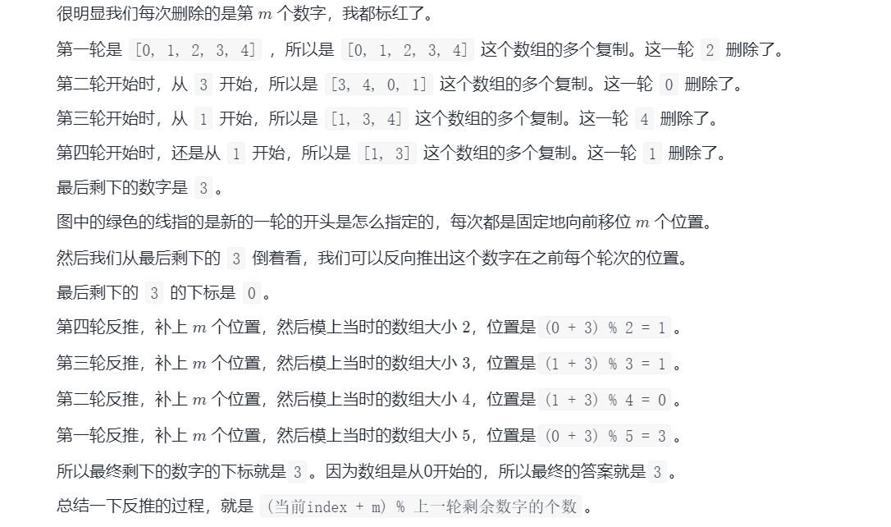
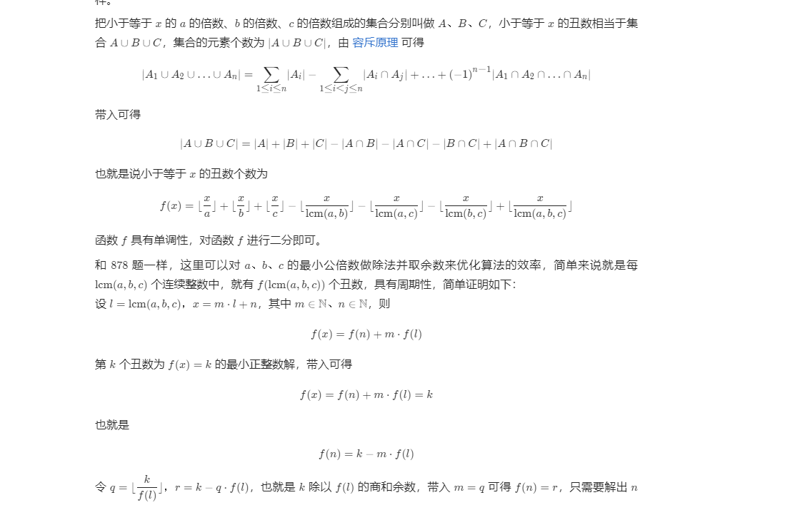

## 1. 开头
## 2. 经典题目

* 【Offer 62】圆圈中最后剩下的数字
0,1,···,n-1这n个数字排成一个圆圈，从数字0开始，每次从这个圆圈里删除第m个数字（删除后从下一个数字开始计数）。求出这个圆圈里剩下的最后一个数字。

例如，0、1、2、3、4这5个数字组成一个圆圈，从数字0开始每次删除第3个数字，则删除的前4个数字依次是2、0、4、1，因此最后剩下的数字是3。

```
    /*
    思路：使用数学方法(先举例)
            你要知道最后的结果是3，带着结果去看问题

        第一次，【0, 1, 2, 3, 4】，本轮要踢出2                                  看3
        (下一轮开始从3计数，为了方便读者看出规律，将开始计数的那一位移到开头)
        第二次，【3, 4, 0, 1】，本轮要踢出0                                     看1
        第三次，【1, 3, 4】，本轮要踢出4                                        看1
        第四次，【1, 3】 本轮要踢出1                                            看3
        第五次，【3】
        最后返回3

        我们要使用的数学方法，就是从结果0号位置，反推最开始在哪
        你从第二次，向上看第一次
        你会发现，原来3在0的位置
                现在，3在(0 + 3) % 5
                        => +3 回到上次的位置
                        => %5 防止数组溢出，并且数组本来就是循环数组

        f(n) = ( f(n - 1) + m ) % n
        解释意思：
            f(n) 表示上一次
            f(n - 1) 表示这次，因为我们要从这次回推上一次
            m 表示隔几个
            n表示上一次的数组长度

     */
  public int lastRemaining(int n, int m) {
        int ans = 0;
        // 最后一轮剩下2个人，所以从2开始反推
        for (int i = 2; i <= n; i++) {
            ans = (ans + m) % i;
        }
        return ans;
    }
```

* 【204】 计数质数
统计所有小于非负整数 n 的质数的数量
  * 对于一个质数 x，如果按上文说的我们从 2x 开始标记其实是冗余的，应该直接从 x\cdot xx⋅x 开始标记，因为 2x,3x,\ldots2x,3x,… 这些数一定在 xx 之前就被其他数的倍数标记过了，例如 2 的所有倍数，3 的所有倍数等
  * 当然这里还可以继续优化，对于一个质数x，如果按上文说的我们从2x开始标记其实是冗余的，应该直接从x*x开始标记，因为2.x , 3.x , ....这些数一定在x之前就被其他数的倍数标记过了，例如2的所有倍数，3的所有倍数等。
```
    public int countPrimes(int n) {
        int ans = 0;
        boolean[] check = new boolean[n];
        for (int i = 2; i < n; i++) {
            if (!check[i]) {
                ans++;
                if ((long) i * i < n) {
                    for (int j = i * i; j < n; j += i) {
                        check[j] = true;
                    }
                }
            }
        }
        return ans;
    }
```

* 【9】回文数
给你一个整数 x ，如果 x 是一个回文整数，返回 true ；否则，返回 false 。

回文数是指正序（从左向右）和倒序（从右向左）读都是一样的整数
```
  public boolean isPalindrome(int x) {
        if (x < 0) {
            return false;
        }
        if (x == 0) {
            return true;
        }
        int n = 0, y = x;
        while (x != 0) {
            n = n * 10 + x % 10;
            x /= 10;
        }
        return y == n;
    }
```

* 【1363】. 形成三的最大倍数
给你一个整数数组 digits，你可以通过按任意顺序连接其中某些数字来形成 3 的倍数，请你返回所能得到的最大的 3 的倍数。

由于答案可能不在整数数据类型范围内，请以字符串形式返回答案。

如果无法得到答案，请返回一个空字符串

  * 如果取模3等于0，那其实可以都要，如果是1，那就得去掉一个1或者两个2，如果是2那就得去掉一个2或者两个1
  * 而这些删掉一个数的函数其实是类似的，可以反复调用。注意在如果全是0输出0而不是00000. 删完数之后判断答案的最高位是不是0即可


https://leetcode.com/problems/largest-multiple-of-three/discuss/518830/C%2B%2BJava-Concise-O(n)


```
/**
显然，尝试数字组合是行不通的，因为我们最多可以有 10,000 个数字。幸运的是，有一个方便的可分性测试：

如果一个数的所有数字之和能被 3 整除，则该数能被 3 整除。

观察 1：由于顺序无关紧要，最大的数可以通过从最大 ( 9) 到最小 ( 0) 的数字相加来形成，例如9999966330000。

因此，我们可以只计算每个数字的出现次数，然后生成字符串。

观察 2：我们需要使用所有数字来形成最大数。如果我们对所有数字求和，并且 3 的模不为零，我们需要删除 1（最好）或 2 个最小的数字。例如，如果和的模 3 是1，我们将尝试删除1、4或7（如果存在）或 、 或2的5两个8。

更多示例：

9965341 % 3 == 1; 我们删除1以获得最大的数字。
9952000 % 3 == 1; 现在我们需要删除两个数字2和5，因为没有1,4或7
*/

public String largestMultipleOfThree(int[] digits) {
    int m1[] = new int[] {1, 4, 7, 2, 5, 8}, m2[] = new int[] {2, 5, 8, 1, 4, 7};
    int sum = 0, ds[] = new int[10];
    for (int d : digits) {
        ++ds[d];
        sum += d;
    }
    while (sum % 3 != 0) {
        for (int i : sum % 3 == 1 ? m1 : m2) {
          if (ds[i] > 0) {
            --ds[i];
            sum -= i;
            break;
          }
        }
      }
    StringBuilder sb = new StringBuilder();
    for (int i = 9; i >= 0; --i)
        sb.append(Character.toString('0' + i).repeat(ds[i]));     
    return sb.length() > 0 && sb.charAt(0) == '0' ? "0" : sb.toString();
}
```


* 【1201】. 丑数 III
给你四个整数：n 、a 、b 、c ，请你设计一个算法来找出第 n 个丑数。

丑数是可以被 a 或 b 或 c 整除的 正整数
  * 使用了容斥原理  
  * 二分法
 

```
    public int nthUglyNumber(int n, int a, int b, int c) {
        long ab = (long) a * (long) b / gcd(a, b);
        long ac = (long) a * (long) c / gcd(a, c);
        long bc = (long) b * (long) c / gcd(b, c);
        long abc = (long) a * bc / gcd(bc, a);
        long lo = 1, hi = (long) 2e9;
        while (lo < hi) {
            long mid = lo + (hi - lo) / 2;
            long val = mid / a + mid / b + mid / c - mid / ab - mid / ac - mid / bc + mid / abc;
            if (val < n) {
                lo = mid + 1;
            } else {
                hi = mid;
            }
        }
        return (int) lo;
    }


    //求最大公约数，比如6，4为2
    //2，3为1
    public long gcd(long x, long y) {
        if (x == 0) return y;
        return gcd(y % x, x);
    }
```

```
  //该方法思路可以借鉴，但是结果不对,有可能重复
   public int nthUglyNumber(int n, int a, int b, int c) {
        int[] dp = new int[n + 1];
        for (int i = 1, a1 = 1, b1 = 1, c1 = 1; i <= n; i++) {
            int next = Math.min(c * c1, Math.min(a * a1, b * b1));
            dp[i] = next;
            if (next == c * c1) {
                c1++;
            }
            if (next == b * b1) {
                b1++;
            }
            if (next == a * a1) {
                a1++;
            }
        }
        return dp[n];
    }
```