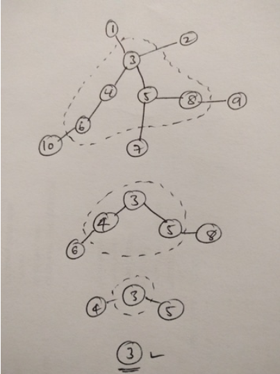

## 1. 概述   
## 2. 经典题目  
* 【207】你这个学期必须选修 numCourses 门课程，记为 0 到 numCourses - 1 。 在选修某些课程之前需要一些先修课程。 先修课程按数组 prerequisites 给出，其中 prerequisites[i] = [ai, bi] ，表示如果要学习课程 ai 则 必须 先学习课程 bi 。例如，先修课程对 [0, 1] 表示：想要学习课程 0 ，你需要先完成课程 1 .请你判断是否可能完成所有课程的学习？如果可以，返回 true ；否则，返回 false 。   
* 统计每个课被指向次数，初始被指向次数为0的肯定是安全的（不在环上）。
  * 每被安全课程指向一次，被指次数减一，
  * 如果被指次数减到0，说明该课程全部指向都来自安全课程，则它也是安全的。
  * 依此进行队列循环。 
```
    //[[1,0],[0,1]]
    public boolean canFinish(int numCourses, int[][] prerequisites) {
        int[] inDegree = new int[numCourses];
        Deque<int[]> deque = new ArrayDeque<>();
        //统计每门课程被指向了多少次（需要该课程先学完）
        for (int[] prerequisite : prerequisites) {
            inDegree[prerequisite[1]]++;
            deque.offer(prerequisite);
        }
        while (!deque.isEmpty()) {
            int size = deque.size(), loopSize = size;
            while (loopSize-- > 0) {
                int[] preInfo = deque.poll();
                //如果要需要的课程的入度为0
                if (inDegree[preInfo[0]] == 0) {
                    //说明是安全的，可以减去前置条件
                    inDegree[preInfo[1]]--;
                } else {
                    deque.offer(preInfo);
                }
            }
            if (size == deque.size()) {
                return false;
            }
        }
        return true;
    }
```

* 【210】现在你总共有 numCourses 门课需要选，记为 0 到 numCourses - 1。给你一个数组 prerequisites ，其中 prerequisites[i] = [ai, bi] ，表示在选修课程 ai 前 必须 先选修 bi 。 
  * 统计入度大于等于1的
  * 将入度为0的放入队列作为第一波
```
    public int[] findOrder(int numCourses, int[][] prerequisites) {
        int[] inDegree = new int[numCourses];
        for (int[] prerequisite : prerequisites) {
            inDegree[prerequisite[0]]++;
        }
        Deque<Integer> deque = new ArrayDeque<>();
        for (int i = 0; i < numCourses; i++) {
            if (inDegree[i] == 0) {
               deque.offer(i);
            }
        }
        int[] res = new int[numCourses];
        int idx = 0;
        while (!deque.isEmpty()) {
            int cur = deque.poll();
            res[idx++] = cur;
            for (int[] prerequisite : prerequisites) {
                if (prerequisite[1] == cur && --inDegree[prerequisite[0]] == 0) {
                    deque.offer(prerequisite[0]);
                }
            }

        }
        return idx != numCourses ? new int[]{} : res;
    }
```

* 【331】序列化二叉树的一种方法是使用前序遍历。当我们遇到一个非空节点时，我们可以记录下这个节点的值。如果它是一个空节点，我们可以使用一个标记值记录.上面的二叉树可以被序列化为字符串 "9,3,4,#,#,1,#,#,2,#,6,#,#"，其中 # 代表一个空节点.给定一串以逗号分隔的序列，验证它是否是正确的二叉树的前序序列化。编写一个在不重构树的条件下的可行算法。每个以逗号分隔的字符或为一个整数或为一个表示 null 指针的 '#' 。你可以认为输入格式总是有效的，例如它永远不会包含两个连续的逗号，比如 "1,,3" 。
  * 基于一个性质：所有节点的入度之和等于出度之和
  * 初始为1是为了在加入根节点的时候，diff 先减去 1（入度），再加上 2（出度），此时 diff 正好应该是2.
```
 public boolean isValidSerialization(String preorder) {
        int diff = 1;//出度减去入度的差值,是为了在加入根节点的时候，diff 先减去 1（入度），再加上 2（出度），此时 diff 正好应该是2.
        for (String c : preorder.split(",")) {
            diff--;//遍历第一个字符串，一定有一个入度，减去入度的值
            if (diff < 0) {
                return false;
            }
            diff += (c.equals("#") ? 0 : 2);//加上出度的值
        }
        return diff == 0;
    }
```

* 【133】给你无向 连通 图中一个节点的引用，请你返回该图的 深拷贝（克隆）
  * 和之前的随机数拷贝一样
  * 需要注意，需要提前将node放入cahche中
```
    Map<Integer, Node> cache = new HashMap<>();
    public Node cloneGraph(Node node) {
        if (node == null) {
            return node;
        }
        Node newNode = cache.get(node.val);
        if (newNode != null) {
            return newNode;
        }
        newNode = new Node(node.val);
        cache.put(newNode.val, newNode);
        for (Node neighbor : node.neighbors) {
            newNode.neighbors.add(cloneGraph(neighbor));
        }
        return newNode;
    }
```

* 【】存在一个 无向图 ，图中有 n 个节点。其中每个节点都有一个介于 0 到 n - 1 之间的唯一编号。给你一个二维数组 graph ，其中 graph[u]。是一个节点数组，由节点 u 的邻接节点组成。形式上，对于 graph[u] 中的每个 v ，都存在一条位于节点 u 和节点 v 之间的无向边。该无向图同时具有以下属性：
  不存在自环（graph[u] 不包含 u）。 
  不存在平行边（graph[u] 不包含重复值）。 
  如果 v 在 graph[u] 内，那么 u 也应该在 graph[v] 内（该图是无向图） 
  这个图可能不是连通图，也就是说两个节点 u 和 v 之间可能不存在一条连通彼此的路径。 
  二分图 定义：如果能将一个图的节点集合分割成两个独立的子集 A 和 B ，并使图中的每一条边的两个节点一个来自 A 集合，一个来自 B 集合，就将这个图称
   二分图 。 
  如果图是二分图，返回 true ；否则，返回 false 。 
* 我们任选一个节点开始，将其染成红色，并从该节点开始对整个无向图进行遍历；
* 在遍历的过程中，如果我们通过节点 uu 遍历到了节点 vv（即 uu 和 vv 在图中有一条边直接相连），那么会有两种情况
  * 如果 vv 未被染色，那么我们将其染成与 uu 不同的颜色，并对 vv 直接相连的节点进行遍历
  * 如果 vv 被染色，并且颜色与 uu 相同，那么说明给定的无向图不是二分图。我们可以直接退出遍历并返回 \text{False}False 作为答案
* 当遍历结束时，说明给定的无向图是二分图，返回 \text{True}True 作为答案 
```
    public boolean isBipartite(int[][] graph) {
        int[] colors = new int[graph.length];
        for (int i = 0; i < graph.length; i++) {
            if (colors[i] == 0 && !dfs(graph, colors, i, 1)) {
                return false;
            }
        }
        return true;
    }

    private boolean dfs(int[][] graph,  int[] colors, int i, int color) {
        if (colors[i] != 0) {
            //如果染色相同，为真
            return colors[i] == color;
        }
        colors[i] = color;
        for (int nei : graph[i]) {
            //如果染色不同，则直接返回
            if (!dfs(graph, colors, nei, -color)) {
                return false;
            }
        }
        return true;
    }
```


* 【752】打开转盘锁，你有一个带有四个圆形拨轮的转盘锁。每个拨轮都有10个数字： '0', '1', '2', '3', '4', '5', '6', '7', '8', '9' 。每个拨轮可以自由旋转：例如把 '9' 变为 '0'，'0' 变为 '9' 。每次旋转都只能旋转一个拨轮的一位数字。

锁的初始数字为 '0000' ，一个代表四个拨轮的数字的字符串。

列表 deadends 包含了一组死亡数字，一旦拨轮的数字和列表里的任何一个元素相同，这个锁将会被永久锁定，无法再被旋转。

字符串 target 代表可以解锁的数字，你需要给出解锁需要的最小旋转次数，如果无论如何不能解锁，返回 -1 
  * bfs基础解法
  * bfs双端解法（未掌握）
  * 优化解法(未掌握)
  *  String next1 = cur.substring(0, i) + (c == '9' ? 0 : c - '0' + 1) + cur.substring(i + 1);
     String next2 = cur.substring(0, i) + (c == '0' ? 9 : c - '0' - 1) + cur.substring(i + 1);和下面的不一样
     String next1 = cur.substring(0, i) + (c == '9' ? '0' : c - '0' + 1) + cur.substring(i + 1);
     String next2 = cur.substring(0, i) + (c == '0' ? '9' : c - '0' - 1) + cur.substring(i + 1);
```
   public int openLock(String[] deadends, String target) {
        Set<String> hash = new HashSet<>(Arrays.asList(deadends));
        if (hash.contains(target)) {
            return -1;
        }
        Queue<String> deque = new LinkedList<>();
        Set<String> visited = new HashSet<>();
        deque.offer("0000");
        visited.add("0000");
        int level = 0;
        while (!deque.isEmpty()) {
            int size = deque.size();
            while (size-- > 0) {
                String s = deque.poll();
                if (hash.contains(s)) {
                    continue;
                }
                if (s.equals(target)) {
                    return level;
                }
                StringBuilder cur = new StringBuilder(s);
                for (int i = 0; i < 4; i++) {
                    char c = cur.charAt(i);
                    String next1 = cur.substring(0, i) + (c == '9' ? 0 : c - '0' + 1) + cur.substring(i + 1);
                    String next2 = cur.substring(0, i) + (c == '0' ? 9 : c - '0' - 1) + cur.substring(i + 1);
                    if (!visited.contains(next1) && !hash.contains(next1)) {
                        deque.offer(next1);
                        visited.add(next1);
                    }
                    if (!visited.contains(next2) && !hash.contains(next2)) {
                        deque.offer(next2);
                        visited.add(next2);
                    }
                }
            }
            level++;
        }
        return -1;
    }

    //方法2
    public int openLock(String[] deadends, String target) {
        Set<String> begin = new HashSet<>();
        Set<String> end = new HashSet<>();
        Set<String> deads = new HashSet<>(Arrays.asList(deadends));
        begin.add("0000");
        end.add(target);
        int level = 0;
        while(!begin.isEmpty() && !end.isEmpty()) {
            Set<String> temp = new HashSet<>();
            for(String s : begin) {
                if(end.contains(s)) return level;
                if(deads.contains(s)) continue;
                deads.add(s);
                StringBuilder sb = new StringBuilder(s);
                for(int i = 0; i < 4; i ++) {
                    char c = sb.charAt(i);
                    String s1 = sb.substring(0, i) + (c == '9' ? 0 : c - '0' + 1) + sb.substring(i + 1);
                    String s2 = sb.substring(0, i) + (c == '0' ? 9 : c - '0' - 1) + sb.substring(i + 1);
                    if(!deads.contains(s1))
                        temp.add(s1);
                    if(!deads.contains(s2))
                        temp.add(s2);
                }
            }
            level ++;
            begin = end;
            end = temp;
        }
        return -1;
    }

    //通过总是选择一个较小的集合，这个过程可以减少一点（因为在这个问题中双方的规模是相似的）时间复杂度和内存复杂度。这是完整版，运行时间：80ms
      public int openLock(String[] deadends, String target) {
        Set<String> begin = new HashSet<>();
        Set<String> end = new HashSet<>();
        Set<String> deads = new HashSet<>(Arrays.asList(deadends));
        begin.add("0000");
        end.add(target);
        int level = 0;
        Set<String> temp;
        while(!begin.isEmpty() && !end.isEmpty()) {
            if (begin.size() > end.size()) {
                temp = begin;
                begin = end;
                end = temp;
            }
            temp = new HashSet<>();
            for(String s : begin) {
                if(end.contains(s)) return level;
                if(deads.contains(s)) continue;
                deads.add(s);
                StringBuilder sb = new StringBuilder(s);
                for(int i = 0; i < 4; i ++) {
                    char c = sb.charAt(i);
                    String s1 = sb.substring(0, i) + (c == '9' ? 0 : c - '0' + 1) + sb.substring(i + 1);
                    String s2 = sb.substring(0, i) + (c == '0' ? 9 : c - '0' - 1) + sb.substring(i + 1);
                    if(!deads.contains(s1))
                        temp.add(s1);
                    if(!deads.contains(s2))
                        temp.add(s2);
                }
            }
            level ++;
            begin = temp;
        }
        return -1;
    }
```

```
        Set<String> deads = Arrays.stream(deadends).collect(Collectors.toSet());
        if (deads.contains(target) || deads.contains("0000")) {
            return -1;
        }
        Set<String> visited = new HashSet<>();
        Deque<String> deque = new ArrayDeque<>();
        Deque<String> deque2 = new ArrayDeque<>();
        deque.offer("0000");
        deque2.offer(target);
        int level = 0;
        while (!deque.isEmpty() && !deque2.isEmpty()) {
            if (deque.size() > deque2.size()) {
                Deque<String> temp = deque2;
                deque2 = deque;
                deque = temp;
            }
            int size = deque.size();
            while (size-- > 0) {
                String cur = deque.poll();
                if (deque2.contains(cur)) {
                    return level;
                }
                if (visited.contains(cur)) {
                    continue;
                }
                visited.add(cur);
                for (int i = 0; i < 4; i++) {
                    char c = cur.charAt(i);
                    String next1 = cur.substring(0, i) + (c == '9' ? 0 : c - '0' + 1) + cur.substring(i + 1);
                    String next2 = cur.substring(0, i) + (c == '0' ? 9 : c - '0' - 1) + cur.substring(i + 1);
                    if (!deads.contains(next1) && !visited.contains(next1)) {
                        deque.offer(next1);
                    }
                    if (!deads.contains(next2) && !visited.contains(next2)) {
                        deque.offer(next2);
                    }
                }
            }
            level++;
        }
        return -1;
```


* 【1293】网格中的最短路径, 给你一个 m * n 的网格，其中每个单元格不是 0（空）就是 1（障碍物）。每一步，您都可以在空白单元格中上、下、左、右移动。

如果您 最多 可以消除 k 个障碍物，请找出从左上角 (0, 0) 到右下角 (m-1, n-1) 的最短路径，并返回通过该路径所需的步数。如果找不到这样的路径，则返回 -1。
```
    public int shortestPath(int[][] grid, int k) {
        int n = grid.length, m = grid[0].length;
        boolean[][][] visited = new boolean[n][m][k + 1];
        visited[0][0][0] = true;
        Queue<int[]> queue = new ArrayDeque<>();
        queue.offer(new int[]{0, 0, 0});
        int[][] dirs = new int[][]{{0, 1}, {1, 0}, {0, -1}, {-1, 0}}
        int ans = 0;
        while (!queue.isEmpty()) {
            int size = queue.size();
            while (size--> 0) {
                int[] info = queue.poll();
                int curX = info[0], curY = info[1], curK = info[2];
                if (curX == n - 1 && curY == m - 1) {
                    return ans;
                }
                for (int[] dir : dirs) {
                    int nextX = dir[0] + curX, nextY = dir[1] + curY;
                    int nextK = curK;
                    if (nextX >= 0 && nextY >= 0 && nextX < n && nextY < m) {
                        if (grid[nextX][nextY] == 1) {
                            nextK++;
                        }
                        if (nextK <= k && !visited[nextX][nextY][nextK]) {
                            visited[nextX][nextY][nextK] = true;
                            queue.offer(new int[]{nextX, nextY, nextK});
                        }
                    }
                }
            }
            ans++;
        }
        return -1;
    }


```
* 【854】相似度为 K 的字符串
如果可以通过将 A 中的两个小写字母精确地交换位置 K 次得到与 B 相等的字符串，我们称字符串 A 和 B 的相似度为 K（K 为非负整数）。

  * 给定两个字母异位词 A 和 B ，返回 A 和 B 的相似度 K 的最小值。
其实问题的本质是求出最少交换次数 A 需要使自己等于 B。

这是一个最短路径问题，因此我们可以利用BFS。在graph我们打造集可以从被交换为所有可能的字符串nodes和一个edge存在，如果一个字符串可以通过一个交换转化为其他。我们从 开始，以 为A目标B。

但是，这会导致 TLE。

我们将所有可以通过交换 A' 中两个字母的位置一次形成的可能字符串设置为 A' 的邻居，但是，只有那些可以使 A 和 B 差异较小的字符串才是有意义的邻居。也就是说，如果 A'[i] != B[i] 但 A'[j] == B[i]，则由 swap(A, i, j) 形成的字符串是 A' 的有意义的邻居。请注意，我们只需要交换我们遇到的第一对 (A'[i], A'[j])，因为交换的顺序无关紧要

```
    public int kSimilarity(String s1, String B) {
        Deque<String> deque = new ArrayDeque<>();
        Set<String> visited = new HashSet<>();
        deque.offer(s1);
        visited.add(s1);
        int level = 0;
        while (!deque.isEmpty()) {
            int size = deque.size();
            while (size-- > 0) {
                String cur = deque.poll();
                if (cur.equals(B)) {
                    return level;
                }
                for (String next : getNextSimilar(cur, B)) {
                    if (!visited.contains(next)) {
                        deque.offer(next);
                        visited.add(next);
                    }
                }
            }
            level++;
        }
        return -1;
    }

    private List<String> getNextSimilar(String cur, String B) {
        List<String> nextList = new ArrayList<>();
        int i = 0;
        char[] chars = cur.toCharArray();
        while (i < chars.length) {
            if (chars[i] != B.charAt(i)) { //找到第一个和B中不同的元素作为基准位置
                break;
            }
            i++;
        }
        for (int j = i + 1; j < cur.length(); j++) {//开始拼接下一个字符串，找到和B张i位置一致的符号交换作为下一个字符串
            if (B.charAt(i) == chars[j]) {
                swap(chars, i, j);
                nextList.add(new String(chars));
                swap(chars, j, i);
            }
        }
        return nextList;
    }

    public void swap(char[] chars, int i, int j) {
        char temp = chars[i];
        chars[i] = chars[j];
        chars[j] = temp;
    }
```


* 【834】. 树中距离之和
给定一个无向、连通的树。树中有 n 个标记为 0...n-1 的节点以及 n-1 条边 。

给定整数 n 和数组 edges ， edges[i] = [ai, bi]表示树中的节点 ai 和 bi 之间有一条边。

返回长度为 n 的数组 answer ，其中 answer[i] 是树中第 i 个节点与所有其他节点之间的距离之和

  * https://leetcode-cn.com/problems/sum-of-distances-in-tree/solution/shou-hua-tu-jie-shu-zhong-ju-chi-zhi-he-shu-xing-d/

```
    int[] nums, dist;
    List<Integer>[] graph;
    public int[] sumOfDistancesInTree(int n, int[][] edges) {
        nums = new int[n];
        dist = new int[n];
        graph = new List[n];
        for (int i = 0; i < graph.length; i++) {
            graph[i] = new ArrayList<>();
        }
        for (int[] edge : edges) {
            graph[edge[0]].add(edge[1]);
            graph[edge[1]].add(edge[0]);
        }
        Arrays.fill(nums, 1);
        post(0, -1);
        pre(0, -1);
        return dist;
    }

    private void pre(int i, int parent) {
        for (int nei : graph[i]) {
            if (nei == parent) {
                continue;
            }
            dist[nei] = dist[i] - nums[nei] + (dist.length - nums[nei]);
            pre(nei, i);
        }
    }

    private void post(int i, int parent) {
        for (int nei : graph[i]) {
            if (nei == parent) {
                continue;
            }
            post(nei, i);
            nums[i] += nums[nei];
            dist[i] += nums[nei] + dist[nei];
        }
    }
```

```
const sumOfDistancesInTree = (N, edges) => {
  // 建立映射表，graph[i]：存放节点i 和 与它相连的所有节点
  const graph = new Array(N);
  for (let i = 0; i < graph.length; i++) {
    graph[i] = [];
  }
  for (const edge of edges) {
    const [from, to] = edge;
    graph[from].push(to);
    graph[to].push(from);
  }

  // distSum[i]：节点i到它所在子树的节点的距离和，后面更新为：节点i到其他所有节点的距离和
  const distSum = new Array(N).fill(0);
  // nodeNum[i]：节点i所在子树的节点个数，保底为1
  const nodeNum = new Array(N).fill(1);

  const postOrder = (root, parent) => {
    const neighbors = graph[root]; // 与它相连的节点们
    for (const neighbor of neighbors) {
      if (neighbor == parent) {    // 如果邻居是自己父亲，跳过。
        continue;                  // 如果邻居只有自己父亲，则for循环结束，当前递归结束  
      }
      postOrder(neighbor, root);   // 先压栈压到base case，再进行计算
      nodeNum[root] += nodeNum[neighbor]; // 累加计算当前root子树的节点个数
      distSum[root] += nodeNum[neighbor] + distSum[neighbor]; // 累加计算到子树中节点的距离和
    }
  };

  const preOrder = (root, parent) => {
    const neighbors = graph[root]; // 获取当前root节点的邻居
    for (const neighbor of neighbors) { // 遍历邻居
      if (neighbor == parent) {   // 如果邻居是它的父亲，跳过
        continue;                 // 如果邻居只有自己父亲，则for循环结束，当前递归结束
      }
      // 自顶而下 更新子节点们的真正的distSum
      distSum[neighbor] = distSum[root] - nodeNum[neighbor] + (N - nodeNum[neighbor]);
      // 先拿到正确的distSum，再递归压栈（进入子树求更多的distSum）
      preOrder(neighbor, root);
    }
  };

  postOrder(0, -1); // dfs的入口。因为N>=1，节点0肯定存在，就从节点0开始搜
  preOrder(0, -1);
  return distSum;
}
```


* 【310】. 最小高度树
树是一个无向图，其中任何两个顶点只通过一条路径连接。 换句话说，一个任何没有简单环路的连通图都是一棵树。

给你一棵包含 n 个节点的树，标记为 0 到 n - 1 。给定数字 n 和一个有 n - 1 条无向边的 edges 列表（每一个边都是一对标签），其中 edges[i] = [ai, bi] 表示树中节点 ai 和 bi 之间存在一条无向边。

可选择树中任何一个节点作为根。当选择节点 x 作为根节点时，设结果树的高度为 h 。在所有可能的树中，具有最小高度的树（即，min(h)）被称为 最小高度树 。

请你找到所有的 最小高度树 并按 任意顺序 返回它们的根节点标签列表。

树的 高度 是指根节点和叶子节点之间最长向下路径上边的数量  

  

```
   public List<Integer> findMinHeightTrees(int n, int[][] edges) {
        if (n <= 1) {
            return Collections.singletonList(0);
        }
        List<Set<Integer>> nodes = new ArrayList<>(n);
        for (int i = 0; i < n; ++i) nodes.add(new HashSet<>());
        for (int[] edge : edges) {
            nodes.get(edge[0]).add(edge[1]);
            nodes.get(edge[1]).add(edge[0]);
        }
        List<Integer> leaves = new ArrayList<>();
        for (int i = 0; i < nodes.size(); i++) {
            if (nodes.get(i).size() == 1) {
                leaves.add(i);
            }
        }
        while (n > 2) {
            n -= leaves.size();
            List<Integer> nextLeaves = new ArrayList<>();
            for (Integer leaf : leaves) {
                Integer parent = nodes.get(leaf).iterator().next();
                nodes.get(parent).remove(leaf);
                if (nodes.get(parent).size() == 1) {
                    nextLeaves.add(parent);
                }
            }
            leaves = nextLeaves;
        }
        return leaves;
    }
```

* 【1368】使网格图至少有一条有效路径的最小代价

给你一个 m x n 的网格图 grid 。 grid 中每个格子都有一个数字，对应着从该格子出发下一步走的方向。 grid[i][j] 中的数字可能为以下几种情况：

1 ，下一步往右走，也就是你会从 grid[i][j] 走到 grid[i][j + 1]
2 ，下一步往左走，也就是你会从 grid[i][j] 走到 grid[i][j - 1]
3 ，下一步往下走，也就是你会从 grid[i][j] 走到 grid[i + 1][j]
4 ，下一步往上走，也就是你会从 grid[i][j] 走到 grid[i - 1][j]
注意网格图中可能会有 无效数字 ，因为它们可能指向 grid 以外的区域。

一开始，你会从最左上角的格子 (0,0) 出发。我们定义一条 有效路径 为从格子 (0,0) 出发，每一步都顺着数字对应方向走，最终在最右下角的格子 (m - 1, n - 1) 结束的路径。有效路径 不需要是最短路径 。

你可以花费 cost = 1 的代价修改一个格子中的数字，但每个格子中的数字 只能修改一次 。

请你返回让网格图至少有一条有效路径的最小代价。

思路：

1. 在不更改任何内容的情况下找出所有可到达的节点。
2. 将所有新访问的节点保存到队列`bfs`中。
3. 现在迭代队列
   3.1 对于每个节点，尝试将其更改为所有 3 个其他方向
   3.2 将新的可达且未访问的节点保存到队列中。
   3.3 重复步骤3

```
    public int minCost(int[][] grid) {
        m = grid.length;
        n = grid[0].length;
        int[][] dp = new int[m][n];
        for (int i = 0; i < m; i++) {
            Arrays.fill(dp[i], Integer.MIN_VALUE);
        }
        Deque<int[]> deque = new ArrayDeque<>();
        int cost = 0;
        dfs(0, 0, grid, dp, cost, deque);
        while (!deque.isEmpty()) {
            cost++;
            int size = deque.size();
            while (size-- > 0) {
                int[] cur = deque.poll();
                for (int[] dir : dirs) {
                    dfs(cur[0] + dir[0], cur[1] + dir[1], grid, dp, cost, deque);
                }
            }
        }
        return dp[m - 1][n - 1];
    }

    int m, n;
    int[][] dirs = new int[][]{{0, 1}, {0, -1}, {1, 0}, {-1, 0}};

    public void dfs(int i, int j, int[][] grid, int[][] dp, int cost, Deque<int[]> deque) {
        if (i < 0 || j < 0 || i >= m || j >= n || dp[i][j] != Integer.MIN_VALUE) {
            return;
        }
        dp[i][j] = cost;
        deque.offer(new int[]{i, j});
        int next = grid[i][j] - 1;
        dfs(i + dirs[next][0], j + dirs[next][1], grid, dp, cost, deque);
    }
```


#### [1129. 颜色交替的最短路径](https://leetcode.cn/problems/shortest-path-with-alternating-colors/)

难度中等103

在一个有向图中，节点分别标记为 `0, 1, ..., n-1`。图中每条边为红色或者蓝色，且存在自环或平行边。

`red_edges` 中的每一个 `[i, j]` 对表示从节点 `i` 到节点 `j` 的红色有向边。类似地，`blue_edges` 中的每一个 `[i, j]` 对表示从节点 `i` 到节点 `j` 的蓝色有向边。

返回长度为 `n` 的数组 `answer`，其中 `answer[X]` 是从节点 `0` 到节点 `X` 的红色边和蓝色边交替出现的最短路径的长度。如果不存在这样的路径，那么 `answer[x] = -1`。

 

**示例 1：**

```
输入：n = 3, red_edges = [[0,1],[1,2]], blue_edges = []
输出：[0,1,-1]
```

**示例 2：**

```
输入：n = 3, red_edges = [[0,1]], blue_edges = [[2,1]]
输出：[0,1,-1]
```

**示例 3：**

```
输入：n = 3, red_edges = [[1,0]], blue_edges = [[2,1]]
输出：[0,-1,-1]
```

**示例 4：**

```
输入：n = 3, red_edges = [[0,1]], blue_edges = [[1,2]]
输出：[0,1,2]
```

**示例 5：**

```
输入：n = 3, red_edges = [[0,1],[0,2]], blue_edges = [[1,0]]
输出：[0,1,1]
```

 

**提示：**

- `1 <= n <= 100`
- `red_edges.length <= 400`
- `blue_edges.length <= 400`
- `red_edges[i].length == blue_edges[i].length == 2`
- `0 <= red_edges[i][j], blue_edges[i][j] < n`

```
   public int[] shortestAlternatingPaths(int n, int[][] red_edges, int[][] blue_edges) {
        // Two sets one for blu and another for red
        Set<Integer>[][] graph = new HashSet[2][n];
        for (int i = 0; i < n; i++) {
            graph[0][i] = new HashSet<>();
            graph[1][i] = new HashSet<>();
        }
        // red edges in 0 - col
        for (int[] re : red_edges) {
            graph[0][ re[0] ].add(re[1]);
        }
        // blu edges in 1 - col
        for (int[] blu : blue_edges) {
            graph[1][ blu[0] ].add(blu[1]);
        }
        int[][] res = new int[2][n];
        // Zero edge is always accessible to itself - leave it as 0
        for (int i = 1; i < n; i++) {
            res[0][i] = 2 * n;
            res[1][i] = 2 * n;
        }
        // Q entries are vert with a color (up to that point)
        Queue<int[]> q = new LinkedList<>();
        q.offer(new int[] {0, 0}); // either with red
        q.offer(new int[] {0, 1}); // or with blue
        while (!q.isEmpty()) {
            int[] cur = q.poll();
            int vert = cur[0];
            int colr = cur[1];
            // No need to keep track of level up to now
            // only need to keep what color - and the length
            // is automatically derived from previous node
            for (int nxt : graph[1 - colr][vert]) {
                if (res[1 - colr][nxt] == 2 * n) {
                    res[1 - colr][nxt] = 1 + res[colr][vert];
                    q.offer(new int[] {nxt, 1 - colr});
                }
            }
        }
        int[] ans = new int[n];
        for (int i = 0; i < n; i++) {
            int t = Math.min(res[0][i], res[1][i]);
            ans[i] = (t == 2 * n) ? -1 : t;
        }
        return ans;
    }
```


#### [743. 网络延迟时间](https://leetcode-cn.com/problems/network-delay-time/)

难度中等555

有 `n` 个网络节点，标记为 `1` 到 `n`。

给你一个列表 `times`，表示信号经过 **有向** 边的传递时间。 `times[i] = (ui, vi, wi)`，其中 `ui` 是源节点，`vi` 是目标节点， `wi` 是一个信号从源节点传递到目标节点的时间。

现在，从某个节点 `K` 发出一个信号。需要多久才能使所有节点都收到信号？如果不能使所有节点收到信号，返回 `-1` 。

 

**示例 1：**


```
输入：times = [[2,1,1],[2,3,1],[3,4,1]], n = 4, k = 2
输出：2
```

**示例 2：**

```
输入：times = [[1,2,1]], n = 2, k = 1
输出：1
```

**示例 3：**

```
输入：times = [[1,2,1]], n = 2, k = 2
输出：-1
```

 

**提示：**

- `1 <= k <= n <= 100`
- `1 <= times.length <= 6000`
- `times[i].length == 3`
- `1 <= ui, vi <= n`
- `ui != vi`
- `0 <= wi <= 100`
- 所有 `(ui, vi)` 对都 **互不相同**（即，不含重复边）

```
注意是有向图。采用
朴素 Dijkstra（邻接矩阵）方法，注意0x3f3f3f3f表示无穷大，因为有可能要相加，不能用max_value

int[][] w;
int[] dist;
int k, n;
int INF = 0x3f3f3f3f;
boolean[] vis;

public int networkDelayTime(int[][] ts, int n, int k) {
    this.k = k;
    this.n = n;
    w = new int[n + 1][n + 1];
    dist = new int[n + 1];
    for (int i = 1; i <= n; i++) {
        for (int j = 1; j <= n; j++) {
            w[i][j] = w[j][i] = j == i ? 0 : INF;
        }
    }
    for (int[] time : ts) {
        int i = time[0], j = time[1], q = time[2];
        w[i][j] = q;

    }
    Arrays.fill(dist, INF);
    dist[k] = 0;
    this.vis = new boolean[n + 1];
    for (int p = 1; p <= n; p++) {
        int t = -1;
        for (int i = 1; i <= n; i++) {
            if (!vis[i] && (t == -1 || dist[i] < dist[t])) {
                t = i;
            }
        }
        vis[t] = true;
        for (int i = 1; i <= n; i++) {
            dist[i] = Math.min(dist[i], w[t][i] + dist[t]);
        }
    }
    int ans = 0;
    for (int i = 1; i <= n; i++) {
        ans = Math.max(dist[i], ans);
    }
    return ans > INF / 2 ? -1 : ans;
    int N = 110, M = 6010;
    // 邻接矩阵数组：w[a][b] = c 代表从 a 到 b 有权重为 c 的边
    int[][] w = new int[N][N];
    // dist[x] = y 代表从「源点/起点」到 x 的最短距离为 y
    int[] dist = new int[N];
    // 记录哪些点已经被更新过
    boolean[] vis = new boolean[N];
    int INF = 0x3f3f3f3f;
    int n, k;
    public int networkDelayTime(int[][] ts, int _n, int _k) {
        n = _n; k = _k;
        // 初始化邻接矩阵
        for (int i = 1; i <= n; i++) {
            for (int j = 1; j <= n; j++) {
                w[i][j] = w[j][i] = i == j ? 0 : INF;
            }
        }
        // 存图
        for (int[] t : ts) {
            int u = t[0], v = t[1], c = t[2];
            w[u][v] = c;
        }
        // 最短路
        dijkstra();
        // 遍历答案
        int ans = 0;
        for (int i = 1; i <= n; i++) {
            ans = Math.max(ans, dist[i]);
        }
        return ans > INF / 2 ? -1 : ans;
    }
    void dijkstra() {
        // 起始先将所有的点标记为「未更新」和「距离为正无穷」
        Arrays.fill(vis, false);
        Arrays.fill(dist, INF);
        // 只有起点最短距离为 0
        dist[k] = 0;
        // 迭代 n 次
        for (int p = 1; p <= n; p++) {
            // 每次找到「最短距离最小」且「未被更新」的点 t
            int t = -1;
            for (int i = 1; i <= n; i++) {
                if (!vis[i] && (t == -1 || dist[i] < dist[t])) t = i;
            }
            // 标记点 t 为已更新
            vis[t] = true;
            // 用点 t 的「最小距离」更新其他点
            for (int i = 1; i <= n; i++) {
                dist[i] = Math.min(dist[i], dist[t] + w[t][i]);
            }
        }
    }
}
```

