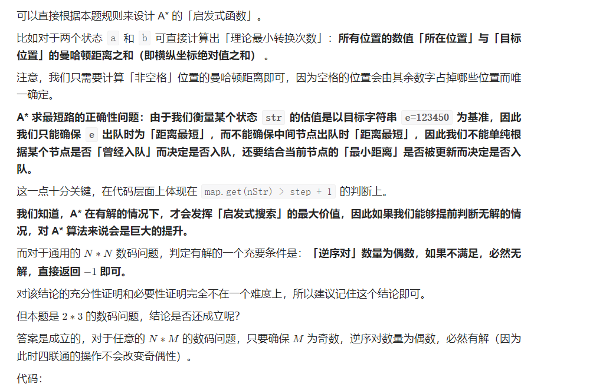

#### [773. 滑动谜题](https://leetcode.cn/problems/sliding-puzzle/)

难度困难262

在一个 `2 x 3` 的板上（`board`）有 5 块砖瓦，用数字 `1~5` 来表示, 以及一块空缺用 `0` 来表示。一次 **移动** 定义为选择 `0` 与一个相邻的数字（上下左右）进行交换.

最终当板 `board` 的结果是 `[[1,2,3],[4,5,0]]` 谜板被解开。

给出一个谜板的初始状态 `board` ，返回最少可以通过多少次移动解开谜板，如果不能解开谜板，则返回 `-1` 。

 

**示例 1：**


```
输入：board = [[1,2,3],[4,0,5]]
输出：1
解释：交换 0 和 5 ，1 步完成
```

**示例 2:**


```
输入：board = [[1,2,3],[5,4,0]]
输出：-1
解释：没有办法完成谜板
```

**示例 3:**


```
输入：board = [[4,1,2],[5,0,3]]
输出：5
解释：
最少完成谜板的最少移动次数是 5 ，
一种移动路径:
尚未移动: [[4,1,2],[5,0,3]]
移动 1 次: [[4,1,2],[0,5,3]]
移动 2 次: [[0,1,2],[4,5,3]]
移动 3 次: [[1,0,2],[4,5,3]]
移动 4 次: [[1,2,0],[4,5,3]]
移动 5 次: [[1,2,3],[4,5,0]]
```

 

**提示：**

- `board.length == 2`
- `board[i].length == 3`
- `0 <= board[i][j] <= 5`
- `board[i][j]` 中每个值都 **不同**

普通BFS：

```
public int slidingPuzzle(int[][] board) {
    String firstStr = "", end = "123450";
    int startI = 0, startJ = 0;
    for (int i = 0; i < board.length; i++) {
        for (int j = 0; j < board[0].length; j++) {
            firstStr += board[i][j];
            if (board[i][j] == 0) {
                startI = i;
                startJ = j;
            }
        }
    }
    int ans = 0;
    if (end.equals(firstStr)) {
        return ans;
    }
    Deque<String[]> deque = new ArrayDeque<>();
    deque.offer(new String[]{String.valueOf(startI), String.valueOf(startJ), firstStr});
    int[][] directs = new int[][]{{1, 0}, {0, 1}, {-1, 0}, {0, -1}};
    Set<String> visited = new HashSet<>();
    while (!deque.isEmpty()) {
        int size = deque.size();
        while (size-- > 0) {
            String[] cur = deque.poll();
            if (end.equals(cur[2])) {
                return ans;
            }
            visited.add(cur[2]);
            int i = Integer.valueOf(cur[0]), j = Integer.valueOf(cur[1]), oldIdx = i * board[0].length + j;
            for (int[] direct : directs) {
                int x = i + direct[0], y = j + direct[1];
                if (x < 0 || y < 0 || x >= board.length || y >= board[0].length) {
                    continue;
                }
                char[] curStr = cur[2].toCharArray();
                int nextId = x * board[0].length + y;
                char temp = curStr[oldIdx];
                curStr[oldIdx] = curStr[nextId];
                curStr[nextId] = temp;
                String nextStr = new String(curStr);
                if (visited.contains(nextStr)) {
                    continue;
                }
                deque.offer(new String[]{x + "", y + "", nextStr});
            }
        }
        ans++;
    }
    return -1;
}
```

启发式搜索： 

```
class Solution {
    class Node {
        String str;
        int x, y;
        int val;
        Node(String _str, int _x, int _y, int _val) {
            str = _str; x = _x; y = _y; val = _val;
        }
    }
    int f(String str) {
        int ans = 0;
        char[] cs1 = str.toCharArray(), cs2 = e.toCharArray();
        for (int i = 0; i < n; i++) {
            for (int j = 0; j < m; j++) {
                // 跳过「空格」，计算其余数值的曼哈顿距离
                if (cs1[i * m + j] == '0' || cs2[i * m + j] == '0') continue;
                int cur = cs1[i * m + j], next = cs2[i * m + j];
                int xd = Math.abs((cur - 1) / 3 - (next - 1) / 3);
                int yd = Math.abs((cur - 1) % 3 - (next - 1) % 3); 
                ans += (xd + yd);
            }
        }
        return ans;
    }
    int n = 2, m = 3;
    String s, e;
    int x, y;
    public int slidingPuzzle(int[][] board) {
        s = "";
        e = "123450";
        for (int i = 0; i < n; i++) {
            for (int j = 0; j < m; j++) {
                s += board[i][j];
                if (board[i][j] == 0) {
                    x = i; y = j;
                }
            }
        }

        // 提前判断无解情况
        if (!check(s)) return -1;

        int[][] dirs = new int[][]{{1,0},{-1,0},{0,1},{0,-1}};
        Node root = new Node(s, x, y, f(s));
        PriorityQueue<Node> q = new PriorityQueue<>((a,b)->a.val-b.val);
        Map<String, Integer> map = new HashMap<>();
        q.add(root);
        map.put(s, 0);
        while (!q.isEmpty()) {
            Node poll = q.poll();
            int step = map.get(poll.str);
            if (poll.str.equals(e)) return step;
            int dx = poll.x, dy = poll.y;
            for (int[] di : dirs) {
                int nx = dx + di[0], ny = dy + di[1];
                if (nx < 0 || nx >= n || ny < 0 || ny >= m) continue;
                String nStr = update(poll.str, dx, dy, nx, ny);      
                if (!map.containsKey(nStr) || map.get(nStr) > step + 1) {
                    Node next = new Node(nStr, nx, ny, step + 1 + f(nStr));
                    q.add(next);
                    map.put(nStr, step + 1);
                }
            }
        }
        return 0x3f3f3f3f; // never
    }
    String update(String cur, int i, int j, int p, int q) {
        char[] cs = cur.toCharArray();
        char tmp = cs[i * m + j];
        cs[i * m + j] = cs[p * m + q];
        cs[p * m + q] = tmp;
        return String.valueOf(cs);
    }
    boolean check(String str) {
        char[] cs = str.toCharArray();
        List<Integer> list = new ArrayList<>();
        for (int i = 0; i < n * m; i++) {
            if (cs[i] != '0') list.add(cs[i] - '0');
        }
        int cnt = 0;
        for (int i = 0; i < list.size(); i++) {
            for (int j = i + 1; j < list.size(); j++) {
                if (list.get(i) > list.get(j)) cnt++;
            }
        }
        return cnt % 2 == 0;
    }
}

```

