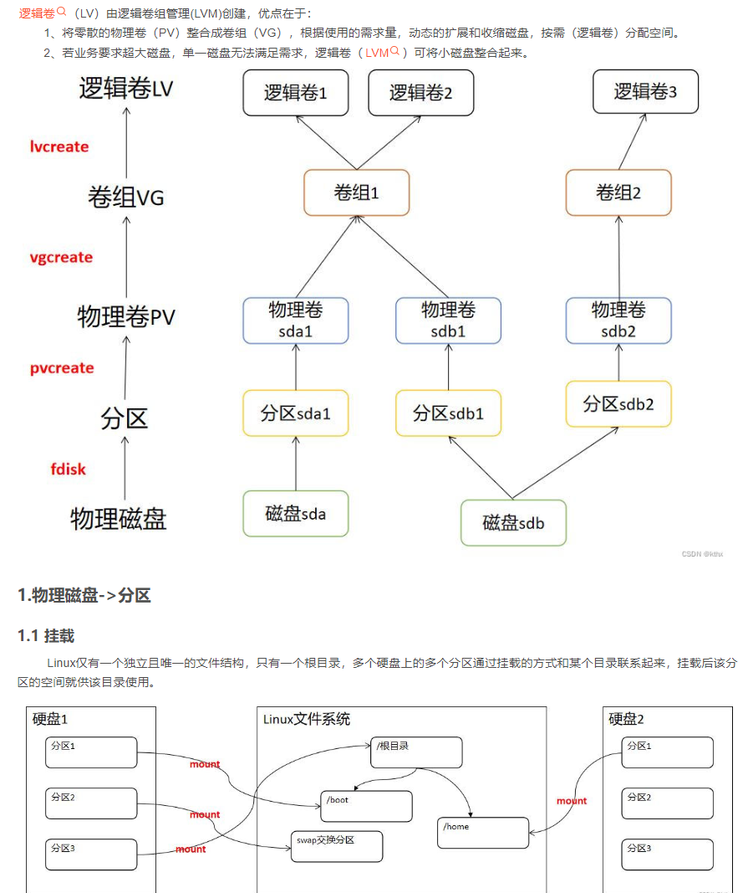

## 说明

管理Linux主要是要求我们如何设置我们的linux

## 网络管理

### 状态查看工具

有两套工具包

net-tools和iproute（centos7以后主推的版本）
* net-tools
  * ifconfig
  * route
  * netstat
* iproute2
  * ip
  * ss

#### 网卡信息

* ifconfig

  ifconfig eth0

  查看某个网卡名称

  网络接口配置

  直接输入ifconfig就是该命令了

  显示含义：eth0 第⼀块⽹网卡（网络接⼝）

  你的第⼀个网络接⼝口可能叫做下⾯的名字

  * eno1 板载网卡
  * ens33 PCI-E网卡
  * enp0s3 无法获取物理理信息的 PCI-E ⽹网卡
  * CentOS 7 使⽤用了了⼀致性网络设备命名，以上都不不匹配则使⽤用 eth0

**PS: 为什么要固定网卡名称**

* 网卡名称固定之后，方便编写多主机批量控制脚本
* 板载网卡有可能不被linux识别，因为非服务器主板驱动程序和linux的兼容性并不好

**修改网卡名称**:

网卡命名规则受 biosdevname 和 net.ifnames 两个参数影响

|       | biosdevname | net.ifnames | 网卡名 |
| ----- | ----------- | ----------- | ------ |
| 默认  | 0           | 1           | ens33  |
| 组合1 | 1           | 0           | em1    |
| 组合2 | 0           | 0           | eth0   |

* vim /etc/default/grub

  编辑 /etc/default/grub ⽂文件，增加 biosdevname=0 net.ifnames=0   
  
  编辑系统内核引导工具，修改启动参数

* biosdevname=0 net.ifnames=0

  在grub_cmdline_linux的值后面增加参数

* grub2-mkconfig -o /boot/grub2/grub.cfg

  执行修改启动参数命令

* reboot 

  重启

#### 网卡物理连接

* mii-tool eth0

  这里查看eth0网卡的连接。虚拟机可能不支持

#### 网络网关

* route -n

  如果需要连接其它的网络设备，查看下一个网络网哪里走，则需要看路由/网关

  -n不解析域名，可以使用route --help来查看.如果要解析成域名，会很慢

    
  * 第一行的意思就是去往所有目标地址数据包由网关10.12.236.1 通过网卡ens33来转发

  * 0.0.0.0代表的是匹配所有目标地址

  * 实际上前两条是自动生成的，因为是直连的网段，在每块网卡上每配置一个IP就会生成一条记录（一个网卡上可以配置多个IP）。表示去往这两个网段的数据包，直接由网卡接口ens33发送出去

    目的地址， 网关位置default 

### 网络配置

有两套命令

#### 网卡配置

* ifconfig <接⼝口> <IP地址> [netmask ⼦子⽹网掩码 ]

  修改ip地址（可以同时修改掩码）
  
* ifconfig eth0 10.211.55.4 

  如果使用云主机会立即发生改变，导致连接不上（可以直接回车，系统自动计算子网掩码，如果子网掩码不符合可以自己自动设置）

* ifconfig eth0 10.211.55.4 netmask 255.255.255.0 

* ifup eth0

  启动网卡（一般不需要使用）

  还原默认配置后启动

* ifdown <接⼝>

  关掉网卡

  还原默认配置
  

#### 网关配置

修改默认网关

需要先删除，再添加

* route del default gw <网关ip>

  删除默认网关

* route add default gw <⽹网关ip>

  添加默认网关

如果需要修改明细路由（自定义目的的网关），需要按照如下配置

* route add -host <指定ip> gw <⽹网关ip>

  添加指定目的的网关

* route add -net <指定⽹网段> netmask <⼦子⽹网掩码> gw <⽹网关ip>

  添加指定网段的网关和掩码

示例

```
route -n # 查看网关
route del default gw 10.211.55.1 # 删除默认网关
route add default gw 10.211.55.2 # 添加默认网关
# 添加明细路由
route add -host 10.0.0.1 gw 10.211.55.1
route add -net 192.160.0.0 netmask 255.255.255.0 gw 10.211.55.1
```

如果需要永久生效需要写入/etc/rc.local

#### ip命令

刚刚说了有两套，这里还有一套命令

* ip addr ls
  * ifconfig
* ip link set dev eth0 up
  * ifup eth0
* ip addr add 10.0.0.1/24 dev eth1
  * ifconfig eth1 10.0.0.1 netmask 255.255.255.0
* ip route add 10.0.0/24 via 192.168.0.1
  * route add -net 10.0.0.0 netmask 255.255.255.0 gw 192.168.0.1

### 网络故障排除

* ping www.baidu.com

  看网络是否通

* traceroute -w 1 www.baidu.com

  追踪路由，追踪网络中的每一跳，会显示经历过多少个路由过来。可以

  traceroute -w 1 表示等待1秒

* mtr

  查看更详细的连接信息。检查网络中间是否数据包丢失了	

* nslookup

  查看域名对应的ip是什么，是由那个服务器解析的dns

* telnet www.baidu.com 80

  主机能通，端口不一定通

* tcpdump

  抓包

  tcpdump -i any -n port 80 and host 10.xx.xx.xx -w /cxc/tcpfile

  所有的网卡，发往80端口和某个ip的数据包保存到tcpfile文件之中。-n表示以ip的形式显示

  - tcpdump -i any -n port 80

    捕捉任意网卡中的80端口，且解析域名

  - tcpdump -i any -n host 10.0.0.1

    捕获某一个主机

  - tcpdump -i any -n host 10.0.0.1 and port 80

  - tcpdump -i any -n host 10.0.0.1 and port 80 -w /tmp/filename

    捕获的数据包用于保存

* netstat

  监听提供的服务服务状态

  netstat -ntpl

  n表示显示ip

  t表示监听tcp的

  p表示显示进程

  l表示Listen的状，即tcp的状态

  注意监听地址，如果是127.0.0.0表示只能对本机进行服务

  如果对所有的机器提供的话，需要改称0.0.0.0

* ss

  监听提供的服务允许服务的ip范围

### 网络配置文件

前面都是一些临时的网络配置信息。比如重启后，可能数据会重置了。

如何将这些配置固化下来呢。需要使用网络配置管理的命令。

#### 管理程序

网络服务管理理程序分为两种，分别为SysV和systemd

* service network start|stop|restart | status

  status表示网络状态，restart会重启网络服务，之前的配置会失效。

* chkconfig -list network

  查看配置的网络

* systemctl list-unit-files NetworkManager.service

  查看NetworkManager,service状态

* systemctl start|stop|restart NetworkManger

* systemctl enable|disable NetworkManger

  启用/禁用NetworkManger

**PS：NetworkManage服务，network服务是centos6的网络默认管理工具， centos7重写了一遍就是NetworkManage服务，因为network只能支持service来管理， 而centos7默认的服务管理工具换成了systemctl，就有了大家要学两套网络管理工具的麻烦的事情 ifconfig 和ip 是同样的情况，他们都可以查询网络状态，都可以设置ip，但是设置了之后只能保存在内存中，重启之后配置就没有了。要想重启之后还需要保持配置需要写入配置文件， 通过service network restart 重新加载配置文件来让网络配置生效**

#### 配置文件

网络配置⽂文件主要有：

* /etc/sysconfig/network-scripts/ifcfg-eth0

  这个和网卡的名称对应

  可以设置网卡的ip获取方式，**静态ip还是动态ip**，编辑完成后需要，重新加载配置文件来生效

  service network restart或者systemctl  restart NetworkManager.service

* hostname xxx

  修改主机名称，这个是临时设置

* hostnamectl set-host xxxx

  修改主机名称，这个是永久设置

* /etc/hosts

  hosts相关，需要注意，很多进程依赖于主机名，所有主机名称修改后，需要将新的主机名和127.0.0.1对应起来

**案例演示**

网卡配置文件路径：/etc/sysconfig/network-scripts/
网卡配置相关文件：ifcfg-*
配置项详情(配置文件内部)：
BOOTPROTO=“dhcp” # 动态获取IP，也可以配置成static
NAME和DEVICE代表网卡的名字
ONBOOT=“yes” # 代表开机的时候网卡是否启用

**静态ip配置**

```
TYPE=Ethernet
UUID=045d35e8-49bc-4865-b04a-165483951724NAME=eth0
DEVICE=ethe
ONBOOT=yes
BOOTPROTO=none # 静态IP配置, dhcp动态配置
IPADDR=10.211.55.3
NETMASK=255.255.255.0
GATEWAY=10.211.55.1
DNS1=114.114.114.114 # DNS可以写3个，DNS1、DNS2、DNS3
```

**配置生效的两种方式**

```
service network restart
systemctl restart NetworkManager.service
```

**PS：CentOS有两套控制网络的方式：network和NetworkManger，network是CentOS6支持的，要想CentOS7以后的支持network，需要禁用NetworkManger，反之同理；工作中不建议两套混合使用。在服务器上一般沿用network**

```
service network status # 查看状态
chkconfig --list network
systemctl disable NetworkManger
```

**主机名配置**

```
hostname # 查看主机名命令
hostname c7.test11 # 临时修改主机名
hostnamectl  set-hostname c7.test11 # 永久更改(需要注意的是，很多服务依赖主机名，需要对应更改，需要将新的主机名写进/etc/hosts文件中，写在127.0.0.1的对应关系中,不写启动会卡在某个服务中并超时)
# 添加新栏即可
vim /etc/hosts
127.0.0.1 c7.test11
```


## 软件包管理

包管理理器器是方便便软件安装、卸载，解决软件依赖关系的重要⼯工具

* CentOS、RedHat 使⽤用 yum 包管理理器器，软件安装包格式为 rpm
* Debian、Ubuntu 使⽤用 apt 包管理理器器，软件安装包格式为 deb

### rpm包

#### 格式

例如：     vim-common-7.4.10-5.el7.×86_64.rpm
分表代表：软件名称 软件版本 系统版本 平台

#### rpm命令

- rpm -q vim-common

  查询vim-common软件包

- rpm -qa

  查询所有的软件包

- rpm  -i xxxx

  安装依赖包。注意报出来的依赖关系(依赖关系可使用yum进行解决)

- rpm  -e xxxx

  卸载软件包

#### 缺陷

- 需要自己解决依赖关系
- 软件包来源不可靠

### yum包管理器

#### yum包镜像

- CentOS yum源
  - http://mirror.centos.org/centos/7/
- 国内镜像
  - https://opsx.alibaba.com/mirror

#### 配置文件

* vim /etc/yum.repos.d/CentOS-Base.repo

  在此可以修改yum的仓库，比如配置公司的yum源

* wget -O /etc/yum.repos.d/CentOS-Base.repo

  下载配置文件并覆盖

  http://mirrors.aliyun.com/repo/Centos-7.repo

#### yum命令

- install 

  安装软件包

- remove 

  卸载软件包

- list | grouplist 

  查看软件包

- update 

  升级软件包

#### 源代码编译

- wget https://openresty.org/download/openresty-1.15.8.1.tar.gz 

  下载代码

- tar -zxf openresty-VERSION.tar.gz

  解压

- cd openresty-VERSION/ 

  进入解压路径

- ./configure --prefix=/usr/local/openresty

  自动配置内核版本、编译器（prefix指定安装位置，很重要）

- make -j2

  编译（将j2，用两个逻辑的CPU进行编译）

- make install

  编译好的文件进行安装

PS：Configure是一个可执行脚本，它有很多选项，在待安装的源码路径下使用命令./configure –help输出详细的选项列表。其中–prefix选项就是配置安装的路径。如果不配置该选项，安装后可执行文件默认放在/usr /local/bin，库文件默认放在/usr/local/lib，配置文件默认放在/usr/local/etc，其它的资源文件放在/usr /local/share，比较分散。

为了便于集中管理某个软件的各种文件，可以配置–prefix，如：./configure –prefix=/usr/local可以把所有资源文件放在/usr/local的路径中，就不会分散了。用了—prefix选项的另一个好处是卸载软件或移植软件。当某个安装的软件不再需要时，只须简单地删除该安装目录，就可以把软件卸载得干干净净；移植软件只需拷贝整个目录到另外一个机器即可（相同的操作系统）。

当然要卸载程序，也可以在原来的make目录下用一次make uninstall，但前提是make文件指定过uninstall

源代码安装可能出现各种错误，需要对应解决才好

#### 二进制安装

### 内核升级

#### rpm格式

- uname -r

  查看内核版本

- yum install kernel-3.10.0

  升级内核版本

- yum update

  升级已安装的其他软件包和补丁

#### 源码编译

* yum install gcc gcc-C++ make ncurses-devel openssl-devel elfutils-libelf-devel

  安装依赖包（出现报错一个个安装）

* tar xvf linux-5.1.10.tar.xz -C /usrlsrc/kernels

  https://www.kernel.org下载后解压

* cd /usr/src/kernels/linux-5.1.10/

  进入内核参数配置

* make menuconfig | allyesconfig | allnoconfig

   menuconfig出现菜单配置（光标移动到某行按空格）、allyesconfig所有功能都安装、allnoconfig最小的内核

* cp /boot/config-kernelversion.platform /usr/src/kernels/linux-5.1.10/.config

  使用当前系统内核配置

### grub配置

grub是系统引导设置

#### 配置文件

- /etc/default/grub

  更改简单配置信息

- /etc/grub.d/

  更改详细配置信息（一般情况下不需要）

- /boot/grub2/grub.cfg

- grub2-mkconfig -0 /boot/grub2/grub.cfg

#### /etc/default/grub

- GRUB_DEFAULT

  默认引导内核（可能存在多个内核）

- GRUB_CMDLINE_LINUX

  确认引导的时候对内核增加怎样的参数

示例：

```
# 更改默认引导内核
grub2-editenv list
grep ^menu /boot/grub2/grub.cfg # 查找以menu开头的行
grub2-set-default 0 # 更改为第一个内核
reboot
```

#### 单用户修改root

用于忘记root密码


## 进程管理

进程也是树形结构。进程和权限有着密不可分的关系

### 查看命令

#### ps

- ps (process status)

  查看当前终端的进程。查看当前用户所启动的进程

- ps -e

  查看所有进程

- ps -e | more

  分页输出

- ps -ef | more 

  更多显示该进程由哪个用户启动（启动用户身份可更改），UID有效用户身份，其中PPID显示的是父进程ID

- PS -eLf | more

  更多的显示线程的信息

- pstree

  显示进程以树状的形式显示

- pstree

#### top

时动态观察进程信息，其信息含义

* min 系统启动时间

  users  当前有多少个用户正在登录

* load average

  衡量系统的繁忙程度的，三个值对应一分钟、五分钟和十五分钟（如果繁忙程度为1则为超负载）

* Tasks

  显示当前有多少个任务（之后为任务的不同状态）

* Cpu(s) cpu的使用状态

  * us 用户空间占用CPU百分比

  * sy 内核空间占用CPU百分比

  * ni 用户进程空间内改变过优先级的进程占用CPU百分比

  * id 空闲CPU百分比（注意以下这个）

  * wa 等待输入输出的CPU时间百分比

  * hi 

    硬件中断

  * si 

    软件中断

  如果想看多个CPU的详细使用情况

  按1即可显示每个CPU的详情；

  再次按数字1就回来了

*  Mem 内存的使用状态

* Swap 交换分区的使用状态

默认实时更新为3s一次，如果想加快更新频率按s键即可进行更改更新频率

### 优先级调整

- nice -n 10 ./a.sh

  这里运行脚本进程，设置优先级为10

  nice范围从-20到19，值越小优先级越高，抢占资源就越多

- renice -n 15 19314 

  renice重新设置优先级

### 进程作业

#### 后台运行

* jobs

  查看所有后台程序

- ./a.sh &

  将进程移动到后台运行

- fg 1 

  启动后台对应程序(1为jobs所显示的进程编号)

- ./a.sh Ctrl + z

  将当前正在运行的进程切换到后台并停止

- bg 1

  放在后台继续运行

#### 进程通讯

信号是进程间通信方式之一

典型用法是终端用户输入中断命令，通过信号机制停止一个程序的运行

使用信号的常用快捷键和命令

- kill -l

  - SIGINT 通知前台进程组终止进程（ctrl + c）
  - SIGKILL 立即结束程序，不能被阻塞和处理kill -9 pid

- kill -9 22817

  用9号信号杀死进程ID为22817的进程

### 守护进程

使用nohup与&符号配合运行一个命令

nohup命令使进程忽略hangup(挂起)信号

守护进程不需要终端即可启动起来，而且对应的输出可以打印到指定的文件中，而且进程所占用的目录为根目录。
nohup：**即使关掉终端，在后台依旧可能正常运行**；忽略输入并把输出追加到当前目录下的"nohup.out"中

* nohup tail -f /var/log/message &

* cd /proc/

  /proc在硬盘中是不存在的，只是系统为了操作进程而生成的

* cd /proc/2745

  该目录下会为每个进程ID生成一个文件夹

### screen命令

screen可用于恢复之前中断（网络中断）的工作现场

- 使用screen命令
  - scree进入screen环境
  - ctrl+a d 退出(detached) screen环境
  - screen -ls查看screen的会话
  - screen -r sessionid 恢复会话
  - exit退出screen环境

### 日志

* /var/log/ 

  日志文件

经常查看的系统日志

* message

  系统常规日志

* dmesg

  内核日志（系统刚启动时所打印的信息）

* secure

  系统安全日志

* cron

  计划任务的日志信息

### 服务管理工具

什么是服务？就是提供常见功能的守护进程。如何对这些服务进行管理。有两个工具

service需要自己写启动和关停脚本。systemctl强化了service的启动和关停，使用一行命令即可

- service

  - cd /etc/init.d/ 

    service对应目录 

  - vim network 

  ​        随便查看一个启动脚本

- systemctl

  - cd /usr/lib/systemd/system/ 

    systemctl对应目录

  - vim sshd.service 

    随便查看一个启动脚本

  - chkconfig --list 

    查看不同的启动级别（具体级别查询）

#### systemctl

软件包安装的服务单元 /usr/lib/systemd/system/

常见的命令

* systemctl start | stop | status | restart | reload | enable | disable 服务名称

* systemctl stop sshd.service

* systemctl status sshd.service

* systemctl start sshd.service

* systemctl enable sshd.service

  随着开机启动起来

* cd /lib/systemd/system  systemctl get-default

  查看服务级别。得到当前级别

* systemctl set-default multi-user.target

  设置对应启动级别

* 服务启动顺序问题

  设置 After属性和Requires属性，需要结合shell数学

### SELinux

MAC（强制访问控制）与DAC（自主访问控制）

给进程、用户、文件每一个都打一个标签，需要三个标签保持一致才能进行强制访问控制。
使用SELinux会降低服务器性能

#### 查看SELinux的命令

- getnforce

  查看SELinux状态

- /usr/sbin/setstatus

- ps -Z and ls -Z and id -Z

  ps -Z 

  查看进程的标签

  id -Z 

  查看当前用户的标签

  ls -Z 

  查看文件的标签

#### 配置

#### 关闭SELinux

- setnforce 0

  临时改

- vim /etc/selinux/config

  永久改

  对应属性SELINUX

  SELINUX=disabled 关闭SELinux

  setnoforce 0  临时更改SELinux状态（修改只能通过配置文件）

- /etc/selinux/sysconfig

## 内存管理

- free

- free -m 

  以M的单位显示

- free -g 

  以G的单位显示

- free -t

  注意查 看used的和available的

- top

## 磁盘管理

### 查看

- fdisk

  即可以查看磁盘又可可以对磁盘进行分区

- fdisk -l

  查看磁盘分区类型

- ls -l /dev/sd?

  第一块sda、第二块sdb、sdc

  查看磁盘的具体类型。

  b是块设备，b的权限最好不要进行更改(只进行查看即可)

- ls -l /dev/sd??

  查看磁盘的具体分区及类型

- df -h 

  可以看成fdisk的补充。可以查看哪个分区映射到哪个目录

- du /etc/passwd 

  查看文件实际占用空间

- ls -l /etc/passwd

  查看文件逻辑占用空间

- du和ls的区别

  案例：

  ```
  dd if=afile of=bfile # 将afile内容拷贝到bfile
  dd if=afile bs=4M count=10 of=bfile # 将afile内容拷贝到bfile，每次写4M,总共写10次
  dd if=afile bs=4M count=10 seek=20 of=bfile # 将afile内容拷贝到bfile，每次写4M,总共写10次,并跳过前80M 
  ```

du:指的是占用的磁盘空间。占用空间取决于文件系统的block的大小，linux默认大小为4K。一个大小为1个字节的文件，最小也要占用4k
ls 显示的文件大小比du显示的磁盘占用空间小

### 文件系统

Linux支持多种文件系统，常见的有

- ext4
- xfs
- NTFS（需安装额外软件NTFS-3G）

#### ext4文件系统

ext4文件系统基本结构比较复杂，其特点为

- 超级块（记录了当前分区的文件大小 df查询的就是超级块信息）
- 超级块副本（对超级块进行备份）
- i节点（inode）（i节点记录每一个文件名称、大小、编号以及权限，但是文件的文件名记录在自己文件的父目录的i节点里面 ls）
- 数据块（datablock）（记录文件的数据 du）

常见的命令

* ls -l

  除了文件名信息，其他信息都记录在i节点中

* ls -i

  查看每一个文件对应的编号

* touch afile 

  创建空文件

* ls -li afile

  查看i节点的编号

* du -h afile

  查看afile内容

* echo 123 > afile 

  写入123

* ls -li afile 

* du -h afile

  4.0K(在ext4系统里面默认创建一个数据块大小为4K)

* cp afile afile2，ls -li afile

  复制文件可以查看到两个文件的编号不同

* mv afile2 afile3，ls -li afile

  文件编号不发生改变（只是改变目录里面文件名和文件的对应关系），但是越过了分区就会发生改变

* vim afile4，ls -li afile4，vim afile4，ls -li afile4 

  vim编辑afile4 i结点会发生改变，但是使用echo不会发生改变，使用硬链接的方法可以不发生改变（在编辑期间会生成一个.afile4.swp文件）

*  rm afile4

  其实只是将文件名和i节点的链接进行断开（也给恢复文件提供了思路）

**PS:有发明专门存储小文件的文件系统**

#### 链接

Linux中是允许多个文件名与一个inode节点对应的，即多个文件名指向同一个inode。这就允许我们通过产生新的文件名来指向一个另外一个文件名所指向的inode，这就意味着我们可以通过不同的文件名（可能在同一路径也可能在不同路径）来访问同一个文件的数据内容，这种情况就可称为**硬链接**。而软链接其实再**创建一个独立的文件**，但是文件会让数据的读取指向它链接的那个文件。即**软链接会写上链接文件的文件名**。

软链接得依赖于原文件，所以这里当原文件被删除后，软链接文件就不能正常指向了。但硬链接文件还能输出的原因是`inode`还存在，删除了原文件只是让`inode`的链接数减少1。**所以要当inode的链接数变为0时，inode才会被系统回首，文件的内容才会被删除**

* ln afile bfile

  将afile链接到bfile所对应的编号上（注意链接ln不能跨越分区的）

  通过ln创建出来的新文件的inode号码将和原文件的inode号码一样，而在inode信息中的链接数将会`加1`

* ln -s afile  aafile ，ls -li afile aafile

  创建软链接，可以跨越分区（aafile链接文件会带一个l，而且权限是777）

  两个节点所对应的编号是不一样的，

facl 文件访问控制列表（给链接的文件不能使用原先的权限分配方式）

* getfacl afile

  查看权限

* setfacl -m u:user1:r afile

  赋予权限(`u:用户名:权限` 给用户赋予权限，g:组)

* setfacl -m u:user2:rw afile getfacl afile

  查看权限

* setfacl -m g:group1:r afile getfacl afile 

  查看权限

* setfacl -x g:group1:r afile

  回收权限

### 挂载

```
cd /dev # 进入设备文件目录
# 设备文件目录下，第一个字符为'c'即时字符设备，'b'即时块设备。
dd if=/dev/sr0 of=/xxx/xx.iso # 把光盘做成光盘镜像
mount /dev/sr0 /mnt # 挂载
```

#### 命令

创建分区：

* fdisk

  查看新添加的硬盘

* fdisk /dev/sdc

  按照对应提示输入

  d 删除对应的默认分区 

  q 不保存直接退出 

  w 保存退出

* fdisk -l

  检查

映射成盘符（设置文件系统）：

* mkfs.   mkfs.ext4   /dev/sdc1

  格式化操作

新建目录挂载：

* mkdir /mnt/sdc1 

* mount /dev/sdc1 /mnt/sdc1

  将/dev/sdc1挂载到/mnt/sdc1

  注：如果硬盘大于2T则不能使用fdisk进行分区，需要使用parted

  parted /dev/sdd

  按照对应的语法处理

#### 持久化

使用mount时挂载信息是临时保存在内存中，如果进行重启则会消失，如果想要固化而需要修改配置信息vim /etc/fstab

可添加 /dev/sdc1 /mnt/sdc1 ext4 defaults 0 0 ，开机后即可挂载(defaults为默认的权限)添加如下代码

### 磁盘配额

#### 命令

- xfs文件系统的用户磁盘配额quota
- mkfs.xfs /dev/sdb1
- mkdir /mnt/disk1
- mount -o uquota,gquota /dev/sdb1 /mnt/disk1
- chmod 1777 /mnt/disk1
- xfs_quota -x -c ‘report -ugibh’ /mnt/disk1
- xfs_quota -x -c ‘limit -u isoft=5 ihard=10 user1’ /mnt/disk1

#### 步骤示例

新建分区

* fdisk /dev/sdb 

  n 新建分区

  p 主分区或扩展分区

  1 默认1号分区

  w 保存

格式化

* mkfs.xfs -f /dev/sdb1

  对分区进行格式化(-f强制操作，避免出错)

 挂载

* mkdir -p /mnt/disk1

  -p如果目录存在则使用目录，不存在则创建

* mount -o uquota,gquota /dev/sdb1 /mnt/disk1

  挂载并支持用户磁盘配额和组磁盘配额（仅当前修改）

  mount

赋予权限

* chmod 1777 /mnt/disk1

1代表目录的stiddy权限

用户配额

* xfs_quota -x -c 'report -ugibh' /mnt/disk1

  u用户、g组、i节点、b块、h格式化输出

* xfs_quota -x -c 'limit -u isoft=5 ihard=10 user1' /mnt/disk1

  isoft指i节点软限制、ihard指i节点硬限制

测试磁盘配额限制

cd /mnt/disk1/ 

touch 1 2 3 4 5 

touch 6 

touch 7 8 9 18 

touch 11

touch：无法创建'11':超出磁盘限额*

### 交换分区

#### 命令方式

使用两个命令增加交换分区的大小

- mkswap
- swapon

具体步骤为：

查看内存

* free -m

  或者free -G

* ls -l /dev/sdd

创建分区

* fdisk /dev/sdd

  n 新建分区
  p 创建主分区
  1 默认分区号
  w 保存

设置检查分区

* ls /dev/sdd1

* mkswap /dev/sdd1

  对该分区设置swap标记

* swapon /dev/sdd1 

  增加交换分区

* free -m

  再次查看swap分区大小

* swapoff /dev/sdd1

  关闭该分区的swap空间

#### 文件方式

使用文件制作交换分区

* dd if=/dev/zero bs=4M count=1024 of=/swapfile

  创建1024*4M的一个文件

* mkswap /swapfile

  注意报错问题（权限问题）

* ls -l /swapfile

  查看

* chmod 600 /swapfile

  修改权限

* swapon /swapfile

* free -m

  查看swap空间

#### 永久修改

#### 上述两种为临时

* vim /etc/fstab

  可添加内容

* /dev/sdd1 swap swap defaults 0 0 

  增加交换分区的大小

* /swapfile swap swap defaults 0 0

  使用文件制作交换分区（第一个0表示为要不要备份；第二个0表示为开机是否需要自检，现在的系统是不需要的）

### RAID技术

#### 含义

RAID：磁盘阵列，把多个硬盘进行组合使用。

RAID的常见级别及含义（可使用RAID卡使用）

- RAID 0 striping条带方式，提高单盘吞吐率（把一个数据拆分成两份，分别写到两个磁盘里，每个磁盘存储50%；至少需要两块硬盘）
- RAID 1 mirroring 镜像方式，提高可靠性（对数据进行自动备份，至少需要两块硬盘）
- RAID 5 有奇偶校验（对RAID 0和RAID1进行组合，至少需要3块硬盘，前两块写数据（条带方式），第三块硬盘写前面数据的奇偶校验；校验可用于恢复其中任意损坏的一个磁盘数据）
- RAID 10 是RAID 1 与RAID 0 的结合（最少需要4块硬盘，两块硬盘做RAID1，另外两块也做RAID1，再拿两块做了RAID1的硬盘在做RAID0，这样只要不是同侧的硬盘坏了就可以坏两块）

#### 示例

软件RAID的使用（仅用于演示，效率不高）

* yum install mdadm 

  如果没安装

* fdisk -l 

  最好创建3块大小一致的磁盘

* mdadm -C /dev/md0 -a yes -l1 -n2 /dev/sd[b,c]1 

  -C是创建 -a yes 是同意创建（存在数据直接清除）

  y

* mdadm -D /dev/md0 

  进行查看

* dd if=/dev/zero of=/dev/sdc bs=4M count=1 

  破坏内容（硬件可以直接更换新硬盘测试）

  echo DEVICE /dev/sd[b,c]1 

  echo DEVICE /dev/sd[b,c]1 >> /etc/mdadm.conf

* mdadm -Evs >> /etc/mdadm.conf 

  写配置文件

* mkfs.xfs /dev/md0

* mdadm --stop /dev/md0 

  停掉RAID

### 逻辑卷管理

- 逻辑卷和文件系统的关系
- 为Linux创建逻辑卷
- 动态扩容逻辑卷

在Linux中默认使用的根目录"/"就是指逻辑卷。

整个过程：
fdisk -->pv —> vg —>xfs --> mount
可以将整个目录进行扩充，也可以单独对每个目录进行扩充

先将磁盘做成物理卷，物理卷组成卷组，然后将卷组分给逻辑卷，注意卷组可以分给多个逻辑卷。其过程为：

* fdisk -l /dev/sd??

  添加我们的硬盘，查看分区

* pvcreate /dev/sd[b,c,d]1

  创建3个物理卷

* pvs

  查看物理卷

* vgcreate vg1 /dev/sdb1 /dev/sdc1 

  建立卷组

* vgs

  查看卷组

* lvcreate -L 100M -n lv1 vg1

  添加逻辑卷

* 使用逻辑卷（格式化并挂载）

  mkdir /mnt/test

  mkfs.xfs /dev/vg1/lv1 

  mount



## 综合状态

系统综合状态查看命令sar以及第三方命令。状态查询的命令如下：

- 使用sar命令查看系统综合状态
- 使用第三方命令查看网络流量（提供更好的界面）
  - yum install epel-release
  - yum install iftop
  - iftop -P

常用命令：

* sar -u 1 10

  cpu的查看，1秒查看一次，共查看10次（和top命令类似）

* sar -r 1 10

  内存的查看

* sar -b 1 10

  IO磁盘读写的查看

* sar -d 1 10

  对应每块磁盘的读写

* sar -q 1 10

  进程的使用

* iftop -P

  使用iftop查看网络情况，默认只监听eth0