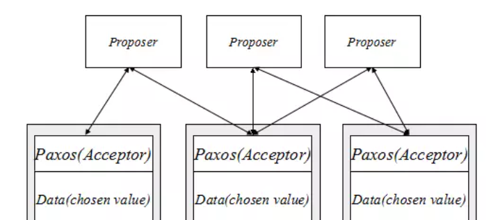

## 1. 前言
### 1.1. 什么是一致性问题？
&emsp;&emsp;数据库中的acid中的一致性，我个人理解为分散的数据状态是否符合我们的预期，他的一致性是又其它三个特性来保证的，和我们通常所说的cap中一致性不一样，它指的是冗余副本的一致性，即保持多个冗余数据的一致。即使我们解决了多副本的一致性问题，并不能解决分布式事务的一致性问题，可能需要两阶段提交等手段来保证。解决副本冗余一致性问题还涉及到拜根庭将军问题，即在不可靠的信道达到一致性是不可能的，paxos协议可以允许消息丢失但是不允许篡改。
  
### 1.2. 冗余数据一致性
&emsp;&emsp;强一致性要求所有的副本都必须要完成后才会返回结果，那么整个系统的可用性非常低，而paxos的思想就是客户端不必和所有的服务器通讯，只要大概有一半的服务器存活，就能保证容错性，即2N+1个节点中，有N个以上同意了某个决定，则认为系统达到了一致

## 2. 协议过程
### 2.1.协议举例  
&emsp;&emsp;世界末日到来，有15个导弹准备发射，对敌人进行最后一击，但是发射时间不确定，可以是8点、9点、10点，导弹不能先后发射，必须同时发射才能达到最好的效果。如何保证能够同时发射呢？  
这里还增加了5位互不通讯的指挥官，Paxos算法过程：    

发射基地视角：
  * 每一个导弹发射基地都不断的向5位指挥官发起沟通请求
  * 导弹发射基地得到半数指挥官的沟通同意回复方可进入发射时间沟通阶段
  * 指挥官接收发射基地的沟通请求，谁先请求就和谁沟通，并只能和一个基地沟通
  * 获得沟通机会的发射基地会有两种情况：
    * 半数以上的指挥官都没决定何时发射，此时该发射机基地就请求8点发射，此时也会产生两种结果
      * a)指挥官都同意了，其它的发射基地借用沟通机制迟早也会同意这个决定
      * b)指挥官被敌方干掉了或消息发送失败了，导致没有半数的指挥官同意，则该发送基地需要重新发送沟通请求了。
    * 非第一种情况，如果有半数决定某个发射时间点，就以这个时间点作为自己的选择，否则就选择最新的发射时间意见作为自己的决定。
  * 由上一步，某一时刻，如果有半数以上的指挥官一致决定某一时间发射，那么发射基地必然会选择这一发射提议，这样就会使得所有的发射基地都能够达到一致性     

指挥官视角：  
&emsp;&emsp;指挥官接收基地的沟通请求的时候，只接收最新的，不是新的就丢弃，和最新请求的基地沟通，和基地沟通的时候，接收基地的提议更新自己的决定。

### 2.2. 运用在副本数据    
&emsp;&emsp;由上面的例子可以了解到，paxos协议能够容忍一部指挥官节点下线，也能够完成一个一致性决定的协议。  
上面的机制到底是干什么用的呢？  
   
&emsp;&emsp;假设我们有三个acceptor节点，作为数据存储节点，proposer节点向acceptor节点提交数据，它遵守paxos协议，一旦有半数的数据提交成功了，那么就可以认为数据不可变更了，paxos协议保证后续从acceptor获取的数据是一致性的。  
&emsp;&emsp;例如mysql的Mgr主从复制机制，主备之间有多数派机器(N/2+1)是存活且它们之间的网络通讯正常，如果不满足这个条件，则无法启动服务，数据也无法写入和读取。  

## 3. 证明
## 4. 后记

